# Vue fonctionnelle

Alpha Trade est une plateforme de swing trading US long/short pilotée par ML. Elle transforme des données de marché et d'événements en un portefeuille cible, contrôle le risque, transmet les ordres à un broker et suit leur cycle de vie. Elle inclut une chaîne de recherche/backtest et une IHM Streamlit d'exploitation.

## Objectifs métier

- maintenir un univers de titres réellement tradables à une date donnée ;
- calculer des signaux sans fuite temporelle ;
- prédire et classer les opportunités de façon cross-sectionnelle ;
- construire un portefeuille compatible avec capital, liquidité, concentration et régime ;
- garder une trace explicable de chaque décision et de chaque ordre ;
- comparer backtest et production à contrats identiques autant que possible.

## Chaîne de décision

```mermaid
flowchart LR
  A[Données marché et événements] --> B[Qualité et alignement]
  B --> C[Univers tradable PIT full]
  C --> D[Features et contexte]
  D --> E[Prédictions et ranking ML]
  E --> F[Vetos, régime et risque]
  F --> G[Portefeuille cible]
  G --> H[Exécution broker]
  H --> I[Protections, fills, lots, TCA]
  I --> J[Réconciliation et supervision]
```

Le système ne doit pas ouvrir une nouvelle position si la prédiction ML attendue est absente ou incomplète. Le scanner et le selector n'ont pas autorité pour créer un signal score-only de remplacement.

## Concepts fondamentaux

### Univers tradable

Un snapshot immuable daté, de qualité `full`, publié dans `tradable_universe_runs` et `tradable_universe_history`. Il agrège notamment disponibilité des barres, liquidité, prix, spread/quote, capitalisation et blackout earnings. Il est la source nominale du train et du predict.

### Prédiction, côté et rang

Le système manipule plusieurs sorties ML. La prédiction ternaire exprime `long`, `flat` ou `short` et ses probabilités. Le Global Ranking estime un ordre relatif cross-sectionnel à plusieurs horizons. Le rang de sélection est antérieur aux contraintes ; le rang de décision correspond aux positions finalement acceptées.

### Oracle Extreme

L'Oracle O0 estime un potentiel de mouvement extrême, pas une direction. `proba_extreme` ne signifie donc jamais `P(LONG)`. Le gate officiel classe cette probabilité dans la coupe cross-sectionnelle du jour et peut retenir le top 20 % comme univers de recherche/filtrage.

### Portefeuille cible

Résultat du module de risque : symboles, côtés, tailles, niveaux de protection, rangs et raisons de décision. L'exécution consomme un snapshot de ces targets, jamais une recomposition implicite à partir de scores bruts.

### Lifecycle d'exécution

Ensemble du chemin target → intention → ordre broker → fill observé → position/lot → protection → réconciliation. Les stops, TP, trailing et time-stop doivent toujours être décrits avec leur contrat effectif, leur moment d'activation et leur règle intrabar.

## Modes opératoires

- `simulate` : déroule le contrat sans envoyer d'ordres réels ;
- `paper` : utilise un compte paper Alpaca ;
- `live` : argent réel, garde-fous renforcés et confirmation du label du compte ;
- `check` : vérifications/préflight sans workflow normal d'envoi.

## Ce que le produit ne garantit pas

Le logiciel n'élimine ni risque de marché, ni slippage, ni défaut de provider, ni divergence broker/base. Une métrique de backtest n'est pas une promesse de performance. Les branches de recherche ne sont pas automatiquement promues en production.

