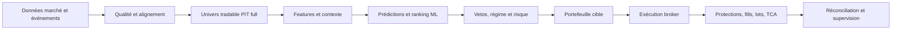

# Vue fonctionnelle

<!-- doc-status:start -->
> Statut documentaire au 2026-10-10 — Guide courant : lire aussi les contrats transverses actualisés. Les inventaires générés localisent le code ; ils ne prouvent ni état en base ni réussite opérationnelle. [Référence actuelle](ETAT_ACTUEL_IMPLEMENTATION.md).
<!-- doc-status:end -->

Alpha Trade regroupe recherche, ML, backtests et exploitation de stratégies actions.
Le parcours US dispose du risque, des ordres Alpaca et des protections. CN et FR
ont des bases, collectes et replays séparés ; leurs contextes n'autorisent pas
actuellement le trading broker autonome. L'IHM Streamlit expose ces parcours sans
que choisir un marché suffise à ouvrir son exécution.

État vérifié au 10/10/2026 : [contrats et limites actuels](ETAT_ACTUEL_IMPLEMENTATION.md).

## Objectifs métier

- maintenir un univers de titres réellement tradables à une date donnée ;
- calculer des signaux sans fuite temporelle ;
- prédire et classer les opportunités de façon cross-sectionnelle ;
- construire un portefeuille compatible avec capital, liquidité, concentration et régime ;
- garder une trace explicable de chaque décision et de chaque ordre ;
- comparer backtest et production à contrats identiques autant que possible.

## Chaîne de décision

```mermaid
flowchart LR
  A[Données marché et événements] --> B[Qualité et alignement]
  B --> C[Univers tradable PIT full]
  C --> D[Features et contexte]
  D --> E[Prédictions et ranking ML]
  E --> F[Vetos, régime et risque]
  F --> G[Portefeuille cible]
  G --> H[Exécution broker]
  H --> I[Protections, fills, lots, TCA]
  I --> J[Réconciliation et supervision]
```

Le système ne doit pas ouvrir une nouvelle position si la prédiction ML attendue est absente ou incomplète. Le scanner et le selector n'ont pas autorité pour créer un signal score-only de remplacement.

## Concepts fondamentaux

### Univers tradable

Dans le parcours US, un snapshot immuable daté, de qualité `full`, publié dans
`tradable_universe_runs` et `tradable_universe_history`. Il agrège disponibilité
des barres et filtres activés : liquidité, prix, quotes, capitalisation ou blackout
earnings. Train/predict peuvent aussi recevoir un fichier explicite ; ce fichier
n'est pas une autorisation d'entrée. La politique de capitalisation locale est
actuellement `liquidity_only`, pas `strict`. CN/FR ont leurs propres contrats
de référentiel et d'éligibilité, pas ces tables US implicitement partagées.

### Prédiction, côté et rang

Le système manipule plusieurs sorties ML. La prédiction ternaire exprime `long`, `flat` ou `short` et ses probabilités. Le Global Ranking estime un ordre relatif cross-sectionnel à plusieurs horizons. Le rang de sélection est antérieur aux contraintes ; le rang de décision correspond aux positions finalement acceptées.

### Oracle Extreme

L'Oracle O0 estime un potentiel de mouvement extrême, pas une direction. `proba_extreme` ne signifie donc jamais `P(LONG)`. Le gate officiel classe cette probabilité dans la coupe cross-sectionnelle du jour et peut retenir le top 20 % comme univers de recherche/filtrage.

L'intersection Oracle TOP20 × ATR TOP20 peut être activée dans les parcours
compatibles pour sélectionner l'amplitude. Elle ne démontre pas D1/D10.
La branche GPT PAPER analyse les N premiers au score Oracle, sans ajouter
implicitement ATR, et peut retenir LONG/SHORT ou s'abstenir. N=20 et plafond=3
dans la configuration locale ; la confidence GPT n'est pas une probabilité calibrée.

### Portefeuille cible

Résultat du module de risque : symboles, côtés, tailles, niveaux de protection, rangs et raisons de décision. L'exécution consomme un snapshot de ces targets, jamais une recomposition implicite à partir de scores bruts.

### Lifecycle d'exécution

Ensemble du chemin target → intention → ordre broker → fill observé → position/lot → protection → réconciliation. Les stops, TP, trailing et time-stop doivent toujours être décrits avec leur contrat effectif, leur moment d'activation et leur règle intrabar.

## Modes opératoires

- `simulate` : déroule le contrat sans envoyer d'ordres réels ;
- `paper` : compte paper Alpaca pour le parcours US ;
- `live` : argent réel, garde-fous renforcés et confirmation du label du compte ;
- `check` : vérifications/préflight sans workflow normal d'envoi.

Ces modes ne sont pas interchangeables entre marchés. Le shadow FR local est
une simulation ; les lectures Trading212 DEMO EUR ne qualifient pas encore
un moteur d'ordres et de protections autonome.

## Ce que le produit ne garantit pas

Le logiciel n'élimine ni risque de marché, ni slippage, ni défaut de provider, ni divergence broker/base. Une métrique de backtest n'est pas une promesse de performance. Les branches de recherche ne sont pas automatiquement promues en production.

