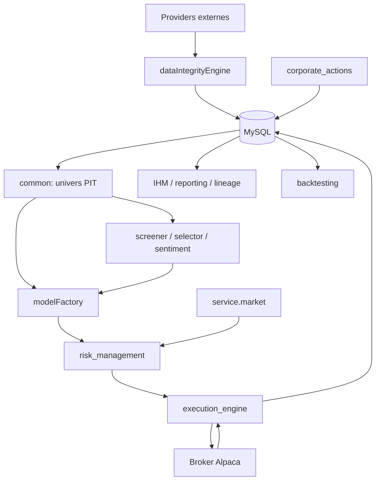

# Architecture globale

État multi-marchés au 10/10/2026 : [synthèse actuelle](ETAT_ACTUEL_IMPLEMENTATION.md).
Le graphe ci-dessous représente le parcours US ; CN/FR ne partagent pas sa base
et ne traversent pas automatiquement sa frontière broker.

## Découpage

| Couche | Packages | Responsabilité |
|---|---|---|
| Contrats partagés | `core/`, `common/` | types, décision ternaire, secrets, calendrier, coûts, univers PIT |
| Persistance | `database/`, `alembic/` | connexion, tables, repositories, migrations |
| Données | `dataIntegrityEngine/`, `service/` | providers, ingestion, nettoyage, fraîcheur |
| Signaux | `screener/`, `selector/`, `event_sentiment/` | scores, facteurs, sentiment, contexte |
| ML | `modelFactory/` | datasets, features, train, champions, predict, ranking, Oracle |
| Décision | `risk_management/`, `service/market/` | régime, vetos, sizing, contraintes, targets |
| Trading | `execution_engine/`, `corporate_actions/` | ordres, fills, protections, positions, cash ledger |
| Recherche | `backtesting/`, `formal/` | replay, coûts, parité, validation statistique et formelle |
| Exploitation | `ihm/`, `reporting/`, `lineage/`, `flows/` | UI, rapports, traçabilité, orchestration optionnelle |

## Flux et frontières d'autorité

Les dépendances institutionnelles importantes sont matérialisées par `.importlinter`. Les packages bas niveau ne doivent pas dépendre de l'IHM. Les clients externes vivent dans `service/`; les règles métier restent autant que possible injectables et testables.

## Points d'entrée

- `run.py` : lance l'IHM si Streamlit est disponible ;
- `ihm/app.py` : application Streamlit ;
- `python -m modelFactory` : train/predict ML ;
- `python -m risk_management.run_risk` : construction du portefeuille cible ;
- `python run_execution.py <mode>` : exécution canonique ;
- `python -m execution_engine` : façade de compatibilité, plus `cancel-all` ;
- `python -m backtesting` : CLI backtest ;
- `python -m corporate_actions` : sync/apply/status/run ;
- `python -m event_sentiment` : pipeline news/sentiment.
- `python -m service.forward_pit.batch --batch us_pipeline` : batch US configurable 1–14 ;
- `python -m service.forward_pit.batch` : familles Forward PIT US ;
- `python -m service.llm_directional.pipeline` : predict/analyse GPT, risque et exécution PAPER US ;
- les commandes des cartes Batch CN/FR : runners propres au marché, pas réutilisation aveugle des CLI US.

## Isolation des marchés et configurations

`common/market_context.py` résout le marché explicite ; sans marché, le fallback
legacy reste US avec avertissement. `database/router.py` et
`config/databases.yaml` allowlistent US_EQ/us_primary, CN_A/cn_primary et
FR_EQ/fr_primary, vers alpha_trade, alpha_trade_cn et alpha_trade_fr.
Partager des identifiants DB ne mélange pas les bases. FR contrôle notamment
le nom physique alpha_trade_fr ; un défaut US n'est pas un fallback FR sûr.

Les contextes sont dans `config/markets/market_us.yaml`, `market_cn.yaml` et
`market_fr.yaml`. Les profils `config_cn.yaml`/`config_fr.yaml`, leurs batchs
et protocoles de recherche restent distincts. Un consommateur doit charger
explicitement son profil ; il n'existe pas de fusion universelle de tous les YAML.

US : ingestion métier canonique et collectes prospectives versionnées sont
distinctes. FR : barres quotidiennes en staging SQL et fichiers, autres familles
principalement archivées en fichiers ; pas de promotion canonique automatique.
CN : propriétaire quotidien D9 actuellement bloqué par prudence sur les droits.
Voir [catalogue](operations/catalogue_batchs_actuel.md) pour les dépendances.

## Conventions transverses

- Python selon les contraintes de `pyproject.toml` et l'environnement installé ; SQLAlchemy, pandas/polars, PyTorch/Lightning, LightGBM/CatBoost, Streamlit. Une version utilisée localement ne qualifie pas toutes les dépendances.
- Dates de trading séparées des timestamps UTC ; le calendrier de marché est centralisé.
- Les prix canoniques sont ajustés des splits. Les dividendes passent par `portfolio_cash_ledger`.
- Les run summaries utilisent un schéma versionné et des compteurs de qualité.
- Les secrets sont résolus depuis l’environnement ou Vault selon le composant ; les contrôles de sentinelles dépendent du consommateur et ne remplacent pas une gestion de secrets.
- Les artefacts de modèle et rapports sont hors base, tandis que registry, prédictions, décisions et exécution sont persistés.

## Deux orchestrateurs à ne pas confondre

`ihm/services/pipeline_runner.py` décrit et pilote le workflow opérateur complet en 14 étapes. `flows/daily_pipeline.py` est un orchestrateur Python/Prefect opt-in plus ancien et minimal, dont les chemins de fonctions sont résolus dynamiquement et peuvent être absents. Pour comprendre la production locale actuelle, le pipeline IHM et les CLI de chaque module font autorité.

`service/forward_pit/us_pipeline.py` utilise le builder IHM avec des options
fraîches et un plan figé. Il ne copie pas une session Streamlit : la case GPT
cochée par défaut dans cette session ne l'active pas dans le batch Windows.
