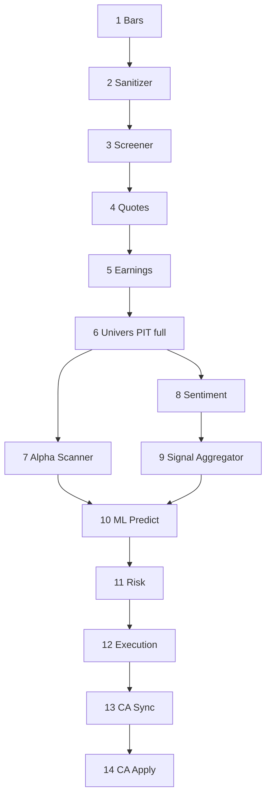

# Pipeline quotidien canonique

Le workflow exposé par `ihm/services/pipeline_runner.py` contient 14 étapes. L'entraînement T1 est volontairement hors pipeline quotidien.

Le dépôt contient aussi `flows/daily_pipeline.py`, orchestrateur Python/Prefect opt-in à cinq étapes avec imports lazy historiques. Il ne correspond pas au pipeline canonique IHM et plusieurs chemins qu’il tente d’importer peuvent être absents. Le considérer comme intégration auxiliaire/legacy ou support de tests, pas comme définition de production. `ALPHA_TRADE_USE_PREFECT=1` active Prefect si installé ; sinon les décorateurs sont pass-through.

## Graphe



## Détail des étapes

| # | Étape | Entrées | Sorties principales | Point de vigilance |
|---|---|---|---|---|
| 1 | Import bars | provider configuré, metadata | `stock_bars`, `stock_bars_daily` | EODHD et Alpaca sont mutuellement routés par `market_data.bars_provider` |
| 2 | Sanitizer daily | barres brutes | daily nettoyées, audits | calendrier, anomalies, source de prix |
| 3 | Screener | historique daily | `stock_scores` | contexte large, pas autorité ML |
| 4 | Latest quotes | Alpaca | `stock_quote_snapshots` | fraîcheur et biais IEX |
| 5 | Earnings | Finnhub/SEC | `stock_earnings_calendar` | bookmark et fenêtre temporelle |
| 6 | Publish universe | barres, scores, quotes, earnings, metadata | runs + history PIT | publication atomique `full` |
| 7 | Alpha Scanner | univers et features | enrichissement `stock_scores` | Minervini/VCP, facteurs, vetos |
| 8 | Sentiment | news et univers | tables news + agrégats quotidiens | alignement à l'effective trade date |
| 9 | Signal Aggregator | quant + sentiment + macro | `final_score_sentiment` | contexte, pas rang principal |
| 10 | ML Predict | champion publié + univers | `model_predictions`, sorties rank/oracle selon batch | aucun train implicite |
| 11 | Risk | prédictions, régime, compte | `risk_decisions`, `portfolio_targets` | fail-closed sur données critiques |
| 12 | Execution | target snapshot + broker | tables execution, positions, TCA | mode et compte explicitement contrôlés |
| 13 | CA Sync | positions détenues | `corporate_actions_events` | scope portfolio-only recommandé |
| 14 | CA Apply | événements pending | applications + cash ledger | idempotence et réconciliation |

## Étapes de bootstrap

- B1 import actifs Alpaca vers `stock_metadata` ;
- B2 enrichissement secteur/capitalisation ;
- B3 backfill historique EODHD avec bookmark.

## Politique d'échec

Chaque CLI publie un résumé de run et doit rendre l'échec visible. Une étape amont manquante ne doit pas être masquée par un fallback score-only. En paper/live, l'absence d'equity broker est bloquante. La reprise doit réutiliser les identifiants et mécanismes d'idempotence du module concerné, pas supprimer arbitrairement des lignes.

## Train offline

```powershell
python -m modelFactory --mode train --symbol-source tradable-universe
```

Le champion n'est publié qu'après évaluation, gouvernance et contrôles de compatibilité. Le predict quotidien le consomme ensuite.
