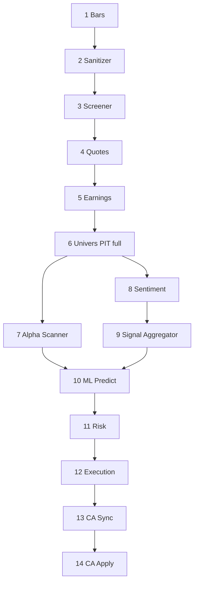

# Pipeline quotidien US et déclinaisons par marché

<!-- doc-status:start -->
> Statut documentaire au 2026-10-10 — Guide courant : lire aussi les contrats transverses actualisés. Les inventaires générés localisent le code ; ils ne prouvent ni état en base ni réussite opérationnelle. [Référence actuelle](ETAT_ACTUEL_IMPLEMENTATION.md).
<!-- doc-status:end -->

Le workflow US exposé par `ihm/services/pipeline_runner.py` offre 14 étapes.
Le cœur non personnalisé reste 1–12, avec opérations sur titres optionnelles ;
une sélection personnalisée conserve explicitement 13/14. T1 reste hors quotidien.
CN/FR ont des blocs et runners propres : cette chaîne Alpaca ne s'applique pas
implicitement à ces marchés. [État multi-marchés](ETAT_ACTUEL_IMPLEMENTATION.md).

## Batch planifié us_pipeline — configuration du 10/10/2026

`batch.yaml` règle son horaire (22:45 Europe/Paris, séances US lundi–vendredi),
ses fenêtres de collecte et le fichier commun
`config/univers_batch/univers_filtred_tradable.txt`. `config.yaml` règle :

```yaml
us_pipeline:
  steps: [1, 2, 3, 4, 5, 6, 7, 9, 10, 11, 12, 13, 14]
  steps_friday: [1, 2, 3, 4, 5, 6, 7, 8, 9, 10, 11, 12, 13, 14]
  execution_mode: paper
  account_id: default
```

Le vendredi est celui de la séance US figée, même si le run finit samedi Paris.
Les numéros doivent être uniques entre 1 et 14 ; ils sont exécutés dans l'ordre.
Une omission ne déclenche pas de prérequis implicite. Un échec arrête la suite,
sans annuler les commits précédents. LIVE est interdit pour ce batch.

Import EODHD : J est transmis explicitement ; le service attend le délai de
publication et contrôle la couverture de J, pas celle d'une ancienne séance.
Quotes J−7/J et earnings J−7/J+30 utilisent le fichier commun. Les étapes
2/6/7/9 gardent leurs périmètres natifs/dérivés. Les batchs autonomes quotes
et earnings sont désactivés car intégrés aux étapes 4/5.

Le batch utilise des options fraîches, pas la session Streamlit : **GPT reste
désactivé dans ce parcours planifié**, même si la case IHM est cochée par défaut.
Avant 12 PAPER, il vérifie/réutilise ou démarre un watcher continu sain. Celui-ci
reste actif après le run. 13/14 exigent un compte PAPER même si 12 est simulée :
14 peut écrire le ledger et n'est pas transformée en dry-run par ce mode.
[Contrat d'exploitation détaillé](operations/us_pipeline.md).

Le dépôt contient aussi `flows/daily_pipeline.py`, orchestrateur Python/Prefect opt-in à cinq étapes avec imports lazy historiques. Il ne correspond pas au pipeline canonique IHM et plusieurs chemins qu’il tente d’importer peuvent être absents. Le considérer comme intégration auxiliaire/legacy ou support de tests, pas comme définition de production. `ALPHA_TRADE_USE_PREFECT=1` active Prefect si installé ; sinon les décorateurs sont pass-through.

## Graphe


```mermaid
flowchart TD
  B[1 Bars] --> D[2 Sanitizer]
  D --> S[3 Screener]
  S --> Q[4 Quotes]
  Q --> E[5 Earnings]
  E --> U[6 Univers PIT full]
  U --> A[7 Alpha Scanner]
  U --> N[8 Sentiment]
  N --> G[9 Signal Aggregator]
  A --> P[10 ML Predict]
  G --> P
  P --> R[11 Risk]
  R --> X[12 Execution]
  X --> C1[13 CA Sync]
  C1 --> C2[14 CA Apply]
```

## Détail des étapes

| # | Étape | Entrées | Sorties principales | Point de vigilance |
|---|---|---|---|---|
| 1 | Import bars | provider configuré, metadata | `stock_bars`, `stock_bars_daily` | EODHD et Alpaca sont mutuellement routés par `market_data.bars_provider` |
| 2 | Sanitizer daily | barres brutes | daily nettoyées, audits | calendrier, anomalies, source de prix |
| 3 | Screener | historique daily | `stock_scores` | contexte large, pas autorité ML |
| 4 | Latest quotes | Alpaca | `stock_quote_snapshots` | fraîcheur et biais IEX |
| 5 | Earnings | fournisseur explicite, Finnhub dans le batch actuel | `stock_earnings_calendar` | bookmark et fenêtre J−7/J+30 du batch |
| 6 | Publish universe | barres, scores, quotes, earnings, metadata | runs + history PIT | publication atomique `full` |
| 7 | Alpha Scanner | univers et features | enrichissement `stock_scores` | Minervini/VCP, facteurs, vetos |
| 8 | Sentiment | news et univers | tables news + agrégats quotidiens | alignement à l'effective trade date |
| 9 | Signal Aggregator | quant + sentiment + macro | `final_score_sentiment` | contexte, pas rang principal |
| 10 | ML Predict | champion publié + univers | sorties rank/Oracle/direction selon batch ; analyse GPT optionnelle PAPER | aucun train implicite ; un Oracle-only ne donne pas P(LONG) |
| 11 | Risk | prédictions, régime, compte | `risk_decisions`, `portfolio_targets` | fail-closed sur données critiques |
| 12 | Execution | target snapshot + broker | tables execution, positions, TCA | mode et compte explicitement contrôlés |
| 13 | CA Sync | positions détenues | `corporate_actions_events` | scope portfolio-only recommandé |
| 14 | CA Apply | événements pending | applications + cash ledger | idempotence et réconciliation |

## Étapes de bootstrap

- B1 import actifs Alpaca vers `stock_metadata` ;
- B2 enrichissement secteur/capitalisation ;
- B3 backfill historique EODHD avec bookmark.

## Option IHM : Oracle → GPT avec Web → risque → PAPER

La case « Filtrage GPT + recherche Web après Oracle — PAPER uniquement »
ajoute l'analyse aux commandes 10/11/12 compatibles. Le modèle/batch/univers
viennent du bloc `llm_directional_filter` ou du choix explicite. Actuellement :
20 premiers Oracle au score, maximum 3 retenus LONG/SHORT, abstention possible.
Ce n'est ni Oracle TOP20 % ni Oracle × ATR automatique.

L'analyse attend la clôture de J et reste autorisée avant l'ouverture suivante,
y compris au matin Paris. Pas de Web historique ni Oracle shadow. Elle archive
le run exact dans les tables llm_directional_* ; le risque ne reprend pas un
« latest » d'une autre date/compte. Confidence non calibrée, protocole, sources,
validité et disponibilité des données restent contrôlés.

Protections spécifiques cochées : SL 7 % depuis le fill, pas de TP de prix,
sortie à l'ouverture de la séance 21 (entrée=1), trailing **15 % configuré**.
Le défaut Python du trailing est 20 %. Profil figé par run ; le décocher laisse
le contrat ordinaire. SHORT exige les permissions/ETB du compte et de l'actif.
Dans l'IHM manuelle, démarrer « 12.bis — Watcher post-exécution → service local »
avant l'exécution qui exige ce watcher. PC arrêté = watcher local arrêté.
[Contrat complet](ml/oracle_llm_directional_filter.md).

Le lancement isolé de 10 n'est plus conditionné au seul succès visuel de 9.
Cela ne supprime pas ses exigences réelles de features, date, couverture et batch.

## Politique d'échec

Chaque CLI publie un résumé de run et doit rendre l'échec visible. Une étape amont manquante ne doit pas être masquée par un fallback score-only. En paper/live, l'absence d'equity broker est bloquante. La reprise doit réutiliser les identifiants et mécanismes d'idempotence du module concerné, pas supprimer arbitrairement des lignes.

## Train offline

```powershell
python -m modelFactory --mode train --symbol-source tradable-universe
```

Le champion n'est publié qu'après évaluation, gouvernance et contrôles de compatibilité. Le predict quotidien le consomme ensuite.
