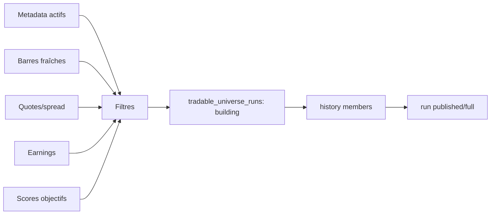

# Données, qualité et univers PIT

## Documents spécialisés

- [Ingestion EODHD et backfill](data/ingestion_eodhd.md)
- [Sanitizer daily et audits qualité](data/sanitizer_daily.md)
- [Univers tradable PIT et gate d'entrée](data/univers_pit.md)
- [Quotes, spreads et calendrier earnings](data/quotes_et_earnings.md)

Ce document donne la vue transversale. Les contrats algorithmiques, paramètres, erreurs et procédures de reprise vivent dans les références ci-dessus.

## Sources

- Alpaca : actifs, compte, ordres, positions, quotes et éventuellement barres IEX ;
- EODHD : barres consolidées, news et corporate actions selon configuration ;
- Finnhub/Yahoo/SEC : secteurs, capitalisations, earnings ou cross-checks ;
- Stooq/FRED/EODHD : macro et volatilité selon le provider choisi.

`market_data.bars_provider` choisit la source OHLCV active. Quand EODHD est actif, l'import Alpaca bars devient un no-op contrôlé, et réciproquement.

## Politique de prix

Le projet utilise `data_adjustment='split'`. Les splits sont neutralisés dans les séries de prix. Les dividendes ne sont pas réinjectés artificiellement dans le close : ils sont crédités séparément dans le cash ledger. Une performance totale correcte combine donc MTM des positions et cumul des flux cash.

## Nettoyage daily

`dataIntegrityEngine/data_sanitizer_daily.py` aligne le calendrier, contrôle OHLCV, détecte trous et anomalies et produit des audits latest/runs. Les modules aval doivent consommer la source daily conforme, pas choisir silencieusement une autre source.

## Publication atomique de l'univers



`common.tradable_universe` fournit les opérations begin, publish, fail et resolve-as-of. La publication doit être complète avant de devenir visible. `resolve_universe_asof` récupère le dernier snapshot admissible à une date donnée. `compute_universe_fingerprint` permet de détecter les changements de composition.

## Qualité `full`

Un univers nominal doit être complet et daté. Les mécanismes de `common.entry_data_gate`, `risk_management.data_criticality` et `freshness_gate` empêchent une entrée lorsque barres, quotes, prédictions ou autres données critiques sont absentes ou périmées.

## Biais IEX

Le feed gratuit IEX ne représente qu'une fraction du marché consolidé. Volume, VWAP et spread peuvent être biaisés. Le code calcule et propage des compteurs tels que volume nul, quote stale ou capitalisation stale dans les run summaries. Ces compteurs ne corrigent pas la donnée ; ils rendent sa limite observable.

## Contrat PIT

- aucune ligne postérieure à la date de décision ;
- disponibilité réelle de la donnée prise en compte, pas seulement sa date économique ;
- snapshots immuables et résolus as-of ;
- labels futurs confinés à l'entraînement/évaluation ;
- split walk-forward temporel ;
- fingerprint de features et d'univers conservé avec les artefacts.

## Modules associés

`common.data_availability` formalise les disponibilités, `common.market_calendar` les séances, `database.bar_metadata` la provenance, et `lineage/` peut enregistrer les relations de production d'artefacts.

---

## Référence détaillée du Data Integrity Engine

### Responsabilités et limites

Le package est responsable de l'acquisition, de la normalisation, de l'audit et de la publication des prérequis objectifs. Il ne calcule ni signal d'achat, ni côté ML, ni taille de position. Une barre présente en base n'est pas nécessairement admissible : elle doit satisfaire la convention de source, l'ajustement et les contrôles de fraîcheur.

| Fichier | Responsabilité réelle | Écritures principales |
|---|---|---|
| `import_alpaca_assets.py` | importe le référentiel d'actifs du compte/data API Alpaca | `stock_metadata` |
| `import_alpaca_bar.py` | ingestion incrémentale IEX lorsque provider `alpaca` | `stock_bars` |
| `import_eodhd_bar.py` | shim rétrocompatible vers le sous-package EODHD | aucune logique métier majeure propre |
| `eodhd/cli.py` | parsing des options et no-op si mauvais provider | run summary |
| `eodhd/orchestrator.py` | bulk, catch-up, splits, cache, quota, batches | `stock_bars`, `stock_bars_daily` |
| `eodhd/transforms.py` | normalisation pure, dédoublonnage et fenêtres manquantes | aucune |
| `backfill_eodhd_history.py` | historique long, bookmark et reprise | tables bars + bookmark disque |
| `data_sanitizer_daily.py` | alignement NYSE, fills courts, anomalies robustes | daily + cleaning audits + champs audit scores |
| `sync_latest_quotes.py` | snapshots bid/ask et diagnostic IEX vs consolidé | `stock_quote_snapshots` |
| `sync_earnings_calendar.py` | événements earnings Finnhub ou SEC | `stock_earnings_calendar` + bookmark |
| `update_sector.py` | secteur et capitalisation | `stock_metadata` |
| `data_source_health.py` | diagnostic de santé/provenance | rapport/summary |
| `cross_check_stooq.py` | contrôle externe de plausibilité | diagnostic, pas source canonique |

### Sélection des actifs

Le référentiel `stock_metadata` est la porte d'entrée. Les importeurs appellent `database.assets.build_eligible_stock_metadata_filters`; ils ne parcourent pas arbitrairement tous les symboles connus. Les champs utilisés couvrent statut actif, tradability, classe d'actif, disponibilité des barres et états de support. Les preferred shares/séries dont le mapping EODHD est connu comme non supporté sont ignorées proprement au fallback per-symbol et peuvent être marquées indisponibles en mode écriture.

### Ingestion EODHD : algorithme exact

1. Le CLI charge `config.yaml` et résout `market_data.bars_provider`.
2. Si le provider n'est pas `eodhd`, il publie un summary `mode=noop`, `skipped_reason=bars_provider=...`, zéro appel et sort avec code 0.
3. Il résout la date cible sur la dernière séance de marché.
4. Il construit l'univers explicite `--symbols` ou l'univers actif/tradable en base.
5. Il lit pour chaque symbole la dernière date `stock_bars` en timeframe `1D`.
6. Il effectue un bulk EODHD unique pour la date cible, puis l'indexe selon les symboles projet.
7. Pour chaque symbole, il utilise la ligne bulk si elle est plus récente. S'il existe un trou entre la dernière barre et la cible, il appelle l'endpoint per-symbol sur la fenêtre manquante.
8. Pour un symbole sans historique et absent du bulk, le fallback est limité par `--per-symbol-limit` (100 par défaut).
9. Les lignes sont normalisées, dédoublonnées par date et converties en prix split-only à partir des splits mis en cache.
10. En dry-run, les lignes sont seulement comptées/auditées. En `--write`, elles sont upsertées dans les deux tables et commitées par lots.
11. Le quota/circuit breaker est consulté avant et après les appels. Une ouverture du circuit arrête proprement le run avec `stopped_reason`.
12. Le cross-check Stooq est exécuté si activé, sans remplacer la source canonique.

Les constantes actuelles sont : `DEFAULT_PER_SYMBOL_LIMIT=100`, `DEFAULT_WRITE_COMMIT_EVERY_SYMBOLS=100` et offset bulk 2 heures. Une valeur `--commit-every-symbols 0` conserve un commit final unique.

### CLI EODHD

```powershell
# Simulation, aucune écriture (défaut)
python -m dataIntegrityEngine.import_eodhd_bar

# Run nominal persistant
python -m dataIntegrityEngine.import_eodhd_bar --write

# Date et sous-univers explicites
python -m dataIntegrityEngine.import_eodhd_bar --write `
  --target-date 2026-08-28 --symbols AAPL MSFT NVDA

# Contrôle de charge et désactivation du cross-check
python -m dataIntegrityEngine.import_eodhd_bar --write `
  --per-symbol-limit 50 --commit-every-symbols 100 --no-stooq-cross-check
```

Le code de sortie est 1 si `summary.errors > 0`, 0 sinon, y compris pour le no-op du mauvais provider. Le summary comprend progression, matched/missing bulk, catch-ups, lignes upsertées, commits, quota, circuit et cross-check.

### Écritures et idempotence EODHD

Les upserts mettent à jour OHLCV, volume, compte de trades/VWAP lorsque disponibles, `data_adjustment` et `data_source`. La clé existante de chaque table empêche les doublons date/symbole/timeframe. Un retry d'une même date remplace les valeurs de cette source ; il ne crée pas une deuxième barre.

L'importeur écrit directement `stock_bars_daily` en plus de `stock_bars`. Le sanitizer reste néanmoins nécessaire : il aligne le calendrier et produit les colonnes/audits aval. Ne pas déduire que la présence d'une ligne daily importée équivaut à un statut sanitaire réussi.

### Cache et quota

Le cache disque EODHD se trouve par défaut sous `artifacts/eodhd_cache`. Les splits utilisent une namespace et un TTL. En cas d'erreur réseau/quota/circuit sur les splits, le code journalise et met en cache une liste vide : le run peut continuer, mais le risque de convention doit être visible. Le quota tracker comptabilise appels réussis/échoués et expose l'état du circuit dans le summary.

### Backfill historique

`backfill_eodhd_history.py` est un one-shot reprenable. Il cible plusieurs années, accepte un sous-univers et persiste un bookmark. Le groupe `--dry-run/--write` est mutuellement exclusif et le dry-run est le défaut. `--resume/--no-resume` contrôle la reprise. Les commits sont batchés pour limiter la perte de progression.

Avant un backfill : mesurer le nombre de symboles et le quota, figer les dates, sauvegarder le bookmark et vérifier la convention split. Après : comparer couverture/date min/date max, trous de séances, source et ajustement avant d'ouvrir l'entraînement ML.

## Sanitizer daily : référence algorithmique

### Constantes et critères

| Paramètre | Valeur code | Effet |
|---|---:|---|
| benchmark | `SPY` | calendrier/référence disponible requise |
| padding fetch SPY | 10 jours | marge de récupération |
| rebuild lookback | 400 jours calendaires | fenêtre de reconstruction incrémentale |
| fenêtre anomalie | 20 | médiane et MAD roulantes |
| minimum rolling | 5 | observations avant diagnostic |
| seuil MAD | 5,0 | écart robuste minimal |
| seuil rendement | 2 % | deuxième condition d'anomalie |
| max fills consécutifs | 3 séances | au-delà : `DataQualityError` |
| commit batch | 50 symboles traités | transaction intermédiaire |
| ajustement | `split` | invariant de sortie |

### Traitement d'un symbole

Le sanitizer charge l'historique brut pertinent, valide et trie les lignes, détermine la fenêtre à reconstruire puis l'aligne sur les séances du benchmark. Pour une séance manquante courte, il crée une ligne remplie à partir du close antérieur, marque `is_filled`, recalcule le rendement et mesure la streak. Plus de trois séances remplies consécutivement rend la série dégradée et bloque son traitement normal.

Les anomalies utilisent une médiane roulante du rendement, puis une MAD de l'écart absolu. Une ligne est anormale seulement si l'écart dépasse cinq MAD **et** si le rendement absolu dépasse 2 %. L'anomalie est marquée ; elle n'est pas silencieusement remplacée.

### Transactions et audits

Chaque symbole produit un payload d'audit, qu'il réussisse, soit ignoré ou échoue. `cleaning_audit_latest` donne le dernier état ; `cleaning_audit_runs` conserve l'historique. Les champs missing/anomaly/status sont synchronisés dans `stock_scores` seulement lorsque pertinent. Un symbole sans nouvelle barre ne doit pas écraser un audit existant par des zéros.

Le run continue après une erreur symbole : il écrit un audit `failed` avec message, incrémente `failed_symbols`, et compte `degraded_symbols` pour `DataQualityError`. Une erreur globale de table/transaction reste bloquante. Le summary final expose ciblés, succès, échecs, skipped, degraded, lignes et commits.

## Quotes : fraîcheur et biais

`sync_latest_quotes.py` normalise timestamps Alpaca, bid/ask, tailles et calcule `spread_bps = (ask-bid)/mid * 10 000` lorsque les prix sont valides. Il sait travailler sur une date récente ou une période historique par blocs et symbol batches. Les snapshots alimentent le gate d'univers et les estimations de coûts.

Pour publier un univers à D, la quote utilisée doit être la plus récente dans `[D-max_quote_age_days, D]`; une quote future est interdite. Le diagnostic IEX compare quand possible au close consolidé et expose stale/missing/biais. Une quote absente n'est pas équivalente à spread nul.

## Earnings : disponibilité et reprise

Le synchroniseur accepte Finnhub ou SEC, fenêtre from/to, source de symboles, limite, pacing, progression et bookmark. Les résultats SEC sont dérivés de facts trimestriels sélectionnés. Le bookmark contient le contexte du run ; un changement incompatible de fenêtre/source ne doit pas reprendre aveuglément un ancien curseur.

Le blackout est calculé lors de la publication de l'univers à partir des événements connus. L'earnings date économique et la date à laquelle elle est connue sont des notions distinctes ; pour une recherche historique stricte, seules les annonces effectivement disponibles doivent être utilisées.

## Publication `tradable-universe` détaillée

### Dépendance au screener PIT

La publication `full` exige un snapshot screener complet **exact** pour la date demandée. Si une date manque dans un run de plage, les autres dates peuvent être publiées, le statut devient `incomplete_missing_screener_snapshots` et le CLI sort avec code 2. Il n'utilise pas un score actuel pour reconstruire silencieusement une date historique.

### Cascade des raisons de tradabilité

Pour chaque membre, le publisher agrège les raisons sources puis applique les contrôles dans un ordre déterministe : historique/barres/source/close et ADV, quote/spread sauf `--ignore-quotes`, market cap, puis earnings blackout. Le premier motif principal devient `tradability_reason_code`; l'ensemble dédupliqué reste dans `tradability_reasons`.

Un symbole n'est tradable que si le snapshot screener source le considère tradable **et** si la raison finale vaut `tradable`. Les diagnostics conservés par membre comprennent history days, bars available, data source, close, ADV USD, spread bps, market cap, ATR%20 et blackout.

### Publication atomique

1. `begin_universe_run` crée un run en construction avec `rows_expected`, date, preset, grade et fingerprint.
2. `publish_universe_run` écrit tous les membres et vérifie la complétude.
3. Le statut publié rend le snapshot résolvable.
4. Sur exception, `fail_universe_run` conserve le run échoué et sa raison.

Le fingerprint inclut run screener source, fingerprint source, preset et seuils effectifs. Avec `--ignore-quotes`, le seuil spread est explicitement retiré du fingerprint de contrôle.

### Commandes

```powershell
python -m common.publish_tradable_universe --trade-date 2026-08-28

python -m common.publish_tradable_universe `
  --start-date 2026-08-01 --end-date 2026-08-28

python -m common.publish_tradable_universe `
  --trade-date 2026-08-28 --capital-preset-key default `
  --max-quote-age-days 5
```

`--ignore-quotes` est une dérogation diagnostique explicite ; ne pas l'utiliser comme réparation d'une sync quotes en échec sans tracer la différence de contrat.

## Gate de données d'entrée

`common.entry_data_gate.EntryDataGate` distingue :

- critiques : `price_data`, `volume_adv` — absence, futur, staleness ou qualité dégradée bloque ;
- requises : `borrow`, `universe`, `corporate_actions` — défaut dégrade et doit réduire/adapter selon l'appelant ;
- optionnelles : `sentiment`, `macro`, `regime`, `earnings` — défaut toléré.

L'âge maximal par défaut est 26 heures. Pour chaque source, le résultat contient criticité, passed, reason et quality. `go` est vrai uniquement si aucune source critique ne bloque. `EntryDataBlocked` transporte le résultat complet pour audit.

## Diagnostic opérationnel

| Symptôme | Vérifications | Action sûre |
|---|---|---|
| import EODHD no-op | `bars_provider`, `skipped_reason` | corriger explicitement la config ou lancer le bon importeur |
| bulk vide | date cible, quota, publication EODHD, circuit | ne pas basculer automatiquement de provider ; relancer/catch-up contrôlé |
| beaucoup de fallback | mapping symboles, bulk date, dernière barre | limiter quota, inspecter exemples et support séries |
| sanitizer degraded | streak fills, trous, SPY, source | corriger/backfiller les barres puis relancer le symbole |
| anomalies nombreuses | split, source mixte, corporate action | vérifier ajustement et provenance avant suppression |
| quote stale | timestamp, compte/feed, séance | resynchroniser ; ne pas mettre spread à zéro |
| earnings absent | provider, clé, bookmark, mapping | reprendre le batch, ou bloquer/dégrader selon contrat |
| univers non publié | screener exact, rows expected, raisons | réparer l'étape amont et republier un nouveau run |
| taille univers chute | breakdown des reason codes | comparer fingerprint/seuils et données, pas seulement le total |

## Tests à exécuter lors d'une modification

Les suites ciblées portent notamment sur importeurs Alpaca/EODHD, transforms, quota/cache, sanitizer, quotes, earnings, assets et tradable universe. Ajouter un test de non-régression pour toute nouvelle raison de rejet, nouvelle source ou changement de convention. Les tests doivent couvrir dry-run, mauvais provider, retry idempotent, circuit ouvert, série vide, date future et publication partielle.
