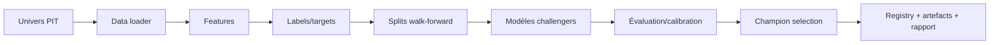

# Module ML — vue d'ensemble

## Documents spécialisés

- [Orchestration train/predict et artefacts](ml/orchestration_train_predict.md)
- [Features, contrats et labels](ml/features_et_labels.md)
- [Global Ranking](ml/global_ranking_reference.md)
- [Oracle Extreme O0](ml/oracle_extreme_reference.md)
- [Walk-forward, calibration et gouvernance](ml/validation_et_gouvernance.md)

Ce document positionne les familles. Les documents spécialisés détaillent les algorithmes et les contrats reproductibles.

`modelFactory/` couvre préparation des données, features, labels, walk-forward, entraînement, calibration, sélection de champion, persistance, inférence et dérive. Il contient aussi plusieurs branches de recherche clairement séparées.

## Modes CLI

Le point d'entrée est `python -m modelFactory`. Les modes principaux sont `train` et `predict`; des politiques de reconstruction/rafraîchissement existent pour les batches. Les sources autorisées incluent `tradable-universe`, `stock-bars-daily` et `ticket-recherche`, mais la production ML-first utilise `tradable-universe`.

## Familles de modèles

- per-symbol : modèles propres à un symbole lorsque cette branche est activée ;
- per-sector : modèles sectoriels, avec option d'utiliser `symbol` comme feature catégorielle ;
- global model historique : classification globale/stacking ;
- Global Ranking : classement cross-sectionnel multi-horizons ;
- Oracle Extreme O0 : probabilité de mouvement extrême indépendante du ranking ;
- challengers : LightGBM, CatBoost, baselines tabulaires et adaptateur LSTM.

Les flags `global_model_only`, `exclude_per_symbol_per_sector`, `enable_oracle_model` et `oracle_model_only` ont des effets différents. Notamment, `exclude_per_symbol_per_sector` conserve Global Ranking et Oracle, alors que `global_model_only` peut retourner plus tôt et les sauter.

## Train

`DataConfig` contrôle historique, horizons, feature set, target, filtres de liquidité et branches. `TrainingConfig` agrège les sous-configurations. La reproductibilité fixe et dérive les seeds par composant. Un contrat de features ordonné et fingerprinté accompagne les modèles.

## Features

`modelFactory/features.py` construit les familles techniques : momentum, volatilité, RSI, distances moyennes, range, ATR, volume et autres features expert. Des enrichissements opt-in ajoutent sentiment, scores screener, short score, macro, fondamentaux, CAPM/facteurs, cross-sectionnel, sector-neutral et composants de scores.

Une whitelist peut réduire l'espace final. Les colonnes structurelles restent protégées. Le Global Ranking supprime les features macro identiques pour tous les symboles d'une même date, car elles ne discriminent pas le rang intra-date.

## Labels et targets

Le code supporte `binary`, `swing_cash`, `ternary` et `regression`, avec `fixed_horizon` ou `triple_barrier` pour le ternaire. Le triple barrier possède ses propres multiples ATR et horizon : ce contrat de label n'est pas le lifecycle production. Les targets expérimentales comprennent excès vs SPY, rang intra-secteur et classification ternaire intra-secteur.

## Predict

Le predict résout le batch/champion, vérifie le contrat de features, calcule les sorties disponibles puis persiste `model_predictions`. Selon le type de batch, il peut synthétiser des prédictions depuis Global Ranking ou Oracle et alimenter les tables spécialisées. L'horizon de synthèse suit : flag CLI, `batch_diagnostics.live_horizon`, metadata du batch, puis défaut historique.

## Gouvernance

- `db_registry.py` et `model_registry` : état et metadata ;
- `champion_selection.py` : promotion ;
- `auto_rollback.py` : retour arrière ;
- `calibration.py`, `target_optimization.py` : calibration et seuils ;
- `drift_monitor.py`, `drift_policy.py` : dérive et politique ;
- `batch_diagnostics.py`, `report.py` : métriques et rapports ;
- `universe_guard.py`, `reproducibility.py` : garde-fous.

## Branches de recherche

`global_direction/`, `dip_research/` et `directional_data_research/` sont des laboratoires. Leurs résultats doivent passer un protocole OOS, une promotion explicite et un recheck sous contrat PROD avant d'affecter la production.

---

## Référence détaillée de l'orchestration

### Configuration composée

`modelFactory/config.py` définit des dataclasses immuables. `DataConfig` porte le contrat de donnée ; `ModelConfig` l'architecture LSTM ; `TrainingConfig` agrège données, modèle, walk-forward, calibration, baselines, reproductibilité, sélection de champion et optimisation des targets/seuils. Le CLI construit ces objets après validation : une valeur YAML seule ne prouve pas qu'elle est consommée par un run.

Paramètres structurants de `DataConfig` :

| Groupe | Paramètres | Conséquence |
|---|---|---|
| séquence | `sequence_length=60`, `min_history_days=504` | historique minimal et tenseur LSTM |
| horizons | `forecast_horizon`, `forecast_horizons` | single ou multi-horizon |
| période | `training_start_date`, `training_end_date` | cutoff temporel explicite |
| target | `target_mode`, `label_method`, thresholds | type de tâche et labels |
| features | `feature_set`, familles opt-in, whitelist | contrat X et fingerprint |
| scope | source symboles, limites, stratification | univers d'entraînement |
| branches | global-only, exclusions, Oracle-only | séquence exécutée |
| liquidité | volume, market cap, range, dollar volume, prix, spread | filtre pré-dataset |

Validations notables : ratios train/validation stricts et somme < 1 ; historique au moins séquence + horizon ; ternaire avec seuil haut positif et bas négatif ; triple barrier uniquement avec target ternaire ; dates ordonnées ; valeurs de décision dans ]0,1[.

### Sources de symboles

`tradable-universe` est le scope production. Il résout les snapshots PIT et préserve les changements historiques. `stock-bars-daily` est une source technique large utile au diagnostic mais ne reproduit pas automatiquement les règles de tradabilité. `ticket-recherche` est un sous-univers explicite de laboratoire. Les limites `global_ranking_max_symbols` et `per_symbol_max_symbols` peuvent sélectionner top volume ou une stratification par déciles ; elles changent la population et doivent figurer dans le rapport.

### Séquence d'entraînement

Le CLI crée un batch id, sauvegarde commande et configuration, applique la reproductibilité puis appelle l'orchestrateur. Selon les flags, celui-ci peut :

1. charger et contrôler l'univers ;
2. entraîner les modèles globaux/ranking ;
3. entraîner per-symbol ;
4. entraîner per-sector ;
5. évaluer challengers et baselines ;
6. sélectionner/publier les champions admissibles ;
7. entraîner Oracle Extreme à la fin ;
8. générer rapport Markdown, logs persistants et metadata.

`oracle_model_only` active implicitement Oracle et saute les autres familles. `exclude_per_symbol_per_sector` saute seulement ces deux familles et conserve ranking/Oracle. Ces flags ne sont pas interchangeables.

### Chargement et alignement

`data_loader.py` charge barres, benchmark, sentiment, selector, fondamentaux et scopes historiques. Chaque jointure doit être as-of ou sur une date effectivement disponible. Les séries sont normalisées par symbole/date avant `compute_features`. Une absence de colonne optionnelle peut être remplie par une valeur neutre selon la famille ; une colonne contractuelle requise manquante provoque une incompatibilité.

### Contrat de features

`get_feature_columns` construit une liste ordonnée à partir des flags. `compute_features` produit les colonnes. `build_feature_contract` enregistre noms, ordre, types/contexte et fingerprint ; `validate_feature_contract` compare l'inférence à l'entraînement. Renommer, réordonner ou activer une famille rend l'ancien artefact potentiellement incompatible.

Principales familles :

- rendements log/simples et moyennes roulantes ;
- momentum 3/5/10/20/60/120/250 ;
- volatilité 5/10/20/60, ratios et expansion ;
- RSI courts et standards ;
- SMA/EMA distances, range position, VWAP, gap ;
- ATR normalisé, ADX et dynamique de tendance ;
- volume ratios/z-scores et liquidité ;
- scores selector/screener et composants historiques ;
- sentiment ticker/secteur ;
- VIX/VXN/VIX3M/MOVE et régime ;
- fondamentaux et facteurs CAPM ;
- rangs cross-sectionnels, sector-neutral et interactions.

La whitelist s'applique après le calcul, sans supprimer les colonnes structurelles nécessaires. `force_v1_lstm` conserve un input dimension réduit pour la branche LSTM sauf override expert/whitelist.

### Labels

Pour `fixed_horizon`, le résultat futur est calculé à H dans le groupe symbole, puis transformé selon le target : classe, cash swing, ternaire ou régression. Les options excès vs SPY, scaling volatilité et rang intra-secteur changent la sémantique.

`labeling.py` implémente le triple barrier : stop ATR, TP ATR et durée maximale. Il résout l'ordre des barrières, déduit les coûts et produit une structure avec label, retour, durée et motif. Cette simulation est une fabrique de cible ; elle ne doit pas être citée comme preuve du comportement d'`execution_engine`.

### Walk-forward et reproductibilité

Les splits suivent des dates de trading et non des lignes aléatoires. Chaque fold entraîne sur le passé et prédit une fenêtre future. Les seeds sont dérivés depuis une racine et le nom du composant pour garder des essais reproductibles tout en évitant que tous les modèles partagent exactement le même flux aléatoire.

Pour juger un modèle : agréger les prédictions OOS uniquement, conserver métriques par split, vérifier distributions vraies/prédites, couverture, dates, univers et fingerprint. Une métrique issue du train ou d'un fold choisi après inspection n'est pas une preuve OOS.

### Modèles per-symbol et per-sector

Le per-symbol apprend la dynamique propre d'un ticker lorsque l'historique et les classes suffisent. Le per-sector mutualise les observations d'un secteur ; `sector_use_symbol_feature` contrôle si l'identité du symbole est injectée comme catégorie. Les branches peuvent utiliser LSTM attention, LightGBM, CatBoost ou baselines selon options et disponibilité des extras.

### Direction mutualisée conditionnelle à l'Oracle

La recherche directionnelle dispose aussi d'un modèle mutualisé expérimental qui
regroupe les événements TOP20 de l'Oracle strictement OOF. Il apprend directement
D1 contre D10 sur l'ensemble des symboles, conserve le symbole et le secteur comme
contexte catégoriel et transforme l'incertitude en abstention. Ce modèle reste hors
serving tant que ses gates OOS ne sont pas validés. Le contrat de population, les
garde-fous anti-fuite, les métriques de promotion et la commande sont détaillés dans
[Modèle directionnel mutualisé sur les événements Oracle](ml/shared_directional_oracle_events.md).

Les petits groupes, classes absentes et historiques insuffisants sont skipped avec diagnostic plutôt que forcés. Un champion par symbole/secteur ne doit être utilisé que si sa metadata couvre l'horizon, le target et les features du predict.

### Registry et artefacts

La base conserve batch, runs, métriques, gouvernance et états. Les poids, contrats et rapports vivent sous `artifacts/`. Un modèle n'est pas identifié seulement par un fichier : il faut batch id, famille, symbole/secteur, horizon, algorithme, feature fingerprint et période d'entraînement.

Les rapports sont écrits dans `artifacts/rapport_ml/<batch>.md` et les logs du batch sont extraits du log rotatif vers un fichier persistant. Un batch incomplet peut être nettoyé par l'outil dédié ; ne pas le promouvoir manuellement en éditant la registry.

## Référence détaillée du predict

### Résolution du batch

Le batch vient d'abord de `batch_diagnostics.backtest_batch_id` lorsqu'il est renseigné, sinon du dossier d'artefacts ou de l'option explicite selon le chemin. Le predict doit annoncer le batch résolu. Une absence de batch/champion est une erreur fonctionnelle, pas une invitation à utiliser le score scanner.

### Détection du chemin

Le CLI inspecte les modèles per-symbol/per-sector, l'historique Global Rank et les champions Oracle. Un batch Oracle-only est reconnu seulement s'il possède des champions Oracle et pas un historique rank-driven contradictoire. Un batch combiné exécute le flux principal, puis peut alimenter Oracle en complément. Les sorties sont ensuite synthétisées vers `model_predictions` lorsque le contrat le prévoit.

### Persistance

Les lignes de prédiction portent symbole, date, run/batch, classe/probabilité et sorties complémentaires disponibles. Pour le ternaire, conserver les trois probabilités et `predicted_side`. La probabilité de rang ou d'extrême ne doit pas être copiée dans `proba_long` sans transformation explicitement documentée.

### Historique et live

Le predict historique accepte une plage et doit reproduire chaque date avec son univers PIT. Le live utilise la dernière barre admissible et un champion déjà publié. Une inférence historique reconstruite aujourd'hui peut différer d'une prédiction réellement émise si données, univers ou modèle ont changé ; le run id permet de les distinguer.

## Calibration, sélection et drift

La calibration ajuste la correspondance score/fréquence sur une validation séparée. L'optimisation de seuil ne doit pas réutiliser le test final. La champion selection compare métriques principales, stabilité et contraintes de gouvernance. `auto_rollback.py` permet de revenir à un artefact antérieur selon politique plutôt que de réentraîner dans l'urgence.

Le drift monitor compare distributions, couverture et performances observables. Un drift ne signifie pas automatiquement que le modèle est mauvais : il peut venir de l'univers, d'une feature, d'une source ou du régime. La politique décide warning, shadow, rollback ou blocage.

## Diagnostic des échecs ML

| Symptôme | Causes probables | Vérification |
|---|---|---|
| zéro symbole | snapshot PIT absent, filtres liquidité, date | source, run univers, breakdown filtres |
| features manquantes | flag différent, migration/table, mauvais provider | contrat/fingerprint et colonnes calculées |
| classe short absente | target/seuil, période haussière, petit groupe | distribution par fold et symbole |
| métrique globale bonne mais instable | concentration temporelle/sectorielle | métriques par fold/régime/secteur |
| predict sans lignes | champion/batch/horizon incompatible | registry, artefacts, date et logs |
| côté inattendu | horizon de synthèse ou politique ternaire | priorité `synth_best_h` et probabilités |
| écart backtest/live | univers, données révisées, contrat lifecycle | fingerprints et audit de parité |

## Checklist de promotion

Commande et seed archivées ; code/commit connus ; période et folds gelés ; univers/fingerprint conservés ; features et labels audités PIT ; baselines battues ; métriques par fold stables ; coûts/capacité testés ; calibration séparée ; recheck sous contrat PROD ; shadow/paper ; stratégie de rollback disponible.
