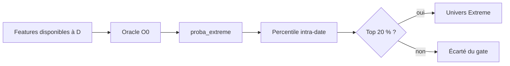

# ML — Oracle Extreme O0

Documentation approfondie : [dossier Oracle Extreme complet](ml/oracle/README.md).

## But

L'Oracle Extreme estime si un titre appartient aux mouvements cross-sectionnels extrêmes à horizon configuré, généralement H20. Il sert à étudier ou filtrer un univers à fort potentiel de mouvement. Il ne prédit pas le sens.

> `proba_extreme` = potentiel de mouvement extrême. Ce n'est ni `P(LONG)` ni une conviction directionnelle.

## Sous-modules

| Fichier | Rôle |
|---|---|
| `config.py` | charge la section `oracle` et résout le batch |
| `build_labels.py` | construit les labels extrêmes futurs |
| `dataset.py` | assemble les features PIT et les cibles |
| `leakage.py` | interdit features futures et disponibilités incompatibles |
| `train.py` | entraîne LightGBM/CatBoost classifier/regressor |
| `walk_forward.py` | folds temporels, OOS et persistance |
| `combine.py` | combinaison/calibration des scores |
| `predictions_store.py` | table `oracle_extreme_predictions` |
| `predict_history.py` | inférence historique/live des champions |
| `extreme_gate.py` | percentile quotidien et gate top pool |
| `hard_negatives.py`, `catastrophic_detector.py` | recherches sur erreurs difficiles |
| `audit.py`, diagnostics | qualité, features, confounds, sévérité |

## O0 et indépendance

La variante O0 est entraînée sans `global_rank_20`. Cette ablation vise à éviter la redondance et à garder l'Oracle indépendant du ranking B25. Le code vérifie les colonnes interdites et les dates de disponibilité.

## Gate TOP20

Pour chaque date D, le code calcule le percentile de `proba_extreme` parmi les candidats de D. Avec `pool_pct=0.20`, `extreme_gate=True` pour les percentiles supérieurs ou égaux à 0,80.

Le seuil est relatif au jour, sans seuil global appris sur le futur. Pour un DataFrame vide ou sans colonne de probabilité, le gate retourne faux.

## Évaluation

Le code expose AUC, precision/recall aux top percentiles, monotonie des déciles et métriques par fold. Une validation robuste vérifie aussi : couverture, calibration, stabilité temporelle, distribution sectorielle, hard negatives, coût des faux positifs et performance d'un portefeuille construit sans information directionnelle implicite.

## Utilisation production/recherche

Un batch Oracle-only peut remplir la table spécialisée puis synthétiser `model_predictions`. Un batch combiné peut faire tourner Oracle en complément du flux rank-driven. La présence d'artefacts Oracle ne signifie pas que le gate pilote automatiquement le portefeuille : le mode de cascade et la configuration effective doivent l'activer.

Deux modes Extreme Gate sont exposés dans le backtest : `extreme_gate` conserve le chemin
historique LONG, tandis que `extreme_gate_directional` utilise l’Oracle pour sélectionner
l’amplitude puis compare `proba_long` et `proba_short` du modèle Per-Symbol. Le détail des
seuils, scores, sources de batch et options IHM est documenté dans
[Mode cascade](mode_cascade.md).

## Contrat lifecycle

Les labels Oracle et les backtests E6–E13 ont pu utiliser un lifecycle de recherche différent. Toute promotion exige un replay avec stop, TP, trailing, time-stop, gap filter, entry timing et résolution intrabar exactement identiques à PROD.
