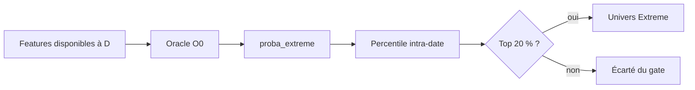

# ML — Oracle Extreme O0

<!-- doc-status:start -->
> Statut documentaire au 2026-10-10 — Guide courant : lire aussi les contrats transverses actualisés. Les inventaires générés localisent le code ; ils ne prouvent ni état en base ni réussite opérationnelle. [Référence actuelle](ETAT_ACTUEL_IMPLEMENTATION.md).
<!-- doc-status:end -->

Documentation approfondie : [dossier Oracle Extreme complet](ml/oracle/README.md).

## Parcours actuels — 10 octobre 2026

L'horizon est celui de l'artefact Oracle (`oracle_horizon`), pas un H20
supposé à partir du modèle Per-Symbol. H5/H10/H15/H20 doivent être affichés et
comparés avec leurs propres labels/folds/maturité. Un label futur ou une liste
de rendements réalisés ne fournit pas une direction prédite.

La sélection Oracle × ATR compatible backtest/live est décrite dans
[le gate d'amplitude](ml/oracle_atr_amplitude_gate.md). Elle ne réentraîne pas
l'Oracle et ne change pas ses probabilités ; les activations de cascade/live
restent séparées. Le booléen ATR local est true mais le serving Oracle tradable
reste off et extreme_gate.enabled=false : vérifier le parcours réellement activé.

Le [filtre GPT PAPER](ml/oracle_llm_directional_filter.md) est une autre branche :
N premiers au score Oracle, analyse prospective avec Web, LONG/SHORT/abstention,
puis risque. Il n'ajoute pas implicitement ATR. N=20/K=3 configurés actuellement,
pas TOP20 % ; confidence non calibrée, aucune preuve de gain automatique.

L'[étude quotidienne Oracle × ATR](ml/oracle_atr_market_regime_daily.md) conserve
les futurs réalisés, cinq listes entières signées et leur couverture. La liste
`predicted_oracle_score_order_returns_pct` garde l'ordre prédit ; le signe est
le résultat réel, jamais une sortie directionnelle de l'Oracle.

## But

L'Oracle Extreme estime si un titre appartient aux mouvements cross-sectionnels extrêmes à horizon configuré, généralement H20. Il sert à étudier ou filtrer un univers à fort potentiel de mouvement. Il ne prédit pas le sens.

> `proba_extreme` = potentiel de mouvement extrême. Ce n'est ni `P(LONG)` ni une conviction directionnelle.

## Sous-modules

| Fichier | Rôle |
|---|---|
| `config.py` | charge la section `oracle` et résout le batch |
| `build_labels.py` | construit les labels extrêmes futurs |
| `dataset.py` | assemble les features PIT et les cibles |
| `leakage.py` | interdit features futures et disponibilités incompatibles |
| `train.py` | entraîne LightGBM/CatBoost classifier/regressor |
| `walk_forward.py` | folds temporels, OOS et persistance |
| `combine.py` | combinaison/calibration des scores |
| `predictions_store.py` | table `oracle_extreme_predictions` |
| `predict_history.py` | inférence historique/live des champions |
| `extreme_gate.py` | percentile quotidien et gate top pool |
| `hard_negatives.py`, `catastrophic_detector.py` | recherches sur erreurs difficiles |
| `audit.py`, diagnostics | qualité, features, confounds, sévérité |

## O0 et indépendance

La variante O0 est entraînée sans `global_rank_20`. Cette ablation vise à éviter la redondance et à garder l'Oracle indépendant du ranking B25. Le code vérifie les colonnes interdites et les dates de disponibilité.

## Gate TOP20

Pour chaque date D, le code calcule le percentile de `proba_extreme` parmi les candidats de D. Avec `pool_pct=0.20`, `extreme_gate=True` pour les percentiles supérieurs ou égaux à 0,80.

```mermaid
flowchart LR
  F[Features disponibles à D] --> O[Oracle O0]
  O --> P[proba_extreme]
  P --> R[Percentile intra-date]
  R --> G{Top 20 % ?}
  G -->|oui| C[Univers Extreme]
  G -->|non| X[Écarté du gate]
```

Le seuil est relatif au jour, sans seuil global appris sur le futur. Pour un DataFrame vide ou sans colonne de probabilité, le gate retourne faux.

Lorsque le filtre tradable Oracle est activé, la politique recommandée `filter_then_top20` recalcule le TOP20 après intersection avec l’univers tradable PIT. Voir [Oracle TOP20 sur univers tradable — backtest et live](ml/oracle_tradable_top20_backtest_live.md) pour le contrat complet.

## Évaluation

Le code expose AUC, precision/recall aux top percentiles, monotonie des déciles et métriques par fold. Une validation robuste vérifie aussi : couverture, calibration, stabilité temporelle, distribution sectorielle, hard negatives, coût des faux positifs et performance d'un portefeuille construit sans information directionnelle implicite.

## Utilisation production/recherche

Un batch Oracle-only peut remplir la table spécialisée puis synthétiser `model_predictions`. Un batch combiné peut faire tourner Oracle en complément du flux rank-driven. La présence d'artefacts Oracle ne signifie pas que le gate pilote automatiquement le portefeuille : le mode de cascade et la configuration effective doivent l'activer.

Deux modes Extreme Gate sont exposés dans le backtest : `extreme_gate` conserve le chemin
historique LONG, tandis que `extreme_gate_directional` utilise l’Oracle pour sélectionner
l’amplitude puis compare `proba_long` et `proba_short` du modèle Per-Symbol. Le détail des
seuils, scores, sources de batch et options IHM est documenté dans
[Mode cascade](mode_cascade.md).

## Contrat lifecycle

Les labels Oracle et les backtests E6–E13 ont pu utiliser un lifecycle de recherche différent. Toute promotion exige un replay avec stop, TP, trailing, time-stop, gap filter, entry timing et résolution intrabar exactement identiques à PROD.
