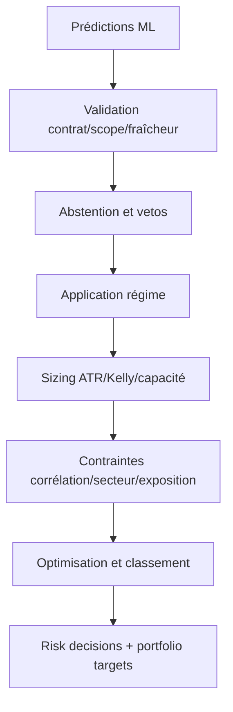

# Gestion du risque et construction du portefeuille

## Documents spécialisés

- [Contrat ML-first et séquence du run risque](risk/contrat_ml_first.md)
- [Sizing, ATR, Kelly, liquidité et levier](risk/sizing_et_levier.md)
- [Contraintes et optimisation du portefeuille](risk/contraintes_portefeuille.md)
- [Contrôles, journal et circuit breaker](risk/controles_et_audit.md)

Le [régime de marché](10_regime_marche.md) dispose également de sa référence autonome.

`risk_management/` transforme des candidats ML en décisions auditables et en `portfolio_targets`. Le module est fail-closed pour les données critiques et applique le régime, les limites de compte, la liquidité et les contraintes de concentration.

## Séquence logique

## Entrées

- univers tradable PIT `full` ;
- prédictions et probabilités du batch attendu ;
- scores/selector comme contexte ou veto ;
- snapshot de régime ;
- equity, buying power, positions et préférences du compte ;
- ATR, prix, volume, spread, corrélations et secteurs ;
- état circuit breaker, drawdown et ramp-up.

## Contrats ML

`ml_gate.py`, `selection_contract.py` et `core/ml_selection_contract.py` vérifient que scope, date, batch et sorties ML correspondent. `abstention.py` peut refuser les probabilités ambiguës. `conviction.py` convertit les sorties en conviction sans rendre un score auxiliaire souverain.

## Sizing

`position_sizer.py`, `kelly.py`, `capacity.py` et `liquidity.py` combinent risque unitaire, distance au stop, capital, fraction Kelly, capacité et limites de poids. Les quantités passent par les utilitaires communs qui gèrent les fractions et l'arrondi. Le risque monétaire d'une position dépend du mouvement jusqu'au stop, pas seulement de sa valeur notionnelle.

## Contraintes

- nombre maximal de positions ;
- poids maximal par position et secteur ;
- gross/net exposure et sleeves long/short ;
- concentration et corrélations ;
- liquidité, spread et capacité ;
- pertes journalières et drawdown ;
- régime normal/capital preservation/close-only/cash-only ;
- limites de levier et buying power broker.

`portfolio_optimizer.py` arbitre les candidats sous contraintes. `selection_rank` décrit l'ordre initial ; `decision_rank` l'ordre des acceptations finales.

## Levier

La politique `regt_swing` est bornée et conditionnée au type margin, à l'equity minimale, au mode d'entrée et au régime. Le code plafonne le levier overnight, privilégie les champs de buying power configurés et peut désactiver le levier si l'information manque. Le broker reste l'autorité finale sur le buying power.

## Stops et protections

`stop_calculator.py` calcule les niveaux initiaux. `protection_contract.py` formalise ce que l'exécution et le watcher doivent recevoir. Le niveau du target n'est pas encore un ordre broker : il doit être matérialisé et confirmé par l'exécution.

## Traçabilité

Chaque candidat doit produire une décision, y compris un rejet, avec raisons structurées. `decision_fingerprint.py` et `immutable_journal.py` empêchent les changements silencieux. `audit.py`, `batch_diagnostics.py`, `daily_reconciliation.py` et `shadow_*` servent à expliquer, comparer et rapprocher.

## Garde-fous opérationnels

`live_pipeline_guards.py`, `freshness_gate.py`, `data_criticality.py`, `pre_live_checklist.py` et `operational_controls.py` bloquent les états dangereux. `gradual_ramp_up.py` limite une montée en charge. `circuit_breaker.py` peut interdire de nouvelles entrées ou forcer un mode défensif.

---

## Référence détaillée du run de risque

### Point d'entrée et cycle

`risk_management/run_risk.py` délègue à `risk_management.cli.main`. Le CLI charge compte, date, configuration et données, construit le snapshot de régime, exécute les gates puis persiste un run complet. `--dry-run` empêche les écritures finales mais ne doit pas changer les calculs métier. L'equity passée explicitement sert aux simulations ; en exploitation elle doit correspondre au snapshot broker.

Un run suit conceptuellement ces phases :

1. résoudre date, compte et configuration effective ;
2. charger le snapshot univers `full` et les prédictions du batch attendu ;
3. contrôler date, couverture, fraîcheur et criticité ;
4. obtenir le régime et l'état des protections/circuit breaker ;
5. normaliser les candidats et le côté ternaire ;
6. appliquer abstention et vetos post-ML ;
7. calculer risque par action, conviction et taille brute ;
8. appliquer capacité, liquidité, corrélation, concentration et sleeves ;
9. optimiser sous exposition/buying power ;
10. écrire chaque décision, y compris les rejets, puis les targets acceptées ;
11. publier summary, fingerprint et diagnostics.

### Modèle candidat/décision

`models.py` porte les structures de candidat enrichi, décision et target. Un candidat conserve symbol, côté, probabilités/rang, prix, ATR, secteur, liquidité et contexte. Une décision ajoute statut, quantité/poids, raisons, rangs et niveaux de risque. Ne pas réduire l'audit à la seule table des targets : les rejets expliquent les changements de portefeuille.

### Validation ML-first

La jointure univers-prédictions est stricte sur date et symbole. Les prédictions futures sont interdites. Une couverture partielle n'est pas complétée par `stock_scores`. La politique ternaire centrale valide probabilités finies, bornées et cohérentes, puis décide le côté selon seuils/marges. Une classe `flat` n'est pas un long faible : elle signifie abstention.

`batch_diagnostics.py` mesure notamment couverture et distribution. `model_registry.py` résout le modèle attendu. `drift_monitor.py` peut signaler une distribution anormale. Un batch inattendu doit bloquer ou être explicitement shadow, pas être accepté parce qu'il contient des lignes récentes.

### Ordre des filtres

L'ordre est important : les gates critiques et le régime doivent agir avant le sizing coûteux ; les contraintes portefeuille s'appliquent après une taille candidate. Un rejet précoce conserve sa raison primaire. Si plusieurs raisons existent, l'audit doit garder la liste au lieu d'écraser le diagnostic par la dernière contrainte.

Catégories usuelles : données manquantes/stale, prédiction absente, abstention, côté interdit, earnings, spread/liquidité, régime/secteur, corrélation, concentration, budget de risque, buying power, nombre de positions et circuit breaker.

## Calcul de taille

### Risque unitaire

Pour une position long, le risque unitaire est typiquement `entry - stop`; pour un short `stop - entry`. Une distance non positive ou non finie invalide le candidat. Le budget monétaire de position est une fraction de l'equity, modulée par conviction, Kelly, régime et ramp-up. La quantité brute est budget / risque unitaire, puis bornée par poids, liquidité et buying power.

### ATR et stop initial

`stop_calculator.py` calcule la distance selon ATR et configuration du côté. Le prix et l'ATR doivent être contemporains de la décision. Une valeur ATR manquante ne doit pas être remplacée par un pourcentage implicite sans reason code. Le stop est arrondi selon tick/precision broker seulement après le calcul de risque, et le système doit revérifier la limite après arrondi.

### Kelly

`kelly.py` estime une fraction à partir de win probability et payoff lorsque les données sont suffisamment robustes, puis applique un fractionnement/plafond. Kelly n'autorise jamais à dépasser les limites absolues. Si l'estimation est absente ou instable, le fallback configuré doit être conservateur et journalisé.

### Capacité et liquidité

La capacité borne la quantité par participation au volume/dollar volume. Le spread et l'âge de quote sont contrôlés. Pour un short, borrow/shortability est une donnée spécifique. Une quantité fractionnaire passe par `common.quantity_utils`; certaines catégories d'ordre ou d'actif peuvent exiger un entier.

## Construction sous contraintes

### Expositions

Le poids notionnel est valeur absolue de position / equity. Gross = somme absolue ; net = longs moins shorts. Les plafonds s'appliquent au portefeuille existant plus les nouveaux targets, pas uniquement aux nouveaux achats. Les sleeves peuvent réserver une part au long/short et empêcher un côté de consommer le budget de l'autre.

### Concentration

`concentration.py` calcule les expositions ; `concentration_constraints.py` applique limites position/secteur et autres regroupements. La normalisation sectorielle doit traiter les secteurs inconnus explicitement. Un cap sectoriel ne garantit pas l'indépendance : le filtre corrélation utilise les historiques disponibles pour limiter des positions proches.

### Optimisation

`portfolio_optimizer.py` sélectionne sous contraintes selon rang/conviction et peut réduire plutôt que rejeter lorsque la politique l'autorise. L'optimisation est déterministe à inputs identiques. Après chaque acceptation, les budgets restants sont recalculés. `decision_rank` n'est attribué qu'aux décisions finales selon le contrat courant.

## Drawdown, pertes et circuit breaker

La configuration distingue plafonds PROD et backtest. Le circuit breaker inspecte equity/cash, PnL journalier, drawdown, qualité des données et contrôles opérationnels. Il renvoie un statut structuré et peut envoyer une alerte. Les transitions sont conservées : une reprise ne réinitialise pas l'historique de drawdown en choisissant un nouveau run id.

`gradual_ramp_up.py` limite exposition/positions après démarrage ou incident. `transition_handler.py` produit les actions nécessaires quand le régime devient restrictif : conserver, réduire, fermer ou interdire les entrées.

## Levier Reg-T détaillé

La feature exige `leverage.enabled`, le mode `regt_swing`, equity >= minimum et éventuellement compte margin. `only_in_entry_mode=normal` interdit l'activation dans un mode d'entrée différent ; `disable_in_capital_preservation` l'éteint en CP. Le levier cible reste borné à 2,0 dans le code, même si YAML demande davantage.

Le buying power est lu selon une priorité de champs configurée. La disponibilité broker et le plafond notionnel s'appliquent tous deux ; le minimum des capacités gagne. Si aucun champ n'existe, la politique choisit désactivation ou fallback défensif, jamais une invention silencieuse de pouvoir d'achat.

## Persistance et preuve

Un run de risque doit permettre de reconstruire : inputs, snapshot de régime, config, batch ML, univers, raisons par symbole, tailles avant/après contraintes et totals portefeuille. `decision_fingerprint.py` calcule une empreinte stable ; `immutable_journal.py` protège le journal. `shadow_engine.py` peut produire une décision alternative sans remplacer le chemin principal ; `shadow_compare.py` explique les différences.

## Diagnostic

| Symptôme | Inspection |
|---|---|
| aucun target | breakdown des rejets, batch/date, régime, circuit breaker |
| trop de `flat` | probabilités, seuils, calibration et marge ternaire |
| taille zéro | ATR/stop, budget, min notionnel, arrondi, capacité |
| gross dépasse l'attendu | positions existantes, sleeves, equity et levier effectif |
| secteur saturé | mapping secteur et ordre des candidats |
| divergence live/backtest | config PROD/backtest, snapshot régime, buying power et arrondi |
| décisions changent au rerun | données mutées, date as-of, batch ou non-déterminisme |

## Tests indispensables

Tester long/short/flat, données critiques absentes, quote stale, ATR nul, fractionnaire, secteur/corrélation, drawdown, chaque régime, buying power absent, levier > plafond, portefeuille préexistant, déterminisme et idempotence des écritures. Toute nouvelle contrainte doit avoir un test d'ordre et un reason code.
