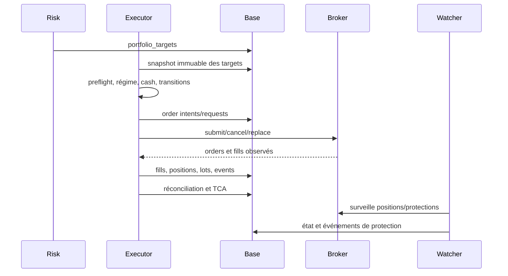

# Exécution, ordres et protections

## Documents spécialisés

- [Lifecycle des ordres et machine d'état](execution/lifecycle_ordres.md)
- [Protections OCO, break-even, trailing et watcher](execution/protections_et_watcher.md)
- [Réconciliation, reprise et TCA](execution/reconciliation_et_tca.md)

## Point d'entrée canonique

`python run_execution.py simulate|paper|live|check` est le launcher du flux normal. `python -m execution_engine` reste une façade de compatibilité et conserve la commande native `cancel-all`.

En paper/live, l'equity doit venir du broker : l'échec de lecture est bloquant. En live, l'opérateur doit ressaisir exactement le label du compte. Le couple compte/mode est résolu via `service.alpaca.accounts.AccountRegistry`.

## Lifecycle



## Phases

`execution_engine/executor.py` orchestre des phases détaillées dans `executor_phases.py` : validation du run risque, snapshot des targets, construction des intentions, transitions du portefeuille, soumission, observation des fills, reconstruction des positions/lots, réconciliation et TCA. Les transitions peuvent annuler, liquider ou réduire avant les nouvelles entrées.

## Modèle de données

- `execution_runs` : run et statut ;
- `execution_targets_snapshot` : entrée immuable ;
- `execution_order_requests` : intention normalisée ;
- `execution_broker_orders` et `execution_broker_fills` : vérité observée ;
- `execution_positions` et `execution_position_lots` : reconstruction interne ;
- `execution_events` : journal ;
- `execution_reconciliation_results` : écarts ;
- snapshots broker compte/positions ;
- sorties TCA.

La réponse de soumission n'est pas un fill. Seuls les événements/états broker confirmés doivent modifier les quantités exécutées.

## Protections

`oco_manager.py` gère les enfants stop/TP lorsque le broker et le contrat le permettent. `children_submission.py` matérialise les ordres enfants. `protection_break_even.py`, `protection_transition.py` et `protection_state_bridge.py` gèrent activation, passage break-even et continuité d'état.

Le watcher `protection_watcher.py` est post-run et secondaire mais obligatoire en live selon les probes. Il surveille les positions, adopte éventuellement des achats manuels orphelins selon la politique, vérifie les protections et effectue les transitions autorisées. `--auto-watcher` lance le processus détaché ; son état de santé reste supervisé.

## Réconciliation et reprise

`broker_state_sync.py`, `reconciliation.py` et `reconcile_statement.py` rapprochent base, broker et relevés. `orphan_adoption.py` traite les positions inconnues avec des règles explicites. Toute reprise doit être idempotente : réobserver le broker avant de renvoyer un ordre et conserver les identifiants client.

## TCA

`tca.py` mesure l'écart entre prix de décision/référence et fill, délai et coûts. Ces métriques servent à distinguer qualité du signal et qualité d'exécution.

## Checklist live

Compte, mode, horloge marché, régime, equity/buying power, cash ledger, targets, fraîcheur, watcher, protections, positions orphelines, ordres ouverts et réconciliation doivent être verts. Un échec de probe critique bloque le run.

---

## Référence détaillée du launcher

### Résolution du compte et du mode

Le premier argument choisit `simulate`, `paper`, `live` ou `check`. Le compte est résolu dans le registre Alpaca ; sa configuration contient id, label, credentials, mode et `long_only`. Un compte configuré paper ne doit pas être utilisé comme live par simple flag. Le mode live déclenche confirmation humaine du label et vérifications supplémentaires.

Le launcher charge le dernier run de risque ou celui explicitement demandé, sa trade date et ses targets. Il photographie l'état du broker avant mutation. En paper/live, `get_account_equity()` est obligatoire ; l'ancien fallback 100 000 $ n'est plus accepté.

### Préflight

Les probes couvrent secrets/compte, marché, DB, targets, cohérence date, cash ledger, régime, positions/ordres, réconciliation et watcher. `market_regime_preflight.py` vérifie que le mode d'exécution respecte le snapshot. `cash_ledger_guard.py` empêche une incohérence financière connue de continuer. `preflight.py` agrège les résultats avec statut et message.

`check` sert à exécuter les vérifications sans le cycle normal. `simulate` reste le test recommandé d'un nouveau target, mais il ne valide ni connectivité d'envoi ni comportement réel des fills.

## Contrat target → intention

`execution_targets_snapshot` fige les targets au début. L'executor compare target et position broker observée pour calculer un delta. `order_intents.py` transforme ce delta en intention d'achat, vente, réduction ou clôture avec côté, quantité, prix/règles et identifiant client. Les petites différences dues à l'arrondi utilisent les tolérances communes ; elles ne doivent pas provoquer une boucle d'ordres.

Les transitions défensives sont traitées avant les entrées : annulation d'ordres incompatibles, liquidation ou réduction selon le plan du régime. Le summary sépare compteurs cancelled, liquidated, reduced et failed.

## États d'ordre et vérité broker

`state_machine.py` définit les transitions autorisées. Un request local commence avant la soumission ; la réponse broker crée/met à jour l'ordre, puis les observations successives mènent à partial fill, filled, cancelled, rejected ou expired. Une transition impossible est une anomalie, pas un nouveau statut libre.

Le fill porte quantité et prix réellement exécutés. Plusieurs partial fills s'agrègent sans dépasser la quantité. Les positions et lots sont reconstruits à partir des fills observés et rapprochés du broker. Un timeout HTTP après submit est ambigu : rechercher par client order id avant tout retry.

## Enfants stop/TP et OCO

L'intention d'entrée transporte le contrat de protection issu du risque. Selon capacités broker et politique, l'executor soumet des enfants stop/TP ou un ensemble OCO. Les enfants ne sont soumis qu'après une quantité effectivement remplie suffisante. En partial fill, leur quantité doit suivre la position protégée sans dépasser l'exposition.

Une annulation/remplacement conserve la trace du parent et de la raison. Si un enfant est exécuté, l'autre doit être annulé ou reconnu comme incompatible. La base ne doit jamais déclarer une position protégée uniquement parce que l'intention contient un stop : l'ordre broker correspondant doit être observable.

## Watcher de protections

Le watcher charge comptes/positions, ordres de protection et état persistant. À chaque cycle il :

1. vérifie son heartbeat et le compte ;
2. synchronise positions et ordres ;
3. identifie protections manquantes, orphelines ou incohérentes ;
4. adopte éventuellement une position manuelle selon la politique ;
5. applique activation/trailing/break-even/transition autorisée ;
6. soumet, remplace ou annule idempotemment ;
7. écrit événements, état et métriques.

Le watcher n'est pas un second moteur de sélection. Il ne crée pas une nouvelle position pour suivre un signal. Son scope est la protection et le lifecycle de positions existantes.

### Adoption d'orphelins

`orphan_adoption.py` distingue une position broker inconnue de la base. L'adoption doit être autorisée, attribuée à un compte et accompagnée d'un stop dédié configuré. Sinon l'état reste une anomalie d'exploitation. Ne jamais adopter automatiquement une position sur le mauvais compte.

### Break-even et trailing

`protection_break_even.py` calcule si la progression minimale est atteinte. `protection_transition.py` produit le nouvel état/niveau ; `protection_state_bridge.py` assure la continuité avec le stockage. Le calcul utilise le peak/side et le contrat effectif. Toute documentation d'un run doit préciser si le trailing est immédiat ou activé à J+1/0R et si le time-stop est neutralisé quand trailing actif.

## Réconciliation détaillée

La réconciliation compare au minimum : positions internes vs broker, ordres ouverts, fills, quantités protégées, cash/equity et lots. Les écarts sont classés actionnables ou informatifs. Une tolérance fractionnaire ne doit pas masquer un écart notionnel important.

`reconcile_statement.py` rapproche aussi les relevés. `broker_state_sync.py` photographie l'état même en l'absence de mutation. La fin d'un run n'est saine que si les écarts critiques sont résolus ou explicitement escaladés.

## TCA détaillée

Le prix de référence peut être target/decision/arrival selon la donnée persistée. Pour un achat, un fill supérieur est un coût ; pour une vente, un fill inférieur est un coût. La TCA agrège par ordre, symbole et run, en séparant spread, slippage et délai quand possible. Les ordres non remplis ont un coût d'opportunité différent d'un slippage et ne doivent pas être mélangés.

## Commandes et garde-fous

```powershell
python run_execution.py simulate
python run_execution.py check --account default
python run_execution.py paper --account default
python run_execution.py live --account live1
python run_execution.py paper --account default --auto-watcher
python -m execution_engine cancel-all --account default
```

Les options exactes sont visibles via `--help`; ne pas mémoriser un flag ancien. `cancel-all` est destructif pour les ordres ouverts et doit être précédé d'un inventaire du compte.

## Scénarios d'incident

| Incident | Réponse correcte |
|---|---|
| submit timeout | rechercher l'ordre par client id, ne pas renvoyer immédiatement |
| partial fill | protéger la quantité remplie, suivre le reliquat |
| ordre rejeté | conserver request/reason, ne pas marquer fill |
| stop absent | bloquer nouvelles entrées si politique, restaurer via watcher |
| position broker inconnue | classifier/adopter explicitement ou escalader |
| base indisponible après submit | le broker reste vérité ; restaurer depuis snapshots/ids |
| watcher down live | probe critique, relancer et réconcilier protections |
| divergence cash | geler entrées, rapprocher ledger et relevé |

## Invariants à tester

Au plus une intention active par delta logique ; somme fills <= quantité ; position = agrégat fills ajusté des CA ; quantité protégée <= position ; aucun enfant avant fill ; aucun retry aveugle après timeout ; transitions d'état autorisées seulement ; même run repris sans double ordre ; compte et mode stables pendant le run.
