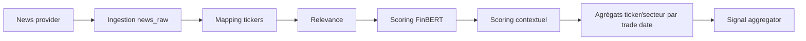

# Screener, Selector et Event Sentiment

## Documents spécialisés

- [Screener : calculs, persistance et diagnostics](signals/screener_reference.md)
- [Selector/AlphaScanner : facteurs, filtres et ranking](signals/selector_reference.md)
- [Event Sentiment : ingestion, FinBERT et agrégations](signals/event_sentiment_reference.md)

## Screener

`screener/` traite l'univers large par chunks et deux passes. Il calcule liquidité moyenne, force relative vs benchmark et position dans le range historique, enrichit avec secteur/audits puis persiste `stock_scores` et son historique. `ScreenerRunReport` agrège erreurs, compteurs et progression.

Le screener ne définit pas le scope ML final. Il fournit des critères objectifs, des features et des diagnostics.

## Selector / AlphaScanner

`selector/scanner.py` orchestre facteurs, filtres, ranking et explicabilité. Les familles comprennent Minervini/VCP, momentum, volatilité, neutralisation sectorielle, scoring short, filtres de régime et dip filter. `strict_filter_profiles.py` et `filter_profiles` centralisent les profils.

Le selector peut veto un candidat post-ML ou enrichir son contexte. `predicted_side` est injecté depuis le contrat ML ; il ne doit pas être inventé depuis le short score.

## Sentiment

`event_sentiment/` sépare ingestion, relevance, scoring, calendrier et agrégation. Les timestamps de publication sont alignés sur une `effective_trade_date` afin qu'une news hors séance ne fuite pas dans une décision antérieure.

`ticker_daily_sentiment_features` et `sector_daily_sentiment_features` contiennent les agrégats. Les checkpoints rendent l'import reprenable. `history_backfill.py` reconstruit une période par batches.

## Signal Aggregator

`signal_aggregator.py` fusionne le contexte quantitatif, ticker sentiment et macro sectorielle et met à jour `final_score_sentiment`. La pondération décrite par l'IHM est 75 % quant, 15 % ticker et 10 % macro sectoriel, sous réserve des valeurs effectives du code/config. Ce score n'est pas le ranking ML souverain.

## Défaillances attendues

News sans ticker, relevance faible, provider indisponible, FinBERT absent, séries macro manquantes et historique sectoriel incomplet doivent produire des compteurs/valeurs neutres explicites ou un échec selon criticité, jamais une donnée future.
