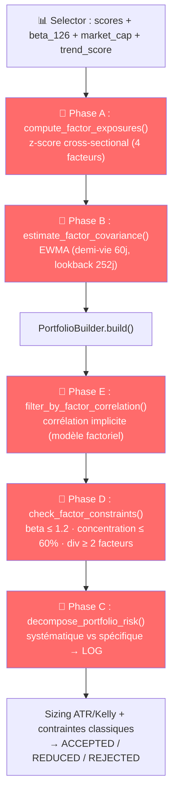

# Alpha Trade — Documentation Fonctionnelle

> *Version : 0.4.1 — Dernière mise à jour : 2026-06-22 (Contrainte de liquidité dynamique P1/P3/P4)*

<!-- primary_provider: eodhd -->

> ✅ **Convention provider OHLCV (audit S1)**.
> Le provider primaire des barres journalières (`stock_bars`,
> `stock_bars_daily`) est désormais **EODHD** (bulk EOD consolidé), piloté
> par `config.yaml › market_data.bars_provider` (défaut `eodhd`). Le mode
> `alpaca` (Alpaca/IEX) reste supporté en rétrocompatibilité. Les
> **quotes** (`stock_quote_snapshots`), la **metadata sectorielle**
> (Finnhub) et l'**exécution** restent sur Alpaca/Finnhub quel que soit ce
> flag. Convention de prix unique pour les deux providers :
> `data_adjustment = 'split'` (dividendes via `portfolio_cash_ledger`).
> Cf. `doc/dataIntegrityEngine.md`, `doc/data_lineage_matrix.md`,
> `doc/corporate_actions.md`.

> 🔎 **Addendum audit 2026-05-22** : voir `doc/audit_alignment_tod2.md` et
> les livrables `prompt/tod2/` pour les écarts doc/code/config détectés. Les
> runbooks doivent être lus en mode provider-aware : EODHD est nominal,
> Alpaca daily est rétrocompatibilité/no-op si `bars_provider=eodhd`.

> \➡️ **Provider NEWS par défaut : `eodhd`** (import et scoring des news, paramètre `--news-provider` par défaut à `eodhd` dans les scripts).

> 📚 **Références transverses S7** :
> `doc/CONVENTIONS.md` centralise désormais les conventions canoniques ;
> `doc/CHANGELOG.md` trace les changements documentaires visibles.

---

## 0. État des sprints au 2026-06-19

- **S1** : livré et revalidé (micro-comptes, alias `selector_min_ibd_rs_rank`, doctrine de dépréciation `execution_engine`).
- **S2** : noyau livré, y compris le reliquat A-004 désormais exposé via le proxy
  `quote_iex_vs_consolidated_bps` dans les `run_summary` de `sync_latest_quotes`.
- **S3** : robustesse réelle swing confirmée (réconciliation J+1, TCA agrégé, gel IHM live).
- **S4** : convention corrélation et oracle total return documentés / testés.
- **S5** : signatures d'artefacts ML et doctrine failover broker livrées.
- **S6** : `macro_provider=composite`, Kelly conditionnel (≥ 25 k$), clarification drawdown et SMTP.
- **S7** : garde-fous gouvernance ML (`model_predictions`) + factorisation importeurs de barres (helper commun) + tests walk-forward ML.
- **S8** *(audit TOD5, juin 2026)* : audit exhaustif réalisé, livrables dans `prompt/tod5/`. Corrections critiques des presets de capital : drawdown breaker différencié par tranche, `risk_min_position_notional` ≥ 155 $ pour tous les presets, libellé micro-compte uniformisé en USD. ✅ Livré.
- **S8-bis** *(post-PDT FINRA, juin 2026)* : mise à jour IHM suite à la suppression de la règle PDT par la FINRA le 4 juin 2026. Défaut `execution_swing_only` passé de `True` à `False` dans l'IHM, step 1 dynamique selon le provider actif (EODHD/Alpaca), validation `__post_init__` dans `PipelineLaunchOptions`. ✅ Livré.
- **S9** *(juin 2026)* : alignement IHM/presets finalisé. Bandes d'avertissement dans l'IHM quand `swing_only=True` (obsolète), infobulles mentionnant le changement réglementaire FINRA 2026-06-04. ✅ Livré.
- **S10** *(juin 2026)* : **Impact Marché P1-P4** — modélisation complète des coûts de transaction dans le backtest. ✅ Livré.
- **S11** *(juin 2026)* : **Liquidité Dynamique P1/P3/P4** — contrainte position/ADV, warning agrégé portefeuille, seuil ADV adaptatif. ✅ Livré.

### Plans en cours (v2)

| Plan | Statut | Description |
|---|---|---|
| **Plan v2 — Short Selling** (Sprint 0-5) | 🔄 En cours | `core/direction.py`, `selector/short_score.py`, `risk_management/concentration.py`, `backtesting/simulator.py` |
| **Plan ML v2 — Ternaire long/flat/short** (Sprint 1-7) | 🔄 En cours | `modelFactory/features.py` (`target_mode="ternary"`), `model.py` (CrossEntropyLoss 3 classes), `db_registry.py` (colonnes `predicted_side`, `proba_long/flat/short`) |
| **Priorité 3 — Modèle de risque factoriel CWMS** | ✅ Livré (juin 2026) | `risk_management/factor_model.py` — Expositions factorielles, covariance EWMA, décomposition risque, contraintes, filtre corrélation factoriel. Intégré live + backtest. 33 tests. |
| **Impact Marché P1-P4** | ✅ Livré (juin 2026) | P1 : spread réel ticker via `stock_quote_snapshots`. P2 : slippage volume-aware activé par défaut par tranche de capital. P3 : commission tiercée (`TieredCommissionConfig`). P4 : modèle d'exécution intraday (`arrival_price`/`twap`/`vwap`). |
| **Liquidité Dynamique P1/P3/P4** | ✅ Livré (juin 2026) | P1 : contrainte `max_position_pct_of_adv` dans le `ConstraintChecker`. P3 : warning ADV agrégé portefeuille. P4 : `adaptive_min_adv()` + `with_adaptive_adv()`. Voir `prompt/todo/LiquiditeDynamique.md`. |

> ⚠️ Les plans v2 ne sont pas encore validés en production. Le comportement par défaut reste **long-only** avec cible binaire. Les fonctionnalités short/ternaire sont opt-in.

---

## 1. Présentation Générale du Projet

### 1.1 Objectif de l'application

**Alpha Trade** est un système de trading algorithmique **Swing Trade** sur actions US, de bout en bout. Il couvre la totalité de la chaîne : ingestion de données de marché, screening quantitatif, analyse de sentiment (NLP/FinBERT), prédiction par **gouvernance multi-modèles `modelFactory`** (LSTM local, challengers tabulaires locaux, modèle global optionnel), gestion du risque, construction de portefeuille, exécution automatisée des ordres via le broker **Alpaca**, et gestion des corporate actions (dividendes, splits). Une **IHM opérateur Streamlit** permet la supervision du pipeline.

### 1.2 Contexte métier

Le système cible le **marché actions US (NYSE/NASDAQ)**, en stratégie **swing trading** (horizon de détention de quelques jours à quelques semaines). Il est conçu pour fonctionner en **paper trading** (compte fictif Alpaca) ou en **live trading** (argent réel), avec un mode simulation (dry-run) sans aucun envoi d'ordre.

> 🔴 **Mise à jour réglementaire — 2026-06-04** : La **règle PDT (Pattern Day Trader)** a été supprimée par la FINRA. Le day trading (achat/vente intraday) est désormais autorisé sans restriction, sans limite de 3 trades par période de 5 jours ni seuil de capital minimum de 25 000 $. Alpaca a mis à jour sa plateforme. Le paramètre `execution_swing_only=False` (défaut) permet le day trading libre ; `swing_only=True` reste disponible pour les opérateurs souhaitant se restreindre volontairement au swing seul.

### 1.3 Cas d'usage principal

Un opérateur lance quotidiennement le pipeline dans l'ordre suivant :

1. **Ingestion** des barres OHLCV journalières depuis **EODHD** (provider primaire par défaut, `market_data.bars_provider=eodhd`) ou Alpaca IEX (mode rétrocompatibilité, `bars_provider=alpaca`). Voir `config.yaml › market_data.bars_provider`.
2. **Nettoyage** des données (sanitizer, détection d'anomalies)
3. **Screening** multi-facteurs pour identifier les meilleurs candidats
4. **Sync Latest Quotes** — snapshot des dernières quotes Alpaca pour alimenter le filtre de spread
5. **Sync Earnings Calendar** — synchronisation du calendrier earnings Finnhub pour alimenter le blackout résultats
6. **Alpha Scanner** — scoring avancé Minervini/VCP + neutralisation sectorielle
7. **Analyse de sentiment** des news via FinBERT — import news brut sur l'univers élargi `stock_scores_all`, scoring article/ticker sur les candidats, features ticker ciblées candidats et features secteur sur l'univers élargi importé
8. **Signal Aggregator** — fusion quant + sentiment → `final_score_sentiment`
9. **ML Train** — entraînement `modelFactory` par symbole candidat : LSTM+Attention, challengers locaux `LightGBM` / `CatBoost`, modèle global optionnel et sélection éventuelle du champion servi (périodique)
10. **ML Predict** — inférence quotidienne sur le **champion sélectionné** par symbole (`lstm_attention`, `lightgbm`, `catboost` ou `global_model` selon les artefacts disponibles)
11. **Gestion du risque** : sizing de position (ATR, Kelly), contraintes de portefeuille, score de conviction (40% quant + 60% ML)
12. **Exécution** automatisée des ordres sur Alpaca via une chaîne canonique `targets snapshot → order requests → broker orders → broker fills → positions/lots → réconciliation`, avec protections broker-side initiales
12.bis **Watcher post-exécution** — supervision secondaire des protections broker-side après `Execution`, utile pour promouvoir certains stops initiaux vers un trailing stop dynamique si ce mode est activé ; ce watcher n'est pas une étape métier supplémentaire du pipeline 1→14, mais un runtime post-exécution lancé juste après l'étape 12
13. **Corporate actions sync** — récupère dividendes/splits depuis Alpaca uniquement pour les symboles détenus en portefeuille (après exécution du jour)
14. **Corporate actions apply** — application des dividendes/splits sur les positions existantes

L'opérateur supervise l'ensemble via l'**IHM Streamlit** (`ihm/app.py`).

> **Doctrine opérateur execution** : `run_execution.py` est le launcher
> canonique du flux `run` (`simulate | paper | live | check`).
> `python -m execution_engine` reste une façade de compatibilité pour ce flux
> et conserve `cancel-all` comme point d'entrée natif du kill switch global.

---

## 2. Fonctionnalités Principales

### 2.1 Connexion à Alpaca Trade API

- **Market Data API** (`data.alpaca.markets/v2`) : récupération des barres OHLCV historiques et des news
- **Trading API** (`paper-api.alpaca.markets/v2` ou `api.alpaca.markets/v2`) : soumission d'ordres, consultation de positions, horloge de marché
- Modes **paper** et **live** supportés nativement
- Gestion automatique du rate limiting, des timeouts et des retries avec backoff exponentiel

### 2.2 Gestion des ordres (achat / vente)

| Fonctionnalité | Description |
|---|---|
| **Ordres d'entrée** | Market ou limit (buffer configurable en bps) |
| **Take-profit** | Ordre limit sell à +X% du prix de fill (défaut : +8%) |
| **Trailing stop** | Ordre trailing_stop sell à -X% (défaut : -5%) |
| **Protections broker-side** | Stop initial + take-profit soumis via des requests distinctes après fill ; si activé, le watcher peut ensuite promouvoir le stop initial vers un trailing stop dynamique |
| **OCO logique** | Si le TP ou le TS est exécuté, l'autre est automatiquement annulé |
| **Ordres de rééquilibrage** | Vente d'excédent ou achat complémentaire lors de la réconciliation |
| **Quantités fractionnaires** | Support optionnel des tailles décimales en backtest, paper et live via un switch IHM persistant et des flags CLI dédiés |
| **Idempotence** | Clé SHA-256 basée sur risk_run_id + symbole + rôle pour éviter les doublons |

### 2.3 Stratégies de trading utilisées

Le système est conçu principalement pour du **swing trading**. Le backtesting permet désormais de simuler explicitement des contraintes réalistes de petit capital Alpaca / compte US :

- **`account_type = margin`** : compte margin simulé ;
- **`account_type = cash`** : uniquement du **cash settled** réutilisable après settlement simplifié **T+1** ;
- **`swing_only = True`** : achat aujourd'hui, revente demain ou plus tard.

Cette API composable permet d'évaluer une stratégie avec **2 000 $** ou un autre petit capital sans surévaluer artificiellement la fréquence de rotation intraday, tout en distinguant proprement :

- le **type de compte**,
- le **style de trading swing**.

Cette logique n'est plus limitée au backtest : le module `execution_engine` applique aussi ces contraintes au moment de la soumission des ordres et de l'armement des sorties.

Depuis l'ajout du **levier optionnel long-only**, le même moteur d'exécution sait
aussi augmenter le budget notionnel **uniquement** si les préconditions métier
sont réunies : compte `margin`, `equity >= 2 000 $`, régime d'entrée normal et
pouvoir d'achat broker suffisant. Le levier effectif est plafonné à **2.0x max**
en swing overnight et borné par `regt_buying_power` puis `buying_power`.

Le bloc `leverage` joue ici le rôle d'une **politique explicite de contrôle**.
Quand il n'est pas activé, le comportement historique des comptes `margin`
reste conservé (usage du `buying_power` broker selon la sémantique legacy du
dépôt).

Le comportement opérateur associé est désormais le suivant :

- **Backtest IHM** : un switch `Autoriser les quantités fractionnaires en backtest` est visible et activé par défaut ;
- **Pipeline IHM** : un switch `Execution/Risk — autoriser les quantités fractionnaires` est visible et activé par défaut ;
- la préférence est **persistée côté serveur** et restaurée au redémarrage de l'IHM ;
- la désactivation force un comportement entier pour les runs lancés depuis l'interface.

Pour l'opérateur, cela permet de distinguer plus clairement :

- les runs de **petit capital** nécessitant des tailles décimales ;
- les runs de validation/exploitation où l'on souhaite conserver un comportement **strictement entier**.

Sur la page backtest, cette évolution s'accompagne d'un enrichissement du tableau **`Journal quotidien portefeuille / positions`** : la colonne **`Détail positions`** affiche désormais la **quantité** et, quand disponible, le **montant d'entrée cumulé** par ligne afin de rendre la composition du portefeuille plus lisible séance par séance.

#### Scanner multi-facteurs (AlphaScanner)
- **Trend Score** (critères Minervini) : 7 critères techniques (close > MA150, MA150 > MA200, MA200 en hausse, close > MA50, close ≥ 1.25 × low 52w, close ≥ 0.75 × high 52w)
- **VCP Score** (Volatility Contraction Pattern) : ratio volatilité 10j/60j vs seuil
- **Filtre de volatilité relative optionnel** : exclusion explicite si `volatility_ratio = vol10 / vol60` dépasse un seuil métier (ex. `0.90`) afin d'éviter les titres en spike de volatilité récent
- **Filtre market cap** : exclusion des petites capitalisations sous `2 Md$`
- **Filtre bêta** : calcul local `beta_126` vs `SPY`, utilisé pour exiger un comportement suffisamment directionnel
- **Filtre spread** : exclusion des titres au spread bid/ask trop large via les snapshots de quotes Alpaca. **P1** : le `spread_bps` réel est également utilisé comme **coût de transaction** dans le backtest (`load_spreads()` → `BacktestEngine.run(spread_df=...)`)
- **Observabilité biais quotes IEX** : `sync_latest_quotes` publie aussi le proxy
  `quote_iex_vs_consolidated_bps`, soit l’écart moyen absolu (en bps) entre
  le mid bid/ask IEX et `stock_bars_daily.close` sur la même séance quand le
  close consolidé est disponible
- **Blackout earnings** : exclusion des titres publiant dans les `3` prochains jours
- **Score composite** : `50% × (trend+vcp)/2 + 30% × score_screener + 20% × RSI_relatif`
- **Neutralisation sectorielle** : z-score intra-secteur pour éliminer les biais sectoriels
- **Winsorisation** : protection contre les outliers (percentiles 1%-99%)

Le scanner quotidien et les reruns/backtests "petit compte cash swing" utilisent désormais systématiquement le même profil strict partagé. Les seuils durcis utilisés sont :

- `close >= 10 $`
- `avg_dollar_volume_20d >= 30 M$`  *(seuil canonique ; peut être relevé dynamiquement via `with_adaptive_adv()` — voir §2.5 « Liquidité dynamique »)*
- `volatility_ratio <= 0.90`
- `relative_strength_index >= 100`
- `close > MA200`
- `close / high_52w >= 0.75`
- `weekly_trend_score >= 1.0`
- `1.5 % <= atr_pct_20 <= 6 %`
- `market_cap >= 2 Md$`
- `beta_126 >= 0.8` — profil strict canonique (`core/filter_profiles.py:STRICT_SWING_CASH_FILTERS`)
- `spread_bps <= 40` — profil strict canonique ; mode IEX relâché : `max_spread_bps_iex = 65` avec `min_quote_size = 100`
- `earnings_blackout = 0`

Cet ensemble de filtres vise à réduire les microcaps/penny stocks, améliorer l'exécutabilité réelle et éviter les entrées juste avant un événement binaire ou après une explosion de volatilité.
Ils sont désormais centralisés dans un **profil partagé** (`core/filter_profiles.py`, source canonique ; `selector/strict_filter_profiles.py` est un alias rétrocompatible) pour garantir l'alignement entre :

- le scanner `AlphaScanner`,
- le backfill point-in-time de `stock_scores_history`,
- les reruns backtest stricts.

Dans l'IHM, l'étape `Alpha Scanner` n'expose plus de case à cocher dédiée : le lancement standard de l'étape 6 applique déjà ce profil strict implicite, après exécution automatique des synchronisations `Sync Latest Quotes` et `Sync Earnings Calendar` dans le workflow complet.

#### Screener de liquidité
- Pipeline en 3 passes : liquidité (volume × close sur 30j), force relative vs SPY (6 mois), position dans le range 10 ans
- Exécuté par chunks de 500 symboles en parallèle (ProcessPoolExecutor)

#### Analyse de sentiment (FinBERT)
- Ingestion des news EODHD par défaut (providers `alpaca` et `finnhub` disponibles via `--news-provider`), scoring via le modèle pré-entraîné `ProsusAI/finbert`
- Dans l'IHM, le step `7. Sentiment Pipeline` applique désormais un **scope mixte canonique** : import brut sur `stock_scores_all`, scoring standard / `relevance_score` / contextual sur les **candidats** (ou override CSV), `ticker_daily_sentiment_features` sur les **candidats** et `sector_daily_sentiment_features` sur l'**univers élargi importé**
- Mapping article → ticker en 3 modes : `provider_default` (hérité), `strict` (ticker principal seul) et `scored` (score de pertinence `relevance_score` par couple `(article, symbole)`)
- La migration Alembic `0027_news_ticker_map_relevance` ajoute `news_ticker_map.relevance_score` et `relevance_components` pour filtrer/pondérer les articles trop bruités sans casser l'historique (`NULL` reste accepté)
- Le Niveau 4 optionnel produit un score FinBERT contextualisé par couple `(article, symbole)` dans `news_ticker_sentiment` ; la migration `0028_news_ticker_sentiment` l'ajoute sans modifier `news_sentiment`
- En consommation downstream, le pipeline reste rétro-compatible : poids de pertinence par défaut à `1.0` et fallback `COALESCE(news_ticker_sentiment.*, news_sentiment.*)` tant que le re-scoring contextuel n'est pas activé
- Fusion : `75% quant + 15% sentiment ticker + 10% macro sectoriel` (poids configurables)
- Fenêtre glissante de 5 jours, pondérée par le nombre d'articles

#### Model Factory — gouvernance multi-modèles
- Modèle séquentiel principal : **LSTM + Temporal Attention** par symbole
- Challengers tabulaires locaux optionnels : **LightGBM** et **CatBoost**
- Modèle global multi-symboles optionnel : backend **LightGBM** ou **CatBoost**
- Calibration possible des probabilités (`none` ou `platt`)
- Optimisation possible du seuil de décision et de la target swing
- Sélection automatique du **champion réellement inférable** parmi les modèles éligibles
- Inférence quotidienne sur le backend sélectionné, avec sortie `predicted_proba` / `predicted_class`
- Traçabilité de gouvernance persistée dans `model_predictions` : `selected_model`, `decision_threshold`, `signal_label`, `calibration_method`
- Garde-fou de non-régression côté persistance : une prédiction sans ces champs de gouvernance est rejetée explicitement

### 2.4 Gestion du portefeuille

- **Construction du portefeuille cible** par le module `risk_management` à partir des candidats scorés
- **Sizing ATR** : budget de risque par trade (1% du capital) / (ATR(20) × multiplicateur stop)
- **Sizing Kelly** (optionnel) : fraction Kelly pondérée par probabilité prédite et win rate historique
- **Score de conviction** : combinaison score quantitatif (40%) + probabilité prédiction ML (60%)
- Tri des candidats par conviction décroissante
- **Contrainte de liquidité** (nouveau) : chaque position est plafonnée à `max_position_pct_of_adv` × ADV 20j du ticker. Exemple : `0.01` = max 1% du volume quotidien. Activé par configuration, rétrocompatible (désactivé par défaut).

### 2.5 Gestion du risque

| Paramètre | Défaut | Description |
|---|---|---|
| `max_positions` | 20 | Nombre maximum de positions |
| `max_position_weight` | 10% | Poids max d'une position dans le portefeuille |
| `max_sector_weight` | 30% | Poids max d'un secteur |
| `max_gross_exposure` | 100% | Exposition brute maximale |
| `min_position_notional` | 500 $ | Montant minimum par position |
| `max_portfolio_drawdown_pct` | 15% | Seuil circuit breaker drawdown |
| `max_daily_loss_pct` | 5% | Seuil circuit breaker perte journalière |
| `rolling_peak_window_days` | 0 (live) / 252 (backtest) | Fenêtre du pic de référence (0 = historique absolu) |
| `degraded_entry_allocation_pct` | 0.0 (blocage) / 0.10 (dégradé) | Allocation de base quand le breaker est trippé |
| `regime_ramp_up_enabled` | `true` | Active le ramp-up progressif de l'allocation dégradée |
| `regime_ramp_up_pct_per_day` | 0.025 (+2.5%/jour) | Bonus quotidien par jour de recovery (régime normal + equity ↑) |
| `regime_ramp_up_max_pct` | 0.40 (cap 40%) | Plafond de l'allocation après ramp-up |
| `leverage.max_leverage` | 1.0 (désactivé) à 2.0 max | Levier notionnel max autorisé côté exécution, borné par le buying power broker |
| `correlation_threshold` | 0.80 | Corrélation max entre deux positions retenues |
| `risk_per_trade_pct` | 1% | Budget de risque par trade |
| `max_position_pct_of_adv` | `null` (désactivé) | Position max en % de l'ADV 20j du ticker. Ex: `0.01` = 1% du volume quotidien. |

**Circuit breaker** :

- déclenchement si drawdown portefeuille ou perte journalière dépassent les seuils ;
- mode **blocage total** (`degraded_entry_allocation_pct=0.0`) ;
- mode **dégradé** (`degraded_entry_allocation_pct>0.0`) avec entrées réduites ;
- calcul possible sur **pic roulant** (`rolling_peak_window_days`) au lieu du plus haut historique ;
- **ramp-up régimed** (nouveau) : quand le breaker est trippé, l'allocation dégradée de base (10%) est progressivement augmentée de `regime_ramp_up_pct_per_day` (2.5%) par jour où le **régime est `normal` ET l'equity progresse** vs la veille, jusqu'au plafond `regime_ramp_up_max_pct` (40%). Si l'equity stagne ou baisse, le streak est gelé. Si le régime quitte `normal`, le streak est remis à zéro.

Les valeurs effectives sont pilotées par `config/capital_presets.yaml` (live + backtest), selon le bucket de capital actif.

**Filtre de corrélation** : rejette les candidats trop corrélés (> 0.80 sur 60 jours) pour diversifier.

**Modèle de risque factoriel CWMS** *(nouveau — juin 2026)* : décompose le risque du portefeuille en risque systématique (lié à 4 facteurs communs : Market, Size, Momentum, Value) et risque spécifique (idiosyncratique). Permet de :

- **Mesurer** l'exposition factorielle du portefeuille (beta moyen, concentration size/momentum/value)
- **Contraindre** le portefeuille : beta ≤ 1.2, max 60% du risque venant d'un seul facteur, au moins 2 facteurs significatifs
- **Filtrer** les candidats par corrélation implicite (modèle factoriel) en替代 du Pearson historique
- **Anticiper** les chocs : la covariance EWMA (demi-vie 60 jours) capte naturellement les changements de régime

Activé via `enable_factor_model: true` dans la config risk_management. Voir `prompt/todo/RisqueSectoriel.md` pour le plan complet.

**Résumé visuel — où intervient le modèle factoriel dans le pipeline** :



> 🔴 = Nouvelles étapes (Priorité 3). Désactivées par défaut, activation via `enable_factor_model: true`.

**Formule clé** : $\\Sigma_{port} = \\mathbf{B} \\cdot \\mathbf{F} \\cdot \\mathbf{B}^T + \\mathbf{S}$ — le risque total se décompose en risque systématique (facteurs communs) + risque spécifique (idiosyncratique).

**Contrainte de liquidité dynamique** *(nouveau — juin 2026)* : garantit qu'une position individuelle ne dépasse jamais une fraction configurable du volume quotidien du ticker (ADV 20j). Voir `prompt/todo/LiquiditeDynamique.md`.

| Priorité | Statut | Description |
|---|---|---|
| **P1** | ✅ Livré | Contrainte `max_position_pct_of_adv` dans `ConstraintChecker.check()` — réduit la position si elle dépasse X% de l'ADV. Code décision : `CONSTRAINT_MAX_POSITION_PCT_OF_ADV`. Rétrocompatible (`null` = désactivé). |
| **P3** | ✅ Livré | Warning passif dans `PortfolioBuilder.build()` si le notionnel total du portefeuille > 5% de l'ADV agrégé moyen. |
| **P4** | ✅ Livré | `adaptive_min_adv(equity)` dans `common/capital_presets.py` — calcule le seuil ADV minimum pour qu'une position max ≤ 1% de l'ADV. `with_adaptive_adv()` dans `core/filter_profiles.py` dérive un profil de filtre adapté à la taille du compte. |

**Principe** : pour un compte à $100K avec `max_position_weight=10%` et `max_position_pct_of_adv=1%`, une position de $10K sur un ticker à $30M d'ADV représente 0.033% du volume quotidien — parfaitement liquide. Si le compte passe à $500K ou que `max_position_weight` est relevé à 25%, la contrainte devient active automatiquement.

**Donnée ADV** : le champ `PriceInfo.adv_usd` est alimenté automatiquement : en live depuis `stock_bars_daily` (close × volume, 20j), en backtest depuis la matrice `volume_df` passée au bridge risk. Si absent (`None`), la contrainte est silencieusement ignorée.

### 2.6 Alertes / notifications

- **Alerte slippage** : déclenchée si l'écart prix fill vs prix de décision > seuil (défaut 30 bps)
- **Kill switch** : arrêt automatique après N échecs consécutifs (défaut : 3)
- **Circuit breaker actif** : événement loggé, run avorté + notification externe best-effort (email IHM + canal `service.alerting` Slack/SMTP selon env)
- **Logs critiques** : si le scanner produit 0 candidats (LOGGER.critical)
- Tous les événements sont persistés dans la table `execution_events`
- **Monitoring Prometheus** : endpoint `/metrics` disponible en mode opt-in (`ALPHA_TRADE_METRICS_PORT`) et utilisable avec Prometheus/Grafana

### 2.7 Historique / reporting

- **Table `execution_runs`** : chaque run d'exécution est tracé (statut, timestamps, métriques)
- **Table `execution_targets_snapshot`** : snapshot figé des cibles effectivement consommées par un run donné
- **Table `execution_order_requests`** : intentions / requests canoniques soumises par le moteur, avec hiérarchie parent/enfant et traçabilité d'idempotence
- **Table `execution_broker_orders`** : observation broker-side des ordres réellement soumis et de leur statut normalisé
- **Table `execution_broker_fills`** : chaque fill reçu du broker avec slippage et implementation shortfall
- **Tables `execution_positions` / `execution_position_lots`** : reconstruction des positions et des lots FIFO au niveau compte
- **Table `execution_reconciliation_results`** : résultat actionnable de la réconciliation entre cibles, positions internes, broker et protections
- **Table `execution_events`** : journal complet de chaque événement (type, message, payload JSON)
- **Table `risk_decisions`** : chaque décision d'acceptation/rejet d'un candidat
- **Table `portfolio_targets`** : portefeuille cible issu du risk management
- **Tables `broker_account_snapshots` / `broker_positions_snapshots`** : photos du compte et des positions broker après chaque run
- **TCA (Transaction Cost Analysis)** : slippage moyen, max, implementation shortfall agrégé
- **Résumé d'exécution (`run_summary`)** : publie désormais aussi le snapshot de contraintes compte (`equity`, `settled_cash`, `buying_power`) et un bloc `leverage` avec `effective`, `active`, `configured_max`, `buying_power_field`, `reason`
- **Rapport de backtest** : exporte un `report.json` structuré avec résumé de performance, paramètres effectifs, diagnostics simulateur, métadonnées de reproductibilité (`git`, `python`, `dataset_hash`, `seed`) et manifeste de fidélité PIT

La page `Exécution` de l'IHM privilégie désormais la lecture de ces tables canoniques **scopée par `exec_run_id`**, avec le contexte plus large du compte relégué dans des zones secondaires explicites.

### 2.7 bis Backtesting, recherche et audit de fidélité

Le module `backtesting/` n'est plus un simple replay de signaux. Fonctionnellement, il offre désormais :

- un mode **`research`** pour itérer rapidement sur des hypothèses ;
- un mode **`pipeline`** plus strict, centré sur la fidélité point-in-time ;
- une convention d'exécution réaliste **signal J → entrée open J+1** ;
- la simulation explicite des contraintes **`margin / cash settled / swing_only`** ;
- des **phases opt-in** de rapprochement avec le live :
  - **Phase 2** : bridge `risk_management` puis `execution_engine`,
  - **Phase 3** : replay explicite des entrées exécutées,
  - **Phase 4** : replay des protections,
  - **Phase 5** : replay du watcher de protection,
  - **Phase 7** : replay de l'exit terminal et de l'annulation OCO logique ;
- des **presets capital** PIT et des **profils** de backtest pour garder la cohérence entre backfill, reruns et IHM ;
- des surcouches **microstructure** et **risk overlay** activables pour la recherche (slippage volume-aware activé par défaut P2, stop initial, filtre de gap, **modèle d'exécution intraday P4**, sizing conviction-weighted, cap sectoriel, drawdown breaker, etc.) ;
- une **modélisation granulaire des coûts de transaction** (P1/P2/P3) : spread réel par ticker, slippage volume-aware calibré par tranche de capital, commission tiercée (fixe + taux) ;
- un breaker drawdown C.5 paramétrable par preset (`dd_rolling_peak_window_days`, `dd_degraded_allocation_pct`, `dd_regime_ramp_up_*`) avec ramp-up régimed progressif ;
- un outillage complet de **diagnostic screener** avec recommandations globales, par régime et par objectif ;
- des commandes de **calibration des poids sentiment** et de **walk-forward** pour rejouer des poids hors échantillon.

Quand C.5 est actif en backtest, un artefact de diagnostic est exporté : `drawdown_breaker_daily.csv` (colonnes : `trade_date`, `equity`, `reference_peak`, `dd_pct`, `tripped`, `allocation_scale`, `normal_streak`, `entry_mode`).

Dans l'IHM Streamlit, la page `Backtesting` permet aujourd'hui de lancer et superviser :

- `run`,
- `backfill-scores-history`,
- `diagnose-screener`,
- `recommend-screener`,

avec historique des runs, lecture des logs et visualisation des KPIs du `report.json`.

### 2.8 Logs métier

- Logs structurés avec niveaux INFO/DEBUG/WARNING/ERROR/CRITICAL
- **RotatingFileHandler** : logs fichier rotatifs (`alpha_trade.log`, 5 Mo, 3 backups) en plus de stdout
- Couverture de code ≥ 60% (seuil pytest configuré)
- Rapport HTML de couverture généré dans `htmlcov/`

### 2.9 Gestion des Corporate Actions (dividendes et splits)

Le module `corporate_actions` assure le suivi automatique des opérations sur titres :

| Fonctionnalité | Description |
|---|---|
| **Dividendes cash** | Détection via provider CA : `EodhdCorporateActionProvider` si `market_data.bars_provider=eodhd` (défaut), `AlpacaCorporateActionProvider` sinon (factory `build_corporate_action_provider`) |
| **Splits** | Ajustement automatique : qty × ratio, cost basis / ratio, conservation de la valeur totale |
| **Reverse splits** | Idem avec gestion des fractions (cash-in-lieu) |
| **Idempotence** | Clé SHA-256 déterministe (provider + symbol + type + ex_date + montant/ratio), unicité DB |
| **Audit trail** | Tables `corporate_actions_events`, `corporate_actions_applications`, `portfolio_cash_ledger` |
| **Réconciliation** | Comparaison positions internes post-CA vs positions broker |

**Stratégie données de marché** : les barres OHLCV sont ingérées avec `adjustment="split"` (splits neutralisés, dividendes non réinjectés dans le passé). Le module corporate actions ne touche pas aux prix historiques — il gère uniquement la comptabilité portefeuille (qty, cost basis, cash).

**Intégration pipeline** : s'exécute en fin de pipeline, juste avant l'apply, après que les positions du jour sont connues :
```
python -m corporate_actions sync --portfolio-only    # Sync uniquement les symboles détenus en portefeuille
python -m corporate_actions apply                    # Appliquer sur les positions
python -m corporate_actions status                   # Résumé des événements
python -m corporate_actions sync --all-symbols       # Backfill complet (usage exceptionnel)
```

### 2.10 Multi-comptes Alpaca

Le système supporte **plusieurs comptes broker Alpaca en parallèle** (paper et/ou live).

| Fonctionnalité | Description |
|---|---|
| **Registre centralisé** | `AccountRegistry` charge les comptes depuis `config.yaml`, env vars préfixées, ou fallback classique |
| **Isolation par compte** | Chaque exécution, chaque run de risk et chaque apply CA peut cibler un compte spécifique via `--account <ID>` |
| **Traçabilité DB** | Colonne `account_id` sur la chaîne canonique `execution` (`execution_runs`, `execution_targets_snapshot`, `execution_order_requests`, `execution_broker_orders`, `execution_broker_fills`, `execution_positions`, `execution_position_lots`, `execution_reconciliation_results`, `execution_locks`) ainsi que `broker_positions_snapshots`, `risk_decisions`, `portfolio_targets`, `corporate_actions_applications`, `portfolio_cash_ledger` |
| **IHM** | Sélecteur de compte dans la sidebar Streamlit — filtre automatiquement les données affichées |
| **Rétrocompatibilité** | Les données existantes (sans `account_id`) sont considérées comme `default` |
| **Données de marché** | Les barres OHLCV, news et assets sont partagés (non liés à un compte) |

**Configuration** (dans `config.yaml`) :
```yaml
alpaca:
  accounts:
    - id: default
      label: "Paper principal"
      api_key: "${ALPACA_API_KEY}"
      secret_key: "${ALPACA_SECRET_KEY}"
      mode: paper
    - id: live1
      label: "Compte live"
      api_key: "${ALPACA_LIVE1_API_KEY}"
      secret_key: "${ALPACA_LIVE1_SECRET_KEY}"
      mode: live
```

**Usage CLI** :
```
python run_execution.py paper --account default      # exécuter sur le compte paper
python run_execution.py live --account live1          # exécuter sur le compte live
python -m risk_management.run_risk --account live1    # risk pour le compte live
python -m corporate_actions apply --account live1     # appliquer CA sur le compte live
python -m execution_engine cancel-all --account live1 --broker-mode live --confirm-account live1 --reason "incident"  # kill switch global natif
```

Pour le flux `run`, le chemin recommandé reste `run_execution.py`. La CLI
`python -m execution_engine` sert surtout de compatibilité historique pour
`run` et de point d'entrée natif pour `cancel-all`.

### 2.11 Watcher de protections post-exécution

Le watcher de protections est un composant **post-exécution** de supervision secondaire qui surveille les protections broker-side créées par `Execution` afin de gérer le cycle de vie :

- stop initial broker-side ;
- déclenchement des conditions de transition ;
- promotion vers trailing stop dynamique, si ce mode est activé ;
- suivi de la santé de ce mécanisme en base et dans l'IHM.

Fonctionnellement :

- il devient utile **après** l'étape 12 `Execution` ;
- il ne remplace pas les étapes 13 et 14 ;
- il peut tourner **en parallèle** des Corporate Actions ;
- il ne sert pas à préparer le pipeline 1→11, mais à **sécuriser la vie post-exécution du trade** ;
- il n'est pas requis pour comprendre le run nominal, qui doit déjà rester lisible via la chaîne canonique persistée en base.

Règle opératoire simple :

- **manuel** : lancer un `run watcher once` juste après `Execution` ;
- **exploitation Windows** : préférer Task Scheduler (`once` périodique) ou NSSM (`service` persistant).

Référence dédiée : voir aussi `doc/watcher.md`.

### 2.12 Supervision Windows read-only du watcher

L'IHM `Supervision Ops` sait maintenant superviser le **packaging Windows réel** du watcher sans administrer la machine.

Fonctions disponibles :

- lire le statut réel de la tâche `Task Scheduler` du watcher ;
- lire le statut réel du service Windows / NSSM du watcher ;
- détecter les chemins de logs `stdout` / `stderr` quand ils sont exposés par le packaging ;
- importer ces logs dans `Supervision Ops` ;
- expliquer via quel bridge PowerShell la supervision passe.

Fonctions volontairement absentes :

- installer/désinstaller la tâche planifiée ;
- installer/désinstaller NSSM ;
- démarrer/arrêter un service Windows externe ;
- exécuter un script PowerShell arbitraire ;
- manipuler le secret store DPAPI depuis l'IHM.

Le compromis fonctionnel est donc :

- **supervision réelle** depuis l'IHM ;
- **administration système exclue** depuis l'IHM.

---

## 3. Flux de Fonctionnement Global

### 3.1 Étapes du démarrage à l'exécution

```
                     INITIALISATION (une fois)
                     ┌───────────────────────┐
                     │ import_alpaca_assets   │ → stock_metadata
                     │ update_sector          │ → stock_metadata.sector (Finnhub)
                     └───────────────────────┘

                     PIPELINE QUOTIDIEN
     ┌─────────────────────────────────────────────────────────────────────────────┐
     │ 1.  import_alpaca_bar        │ → stock_bars                                 │
     │ 2.  data_sanitizer_daily     │ → stock_bars_daily                           │
     │ 3.  stock_screener           │ → stock_scores                               │
     │ 4.  sync_latest_quotes       │ → stock_quote_snapshots                      │
     │ 5.  sync_earnings_calendar   │ → stock_earnings_calendar                    │
     │ 6.  alpha_scanner            │ → stock_scores (update)                      │
     │ 7.  sentiment_pipeline       │ → ticker/sector feats                        │
     │ 8.  signal_aggregator        │ → final_score_sentiment                      │
     │ 9.  ml_train (périodique)    │ → artefacts Model Factory + champion servi   │
     │ 10. ml_predict (quotidien)   │ → model_predictions                          │
     │ 11. run_risk                 │ → portfolio_targets                          │
     │ 12. run_execution            │ → targets snapshot / requests / ordres / fills / positions / réconciliation │
     │ 12.bis watcher post-exec     │ → surveillance / transition des protections  │
     │ 13. corporate_actions sync   │ → corporate_actions_events (portfolio only)  │
     │ 14. corporate_actions apply  │ → position adjustments                       │
     └─────────────────────────────────────────────────────────────────────────────┘
```

En parallèle de ce pipeline live, le projet dispose d'une **boucle de recherche/backtesting hors production** permettant de :

- reconstruire les snapshots PIT manquants ;
- rejouer le portefeuille sur historique ;
- mesurer la robustesse du screener ;
- comparer plusieurs réglages par régime ou objectif ;
- documenter l'écart entre backtest et chaîne live.

### 3.2 Cycle d'un trade

1. **Sélection** : le symbole est identifié comme candidat (`is_candidate=1` dans `stock_scores`)
2. **Risk check** : sizing ATR/Kelly, vérification contraintes (poids, secteur, corrélation, circuit breaker)
3. **Portfolio target** : si accepté, le symbole est ajouté à `portfolio_targets` avec nombre de parts et prix d'entrée
4. **Soumission** : l'executor lit les targets et soumet un ordre market/limit d'achat
5. **Fill** : polling du broker jusqu'au fill ou timeout (120s défaut)
6. **Protections broker-side initiales** : après fill, soumission d'un stop initial et d'un take-profit via des requests distinctes, avec traçabilité canonique en base
7. **Watcher post-exécution** : supervision secondaire des protections en attente et promotion éventuelle du stop initial vers un trailing stop dynamique quand les conditions sont remplies
8. **OCO** : si l'un des enfants est exécuté, l'autre est annulé
9. **Réconciliation** : comparaison positions broker vs cibles, rééquilibrage automatique optionnel
10. **TCA** : calcul du slippage et de l'implementation shortfall

### 3.3 Détection des signaux

Les signaux sont le résultat de la fusion multi-sources :

- **Quantitatif** (75%) : trend Minervini + VCP + screener (liquidité, RSI relatif, range historique)
- **Sentiment** (15%) : score FinBERT agrégé sur fenêtre glissante 5j
- **Macro sectoriel** (10%) : impact macro par secteur (événements macro-économiques)

Le `final_score_sentiment` résultant détermine le classement final des candidats.

---

## 4. Paramètres Métier Configurables

### 4.1 Seuils de sélection (AlphaScanner)

| Paramètre | Défaut | Description |
|---|---|---|
| `selection_size` | 100 | Nombre max de candidats retenus |
| `min_history_days` | 252 | Historique minimum requis (1 an) |
| `liquidity_threshold` | 20 M$ | Dollar volume moyen 20j minimum |
| `min_close` | 5.00 $ | Prix de clôture minimum |
| `max_anomaly_count` | 20 | Anomalies max acceptées par titre |
| `sector_cap_ratio` | 30% | Plafond par secteur dans la sélection |

### 4.2 Paramètres d'exécution

| Paramètre | Simulate | Paper | Live |
|---|---|---|---|
| `profit_taker_pct` | 8% | 8% | 8% |
| `trailing_stop_pct` | 5% | 5% | 5% |
| `max_slippage_bps` | 30 | 30 | 20 |
| `inter_order_delay_ms` | 0 | 350 | 350 |
| `fill_timeout_seconds` | 120 | 120 | 180 |
| `allow_outside_rth` | Oui | Non | Non |

### 4.3 Paramètres de sentiment

| Paramètre | Défaut | Description |
|---|---|---|
| `sentiment_weight` | 15% | Poids du sentiment ticker |
| `macro_sector_weight` | 10% | Poids du signal macro sectoriel |
| `lookback_days` | 5 | Fenêtre de sentiment |
| `min_news_count` | 2 | Articles minimum pour activer le boost |
| `ticker_relevance_mode` | `provider_default` | Mode de mapping article → ticker (`provider_default`, `strict`, `scored`) |
| `min_relevance_score` | `0.0` | En mode `scored`, filtre les paires `(article, symbole)` sous le seuil avant insertion dans `news_ticker_map` |
| `enable_contextual_scoring` | `False` | Active le re-scoring FinBERT contextualisé par couple `(article, symbole)` |
| `contextual_min_relevance` | `0.0` | Seuil minimal de pertinence pour autoriser le scoring contextuel |
| `contextual_max_pairs_per_run` | `5000` | Cap opérateur pour éviter une explosion de tokenisations FinBERT |

### 4.4 Horaires

- Le système vérifie l'horloge NYSE avant exécution (sauf dry-run ou `allow_outside_rth`)
- Calendrier : `pandas_market_calendars` (NYSE) avec couverture complète des jours fériés US

---

## 5. Règles de Gestion Identifiées

1. **Seules les actions US equity** actives, tradables, avec données disponibles sont éligibles (exclusion ETF, crypto, fonds)
2. **Les ETF sont filtrés** par nom de société (patterns : "etf", "ishares", "spdr", "vanguard", etc.)
3. **Un candidat doit avoir ≥ 252 jours d'historique** (1 an)
4. **Les scores quantitatifs sont neutralisés par secteur** (z-score intra-secteur) pour éviter le biais sectoriel
5. **Le circuit breaker suspend le trading** si drawdown ≥ 15% ou perte daily ≥ 5%
6. **La corrélation > 0.80 entre deux positions** entraîne le rejet du candidat le moins bien classé
7. **L'idempotence est garantie** par une clé SHA-256, un même portefeuille cible ne génère pas de doublons
8. **Les ordres 4xx du broker ne sont PAS retentés** (erreurs permanentes) ; seuls les 5xx/timeout/réseau sont retentés
9. **Les positions broker hors cible** (action "investigate") ne sont pas soldées automatiquement pour éviter les erreurs
10. **Le score de conviction combine** score quantitatif (40%) et probabilité prédite par le backend `modelFactory` effectivement servi (60%)
11. **En backtest, l'option `swing_only` peut interdire toute revente le jour même**
12. **En backtest, un cash account n'utilise que le cash settled** et retarde la réutilisation des fonds après vente jusqu'au settlement `T+1`
13. **En exécution, un compte cash ne peut pas soumettre d'achats au-delà du cash settled disponible**
14. **En exécution, `swing_only` peut différer l'armement des ordres de sortie le jour même**
15. **Toute prédiction ML persistée doit inclure le contexte de serving** (`selected_model`, `decision_threshold`, `calibration_method`) pour garantir l'auditabilité des décisions de risque

---

## 6. Risques / Limitations Fonctionnelles

| Risque | Impact | Probabilité |
|---|---|---|
| **Marché fermé** (week-end, fériés) | Aucun ordre soumis, run avorté | Élevée si exécution non planifiée |
| **Pas de news pour un symbole** | Boost sentiment neutre (0.5), signal quant seul | Moyenne |
| **Aucun backend `modelFactory` servi disponible** | Pas de prediction_proba exploitable, conviction dégradée | Moyenne |
| **Latence Alpaca API** | Fill timeout, ordres children non soumis | Faible |
| **Circuit breaker déclenché** | Aucune allocation possible | Faible (sauf crash marché) |
| **Corrélation élevée entre candidats** | Portefeuille réduit (moins de positions) | Moyenne |
| **Corrélations cachées par facteurs de style** (small-cap, high-beta, momentum) | Tous les titres chutent simultanément en crash → circuit breaker | ⚠️ Atténué par le modèle factoriel CWMS (Priorité 3) |
| **Pas de gestion multi-devises** | Uniquement USD / actions US | Limitation de design |
| **Pas de short selling** | Uniquement des positions long | Limitation de design |
| **Pas de streaming temps réel** | Polling périodique (2s) pour les fills | Limitation de design |
| **Alerting externe partiel** | Email IHM + Slack/SMTP disponibles surtout sur incidents critiques (ex: circuit breaker), couverture encore incomplète sur tous les événements métier | Moyenne |

Concernant les contraintes petit capital simulées en backtest :

- les différences `cash` / `margin` portent surtout sur le capital disponible et la mécanique de `settled cash` ;
- l'option `swing_only` peut être combinée aussi bien avec un compte `margin` qu'avec un compte `cash` ;
- le mode `cash` repose sur un settlement simplifié **T+1** pour rester testable et lisible ;
- ces modes s'appliquent au moteur de backtest et n'altèrent pas l'exécution live/paper réelle du broker.

Concernant l'exécution réelle/paper :

- le moteur tient compte du snapshot broker (`buying_power`, `cash`, `non_marginable_buying_power`, `daytrade_count`) ;
- un compte `margin` et un compte `cash` peuvent donc produire des résultats d'exécution très différents à capital nominal identique ;
- cet écart est attendu, car la mécanique de capital disponible n'est pas la même.

---

## 7. Suggestions d'Amélioration Métier

1. ~~**Alertes externes** : intégrer Slack/email/SMS pour circuit breaker, slippage, et fin de run~~ → ✅ **Partiellement implémenté** : email workflow IHM + alerting externe via `service.alerting` (Slack/SMTP/log), circuit breaker branché ; extension SMS et couverture de tous les événements critiques encore à compléter
2. ~~**Dashboard temps réel**~~ → ✅ **Implémenté** : IHM Streamlit opérateur (`ihm/app.py`)
3. ~~**Backtesting intégré**~~ → ✅ **Implémenté** : module `backtesting/` research/pipeline avec replay PIT, contraintes compte (`cash settled` / `margin` / `swing_only`), phases de fidélité 2/3/4/5/7, diagnostics screener et reporting structuré (`report.json`, `fidelity_manifest.json`)
4. **Support short selling** : étendre la stratégie aux positions short
5. **Streaming WebSocket** : remplacer le polling des fills par un stream Alpaca pour réduire la latence
6. **Scheduler automatisé** : cron/Airflow/Prefect pour automatiser l'exécution quotidienne du pipeline
7. ~~**Multi-comptes** : supporter plusieurs comptes broker en parallèle~~ → ✅ **Implémenté** : registre multi-comptes (`service/alpaca/accounts.py`), colonne `account_id` sur 6 tables, `--account` CLI sur tous les modules
8. ~~**Gestion des dividendes et splits**~~ → ✅ **Implémenté** : module `corporate_actions`
9. **Optimisation des poids** : calibration automatique IC-weighted des facteurs via backtest glissant
10. **Audit trail enrichi** : export PDF/CSV des rapports TCA et des décisions de risque
---
## 8. Couche Market-Aware (regime marche centralise)
> Source : 	prompt/parttern/plan.md, axes A-F. Statut : implementee (cf. 	prompt/parttern/prompt_implemented.md).
### 8.1 But fonctionnel
Decider en debut de chaque cycle (live ou backtest) d'un `MarketRegimeSnapshot` qui pilote :
- l'agressivite du sizing (`risk_multiplier`),
- le nombre maximal effectif de positions (`effective_max_positions`, `allowed_slots = floor(equity / enforce_min_notional)`),
- les patterns calendaires actifs (Tax Day, Sept. Slump, Santa Rally, January Effect, OpEx, Month-End),
- le mode marche (`normal` / `capital_preservation` / `close_only` / `cash_only`),
- les filtres macro (VIX > 30 par defaut, hausse rapide du 10Y >= 7 % sur 5 jours, blacklist Tech / Growth / high beta),
- le sentiment circuit breaker,
- l'earnings shield J-2 / J+2 (blocage strict ou score negatif force),
- le buyback blackout (penalisation -30 % sur le score ML).
### 8.2 Regles cles
- Calcul **une seule fois par cycle** (cache court par defaut 300 s).
- En l'absence de donnee macro, fallback **neutre** documente dans `data_quality`.
- Configuration centralisee dans `config.yaml > market_regimes` (cf. `service.market.config.parse_market_regimes`).
- Depuis la promotion **R13a**, le profil versionne par defaut dans `config.yaml` est un profil defensif modere : `vix.high_threshold = 30.0`, `capital_preservation_max_gross_exposure = 0.65`, `yields.relative_spike_threshold = 0.07`, `yields.risk_mult = 0.85`, caps soft `3 positions / 25 % par ligne / 30 % par secteur / 65 % gross`.
- En live, le snapshot est imprime via `execution_engine.market_regime_preflight.emit_preflight` puis persiste dans `artifacts/market_regime/`.
- Le mode derive (`derive_entry_mode`) peut basculer `ExecutionConfig.entry_mode` vers `close_only` / `cash_only` avant l'execution.
### 8.3 Trailing stop ATR dynamique (Axe F)
Pilote par `risk_management.trailing_stop` dans `config.yaml` :
- `mode: dynamic_atr` -> stop initial = ATR(14) x `atr_multiplier` (defaut 2.5),
- `fallback_fixed_pct` si ATR indisponible (defaut 5 %),
- `break_even_after_atr_multiple` (defaut 2.0) -> remontee automatique du stop au prix d'entree,
- `eod_check_time_est` (defaut 15:50) -> revalidation des protections en fin de seance,
- `apply_to_manual_orphan_buys: true` -> applique a chaque achat orphelin adopte.
### 8.4 Petit capital
Le preset `capital_2001_5000` impose `risk_max_positions = 4` et `risk_min_position_notional = 150`. Combine avec `allowed_slots = floor(equity / enforce_min_notional)`, aucun ordre sous ~150 USD ne peut plus etre soumis.

### 8.5 Sources macro VIX / 10Y (production)
La couche est desormais branchee sur deux fournisseurs production via
`service.market.macro_providers.build_default_macro_provider` :

- **Stooq** — symboles `^vix`, `^vix9d`, `^tnx` ; le client preserve les
  symboles index `^...` et supporte `STOOQ_API_KEY` / `STOOQ_APIKEY` si le
  endpoint CSV demande un `apikey` ;
- **EODHD** (cle requise) — symboles `VIX.INDX`, `VIX9D.INDX`, `US10Y.INDX`.

Selection via `config.yaml > market_regimes.macro_provider` :
`stooq` / `eodhd` / `composite` (disponible mais non selectionne par defaut dans le depot) / `none`. Les overrides de symboles sont supportes
(`market_regimes.vix.symbol`, `market_regimes.yields.symbol_10y`, etc.).
Les reponses sont cachees par instance et par cycle pour ne pas consommer
le quota EODHD inutilement. Tout echec reseau retombe sur `None` →
fallback neutre documente dans `data_quality`. En pratique, pour obtenir un
mode non-`normal` de facon fiable en production sans mode de demo, le chemin
minimal recommande est aujourd'hui deja le **defaut versionne** :
`market_regimes.enabled: true` + `macro_provider: eodhd` + `vix.enabled: true`.

### 8.5.1 Profil par defaut promu (`R13a`)
Le depot embarque maintenant directement dans `config.yaml` la calibration
regime gagnante `R13a` comme baseline operateur pour le live, le paper et le
backtest. Les valeurs a retenir sont :

- VIX eleve a partir de `30.0` ;
- exposition brute max en `capital_preservation` : `0.65` ;
- spike 10Y relatif a partir de `7 %` sur 5 jours ;
- multiplicateur de risque soft sur spike 10Y : `0.85` ;
- modes hard / critiques backtest alignes sur le live : `close_only` ;
- circuit breaker sentiment durci : warning `-0.20`, critique `-0.40`, max `3` positions en warning.

Le profil `R13a` est desormais porte directement par `config.yaml` comme
baseline versionnee du depot. Les overrides explicites restent possibles via
les points d'entree CLI / IHM quand un YAML alternatif est souhaite.

### 8.6 Restitution IHM (Streamlit)
Trois points d'entree IHM exposent la couche Market-Aware :

- Page dediee **Régime Marché** (`ihm/pages/market_regime.py`, menu
  *Trading*) : snapshot a la volee + historique persiste, configuration
  active, rendu des earnings shielded / buyback blackout.
- **Bannière compacte** `ihm/components/market_regime_banner.py`,
  embarquee en haut des pages **Vue d'ensemble**, **Execution Engine** et
  **Risk Management**. Lit le dernier `snapshot_*.json` produit par
  `run_execution.run()` dans `artifacts/market_regime/` et bascule en
  `st.warning` (capital_preservation) ou `st.error` (close_only /
  cash_only) selon le mode courant.
- Persistance JSON best-effort dans `artifacts/market_regime/` →
  reutilisable par tout outil tiers (audit, supervision).


---

## Short Selling (Plan v2 — juin 2026)

Le systeme supporte desormais les positions **short** (vente a decouvert) en
complement des positions long. Points cles :

- **Score short** : calcule par `selector/short_score.py` (tendance, RSI, SMA50, SMA200)
- **Mode ternaire ML** : le modele predit long / flat / short en une seule passe
- **Protections direction-aware** : TP, SL et trailing stop adaptes automatiquement
  au sens de la position (long ou short)
- **Concentration side-aware** : limites de trades et blacklist comptabilisees
  separement pour les longs et les shorts
- **Capital preservation** : shorts automatiquement desactives en regime de
  preservation du capital

Voir `doc/calcul_tp_tl.md` pour les formules exactes de TP/SL directionnels.

### Valeurs de `selector_signal_mode` (colonne `stock_scores` / `stock_scores_history`)

La colonne `selector_signal_mode` (`VARCHAR(32)`, migration `0029`) identifie le
mode de signal ayant conduit a la selection d'un candidat. Les valeurs possibles
sont enumerees ci-dessous, par ordre de priorite dans le pipeline selector :

| Valeur | Direction | Origine | Signification |
|---|---|---|---|
| `NULL` | — | Non-candidat | Symbole non selectionne par le scanner |
| `"factor_only"` | **Long** | `selector/ranking.py` (defaut) | Score facteurs purs, aucun signal auxiliaire (sentiment/macro) |
| `"multi_factor"` | **Long** | `selector/ranking.py` | Scoring multi-factoriel standard (chemin sans neutralisation) |
| `"sector_neutralized"` | **Long** | `selector/ranking.py` | Scoring avec neutralisation sectorielle (chemin nominal) |
| `"regime_normal"` | **Long** | `selector/regime_scoring.py` | Rotation regime : normal (comportement nominal) |
| `"regime_capital_preservation"` | **Long** | `selector/regime_scoring.py` | Rotation regime : preservation du capital (shorts desactives) |
| `"short"` | **Short** | `selector/ranking.py` → `rank_and_select_short()` | Candidat short (top N par `short_score`) |
| `"regime_close_only"` | ❌ Bloqué | `selector/regime_scoring.py` | Rotation regime : plus d'entrees, sorties uniquement (live) |
| `"regime_cash_only"` | ❌ Bloqué | `selector/regime_scoring.py` | Rotation regime : plus d'entrees du tout (backtest / risk) |

**Ordre de priorite dans le pipeline :**

1. `_apply_selection_explainability` → `"factor_only"` (defaut) ou `"multi_factor"` / `"sector_neutralized"`
2. `rank_and_select_short` → `"short"` (pour les candidats short, exclut les longs deja selectionnes)
3. `regime_scoring` → `"regime_{mode}"` (ecrase si le score final a ete modifie par la rotation regime)

**Role de chaque mode :**

| Mode | Poids appliques | Filtres | Comportement |
|---|---|---|---|
| `"factor_only"` | Trend/VCP 50% + Total 30% + RSI 20% | Standards | Fallback : aucun signal auxiliaire (sentiment/macro) disponible |
| `"multi_factor"` | Trend/VCP 50% + Total 30% + RSI 20% | Standards | Scoring standard sans neutralisation sectorielle |
| `"sector_neutralized"` | Trend/VCP 50% + Total 30% + RSI 20% | Standards | **Chemin nominal** : z-score intra-secteur elimine le biais sectoriel |
| `"regime_normal"` | Identique standard (50/30/20) | Standards | Regime normal actif, pas de rotation defensive |
| `"regime_capital_preservation"` | Trend/VCP 25% + Total 15% + RSI 10% + Beta 22% + Size 13% + LowVol 15% | Renforces : beta ≤ 1.2, spread ≤ 15 bps, market cap ≥ 2 Md$, ATR ≤ 6% | Rotation 50% defensif : preserve le capital, reduit la volatilite, shorts desactives |
| `"short"` | Short score (trend 30%, RSI 25%, SMA50 25%, SMA200 20%) | Standards | Selection baissiere : top N par short_score, exclusions des longs deja retenus |
| `"regime_close_only"` | — | — | Marche stresse : **plus d'entrees** (ni long ni short), sorties et gestion d'urgence actives |
| `"regime_cash_only"` | — | — | Crise : **liquidations uniquement**, toutes les entrees sont bloquees |

**Consommation aval :**

- `risk_management/portfolio_builder.py` filtre les candidats par `selector_signal_mode` pour
  distinguer longs (`"sector_neutralized"`, `"multi_factor"`) et shorts (`"short"`)
- `execution_engine/order_intents.py` propage le mode dans les intentions d'ordre
- Les regimes `"close_only"` et `"cash_only"` bloquent les entrees (long et short)
- Les shorts sont automatiquement desactives en regime `"capital_preservation"`
