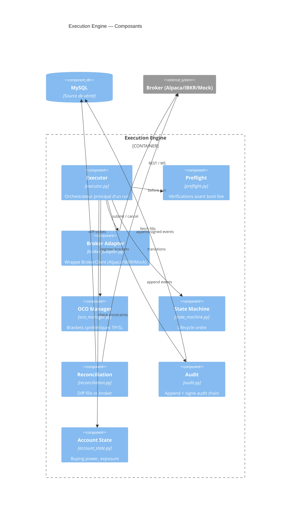

# C4 Model — Niveau 3 : Composants Execution Engine

> Phase C / S18.1. Zoom sur le container Execution Engine (le plus
> critique en run live).

```mermaid
C4Component
    title Execution Engine — Composants

    Container_Boundary(exe, "Execution Engine") {
        Component(executor, "Executor", "executor.py", "Orchestrateur principal d'un run")
        Component(preflight, "Preflight", "preflight.py", "Vérifications avant boot live")
        Component(broker_adapter, "Broker Adapter", "broker_adapter.py", "Wrappe BrokerClient (Alpaca/IBKR/Mock)")
        Component(oco, "OCO Manager", "oco_manager.py", "Brackets synthétiques TP/SL")
        Component(state, "State Machine", "state_machine.py", "Lifecycle ordre")
        Component(reco, "Reconciliation", "reconciliation.py", "Diff fills vs broker")
        Component(audit, "Audit", "audit.py", "Append + signe audit chain")
        Component(account_state, "Account State", "account_state.py", "Buying power, exposure")
    }

    ComponentDb(db, "MySQL", "Source de vérité")
    System_Ext(broker, "Broker (Alpaca/IBKR/Mock)")

    Rel(executor, preflight, "before run")
    Rel(executor, broker_adapter, "submit / cancel")
    Rel(executor, oco, "register brackets")
    Rel(executor, state, "transitions")
    Rel(executor, account_state, "check constraints")
    Rel(executor, audit, "append events")
    Rel(broker_adapter, broker, "REST / WS")
    Rel(reco, broker, "fetch fills")
    Rel(reco, db, "diff vs lots")
    Rel(audit, db, "append signed events")
```

