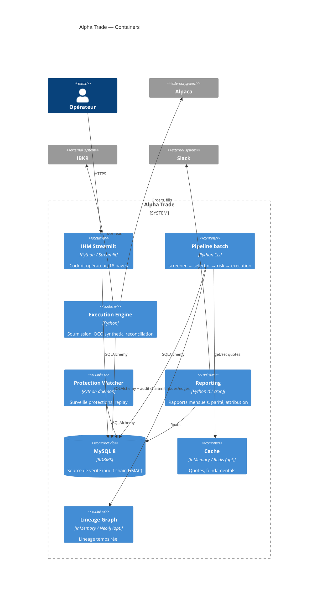

# C4 Model — Niveau 2 : Containers

> Phase C / S18.1. Décomposition d'Alpha Trade en applications/services
> déployables.

```mermaid
C4Container
    title Alpha Trade — Containers

    Person(operator, "Opérateur")

    System_Boundary(at, "Alpha Trade") {
        Container(ihm, "IHM Streamlit", "Python / Streamlit", "Cockpit opérateur, 18 pages")
        Container(pipeline, "Pipeline batch", "Python CLI", "screener → selector → risk → execution")
        Container(execution, "Execution Engine", "Python", "Soumission, OCO synthetic, reconciliation")
        Container(watcher, "Protection Watcher", "Python daemon", "Surveille protections, replay")
        Container(reporting, "Reporting", "Python (CI cron)", "Rapports mensuels, parité, attribution")
        ContainerDb(db, "MySQL 8", "RDBMS", "Source de vérité (audit chain HMAC)")
        Container(cache, "Cache", "InMemory / Redis (opt)", "Quotes, fundamentals")
        Container(lineage, "Lineage Graph", "InMemory / Neo4j (opt)", "Lineage temps réel")
    }

    System_Ext(alpaca, "Alpaca")
    System_Ext(ibkr, "IBKR")
    System_Ext(slack, "Slack")

    Rel(operator, ihm, "HTTPS")
    Rel(ihm, db, "SQLAlchemy")
    Rel(pipeline, db, "SQLAlchemy")
    Rel(execution, db, "SQLAlchemy + audit chain")
    Rel(watcher, db, "SQLAlchemy")
    Rel(execution, alpaca, "Orders, fills")
    Rel(execution, ibkr, "Failover read")
    Rel(reporting, db, "Reads")
    Rel(reporting, slack, "Alerts")
    Rel(pipeline, cache, "get/set quotes")
    Rel(pipeline, lineage, "emit nodes/edges")
```

