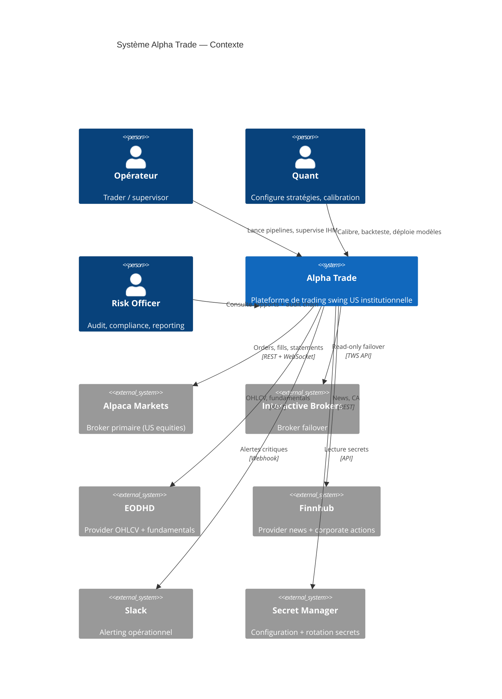

# C4 Model — Niveau 1 : Contexte système

> Phase C / S18.1. Format Mermaid C4. Voir aussi `c4_container.md` et
> `c4_component.md`.

```mermaid
C4Context
    title Système Alpha Trade — Contexte

    Person(operator, "Opérateur", "Trader / supervisor")
    Person(quant, "Quant", "Configure stratégies, calibration")
    Person(risk_officer, "Risk Officer", "Audit, compliance, reporting")

    System(alpha_trade, "Alpha Trade", "Plateforme de trading swing US institutionnelle")

    System_Ext(alpaca, "Alpaca Markets", "Broker primaire (US equities)")
    System_Ext(ibkr, "Interactive Brokers", "Broker failover")
    System_Ext(eodhd, "EODHD", "Provider OHLCV + fundamentals")
    System_Ext(finnhub, "Finnhub", "Provider news + corporate actions")
    System_Ext(slack, "Slack", "Alerting opérationnel")
    System_Ext(vault, "Secret Manager", "Configuration + rotation secrets")

    Rel(operator, alpha_trade, "Lance pipelines, supervise IHM")
    Rel(quant, alpha_trade, "Calibre, backteste, déploie modèles")
    Rel(risk_officer, alpha_trade, "Consulte rapports + audit chain")

    Rel(alpha_trade, alpaca, "Orders, fills, statements", "REST + WebSocket")
    Rel(alpha_trade, ibkr, "Read-only failover", "TWS API")
    Rel(alpha_trade, eodhd, "OHLCV, fundamentals", "REST")
    Rel(alpha_trade, finnhub, "News, CA", "REST")
    Rel(alpha_trade, slack, "Alertes critiques", "Webhook")
    Rel(alpha_trade, vault, "Lecture secrets", "API")
```

