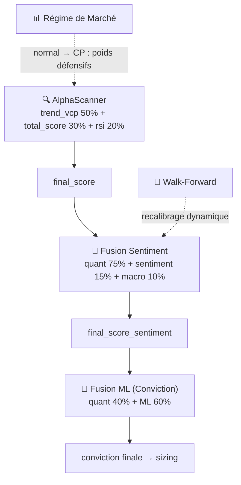

# Répartition des Poids dans la Chaîne de Décision

> Synthèse générée le 2026-06-20 — source : codebase Alpha Trade

La chaîne de décision s'articule en **4 niveaux de fusion successifs** :

---

## 1. AlphaScanner — Scoring multi-facteurs interne

Le **`final_score`** brut de l'AlphaScanner est une somme pondérée de 3 sous-facteurs (définis dans `selector/config.py`, `AlphaScannerConfig`) :

| Facteur | Poids | Rôle |
|---|---|---|
| `trend_vcp` (Trend + VCP Minervini) | **50%** | Momentum directionnel + contraction de volatilité |
| `total_score` | **30%** | Score composite historique (IBD-style) |
| `rsi` (Relative Strength Index) | **20%** | Force relative |

$$final\_score = 0.50 \times trend\_vcp + 0.30 \times total\_score + 0.20 \times rsi$$

**Fichiers clés** : `selector/config.py` (lignes 333-336), `selector/scanner.py`

---

## 2. Fusion Sentiment — `final_score_sentiment`

Le **`SentimentSignalAggregator`** (`event_sentiment/signal_aggregator.py`) fusionne le score quantitatif avec le sentiment FinBERT et les signaux macro-sectoriels. Les poids sont définis dans `config.yaml` (section `conviction`) et dans `core/conviction.py` (`SentimentFusionWeights`) :

| Composante | Poids | Source |
|---|---|---|
| **Quantitatif** (AlphaScanner) | **75%** | `final_score` du scanner |
| **Sentiment** (FinBERT) | **15%** | News ticker → `sentiment_net_agg` normalisé |
| **Macro sectoriel** | **10%** | Impact sectoriel → `sector_impact_agg` normalisé |

$$final\_score\_sentiment = clip(0.75 \times quant + 0.15 \times sentiment + 0.10 \times macro,\ 0,\ 1)$$

Quand le signal sentiment est inactif (pas assez de news), le poids sentiment est remplacé par la valeur neutre $0.5$.

**Fichiers clés** : `config.yaml` (lignes 346-350), `core/conviction.py` (lignes 105-150), `event_sentiment/signal_aggregator.py` (lignes 1170-1210)

---

## 3. Conviction — Fusion Quant + ML pour le sizing

La **conviction finale** (`core/conviction.py`, `compute_conviction()`) combine le score quantitatif avec la **prédiction des modèles de ML avancés** (LSTM+Attention, LightGBM, CatBoost — orchestrés par `modelFactory`). Les poids varient selon le preset de capital :

### Petits comptes (0 – 10 000 $)

| Composante | Poids |
|---|---|
| Score quantitatif (`risk_score_weight`) | **55%** |
| Prédiction ML (`risk_prediction_weight`) | **45%** |

### Comptes intermédiaires / grands (10 000 $+)

| Composante | Poids |
|---|---|
| Score quantitatif (`risk_score_weight`) | **40%** |
| Prédiction ML (`risk_prediction_weight`) | **60%** |

$$conviction = score\_weight \times score\_quant + prediction\_weight \times predicted\_proba_{ML}$$

> Plus le compte est grand, plus le ML prend de poids dans la décision finale de sizing.

**Fichiers clés** : `core/conviction.py` (lignes 33-80), `config/capital_presets.yaml`, `common/capital_presets.py`

---

## 4. Régime de marché — Ajustement dynamique

Le module `selector/regime_scoring.py` modifie les poids des facteurs de l'AlphaScanner selon le régime détecté :

### Régime **Normal**

| Facteur | Poids |
|---|---|
| `trend_vcp` | 50% |
| `total_score` | 30% |
| `rsi` | 20% |
| Défensifs (beta, size, low-vol) | 0% |

### Régime **Capital Preservation** (défensif)

| Facteur | Poids |
|---|---|
| `trend_vcp` | 25% |
| `total_score` | 15% |
| `rsi` | 10% |
| `defensive_beta` | 22% |
| `defensive_size` | 13% |
| `defensive_low_vol` | 15% |

Un **rotation factor** (`MomentumRotationState`) peut forcer le passage en mode défensif même en régime normal si le momentum sous-performe (−3% sur 4 semaines).

**Fichiers clés** : `selector/regime_scoring.py`

---

## 5. Walk-Forward Calibration (optionnel)

Les poids de fusion sentiment (`quant_weight`, `sentiment_weight`, `macro_weight`) peuvent être **recalibrés dynamiquement** par walk-forward optimization. Les poids optimaux sont alors stockés dans `stock_scores_history` via les colonnes :

- `walk_forward_quant_weight`
- `walk_forward_sentiment_weight`
- `walk_forward_macro_weight`

Et le score résultant dans `final_score_walk_forward`.

La classe `SentimentWeightCalibrator` (`backtesting/sentiment_calibration.py`) teste des grilles de scénarios :

- Sentiment : 5% → 25%
- Macro : 0% → 15%
- Quant : ≥ 50% (contrainte)

**Fichiers clés** : `backtesting/sentiment_calibration.py`, `backtesting/backfill_scores_history.py`

---

## Résumé visuel

---

## Synthèse globale

| Niveau | Composante | Poids dominant |
|---|---|---|
| AlphaScanner | Quant multi-facteurs | Trend/VCP **50%** |
| Fusion Sentiment | Quant + Sentiment + Macro | Quant **75%** |
| Conviction (sizing) | Quant + ML | ML **60%** (grands comptes) |
| Régime | Normal vs Défensif | Déclencheur conditionnel |

Le **quantitatif (AlphaScanner) domine à 75%** dans la fusion signal, mais le **ML prend 60%** du poids dans la décision finale de conviction/sizing pour les comptes ≥ 10k$. Le **sentiment (FinBERT)** apporte un boost modéré de **15%**, et le **macro-sectoriel 10%**. Le tout est modulé par le régime de marché et potentiellement recalibré par walk-forward.
