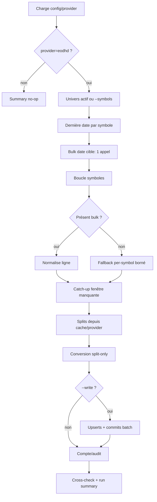

# Ingestion EODHD et backfill historique

Retour : [références Data](README.md) · [vue globale](../05_donnees_et_univers_pit.md)

## Périmètre et code de référence

La façade `dataIntegrityEngine/import_eodhd_bar.py` conserve des symboles patchables pour les tests, mais le comportement réel est réparti entre `eodhd/cli.py`, `orchestrator.py`, `transforms.py` et `progress.py`. Les appels HTTP, cache, quota et conversion résident dans `service/eodhd/`.

## Routage du provider

Le CLI lit `market_data.bars_provider`. Si la valeur n'est pas `eodhd`, il n'appelle aucun endpoint et publie un summary de no-op. Il n'existe pas de fallback automatique vers Alpaca : changer de source est une décision opérateur parce que couverture, volume et provenance changent.

## Algorithme du run daily



La date cible est la dernière séance résolue par le calendrier. L'offset de publication bulk est lu mais la résolution actuelle repose sur la dernière date de marché. L'univers explicite est normalisé en uppercase/dédoublonné ; sinon les filtres éligibles de `database.assets` s'appliquent.

Le bulk est indexé sur les symboles projet. Une ligne déjà présente à la même date compte comme up-to-date. `resolve_missing_fetch_window` détermine le catch-up entre dernière barre et cible en tenant compte de la couverture bulk. Les symboles sans historique absents du bulk utilisent un budget de fallback, 100 par défaut.

Les preferred/series explicitement reconnues non supportées ne consomment pas inutilement le fallback. En write, elles peuvent mettre `bars_available=false` dans metadata. Un symbole non trouvé et une panne provider ont des compteurs différents.

## Splits et conversion

`_cached_fetch_splits` consulte le cache disque avec TTL. Sur erreur fetch/quota/circuit, il journalise puis renvoie/cache `[]`. `eodhd_to_split_only` transforme les données brutes afin que les séries respectent `data_adjustment='split'`. Les adaptateurs construisent séparément les rows `stock_bars` et `stock_bars_daily` avec `data_source='eodhd_eod'`.

Un changement de logique de split exige des tests de continuité autour de la date ex-split et une vérification qu'aucun split n'est appliqué deux fois par corporate actions.

## Transactions et idempotence

En write, les rows sont accumulées puis `_flush_pending_write_rows` exécute deux upserts et un commit. `--commit-every-symbols 100` limite l'impact d'une panne ; `0` diffère tout au commit final. Les compteurs `symbols_committed`, `last_commit_symbol_index` et `pending_rows_*` rendent la reprise observable.

Les upserts remplacent les champs de marché/source sur conflit de clé. Rejouer la même date est idempotent au niveau lignes, mais peut corriger les valeurs si le provider a révisé son EOD ; le hash/données du backtest peuvent donc changer.

## Quota et circuit breaker

Le tracker comptabilise appels utilisés/échoués. Le circuit est vérifié avant chaque symbole et après fetch. Les `stopped_reason` différencient bulk, catch-up et recovery. Une ouverture du circuit provoque un arrêt propre et un summary partiel ; elle ne doit pas être interprétée comme succès complet même si le CLI ne s'est pas interrompu par exception Python.

## CLI

| Option | Défaut | Effet |
|---|---:|---|
| `--symbols` | univers DB | sous-univers explicite |
| `--target-date` | dernière séance | cible ISO |
| `--per-symbol-limit` | 100 | budget recovery sans bulk/historique |
| `--commit-every-symbols` | 100 | fréquence commits, 0 = final |
| `--dry-run` | actif | aucune écriture |
| `--write` | faux | active les upserts |
| `--no-stooq-cross-check` | faux | coupe le contrôle externe |

```powershell
python -m dataIntegrityEngine.import_eodhd_bar --write
python -m dataIntegrityEngine.import_eodhd_bar --write --target-date 2026-08-28 --symbols AAPL MSFT
```

Le code de sortie vaut 1 si `errors > 0`, sinon 0. Toujours inspecter `stopped_reason` et les compteurs, pas seulement le code.

## Backfill

`backfill_eodhd_history.py` utilise une période longue, un bookmark persistant et des commits par batch. Le dry-run et la reprise sont activés par défaut. Avant `--write`, figer univers/période et estimer quota. Après, contrôler dates min/max, séances attendues, source, ajustement, doublons et couverture par symbole.

## Tests et maintenance

Les tests `test_import_eodhd_bar.py`, `test_backfill_eodhd_history.py`, `test_eodhd_provider_switch.py`, `test_eodhd_split_only.py`, volume audit et symbol mapping sont les contrats prioritaires. Le shim doit rester patchable tant que ces tests et appels historiques en dépendent.

