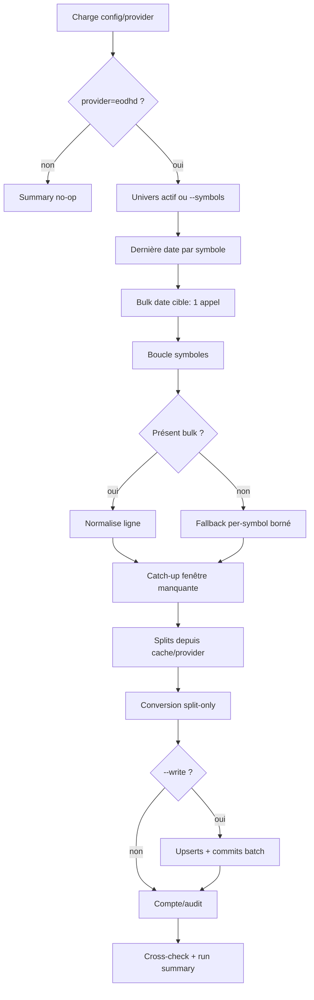

# Ingestion EODHD et backfill historique

<!-- doc-status:start -->
> Statut documentaire au 2026-10-10 — Guide courant : lire aussi les contrats transverses actualisés. Les inventaires générés localisent le code ; ils ne prouvent ni état en base ni réussite opérationnelle. [Référence actuelle](../ETAT_ACTUEL_IMPLEMENTATION.md).
<!-- doc-status:end -->

Retour : [références Data](README.md) · [vue globale](../05_donnees_et_univers_pit.md)

## Périmètre et code de référence

La façade `dataIntegrityEngine/import_eodhd_bar.py` conserve des symboles patchables pour les tests, mais le comportement réel est réparti entre `eodhd/cli.py`, `orchestrator.py`, `transforms.py` et `progress.py`. Les appels HTTP, cache, quota et conversion résident dans `service/eodhd/`.

## Routage du provider

Le CLI lit `market_data.bars_provider`. Hors `eodhd`, un import autonome produit
un no-op ; avec `--require-target-coverage`, le provider incompatible est une
erreur avant tout appel. Il n'existe pas de fallback automatique vers Alpaca.
Couverture, volume et provenance ne sont pas interchangeables.

## Algorithme du run daily


```mermaid
flowchart TD
  C[Charge config/provider] --> P{provider=eodhd ?}
  P -->|non| N[Summary no-op]
  P -->|oui| U[Univers actif ou --symbols]
  U --> L[Dernière date par symbole]
  L --> B[Bulk date cible: 1 appel]
  B --> S[Boucle symboles]
  S --> M{Présent bulk ?}
  M -->|oui| D[Normalise ligne]
  M -->|non| F[Fallback per-symbol borné]
  D --> G[Catch-up fenêtre manquante]
  F --> G
  G --> X[Splits depuis cache/provider]
  X --> A[Conversion split-only]
  A --> W{--write ?}
  W -->|non| Q[Compte/audit]
  W -->|oui| DB[Upserts + commits batch]
  DB --> Q
  Q --> R[Cross-check + run summary]
```

Sans cible explicite, `eodhd/readiness.py` résout la dernière séance dont la
clôture NYSE réelle plus `eodhd.bulk_publish_offset_hours` est passée (défaut
Python deux heures, borne 0–24). Pas de simple date civile ou repli jours ouvrés.
Ce délai est une hypothèse opérationnelle, pas une garantie de publication.
L'univers explicite est normalisé/dédoublonné ; `--symbol-source universe-file:...`
et `--symbols` sont incompatibles. Un fichier explicite vide est bloquant, sans
repli vers tous les actifs. Sinon l'univers DB éligible s'applique.

Le bulk est indexé sur les symboles projet. Hors contrôle renforcé, une ligne
déjà présente à la même date compte comme up-to-date. Avec
`--require-target-coverage`, `refresh_target_date` permet de rafraîchir J.
`resolve_missing_fetch_window` détermine le catch-up entre dernière barre et
cible selon la couverture bulk. Les symboles sans historique absents du bulk
utilisent un budget de fallback, 100 par défaut.

## Contrôle quotidien renforcé du pipeline US

Le pipeline fige J, transmet `--target-date`, `--write`, un univers explicite,
`--wait-for-publication` et `--require-target-coverage`. L'attente est bornée
pour une cible future et tient compte de la clôture effective (demi-séances
comprises), puis le contrôle relit les cours **canoniques committés de J**.
Il exige par défaut 95 % de l'univers et la présence indépendante du benchmark
SPY : OHLCV positifs/cohérents, `is_filled=0`. J−1 ne satisfait jamais ce gate.

Une couverture insuffisante ou un contrôle SQL impossible conserve les compteurs
d'import, publie `FAILED` et retourne 1. Les commits déjà effectués restent
présents ; on répare/rejoue l'import avant les étapes aval, sans rollback global.

Les preferred/series explicitement reconnues non supportées ne consomment pas inutilement le fallback. En write, elles peuvent mettre `bars_available=false` dans metadata. Un symbole non trouvé et une panne provider ont des compteurs différents.

## Splits et conversion

`_cached_fetch_splits` consulte le cache disque avec TTL. Sur erreur fetch/quota/circuit, il journalise puis renvoie/cache `[]`. `eodhd_to_split_only` transforme les données brutes afin que les séries respectent `data_adjustment='split'`. Les adaptateurs construisent séparément les rows `stock_bars` et `stock_bars_daily` avec `data_source='eodhd_eod'`.

Un changement de logique de split exige des tests de continuité autour de la date ex-split et une vérification qu'aucun split n'est appliqué deux fois par corporate actions.

## Transactions et idempotence

En write, les rows sont accumulées puis `_flush_pending_write_rows` exécute deux upserts et un commit. `--commit-every-symbols 100` limite l'impact d'une panne ; `0` diffère tout au commit final. Les compteurs `symbols_committed`, `last_commit_symbol_index` et `pending_rows_*` rendent la reprise observable.

Les upserts remplacent les champs de marché/source sur conflit de clé. Rejouer la même date est idempotent au niveau lignes, mais peut corriger les valeurs si le provider a révisé son EOD ; le hash/données du backtest peuvent donc changer.

## Quota et circuit breaker

Le tracker comptabilise appels utilisés/échoués. Le circuit est vérifié avant chaque symbole et après fetch. Les `stopped_reason` différencient bulk, catch-up et recovery. Une ouverture du circuit provoque un arrêt propre et un summary partiel ; elle ne doit pas être interprétée comme succès complet même si le CLI ne s'est pas interrompu par exception Python.

## CLI

| Option | Défaut | Effet |
|---|---:|---|
| `--symbols` | univers DB | sous-univers explicite |
| `--target-date` | dernière séance publiée | cible ISO |
| `--symbol-source` | absent | fichier explicite ; incompatible avec --symbols |
| `--wait-for-publication` | faux | exige une cible ; attente en mode write |
| `--require-target-coverage` | faux | exige cible, write et univers explicite ; gate exact J |
| `--min-target-coverage` | 0,95 | ratio minimal dans ]0,1] |
| `--benchmark-symbol` | SPY | doit être disponible en plus du ratio d'univers |
| `--per-symbol-limit` | 100 | budget recovery sans bulk/historique |
| `--commit-every-symbols` | 100 | fréquence commits, 0 = final |
| `--dry-run` | actif | aucune écriture |
| `--write` | faux | active les upserts |
| `--no-stooq-cross-check` | faux | coupe le contrôle externe |

```powershell
python -m dataIntegrityEngine.import_eodhd_bar --write
python -m dataIntegrityEngine.import_eodhd_bar --write --target-date 2026-08-28 --symbols AAPL MSFT
```

Le code de sortie vaut 1 si `errors > 0`, sinon 0. Toujours inspecter `stopped_reason` et les compteurs, pas seulement le code.

## Backfill

`backfill_eodhd_history.py` utilise une période longue, un bookmark persistant et des commits par batch. Le dry-run et la reprise sont activés par défaut. Avant `--write`, figer univers/période et estimer quota. Après, contrôler dates min/max, séances attendues, source, ajustement, doublons et couverture par symbole.

## Tests et maintenance

Les tests `test_import_eodhd_bar.py`, `test_backfill_eodhd_history.py`, `test_eodhd_provider_switch.py`, `test_eodhd_split_only.py`, volume audit et symbol mapping sont les contrats prioritaires. Le shim doit rester patchable tant que ces tests et appels historiques en dépendent.

