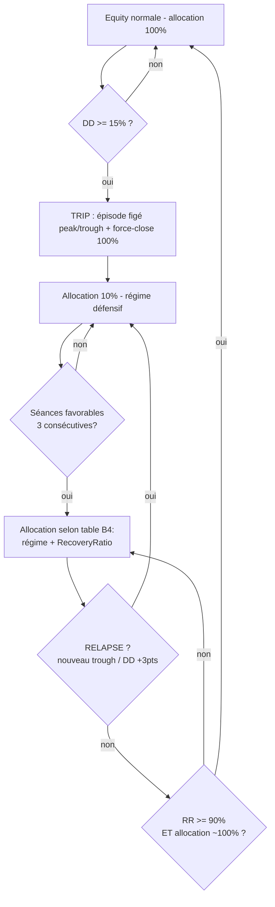

# Synthèse — Gestion du Drawdown et reprise d'activité (2026-08-21)

> Document autonome : décrit le système de gestion du risque de drawdown en place
> (circuit breaker adaptatif B4 + force-close), comment le portefeuille **reprend
> l'activité** après un épisode de drawdown, et ce que les tests récents (E32, E33)
> ont établi. Chiffres = valeurs réellement actives dans `config.yaml`.

---

## 1. Le problème

Le portefeuille est un book **momentum long/short** (6L/2S, ~68 positions
concurrentes, sizing ATR, coûts 3 bps round-trip). Un **drawdown (DD)** est une
baisse de l'equity depuis son plus haut (peak). Le DD n'est pas un bug : c'est le
**prix de l'alpha momentum**. Dans l'historique de test (2018-2026), le pire
épisode est **−26 %** (bear 2022). L'objectif du risk management est de **borner
le DD (pas de l'éliminer)** et de **contrôler la reprise** : jamais tout le capital
exposé tant que le portefeuille n'a pas prouvé sa récupération.

Seuil de référence : **DD limite = −15 %** (borne, pas cible).
Config : `risk.max_drawdown: 0.15`, `risk.max_daily_loss: 0.05`.

---

## 2. Les mécanismes de protection en place

| Mécanisme | Paramètre actif (`config.yaml`) | Rôle |
|---|---|---|
| **Circuit breaker B4** | `policy: b4` | Coupe les nouvelles entrées quand DD ≥ 15 %, puis **réarme progressivement** selon régime marché + récupération de l'equity. |
| **Force-close** | `force_close_on_breaker: true`, `force_close_pct: 1.0` | Au moment exact du trip (15 %), **liquide les positions** (ici 100 %), pires PnL d'abord, sans frais de sortie. |
| **Short limité** | `short_selling_enabled: true`, `max_short_positions: 2` | Cap sur l'exposition short. |
| **Market regimes** | `market_regimes.enabled: true` | En `capital_preservation` : coupe le levier, réduit max positions, plafonne l'exposition brute (0.65). |
| **Levier borné** | `max_leverage: 2.0` (usage ~1.5×), margin requis, equity min 2000$ | Plafond de levier ; jamais 2× en pratique (m8). |

### 2.1 Circuit breaker adaptatif B4 (détail)

Le breaker réévalue le régime SPY **chaque jour** (contrairement au trailing
stop, gelé à l'entrée) :
- `BULL` : SPY > SMA200 et SPY > SMA50
- `REBOUND` : SPY ≤ SMA200 et SPY > SMA50
- `CORRECTION` : SPY > SMA200 et SPY ≤ SMA50
- `SLIDE` : SPY ≤ SMA200 et SPY ≤ SMA50

**Fail-safe** : si la carte régime SPY est absente, l'allocation est plafonnée
à 10 % (le système protège par défaut, il ne se réexpose pas aveuglément).

### 2.2 Force-close (détail)

Déclenché sur `just_tripped()` (le jour exact où le breaker trippe) :
1. Calcule le PnL de chaque position ouverte (prix de clôture du jour).
2. Trie par PnL **croissant** (les pires perdants d'abord).
3. Liquide `force_close_pct` → ici `1.0` = **toutes** les positions.
4. Sortie au prix de clôture, `exit_reason="force_close_breaker"`, **sans frais de sortie** (règle A-021).
5. Variante alternative disponible (non active) : `force_close_losers_on_breaker` (E19) — ne coupe que les positions en perte.

---

## 3. Comment on reprend l'activité après un DD (mécanique B4)

C'est le cœur du système : **le portefeuille ne se réexpose pas d'un coup**.
Deux variables pilotent la reprise :

- **Le régime SPY « autorise »** (un marché favorable peut permettre de réarmer).
- **Le RecoveryRatio (RR) « plafonne »** (même en régime favorable, on ne remonte
  l'exposition que si l'equity récupère réellement).

$$RR = \frac{\text{equity} - \text{trough}}{\text{peak} - \text{trough}}$$
(0.0 = au plus bas, 1.0 = retour à l'ancien sommet). `peak` et `trough` sont
figés au moment du trip (high-water mark d'épisode).

### 3.1 Allocation cible pendant l'épisode (table B4)

| Régime SPY | Condition | Allocation max |
|---|---|---|
| SLIDE / CORRECTION | toujours | **10 %** |
| REBOUND | 3 séances favorables consécutives | 25 % |
| REBOUND | RR ≥ 25 % | 50 % |
| BULL | 3 séances favorables consécutives | 50 % |
| BULL | RR ≥ 25 % | 75 % |
| BULL | RR ≥ 50 % | **100 %** |

Règles de sécurité :
- **Hystérésis** : il faut **3 séances favorables consécutives** pour AUGMENTER ;
  une séance défavorable remet le compteur à zéro (lent pour faire confiance,
  rapide pour protéger).
- **RELAPSE anti-rechute** : si pendant le réarmement l'equity fait un **nouveau
  trough** OU que le DD se **détériore de ≥ 3 points** depuis le début du
  réarmement → retour immédiat à **10 %**, compteur reset.
- Un simple flip SLIDE → REBOUND **ne ramène pas à 100 %** (c'était le défaut
  de 2022 que B4 corrige).

### 3.2 Fin de l'épisode (réarmement complet)

L'épisode est clos — et l'allocation revient à 100 % — seulement quand :
$$RR \ge 90\% \quad\text{ET}\quad \text{allocation} \ge 99.9\%$$
C'est-à-dire : le portefeuille a **réellement récupéré presque toute sa perte**
et tournait déjà à pleine allocation. Pas de retour à la normale « au régime seul ».

### 3.3 Diagramme du cycle de vie d'un épisode de DD

---

## 4. Ce que disent les tests récents (E32, E33)

### 4.1 E32 — Attribution du trip (KEEP vs LIQUIDATE)

Audit causal (aucune règle modifiée), rejeu B25 6L/2S 2018-2026 :
- **Un seul épisode ≥ 15 %** dans tout l'historique : **bear 2022**
  (pic 2021-03-15 → trip 2022-01-05 → trough 2022-11-28, DD **26 %**).
  Ni 2020 ni avril 2025 ne tripent (les shorts + B4 absorbent, DD < 15 %).
- **Au trip** (19 positions) : liquider ne sauve que **~1 250 $** — la casse est
  déjà réalisée par les stops → le force-close à 15 % arrive **tard**.
- **Au début du drawdown (pic)** (52 positions) : liquider aurait évité
  **~7 900 $** → couper **tôt et partiellement** protège bien plus que couper tout au trip.
- **Pas de V-recovery** en 2022 : à J+20, 79 % des positions étaient encore en
  perte → **pas de coût d'opportunité** à avoir liquidé.
- **Concentration** : top-2 = 35 % des pertes (RVLV, REXR), top-5 = 59 %,
  top-10 = 87 % ; RVLV présent 3 fois → cap de concentration = levier distinct.

### 4.2 E33 — Caps de concentration

Sweep de caps sur la même machine (2018-2026) :
- Baseline : MaxDD **−26 %**, max 19 positions sur un même symbole (extrême, mais
  artefact du proxy de test — la prod plafonne déjà à 5).
- Cap 2/symbole : rendement **−33 %** → trop agressif, tue l'alpha.
- **Cap 3/symbole + 50 %/secteur : rendement −9 %, MaxDD inchangé → GATE OK** (hygiène prod recommandée).

**Conclusion des deux tests** :
1. **La concentration n'est pas le moteur du MaxDD** (les caps ne le réduisent pas :
   le bear 2022 frappe tout le livre). Le MaxDD est le prix de l'alpha momentum.
2. **Le vrai levier sur le MaxDD est de réduire l'exposition AVANT le trip**
   (couper tôt et partiellement), pas le force-close global à 15 % ni les caps.
3. Le force-close total actif (`1.0`) est **cohérent mais d'effet marginal**
   sur le MaxDD — il sécurise la fin de l'épisode, pas son amplitude.

---

## 5. Recommandations opérationnelles (reprendre l'activité)

Le système B4 **réarme seul et progressivement**. Le rôle de l'opérateur :

1. **Ne rien réinjecter manuellement** pendant un épisode : l'allocation cible
   B4 pilote le sizing (10 % → 100 % selon table §3.1).
2. **Vérifier le trip** dans les logs : `exit_reason="force_close_breaker"` et le
   warning breaker = signal que l'épisode a commencé.
3. **Contrôler la carte régime SPY** est présente : sinon fail-safe à 10 %
   (comportement voulu, mais à connaître).
4. **Ne pas accélérer le réarmement** : l'hystérésis 3 séances + RR sont des
   garde-fous, pas des suggestions.
5. **Surveillance de reprise** : suivre l'audit `exit_closed` (P&L réel) et non
   la somme des trades ; 0 `initial_stop` attendu (trailing actif dès l'entrée).
6. **Levier** : plafond 2×, usage cible ~1.5× ; jamais plus tôt dans la reprise
   que ce que B4 autorise.
7. **Seuil unique** : −15 % = borne de trip ; ne pas « recharger » en cours de
   drawdown sous prétexte de bargains (les positions en bear 2022 n'ont pas
   récupéré à J+20).

### 5.1 Prochaine amélioration identifiée (E34)

La piste validée par E32 pour **réduire l'amplitude du MaxDD** :
**réduction partielle d'exposition sur un premier palier de DD bien inférieur à
15 %** (ex. 5-8 %), proportionnelle et progressive — puis B4 garde son rôle de
breaker catastrophe à 15 %. Objectif : couper tôt et partiellement, là où E32 a
montré que ça protège (~7,9 k$), au lieu d'attendre le trip.

### 5.2 VERDICT GATE PROD — E34 est FROZEN (2026-08-22)

La piste E34 (section 5.1) a été testée sur le **pipeline PROD complet** (profil
`production-parity`, config réellement active, equity 4000 €, preset
`capital_2001_5000`, m8, policy b4, force-close via config.yaml). Résultats du
gate — voir aussi `scripts/e34b/e34c` (2022) et `scripts/e35a/e35b` (2025) :

| Test | Ret | MaxDD | Trip B4 | Force-close | CP jours | V-recovery |
|---|---|---|---|---|---|---|
| **2022** (bear prolongé) | +4.20 % | −6.11 % | 0 | 0 | 118/251 (47 %) | — |
| **2025** (correction + reprise) | +17.92 % | −10.57 % | 0 | 0 | 25/249 (10 %) | **+15.6 % à J+60 vs SPY +6.1 %** (capture 2.5×), retour au pic 50 j |

Conclusion : **le problème qu'E34 devait résoudre (exposition dégradée avant
−15/−25 %) n'existe pas dans le pipeline PROD actuel.** Les overlays (market
regimes / capital_preservation → sizing → B4 à −15 %) absorbent le drawdown avant
le seuil. Un pré-breaker à −5/−8/−10 % risquerait de **dupliquer capital_preservation**
et de **couper des reprises** comme 2025 (gross 83 % au trough, capture 2.5×).

> **Décision : E34 = FROZEN / NO NEED avec la config PROD actuelle.**
> B4 reste le filet catastrophe à −15 %. À **réévaluer uniquement** si on augmente
> fortement gross/levier ou le nombre de positions (le DD pourrait alors re-monter
> vers −15 %).

**2020 (COVID)** : non testable avec le batch B25 (couverture ML 38.87 % < 90 %
sur 2020 — 123/251 dates vs 248 en 2022, 261 en 2025). Validation différée :
uniquement avec un batch historiquement PIT-dense et **comparable** (jamais un
batch différent juste pour remplir la période).

### 5.3 Prochaine expérience — attribution causale de `capital_preservation`

Question scientifique : *CP apporte-t-il assez de réduction de risque pour
justifier le rendement sacrifié ?* Test : **PROD vs PROD identique avec CP
désactivé** (mêmes dates, B25, m8, C2, B4, coûts, sélection, sizing, PIT, seed).
Commencer par 2022 et 2025 séparément, puis la fenêtre principale.

Définition « CP off » : `market_regimes.enabled: true` conservé (min_notional,
sector_limits, yields soft, macro quality), mais **toutes les sources CP
neutralisées** — `vix/vxn/vix3m/move/rvx` désactivés, `sentiment_circuit_breaker`
désactivé (warning→CP est en dur), `yields.hard_mode_backtest: normal`. Variant
chargé via `--config-path config/market_regimes_cp_off.yaml` (ne remplace QUE le
bloc `market_regimes` ; risk/leverage/batch restent sur `config.yaml`).

**Gates de décision** (pas « sans CP gagne + → supprimer ») : regarder
conjointement **ΔReturn, ΔMaxDD, Sharpe/Sortino, worst 3m/6m, gross, trips B4,
force-close, vitesse/capture de recovery**. En 2022, accepter un rendement moindre
peut être rationnel si CP explique le maintien du DD ~ −6 %. En 2025, vérifier que
CP n'a pas inutilement freiné la reprise.

---

## 6. Chiffres clés (mémo)

| Paramètre | Valeur active |
|---|---|
| Seuil de trip | DD ≥ 15 % (`max_drawdown: 0.15`) |
| Force-close au trip | 100 % des positions (`force_close_on_breaker: true`, `force_close_pct: 1.0`) |
| Politique breaker | `b4` (regime rearm + equity confirm + RELAPSE) |
| Allocation plancher pendant épisode | 10 % |
| Réarmement complet | RR ≥ 90 % ET allocation ~100 % |
| Hystérésis | 3 séances favorables consécutives |
| RELAPSE | nouveau trough OU DD +3 pts → 10 % |
| Short | 2 positions max |
| Levier | plafond 2×, usage ~1.5×, margin + equity ≥ 2000$ |
| Pire MaxDD historique (test) | ~ −26 % (bear 2022) |
