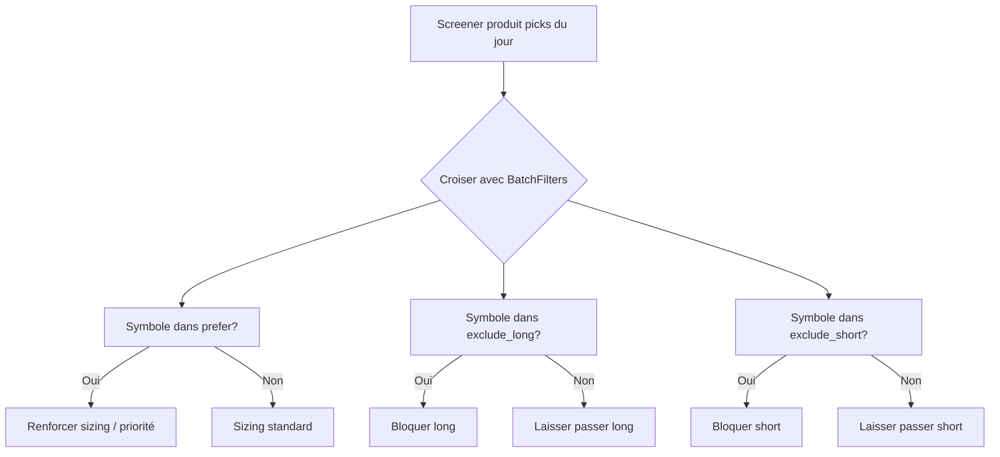

# 🔍 Filtre ML — Diagnostics batch pour live & backtest

> **Créé le** : 2026-07-23  
> **Module** : `modelFactory/batch_diagnostics.py`  
> **Table** : `alpha_trade.model_batch_diagnostics`  
> **Migration** : `alembic/versions/0054_add_model_batch_diagnostics.py`

---

## 🎯 Objectif

À la fin de chaque campagne d'entraînement (`modelFactory --mode train`), on snapshot les diagnostics Walk-Forward dans une table dédiée. Ces données sont consommées par le **live** et le **backtest** pour filtrer les symboles peu prédictibles ou directionnellement biaisés.

---

## 🏗️ Architecture

```
┌──────────────────────────────────────────────────────────────┐
│                   run_training_batch()                       │
│                   (orchestrator.py)                          │
│                         │                                    │
│                         ▼                                    │
│              persist_batch_diagnostics()                     │
│              (batch_diagnostics.py)                          │
│                         │                                    │
│                         ▼                                    │
│    ┌─────────────────────────────────────────────┐           │
│    │  alpha_trade.model_batch_diagnostics         │           │
│    │  (1 ligne par symbole × rank_type)          │           │
│    └─────────────────────────────────────────────┘           │
│                         │                                    │
│                         ▼                                    │
│    ┌─────────────────────────────────────────────┐           │
│    │  get_batch_filters() → BatchFilters          │           │
│    │  → .prefer        (top N)                   │           │
│    │  → .exclude_long  (bottom + weak_long)      │           │
│    │  → .exclude_short (bottom + zero_short      │           │
│    │                    + weak_short)             │           │
│    └─────────────────────────────────────────────┘           │
│                         │                                    │
│                         ▼                                    │
│    ┌─────────────────────────────────────────────┐           │
│    │  Live / Backtest : croisement avec les      │           │
│    │  sélections du jour (screener)              │           │
│    └─────────────────────────────────────────────┘           │
└──────────────────────────────────────────────────────────────┘
```

---

## 📊 Table `model_batch_diagnostics`

| Colonne | Type | Description |
|---------|------|-------------|
| `id` | BIGINT PK | Auto-incrément |
| `batch_id` | VARCHAR(64) | Identifiant du batch |
| `batch_started_at` | DATETIME | Dénormalisé pour requêtes sans JOIN |
| `symbol` | VARCHAR(20) | Ticker |
| `f1_macro_wf` | DOUBLE | F1 macro Walk-Forward |
| `f1_long_wf` | DOUBLE | F1 classe long WF |
| `f1_short_wf` | DOUBLE | F1 classe short WF |
| `f1_flat_wf` | DOUBLE | F1 classe flat WF |
| `rank_type` | VARCHAR(20) | `top` / `bottom` / `zero_short` / `weak_long` / `weak_short` |
| `rank_position` | INT | 1..N pour top/bottom, NULL sinon |
| `threshold_used` | DOUBLE | Seuil pour weak_long / weak_short |
| `created_at` | DATETIME | Date de création |

### Index
- `idx_batch_diag_batch_rank` (batch_id, rank_type) — requêtes principales
- `idx_batch_diag_symbol` (symbol) — lookup par symbole
- `idx_batch_diag_started` (batch_started_at) — dernier batch

---

## 🏷️ Catégories `rank_type`

| Catégorie | Condition | Signification |
|-----------|-----------|---------------|
| `top` | Parmi les N meilleurs f1_macro_wf | **Privilégier** si présent dans les sélections du jour |
| `bottom` | Parmi les N pires f1_macro_wf | **Exclure** long et short |
| `zero_short` | f1_short_wf = 0 | Modèle incapable de shorter |
| `weak_long` | 0 < f1_long_wf < seuil (défaut 0.15) | Long inefficace |
| `weak_short` | 0 < f1_short_wf < seuil (défaut 0.15) | Short inefficace |

### Règles de filtrage

```python
EXCLUDE_LONG  = {'bottom', 'weak_long'}
EXCLUDE_SHORT = {'bottom', 'zero_short', 'weak_short'}
PREFER        = {'top'}
```

---

## ⚙️ Configuration (`config.yaml`)

```yaml
batch_diagnostics:
  top_n: 50                    # Nombre de symboles dans le top
  bottom_n: 50                 # Nombre de symboles dans le bottom
  weak_long_threshold: 0.15    # Seuil f1_long pour weak_long
  weak_short_threshold: 0.15   # Seuil f1_short pour weak_short
```

---

## 🔌 API

### Persistence (appelée automatiquement en fin de batch)

```python
from modelFactory.batch_diagnostics import persist_batch_diagnostics

# Appelé dans orchestrator.py à la fin de run_training_batch()
count = persist_batch_diagnostics(engine, batch_id)
# → rows insérées dans model_batch_diagnostics
```

### Lecture (consommé par le live/backtest)

```python
from modelFactory.batch_diagnostics import get_batch_filters, BatchFilters

filters: BatchFilters = get_batch_filters(engine, batch_id=None, top_n=50)

# filters.prefer        → frozenset[str]  # symboles à privilégier
# filters.exclude_long  → frozenset[str]  # à exclure du long
# filters.exclude_short → frozenset[str]  # à exclure du short
# filters.batch_id      → str
# filters.batch_started_at → datetime | None
```

Si `batch_id=None`, utilise automatiquement le **dernier batch** (par `batch_started_at DESC`).

---

## 🔄 Flow quotidien



---

## 📝 Exemple concret

Pour le batch `model-factory-20260723041048-1db3e0` (+VIX, 198 symboles) :

| Catégorie | Nb symboles | Exemples |
|-----------|:---:|------|
| `top` | 50 | ESTA (0.408), SANM (0.397), MOG.A (0.394), DRH (0.390), GTX (0.384) |
| `bottom` | 50 | ANET (0.190), PRG (0.195), HSBC (0.204), INDV (0.208), IIPR (0.213) |
| `zero_short` | 8 | BMO, CFG, INTC, JBHT, SSD, TREX, VOYA, WWD |
| `weak_long` | variable | Tous les symboles avec f1_long_wf < 0.15 |
| `weak_short` | variable | Tous les symboles avec 0 < f1_short_wf < 0.15 |

---

## ⚠️ Précautions

1. **Look-ahead bias** : Ne consommer le batch N qu'à partir de J+1 de `training_end_date`.
2. **Promotion explicite** : Utiliser `model_serving_batch` pour promouvoir un batch en production (ne pas prendre automatiquement le dernier).
3. **Dégradation** : Monitorer l'`avg(f1_macro_wf)` par batch. Si le dernier batch a une moyenne anormalement basse, ne pas l'utiliser.
4. **Univers changeant** : Un symbole exclu peut ne plus être tradable → ignorer silencieusement.

---

## 🧪 Test manuel

```powershell
# 1. Appliquer la migration
alembic upgrade head

# 2. Lancer un batch (la persistence est automatique)
python -m modelFactory --mode train --feature-set expert --enable-cross-sectional --comment test_diagnostics

# 3. Vérifier les données
python -c "
from database.connection import get_sqlalchemy_engine
from modelFactory.batch_diagnostics import get_batch_filters
engine = get_sqlalchemy_engine()
f = get_batch_filters(engine)
print(f'Batch: {f.batch_id}')
print(f'Prefer ({len(f.prefer)}): {sorted(f.prefer)[:10]}...')
print(f'Exclude long ({len(f.exclude_long)}): {sorted(f.exclude_long)[:10]}...')
print(f'Exclude short ({len(f.exclude_short)}): {sorted(f.exclude_short)[:10]}...')
"
```
