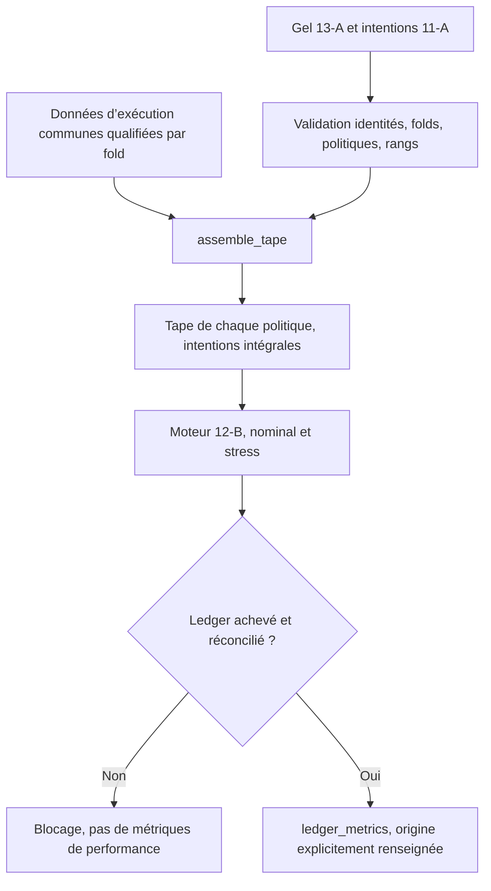

# Sprint 13-B — Préparation des tapes et du reporting économique France

<!-- doc-status:start -->
> Statut documentaire au 2026-10-10 — Recherche / preuve datée : protocole et résultats conservés. Implémentation expérimentale ≠ promotion ML/LIVE ; les commandes restent à confronter aux droits et au catalogue actuels. [Référence actuelle](README.md).
<!-- doc-status:end -->

Date : 4 octobre 2026. Statut **PREPARED_REPLAY_BLOCKED**.
Cette préparation suit le [gel 13-A](sprint_13a_protocole_validation_economique.md).
Les performances économiques réelles ne sont toujours pas calculées : les
preuves manquantes du Sprint 12 n’ont pas été remplacées par des hypothèses.

## Ce qui a été exécuté

```powershell
python -u -m modelFactory.fr_tape_reporting_13b --output artifacts/fr/research/tape_reporting_13b/prepared-20261004-v1
```

Le dossier contient :

- `report.json`, manifest avec empreintes et état des six tâches ;
- `fold-6-shared-template.json` et `fold-7-shared-template.json` ;
- six fichiers `fold-<N>-<politique>-intentions.parquet`.

Les politiques demeurent ATR TOP20 LONG, Oracle TOP20 LONG et contrôle uniforme
LONG. Chaque couple fold/politique doit être comparé sous coûts ×1 et ×2 :
**six tâches, douze cellules de comparaison prévues**, aucune exécutée.
Les intentions et rangs sont ceux du 11-A, pas des trades supposés.

Les empreintes des sources du gel 13-A sont recontrôlées avant l’export.
Le dossier de sortie doit être nouveau : aucun artefact antérieur n’est écrasé.
Aucun téléchargement, entraînement, accès SQL ou appel de courtier n’est réalisé.
Les bases US/CN/FR et leurs flags ne changent pas.

## Architecture de l’assemblage

Implémentation : `service/fr/tape_reporting_13b.py` ; CLI de préparation :
`modelFactory/fr_tape_reporting_13b.py`. Le moteur 12-B reste inchangé.



### Un jeu d’exécution commun par fold

Les prix, statuts, identités, événements, calendrier, règlements et couvertures
doivent être communs aux trois politiques. Le moteur attribue à chacune son
propre portefeuille cash ; le scénario stress peut changer ses quantités/fills
via les coûts, sans changer les intentions initiales.

Les gabarits portent `UNQUALIFIED_TEMPLATE_DO_NOT_REPLAY`. Ils contiennent les
UID et séances de décision requis mais **aucun prix, statut, événement,
horaire ni preuve inventé**. Ils ne sont pas des tapes exécutables.

Leur liste de séances requises n’est pas un calendrier complet d’exécution :
il faut inclure toutes les séances intermédiaires, la dernière sortie H5 et les
paiements de créances dividendes. La liste d’événements vide du gabarit ne
prouve pas qu’aucun événement n’existe.

### Données à fournir avant un assemblage réel

| Champ | Contenu à qualifier |
|---|---|
| `sessions`, `calendar_evidence` | Calendrier XPAR complet, incluant sorties et paiements |
| `instruments` | UID → ISIN et ticker, mêmes identités que les intentions |
| `bars` | Ouvertures/clôtures non ajustées, statut tradable, preuves indépendantes et états d’ouverture |
| `corporate_action_coverage` | Couverture par UID et intervalle, pas seulement une liste fournisseur vide |
| `events` | Événements validés, ratios/montants, devises, détachement/paiement et ordre si nécessaire |
| `settlements` | Dates de règlement et preuves, pour qualifier notamment la fiscalité |
| `decision_at`, `entry_at` | Horodatages avec fuseau ; décision causale et prix accessible |
| `candidate_availability` | Par séance et UID : `available_at` et `evidence` du signal |
| Fiscalité externe | Liste ISIN/date qualifiée utilisée par le moteur, inconnu bloquant |

Le champ `evidence_state=QUALIFIED_EXECUTION_INPUT` est une déclaration d’entrée,
**pas une certification produite par l’assembleur**. Remplacer uniquement ce
champ dans le gabarit ne lève pas les gates du 13-A/Sprint 12. Les preuves doivent
être raccordées et relues avant toute invocation économique réelle.

### Invariants de `assemble_tape`

La fonction reçoit données communes, ledger complet d’intentions, protocole,
fold et politique. Elle refuse :

- folds/politiques/capital/horizon/capacité/devise divergents ;
- candidats préchargés depuis une autre sélection ;
- population commune ne couvrant pas les UID de toutes les politiques du fold ;
- dates de confirmation 2026, calendrier dupliqué ou non ordonné ;
- intentions dupliquées, labels futurs et rangs ambigus ;
- disponibilité absente, horaires naïfs ou signal après décision/entrée.

Elle conserve **toutes les intentions** de la politique choisie et leurs rangs,
sans retirer les futurs perdants ou cas non qualifiés. Elle n’antidate pas les
signaux et ne substitue pas une clôture à une ouverture absente. Le moteur 12-B
conserve ses propres refus d’exécution, contraintes de cash/capacité, contrôles
de couverture CA et fiscalité. Les entrées sont copiées, pas modifiées.

## Reporting calculable sur ledger achevé

`ledger_metrics(result, data_kind=...)` ne reçoit que le résultat d’un rejeu
achevé `COMPLETED_ASSUMED_COST_RESEARCH`. Les valeurs Decimal restent exactes
pour les réconciliations monétaires ; les statistiques sont des flottants.

Avant toute métrique, la fonction vérifie :

- courbe d’equity ordonnée, unique, positive et finie ;
- cash et valeur des positions non négatifs, contrat LONG cash ;
- equity finale − capital initial = PnL du rapport = somme des PnL trades ;
- commissions/spread/slippage/taxes du rapport = sommes des ordres exécutés.

Un ledger bloqué/partiel ne produit **aucun Sharpe, rendement ou PnL reportable**.
Les fichiers partiels du moteur restent des diagnostics de blocage.

| Indicateur | Convention |
|---|---|
| PnL EUR net | Equity finale − capital initial |
| Rendement net | 100 × (equity finale / initiale − 1) |
| Sharpe quotidien | Moyenne des rendements close-to-close, initial→première clôture inclus, écart-type échantillon `ddof=1`, RF=0, annualisation √252 |
| Drawdown | Baisse maximale depuis le pic d’equity, capital initial inclus ; pourcentage positif |
| Expositions moyennes | Moyenne des valeurs de positions / equity à chaque clôture ; brute=nette car LONG-only |
| Turnover | Notionnels BUY + SELL / equity de clôture moyenne, non annualisé ; ratio sans multiplication par 100 |
| Ordres exécutés | BUY/SELL uniquement, pas SKIP/REJECT |
| Trades clôturés / réussite | Trade gagnant si PnL net strictement positif ; égal à zéro non gagnant |
| Frais | Commission, spread, slippage et taxes séparés, montants EUR |
| Dividendes | Cash effectivement payé ; pas double comptage des créances |
| Par symbole | Somme des PnL nets de trades clôturés par UID |
| Par semestre | Variation d’equity, premier semestre depuis le capital initial, suivants depuis la dernière equity précédente |

La moyenne d’exposition à la clôture n’est pas l’exposition moyenne intraday.
La ventilation par symbole utilise les trades clôturés ; celle par semestre
utilise l’equity mark-to-market. Une position traversant un semestre peut donc
avoir une attribution temporelle différente : ce n’est pas une incohérence.

Sans trade, le taux de réussite est `NULL`. Sans variabilité mesurable des
rendements, le Sharpe est `NULL`, pas infini. Avec aucune position, exposition
et turnover valent zéro.

`data_kind` doit être `SYNTHETIC_TEST_ONLY` ou `QUALIFIED_RESEARCH`. Il reste
explicite dans le rapport et n’autorise jamais de serving. `QUALIFIED_RESEARCH`
n’est pas une garantie automatique de preuve ; les gates de la campagne sont
à vérifier séparément avant la comparaison. Le benchmark total-return reste
non qualifié : aucune surperformance au benchmark n’est calculée ici.

## État et suites

Après le nouveau GO 13-B, contrôle de démarrage économique exécuté :
`artifacts/fr/research/tape_reporting_13b/economic-start-gate-20261004-v1/report.json`.
Le moteur d’audit 12-B vérifie la population 11-A et sa qualification sans tape
inventée. Résultat `BLOCKED_EXECUTION_EVIDENCE`, 21 379 chemins, zéro chemin
qualifié, zéro ordre et `net_pnl=null`. Le lancement des comparaisons réelles
est donc refusé. Ce contrôle n’est pas un nouveau backtest ni une preuve de
mauvaise performance Oracle.

Préparation technique exécutée et tests synthétiques réalisés. Les 12 cellules
réelles n’ont pas été calculées. `net_pnl=null`, zéro ordre réel, aucune lecture
de confirmation 2026. Sprint 13 économique reste ouvert.

Prochaine étape : raccorder les preuves du [TODO Sprint 12](TODO_sprint_12_reste_a_faire.md)
aux jeux communs, valider leurs identités/disponibilités, puis archiver les
tapes et les sorties nominal/stress avec leurs hashes. Avant adaptation du
backtest commun, archiver aussi les runs représentatifs US/CN encore demandés
par le Sprint 0. Les tests seuls ne remplacent pas ces preuves.

Si l’on souhaite avancer sous simples données fournisseur présumées exactes,
cela requiert un **nouveau protocole exploratoire explicitement autorisé**,
avec résultat nommé autrement ; cela ne clôturera pas cette validation stricte.

Cette autorisation a depuis été donnée : voir le [13-B exploratoire fournisseur](sprint_13b_exploratoire_fournisseur.md).
Il est séparé, sans promotion de preuves ni modification du moteur strict.
Quatre cellules ATR complètes négatives et vingt bloquées : pas de comparaison
Oracle/ATR complète et aucune clôture du Sprint 12/13 strict.

## Tests

`tests/test_fr_tape_reporting_13b.py` teste conservation de toutes les intentions,
non-mutation des données communes, entrées non qualifiées/incomplètes, disponibilité
future, réconciliation des métriques et frais, portefeuille sans trade et refus
des ledgers partiels. Les tests 12-B/13-A sont également conservés.
**49 tests ciblés passent**, avec les tests de couverture 12-E et préflight
11-A ; aucune performance de marché n’est déduite des
fixtures synthétiques.
