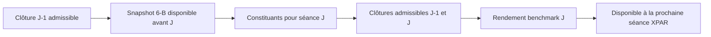

# Sprint 6-C France — identités, benchmark de recherche et secteurs

<!-- doc-status:start -->
> Statut documentaire au 2026-10-10 — Recherche / preuve datée : protocole et résultats conservés. Implémentation expérimentale ≠ promotion ML/LIVE ; les commandes restent à confronter aux droits et au catalogue actuels. [Référence actuelle](README.md).
<!-- doc-status:end -->

État au 3 octobre 2026 : `GO_6C_RESEARCH_PRICE_ONLY`. L'identité de recherche et le benchmark prix sont construits, versionnés et persistés dans `alpha_trade_fr`. Les secteurs historiques restent `UNKNOWN`. Le GO permet de préparer un panel de recherche sur les prix ; il ne clôt pas le gate économique et tradable du Sprint 6 global.

## Comprendre les trois références

Un symbole comme `AIR.PA` identifie une série chez EODHD. L'ISIN identifie l'instrument financier. Le MIC identifie le marché de cotation. Un même instrument peut changer de marché ; un ticker peut être réutilisé pour un instrument différent.

Le benchmark sert à mesurer le comportement relatif d'un titre : une hausse de 2 % du titre pendant une hausse moyenne de 1 % de son univers, par exemple. Il faut connaître sa population, sa formule et sa disponibilité avant de calculer une feature relative.

Le secteur sert à comparer des sociétés ayant une activité proche. Sans appartenance sectorielle connue à la date de décision, la neutralisation sectorielle est interdite. Un secteur absent ne vaut pas zéro et ne peut pas être remplacé par la classification courante rétropolée dans le passé.

## Sources et provenance

Service : [universe_reference_6c.py](../../service/fr/universe_reference_6c.py). Politique pré-enregistrée : [universe_fr_s6c.yaml](../../config/universe_fr_s6c.yaml).

| Entrée | Utilité |
| --- | --- |
| Rapport Sprint 5 `artifacts/fr/sprint5_limited_2018_2026/report.json` | 330 symboles de recherche et empreinte de l'historique d'identité autorisé |
| Historique `artifacts/fr/esma_firds/replay_2018/history_2026_observed_v2.json` | ISIN, MIC, versions observées et épisodes de cotation |
| Rapport et snapshots `artifacts/fr/sprint6b_liquidity/` | Éligibilité historique/liquidité par séance de décision J+1 |
| Archives `artifacts/fr/eodhd/backfill_2016/` | Clôtures source dont le hash est contrôlé |

Le service refuse un rapport Sprint 5 sans `GO_RESEARCH_J1`, une promotion canonique déclarée, un rapport 6-B incompatible ou des empreintes divergentes. L'historique ESMA doit être exactement celui rattaché au GO limité Sprint 5. Le hash et le nombre des snapshots 6-B sont contrôlés.

Le rejeu ESMA est complet au sens des fichiers présents et traités. Il garde **55 dates sans Delta** et `publication_continuity_confirmed=false`. Le Sprint 5 a déjà défini les exclusions et la disponibilité conservatrice à partir de cette preuve limitée. Le Sprint 6-C conserve cette réserve : il ne transforme pas cette preuve en validation officielle de négociabilité historique.

## Résolution d'identité

Pour chaque symbole admissible du Sprint 5, le service retrouve sa référence ESMA, vérifie le chiffre de contrôle ISO 6166, refuse les ISIN partagés entre symboles et les contradictions d'ISIN entre versions. Il produit ensuite un `research_uid` UUIDv5 déterministe depuis le marché et l'ISIN.

| État | Sens | UID |
| --- | --- | --- |
| `VERIFIED_RESEARCH` | ISIN unique et cohérent avec le périmètre de référence limité | UUID déterministe |
| `AMBIGUOUS` | ISIN invalide, partagé ou contradiction historique | `NULL` |
| `UNKNOWN` | Source ou ISIN absent | `NULL` |

Résultat : **330 `VERIFIED_RESEARCH`**, aucun ISIN partagé et aucun conflit d'ISIN entre versions. **15 titres ont plusieurs MIC historiques**. Les versions et intervalles sont conservés dans `details_json` ; aucun MIC courant n'est imposé à tout le passé.

Le statut fournisseur courant est conservé pour audit uniquement. Il ne décide pas qu'un titre ancien était coté ou négociable. Pour une date historique, le consommateur doit utiliser le manifeste Sprint 5 et les snapshots 6-B datés.

Les 330 `instrument_id` restent `NULL`. Aucun enregistrement n'est ajouté aux tables canoniques `instruments`, `instrument_listings`, `instrument_provider_symbols` ou `stock_bars_daily`. L'identité permet une jointure dans le panel de recherche par `(run_id, provider_symbol)` et `research_uid`. Elle ne permet pas encore un replay économique sur les tables canoniques. Les [exceptions Sprint 5](sprint_5_exceptions_identite_2026-10-02.md) restent applicables.

## Benchmark retenu et périmètre

Code : `FR_RESEARCH_EW_PRICE_V1`. C'est une moyenne équipondérée du **sous-ensemble France de recherche**, avec composition variant par séance selon 6-B. La population maximale historique est de 168 titres entraînables au moins une fois. Ce n'est pas un indice officiel ; sa représentativité de tout le marché français n'est pas démontrée.

Cette référence couvre plusieurs tailles et segments du périmètre disponible. Un futur benchmark large officiel devra être comparé lorsque sa source, sa licence et ses conventions seront qualifiées. Le code n'est pas un ticker EODHD.

[market_fr.yaml](../../config/markets/market_fr.yaml) déclare ce code. Le futur adaptateur FR devra le résoudre depuis `fr_research_benchmark_daily` et le `run_id` du manifeste, jamais depuis une barre `stock_bars_daily` portant ce nom.

### Chronologie et formules



La composition de J correspond aux snapshots `decision_session_date=J`, calculés depuis J−1. Le mouvement à J ne peut pas déterminer l'admission du titre dans la composition de J.

Un rendement individuel exige deux barres admissibles sur les séances consécutives J−1 et J, avec clôtures positives et finies. Une barre mise en quarantaine reste exclue même si elle existe dans l'archive brute. Le calcul ne saute pas une suspension ou une séance manquante.

```text
r_i(J) = close_brut_i(J) / close_brut_i(J-1) - 1
population(J) = titres training=ELIGIBLE connus avant J
couverture(J) = rendements valides / titres de la population

KNOWN si population >= 20 et couverture >= 95 %
r_benchmark(J) = moyenne des rendements valides
disponibilité = prochaine séance XPAR
```

Le poids cible vaut `1 / population`. Si au plus 5 % des rendements manquent, leur moyenne renormalise les poids valides à `1 / rendements_valides`. Les preuves des constituants stockent `target_weight` et `effective_return_weight`. La couverture et le seuil sont conservés.

En dessous du gate, `price_return` et `index_level` valent `NULL` avec état `UNKNOWN`. Aucun rendement nul artificiel n'est ajouté. Le niveau démarre à 100 par segment, puis suit `niveau × (1 + rendement)`. Une séance inconnue coupe la chaîne ; la prochaine séance connue ouvre un nouveau `segment_id` depuis 100. Un rendement cumulé ne doit pas franchir deux segments.

### Limite économique

Le calcul utilise **la clôture brute**, sans réinvestissement des dividendes. Les historiques de split fournisseur sont déjà exclus en amont. Les variations liées aux dividendes et autres opérations restent une limite à étudier. Cette référence convient à une comparaison de prix en recherche ; elle ne prouve ni rendement net investissable, ni total return, ni performance de portefeuille.

## Résultats

| Mesure | Valeur |
| --- | ---: |
| Identités de recherche | 330 |
| Identités à plusieurs MIC historiques | 15 |
| Observations de constituants | 170 046 |
| Séances analysées | 2 209 |
| Benchmark `KNOWN` | 1 927 |
| Benchmark `UNKNOWN` | 282 |
| Première séance connue | 2019-01-31 |
| Dernière séance connue | 2026-10-01 |

| Année source | `KNOWN` | `UNKNOWN` |
| --- | ---: | ---: |
| 2018 | 0 | 230 |
| 2019 | 228 | 25 |
| 2020 | 251 | 5 |
| 2021 | 248 | 7 |
| 2022 | 253 | 4 |
| 2023 | 253 | 2 |
| 2024 | 253 | 3 |
| 2025 | 252 | 3 |
| 2026 | 189 | 3 |

2018 reste la chauffe prévue par 6-B. Les séances inconnues après cette chauffe doivent être masquées dans les features relatives, sans fallback US ni comblement futur.

## Secteurs : schéma prêt, source historique bloquée

Le test du 3 octobre 2026 sur l'endpoint EODHD `fundamentals/AIR.PA`, filtre `General`, a renvoyé **HTTP 403** avec la clé configurée. Cela établit l'indisponibilité pour notre accès actuel, sans conclure qu'EODHD ne possède pas ces champs. Les archives exploitées ne contiennent aucune appartenance sectorielle datée qualifiée.

Les 330 titres ont `sector_state=UNKNOWN`, `sector_code=NULL`, taxonomie `FR_SECTOR_UNKNOWN_V1`. La table de memberships reste vide. La neutralisation sectorielle et les features secteur historiques sont bloquées ; le panel `price_only` peut avancer.

Une collecte future devra fournir `taxonomy`, `sector_code`, `valid_from`, `valid_to`, `observed_at`, `available_at`, `source` et preuve brute. Pour un snapshot courant, sa disponibilité ne peut pas précéder son observation. Même avec un `valid_from` ancien, la jointure impose `available_at <= décision` : une observation téléchargée aujourd'hui ne remplit pas 2018.

La fonction `sector_asof` applique ces conditions, respecte la borne finale inclusive et retourne `AMBIGUOUS` en cas d'observations également disponibles contradictoires. Les taxonomies différentes ne sont pas fusionnées implicitement.

## Tables et migration

Migration FR `0008_fr_reference_research`, chaînée sur `0007_fr_liquidity_research`. Son garde vérifie `SELECT DATABASE()='alpha_trade_fr'`.

| Table | Clé | Rôle |
| --- | --- | --- |
| `fr_reference_runs` | `run_id`, empreintes politique/source uniques | Provenance, statut et rapport |
| `fr_research_identities` | run + symbole | ISIN, UID recherche, état et preuve MIC/versions |
| `fr_research_benchmark_daily` | run + séance source | Rendement, couverture, disponibilité et segment |
| `fr_research_benchmark_constituents` | run + séance source + symbole | Composition, éligibilité laggée, poids et rendement |
| `fr_research_sector_memberships` | run + symbole + taxonomie + valid_from + available_at | Future appartenance sectorielle datée ; vide actuellement |

Les contraintes protègent les états, la disponibilité du benchmark et des secteurs, et les liens de provenance. La persistance clôt le run comme `COMPLETED` après contrôle du nombre de lignes de chaque artefact.

SQL : [migration_fr_0008_reference_research.sql](../../database/sql/fr/migration_fr_0008_reference_research.sql). La migration a été appliquée à `alpha_trade_fr` pendant ce sprint ; inutile de l'exécuter à nouveau sur ce poste.

## Reproduction et idempotence

Sans écriture SQL :

```powershell
python -u -m service.fr.universe_reference_6c
```

Avec persistance :

```powershell
python -u -m service.fr.universe_reference_6c --persist
```

Le routage passe par `fr_primary` avec les variables de connexion FR. Les secrets ne sont pas inscrits dans les rapports. L'avancement du chargement et les compteurs sont affichés.

Les artefacts sont dans `artifacts/fr/sprint6c_reference/` : `report.json`, `identities.jsonl.gz`, `benchmark_daily.jsonl.gz` et `benchmark_constituents.jsonl.gz`. Les gzip sont déterministes : même contenu, mêmes octets et hashes. Le `run_id` dépend de la politique, du manifeste, des snapshots et de l'historique ESMA ; l'horodatage de génération est une métadonnée.

Les upserts réutilisent les mêmes clés. Une seconde exécution doit conserver 330 identités, 2 209 séances et 170 046 constituants. Aucun run US/CN ou batch quotidien n'est modifié.

### Validation réalisée le 3 octobre 2026

La seconde persistance a conservé **un seul run**, `fr6c-8e2d70087bbe3c66-647e83d2d765`, avec statut `COMPLETED`. Les comptages de lignes et de clés distinctes sont exactement identiques : 330 / 330 identités, 2 209 / 2 209 séances, 170 046 / 170 046 constituants. Aucun constituant n'a `eligibility_source_session >= source_session_date`. Aucune ligne `KNOWN` n'a un rendement ou niveau nul. La table `instruments` reste vide, et aucun `instrument_id` n'est renseigné dans les identités de recherche.

Les **124 tests France et de contexte marché** passent, dont 10 tests 6-C portant sur les ISIN partagés ou invalides, les contradictions historiques, la disponibilité J+1, la composition laggée, les barres exclues, les secteurs disponibles après observation, les chaînes d'indice interrompues et les hashes gzip déterministes. Les fichiers Python ajoutés passent également le contrôle statique. Ce résultat concerne cette suite ciblée, pas un lancement de tous les tests de l'application.

Le benchmark possède 25 segments connus séparés par des séances inconnues. Les performances cumulées et fenêtres glissantes futures devront respecter ces frontières ; concaténer artificiellement les niveaux de ces segments serait une erreur.

## Étape suivante et gates ouverts

Mise à jour : le [Sprint 7-A](sprint_7a_panel_features_price_only.md) a produit le panel de prix et son dictionnaire. La [note de couverture France](couverture_univers_et_exclusions.md) détaille les 1 552 séries archivées, les 330 titres de recherche et les 168 entraînables au moins une fois. Ces derniers ne sont pas tous utilisables quotidiennement avec les fenêtres longues du panel.

Le prochain lot est **Sprint 7-A : dictionnaire et panel France `price_only`**. Le benchmark pourra ensuite être ajouté comme feature de recherche distincte avec sa disponibilité et son masque. La partie secteur du profil `price_market_sector` reste bloquée.

Le Sprint 6 global reste ouvert pour la promotion canonique, les secteurs historiques, les données spread/capitalisation PIT et la validation économique des prix/actions sur titres. `tradable` et `servable` restent interdits. Les 330 identités ne prouvent pas que les titres étaient négociables à toutes les dates.
