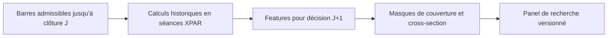

# Sprint 7-A — Dictionnaire et panel France price-only

<!-- doc-status:start -->
> Statut documentaire au 2026-10-10 — Recherche / preuve datée : protocole et résultats conservés. Implémentation expérimentale ≠ promotion ML/LIVE ; les commandes restent à confronter aux droits et au catalogue actuels. [Référence actuelle](README.md).
<!-- doc-status:end -->

État au 3 octobre 2026 : **`GO_7A_RESEARCH_PANEL`**. Le panel de recherche a été construit et reconstruit avec le même hash. Aucune cible, aucun entraînement et aucune écriture en base ne sont déclenchés par ce service. Le GO valide la construction et la traçabilité du panel ; il ne prouve pas un signal prédictif ni une disponibilité de publication historique contractuelle.

## Périmètre et population

Le service [modelFactory/fr_feature_panel.py](../../modelFactory/fr_feature_panel.py) utilise le profil [config/features_fr/fr_price_v1.yaml](../../config/features_fr/fr_price_v1.yaml). Il consomme les snapshots entraînables 6-B et les identités de recherche 6-C. La [note de couverture](couverture_univers_et_exclusions.md) explique le passage des 1 552 séries archivées aux 330 titres de recherche, puis aux 168 entraînables au moins une fois.

Le calcul conserve **170 046 observations sur 168 titres**, pour les décisions du 1er janvier 2018 au 2 octobre 2026 incluses. En pratique, aucun candidat n'est entraînable en 2018 : cette année constitue la chauffe du contrat 6-B. Les lignes du panel commencent en 2019.

Pour construire les features d'un candidat, le service utilise toutes ses observations antérieures admises par 6-B, y compris celles qui ne franchissaient pas encore le filtre de liquidité ou d'historique. Il n'utilise pas les barres rejetées par le manifeste. Une période demandée plus courte conserve ainsi son passé admissible de chauffe depuis 2018.

Les états d'identité et d'éligibilité restent ceux de la recherche. Le `research_uid` est présent, `instrument_id` reste NULL. Les secteurs, benchmark, fondamentaux, sentiment, capitalisation et facteurs US/CN sont absents des 18 features.

## Chronologie et disponibilité

Une ligne source de la séance J fournit les caractéristiques calculées à la clôture J. La ligne du panel porte la prochaine séance officielle XPAR comme `decision_session_date`. L'heure `decision_at` est l'ouverture de cette prochaine séance, en UTC à partir du calendrier XPAR, donc avec les changements d'heure de Paris respectés.



`source_available_at` est égal à cette ouverture J+1. `max_input_available_at` utilise la même borne conservatrice : les observations antérieures, consommées dans des fenêtres arrière, sont disponibles au plus tard à cette date.

Cette date est une **hypothèse de recherche J+1**, héritée du GO limité Sprint 5, et non l'heure réelle de publication d'EODHD en 2019 ou 2020. Chaque ligne conserve `availability_basis=RESEARCH_J1_HYPOTHESIS_NOT_VERIFIED_PUBLICATION`. Elle ne doit pas être promue automatiquement au serving/live.

Les dates source et décision sont contrôlées : la source doit être strictement antérieure et correspondre exactement à la séance XPAR précédente. Aucune barre de la séance de décision n'est consommée.

## Fenêtres et traitement des trous

Les séries sont reindexées sur les **séances officielles XPAR**, et non sur les dernières lignes reçues. Une barre absente ou exclue crée un trou. Un rendement à 20 séances exige les 21 clôtures consécutives de J−20 à J. Une moyenne à 20 séances exige 20 observations consécutives.

Le calcul ne relie pas deux prix à travers une suspension, une journée rejetée ou une absence de référence historique. Il ne fait ni forward-fill, ni interpolation, ni remplacement d'une feature manquante par zéro. Chaque feature possède un indicateur `<nom>_missing`.

Les barres admises doivent avoir OHLCV positifs et finis, `high >= max(open,close)` et `low <= min(open,close)`. Une contradiction malgré l'admission amont bloque le calcul. Les doublons et les dates hors calendrier sont également refusés. Les divisions impossibles, notamment un range plat, produisent une valeur manquante explicite.

## Dictionnaire des 18 features

Notations : O/H/L/C sont les prix bruts ouverture/haut/bas/clôture, V le volume fournisseur. Toutes les fenêtres sont en séances XPAR, terminées à J. Un ratio `0,03` représente 3 %, sans multiplication par 100 dans le fichier.

| Feature | Formule | Observations requises | Unité |
| --- | --- | ---: | --- |
| `return_1` | C(J)/C(J−1) − 1 | 2 clôtures consécutives | Ratio |
| `return_3` | C(J)/C(J−3) − 1 | 4 | Ratio |
| `return_5` | C(J)/C(J−5) − 1 | 6 | Ratio |
| `return_10` | C(J)/C(J−10) − 1 | 11 | Ratio |
| `return_20` | C(J)/C(J−20) − 1 | 21 | Ratio |
| `return_60` | C(J)/C(J−60) − 1 | 61 | Ratio |
| `sma20_distance` | C/moyenne(C,20) − 1 | 20 | Ratio |
| `sma50_distance` | C/moyenne(C,50) − 1 | 50 | Ratio |
| `sma200_distance` | C/moyenne(C,200) − 1 | 200 | Ratio |
| `atr20_pct` | Moyenne sur 20 du max(H−L,abs(H−C précédent),abs(L−C précédent)), divisée par C | 21 | Ratio |
| `realized_vol20` | Écart-type échantillon des 20 rendements quotidiens × √252 | 21 | Ratio annualisé |
| `range20_position` | (C−min(L,20))/(max(H,20)−min(L,20)) | 20 | Ratio |
| `volume_ratio20` | V/moyenne(V,20), jour J inclus | 20 | Ratio |
| `traded_value_mean20_eur` | Moyenne(C×V,20) | 20 | EUR, proxy |
| `overnight_gap` | O(J)/C(J−1) − 1 | 2 | Ratio |
| `position_52w` | (C−min(L,252))/(max(H,252)−min(L,252)) | 252 | Ratio |
| `intraday_return` | C/O − 1 | 1 | Ratio |
| `intraday_range` | (H−L)/C | 1 | Ratio |

L'ATR est une moyenne arithmétique de true ranges, sans lissage Wilder. La volatilité utilise `ddof=1` et la convention d'annualisation 252. La valeur échangée est un proxy clôture × volume, pas une somme officielle des transactions, un VWAP ou un turnover rapporté au flottant.

Le dictionnaire machine `feature_dictionary.json` reprend chaque formule, sa fenêtre, son unité, sa source, la disponibilité et les règles de manque/opérations sur titres.

## Prix et opérations sur titres

Les calculs reposent sur les prix bruts EODHD admis par le Sprint 5. Les séries signalant des splits fournisseur non validés étaient écartées en amont. Aucun `adjusted_close` courant n'est utilisé pour rétropoler un ajustement dans ce panel.

Les dividendes ne sont pas réinvestis ni neutralisés. Un détachement peut donc apparaître dans le rendement, le gap et la volatilité. La validation économique des rendements et des corporate actions reste nécessaire pour les futures cibles et le backtest. Le panel ne contient aucun label futur.

## Colonnes de contrôle

| Colonne | Usage |
| --- | --- |
| `provider_symbol`, `research_uid`, `mic` | Jointure/audit, pas features numériques du modèle |
| `source_session_date`, `decision_session_date`, `decision_at` | Chronologie |
| `source_available_at`, `max_input_available_at` | Disponibilité de recherche |
| `training_state` | Éligibilité 6-B |
| `sector_state=UNKNOWN`, `instrument_id=NULL` | Limites du périmètre |
| `<feature>_missing` | 1 si feature indisponible, 0 sinon |
| `mask_price20` | Disponibilité commune return20, ATR20, vol20, range20, volume20, valeur échangée20 et gap |
| `mask_all_features` | Les 18 features sont présentes |
| `cross_section_count` | Nombre de candidats 6-B ce jour |
| `feature_complete_count` | Nombre de candidats dont les 18 features sont présentes ce jour |
| `mask_cross_section` | Au moins 20 candidats complets ce jour |
| `research_ready` | Features complètes ET cross-section complète d'au moins 20 titres |

Les 170 046 lignes sont conservées. Le masque ne les supprime pas silencieusement. Les modèles futurs devront annoncer le profil et le masque utilisés ; considérer les 168 titres comme disponibles tous les jours serait incorrect.

## Couverture mesurée

| Mesure | Résultat |
| --- | ---: |
| Observations du panel | 170 046 |
| Titres représentés | 168 |
| Features numériques | 18 |
| Lignes `mask_price20` | 146 799 — 86,33 % |
| Lignes avec les 18 features | 38 456 — 22,62 % |
| Lignes `research_ready` | 35 080 — 20,63 % |
| Titres ayant au moins une ligne prête | 123 |
| Journées ayant des lignes prêtes | 592 |
| Première / dernière décision prête | 2022-05-30 / 2026-09-09 |

| Année de décision | Lignes candidates | Titres présents | Lignes prêtes, masque complet |
| --- | ---: | ---: | ---: |
| 2019 | 18 501 | 99 | 0 |
| 2020 | 22 549 | 126 | 0 |
| 2021 | 23 136 | 126 | 0 |
| 2022 | 21 815 | 116 | 5 895 |
| 2023 | 20 870 | 106 | 18 668 |
| 2024 | 21 474 | 115 | 266 |
| 2025 | 23 294 | 123 | 3 012 |
| 2026 | 18 407 | 122 | 7 239 |

Ces chiffres ne sont pas une mesure de performance ML. Les longues fenêtres sont fortement pénalisées par les jours absents ou mis en quarantaine, notamment les lacunes de publication/référence conservées au Sprint 5.

Les taux de manque sont de 77,38 % pour `position_52w`, 69,51 % pour SMA200, 33,37 % pour return60 et environ 13,67 % pour return20/ATR20/vol20. Les features intraday sont présentes pour toutes les lignes admises. `report.json` donne les comptes et fractions **pour chaque feature et chaque année**, afin de ne pas masquer la forte hétérogénéité temporelle.

Le gate pré-enregistré de construction demande au moins 1 000 lignes prêtes ; il est franchi. Cela ne signifie pas que le profil complet permet un walk-forward équilibré 2019–2026. Avant entraînement, il faudra figer un profil/masque adapté, comparer sa couverture par date et conserver ces réserves. Aucun seuil ou fenêtre n'a été changé après lecture de la couverture pour améliorer ce résultat.

## Artefacts et reproduction

Répertoire actuel : `artifacts/fr/features/fr_price_v1/fr-feature-20180101-20261002-18ba6e1d8d31/`.

- `panel.parquet` : environ 20,9 Mo, compression Zstandard ;
- `feature_dictionary.json` : dictionnaire des features ;
- `report.json` : couverture, preuves de provenance, empreintes et verdict.

Commande exécutée :

```powershell
python -u -m modelFactory.fr_feature_panel --verify-rebuild
```

Période restreinte, sans changer les paramètres du profil :

```powershell
python -u -m modelFactory.fr_feature_panel --start 2019-01-01 --end 2025-12-31 --verify-rebuild
```

Le service vérifie les hashes des snapshots, des identités et des archives fournisseur ainsi que la compatibilité des runs 6-B/6-C. L'empreinte du run inclut le profil, les sources (dont les hashes de chacun des 168 payloads OHLCV consommés), le code et la période. Un artefact existant divergent est conservé et déclenche une erreur. Le service ne remplace pas silencieusement une précédente version.

La reconstruction complète a produit deux fois le hash panel `e6e0cb9e08f1449e5f47fa4a5ec86b494906b8778caa0094cc9b5a50f2d00be3`. Le dictionnaire est également identique. Les clés `(decision_session_date,research_uid)` sont uniques. Aucune ligne ne porte de donnée disponible après sa décision.

La validation du 3 octobre 2026 comprend **142 tests passants** : tests France, routage FR, contexte marché et panel CN. Les sept tests 7-A vérifient les formules et premières observations complètes, l'invariance du passé après modification d'une barre future, les trous de séances, les OHLCV invalides/doublons, les ranges plats, la disponibilité à la prochaine séance et les profils incompatibles. Le contrôle statique des nouveaux fichiers passe. Cette suite ciblée ne représente pas un lancement de tous les tests de l'application.

Le code ne nécessite aucune migration SQL : les sources de recherche sont déjà persistées, et ce sprint publie des artefacts de panel. L'absence de nouvelle migration est volontaire. Les tables canoniques restent vides, aucune modification des traitements US/CN n'est introduite.

## Suite du Sprint 7

Le [Sprint 7-A2 — profil prix figé par période](sprint_7a2_profil_prix_fige_par_periode.md) est réalisé : un profil commun à 14 features, à fenêtres de 21 séances maximum, et une qualification de couverture par semestre. Il ne remplace pas cet artefact complet ; il devient la référence price-only des comparaisons futures. Le prochain lot peut ajouter le benchmark 6-C comme feature relative distincte avec son masque et ses segments. Le profil sectoriel reste bloqué faute de memberships historiques validés.

Les labels économiques Oracle/D1/D10, les folds et les entraînements appartiennent aux sprints suivants. Le résultat 7-A ne donne encore aucune conclusion sur la capacité à distinguer D1 et D10.
