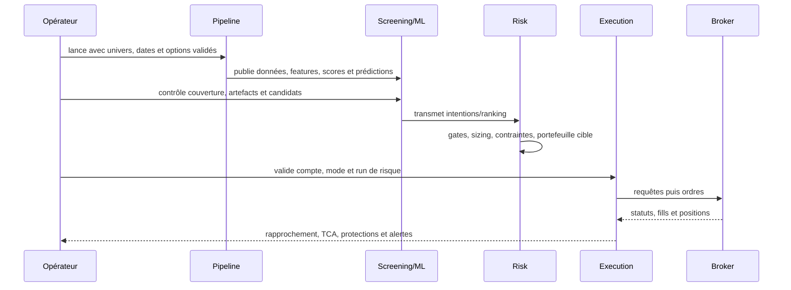

# Workflow quotidien de bout en bout

## Objectif

Le workflow quotidien transforme des données de marché en décisions contrôlées,
puis en exécution observable. Il faut conserver les identifiants qui relient
chaque étape : date as-of, run de pipeline, batch ML, run de risque et run
d’exécution.

## 1. Prévol

Dans Vue d’ensemble puis Supervision :

- vérifier base, quota, fraîcheur et dernier pipeline ;
- vérifier les runs actifs et les alertes critiques ;
- identifier le contexte broker ;
- contrôler les corporate actions non appliquées ou ambiguës ;
- vérifier que le calendrier et la date as-of attendus concordent.

Une corporate action non traitée peut contaminer prix, positions, labels ou
comparaisons historiques. Une donnée fraîche mais ajustée selon une convention
différente n’est pas nécessairement cohérente.

## 2. Configurer et lancer le pipeline

Choisir la source de symboles, éventuellement un symbole de reprise, la plage
de dates et les étapes. La page calcule une prévisualisation d’univers et peut
estimer le coût de collecte. Pour une charge importante, relire l’estimation et
la confirmation plutôt que de lancer par habitude.

Le pipeline canonique expose quatorze étapes, dont les étapes cœur et des étapes
optionnelles. Lancer une étape isolée n’autorise pas à ignorer ses dépendances :
l’IHM applique une machine d’état et des protections, mais l’opérateur doit
comprendre si l’objectif est un bootstrap, une maintenance, une reprise ou le
workflow quotidien complet.

Pendant le run, suivre le centre d’exécution plutôt que relancer. Un statut sans
nouveau log ne prouve pas un blocage ; examiner PID, horodatage, étape active et
verrou.

## 3. Valider les sorties analytiques

Dans Screening :

- contrôler la qualité amont et la date ;
- examiner recommandations et export brut séparément ;
- filtrer sans perdre la population de référence ;
- ouvrir l’explication d’un candidat avant de conclure.

Dans ML / Prédictions :

- identifier le batch et le modèle servis ;
- vérifier couverture et erreurs d’artefact ;
- distinguer champion de gouvernance et modèle effectivement chargé ;
- examiner drift, gate et lignes de prédiction récentes.

Une absence de prédiction peut être une décision de gate, un manque de feature,
un artefact absent, un problème de couverture PIT ou une erreur. Ces cas ne
doivent pas être agrégés en « le ML ne marche pas ».

## 4. Examiner le risque

Sélectionner explicitement le run. Lire :

- alertes et gates ;
- acceptations, réductions et rejets ;
- concentration sectorielle ;
- portefeuille cible et exposition ;
- comparaison shadow lorsqu’elle existe ;
- postmortem d’un run terminé.

Le risque peut réduire une position sans la rejeter. La raison, la taille avant
et après règle et le contexte de portefeuille doivent être conservés ensemble.

## 5. Préparer puis suivre l’exécution

Avant lancement : compte, environnement, mode live/paper, dry-run, run de risque,
contraintes et protections. Après lancement, suivre successivement : requêtes,
ordres, ordres enfants/protections, fills, positions et lots.

Le lendemain ou après incident, utiliser le rapprochement J+1 et les actions
ciblées proposées. Ne pas relancer toute l’exécution pour corriger un seul état
sans identifier le niveau de divergence.

## 6. Clôture opératoire

- confirmer la fin des runs et la libération des verrous ;
- traiter les divergences actionnables ;
- vérifier les protections secondaires et le watcher ;
- consulter alertes, événements et TCA ;
- conserver les identifiants de la chaîne pour audit ;
- ne pas promouvoir un changement de modèle ou de paramètre sur la seule base
  du résultat quotidien.

## Cas où il faut interrompre la chaîne

Arrêter ou ne pas poursuivre si le compte est ambigu, si les données clés sont
périmées, si un gate critique est actif, si le modèle servi ne correspond pas au
batch attendu, si une corporate action matérielle est incohérente, si le kill
switch est actif sans motif résolu, ou si la réconciliation montre une position
broker inattendue. L’arrêt doit être documenté avec le run et le motif, puis
résolu au niveau où l’incohérence apparaît.

