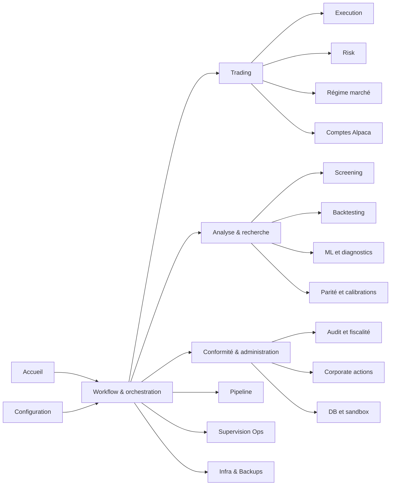

# Guide utilisateur de l’application

Ce guide décrit l’application telle qu’elle est implémentée aujourd’hui. Il ne
reprend pas l’ancien manuel page par page : la navigation, les contrôles et les
workflows ont évolué. Le registre de navigation faisant foi est
`ihm/services/navigation.py` et chaque comportement détaillé est vérifié dans
la page et le service qui l’exécutent.

## À qui s’adresse ce guide ?

- à un nouvel opérateur qui doit comprendre l’ordre normal des opérations ;
- à un analyste qui veut distinguer un résultat de recherche d’une décision
  réellement servie ;
- à un développeur qui cherche le module source derrière un contrôle de l’IHM ;
- à la personne d’astreinte qui doit diagnostiquer un run, un verrou ou une
  divergence sans aggraver l’incident.

## Carte actuelle de l’application

La correspondance exhaustive page → source → chapitre est disponible dans [Couverture des pages IHM](COUVERTURE_PAGES_IHM.md).

La sidebar masque volontairement la navigation multipage native de Streamlit.
Le choix d’une page passe par le registre métier centralisé. Une page visible
dans le répertoire `ihm/pages` mais absente de ce registre n’est donc pas, à elle
seule, une destination utilisateur officielle.

## Parcours de lecture

1. [Démarrage, navigation et notions de sécurité](01_demarrage_navigation_securite.md)
2. [Workflow quotidien de bout en bout](02_workflow_quotidien.md)
3. [Piloter le pipeline](03_pipeline.md)
4. [Analyser le screening](04_screening.md)
5. [Comprendre ML, artefacts et prédictions](05_ml_predictions.md)
6. [Lire les décisions de risque](06_risque.md)
7. [Superviser l’exécution](07_execution.md)
8. [Lancer et auditer un backtest](08_backtesting.md)
9. [Supervision, parité et diagnostic](09_supervision_parite.md)
10. [Corporate actions, conformité et fiscalité](10_conformite_corporate_actions.md)
11. [Paramètres, infrastructure et administration](11_parametres_administration.md)
12. [Dépannage et questions fréquentes](12_depannage_faq.md)
13. [Régime marché et comptes broker](13_regime_et_comptes.md)
14. [Infra, sauvegardes et administration DB](14_infra_backups_et_db.md)
15. [Calibrations et Diagnostic ML](15_calibrations_et_diagnostic_ml.md)
16. [Fondamentaux](16_fondamentaux.md)
17. [Compliance, fiscalité et sandbox health](17_conformite_fiscalite_sandbox.md)
18. [Glossaire et système d’aide](18_glossaire_et_aide.md)

## Trois distinctions à ne jamais perdre

### Donnée affichée, décision et ordre ne sont pas synonymes

Un score de screening est une observation. Une prédiction ML est un signal
persisté associé à un modèle et à un batch. Une décision de risque transforme
une intention en cible autorisée, réduite ou rejetée. Une requête d’exécution,
un ordre broker et un fill sont encore trois états distincts. L’IHM permet de
les rapprocher ; elle ne les rend pas interchangeables.

### Recherche et production sont séparées

La page Backtesting et les diagnostics ML peuvent charger des campagnes et des
paramètres historiques. Cela ne prouve pas que ces paramètres sont ceux du
serving courant. Pour conclure sur la production, vérifier le modèle servi, le
batch, le contrat d’exécution et le run de risque effectivement liés.

### Un bouton disponible n’est pas une autorisation métier

Les contrôles de confirmation, le dry-run, les verrous inter-processus et les
gates empêchent plusieurs erreurs opérationnelles. Ils ne remplacent ni la
revue du contexte de compte, ni la validation des données, ni les règles de
passage en live.

## Sources de vérité utilisées

| Sujet | Source principale |
|---|---|
| structure de navigation | `ihm/services/navigation.py`, `ihm/app.py` |
| contenu d’une page | `ihm/pages/<page>.py` ou package homonyme |
| lancement asynchrone | registres et runners dans `ihm/services` |
| règles métier | modules `screener`, `modelFactory`, `risk_management`, `execution_engine` |
| stockage | modèles/migrations et accès dans `database` |
| valeurs de déploiement | configuration chargée au runtime, pas une capture d’écran documentaire |
