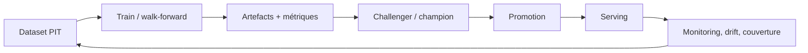

# Entraînement, serving et gouvernance ML

## Cycle de vie

## Artefact complet

Un artefact exploitable associe modèle, schéma de features, configuration,
métriques, fenêtre d’entraînement, identité de campagne et contrôles de
compatibilité. Un fichier modèle isolé n’est pas un livrable gouverné.

## Serving

Le serving résout l’artefact, prépare les features selon le même contrat,
applique calibration/gates et persiste la prédiction avec provenance. Les
fallbacks et le `selection_mode` doivent rester visibles.

## Gouvernance

Champion et challengers sont des statuts de comparaison. La promotion doit
rapprocher ce registre avec les fichiers réellement chargés. L’IHM fournit un
audit serving↔gouvernance ; toute divergence doit être expliquée.

## Exploitabilité

Versionner manifests, garder rollback, vérifier couverture après déploiement et
surveiller drift par population. Une régression de couverture peut être plus
grave qu’une faible variation de métrique.

Voir [orchestration train/predict](orchestration_train_predict.md),
[validation](validation_et_gouvernance.md) et [recalibration](recalibration_et_promotion.md).

