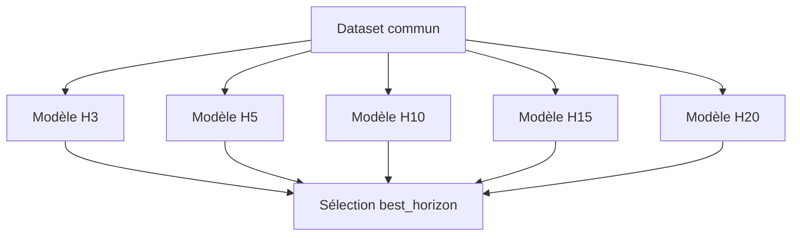

# 1 — Concept et architecture

## Question résolue

Le modèle ne cherche pas d’abord à répondre « quel sera le rendement absolu de
ce titre ? ». Il cherche « parmi les titres observables aujourd’hui, lesquels
devraient relativement mieux se comporter sur l’horizon H ? ». Cette formulation
permet de comparer des titres dont niveaux de volatilité, secteurs et régimes
diffèrent.

## Sens de la sortie

Pour un horizon `H`, `global_rank_H` est obtenu en classant les scores continus
du modèle à l’intérieur de chaque date avec `rank(pct=True)`. Ainsi :

- `1.0` correspond au haut du classement du jour ;
- `0.5` est une position médiane/neutre ;
- une valeur basse correspond au bas du classement ;
- l’écart `0.90 → 0.95` exprime un déplacement de percentile, pas cinq points de
  probabilité de rendement positif.

Le rang dépend donc de l’univers. Ajouter ou retirer des symboles peut modifier
les percentiles sans changer les features d’un titre.

## Modèle multi-horizons

Le code entraîne des modèles indépendants pour H3, H5, H10, H15 et H20. Chaque
horizon produit son propre artefact, ses métriques, ses features actives et
éventuellement son propre backend champion. Il n’existe pas un unique modèle
multi-sorties partagé.

H3 exclut explicitement les features fondamentales. Les horizons longs peuvent
utiliser la cible lissée. Le `best_horizon` sert aux consommateurs qui doivent
réduire les cinq rangs à une politique principale ; les autres colonnes restent
persistées et diagnostiquables.

## Backends

- LightGBM utilise `LGBMRanker`, objectif `lambdarank`, groupes par date et
  gains de labels `0..9` ;
- XGBoost utilise `XGBRanker`, objectif `rank:ndcg` et groupes/qid par date ;
- CatBoost utilise `CatBoostRanker` lorsque la loss configurée appartient à la
  liste ranking (`YetiRank`, `QueryRMSE`, `QuerySoftMax`, `PairLogit`,
  `PairLogitPairwise`), sinon un `CatBoostRegressor` ;
- si CatBoost est indisponible lors de la construction, le code tente un
  fallback LightGBM.

## Quatre flags historiques encore configurables

`GlobalModelConfig` décrit quatre flags : `enabled`, `stacking_enabled`,
`challenger_enabled`, `champion_enabled`. Le premier autorise l’entraînement du
global ; le second injecte ses rangs comme features dans les modèles locaux ; le
troisième concerne son rôle de challenger dans la gouvernance plus large ; le
quatrième lance le championnat LightGBM/CatBoost/XGBoost. Les flags B/C/D n’ont
pas d’effet utile lorsque `enabled` est faux.

## Frontières

Le Global Ranking ne décide pas à lui seul de la taille, des contraintes de
portefeuille ou du lifecycle d’ordre. Il peut produire des signaux synthétiques
long/short/flat et alimenter Oracle, une cascade ou le stacking. Le risque et
l’exécution restent des modules séparés.

