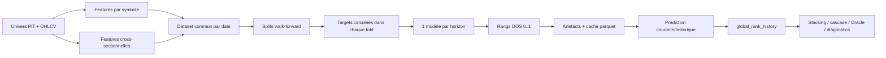

# Global Ranking — dossier technique complet

Le Global Ranking est le modèle cross-sectionnel multi-symboles de l’application.
À chaque date et pour chaque horizon actif, il classe les titres relativement à
l’univers disponible. Sa sortie est un percentile dans `[0,1]` : une valeur
proche de `1` désigne les meilleurs scores relatifs du jour, une valeur proche
de `0` les plus faibles. Ce n’est ni un rendement prédit en unités monétaires,
ni une probabilité calibrée de hausse.

Cette documentation est dérivée principalement de
`modelFactory/global_ranking.py`, puis des chemins d’orchestration, de
prédiction, de persistance et de consommation. Les commentaires historiques ne
sont retenus que lorsqu’ils concordent avec le comportement exécutable.

## Parcours conseillé

1. [Concept et architecture](01_concept_et_architecture.md)
2. [Univers, données et features](02_univers_donnees_et_features.md)
3. [Targets, labels et étanchéité temporelle](03_targets_labels_et_pit.md)
4. [Entraînement walk-forward et championnat](04_train_walk_forward_et_championnat.md)
5. [Artefacts, inférence et persistance](05_artefacts_inference_et_persistance.md)
6. [Consommation, stacking, cascade et DIP](06_consommation_stacking_cascade.md)
7. [Métriques, diagnostics et historique](07_metriques_diagnostics_et_historique.md)
8. [Configuration et runbook](08_configuration_et_runbook.md)

## Vue d’ensemble

## Contrats essentiels

- horizons codés : `3, 5, 10, 15, 20` séances ;
- H10/H15/H20 peuvent être lissés ensemble ; H3/H5 ne le sont pas ;
- la target est relative à la section du jour et peut être neutralisée secteur
  et facteurs ;
- l’unité de groupe des rankers est la date ;
- métrique primaire : IC de rang de Spearman ;
- les sorties OOS sont re-rankées par date en percentiles ;
- clé SQL : `(symbol, date, batch_id)` ;
- valeur neutre de repli pour un rang absent : `0.5` ;
- le meilleur backend peut différer selon l’horizon ;
- le meilleur horizon est sélectionné après le championnat intra-horizon.

## Fichiers sources principaux

| Responsabilité | Source |
|---|---|
| dataset, targets, train et prédiction | `modelFactory/global_ranking.py` |
| configuration typée | `modelFactory/config.py` |
| features cross-sectionnelles | `modelFactory/cross_sectional.py` |
| orchestration de campagne | `modelFactory/orchestrator.py` |
| prédiction historique et chargement SQL | `modelFactory/predictor.py` |
| synthèse en signaux long/short/flat | `modelFactory/synthesize_global_rank_predictions.py` |
| backfill depuis parquet | `modelFactory/backfill_global_rank_history.py` |
| schéma logique | `database/sql/ml/global_rank_history.sql` et migrations |

Retour : [références ML](../README.md) · [présentation générale](../../07_ml_global_ranking.md)

