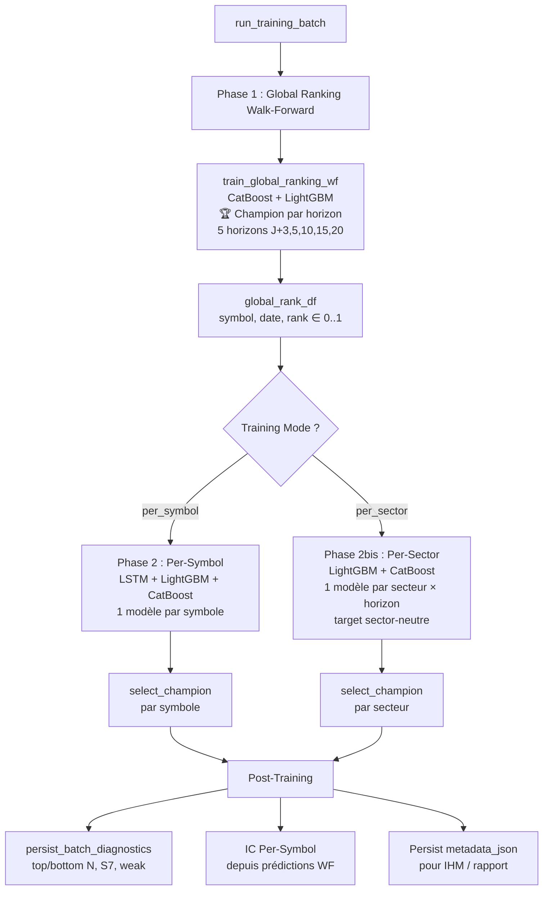
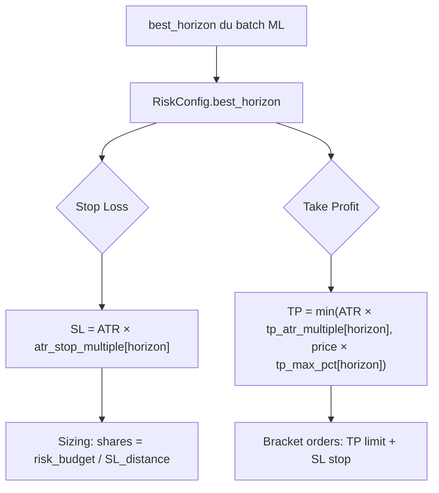

# Module ModelFactory — Documentation Complète

> **Version** : Sprint 2026-08-04 (batch f82ab5, per-sector + global ranking) — mise à jour 2026-08-14 (pivot per-symbol)
> **Auteur** : Généré automatiquement depuis le code source

---

## Table des matières

1. [Vue d'ensemble](#1-vue-densemble)
2. [Architecture globale](#2-architecture-globale)
3. [Phase 1 — Global Ranking Model](#3-phase-1--global-ranking-model)
4. [Phase 2 — Per-Symbol Training](#4-phase-2--per-symbol-training)
5. [Phase 2bis — Per-Sector Training (NEW)](#5-phase-2bis--per-sector-training-new)
6. [Sélection du Champion](#6-sélection-du-champion)
7. [Diagnostics Batch & Garde-fous](#7-diagnostics-batch--garde-fous)
8. [Prédiction & Inférence](#8-prédiction--inférence)
9. [IC Per-Symbol](#9-ic-per-symbol)
10. [Configuration](#10-configuration)
11. [Tables DB](#11-tables-db)
12. [Résultats & Benchmark](#12-résultats--benchmark)
13. [Questions / Réponses](#13-questions--réponses)
14. [Stratégie d'exploitation](#14-stratégie-dexploitation-validée-par-backtest-2026-08-02)
15. [Gestion du Risque Multi-Horizon (V1 / V2)](#15-gestion-du-risque-multi-horizon-v1--v2)

---

## 1. Vue d'ensemble

Le module `modelFactory` est le cœur ML du système α-Trade. Il supporte **deux modes d'entraînement** :

| Mode | Description | Usage |
|------|-------------|-------|
| **Per-Symbol** | 1 modèle par symbole (LSTM + LightGBM + CatBoost) | ~400 symboles, patterns individuels (**pivot 2026-08-14**) |
| **Per-Sector** | 1 modèle par secteur GICS × horizon (LightGBM + CatBoost) | 11 secteurs × 5 horizons = 55 modèles (research-only) |

> 📌 **Mise à jour 2026-08-14** : pivot vers le **per-symbol**. Le per-sector reste research-only (F1 WF ≈ 0.33, DirAcc ≈ 50 % — aucun alpha exploitable). Le per-symbol sera retravaillé (ablation F0-F4, protocole `prompt/ml/ml_analyse_per_symbol.md`).

Il assure :

1. **Classement cross-sectionnel** : un modèle Global Ranking (CatBoost RMSE ou LightGBM LambdaRank, avec champion automatique par horizon) qui ordonne tous les symboles de l'univers par rendement futur attendu sur 5 horizons → `global_rank ∈ [0, 1]`
2. **Prédiction directionnelle** :
   - **Per-Symbol** : des modèles individuels (LSTM, LightGBM, CatBoost) par symbole
   - **Per-Sector** : des modèles par secteur GICS (LightGBM, CatBoost) qui apprennent la **surperformance relative intra-secteur** (target neutralisée = rendement − médiane sectorielle)
3. **Multi-horizon** : 5 horizons (H3, H5, H10, H15, H20) avec purge dynamique par horizon
4. **Garde-fous qualité** : filtrage automatique des symboles dont les modèles sont trop faibles
5. **Sélection automatique du meilleur modèle** par symbole/secteur (champion selection)

### Flux simplifié

```
Entraînement :
  Global Ranking (1 modèle, tous symboles) → global_rank_3/5/10/15/20
  🏆 Champion automatique CatBoost vs LightGBM par horizon (score composite IC+IR)
  
  Mode Per-Symbol (~500 modèles) :
    LSTM + LightGBM + CatBoost par symbole → proba_long, proba_short
  
  Mode Per-Sector (55 modèles) :
    11 secteurs × 5 horizons → LightGBM + CatBoost → target sector-neutre
    🏆 Champion automatique LightGBM vs CatBoost par secteur (score composite F1+IR)
  
  Diagnostics batch → top/bottom N, weak, S7

Inférence (Live/Backtest) :
  global_rank × proba_long → cascade_select → filtre momentum short-side (mom20 < +2 %) → trades filtrés (voir analyse_oos.txt)
```

---

## 2. Architecture globale



### Ordre des sections dans le rapport

| Ordre | Section | Contenu |
|-------|---------|---------|
| 1 | 📋 Détail du batch | Métadonnées, IC Rank Global, Stacking |
| 2 | 🏆 Sélection du champion | auto / fallback par modèle |
| 3 | 📊 Métriques par Horizon (WF) | F1 macro, F1 short, F1 long, Dir Acc × H3/5/10/15/20 |
| 4 | 🔬 IC Per-Symbol | Tableau H3/H5/H10/H15/H20 |
| 5 | 🌐 Global Ranking — Détails | IC, Decile Spread, FI, splits par horizon |
| 6 | 📊 Métriques F1 par split | F1 macro/short/flat/long par modèle × split |
| 7 | 📊 Distribution true/pred | % short/flat/long prédit vs réel |
| 8 | 📈 Distribution F1 macro WF | Histogramme par bucket |
| 9 | 📅 Diagnostic par régime | F1 × régime de marché (bear/bull/range) |
| 10 | 🏆 Top 10 / Flop 10 | Meilleurs/pires symboles/secteurs par F1 macro WF |
| 11 | ⚪ f1_short = 0 | Symboles sans signal short |
| 12 | 📊 Métriques Régression par split | MSE, Dir Acc (mode regression) |

---

## 3. Phase 1 — Global Ranking Model

### 3.1 Objectif

Produire un **score de ranking cross-sectionnel** par symbole et par date, sur 5 horizons.

**Modèle** : CatBoost `RMSE` (principal, meilleur qu'LightGBM LambdaRank sur cet usage)  
**Objectif** : régression sur le rang continu [0, 1]  
**Métrique** : **IC Rank** (Spearman), pas de F1  
**Sortie** : `global_rank_h ∈ [0, 1]` — percentile dans l'univers  
**IC actuel** : 0.0115 (batch f82ab5, 2026-08-04, 6 splits, 939 symboles).  
*Référence historique* : 0.0208 (batch 7e4cf8, 2026-08-03, 8 splits, 928 symboles, +84% vs baseline 0.0113), tous les IC IR > 1.0.

> ⚠️ **Régression** : l'IC a chuté de 0.0208 → 0.0115 entre le 03/08 et le 04/08. La cause probable est le passage de 8 → 6 splits effectifs (--wf-max-splits 8 mais 6 réalisés), ou une différence dans l'univers de symboles (939 vs 928).

### 3.2 Construction de la target

Pour chaque horizon $h \in \{3, 5, 10, 15, 20\}$ :

```
1. Rendement forward brut  : future_return_h = close[t+h] / close[t] - 1
2. Vol scaling (h ≥ 5)     : future_return_h /= rolling_volatility_20
   (H3 : pas de scaling, vol 20j décorrélée du rendement 3j)
3. Winsorization            : clip 1%/99% intra-date
4. Percentile rank          : rank(pct=True) → [0, 1]
5. Décile discret           : label_h = floor(rank × 10).clip(0, 9)
6. Target smoothing (h ≥ 10): blend 50% horizon + 50% avg(10,15,20) → re-rank
   (H3/H5 exclus du smoothing : trop bruités, pas de vol scaling pour H3)
7. Sector-neutral (tous)    : soustraire médiane sectorielle → re-rank → re-label
8. Factor-neutral (tous)    : OLS résiduel sur size+value+momentum → re-rank → re-label
```

| Horizon | Vol scaling | Fondamentales | Smoothing | Sector-neutral | Factor-neutral |
|---------|-------------|---------------|-----------|----------------|----------------|
| H3 | ❌ | ❌ | ❌ | ✅ | ✅ |
| H5 | ✅ | ✅ | ❌ | ✅ | ✅ |
| H10/15/20 | ✅ | ✅ | ✅ | ✅ | ✅ |

> **Smoothing actif** (H10/H15/H20 uniquement) : blend 50% horizon + 50% avg(10,15,20),
> H3/H5 exclus (trop bruités). Bénéfique avec 8 splits (+31% H10), dilutif avec 13 splits.

### 3.3 Walk-Forward

- **Fenêtre glissante** : 756 jours de train (max), 126j val, 126j test
- **Purge** : 1 jour (marge de sécurité résiduelle, P1 post-split)
- **Splits** : **8 × 252j** (optimal sans leakage ; 13 × 126j sous-performe)
- **Poids temporels** : `exp(-days_diff / 360)` — demi-vie ~12 mois

> **8 splits > 13 splits** (Sprint 2026-08-02) : avec target post-split étanche,
> 13 splits ont 83% de chevauchement → val corrélé. 8 splits × 252j →
> diversité des régimes, IC +40%, IR ×2. **504j** trop court, **1008j** diminishing.

### 3.4 Features

| Catégorie | Nb | Description |
|-----------|----|-------------|
| Base (OHLCV) | ~13 | daily_return, log_return, intraday_range, etc. |
| Expert | ~18 | SMA distances, momentum, relative strength, régime |
| Multi-horizons | ~17 | H3-H250 momentum, volatilité, RSI |
| Interactions | ~16 | momentum/vol, RSI/vol, SMA cross |
| Dynamique temporelle | ~6 | accel, decay, RSI slope, vol expansion |
| Z-scores | ~26 | Normalisation temporelle sur 5 ans |
| Régime × technique | ~18 | momentum × bull/bear, vol × bull/bear |
| Cross-sectional | 8 | Rangs percentiles intra-date |
| Sector features | 8 | Agrégats sectoriels |
| Sector-neutral | 13 | Techniques + fondamentales neutralisées |
| Fondamentales | ~23 | PE, ROE, marges, croissance (EODHD) |
| Facteurs CAPM | 4 | Beta, alpha, R² |

**Total** : ~177 features (160 pour H3, sans fondamentaux).

**Features blacklistées** (identiques ∀ symboles → pas de pouvoir discriminant) :
- Macro globales : VIX/VXN/VIX3M/MOVE
- Secteur agrégé : `sector_ret_*`, `sector_vol_*`, `sector_dollar_volume_*`
- Liquidité : `dollar_volume_20_rank`
- CAPM : `beta_252`, `alpha_252`, `r_squared_252`
- Volatilité 120j et `*_sector_neutral` de volatilité
- Fondamentales brutes (versions `_sector_neutral` conservées)
- Estimations analystes indisponibles
- Poids morts Mid Caps : `log_return`, `daily_return` bruts, `close_to_vwap`, `volume_zscore_5d`, `accel_3_5`

> **Note 2026-08-01** : `regime_risk_off` et `regime_bull_market` sont **dé-blacklistés** — les arbres (CatBoost) peuvent apprendre des splits conditionnels au régime.

### 3.5 Modèle

| Paramètre | Valeur | Note |
|-----------|--------|------|
| Algorithme | **CatBoost RMSE** (ou LightGBM LambdaRank si `champion_enabled`) | Voir §6.2 pour la sélection automatique |
| `ranking_max_depth` | 7 | Indépendant du per-symbol (5) |
| `ranking_num_leaves` | 31 | Cohérent avec depth=7 |
| `n_estimators` | 500 | |
| `learning_rate` | 0.03 | |
| `loss_function` | RMSE (CatBoost) / LambdaRank (LightGBM) | |

> **Champion mode** (2026-08-09) : quand `champion_enabled = True`, les DEUX algorithmes
> sont entraînés et le meilleur est sélectionné par horizon selon un score composite
> 55% IC + 30% IR + 15% splits positifs (voir §6.2). Le **meilleur horizon** est aussi
> déterminé automatiquement avec la même formule (voir §3.8).

### 3.6 Feature Importance

Calculée via `gain` (LightGBM) ou `feature_importance` (CatBoost). Moyennée sur tous les splits WF. Les fondamentales dominent le top 10 (PE, ROE, debt_to_equity, PS ratio), suivies des features de momentum long-terme (momentum_250, SMA distances).

### 3.7 Limitation du nombre de symboles

Paramètre `--global-ranking-max-symbols` (défaut: 300, IHM: 0 = tous).  
Si > 0 : garde les **top N par volume moyen** ou stratifié par déciles.

### 3.8 Meilleur horizon automatique (NEW 2026-08-09)

À l'entraînement, le **meilleur horizon** est déterminé automatiquement avec la même logique
que la sélection champion intra-horizon (score composite 55% IC + 30% IR + 15% splits positifs).

Chaque horizon est évalué sur les métriques de son champion :

$$\text{Score}_h = 0.55 \times \frac{\text{IC}_h}{\max(\text{IC})} + 0.30 \times \frac{\text{IR}_h}{\max(\text{IR})} + 0.15 \times \text{PosPct}_h$$

Le meilleur horizon est stocké dans `metadata_json.global_ranking.best_horizon` et utilisé
par `cascade_select()` pour la sélection de trades (au lieu de toujours forcer H20).

| Horizon | IC Mean | IC IR | Pos% | Score |
|---------|---------|-------|------|-------|
| H3 | 0.015 | 1.69 | 100% | 0.616 |
| H5 | 0.023 | 2.03 | 83% | 0.761 |
| H10 | 0.024 | 1.27 | 83% | 0.668 |
| H15 | 0.036 | 2.14 | 100% | **1.000** 🏆 |
| H20 | 0.036 | 1.42 | 83% | 0.870 |

---

## 4. Phase 2 — Per-Symbol Training

### 4.1 Objectif

Pour **chaque symbole** de l'univers, entraîner un modèle qui prédit la direction (long/short/flat) ou un score continu (regression).

| Composant | Single-horizon | Multi-horizon |
|---|---|---|
| **LSTM** | 1 modèle, horizon max | **5 modèles (H3/H5/H10/H15/H20) — option B, 2026-08-15** |
| **LightGBM** | 1 modèle, horizon configuré | 5 modèles (H3/H5/H10/H15/H20) |
| **CatBoost** | 1 modèle, horizon configuré | 5 modèles (H3/H5/H10/H15/H20) |

**Modèles** : LSTM Attention, LightGBM, CatBoost (3 challengers par symbole)  
**Target** : `future_return` (binaire, ternaire, ou regression selon config)  
**Métrique** : **F1 macro** (moyenne de F1 short, F1 flat, F1 long) — y compris en mode regression où le F1 est calculé par binarisation du signe

> **Multi-horizon** (ajouté 2026-08-03) : quand `--forecast-horizons 3,5,10,15,20` est spécifié,
> les baselines tabulaires (LightGBM + CatBoost) sont entraînées pour chaque horizon
> indépendamment. Le LSTM reste sur l'horizon max pour la rétrocompatibilité.
> La purge est dynamique : 3 jours pour H3, 20 jours pour H20.

### 4.2 Mode ternaire (3 classes)

```
proba_short + proba_flat + proba_long = 1.0

Décision :
  if proba_long > threshold_long  → LONG
  if proba_short > threshold_short → SHORT
  else → FLAT
```

Seuils : `ternary_threshold_short` (0.35), `ternary_threshold_long` (0.35), `top2_margin` (0.02).

### 4.3 Mode regression (continu)

Ajouté le 2026-08-02. La target n'est plus discrète (long/short/flat) mais continue :

```
1. Rendement forward brut : future_return = close[t+h] / close[t] - 1
2. Vol scaling (h ≥ 5)   : target = future_return / rolling_vol_20
3. Winsorization          : clip 1%/99% par symbole
```

**Spécificités** :
- **Modèle** : `num_classes=1` → 1 neurone de sortie, loss **MSE** (pas CrossEntropy)
- **Métriques** : MSE, MAE, corrélation, directional accuracy, IC
- **F1 comparable** : binarisation du signe — `sign(pred)` vs `sign(target)` → classes {-1,0,1} → F1 macro identique au mode ternaire
- **Décision** : score > 0 → LONG, score < 0 → SHORT, score ≈ 0 → FLAT
- **Calibration** : désactivée (pas de Platt sur une régression)
- **Pas de threshold optimization** : ignorée automatiquement
- **Multi-horizon** : chaque horizon a son propre modèle de régression (LightGBM + CatBoost). Le F1 est calculé par rapport à la target de l'horizon (pas le `future_return` brut).

**Avantages vs ternaire** :
- Pas de seuils arbitraires (up_threshold/down_threshold) — le modèle apprend la magnitude
- La force du signal est directement utilisable (pas juste une probabilité)
- Comparaison équitable avec le ternaire grâce au F1 binarisé

### 4.4 Walk-Forward

Mêmes splits que le Global Ranking. Chaque split produit des métriques sur train/val/test, agrégées en fin de boucle.

**Multi-horizon** : le walk-forward est exécuté pour chaque horizon indépendamment, avec purge dynamique (`forecast_horizon_override=h`). Pour H3, seuls 3 jours sont purgés aux frontières (au lieu de 20) → +17 jours de train par fold.

### 4.5 Stacking (injection des rangs globaux) ⚠️ Contre-indiqué

Quand `global_model.stacking_enabled = True` :

```
Avant entraînement per-symbol :
  cross_sectional_cache ← merge(global_rank_df[["symbol", "date", "global_rank_10", "_15", "_20"]])
  NaN → 0.5 (rang neutre)

Le modèle per-symbol voit donc les rangs cross-sectionnels comme features supplémentaires.
```

> **⚠️ Le stacking est une mauvaise idée pour le Per-Symbol.**
>
> Si tu donnes le `global_rank` de la Phase 1 comme feature à la Phase 2, tes modèles
> Per-Symbol (LSTM, LightGBM, CatBoost) vont devenir **dépendants du marché global**.
> Ils vont perdre leur capacité à détecter les figures de retournement propres au symbole
> et ne feront que « recopier » la tendance générale identifiée par la Phase 1.
>
> **Conséquence** : le Per-Symbol devient un simple amplificateur du Global Ranking,
> perdant toute sa valeur ajoutée (détection de patterns locaux, divergences,
> retournements idiosyncratiques). Les deux phases doivent rester complémentaires,
> pas redondantes.
>
> **Recommandation** : laisser `stacking_enabled = false`. Le Global Ranking
> et le Per-Symbol jouent des rôles distincts dans la cascade de trading (§7.2).

### 4.7 Multi-horizon tabular (NEW 2026-08-03)

Quand `--forecast-horizons 3,5,10,15,20` est spécifié, les baselines tabulaires
(LightGBM + CatBoost) sont entraînées pour **chaque horizon indépendamment**.
Le LSTM reste single-horizon (horizon max = rétrocompatibilité).

#### Boucle d'entraînement

```
Pour chaque symbole :
  LSTM → single-horizon (max_h)
  
  Pour chaque h ∈ {3, 5, 10, 15, 20} :
    1. _df = prepared_df.copy()
    2. _df["target"] = _df[f"target_h{h}"]          ← target déjà neutralisée si per-sector
    3. _df["future_return"] = _df[f"future_return_h{h}"]
    4. run_tabular_baseline(_df, forecast_horizon_override=h)
       → LightGBM + CatBoost avec purge = h jours
    5. run_tabular_walk_forward(_df, forecast_horizon_override=h)
    
  → Persiste chaque horizon avec insert_metrics(horizon=h)
  → Champion selection sur l'horizon primaire (max)
```

#### Impact

| | Single-horizon | Multi-horizon |
|---|---|---|
| Modèles par symbole | 3 (LSTM+LGBM+CB) | 11 (1 LSTM + 5 LGBM + 5 CB) |
| Temps d'entraînement | ~1× | ~5× (tabulaire uniquement) |
| Purge | fixe (max_h) | dynamique (h) |
| Métriques DB | 1 ligne par split | 5 lignes par split (horizon=h) |

#### Limitation

> **Mise à jour 2026-08-15 (option B)** : le LSTM est désormais entraîné **en multi-horizon** quand `--forecast-horizons` est spécifié — 1 LSTM par horizon (purge dynamique, artefacts dans `h{h}/best.ckpt`, métriques persistées avec `horizon=h`). L'horizon primaire (max) reste à la racine du dossier symbole pour la rétrocompatibilité de l'inférence. Le **routage multi-horizon LSTM côté prédicteur n'est pas encore branché** : la cascade sert toujours l'horizon primaire.

Historique : le LSTM restait sur l'horizon max pour la rétrocompatibilité avec l'inférence existante et pour éviter la complexité d'un LSTM multi-output (5 têtes de sortie) ; le LSTM est le fallback, les baselines tabulaires sont les modèles primaires.

### 4.8 Limitation per-symbol (test rapide)

Paramètre `--per-symbol-max-symbols` (défaut: 0 = tous).  
Si > 0 : garde les **top N par volume moyen**, avant l'entraînement per-symbol.  
Le Global Ranking n'est PAS affecté.

---

## 5. Phase 2bis — Per-Sector Training (NEW)

> **Ajouté le 2026-08-03**. Alternative au Per-Symbol : au lieu d'un modèle par symbole,
> un modèle par **secteur GICS** qui apprend la **surperformance relative intra-secteur**.

### 5.1 Objectif

Pour chaque **secteur GICS** (11 secteurs), entraîner un modèle qui prédit si un symbole va **surperformer ou sous-performer la médiane de son secteur**.

| Caractéristique | Per-Symbol | Per-Sector |
|---|---|---|
| Granularité | 1 modèle par symbole | 1 modèle par secteur × horizon |
| Nombre de modèles | ~500 | 11 × 5 = 55 |
| Algorithmes | LSTM + LightGBM + CatBoost | LightGBM + CatBoost |
| Target | `future_return` brut | `target − median(sector, date)` (neutralisée) |
| Features | Techniques + `symbol` (pas de fondamentales) | Techniques + `symbol` (catégorielle, pas de fondamentales) |
| Métrique | F1 macro vs target neutralisée | F1 macro vs target neutralisée |
| IC | — | Via future_return brut uniquement |

### 5.2 Target sector-neutre

Le modèle n'apprend PAS à prédire « ce stock va-t-il monter ? » mais **« ce stock va-t-il battre son secteur ? »**.

```
1. target_h = future_return_h brut (close[t+h]/close[t] − 1)
2. Pour chaque date t, dans le secteur S :
     target_neutralisee[t] = target_h[t] − median(target_h[t] pour tous les symboles de S)
3. Le split chronologique (par date) garantit qu'aucune date n'est éclatée entre train/test
   → la médiane intra-date ne crée PAS de leakage
```

**Alignement évaluation** (Sprint 2026-08-03) : la `directional_accuracy` et le `F1` sont calculés par rapport à la **target neutralisée** (pas le `future_return` brut), pour mesurer la vraie capacité de ranking intra-secteur. L'IC reste sur le `future_return` brut pour l'interprétation économique.

### 5.3 Multi-horizon

Chaque secteur est entraîné sur **5 horizons** (H3, H5, H10, H15, H20). Pour chaque horizon, un modèle LightGBM et un modèle CatBoost sont entraînés indépendamment.

```
Pour chaque secteur (11) :
  Pour chaque horizon h ∈ {3, 5, 10, 15, 20} :
    1. Swap target → target_h{h} (déjà neutralisée)
    2. Swap future_return → future_return_h{h}
    3. run_tabular_baseline(_df, cfg, forecast_horizon_override=h)
       → LightGBM + CatBoost avec purge = h jours (dynamique)
    4. run_tabular_walk_forward(_df, cfg, forecast_horizon_override=h)
       → Validation walk-forward avec purge = h jours
```

**Purge dynamique** : pour H3, seuls 3 jours sont purgés aux frontières (au lieu de 20).  
→ **Gain** : +17 jours de données d'entraînement par fold pour les horizons courts.

### 5.4 Modèles

| Paramètre | LightGBM | CatBoost |
|-----------|----------|----------|
| Type | `LGBMRegressor` | `CatBoostRegressor` |
| Loss | MSE (regression continue) | RMSE |
| `max_depth` | 5 | `catboost_depth=6` |
| `n_estimators` | 200 | `catboost_iterations=300` |
| `learning_rate` | 0.03 | 0.03 |
| Régularisation | `reg_alpha=0.1, reg_lambda=0.1` | `l2_leaf_reg=3.0` |
| `min_child_samples` | 150 | — |
| `subsample` | 0.8 | — |
| `colsample_bytree` | 0.7 | — |

### 5.5 Features

Mêmes features que le Per-Symbol (mode `expert`), plus :
- **`symbol`** : feature catégorielle — permet au modèle de différencier les symboles au sein du secteur
- **Cross-sectional** (si activées) : construites une fois sur l'univers global, puis fusionnées sur `(symbol, date)` après la préparation indépendante de chaque symbole. Les colonnes neutres créées pendant cette préparation sont supprimées avant la fusion afin que le cache réel ne soit jamais masqué par des suffixes Pandas `_x`/`_y`.
- **Fondamentales** (si activées) : présentes dans le feature contract per-sector. Les valeurs absentes conservent la politique d'imputation définie par le pipeline.

> Les flags ne constituent pas une preuve d'alpha. La campagne contrôlée du 2026-08-05 ne montre aucun gain walk-forward avec les XS, fondamentales, facteurs ou macro-régimes : le per-sector est donc suspendu comme signal de trading, malgré ce contrat de données désormais correct.

### 5.6 Politique symboles inconnus (P2-6)

À l'inférence, si un symbole n'était pas dans l'univers d'entraînement du secteur :
- **LightGBM** : le symbole est ajouté aux catégories (`pd.Categorical` avec `categories=_all_cats`) → il suit une branche apprise existante, sans erreur.
- **CatBoost** : `cat_features=["symbol"]` accepte les valeurs non vues à l'entraînement → comportement natif CatBoost.
- **Fallback** : si le modèle sectoriel est indisponible, le prédicteur remonte au modèle per-symbol du titre.

> **Limite** : un symbole hors univers n'a pas de garantie de performance. La prédiction est produite mais doit être interprétée avec prudence.

### 5.7 Résultats (batch 7e4cf8, 2026-08-03)

| Horizon | F1 macro (WF) | F1 short | F1 long | Dir Acc |
|---------|---------------|----------|---------|---------|
| H3 | 0.514 | 0.765 | 0.776 | 0.7076 |
| H5 | 0.507 | 0.756 | 0.766 | 0.6891 |
| H10 | 0.506 | 0.754 | 0.765 | 0.6832 |
| H15 | 0.499 | 0.743 | 0.754 | 0.6722 |
| H20 | 0.503 | 0.750 | 0.759 | 0.6805 |

- **11/11 secteurs** entraînés avec succès
- **8 CatBoost / 3 LightGBM** sélectionnés comme champions
- **F1 macro WF** : 0.486 – 0.544 selon le secteur
- **Meilleurs secteurs** : Real Estate (0.544), Consumer Discretionary (0.541), Information Technology (0.536)
- **Distribution true/pred** : ~50/50 long/short (équilibré grâce au bias correction)

### 5.8 Résultats (batch f82ab5, 2026-08-04) ⚠️ Régression

| Horizon | F1 macro (WF) | F1 short | F1 long | Dir Acc | MSE |
|---------|---------------|----------|---------|---------|-----|
| H3 | 0.330 | 0.497 | 0.493 | 0.5033 | 1.01-1.05 |
| H5 | 0.331 | 0.497 | 0.496 | 0.5019 | 1.01-1.05 |
| H10 | 0.332 | 0.497 | 0.498 | 0.5038 | 1.01-1.05 |
| H15 | 0.332 | 0.498 | 0.499 | 0.5041 | 1.01-1.05 |
| H20 | 0.331 | 0.494 | 0.498 | 0.5019 | 1.01-1.05 |

- **11/11 secteurs** entraînés avec succès, 0 échec
- **6 LightGBM / 5 CatBoost** sélectionnés comme champions (équilibré)
- **F1 macro WF** : 0.308 – 0.344 selon le secteur (tous dans le bucket 0.30-0.39)
- **Directional Accuracy** : ~50% → **pile ou face**, aucun pouvoir prédictif directionnel
- **MSE** : ~1.0 → équivalent au modèle naïf (prédire la moyenne), aucune variance expliquée
- **Meilleurs secteurs** : Industrials (0.344), Consumer Staples (0.342)
- **Pires secteurs** : Energy (0.308-0.325)
- **F1 flat = 0** partout (attendu en mode regression)
- **Régimes** : F1 stable ~0.33 en bull, range, high vol — aucune dépendance au régime

> 🔴 **Alerte** : le per-sector ne capture **aucun signal** sur ce batch. F1 macro = 0.33 = hasard pour 3 classes.
> Directional Accuracy = 50% = pile ou face. MSE = 1.0 = modèle naïf.
> La campagne contrôlée S0/T0-T3 du 2026-08-05 confirme ce constat après correction du contrat XS/fondamentales : aucune cible ou famille de features testée ne produit de performance walk-forward exploitable. Le per-sector est conservé pour recherche, pas pour décision de trading.

### 5.9 Lancement

Per-sector (research-only) :

```bash
python -m modelFactory --mode train \
  --training-mode per_sector \
  --target-mode regression \
  --forecast-horizons 3,5,10,15,20 \
  --feature-set expert \
  --symbol-source ticket-recherche \
  --compare-lightgbm --enable-catboost \
  --select-champion --walkforward
```

Per-symbol (pivot 2026-08-14) :

```bash
python -m modelFactory --mode train \
  --training-mode per_symbol \
  --target-mode regression \
  --forecast-horizons 3,5,10,15,20 \
  --feature-set expert \
  --symbol-source ticket-recherche \
  --compare-lightgbm --enable-catboost \
  --select-champion --walkforward
```

---

## 6. Sélection du Champion

La sélection du champion fonctionne différemment selon le niveau (Global, Per-Sector, Per-Symbol),
car la nature des modèles et les métriques disponibles diffèrent.

### 6.1 Vue d'ensemble

| Niveau | Modèles comparés | Métrique primaire | Métrique stabilité | Gates | Champion par |
|--------|-----------------|-------------------|-------------------|-------|-------------|
| **🌐 Global** | CatBoost vs LightGBM | IC Mean (Spearman) | IC IR = IC Mean / IC Std | IC > 0, ≥ (N−2)/N splits positifs | **Horizon** (H3/H5/H10/H15/H20) |
| **🏭 Per-Sector** | LightGBM vs CatBoost | F1 Mean (WF, target neutralisée) | F1 IR = F1 Mean / F1 Std | F1 > 0, ≥ (N−2)/N splits positifs | **Secteur** (1 champion par secteur) |
| **📈 Per-Symbol** | LSTM vs LightGBM vs CatBoost | `selection_score` (F1 macro WF poolé) | — (non utilisé) | Métriques valides (AUC, collapsed, etc.) | **Symbole** (1 champion par symbole) |

### 6.2 🌐 Global Model — Champion par horizon

> **Ajouté le 2026-08-08.** Le Global Ranking entraîne CatBoost ET LightGBM pour chaque horizon,
> puis sélectionne le champion au meilleur **score composite**.

#### Formule du score composite

$$\text{Score} = 0.55 \times \frac{\text{IC Mean}}{\max(\text{IC Mean})} + 0.30 \times \frac{\text{IC IR}}{\max(\text{IC IR})} + 0.15 \times \text{Positive Split Ratio}$$

Chaque métrique (sauf le ratio de splits, déjà dans [0,1]) est normalisée par le meilleur
des 2 candidats → le candidat optimal sur une métrique obtient 1.0.

**Pourquoi 55/30/15 ?** L'IC Mean (55%) est le critère principal — sans alpha, rien ne sert
d'être stable. L'IC IR (30%) pénalise l'instabilité. Le taux de splits positifs (15%)
récompense la robustesse cross-régime : un modèle qui performe 6/6 splits est plus fiable
qu'un modèle à 4/6, même à IC égal.

#### Gates d'éligibilité

| Gate | Condition | Rationnel |
|------|-----------|-----------|
| **IC Mean > 0** | Alpha positif | IC négatif = classe à l'envers |
| **IC IR ≥ 0.30** | Stabilité minimale | Filtre les modèles sans aucune constance |
| **≥ (N−2)/N splits positifs** | Au plus 2 splits avec IC ≤ 0 | Robustesse cross-régime (67% à 6 splits, 82% à 11) |

Si aucun candidat n'est éligible → fallback sur le meilleur IC Mean.

#### Champion par horizon

Chaque horizon (H3, H5, H10, H15, H20) a **son propre champion**, car la tâche de prédiction
est fondamentalement différente (court terme vs long terme). Par exemple :

```
H3  → CatBoost  (IC=0.022, IR=1.8, score=0.94)
H5  → LightGBM  (IC=0.041, IR=5.1, score=0.98)
H10 → LightGBM  (IC=0.052, IR=4.2, score=0.97)
H15 → CatBoost  (IC=0.035, IR=3.5, score=0.91)
H20 → CatBoost  (IC=0.028, IR=3.1, score=0.89)
```

À la prédiction, chaque horizon charge son propre modèle champion (`.txt` pour LightGBM,
`.pkl` pour CatBoost). Le loader détecte automatiquement le type via l'extension du fichier.

#### Activation

- **IHM** : checkbox `🏆 Champion automatique CatBoost vs LightGBM pour le Global Ranking`
  (cochée par défaut si le Global Model est activé)
- **CLI** : `--global-champion`
- **Config** : `GlobalModelConfig.champion_enabled = True`

Si décoché → le backend choisi dans la dropdown `Backend du modèle global` est utilisé
(`catboost` par défaut).

#### Logs

```
global_ranking_wf horizon=5 ⏳ starting — 11 splits × 2 candidates, 177 features
global_ranking_wf horizon=5 split=1/11 → fitting lightgbm (8200 rows)...
global_ranking_wf horizon=5 split=1/11 model=lightgbm ic_rank=0.0421
global_ranking_wf horizon=5 split=1/11 → fitting catboost (8200 rows)...
global_ranking_wf horizon=5 split=1/11 🏆 split_champion=lightgbm (lightgbm=IC 0.0421, catboost=IC 0.0387)
...
global_ranking_wf horizon=5 candidate=lightgbm ✅ IC=0.0410 IR=5.12 pos=100% score=0.980
global_ranking_wf horizon=5 candidate=catboost   ✅ IC=0.0440 IR=2.00 pos=82% score=0.796
global_ranking_wf horizon=5 champion_selection (metric=composite 60%IC+40%IR) → champion=lightgbm
```

### 6.3 🏭 Per-Sector — Champion par secteur

> **Ajouté le 2026-08-09.** Même logique composite que le Global Model, adaptée à la
> classification (F1 au lieu d'IC).

#### Formule du score composite

$$\text{Score} = 0.55 \times \frac{\text{F1 Mean}}{\max(\text{F1 Mean})} + 0.30 \times \frac{\text{F1 IR}}{\max(\text{F1 IR})} + 0.15 \times \text{Positive Split Ratio}$$

Où F1 Mean et F1 IR sont calculés sur les splits walk-forward (F1 macro par split).

#### Gates d'éligibilité

Identiques au Global Model : F1 Mean > 0, F1 IR ≥ 0.30, et au plus 2 splits WF avec F1 ≤ 0 (≥ (N−2)/N splits positifs).

#### Fallback

Si les données walk-forward ne sont pas disponibles (< 3 splits) → fallback sur le
`selection_score` simple (F1 macro de la validation).

#### Logs

```
train_sector champion_selection sector=Technology (composite 60%F1+40%IR):
  lgbm F1=0.3420 IR=3.15 pos=91% score=0.972 ✅
  cb   F1=0.3280 IR=2.10 pos=82% score=0.842 ✅
  → champion=lightgbm
```

### 6.4 📈 Per-Symbol — Champion par symbole (méthode originale)

Le Per-Symbol conserve la méthode de sélection originale, basée sur le `selection_score`
(F1 macro walk-forward poolé). La sélection passe par `champion_selection.py` qui gère
jusqu'à 4 challengers (LSTM, LightGBM, CatBoost, Global Model).

#### Modes de sélection

| Mode | Condition | Modèle choisi |
|------|-----------|---------------|
| `auto_selected_champion` | ≥1 challenger éligible | Max `selection_score` (F1 macro WF) |
| `fallback_default_champion` | Aucun éligible | Modèle par défaut (ex: `lstm_attention`) |
| `default_champion` | Auto-sélection désactivée | Modèle par défaut |

#### Critères d'éligibilité

Un modèle est éligible si TOUS ces critères sont remplis :

1. **Statut** : `completed`
2. **Backend** : `lstm_attention`, `lightgbm_tabular`, `catboost_tabular`, ou `global_tabular`
3. **Artefacts** : fichiers checkpoint/scaler/config/model existent
4. **Métriques valides** :
   - Pas de `proba_valid = False`
   - AUC ∈ [0, 1] en val et WF
   - Pas de `collapsed = True`
   - `action_rate > 0` en ternaire
   - `n_observations ≥ 50` en val et WF
5. **Quarantaine** (optionnelle) : ≥ `min_runs` runs, premier succès ≥ `min_days` jours

#### Selection Score

Calculé à partir des partitions **val et walk_forward uniquement** (jamais test) :
- Priorité 1 : `f1_macro` dans `wf.mean`
- Priorité 2 : `f1_macro` dans `wf`
- Priorité 3 : `f1_macro` dans `val`
- Fallback : `auc` dans les mêmes partitions
- Si aucune métrique trouvée → `-∞` (jamais sélectionné)

> **Note** : Le Per-Symbol n'utilise pas le score composite car la sélection est
> centralisée dans `champion_selection.py` qui gère des challengers hétérogènes
> (LSTM + tabulaires). La stabilité WF est déjà reflétée dans le F1 macro poolé.

### 6.5 Résumé des flags de configuration

| Flag | Niveau | Description | Défaut |
|------|--------|-------------|--------|
| `--global-champion` | Global | Active le score composite IC+IR | `True` (IHM) |
| `--select-champion` | Per-Symbol | Active la sélection automatique | `True` |
| `--enable-global-challenger` | Per-Symbol | Inclut le Global Model comme 4ᵉ challenger | `False` |
| Composite implicite | Per-Sector | Toujours actif si ≥ 3 splits WF disponibles | — |

---

## 7. Diagnostics Batch & Garde-fous

### 7.1 Top / Bottom N

Pour chaque symbole, classé par **F1 macro WF** décroissant :

| Groupe | Règle | Impact Live/Backtest |
|--------|-------|---------------------|
| **Top N** | N meilleurs F1 macro | Favorisés pour le sizing |
| **Bottom N** | N pires F1 macro | **Exclus** long ET short |

$N = \min(50, \text{total\_symbols})$, configurable.

### 7.2 Seuils directionnels

| Type | Condition | Impact |
|------|-----------|--------|
| `zero_short` | `f1_short == 0.0` | **Exclu short** |
| `weak_long` | `0 < f1_long < 0.15` | **Exclu long** |
| `weak_short` | `0 < f1_short < 0.15` | **Exclu short** |

### 7.3 Règles S7 (seuils absolus)

| Classe | Condition | Signification |
|--------|-----------|---------------|
| `s7_exclude_all` | `f1_long < 0.30` ET `f1_short < 0.30` | Aucune direction fiable → **exclu tout** |
| `s7_flat_pathological` | `f1_flat < 0.10` | Ne sait pas identifier les jours flat → **exclu tout** |
| `s7_long_only` | `f1_long > 0.40` ET `f1_short < 0.20` | Long OK, **short interdit** |
| `s7_short_only` | `f1_short > 0.40` ET `f1_long < 0.20` | Short OK, **long interdit** |
| `s7_monitor` | `f1_long > 0.35` ET `0.20 ≤ f1_short ≤ 0.30` | Alerte seulement, pas d'exclusion |

### 7.4 Filtrage final pour le Live/Backtest

```python
exclude_long  = bottom ∪ weak_long ∪ s7_exclude_all ∪ s7_flat_pathological ∪ s7_short_only
exclude_short = bottom ∪ zero_short ∪ weak_short ∪ s7_exclude_all ∪ s7_flat_pathological ∪ s7_long_only
prefer        = top
```

---

## 8. Prédiction & Inférence

### 8.1 Cascade de modèles par symbole

Au moment de prédire pour un symbole, le système utilise le champion sélectionné (LSTM, LightGBM, ou CatBoost). En cas d'échec, fallback vers le LSTM :

```
1. Champion (tel que sélectionné)
   └─ Échec → 2. LSTM Attention (fallback ultime)
```

Le Global Model n'est pas dans cette cascade — il est utilisé séparément via la cascade de trading (§7.2).

### 8.2 Cascade de trading (cascade_ml.md)

Combine **rang global** et **probabilité directionnelle** pour décider quels trades prendre.

> ⚠️ **Deux sources de probas possibles (ne pas confondre)** :
> - **État initial (architecture de référence)** : `proba_long`/`proba_short` viennent des
>   **prédictions réelles** des modèles directionnels **per-symbol** (ou per-sector, research-only).
>   Le rang global ne sert que de **filtre d'univers** (top/bottom).
> - **État temporaire (B25 per-sector, en place depuis 2026-08-13)** : le batch per-sector
>   n'a pas de modèles per-symbol → les probas sont **dérivées des rangs eux-mêmes**
>   (`proba_long = global_rank_{best_h}`, `proba_short = 1 − global_rank_{best_h}`) via
>   `modelFactory/synthesize_global_rank_predictions.py` (run `{batch}_globalrank_synth`).
>   Cascade purement rank-driven : permet de tester le modèle global **isolé** des
>   per-symbol/per-sector. Revenir à l'état initial dès qu'un batch per-symbol validé
>   fournit de vraies probas (dossier OOS §1).

```
Pour chaque symbole avec global_rank ET per-symbol prediction :
1. Lire le meilleur horizon (`best_horizon`) depuis le metadata du batch
   → déterminé automatiquement à l'entraînement (score composite 55/30/15, voir §3.8)
   → fallback H20 → H15 → H10 → H5 → H3 si indisponible
2. Si global_rank_best > 0.80 (top 20%) ET proba_long > seuil → candidat LONG
3. Si global_rank_best < 0.20 (bottom 20%) ET proba_short > seuil → candidat SHORT
   → si le filtre momentum short-side est actif : candidat SHORT seulement si mom20 < seuil (§8.2bis)
4. Score = rank × proba_long (ou (1-rank) × proba_short)
5. Trié par score décroissant
```

### 8.2bis Filtre momentum short-side — « ne shorte pas la force relative » (NEW — GO production 2026-08-15)

**Objectif** : le bottom-rank global est une faiblesse **RELATIVE** (classement cross-sectionnel). Sa conversion en SHORT n'est autorisée que si la faiblesse **ABSOLUE** est confirmée : `mom20 < seuil`. La jambe LONG n'est **pas** filtrée (le reversal est l'alpha du long en reprise).

**Règle** :
```
SHORT autorisé ⟺ bottom-rank ET proba_short > seuil ET mom20 < short_momentum_max_pct
```
- `mom20` / `mom60` = retours sur 20/60 jours de trading, calculés depuis `stock_bars_daily` (`LAG(close, 20/60)` as-of trade_date, zéro look-ahead) — helper `modelFactory/predictor.py::_load_momentum_for_symbols`.
- Un symbole sans barres de momentum est **rejeté** quand le filtre est actif.

**Modes** (`cascade.short_momentum_filter`) :

| Mode | Condition short | Usage |
|------|----------------|-------|
| `none` | aucun filtre | override explicite (reproduire les runs historiques) |
| **`loose`** ✅ défaut | `mom20 < +2 %` | production (arbitrage GPT sections 19-26 du dossier OOS) |
| `strict` | `mom20 < 0` | variante plus dure |
| `confirm` | `mom20 < 0 ET mom60 < 0` | protection maximale (quasi inactif hors crises) |
| `inverted` | `mom20 > +2 %` | placebo (validation de direction) |

`cascade.short_momentum_max_pct` (défaut 2.0) est prioritaire sur le seuil du mode.

⚠️ **Unités** : `short_momentum_max_pct` est exprimé en **%** (2.0 = +2 %) alors que `mom20` est une fraction — bug d'unités neutralisant le filtre corrigé le 2026-08-16 (dossier OOS §27).

**Validation (dossier `logs/analyse_oos.txt` §19-26, arbitrage GPT 🟢)** :
- Naked 2026 : −53.02 % → −13.41 % (loose) ; placebo inverted −43.91 % → la direction compte.
- Historique naked : 2020Q1 −5.8 pts (DD 13.9→7.5), 2022 −6.0 pts (mais short P&L AMÉLIORÉ), 2025 **+3.4 pts**.
- **Production parity** : 2026 −1.22 % → **+5.13 %** (+6.35 pts, win 41→75 %, DD 7.4→1.4) ; 2022 −17.67 % → −16.18 % (+1.49 pts, DD 21.1→17.1, short P&L −12.9k→−6.2k) → **additif par-dessus la pile de risque** (scénario C).
- Conclusion : règle de **qualité de sélection** (complémentaire à la risk stack qui gère exposition/sizing/protection), pas un airbag.

**Où le filtre s'applique** :
- Backtest research ET pipeline (cascade Étape 7, `backtesting/cli/_impl.py`) — défaut depuis `config.yaml`.
- **Live** : `risk_management/cli.py` post-`_ml_rank` (parité live/backtest).
- Override CLI : `--short-momentum-filter {none,loose,strict,confirm,inverted}` / `--short-momentum-max-pct X` (prioritaires s'ils sont explicites).

⚠️ **Reproductibilité** : tout run sans flag explicite est désormais filtré `loose`. Les baselines historiques (ex. naked 2026 −53 %) se reproduisent avec `--short-momentum-filter none`.

### 8.3 Conversion proba/score → décision

**Mode binaire** :
```
pred_class = 1 si proba_long ≥ decision_threshold (0.55) sinon 0
```

**Mode ternaire** :
```
TernaryDecisionPolicy :
  si proba_long > threshold_long (0.35) ET proba_long - proba_flat > top2_margin → LONG
  si proba_short > threshold_short (0.35) ET proba_short - proba_flat > top2_margin → SHORT
  sinon → FLAT
```

**Mode regression** :
```
Décision au signe :
  si score > 0  → LONG  (pred_class=1, signal_label="long")
  si score < 0  → SHORT (pred_class=0, signal_label="short")
  si score ≈ 0  → FLAT  (pred_class=0, signal_label="no_trade")

Le score continu est stocké dans predicted_proba et raw_proba.
Pas de seuil de décision (decision_threshold ignoré).
```

---

## 9. IC Per-Symbol

### 9.1 Définition

L'IC Per-Symbol mesure la capacité de ranking cross-sectionnel **des modèles per-symbol agrégés** (≠ Global Ranking qui a son propre IC).

### 9.2 Calcul

```
1. Walk-Forward : pour chaque symbole, on sauvegarde (date, proba_long, close, future_return)
   → artifacts/<batch>/_per_symbol_wf_preds/<SYMBOLE>.parquet

2. Après le batch : _compute_per_symbol_ic_from_parquet()
   → lit tous les parquets
   → concatène par date tous symboles
   → pour chaque horizon h ∈ {3,5,10,15,20} :
       future_return_h = close[t+h]/close[t] - 1
       compute_cross_sectional_ic(score_col="proba_long", return_col="future_return_h")
   → stocke dans metadata_json.per_symbol_ic = {"3": {ic_mean, ic_std, n_dates}, ...}
```

### 9.3 Interprétation

| IC | Interprétation |
|----|---------------|
| > 0.02 | Bon — le signal per-symbol classe bien les actions |
| 0.01 - 0.02 | Utile — exploitable avec diversification |
| < 0.01 | Faible — signal peu discriminant |
| < 0 | Le classement est inversé |

L'IC IR (IC Mean / IC Std) mesure la **stabilité** :
- > 0.5 : bon
- > 1.0 : excellent

### 9.4 Comparaison stacking

L'IC Per-Symbol permet de comparer deux batchs :
- Batch A : `stacking_enabled = true` → IC avec stacking
- Batch B : `stacking_enabled = false` → IC sans stacking
- Si IC(A) > IC(B) → le stacking ajoute de la valeur

---

## 10. Configuration

### 10.1 Paramètres clés

| Paramètre | Défaut | Description |
|-----------|--------|-------------|
| `forecast_horizon` | 10 | Horizon de prédiction (jours). Si `forecast_horizons` est défini, `forecast_horizon = max(horizons)` pour la purge. |
| `forecast_horizons` | (vide) | Tuple d'horizons pour le mode multi-horizon : `3,5,10,15,20`. Si vide → single-horizon legacy. |
| `training_mode` | `per_symbol` | `per_symbol` (1 modèle/symbole) ou `per_sector` (1 modèle/secteur GICS × horizon). |
| `feature_set` | `expert` | `v1` ou `expert` (plus de features) |
| `target_mode` | `ternary` | `binary`, `ternary`, ou `regression` (score continu) |
| `global_ranking_max_symbols` | 300 | Limite symboles Global Ranking (0 = tous) |
| `per_symbol_max_symbols` | 0 | Limite symboles Per-Symbol (0 = tous) |
| `wf_max_splits` | **8** | Nombre de splits walk-forward (optimal P1) |
| `wf_min_train_size` | 504 | Taille min fenêtre train (jours) |
| `wf_step_size` | **252** | Pas entre splits (jours) |
| `max_train_size` | **756** | Fenêtre train max (sweet spot) |
| `demi-vie` | **360j** | Poids temporels (12 mois) |
| `target_smoothing` | **ON** (H10/H15/H20) | Blend 50% horizon + 50% avg(10,15,20). H3/H5 bruts. |

### 10.2 Global Ranking (GlobalModelConfig)

| Paramètre | Défaut | Note |
|-----------|--------|------|
| `model_name` | `catboost` | Backend utilisé si `champion_enabled = False` |
| `champion_enabled` | `False` | Flag D : entraîne CatBoost + LightGBM, sélectionne le champion par horizon (voir §6.2) |
| `ranking_max_depth` | 7 | Indépendant du per-symbol |
| `ranking_num_leaves` | 31 | Cohérent avec depth=7 |
| `enabled` | false | Flag A : active le Global Ranking |
| `stacking_enabled` | false | Flag B : injecte global_rank dans per-symbol |
| `challenger_enabled` | false | Flag C : inclut le global dans la sélection champion per-symbol |
| `use_cross_sectional_features` | true | |

### 10.3 Per-Symbol / Per-Sector (BaselineConfig)

| Paramètre | Défaut | Note |
|-----------|--------|------|
| `max_depth` | 5 | Conservateur (peu de données) |
| `lgbm_num_leaves` | 15 | Cohérent avec depth=5 |
| `n_estimators` | 500 | |
| `learning_rate` | 0.03 | |
| `lgbm_min_child_samples` | 150 | |
| `lgbm_colsample_bytree` | 0.7 | |

> **Séparation des configs** : `GlobalModelConfig` (ranking) et `BaselineConfig` (per-symbol) sont indépendants. Les paramètres `n_estimators`, `learning_rate` et tuning LGBM sont partagés.

### 10.4 Target pipeline

```
future_return brut → vol scaling (H5+) → winsorize 1%/99% → rank intra-date
→ sector-neutral (médiane secteur) → re-rank → label décile 0..9 [tous]
→ factor-neutral (OLS résiduel size+value+momentum) → re-rank → label [tous]
```

| Horizon | Vol scaling | Fondamentales | Sector-neutral | Factor-neutral |
|---------|-------------|---------------|----------------|----------------|
| H3 | ❌ | ❌ | ✅ | ✅ |
| H5 | ✅ | ✅ | ✅ | ✅ |
| H10/15/20 | ✅ | ✅ | ✅ | ✅ |

> **Smoothing actif pour H10/H15/H20** (50% h + 50% moyenne cross-horizon).
> H3/H5 sont bruts (pas assez d'horizons voisins fiables).

### 10.5 Garde-fous (config.yaml)

```yaml
batch_diagnostics:
  top_n: 50
  bottom_n: 50
  weak_long_threshold: 0.15
  weak_short_threshold: 0.15
  section7:
    long_good_threshold: 0.35
    short_good_threshold: 0.30
    flat_min_threshold: 0.10
    exclude_long_max_threshold: 0.30
    exclude_short_max_threshold: 0.30

# Cascade ML — filtre Global Ranking → Per-Symbol (backtest ET live)
cascade:
  enabled: true
  top_pct: 0.10
  min_prob_classification: 0.55
  min_prob_regression: 0.10
  # GO production 2026-08-15 (§8.2bis) : éligibilité SHORT = faiblesse absolue minimale
  short_momentum_filter: loose      # none | loose | strict | confirm | inverted
  short_momentum_max_pct: 2.0       # seuil mom20 prioritaire sur le mode
```

---

## 11. Tables DB

### 11.1 Schéma simplifié

```
model_training_batch
  ├── batch_id (PK)
  ├── status, started_at, finished_at
  ├── ic_rank, ic_rank_std
  ├── decile_spread_h3, h5, h10
  ├── stacking_enabled
  └── metadata_json (JSON : global_ranking, per_symbol_ic, liquidity_filter, ...)

model_training_run
  ├── run_id (PK)
  ├── batch_id (FK → model_training_batch)
  ├── symbol, status, registry_id
  └── train_start_date, train_end_date

model_metrics
  ├── run_id (FK)
  ├── symbol, model_name, split_name
  └── f1_macro, f1_short, f1_flat, f1_long, ...

model_governance
  ├── run_id (FK)
  ├── symbol, model_name
  ├── is_selected_model (boolean)
  └── selection_mode (auto_selected_champion / fallback_default_champion / default_champion)

model_batch_diagnostics
  ├── batch_id (FK)
  ├── symbol, rank_idx
  └── rank_type (top / bottom / zero_short / weak_long / weak_short / s7_*)

global_rank_history
  ├── batch_id, date, symbol
  └── global_rank_3, global_rank_5, global_rank_10

model_predictions
  ├── run_id (FK)
  ├── symbol, prediction_date
  └── predicted_proba, predicted_side, proba_long, proba_flat, proba_short

stock_fundamentals_daily
  ├── id (PK)
  ├── symbol, trade_date (UNIQUE)
  └── pe_ratio, roe, roa, net_margin, eps_growth_yoy, beta, market_cap, ...
```

### 11.2 metadata_json structure

```json
{
  "cli_options": {...},
  "liquidity_filter": {...},
  "global_ranking": {
    "best_horizon": 15,
    "champion_by_horizon": {"3": "lightgbm", "5": "catboost", "10": "lightgbm", "15": "catboost", "20": "catboost"},
    "champion_enabled": true,
    "backend_model_name": "catboost",
    "horizon_details": {
      "15": {
        "champion": "catboost",
        "champion_ic_mean": 0.0363,
        "champion_ic_ir": 2.14,
        "champion_score": 0.975,
        "selection_metric": "composite_55ic_30ir_15pos",
        "candidates": {
          "lightgbm": {"ic_mean": 0.0211, "ic_ir": 1.25, "positive_pct": 0.83},
          "catboost": {"ic_mean": 0.0363, "ic_ir": 2.14, "positive_pct": 1.0}
        },
        "decile_spread": 0.0034,
        "n_features": 176,
        "splits": [...],
        "feature_importance_top10": [...],
        "feature_importance_bottom10": [...]
      },
      "15": {...}, "20": {...}
    },
    "ic_by_horizon": {"10": 0.0083, "15": 0.0095, "20": 0.0161},
    "decile_spreads": {"10": 0.0034, ...},
    "symbols_count": 928,
    "splits_count": 13,
    "pred_rows": 1338623
  },
  "per_symbol_ic": {
    "3": {"ic_mean": 0.0013, "ic_std": 0.05, "n_dates": 348, "n_symbols": 12},
    "5": {"ic_mean": 0.0041, ...},
    "10": {...}, "15": {...}, "20": {...}
  }
}
```

---

## 12. Résultats & Benchmark

### 12.1 Tests A/B (16 tests, 2026-08-01)

| # | Test | IC Global | Δ vs Baseline | Verdict |
|---|------|-----------|---------------|---------|
| 1 | **Baseline** (504j, CatBoost RMSE) | 0.0113 | — | référence |
| 2 | Vol scaling OFF | 0.0082 | -27% | ❌ |
| 3 | Excès vs SPY | 0.0106 | -6% | ❌ |
| 4 | Déciles vs vingtiles | 0.0113 | 0% | ❌ |
| 5 | Whitelist 53 features | 0.0064 | -43% | ❌ |
| 6 | **756j + régime dé-blacklisté** | **0.0144** | **+27%** | ✅ |
| 7 | 1008j | 0.0135 | +19% | ❌ |
| 8 | colsample_bytree 0.4 | 0.0144 | 0% | ❌ |
| 9 | **+ Target smoothing** | **0.0163** | **+44%** | ✅ conservé |
| 10 | max_depth 7, num_leaves 31 | 0.0166 | +47% | ✅ |
| 11 | LightGBM LambdaRank | 0.0130 → 0.0086 P1 | −24% | ❌ confirmé |
| 12 | **+ Target sector-neutral** | **0.0208** | **+84%** | 🔥🔥 |
| 13 | **8 splits × 252j** (vs 13 × 126j) | 0.0161 → 0.0194 P1 | inversé | 🔥🔥 adopté |
| 14 | Composite features (×11) | 0.0198 | +75% | ❌ |
| 15 | **+ H3/H5 (5 horizons)** | **0.0208** | **+84%** | 🔥 |
| 16 | **+ Target factor-neutral (OLS)** | **0.0208** | **+84%** | ✅ |
| R1 | **Baseline P1 réel** (504j, H10 seul, étanche) | 0.0084 | référence réelle | — |
| R2 | **Smoothing OFF** (P1, 13 splits) | H20 +36% | — | retiré |
| R3 | **8 splits × 252j** (P1) | **0.0194 (+40%)** | — | 🔥🔥 adopté |
| R4 | **8 splits + no smoothing** | H10 −24% vs avec | — | ❌ interaction |

### 12.2 Configuration gagnante

| Paramètre | Valeur |
|-----------|--------|
| Modèle | CatBoost RMSE |
| Horizons | **3, 5, 10, 15, 20** |
| Fenêtre train | 756j (rolling) |
| Demi-vie | 360j |
| Target smoothing | **50% h + 50% avg(10,15,20)** (H3/H5 bruts) — inactif sans 8 splits |
| Target sector-neutral | Oui (tous horizons) |
| Target factor-neutral | Oui (OLS size+value+momentum) |
| Target computation | **Post-split (P1 étanche)** |
| ranking_max_depth | 7 |
| Splits | **8 × 252j** (optimal, +40% IC vs 13 × 126j) |
| Features | ~177 (160 pour H3) |

> **Interaction smoothing × splits** : avec 13 splits (83% chevauchement), le smoothing dilue.
> Avec 8 splits (régimes distincts), il apporte +31% sur H10. Les deux sont complémentaires.

### 12.3 Campagne flags Per-Sector — Champions (2026-08-08, 7 batches)

> **Objectif** : identifier les flags qui améliorent le Global Model et/ou le Per-Sector.
> Tous les tests utilisent `--training-mode per_sector --target-excess-vs-spy` comme base (F1),
> sauf P0 (baseline sans `--target-excess-vs-spy`).

#### 🏆 Champions

| Niveau | Champion | Batch | Flags | Métrique |
|:-------|:---------|:------|:------|:---------|
| 🌐 **Global Model** | **F4** 🥇 | `0a3695` | `--include-short-score` | IC Rank **0.0197** (+5.9% vs baseline 0.0186) |
| 🌐 Global Model 🥈 | **F7** | `961263` | F4 + `--include-macro-vix3m` | IC Rank **0.0196**, IC IR H10 record **1.52** |
| 🔵 **Per-Sector** | **F1** 🥇 | `6509b5` | `--target-excess-vs-spy` | F1 long H5 **0.514**, Dir Acc H15 **0.5039** |

#### Tableau comparatif Global Model

| Batch | Flags vs F1 | IC Rank Global | IC IR | Decile Spread H20 | Backtest V2 |
|:------|:------------|--------------:|------:|------------------:|:-----------|
| **F4** 🥇 | `--include-short-score` | **0.0197** | **1.07** | **0.0319** | **−4.4%** |
| **F7** 🥈 | + `--include-macro-vix3m` | 0.0196 | 1.06 | 0.0302 | −4.6% |
| F1 | baseline avec `--target-excess-vs-spy` | 0.0186 | 1.02 | 0.0297 | −9.3% |
| P0 | baseline sans `--target-excess-vs-spy` | 0.0186 | 1.02 | 0.0297 | −9.3% |
| F2 | + `--include-sentiment` | 0.0186 | 1.02 | 0.0297 | −9.3% |
| F5 | + VIX | 0.0186 | 1.02 | 0.0297 | −9.3% |
| F6 | + VXN | 0.0186 | 1.02 | 0.0297 | −9.3% |
| F3 ❌ | + `--include-screener-scores` | 0.0176 | 0.92 | 0.0239 | −9.3% |

#### Tableau comparatif Per-Sector (WF)

| Batch | F1 macro H20 | F1 long H5 | F1 long H20 | Dir Acc H15 | Dir Acc H20 | Top F1 macro |
|:------|-------------:|-----------:|------------:|------------:|------------:|-------------:|
| **F1** 🥇 | 0.329 | **0.514** | 0.511 | **0.5039** | **0.5019** | **0.366** |
| F4 | 0.328 | 0.513 | 0.509 | 0.5022 | 0.5011 | **0.366** |
| F3 | 0.328 | 0.512 | 0.510 | 0.5021 | 0.5015 | **0.366** |
| F7 | 0.328 | 0.510 | 0.509 | 0.5009 | 0.5009 | 0.353 |
| F2 | 0.327 | 0.512 | 0.509 | 0.5022 | 0.4998 | 0.356 |
| F6 | 0.328 | 0.511 | 0.510 | 0.5026 | 0.5012 | 0.361 |
| F5 | 0.327 | 0.512 | 0.506 | 0.5020 | 0.4992 | 0.351 |
| P0 | 0.327 | 0.511 | 0.506 | 0.5004 | 0.4986 | 0.348 |

#### Leçons clés

1. **`--include-short-score` (F4)** est le seul flag qui améliore significativement le Global Model (+5.9% IC Rank, +4.9% IC IR). Backtest V2 2× meilleur (−4.4% vs −9.3%).
2. **`--target-excess-vs-spy` (F1 vs P0)** améliore le Per-Sector (F1 long, Dir Acc, top F1 macro) mais n'affecte pas le Global Model.
3. **VIX/VXN (F5/F6) sont incompatibles** avec `--include-short-score` — ils annulent complètement le gain Global.
4. **VIX3M (F7) est compatible** — préserve 97% du gain Global, avec un IC IR H10 record à 1.52.
5. **`--include-screener-scores` (F3)** est le seul flag qui **dégrade** le Global Model (−5.4% IC Rank).
6. **`--include-sentiment` (F2)** n'apporte aucun gain mesurable sur les métriques.
7. **Recommandation production** : `--target-excess-vs-spy --include-short-score` (F4). Option VIX3M (F7) si la stabilité H10 est prioritaire.

### 12.4 Métriques finales — Global Ranking

#### Batch f82ab5 (2026-08-04, per-sector, 6 splits, 939 symboles) ⚠️ Actuel

| Métrique | H3 | H5 | H10 | H15 | H20 | Global |
|----------|----|----|-----|-----|-----|--------|
| IC Mean | 0.0091 | 0.0139 | 0.0128 | 0.0117 | 0.0102 | **0.0115** |
| IC IR | 0.69 | 0.85 | 1.15 | 1.43 | 1.47 | — |
| Decile Spread | 0.0080 | 0.0171 | 0.0104 | 0.0083 | 0.0081 | — |

> IC faible (0.01-0.014), IC IR correct à partir de H10 (>1.0). Seul H15 a tous les splits positifs.
> H5 a le meilleur IC ponctuel (0.014) mais très volatile (IC IR 0.85).

#### Batch 7e4cf8 (2026-08-03, P1 étanche, 8 splits, smoothing ON, Z-score fondamentales) — Référence

| Métrique | H3 | H5 | H10 | H15 | H20 | Global |
|----------|----|----|-----|-----|-----|--------|
| IC Mean | 0.0129 | **0.0120** | 0.0211 | 0.0239 | 0.0251 | **0.0190** |
| IC IR | 1.46 | **1.19** | 1.69 | 2.28 | 2.76 | — |
| Decile Spread | 0.0116 | 0.0147 | 0.0238 | 0.0247 | 0.0260 | — |

> Baseline P1 réel (504j, H10 brut) = 0.0084 / IR 0.30.
> Pipeline target ×2.3, 8 splits +40%, Z-score stabilise H15/H20.

> 🔴 **Écart f82ab5 vs 7e4cf8** : IC global divisé par ~1.7 (0.0115 vs 0.0190). H15/H20 particulièrement touchés (÷2).
> Hypothèses : splits effectifs (6 vs 8), univers élargi (939 vs 928), ou régression liée aux fixes data leakage.

#### Batches récents (2026-08-14)

- **B41** (B25 + volume, YetiRank) : IC Rank **0.0260**, IR **1.55** — records de la série.
- **B42** (B20 + volume, sans CAPM) : IC Rank 0.0250, **H10 = 0.0282 (IR 1.60)** — record H10.
- **B43** (config B41, train → 2024-12-31) : ic_rank 0.0224 — entraîné pour un OOS propre 2025+2026 (abandonné avec le pivot per-symbol du 2026-08-14).

### 12.5 Leçons apprises

1. **Target sector-neutral** est le levier #1 (+84% IC). Sans cela, on fait du sector-riding, pas du stock-picking.
2. **CatBoost RMSE > LightGBM LambdaRank** pour le ranking financier faible signal.
3. **756j** est le sweet spot de fenêtre train (504 trop court, 1008 diminishing).
4. **8 splits > 13 splits** — fenêtres 252j, moins de chevauchement → meilleure généralisation (+40 % IC).
5. **Smoothing + 8 splits sont complémentaires** — +31% H10 vs sans. Le smoothing seul (13 splits) diluait.
6. **Moins de features ≠ meilleur** — les arbres excellent à combiner des signaux faibles.
7. **Le vol scaling est indispensable** (testé OFF : -27%).
8. **Configs séparées** : `GlobalModelConfig` vs `BaselineConfig`.
9. **Composites inutiles** : les arbres apprennent déjà ces interactions.
10. **H3/H5 viables** : IC IR > 1.0, H5 exploitable pour trading 5j.
11. **Target post-split** : l'unique source de leakage était le shift pré-split — corrigé, le pipeline est étanche.
12. **8 splits > 13 splits** (post-leakage) : moins de chevauchement → meilleure généralisation, IC +40%.

### 12.6 Audit Data Leakage (2026-08-01) — ✅ RÉSOLU

**Conclusion** : Plus de data leakage. Le pipeline est étanche par construction.

#### Historique du problème

La target était pré-calculée sur `base_df` (toutes dates) **avant** les splits walk-forward.
Le `shift(-horizon)` trouvait le close futur au-delà des frontières train/val → biais de ~33%
sur l'IC global (0.0208 → 0.0139).

| Étape | Approche | IC Global | Statut |
|-------|----------|-----------|--------|
| Original | purge=1j, target pré-split | 0.0208 | ❌ 33% leakage |
| P0 | purge=20j, target pré-split | 0.0163 | 🟡 résiduel |
| **P1** | **target post-split** (`_compute_ranking_targets` par fold) | **0.0139** | ✅ **étanche** |

**P1** : la fonction `_compute_ranking_targets()` est appelée sur chaque fold isolément
(train puis val) dans la boucle split/horizon. Le `shift(-h)` ne peut pas physiquement
traverser les frontières car le DataFrame du fold ne contient pas les dates voisines.
Purge = 1j (marge de sécurité résiduelle uniquement).

#### 🟢 Composants vérifiés sans leakage (tous OK)

| Composant | Méthode | Statut |
|-----------|---------|--------|
| Features OHLCV | `rolling`, `shift(N)` backward | ✅ |
| Features cross-section | `groupby("date").rank(pct=True)` intra-date | ✅ |
| Features macro | `ffill()` PIT-safe | ✅ |
| Features fondamentales | `ffill()` par symbole, `trade_date ≤ date` | ✅ |
| Features facteurs (CAPM) | Rolling 252j backward-only | ✅ |
| Regime (bull/risk_off) | SMA/Std backward | ✅ |
| Sector-neutral target | `groupby(["date","_sector"]).median()` intra-date | ✅ |
| Factor-neutral target | OLS par date, résidus intra-date | ✅ |
| XS rank features | `groupby("date").rank(pct=True)` intra-date | ✅ |
| Sample weights | `exp(-days_diff/360)` dates train uniquement | ✅ |

---

## 13. Stratégie d'exploitation (validée par backtest 2026-08-04, mise à jour 2026-08-09)

### 13.1 Principe : meilleur horizon automatique

Le **meilleur horizon** est déterminé automatiquement à l'entraînement (score composite 55/30/15,
voir §3.8). La cascade de trading (`cascade_select`) lit `best_horizon` depuis le metadata
du batch et l'utilise en priorité. Fallback H20 si indisponible.

| Horizon | Rôle |
|---------|------|
| **best_horizon** (ex: H15) | Filtre d'univers — top N% → quels titres acheter |
| **Autres horizons** | Disponibles pour stratégies multi-horizons, monitoring |

> **H20 n'est plus imposé.** Si H15 a un meilleur IC+IR que H20, c'est H15 qui pilote la sélection.

### 13.2 Résultats backtest Global Rank (batch f82ab5)

| Variante | Score relatif vs V1 | Interprétation |
|----------|---------------------|----------------|
| **V1 — H20 seul** | 🏆 référence | Top 30% H20, 30 positions, rebalancement 20j |
| V2 — H20 + H5 rising | −10.6% | Ajouter le momentum H5 dégrade |
| V3 — H20 + H5 < 0.35 | −29.0% | Le setup contrarian H5 est clairement perdant |

> **Conclusion** : H20 seul est la meilleure stratégie. H5 n'apporte aucune valeur ajoutée en sélection.
> H5 est conservé uniquement comme signal de monitoring — une chute brutale (< 0.10) peut déclencher
> une alerte de sortie, mais pas un signal d'entrée.

### 13.3 Algorithme

```python
# Pour chaque date, pour chaque symbole :
eligible = global_rank_20 > 0.70  # Top 30% H20
# C'est tout. Pas de filtre H5.
```

### 13.4 Paramètres de backtest

| Paramètre | Valeur |
|-----------|--------|
| Univers éligible | Top 30% H20 |
| Rebalancement | Toutes les 3-4 semaines |
| Frais A/R estimés | 0.25-0.30% par trade |
| Turnover cible | < 50% par mois |
| **H5** | Monitoring uniquement (alerte si < 0.10) |

---

## 14. Gestion du Risque Multi-Horizon (V1 / V2)

> **Ajouté le 2026-08-09** — Aligne les stops et take-profits sur l'horizon de prédiction.

### 14.1 Problème initial

Avant V1, le système utilisait des paramètres de risque **identiques pour tous les horizons** :

| Paramètre | Valeur | Problème |
|-----------|--------|----------|
| Stop-loss | `ATR × 2.0` (fixe) | Même stop pour H3 et H20 — incohérent |
| Take-profit | 12% du prix (fixe) | TP et SL dans des unités différentes (% vs ATR) → R/R variable par titre |
| Lien horizon | Aucun | Le `best_horizon` (ex: H10) était ignoré par le risk management |

**Exemple concret du bug** : pour AAPL (ATR=1.5%, prix=$200), le R/R était de 12/3=4.0. Pour TSLA (ATR=4%, prix=$250), le R/R chutait à 12/8=1.5. Le R/R dépendait du ticker, pas de la stratégie.

### 14.2 Architecture cible



### 14.3 V1 — Implémenté ✅ (2026-08-09)

**Stop-loss et Take-profit fixes par horizon.** Les valeurs sont des plafonds de sécurité, pas des cibles dynamiques.

#### Paramètres V1

| Horizon | SL (ATR multiple) | TP (ATR multiple) | TP max (% prix) | R/R théorique |
|---------|-------------------|-------------------|-----------------|---------------|
| **H3**  | 1.5× | 2.0× | 3%  | 1.33 |
| **H5**  | 2.0× | 2.5× | 4%  | 1.25 |
| **H10** | 2.5× | 3.0× | 7%  | 1.20 |
| **H15** | 3.0× | 3.5× | 10% | 1.17 |
| **H20** | 3.5× | 4.0× | 13% | 1.14 |

#### Formule V1

```python
# Stop
stop_distance = ATR × atr_stop_multiple_map[best_horizon]
stop_price = entry_price − stop_distance  # LONG

# Take Profit
tp_distance_atr = ATR × tp_atr_multiple_map[best_horizon]
tp_distance_pct = entry_price × tp_max_pct_map[best_horizon]
tp_distance = min(tp_distance_atr, tp_distance_pct)
tp_price = entry_price + tp_distance  # LONG
```

#### Fichiers modifiés

| Fichier | Changement |
|---------|-----------|
| `risk_management/config.py` | Ajout `best_horizon`, `_atr_stop_multiple_map`, `_tp_atr_multiple_map`, `_tp_max_pct_map` + helpers `atr_stop_multiple_for()`, `tp_params_for()` |
| `risk_management/position_sizer.py` | `atr_stop_multiple` → `atr_stop_multiple_for()` |
| `risk_management/models.py` | Ajout `take_profit_price` à `PortfolioEntry` |
| `risk_management/portfolio_builder.py` | Calcul TP via `tp_params_for()`, stockage dans `PortfolioEntry.take_profit_price` |
| `risk_management/db_io.py` | Ajout `take_profit_price` aux colonnes canoniques `risk_decisions` et `portfolio_targets` |
| `execution_engine/models.py` | Ajout `take_profit_price` à `ExecutionTarget` |
| `execution_engine/db_io.py` | Lecture/écriture `take_profit_price` (colonne optionnelle, rétrocompatible) |
| `execution_engine/order_intents.py` | `build_take_profit_intent()` utilise `target.take_profit_price` en priorité, fallback sur `profit_taker_pct` |
| `risk_management/cli.py` | Ajout `--best-horizon` CLI arg → injecté dans `load_risk_config` |
| `risk_management/config.py` (`load_risk_config`) | Maps ATR/TP hardcodées par défaut, `best_horizon` propagé automatiquement |
| `ihm/services/pipeline_runner.py` | Lit `_load_best_horizon_for_batch()` et passe `--best-horizon` au risk CLI |

#### DB

```sql
ALTER TABLE alpha_trade.portfolio_targets ADD COLUMN take_profit_price DOUBLE NULL;
ALTER TABLE alpha_trade.risk_decisions ADD COLUMN take_profit_price DOUBLE NULL;
```

#### Flux d'injection automatique (✅ implémenté)

Le `best_horizon` est automatiquement injecté dans `RiskConfig` via le pipeline :

```
pipeline_runner.py
  └─ _load_best_horizon_for_batch(batch_id) → lit metadata_json du batch ML
  └─ --best-horizon N → passé au CLI risk_management
       │
risk_management/cli.py
  └─ load_risk_config(cli_overrides={"best_horizon": N})
  └─ Les maps ATR/TP sont hardcodées dans load_risk_config()
  └─ Fallback H10 si batch_id indisponible
```

### 14.4 V2 — Planifié (non implémenté)

**Take-profit dynamique basé sur le rendement prédit par le ML.**

#### Principe

Au lieu d'un TP fixe par horizon, le TP est ajusté au signal ML :

```
TP = min(
    ML_predicted_return × 1.2,     ← signal ML (régression continue)
    ATR × tp_atr_multiple[H],      ← contrainte ATR (cohérente avec le stop)
    price × tp_max_pct[H]          ← plafond de sécurité par horizon
)
```

#### Exemple V2

```
AAPL, H10, predicted_return = +5.2%, ATR = 2.1% :
  → TP_candidate = 5.2% × 1.2 = 6.24%
  → TP_ATR_cap   = 2.1% × 3.0  = 6.3%
  → TP_max_cap   = 7%
  → TP_final = min(6.24%, 6.3%, 7%) = 6.24%
```

#### Ce qui manque pour V2

| # | TODO | Détail |
|---|------|--------|
| 1 | **Stocker `predicted_return`** | Le `predict_global_rank()` dans `global_ranking.py` calcule `raw_scores` (rendement prédit continu) mais le jette après rank-normalisation. Il faut : ajouter `predicted_return_{H}` dans `global_rank_history`, le sauvegarder avec `save_global_ranks_to_db()`, et l'exposer dans `load_global_ranks_from_db()`. |
| 2 | **Propager `predicted_return`** | `cascade_select()` doit retourner le `predicted_return` avec chaque candidat. `MLRankedCandidate` doit avoir un champ `predicted_return`. |
| 3 | **Injecter dans le Risk** | `PortfolioBuilder` doit recevoir le `predicted_return` (via `MLRankedCandidate` → `SelectionScore`). |
| 4 | **Formule TP dynamique** | Remplacer le calcul fixe V1 par `min(pred_return × 1.2, ATR_cap, horizon_cap)`. |
| 5 | **Backtest V1 vs V2** | Comparer expectancy, profit factor, win rate, % TP atteint, % SL atteint. Ajuster les multiples. |
| 6 | **Migration DB** | Ajouter `predicted_return_3/5/10/15/20` à `global_rank_history`. |

### 14.5 Validation

Les valeurs V1 (stops 1.5–3.5× ATR, TP 3–13%) sont des **points de départ conservateurs**. Elles doivent être validées par backtest en mesurant :

- Expectancy par trade (après frais/slippage)
- Profit factor
- Win rate & average win / average loss
- % TP atteint avant time-stop
- % SL atteint
- Performance par horizon et par régime de marché

Les valeurs finales seront déterminées empiriquement.

---


## 15. Questions / Réponses

### Q1 : Per-Symbol, Comment comparer réellement la performance entre le mode ternaire et le mode regression ?

Les métriques des deux modes sont **directement comparables** car le F1 est calculé de la même façon dans les deux cas : par binarisation du signe. Cependant, il y a des pièges à éviter.

#### ⚠️ Ne pas utiliser `f1_macro` pour comparer

En mode regression, le F1 est calculé ainsi :

```
pred_side = sign(pred)      → +1 (long), -1 (short), 0 (flat)
true_side = sign(target)    → +1, -1, 0  (target neutralisée ou brute selon le mode)
```

La target (neutralisée en per-sector, brute en per-symbol) a une distribution continue. Donc :

| Classe | Regression | Ternaire |
|--------|-----------|----------|
| `f1_long` | ✅ Comparable | ✅ Comparable |
| `f1_short` | ✅ Comparable | ✅ Comparable |
| `f1_flat` | ❌ Toujours ~0 | ✅ Peut être >0 |
| `f1_macro` | ❌ Mécaniquement tiré vers le bas | ✅ Correct |

→ **`f1_macro` est systématiquement plus bas en regression**, ce qui ne reflète pas une moins bonne performance mais un artefact de la binarisation.

#### ✅ Métriques recommandées pour la comparaison

| Métrique | Signification | Disponible |
|----------|--------------|------------|
| **`f1_long`** | Capacité à identifier les jours haussiers | LSTM + baselines |
| **`f1_short`** | Capacité à identifier les jours baissiers | LSTM + baselines |
| **`directional_accuracy`** | % de jours où sign(pred) = sign(target) | LSTM + baselines |
| **`ic`** (Information Coefficient) | Corrélation prédiction vs rendement futur | LSTM + baselines |

---

| **`mse`** / **`mae`** | Erreur de prédiction absolue | Regression seulement |
| **`correlation`** | Corrélation pred vs target continue | Regression seulement |

#### Exemple de comparaison

```
Modèle A (ternaire) :  f1_long=0.35, f1_short=0.28, f1_flat=0.25, f1_macro=0.293
Modèle B (regression): f1_long=0.37, f1_short=0.30, f1_flat=0.00, f1_macro=0.223

→ f1_macro : A gagne (0.293 vs 0.223) ← ⚠️ trompeur!
→ f1_long  : B gagne (0.37 vs 0.35)   ← ✅ vrai signal
→ f1_short : B gagne (0.30 vs 0.28)   ← ✅ vrai signal
→ IC       : B (0.045) vs A (0.038)    ← ✅ B mieux corrélé aux rendements

Conclusion : B (regression) est meilleur en signal directionnel pur.
```

#### 🏆 Critère de décision final

| Si tu veux... | Utilise |
|---------------|---------|
| Un signal directionnel fort (long/short) | `f1_long` + `f1_short` → le meilleur gagne |
| Un score de confiance continu (forces de conviction) | Regression (le score est directement la force du signal) |
| Rester neutre souvent (frais de transaction réduits) | Ternaire (la classe flat est activement apprise) |
| Éviter les seuils arbitraires (up/down_threshold) | Regression (pas de seuils, le modèle apprend la magnitude) |

> **Règle pratique** : si `f1_long` et `f1_short` sont plus élevés en regression qu'en ternaire,
> la regression est objectivement meilleure — ignore `f1_macro` et `f1_flat`.

### Q2 : Per-Symbol, Comment savoir si les scores de regression sont bons ou mauvais ?

Les métriques de regression (MSE, MAE, IC, directional accuracy) n'ont pas la même échelle
que le F1 (0 à 1). Voici comment les interpréter.

#### 📊 Les métriques et leurs seuils

| Métrique | Excellent | Correct | Faible | Inutilisable | Signification |
|----------|-----------|---------|--------|--------------|---------------|
| **MSE** | < 0.5 | 0.5 – 1.0 | 1.0 – 1.5 | > 1.5 | Erreur quadratique sur target standardisée (moy=0, std=1) |
| **MAE** | < 0.5 | 0.5 – 0.8 | 0.8 – 1.0 | > 1.0 | Erreur absolue moyenne |
| **Directional Accuracy** | > 0.54 | 0.51 – 0.54 | 0.50 – 0.51 | < 0.50 | % de signes corrects (pire que le hasard si < 0.50) |
| **IC** | > 0.03 | 0.01 – 0.03 | 0.00 – 0.01 | < 0.00 | Corrélation pred vs future_return |
| **Correlation** | > 0.10 | 0.03 – 0.10 | 0.00 – 0.03 | < 0.00 | Corrélation pred vs target continue |

#### 🔍 Diagnostic rapide

**1. Vérifie d'abord le « modèle nul »**

Un modèle naïf qui prédit toujours 0 (la moyenne) donne :

$$MSE_{nul} = Var(target) = 1.0$$

Si ton MSE > 1.5 → le modèle fait **pire que de ne rien prédire**. Il est cassé.

**2. Vérifie la directional accuracy**

```
directional_accuracy > 0.50 → le modèle bat le pile-ou-face
directional_accuracy > 0.53 → signal exploitable
directional_accuracy > 0.55 → très bon
```

C'est la métrique la plus intuitive : quel % du temps le signe prédit est-il correct ?

**3. Vérifie la cohérence entre les métriques**

| Situation | Diagnostic |
|-----------|-----------|
| MSE bas + IC élevé + dir_acc > 0.53 | ✅ Modèle sain, signal réel |
| MSE élevé (>1.5) + dir_acc > 0.52 | 🟡 Le modèle capte la direction mais pas la magnitude — acceptable |
| MSE bas (<0.8) + dir_acc < 0.50 | 🟡 Le modèle fit bien la target mais prédit le mauvais signe — inutilisable en trading |
| MSE bas + IC élevé + dir_acc ≈ 0.50 | 🟡 Le modèle prédit bien le rang cross-sectionnel mais pas la direction absolue |
| MSE > 2.0 | ❌ Modèle non convergé, erreur d'échelle, ou target mal normalisée |

#### 📐 Comprendre l'échelle de la target

La target regression est standardisée (mean=0, std=1) après vol-scaling et winsorization :

```
future_return ≈ ±2% à ±8% sur 10j
vol_20j       ≈ 1.5% à 3% par jour
target brute  ≈ future_return / vol_20j ≈ ±0.5 à ±5
Après winsorize 1%/99%                ≈ ±2 à ±3
Après standardisation (mean=0, std=1)  ≈ 95% des valeurs dans [-2, +2]
```

Un **MSE de 1.0** = le modèle naïf (prédire la moyenne). Un **MSE de 0.5** = 2× meilleur que le naïf.

#### 🎯 Combinaison gagnante

Un bon modèle regression doit avoir **simultanément** :

```
MSE < 1.0          (meilleur que le modèle naïf)
directional_accuracy > 0.52  (direction fiable)
IC > 0.01           (bon classement cross-sectionnel)
f1_long > 0.25      (détection haussière)
f1_short > 0.20     (détection baissière)
```

Si UNE SEULE de ces conditions manque, le modèle n'est pas exploitable en l'état.

### Q3 : Per-Symbol, Comment savoir si les scores ternaires sont bons ou mauvais ?

Le mode ternaire utilise des métriques de classification (F1 par classe, precision, recall).
Contrairement à la regression, tout est sur une échelle **0 à 1**, ce qui rend l'interprétation
plus directe.

#### 📊 Les métriques et leurs seuils

| Métrique | Excellent | Correct | Faible | Inutilisable | Signification |
|----------|-----------|---------|--------|--------------|---------------|
| **f1_macro** | > 0.30 | 0.20 – 0.30 | 0.12 – 0.20 | < 0.12 | Moyenne f1_short + f1_flat + f1_long |
| **f1_long** | > 0.35 | 0.25 – 0.35 | 0.15 – 0.25 | < 0.15 | F1 sur la classe « long » uniquement |
| **f1_short** | > 0.30 | 0.20 – 0.30 | 0.10 – 0.20 | < 0.10 | F1 sur la classe « short » (plus difficile) |
| **f1_flat** | > 0.30 | 0.20 – 0.30 | 0.10 – 0.20 | < 0.10 | F1 sur la classe « flat » |
| **Accuracy** | > 0.48 | 0.42 – 0.48 | 0.35 – 0.42 | < 0.35 | % de classes correctes (3 classes → hasard = 33%) |
| **AUC** | > 0.65 | 0.55 – 0.65 | 0.50 – 0.55 | < 0.50 | Capacité à séparer long vs reste |

> **Note** : le hasard pour 3 classes équilibrées est 33% d'accuracy et f1_macro ≈ 0.33.
> En pratique les classes sont déséquilibrées (beaucoup de flat, peu de short), donc un
> modèle naïf « toujours flat » peut avoir accuracy ≈ 40-50% mais f1_short = f1_long = 0.

#### 🔍 Diagnostic rapide

**1. Vérifie que le modèle n'est pas « collapsed »**

Un modèle collapsed prédit toujours la même classe :

| Symptôme | Diagnostic |
|----------|-----------|
| `f1_long > 0` mais `f1_short = 0` et `f1_flat = 0` | 🟡 Prédit toujours LONG — utilisable long uniquement |
| `f1_long = 0` et `f1_short = 0` et `f1_flat > 0` | ❌ Prédit toujours FLAT — inutile |
| `f1_short > 0` mais `f1_long = 0` | 🟡 Prédit toujours SHORT — cas rare, vérifier |
| Les 3 F1 > 0 | ✅ Le modèle discrimine réellement |

**2. Vérifie la distribution true vs pred**

Dans l'IHM, section **📊 Distribution true/pred** :

```
Si pred_long_pct ≈ true_long_pct  ✅ Le modèle est calibré
Si pred_long_pct ≪ true_long_pct  🟡 Trop prudent, rate des opportunités
Si pred_long_pct ≫ true_long_pct  ⚠️ Sur-confiant, beaucoup de faux longs
```

**3. Vérifie la stabilité train → val → test → wf**

Le F1 doit être **stable** (pas d'effondrement) :

```
F1 train ≈ 0.40, F1 test ≈ 0.12  → ❌ Overfitting massif
F1 train ≈ 0.25, F1 test ≈ 0.23  → ✅ Bonne généralisation
F1 train ≈ 0.15, F1 test ≈ 0.14  → 🟡 Underfitting (modèle trop simple)
```

**4. Vérifie le walk-forward (WF)**

Le WF est le juge final — pas de look-ahead possible :

| F1 WF | Verdict |
|-------|---------|
| > 0.30 | 🔥 Excellent — le modèle généralise dans le temps |
| 0.20 – 0.30 | ✅ Bon — exploitable |
| 0.12 – 0.20 | 🟡 Faible mais utilisable avec diversification |
| < 0.12 | ❌ Trop faible |
| WF ≪ val | ⚠️ Overfitting temporel (régime spécifique) |

#### 📐 Les pièges à éviter

**Piège 1 : Accuracy trompeuse**

Avec 3 classes déséquilibrées (ex: 50% flat, 35% long, 15% short), un modèle qui prédit
toujours « flat » aura **50% d'accuracy** mais f1_macro = 0.17. L'accuracy seule ne suffit pas.

**Piège 2 : f1_macro masque les faiblesses**

```
Modèle A : f1_short=0.40, f1_flat=0.40, f1_long=0.40 → f1_macro=0.40 ✅ Équilibré
Modèle B : f1_short=0.00, f1_flat=0.60, f1_long=0.60 → f1_macro=0.40 ⚠️ Zéro short!
```

Même f1_macro, mais A est utilisable long+short, B est utilisable long uniquement.

**Piège 3 : Confusion train/val/test/WF**

Seul le **WF** (walk-forward) compte pour juger la performance réelle. Le test set est
chronologique mais pas glissant — il peut surprendre un régime de marché favorable.

#### 🎯 Combinaison gagnante (ternaire)

Un bon modèle ternaire doit avoir **simultanément** :

```
f1_long > 0.25        (détection haussière fiable)
f1_short > 0.15       (détection baissière minimale — ou assumer long-only)
f1_flat > 0.20        (sait identifier les zones neutres)
WF f1_macro > 0.20    (généralisation temporelle)
pred ≈ true (distribution équilibrée)
```

Et surtout : **F1 train ≈ F1 val ≈ F1 test ≈ F1 WF** (pas d'effondrement).
13. **Smoothing conservé avec 8 splits** : contre-productif avec 13 splits (dilution), bénéfique avec 8 splits (signal frais +31% H10).
14. **LightGBM LambdaRank confirmé inférieur** : régimes ignorés (imp 0.0), IC −38% vs CatBoost.
15. **Pas besoin de retester les 18 pistes** : le leakage était proportionnel (33% constant). Les classements relatifs tiennent. Seuls smoothing, splits et LambdaRank interagissaient avec le mécanisme de leakage.
16. **Z-score fondamentales** : stabilise H15/H20 (IR +54%), léger trade-off sur H5.
17. **Blending inutile** : horizons trop corrélés, ne dépasse pas le meilleur horizon individuel.

---

## Annexe A — Glossaire

| Terme | Définition |
|-------|-----------|
| **IC Rank** | Information Coefficient — corrélation de Spearman entre rang prédit et rendement réalisé |
| **IC IR** | IC Information Ratio = IC Mean / IC Std — mesure la stabilité du signal |
| **F1 IR** | F1 Information Ratio = F1 Mean / F1 Std — stabilité du F1 sur les splits WF |
| **Score composite** | 60% métrique primaire + 40% IR — utilisé pour la sélection champion Global et Per-Sector |
| **Decile Spread** | Rendement moyen du top décile moins bottom décile |
| **F1 macro** | Moyenne non pondérée des F1 de chaque classe (short, flat, long) |
| **WF** | Walk-Forward — validation glissante PIT-safe |
| **PIT** | Point-In-Time — pas de fuite de données futures |
| **Stacking** | Injection du rang global comme feature dans les modèles per-symbol |
| **Champion** | Meilleur modèle sélectionné par symbole (LSTM, LightGBM ou CatBoost) |
| **S7** | Règles absolues d'exclusion basées sur les F1 |
| **Target smoothing** | Moyenne pondérée cross-horizon du forward return (50% h + 50% avg) |
| **Target sector-neutral** | Soustraction de la médiane sectorielle du forward return avant le rank |
| **CatBoost RMSE** | Régression sur rang continu — plus robuste que LambdaRank pour le signal faible |

## Annexe B — Flux de bout en bout

```
┌─────────────────────────────────────────────────────────────────────┐
│                        ENTRAÎNEMENT (batch)                         │
├─────────────────────────────────────────────────────────────────────┤
│  1. Chargement univers (939 Mid Caps)                               │
│  2. Filtrage liquidité (volume, market cap, spread)                 │
│  3. Features (~188) : OHLCV + expert + cross-sectional + composites │
│                                                                     │
│  ┌─ Global Ranking (CatBoost RMSE) ────────────────────────┐      │
│  │  5 horizons (3,5,10,15,20), 756j train, 13 splits      │      │
│  │  Target : vol-scaled → smoothed(10+) → sector-neutral   │      │
│  │  Sortie : global_rank_df[symbol, date, rank_3..20]      │      │
│  │  Métrique : IC Rank ~0.021, tous IC IR > 1.0            │      │
│  └──────────────────────────────────────────────────────────┘      │
│                            ↓                                        │
│  ┌─ Per-Symbol Training ───────────────────────────────────┐      │
│  │  Pour chaque symbole (parallèle) :                      │      │
│  │    - LSTM Attention + LightGBM + CatBoost               │      │
│  │    - Walk-forward avec splits identiques                │      │
│  │    - select_champion() → 1 modèle élu par symbole       │      │
│  └──────────────────────────────────────────────────────────┘      │
│                            ↓                                        │
│  ┌─ Post-Training ─────────────────────────────────────────┐      │
│  │  - persist_batch_diagnostics (top/bottom N, S7, weak)   │      │
│  │  - _compute_per_symbol_ic_from_parquet                  │      │
│  │  - Persist metadata_json → IHM + rapport                │      │
│  └──────────────────────────────────────────────────────────┘      │
├─────────────────────────────────────────────────────────────────────┤
│                      INFÉRENCE (live/backtest)                       │
│  Pour chaque date :                                                 │
│  1. Charger global_rank_history[date]                               │
│  2. Pour chaque symbole : predict_symbol() → proba_long/short/flat  │
│  3. cascade_select(global_rank × proba) → candidats triés           │
│  4. filter_predictions(batch_diagnostics) → exclusion weak/bottom   │
│  5. Sortie : liste de trades (symbol, side, score)                  │
└─────────────────────────────────────────────────────────────────────┘
```
