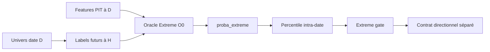

# Oracle Extreme — dossier technique complet

Ce dossier décrit la couche Oracle telle qu’elle existe dans le code actuel. Il remplace la fonction documentaire de l’ancien `doc/ml_oracle.md` sans recopier ses journaux d’expériences.

## Parcours

1. [Concept, sémantique et architecture](01_concept_et_architecture.md)
2. [Labels, univers et tables](02_labels_univers_et_tables.md)
3. [Dataset, features, ablations et anti-fuite](03_dataset_features_et_leakage.md)
4. [Entraînement, walk-forward, calibration et métriques](04_train_walk_forward_et_calibration.md)
5. [Prédiction, persistance et gate quotidien](05_inference_persistance_et_gate.md)
6. [Diagnostics, expériences et statut actuel](06_diagnostics_et_historique.md)

## Résumé du contrat actuel

Oracle Extreme estime `P(mouvement cross-sectionnel extrême à H | information disponible à D)`. La cible positive réunit le TOP 10 % et le BOTTOM 10 % des rendements futurs du jour. Le modèle mesure donc une magnitude/opportunité extrême, pas une direction. Le contrat historique reste H20, mais un entraînement Oracle seul peut maintenant fixer H avec `--oracle-horizon` afin de comparer proprement H5/H10/H15/H20.

La direction long/short doit venir d’une autre couche. Interpréter `proba_extreme` comme `P(long)` est une erreur de contrat.

## Horizon configurable

- `--oracle-horizon 5`, `10`, `15` ou `20` pilote les labels, le dataset, la purge Walk-Forward et les artefacts Oracle ;
- l'option est distincte de `--forecast-horizon`, qui pilote les modèles génériques et Per-Symbol ;
- sans option, un entraînement Oracle conserve H20 ;
- la prédiction relit automatiquement `oracle_horizon` dans `feature_profile.json` ;
- demander explicitement un horizon différent de celui de l'artefact provoque l'erreur bloquante `oracle_horizon_mismatch` ;
- les listes de batches Pipeline, Backtest et Diagnostic ML affichent `H5`, `H10`, `H15` ou `H20` à partir de ce même artefact ;
- le live refuse désormais un batch dont le contrat d'horizon Oracle est introuvable et journalise `batch`, `horizon`, politique et taille du pool avant toute sélection ;
- dans un bundle, `--oracle-horizon` pilote uniquement l'Oracle : les deux branches directionnelles conservent leur contrat ternaire absolu H20 et ±3 % ;
- la table de prédictions ne porte pas l'horizon dans sa clé : un batch ne doit donc contenir qu'un seul horizon Oracle. Les campagnes H5/H10/H15/H20 utilisent des `batch_id` distincts.
- les anciens artefacts sans ce champ restent interprétés comme H20.

## Sources de vérité

- `modelFactory/oracle/` pour les labels, datasets, modèles et diagnostics ;
- `database/sql/ml/global_oracle_labels.sql` et `database/sql/oracle/oracle_extreme_predictions.sql` ;
- migrations Alembic 0064–0065 et suivantes pertinentes ;
- `config.yaml/oracle` et `batch_diagnostics.backtest_batch_id` ;
- tests Oracle sous `tests/`.

Retour : [références ML](../README.md) · [vue Oracle](../../08_ml_oracle_extreme.md)

