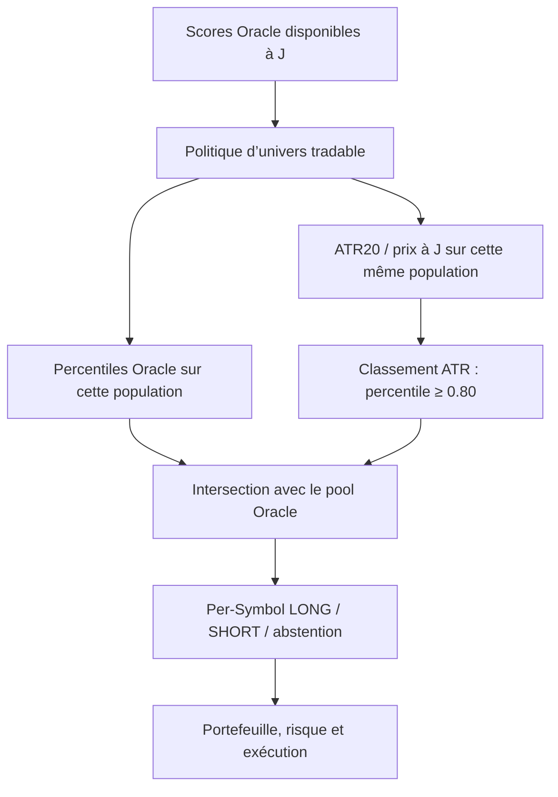

# Filtre d’amplitude Oracle Extreme × ATR — backtest et live

Étude associée : [table quotidienne macro/régime et D1/D10](oracle_atr_market_regime_daily.md),
alimentable depuis la page Régime Marché.

## Objectif et portée

Depuis le 4 octobre 2026, une sélection Oracle Extreme peut être restreinte aux
titres également dans le TOP20 de l’ATR20 rapporté au prix. Ce filtre élimine des
candidats ; il ne crée ni modèle, ni prédiction, ni signal de direction.

Le même module `common/oracle_atr.py` est utilisé par la cascade backtest
(`modelFactory/predictor.py`) et la sélection live (`risk_management/cli.py`).
Les tables de prix sont uniquement lues. Aucune migration SQL, aucun nouvel
entraînement et aucune nouvelle prédiction ne sont requis.

## Activation et retour arrière

Dans le fichier racine `config.yaml` :

```yaml
cascade:
  oracle_atr_enabled: true
```

`true` est la valeur par défaut, y compris si la clé est absente. `false` restitue
la sélection Oracle sans ATR. Utiliser un booléen YAML, pas la chaîne `"false"` :
une valeur de type incorrect déclenche une erreur de configuration.

Le backtest applique le filtre aux modes `extreme_gate` et
`extreme_gate_directional`. Les modes Global Ranking et les autres modes Oracle
de recherche ne changent pas. L’IHM Backtest utilise cette configuration via la
cascade : il n’y a pas de nouvelle case à cocher spécifique.

En live, le filtre intervient lorsque la sélection Oracle tradable est activée
par `cascade.live_oracle_tradable_policy` ou son option CLI correspondante.
**Le nouveau booléen ne passe pas cette politique de `off` à une politique active**
et ne choisit pas un batch live. Il faut toujours configurer le batch Oracle et
la politique live comme décrit dans
[Oracle tradable TOP20](oracle_tradable_top20_backtest_live.md).

Les nouveaux backtests avec `true` ne reproduisent donc pas exactement les
anciens runs Oracle seul : utiliser `false` pour une comparaison de référence.
La configuration est lue lors du lancement du traitement ; changer le YAML
ne modifie pas rétrospectivement un run déjà lancé.

## Ordre des opérations



Avec `filter_then_top20`, le classement Oracle est recalculé sur les titres
tradables avant le filtre ATR. Avec `off`, la population est celle des scores
Oracle disponibles. Avec `top20_then_filter`, les percentiles Oracle restent
ceux du classement large, et le classement ATR porte sur les titres renvoyés
après le filtrage tradable. Le filtre **ne recalcule jamais les percentiles
Oracle après l’intersection** et ne remplit pas les places supprimées.

Le seuil du pool Oracle reste son paramètre existant (`extreme_gate_pct` en
backtest, `live_oracle_pool_pct` en live). Le seuil ATR est TOP20, indépendamment
de ce paramètre. Les rangs utilisent `rank(pct=True)` avec rang moyen en cas
d’égalité et un seuil inclusif : petits univers et ex æquo peuvent produire
une proportion différente d’exactement 20 %.

## Formule et qualité des prix

Pour chaque barre, le rapport `adj_close / close` ajuste `high` et `low`.
Le close utilisé est `adj_close`.

```text
TR(t) = max(high_adj(t) - low_adj(t),
            abs(high_adj(t) - close_adj(t-1)),
            abs(low_adj(t) - close_adj(t-1)))
ATR20(t) = moyenne simple des 20 derniers TR
atr20_pct(t) = ATR20(t) / close_adj(t)
```

Il s’agit d’une moyenne glissante simple, pas du lissage de Wilder. La formule
reprend celle des features ML ajustées. Le filtre exige en plus 21 barres
observées consécutivement valides pour disposer du close précédent. Les prix
doivent être finis, strictement positifs et `high >= low` ; `adj_close` absent
n’est pas remplacé silencieusement par le prix brut. Un ATR nul est exclu.

La barre de la date J doit exister : une dernière barre à J−1 n’est pas utilisée
comme si elle était celle de J. Aucun remplissage calendaire n’est effectué ;
21 barres observées ne constituent pas une garantie de 21 séances sans lacune.
Les doublons symbole/date sont bloquants. Si un panneau fourni directement au
calcul contient `is_filled`, les barres ainsi marquées sont invalidées ; la
lecture de production utilise les colonnes OHLC et `adj_close` existantes.

Un ATR indisponible exclut le titre. Si aucun ATR valide n’existe dans une
population Oracle non vide, le traitement échoue explicitement au lieu de
laisser passer tous les titres. Le classement ATR se fait sur les titres
ayant un ATR valide ; les absents sont comptabilisés dans les diagnostics.

## Temporalité et performances

Le backtest charge les prix par blocs de 150 symboles, une fois pour toutes les
dates du traitement. La borne initiale est 90 jours calendaires avant la
première date demandée ; la borne finale est la dernière date demandée.
Chaque moyenne n’utilise que la barre du jour et ses précédentes : charger une
période entière ne signifie pas utiliser les prix futurs pour classer J.
En live, la lecture est limitée à la date demandée et son historique.

Ce signal fondé sur la clôture J n’est connu qu’après disponibilité de la barre
J. Il ne doit pas être interprété comme un signal disponible à l’ouverture J.
Le calcul utilise les prix ajustés actuellement en base : il ne fournit pas à
lui seul une archive des vintages de corrections ou d’ajustements fournisseurs.

## Diagnostic et interprétation

Le journal `ORACLE_ATR` indique : `rank_population`, `atr_valid`, `atr_missing`,
`oracle_before`, `atr_top20`, `intersection`, `rejected`, ainsi que la date.
Une intersection vide signifie aucune candidature ce jour, pas un remplacement
par les candidats rejetés.

L’[audit figé H20](us_oracle_atr_desaccord_resultats.md) rapporte 41,76 % de vrais
extrêmes dans l’intersection contre 34,37 % dans la partie Oracle **hors ATR**.
Pour comparer à Oracle seul sur tout son TOP20, la référence est environ
40,10 %, soit un gain de 1,66 point ; environ 77,6 % des candidats Oracle sont
conservés. L’amélioration d’amplitude est observée sur les années étudiées,
sans démonstration de direction ou de rentabilité nette. L’audit ne valide pas
automatiquement les autres horizons Oracle.

Les probabilités LONG/SHORT, quality gates, règles de portefeuille, stops et TP
restent inchangés. Le filtre peut retirer des gagnants comme des perdants.

## Tests

`tests/test_oracle_atr_gate.py` couvre formule ajustée, causalité, historique
insuffisant ou absent, prix périmés, configuration, conservation des rangs,
les deux modes de cascade, candidats SHORT, chargement groupé et retour arrière.
Un contrôle structurel vérifie que le chemin live appelle les mêmes fonctions.
Les tests ne passent aucun ordre live et ne modifient aucune donnée métier.
