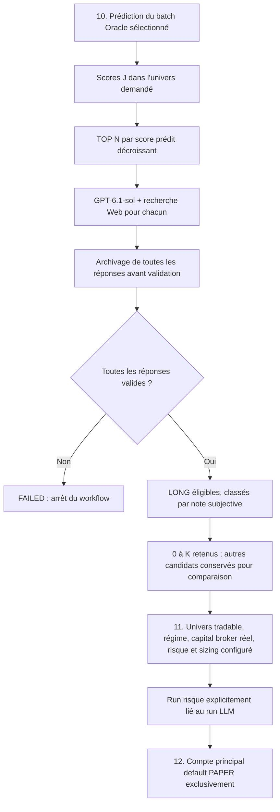

# Filtre directionnel Oracle → GPT + Web → risque → PAPER

Implémentation du 8 octobre 2026. Marché US exclusivement. **Expérience prospective,
non validée économiquement : aucun gain directionnel ou rendement n’est garanti.**

## 1. Objectif et périmètre

L’Oracle Extreme identifie une amplitude potentielle, pas le sens. Le filtre cherche
une thèse LONG documentée parmi ses premiers candidats. Il ne remplace ni le moteur
de risque, ni le sizing, ni les protections. Il ne crée aucune prédiction Per-Symbol
et n’écrit pas de fausses probabilités LONG dans `model_predictions`.



**N = `oracle_top_n` et K = `max_selected`, configurables dans `config.yaml`.**
Défauts du composant : N=10, K=5 ; configuration locale actuelle : N=10, K=3.
Ce sont des nombres de titres, pas des pourcentages.
Le classement initial utilise uniquement `proba_extreme DESC, symbol ASC` ; il
n’utilise jamais les rendements futurs ni un classement Oracle réalisé.
Le filtre n’ajoute pas implicitement une intersection ATR : cette expérience
porte sur les N premiers scores Oracle du périmètre choisi. ATR demeure qualifié
par le risque ; le sizing/protections historiques l'utilisent lorsque le profil
spécifique ci-dessous est désactivé.

## 2. Configuration

```yaml
llm_directional_filter:
  enabled: true
  model: gpt-6.1-sol
  api_key_env: OPENAI_API_KEY
  default_symbol_source: universe-file:univers_filtred_tradable.txt
  default_oracle_batch_id: model-factory-20261003082853-e98332
  oracle_top_n: 10
  max_selected: 3
  min_oracle_coverage_ratio: 0.90
  min_confidence: 0.75
  min_sources: 2
  max_source_age_days: 30
  max_run_age_hours: 24
  timeout_seconds: 120
  max_output_tokens: 6000
  max_tool_calls: 5
  account_id: default
  horizon: 20
  protections:
    enabled: true
    stop_loss_pct: 0.07
    exit_session: 21
    trailing_stop_pct: 0.20
```

`enabled` fournit le défaut IHM et autorise la CLI directe d’analyse. La checkbox
est cochée par défaut dans la configuration actuelle, sans lancement automatique.
Une valeur déjà mémorisée dans la session IHM reste prioritaire.
La checkbox
IHM est un opt-in explicite : elle peut activer une campagne ponctuelle même si
ce défaut reste false. Elle n’active pas le batch planifié `us_pipeline`.
Une campagne enregistre sa configuration entière : changer N/K demain ne change
pas rétrospectivement les sélections enregistrées aujourd’hui.

Les deux champs `default_symbol_source` et `default_oracle_batch_id` préremplissent
les listes « Univers Oracle → filtre GPT » et « Batch Oracle → filtre GPT ».
Les choix manuels restent prioritaires dans la session IHM. Après changement du
YAML, une sélection déjà mémorisée n'est pas écrasée : sélectionner la nouvelle
valeur ou ouvrir une nouvelle session. Le batch dédié remplace, pour ce flux
uniquement, les anciens choix LIVE/BACKTEST ; prédiction et filtre utilisent
toujours le même identifiant. Un univers configuré absent bloque avec un message,
sans substitution silencieuse. Un batch sans artefact Oracle valide reste rejeté
par les contrôles existants. Le filtre désactivé conserve le fonctionnement habituel.

| Paramètre | Rôle / garde-fou |
|---|---|
| `oracle_top_n` | Entier 1–100, borne du nombre d’appels d’analyse, un par titre |
| `max_selected` | Entier 0–N, plafond de sélection ; zéro désactive toute sélection sans effacer l’audit |
| `min_oracle_coverage_ratio` | Fraction minimale de l’univers avec un score Oracle exact pour J ; évite un TOP N issu d’un import partiel |
| `min_confidence` | Seuil d’une **note subjective non calibrée** ; 0,75 ne signifie pas 75 % de chances de hausse |
| `min_sources` | Nombre minimal d’URL distinctes, réellement rencontrées par la recherche et datées récemment |
| `max_source_age_days` | Âge maximal des dates de publication déclarées dans la réponse |
| `max_run_age_hours` | Expiration du résultat pour risque/exécution, au plus 48 h |
| `timeout_seconds` | Limite de lecture HTTP par appel, pas durée totale de la campagne |
| `max_output_tokens` | Budget maximal de sortie par titre, pas budget monétaire global |
| `max_tool_calls` | Borne des appels d’outil pour chaque réponse |
| `account_id` | `default` seulement, avec mode réellement PAPER dans le registre Alpaca |
| `horizon` | Horizon directionnel demandé, vérifié contre l’artefact Oracle ; H20 par défaut |

La clé est lue exclusivement dans `OPENAI_API_KEY`. Sa valeur n’est ni affichée,
ni placée dans les commandes, ni stockée en base. Aucun modèle de remplacement
n’est choisi automatiquement si `gpt-6.1-sol` n’est pas accessible au projet API.

## 3. Informations fournies au LLM et recherche Web

Pour chaque titre : symbole, identité locale (`company_name`, exchange), date J,
rang et score Oracle, horizon, et jusqu’à 21 clôtures connues à J. Le prompt impose
la vérification de l’identité, une thèse haussière, les risques contradictoires,
les catalyseurs et les sources. Les publications d’émetteurs/SEC sont privilégiées.

Le seul outil exposé au modèle est `web_search` de l’API Responses. Le modèle
n’a aucun accès à Alpaca, SQL, au terminal, aux identifiants ni aux ordres. Les
instructions contenues dans les pages Web sont traitées comme données non fiables.
La sortie doit respecter un schéma JSON strict et choisir LONG ou ABSTAIN.

Une réponse LONG n’est éligible que si :

1. le statut API est `completed`, avec au moins une recherche Web terminée ;
2. le JSON respecte le schéma et le symbole demandé ;
3. l’identité est déclarée vérifiée, sans valeur numérique non finie ;
4. la note atteint `min_confidence` ;
5. au moins `min_sources` URL distinctes sont récentes et présentes parmi les
   sources/citations réellement renvoyées par l’outil ;
6. les dates retenues comportent un fuseau, ne sont pas futures et respectent
   `max_source_age_days`.

Une réponse ABSTAIN reste une réponse valide même si les sources récentes sont
insuffisantes. Une réponse techniquement invalide fait échouer **tout le run**,
au lieu de trader silencieusement un sous-ensemble incomplet.

Les LONG éligibles sont triés par note décroissante, puis rang Oracle croissant,
puis symbole. Les K premiers sont retenus au maximum. Il n’y a jamais obligation
d’atteindre K : 0, 1 ou 2 candidats peuvent être le résultat normal.

## 4. Temps, PIT et limites de recherche

Le filtre Web est **prospectif uniquement** : l’analyse doit commencer après la
clôture de la séance J et être terminée strictement avant l’ouverture de la
séance US suivante. Minuit (Paris ou New York) ne change pas la date de séance
figée dans le workflow. Les cours J doivent être disponibles. Le calendrier
NYSE fiable est requis, sans approximation lundi-vendredi : week-ends, jours
fériés, clôtures anticipées et changements d’heure sont pris en compte.

Exemple : un batch lancé le 8 octobre 2026 à 23 h Paris conserve J=2026-10-08
à 8 h Paris le 9 octobre. La fenêtre se ferme à l’ouverture US suivante,
le 9 octobre à 15 h 30 Paris. Une analyse qui dépasse cette ouverture est
marquée échouée, sans sélection publiée. Les informations Web éventuellement
publiées pendant la nuit restent des informations observées à l’heure réelle
du calcul, pas des informations prétendument connues à la clôture J.
La durée de validité configurée du run GPT et les contrôles exacts de date/compte
à l’étape risque restent inchangés.
Le filtre refuse une commande de prédiction historique ou Oracle shadow.
Il ne reconstitue pas les informations qu’un LLM aurait connues en 2024 ou 2025.

`observed_at`, début et fin d’analyse sont enregistrés en UTC. Les dates de
publication trouvées par le LLM sont des **déclarations non certifiées**, signalées
par `source_timestamps_verified=false`. Stocker une citation et une date ne
certifie ni son antériorité originale, ni l’exhaustivité du contenu Web.
L’information n’est utilisable qu’après réception/finalisation effective du run.

Une sélection périmée, datée du futur, partielle ou incohérente est rejetée.
Les conventions existantes de décision J et entrée à la séance suivante restent
applicables ; l’option ne force jamais un ordre après clôture. Un ordre peut être
bloqué/reporté par le moteur d’exécution et sa fenêtre de soumission.

## 5. Tables et reprise

Migration : `alembic/versions/0093_llm_directional.py`.
SQL de référence : `database/sql/ml/llm_directional_filter.sql`.
Les trois tables résident dans **alpha_trade**, jamais dans les bases FR/CN.

| Table | Contenu |
|---|---|
| `llm_directional_runs` | Batch, J, compte, protocole, configuration et univers figés, hash des entrées, début/fin, statut, liste finale, erreur, réservation risque, identifiant risque et réservation exécution |
| `llm_directional_assessments` | Tous les titres analysés, rang/score, requête exacte, réponse brute et hash, réponse structurée, sources, motif/erreur, statut et sélection finale |
| `llm_directional_evaluations` | Mesures réalisées séparées H5/H10/H20, sélection ou rejet, dates entrée/sortie, rendement brut ajusté, rendement depuis J, décile qualifié si disponible et lineage |

Les réponses sont **persistées individuellement dès réception, avant parsing**.
Seuls les champs dérivés changent ensuite de RECEIVED à VALID/FAILED. Les corps
bruts ne sont pas remplacés. La finalisation du run et le marquage des retenus
sont transactionnels. Un arrêt laisse les réponses déjà reçues consultables,
mais un run RUNNING/FAILED n’est jamais servable.

L’application refuse de réutiliser le même `run_id` pour une nouvelle analyse.
Elle ne relance pas automatiquement un appel API après timeout : il pourrait
déjà être facturé. Un nouveau run volontaire crée de nouvelles observations.
Les réservations risque/exécution empêchent un double lancement automatique.
Après un crash lors d’un envoi d’ordre, vérifier l’état broker avant toute reprise ;
la réservation n’est pas effacée automatiquement.

Les hashes permettent des contrôles de cohérence, pas une garantie d’inaltérabilité
contre un administrateur SQL. Conserver les sauvegardes et limiter les droits SQL.
Les archives contiennent le retour API et ses citations, pas une copie intégrale
de toutes les pages Web. Elles ne donnent pas de droit de redistribution des sources.

## 6. Risque et exécution : pas de fausse probabilité

Le chemin `oracle_web_llm_long` réutilise le PortfolioBuilder et ses contrôles
capital/slots/secteur/corrélation/régime/ATR. Il exige un snapshot broker réel
PAPER (equity, cash, buying power, positions et ordres ouverts), et non une
estimation issue des anciens ordres de risque.

Le prix, l’ATR et l’ADV du jour doivent être qualifiés ; le régime doit être du
jour et son snapshot récent. L’univers tradable et les gates de risque/MLOps
restent autoritaires : un titre sélectionné par GPT peut être refusé ensuite.
Les secteurs actuellement disponibles restent ceux utilisés par l’application.

La note LLM alimente le classement explicite avec
`score_source=llm_confidence_uncalibrated`. Elle n’alimente pas `P(LONG)`, le Kelly
ou une espérance de rendement artificielle. Kelly et un optimiseur exigeant un
edge directionnel qualifié sont interdits dans cette voie.

La CLI risque reçoit le `llm_filter_run_id` exact. Son vrai `risk_run_id` est lié
en base avant toute exécution. L’étape 12 reçoit ce même identifiant risque et
n’effectue aucun fallback vers les dernières cibles connues.
Avant soumission, les cibles doivent correspondre au compte/date et à la sélection ;
les titres déjà détenus hors sélection ne peuvent pas être augmentés par cette voie.
Les protections des positions existantes restent du ressort du lifecycle/watcher.

LIVE, les autres comptes, `allow_outside_rth`, le rééquilibrage automatique et un
plan d’exécution externe sont refusés. Aucun LLM ne choisit les quantités ou les stops.

### 6.1. Protections spécifiques GPT — 9 octobre 2026

Dans les paramètres ML de Pipeline, sous la case GPT, apparaît la case
**« 🛡️ Protections spécifiques GPT — SL / sortie temporelle / trailing »**.
Elle est cochée par défaut (`protections.enabled: true`) et n'est prise en compte
que si le filtre GPT est activé. Elle s'applique aux nouvelles entrées LONG du
compte `default`, marché US, mode PAPER. Elle ne transforme pas les positions
existantes, les achats manuels ou les ordres FR/CN/LIVE.

| Réglage | Comportement du profil |
|---|---|
| `stop_loss_pct: 0.07` | Stop initial à 7 % sous le prix moyen **réellement exécuté** du parent, arrondi au centime. Sizing calculé avec cette distance plutôt que 2,5 ATR ; les contrôles capital/liquidité/régime restent actifs. |
| `exit_session: 21` | Vente temporelle, gagnante ou perdante : séance d'achat = 1, sortie à l'ouverture de la 21e séance NYSE. Ce n'est ni un TP de prix ni 21 jours calendaires ; week-ends et jours fériés sont exclus. |
| `trailing_stop_pct: 0.20` | Trailing natif à 20 % sous le plus haut suivi par le broker **après activation**. Le SL initial reste actif tant que le plancher du trailing serait plus bas que lui. |

Exemple entrée 100 $ : SL 93 $. Le trailing 20 % peut prendre le relais lorsque
le cours atteint au moins 116,25 $ (116,25 × 0,80 = 93), pas au trigger 1R
historique. Le watcher recontrôle le prix après annulation du SL ; si le cours
a reculé, il réarme le SL initial au lieu de le desserrer. La référence est le
prix exécuté du parent, pas le prix moyen courant d'autres achats du même titre.
Le plancher effectivement confirmé par le broker est également contrôlé :
s'il est plus bas que le SL initial ou absent, le trailing est annulé avec
confirmation, puis le SL est réarmé (une exécution pendant l'annulation interdit
un nouvel ordre de vente). Les rejets certains et les états réseau inconnus sont
traités séparément.
Le plus haut antérieur à l'activation n'est pas reconstitué rétrospectivement.
Les réglages expérimentaux par signal/ATR ne remplacent pas ce trailing spécifique.
Les exemples ci-dessus utilisent le défaut 20 % ; la valeur locale peut être
différente (`0.15` au dernier contrôle), sans être écrasée par le code.

Aucun ordre limite de TP de prix n'est créé pour ce profil. Le garde-fou du watcher
ne recrée pas non plus un ancien TP à 7 %/ATR et ne considère pas cette absence
intentionnelle comme un motif de duplication du SL. Les quantités sont entières
pour cette voie (protections GTC et ordre d'ouverture), même si les fractions
restent autorisées dans la configuration historique.
La préférence historique `swing_only` ne retarde pas l'armement de ce SL au
lendemain ; seules les protections de ces nouvelles entrées GPT sont concernées,
sans changer les contraintes du compte ou les règles d'entrée.

**Sortie à l'ouverture :** le watcher programme un ordre marché d'ouverture
Alpaca (`market`, `time_in_force=opg`) uniquement pour la séance immédiatement
suivante, à partir de 19 h New York ou avant 9 h 28 le matin de la sortie.
Les heures New York/Paris et leurs changements d'heure sont gérés par le
calendrier strict. Les protections sont annulées et leur état est confirmé
avant de réserver/envoyer la vente ; un stop exécuté pendant l'annulation bloque
une seconde vente. Voir les [conditions officielles Alpaca](https://docs.alpaca.markets/us/docs/orders-at-alpaca).

Le **service watcher doit rester actif et le PC allumé**, notamment avant
l'ouverture cible : une simple exécution quotidienne des étapes 10–12 ne suffit
pas à assurer cette échéance. Dans Pipeline → **Watcher protections**, utiliser
**« Démarrer service local »**, compte principal, avant l'étape 12 ;
`Run watcher once` et `--auto-watcher` en mode once ne suffisent pas.
L'étape 12 bloque ce profil si le heartbeat du service est absent/périmé,
avant toute réservation exécution ou soumission. Un service Windows existant
avec heartbeat valide convient également. Le contrôle au lancement ne garantit
pas que le PC restera disponible jusqu'à la séance cible.
Si l'ouverture est manquée, le watcher soumet une
sortie marché de rattrapage pendant une séance ouverte ; elle est marquée
`LATE_MARKET`, jamais présentée comme une exécution au prix d'ouverture.
Un ordre d'ouverture expiré/rejeté ne réutilise pas la même clé de soumission
que ce rattrapage. Un état réseau ambigu est réservé en base et impose une
réconciliation/revue avant nouvelle tentative ; pas de fallback silencieux
vers un trailing moins protecteur. Un SL déjà franchi lors d'un réarmement
déclenche une sortie marché plutôt qu'un stop incohérent au-dessus du cours.

Les paramètres et le choix de la case sont figés à l'étape 10 dans
`llm_directional_runs.config_json.protections`, puis retrouvés par le `risk_run_id`
exact et le symbole sélectionné pour les étapes 11/12 et le watcher, y compris
après redémarrage. Le journal d'exécution conserve les demandes/observations et
la politique/délai dans les événements. **Aucune nouvelle table ni migration
n'est nécessaire.** Changer le YAML ne réécrit pas les protections d'un run
déjà publié. Changer la case entre 10 et 11/12 bloque : garder le même choix,
ou effectuer une nouvelle analyse. Les anciennes analyses sans cette clé
gardent leur politique historique.

Case décochée, ou filtre GPT décoché : comportement historique inchangé
(SL ATR, TP de prix, trailing et time-stop selon les autres réglages).
Un SL de 7 % et un trailing ne garantissent pas une perte plafonnée : gaps,
slippage, suspensions, annulations ou indisponibilité du service restent possibles.

## 7. Utilisation IHM

1. Redémarrer l’IHM après installation du code. Choisir le marché US.
2. Dans Pipeline → paramètres ML, cocher **« Filtrage GPT + recherche Web après
   Oracle — PAPER uniquement »**. Les valeurs N/K sont affichées depuis le YAML.
   La case de protections spécifiques placée dessous est cochée par défaut ;
   la décocher **avant l'étape 10** pour conserver les protections historiques.
3. Sélectionner explicitement le batch Oracle et l’univers de prédiction, pour J,
   sans plage historique et sans Oracle shadow. Choisir le compte principal.
4. Laisser Kelly, hors séance, LIVE et rééquilibrage automatique désactivés.
5. Lancer un workflow comprenant 10 → 11 → 12 : un identifiant LLM unique est
   partagé entre les trois étapes. L’étape 12 utilise PAPER même si le mode global
   affiché était simulate ; LIVE est refusé, jamais converti silencieusement.
6. Pour lancer les étapes séparément : copier le `run_id` renvoyé par l’étape 10
   dans le champ **Identifiant analyse LLM** avant 11 puis 12. Ne pas utiliser auto
   pour risque/exécution. Réutiliser un run déjà consommé échoue volontairement.
7. Dans **« Audit des sélections GPT + Web — PAPER »**, saisir l’identifiant pour
   consulter tous les titres, les motifs, sources, configuration et évaluations.

Le workflow s’arrête en cas d’échec. Une abstention complète n’envoie aucun nouvel
ordre. Les listes `config.yaml → us_pipeline.steps` / `steps_friday` définissent
les étapes du batch quotidien (de 1 à 12). Le filtre GPT n'est pas activé
implicitement par ces listes ou les cases de la session IHM ; voir le guide
`doc/operations/us_pipeline.md` pour le mode et le plan configurés.

## 8. Commandes et vérification

Contrôle sans génération GPT ni ordre :

```powershell
python -m service.llm_directional.preflight --check-api
```

Ce contrôle utilise seulement GET pour vérifier l’accès au modèle. Il n’établit
pas que Web Search + sortie structurée fonctionnent en réel : cela nécessitera
une première analyse prospective, avec consommation API explicite.

Après activation YAML pour une analyse CLI directe :

```powershell
python -u -m service.llm_directional.runner --batch-id BATCH_ORACLE --trade-date YYYY-MM-DD --symbol-source universe-file:univers_filtred_tradable.txt --capital-preset-key capital_2001_5000
python -m service.llm_directional.report --run-id RUN_LLM
python -m service.llm_directional.evaluate --run-id RUN_LLM
```

Les commandes combinées prédiction/filtre, risque et exécution sont générées par
l’IHM ; ne pas lancer directement `run_execution.py` sans identifiant risque lié.

## 9. Évaluation ultérieure

L’évaluateur traite **tous les candidats archivés**, retenus et rejetés : comparaison
du filtre contre le TOP N Oracle initial, pas seulement des gagnants sélectionnés.
Il attend les horizons matures, vérifie des barres complètes/non remplies et des
prix positifs, puis écrit progressivement uniquement sa table d’évaluation.
Une seconde exécution saute les évaluations déjà enregistrées.

`return_pct` : entrée à l’open J+1 ajusté sur l’échelle de `adj_close`, sortie à
la clôture ajustée J+H. `signal_return_pct` : clôture ajustée J → J+H.
Ces mesures sont brutes, fondées sur les ajustements fournisseur, sans frais,
slippage, taxes, contraintes de portefeuille ni lifecycle ; ce n’est pas un backtest
économique validé. Les dates J+H sont des séances NYSE, pas des jours calendaires.
`oracle_decile` n’est renseigné qu’à partir d’un label du même batch/horizon, de
qualité valide et effectivement disponible ; sinon il reste NULL, jamais inventé.

Une promotion nécessite des campagnes prospectives suffisantes, une comparaison
aux rejets/baseline, des résultats par période/symbole/régime et un test économique
ultérieur. Ne pas réajuster les seuils sur ces observations puis les appeler OOS.

## 10. État de livraison et limites opérationnelles

Les tables ont été créées sans modifier les tables métier existantes. Le marqueur
Alembic existant était `0088_us_fact_instrument_constraints` : il n’a pas été avancé
artificiellement au-delà des migrations intermédiaires. La migration 0093 est
idempotente pour les tables déjà présentes ; traiter la chaîne historique séparément.

Compte principal vérifié : `default`, PAPER. Après actualisation de l'accès API,
le contrôle du 8 octobre 2026 retourne **HTTP 200 pour `gpt-6.1-sol`** : le précédent
blocage `401 invalid_api_key` est levé. Ce GET de métadonnées ne valide pas encore
un appel Responses avec recherche Web. Ne jamais transmettre la clé dans le chat.
Les racines de certificats Windows sont prises en compte sans désactiver TLS.

Tests : mocks API/broker et base SQLite isolée. Aucun appel d’analyse GPT payant,
aucun entraînement et aucun ordre n’ont été lancés pendant l’implémentation.
Vérification du 8 octobre 2026 : **250 tests ciblés passent**, couvrant le filtre,
les commandes Pipeline, le risque et le portefeuille Oracle. Rapport automatisé :
`artifacts/research/llm_directional_implementation/tests.xml`. La compilation des
modules modifiés et le contrôle de cohérence du diff passent également.
L’accès effectif au modèle, la facturation et un premier cycle PAPER restent à
valider avec une clé valide et des prédictions de la séance courante.

## 11. Sources techniques et points d’entrée

### Lancement manuel de ML Predict et tables GPT (9 octobre 2026)

Le bouton « 10. ML Predict » peut être lancé sans succès préalable de l’étape 9
ni de l’entraînement optionnel T1 : il peut utiliser des modèles et données déjà
disponibles. Les verrous de concurrence, de workflow actif et de protection LIVE
restent applicables. Les contrôles du filtre GPT (PAPER, fenêtre clôture J/ouverture suivante,
données et batch Oracle disponibles) ne sont pas contournés. L’ordre du workflow
et les prérequis des étapes risque/exécution ne changent pas.

Le filtre GPT écrit uniquement dans la base US `alpha_trade` :

- `llm_directional_runs` : configuration, entrées, état, sélection et liens avec
  les étapes risque/exécution ;
- `llm_directional_assessments` : requête/réponse brute, analyse, sources Web,
  décision et sélection par symbole ;
- `llm_directional_evaluations` : rendements réalisés, alimentés ultérieurement
  par l’évaluation, pas pendant l’analyse GPT.

GPT ne remplace pas les scores Oracle. La prédiction ML préalable conserve ses
propres écritures habituelles ; ces trois tables concernent le filtre et son audit.

- [OpenAI Responses Web Search](https://developers.openai.com/api/docs/guides/tools-web-search)
- [OpenAI Structured Outputs](https://developers.openai.com/api/docs/guides/structured-outputs)
- [Modèle GPT-6.1-sol](https://developers.openai.com/api/docs/models/gpt-6.1-sol)
- `service/llm_directional/config.py` : validation des paramètres.
- `openai_client.py`, `validation.py` : transport, prompt, schéma et décisions.
- `repository.py`, `runner.py` : stockage individuel et orchestration de l’analyse.
- `pipeline.py`, `risk_adapter.py` : corrélation des trois étapes et voie PAPER.
- `report.py`, `evaluate.py`, `preflight.py` : audit, mesures différées et contrôle.
- `ihm/services/pipeline_runner.py`, `process_registry.py` : commandes et workflow.
- `risk_management/cli.py`, `portfolio_builder.py` : réutilisation du moteur réel.
- `tests/test_llm_directional_filter.py` : tests de la nouvelle fonctionnalité.
