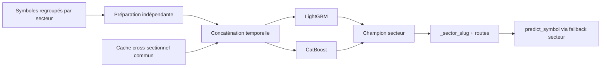

# Modèle per-sector — dossier technique complet

Le modèle per-sector mutualise les observations des symboles d’un même secteur.
Dans le code courant, il entraîne effectivement LightGBM et CatBoost ; le
challenger LSTM sectoriel est explicitement marqué non implémenté et `skipped`.

## Chapitres

1. [Architecture, univers et pooling](01_architecture_univers_pooling.md)
2. [Features et targets sectorielles](02_features_et_targets.md)
3. [Entraînement, walk-forward et champion](03_train_walk_forward_champion.md)
4. [Artefacts, serving et fallback](04_artefacts_serving_fallback.md)
5. [Configuration, diagnostics et runbook](05_configuration_diagnostics_runbook.md)

Sources : `modelFactory/trainer_sector.py`, `tabular_baseline.py`,
`predictor.py`, `predict_per_sector.py`, `cross_sectional.py` et le registre DB.

Retour : [références ML](../README.md)

