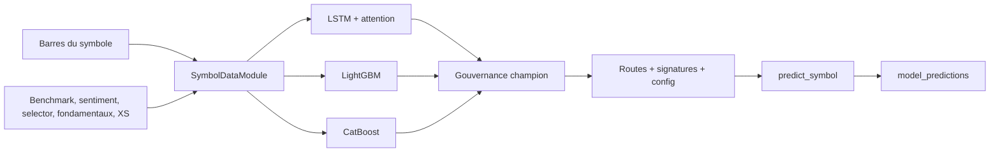

# Modèle per-symbol — dossier technique complet

Le modèle per-symbol entraîne une famille de challengers pour chaque ticker à
partir de son historique et de contextes optionnels. La gouvernance choisit une
route de serving propre au symbole. Une absence ou une route inéligible peut
conduire au modèle sectoriel, selon la résolution d’artefacts.

## Chapitres

1. [Architecture et responsabilités](01_architecture.md)
2. [Dataset, features et targets](02_dataset_features_targets.md)
3. [Entraînement, walk-forward et champions](03_train_walk_forward_champions.md)
4. [Artefacts, serving et fallbacks](04_artefacts_serving_fallbacks.md)
5. [Configuration, diagnostics et runbook](05_configuration_diagnostics_runbook.md)
6. [Sélection des candidats directionnels](06_selection_candidats_directionnels.md)

## Flux

Sources principales : `modelFactory/trainer.py`, `dataset.py`, `features.py`,
`tabular_baseline.py`, `champion_selection.py`, `predictor.py` et `db_registry.py`.

Retour : [références ML](../README.md)

