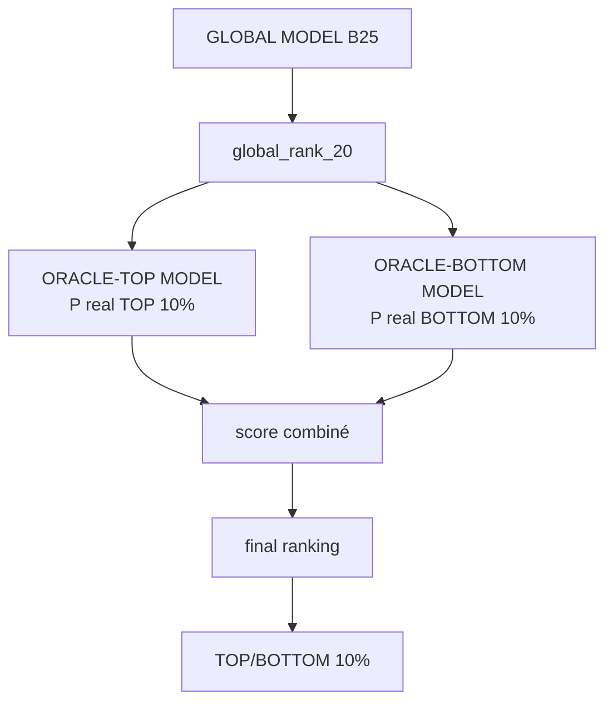
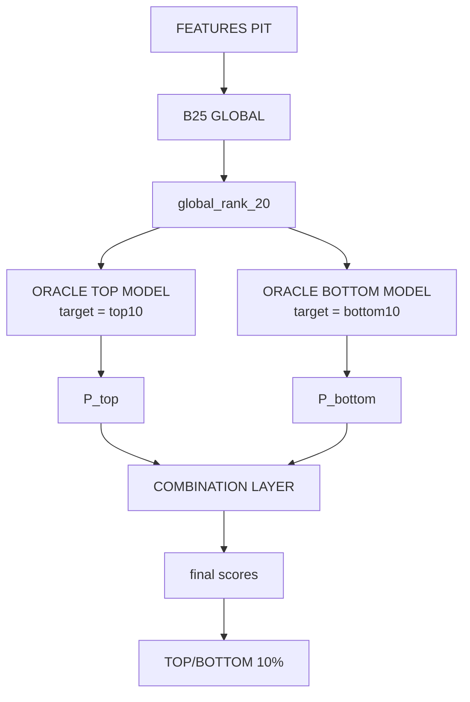
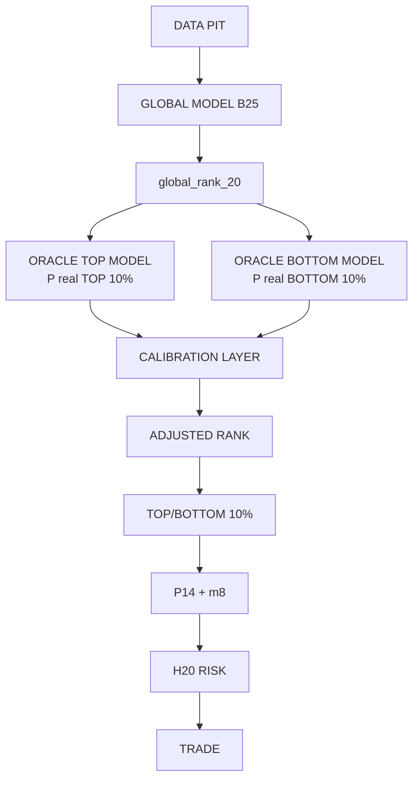

# Spécification — Oracle Layer au-dessus du Global Model

> **Statut** : 📐 Spécification (2026-08-18) — révisée suite au retour opérateur (même jour)
> **Contexte** : analyse Oracle du run `20260817_205031_2a2836d1`
> **Objectif** : construire une **Oracle Layer** (TOP / BOTTOM) qui apprend, sur
> l'historique, dans quelles configurations le Global Model réussit ou échoue à
> identifier les vrais extrêmes cross-sectionnels.
> **Règle cardinale** : l'Oracle est un **TARGET**, jamais une **FEATURE**. B25 reste
> **intact** pendant toute la 1ʳᵉ expérimentation.
>
> **Décisions actées (retour opérateur)** :
> - Target = **brut cross-sectionnel** (top ~40/~399 du jour), **H20 seul** ;
> - Univers = `global_rank_history`, **bit-for-bit** contre `model_predictions` ;
> - Oracle TOP = **second signal** (`adjusted_score = f(global_rank_20, P_top)`), B25 intouchable ;
> - **Anti-leakage non négociable** ; α/seuils/hyperparams **gelés avant l'OOS final** ;
> - Métrique principale = **TOP capture + monotonicité** ; le **backtest (niveau 3) décide**.

---

## Sommaire

1. [Objectif](#1-objectif)
2. [Principe fondamental : Oracle = Target, jamais Feature](#2-principe-fondamental)
3. [Table Oracle historique](#3-table-oracle-historique)
4. [Univers Oracle = univers Global Model](#4-univers-oracle)
5. [B25 intouchable](#5-b25-intouchable)
6. [Architecture des deux modèles Oracle](#6-architecture-des-deux-modèles-oracle)
7. [Features des modèles Oracle](#7-features-des-modèles-oracle)
8. [Features PIT obligatoires](#8-features-pit-obligatoires)
9. [Anti-leakage des labels Oracle](#9-anti-leakage-des-labels-oracle)
10. [Pré-calcul des Oracle historiques](#10-pré-calcul-des-oracle-historiques)
11. [Walk-forward causal](#11-walk-forward-causal)
12. [Taille du dataset](#12-taille-du-dataset)
13. [Quelle cible utiliser](#13-quelle-cible-utiliser)
14. [Architecture recommandée phase 1](#14-architecture-recommandée-phase-1)
15. [Combinaison des scores](#15-combinaison-des-scores)
16. [Calibration](#16-calibration)
17. [Métriques ML obligatoires](#17-métriques-ml-obligatoires)
18. [Décile monotonicity](#18-décile-monotonicity)
19. [Métriques trading obligatoires](#19-métriques-trading-obligatoires)
20. [Métriques trading](#20-métriques-trading)
21. [Le résultat le plus important](#21-le-résultat-le-plus-important)
22. [Tester d'abord LONG uniquement](#22-tester-dabord-long-uniquement)
23. [Comparaison des architectures](#23-comparaison-des-architectures)
24. [Ne pas remplacer B25 prématurément](#24-ne-pas-remplacer-b25-prématurément)
25. [Version avancée : Residual Model](#25-version-avancée-residual-model)
26. [Version avancée : distillation / ranking](#26-version-avancée-distillation--ranking)
27. [Anti-leakage tests automatisés](#27-anti-leakage-tests-automatisés)
28. [Réutiliser les prédictions B25 historiques](#28-réutiliser-les-prédictions-b25-historiques)
29. [Dataset final du Oracle Model](#29-dataset-final-du-oracle-model)
30. [Plan d'implémentation (Étape 1 → 7)](#30-plan-dimplémentation-étape-1--7)
31. [Critère de réussite](#31-critère-de-réussite)
32. [Architecture cible finale](#32-architecture-cible-finale)
33. [Baselines « sans oracle »](#33-baselines-sans-oracle)

---

## 1. Objectif

Le Global Model est entraîné pour produire un **ranking cross-sectionnel** des
~400 symboles disponibles chaque jour. La cascade de production utilise ensuite :

```
global_rank_20
      ↓
TOP 10%     → candidats LONG
BOTTOM 10%  → candidats SHORT
```

L'analyse Oracle récente montre :

| | Random | B25 |
|---|---|---|
| Vrai TOP 10 % capturé | 10 % | **16.7 %** |
| Vrai BOTTOM 10 % capturé | 10 % | **8.2 %** |

Donc :
- le Global Model possède un **signal réel côté LONG** ;
- le signal SHORT est actuellement **faible voire nul** ;
- une **partie importante des vrais TOP/BOTTOM n'est pas capturée** par le ranking actuel.

**Objectif du projet** : construire une **Oracle Layer** capable d'apprendre, à partir
de l'historique, **dans quelles configurations le Global Model réussit ou échoue** à
identifier les vrais extrêmes cross-sectionnels.

> ⚠️ **L'Oracle Layer ne remplace PAS B25 dans la première expérimentation.**



---

## 2. Principe fondamental

**L'Oracle est un TARGET, jamais une FEATURE.**

L'Oracle est calculé à partir du rendement futur réel (ex. H20) :

```
future_return_20 = adj_close[D+20] / adj_close[D] − 1
```

Puis, pour chaque date D, sur l'univers réellement disponible :
`TOP 10% = 1` / `BOTTOM 10% = 1`.

Ces informations ne sont disponibles **qu'après réalisation du futur** :

```
D
│
├── Features disponibles à D
├── B25 prediction à D
│   >>> aucune information Oracle disponible
└────────────────────────────→ D+20
                                 │
                                 └── Oracle(D) devient connu
```

Définitions :
```
oracle_exit_date      = D + H
oracle_available_date = oracle_exit_date + 1 trading day
```

> La colonne **`oracle_available_date`** doit être stockée explicitement.

---

## 3. Table Oracle historique

Créer une table dédiée, par exemple **`global_oracle_labels`** (ou nom équivalent).

**Minimum recommandé** :

| Colonne | Description |
|---|---|
| `prediction_date` | Date D de la prédiction |
| `symbol` | Symbole |
| `id_batch` | Batch du Global Model |
| `horizon` | H (ex. 20) |
| `future_return` | Rendement futur réalisé |
| `oracle_pct_rank` | Percentile cross-sectionnel |
| `oracle_decile` | Décile (1–10) |
| `oracle_top10` | 1 si TOP 10 % |
| `oracle_bottom10` | 1 si BOTTOM 10 % |
| `oracle_exit_date` | D + H |
| `oracle_available_date` | exit + 1 jour ouvrés |

**Idéalement**, conserver aussi les sorties du Global Model au moment de la prédiction :
`global_rank_20`, `global_score_20`, `global_rank_10`, …

**Exemple** :

| prediction_date | symbol | id_batch | horizon | future_return | pct_rank | décile | top10 | bottom10 | exit_date | available_date |
|---|---|---|---|---|---|---|---|---|---|---|
| 2022-01-03 | AAPL | batch_123456 | H20 | +0.143 | 0.96 | 10 | 1 | 0 | 2022-01-31 | 2022-02-01 |

---

## 4. Univers Oracle

**Impératif : le même univers que le Global Model.**

- L'Oracle **ne doit PAS** être calculé sur un univers différent.
- Utiliser les **~399 symboles/jour** réellement présents dans `model_predictions` et
  disponibles pour le Global Model à cette date.
- `Global universe(D) = Oracle universe(D)`.
- Le TOP 10 % = les 10 % meilleurs rendements futurs **parmi les titres que le Global
  Model pouvait réellement sélectionner ce jour-là**.
- ⛔ **Jamais** d'univers survivorship-biased ou d'un autre pool.

---

## 5. B25 intouchable

B25 doit rester **strictement identique**. Ne pas modifier :
- ses features ;
- son target ;
- son entraînement ;
- ses hyperparamètres ;
- son ranking ;
- son modèle ;
- son pipeline de production.

On ajoute **uniquement** :

```
B25
 +
Oracle Layer
```

→ pour répondre objectivement : *« Est-ce que l'Oracle Layer apporte réellement quelque
chose ? »*

---

## 6. Architecture des deux modèles Oracle

Construire **deux modèles indépendants** (pas de symétrie forcée).

### Oracle TOP Model
```
target : oracle_top10 = 1  si rendement futur ∈ TOP 10% cross-sectionnel du jour
                        0  sinon
objectif : P(real TOP 10% | information disponible à D)
```

### Oracle BOTTOM Model
```
target : oracle_bottom10 = 1  si rendement futur ∈ BOTTOM 10%
                          0  sinon
objectif : P(real BOTTOM 10% | information disponible à D)
```

> Les résultats actuels (TOP 16.7 % vs BOTTOM 8.2 %) montrent que les deux problèmes
> ont des patterns très différents → **entraînés séparément**.

---

## 7. Features des modèles Oracle

Trois catégories.

### A. Features du Global Model (disponibles à D)
`momentum`, `returns`, `volatilité`, `volume`, `relative strength`, `fundamentals PIT`,
`secteur`, `market regime`, etc. — **ne pas recréer artificiellement une information future**.

### B. Informations produites par le Global Model
Le Oracle Model peut recevoir `global_rank_20`, `global_score_20` (+ autres outputs).
Exemple : quand B25 donne 0.93, dans quelles configurations ce titre devient
réellement TOP 10 % ? → **seconde couche de décision**.

### C. Features spécifiques Oracle (orientées extrêmes)
- accélération du momentum ;
- momentum court vs long ;
- variation de volatilité ;
- volume expansion ;
- relative strength ;
- distance aux highs/lows ;
- drawdown récent ;
- dispersion cross-sectionnelle ;
- force/faiblesse sectorielle ;
- interactions momentum × volume / momentum × volatilité.

> Ne pas ajouter aveuglément des features. **Faire des ablations** — la question
> scientifique : *« B25 rate-t-il des gagnants parce que son **objectif** est mauvais,
> ou parce que ses **features** n'ont pas l'information ? »*
> - `O0` = features **exactes** de B25, **sans** `global_rank` → isole l'effet de l'objectif ;
> - `O1` = O0 + `global_rank_20` + features Oracle spécialisées (catégorie C) ;
> - `O2` = **seulement** certaines familles : momentum / volume / volatility / market
>   regime (sans le set complet B25) → teste si un set allégé suffit.

---

## 8. Features PIT obligatoires

Toutes les features doivent respecter :
```
feature timestamp <= prediction_date D
```

⛔ **Jamais** comme feature :
```
future_return · future_volatility · oracle_rank · oracle_decile ·
future_price · future_volume
```
Ces informations servent **uniquement** à créer les **targets historiques**.

---

## 9. Anti-leakage des labels Oracle

Exemple — `prediction_date = 2022-01-03`, H20 → Oracle connu le **2022-02-01**
(`oracle_available_date`).

- ❌ Prédiction le 2022-01-15 avec Oracle(2022-01-03) : **interdite** (pas encore disponible).
- ✅ Prédiction le 2022-02-02 : **autorisée**.

**Règle absolue d'entraînement :**
```sql
WHERE oracle_available_date <= training_cutoff_date
```

---

## 10. Pré-calcul des Oracle historiques

Il est **recommandé** de pré-calculer les Oracle historiques (ex. 2016 → 2025) pour
chaque `date × symbol × horizon`, puis stocker `oracle_available_date`.

- Connaître aujourd'hui l'Oracle de 2018 **n'est pas du leakage**.
- Le leakage n'existe que si une **simulation du passé** utilise une information non
  disponible à cette date.
- Oracle 2018 (available 2018 + 20 j) → utilisable pour apprendre une prédiction de
  **2019**, jamais pour modifier rétroactivement une prédiction de 2018.

---

## 11. Walk-forward causal

Le pipeline doit être **strictement temporel** :

```
TRAIN 2016 → 2020  (Oracle labels disponibles avant cutoff)
        ↓
Train Oracle-TOP / Oracle-BOTTOM
        ↓
VALIDATION 2021

2016 → 2021 (nouveaux Oracle disponibles)
        ↓
retrain Oracle models
        ↓
VALIDATION 2022
… (etc.)
```

> Le modèle de 2021 ne doit **jamais** voir Oracle 2021 si cet Oracle n'était pas
> encore disponible au moment de la prédiction 2021.

---

## 12. Taille du dataset

Ne pas sous-estimer le volume : chaque journée contient **~400 symboles**.

```
1 année ≈ 250 × 400 ≈ 100 000 observations
```

Le délai H20 **ne limite pas le nombre d'observations** ; il limite uniquement leur
**date de disponibilité**.

---

## 13. Quelle cible utiliser

**Première version recommandée** : TOP = classification, BOTTOM = classification.

Le target est **cross-sectionnel à l'intérieur de l'univers du jour** :
`oracle_top10 = 1` si le titre fait partie des **~40 meilleurs (~10 % de ~399)**
titres de ce jour-là. **Jamais** un seuil de rendement absolu (« > +5 % ») : la
question réelle est *« ce titre fait-il partie des meilleurs du jour ? »*, pas
*« ce titre gagne-t-il plus de X % ? »*.

Conserver aussi `oracle_pct_rank` et `oracle_decile` **pour les analyses**.

**Deuxième expérience** : target continu = `oracle_rank − global_rank`
(le *Residual Model*) — **pas la première implémentation à privilégier**.

> **Horizon canonique** : **H20 uniquement** pour la 1ʳᵉ expérience (H10 viendra
> ensuite si H20 valide). Le target de la 1ʳᵉ expérience est **brut** (rendement
> futur non neutralisé) ; la variante **neutralisée** (vol-scaled / sector / factor)
> sera testée en ablation après.

---

## 14. Architecture recommandée phase 1



> **Précision (retour opérateur)** : l'Oracle TOP **ne remplace pas B25** — c'est un
> **second signal spécialisé**. On calcule `adjusted_score = f(global_rank_20, P_top)`,
> puis on applique le TOP 10 % sur `adjusted_score`. B25 reste intouchable.

---

## 15. Combinaison des scores

Ne pas commencer avec une formule compliquée. Tester d'abord des combinaisons simples.

**Baseline**
```
long_score  = global_rank_20
short_score = 1 − global_rank_20
```

**Variante 1**
```
long_score  = global_rank_20 × P_top
short_score = (1 − global_rank_20) × P_bottom
```

**Variante 2** (pondérée)
```
long_score  = α × global_rank_20 + (1 − α) × P_top
short_score = α × (1 − global_rank_20) + (1 − α) × P_bottom
```

> Tester plusieurs `α` **uniquement via calibration WF**, jamais sur l'OOS final.

---

## 16. Calibration

`P_top` / `P_bottom` ne doivent pas être supposées parfaitement calibrées. Tester :
- isotonic calibration ;
- Platt / logistic calibration ;
- ranking percentile plutôt que probabilité brute.

Garder une **version sans calibration comme baseline**.

---

## 17. Métriques ML obligatoires

Le 1ᵉʳ objectif n'est pas uniquement le P&L.

**Capture Oracle (TOP)**
```
Random        10%
B25          16.7%
Oracle layer   ?
```
Objectif expérimental : **16.7 % → 20 %+** (sans garantir 20-25 %).

**Bottom capture**
```
Random        10%
B25           8.2%
Oracle layer   ?
```
Objectif : **≥ 10 %**, puis éventuellement mieux.

---

## 18. Décile monotonicity

Métrique essentielle. Pour chaque modèle, calculer par décile `D1…D10` :
```
mean future return
median future return
```

On veut : `D1 < D2 < … < D10` (ou au minimum une relation **beaucoup plus monotone
que B25**). L'objectif réel n'est **pas** de « corriger une forme en U » (la courbe
rendement/décile est déjà monotone — cf. audit §19) mais d'obtenir :
`score élevé → probabilité plus élevée d'être dans le vrai TOP 10 %`.
La métrique principale reste **Oracle Top-10 Capture + monotonicité par déciles**.

---

## 19. Métriques trading obligatoires

Une amélioration de capture **ne suffit pas**. Évaluer avec le **moteur de backtest
réel**, même configuration que le candidat production :
- H20 cascade · H20 risk · stop 3.5×ATR · TP min(4×ATR, 13 %) · market entry · P14 ·
  m8 · coûts réels · overlays production.

Comparer **B25** vs **B25 + Oracle Layer** sur **exactement les mêmes dates**.

**Baselines « sans oracle » de référence** (déjà disponibles) :
- `20260817_211221_da7eb061` — backtest complet **2026** ;
- `20260817_205031_2a2836d1` — backtest complet **2025-2026**.

---

## 20. Métriques trading

Au minimum :
`rendement · PF · Sharpe · Sortino · max DD · win rate · trades · holding moyen ·
turnover · LONG P&L · SHORT P&L · contribution TOP/BOTTOM · frais · slippage ·
taux de rejet · exposition moyenne · gross exposure`.

---

## 21. Le résultat le plus important

On veut **éviter** :
```
Oracle capture : 16.7% → 25%   mais   PF : 1.76 → 1.20   ⇒  ÉCHEC trading
```

**Critère final** :
> **Oracle capture améliorée + ranking plus monotone + P&L OOS amélioré.**

---

## 22. Tester d'abord LONG uniquement

Vu les résultats (TOP 16.7 % / BOTTOM 8.2 %) :
1. Première expérience : **B25 + Oracle TOP** — sans toucher au SHORT.
2. Ensuite seulement : **B25 + Oracle TOP + Oracle BOTTOM**.

> **Asymétrie autorisée** : il est parfaitement possible que la meilleure architecture
> finale soit `B25 → Oracle TOP (LONG) + B25 original (SHORT)`, sans Oracle BOTTOM.
> **Le backtest décide.**

---

## 23. Comparaison des architectures

À terme, tester trois architectures.

**A — B25 actuel (baseline)**
```
B25 → rank → cascade
```

**B — B25 + Oracle (recommandée initialement)**
```
B25 → Oracle TOP/BOTTOM → adjusted rank → cascade
```

**C — Oracle models seuls (expérience secondaire)**
```
features → Oracle TOP/BOTTOM → cascade
```
→ permet de savoir si le Global Model est réellement indispensable.

---

## 24. Ne pas remplacer B25 prématurément

Même si les Oracle Models seuls fonctionnent mieux sur une période, **ne pas remplacer
B25 immédiatement**. Vérifier d'abord **2025**, **2026**, puis idéalement **plusieurs
fenêtres OOS**. Démontrer que l'amélioration est **robuste**.

---

## 25. Version avancée : Residual Model

Une fois la classification TOP/BOTTOM validée, tester :
```
residual = oracle_pct_rank − global_rank_20
```
Exemple : B25 = 0.62, Oracle = 0.94 → residual = **+0.32**.

Le modèle apprend :
```
features PIT + global_rank_20  →  predicted residual
adjusted_rank = global_rank_20 + predicted_residual
```
> Plus élégant si la classification Oracle fonctionne — **ne pas commencer par là**.

---

## 26. Version avancée : distillation / ranking

Si les expériences précédentes sont positives, tester ensuite :
`LambdaRank · RankNet · ListNet · pairwise ranking · NDCG-oriented objective`.

L'objectif devient : apprendre un ranking qui ressemble davantage au ranking Oracle.
**Après validation de l'idée fondamentale.**

---

## 27. Anti-leakage tests automatisés

| Test | Vérification |
|---|---|
| **Test 1** | `oracle_available_date > prediction_date` pour toutes les observations |
| **Test 2** | Modèle entraîné au cutoff D → `max(oracle_available_date) <= D` |
| **Test 3** | Aucune feature issue de D+1 ou plus |
| **Test 4** | `oracle_rank`, `oracle_decile`, `future_return` jamais en feature |
| **Test 5** | La production ne lit jamais une ligne Oracle avec `oracle_available_date > today` |

---

## 28. Réutiliser les prédictions B25 historiques

Pour l'apprentissage du second niveau, conserver les **sorties historiques du Global
Model telles qu'elles auraient été produites à l'époque** :
```
prediction_date · symbol · global_rank_20 · global_score
```

⛔ **Ne pas recalculer aujourd'hui un B25 différent** et prétendre que c'était le score
historique. Le second modèle doit apprendre les **erreurs réelles** du Global Model
historique.

---

## 29. Dataset final du Oracle Model

Chaque ligne contient conceptuellement :

```
prediction_date
symbol

# Global outputs
global_rank_20 · global_score_20 · global_rank_10 …

# Features PIT
momentum_5 · momentum_20 · volatility_20 · volume_ratio ·
relative_strength · sector_strength …

# Oracle targets
oracle_pct_rank · oracle_decile · oracle_top10 · oracle_bottom10

# Availability
oracle_exit_date · oracle_available_date
```

Avec la règle : `training_cutoff >= oracle_available_date`.

---

## 30. Plan d'implémentation (Étape 1 → 7)

Ne pas coder directement toute la version finale. Étapes séquentielles.

- [ ] **Étape 1 — Oracle dataset** : créer `global_oracle_labels` **H20**. Vérifier :
      univers **bit-for-bit** identique au pool consommé par la cascade
      (`global_rank_history` ↔ `model_predictions`) ; top/bottom 10 % corrects ;
      dates correctes ; `oracle_available_date` correcte.
- [ ] **Étape 2 — Audit Oracle** : reproduire exactement B25 TOP capture (16.7 %),
      BOTTOM capture (8.2 %), déciles, monotonicité → vérifier que la nouvelle
      infrastructure reproduit les résultats existants (baselines « sans oracle »
      `20260817_211221_da7eb061` et `20260817_205031_2a2836d1`).
- [ ] **Étape 3 — Oracle TOP Model (second signal)** : premier modèle simple,
      `features B25 + global_rank_20`, target `oracle_top10` ; ablations O0/O1/O2.
      Il **ne remplace pas** B25.
- [ ] **Étape 4 — Walk-forward strict** : respecter `oracle_available_date <=
      training_cutoff` (anti-leakage **non négociable**).
- [ ] **Étape 5 — Combinaison** : `adjusted_score = f(global_rank_20, P_top)` ;
      tester `global_rank` contre `global_rank × P_top` ; α/calibration gelés avant OOS.
- [ ] **Étape 6 — Backtest complet** : même moteur, mêmes coûts, mêmes paramètres,
      hiérarchie 3 niveaux (ML → ranking → trading ; le trading décide).
- [ ] **Étape 7 — seulement si positif** : ajouter `Oracle BOTTOM`, **sans symétrie
      forcée** (asymétrie possible : TOP pour LONG, B25 pour SHORT).

---

## 31. Critère de réussite

L'expérience n'est intéressante que si elle améliore **plusieurs dimensions simultanément** :

| Dimension | Exigence |
|---|---|
| **ML** : TOP capture | ↑ |
| **ML** : décile monotonicité | ↑ |
| **Trading** : PF | ↑ |
| **Trading** : Sharpe | ↑ |
| **Trading** : DD | stable ou ↓ |
| **Trading** : P&L | ↑ |
| **Robustesse** : 2025 OOS / 2026 OOS / stress coûts / bootstrap | validés |

> **Et surtout** : aucune amélioration ne doit dépendre d'un réglage effectué sur
> l'OOS final.

**Hiérarchie du test (le niveau 3 décide)** :
1. **Niveau 1 — ML** : TOP capture ↑ ;
2. **Niveau 2 — Ranking** : monotonicité déciles ↑ ;
3. **Niveau 3 — Trading** : PF / Sharpe / P&L ↑, DD stable/↓ — **c'est ce niveau qui décide**.

---

## 32. Architecture cible finale

Si tout fonctionne, le système pourrait devenir :



### La philosophie du système

- **Global Model** répond : *« Comment classer les ~400 titres ? »*
- **Oracle-TOP** répond : *« Parmi ces titres, lesquels ressemblent historiquement aux
  vrais TOP 10 % ? »*
- **Oracle-BOTTOM** répond : *« Parmi ces titres, lesquels ressemblent historiquement
  aux vrais BOTTOM 10 % ? »*
- **Couche finale** répond : *« Comment combiner ces informations pour obtenir le
  meilleur ranking tradable ? »*

> **B25 reste intact pendant toute la première expérimentation.** Si Oracle-TOP/BOTTOM
> apporte réellement de l'alpha, on pourra ensuite envisager une intégration plus
> profonde dans le Global Model — **mais seulement après avoir prouvé que la couche
> séparée fonctionne en OOS**.

---

## 33. Baselines « sans oracle » (références de comparaison)

| Run | Période |
|---|---|
| `20260817_211221_da7eb061` | 2026 |
| `20260817_205031_2a2836d1` | 2025-2026 |

> Ces backtests complets **sans oracle** servent de référence pour mesurer l'apport
> de l'Oracle Layer (Étape 6) et de golden pour l'audit (Étape 2).


Note:
fillabck label : python.exe -u -m modelFactory.oracle.build_labels --batch-id model-factory-20260811223551-ef2cd0

S6 Le score cascade = rank × proba per-symbol. En mode oracle, rank = P_top et proba per-symbol = global_rank (run synthétique) → le score final est P_top × global_rank (= « variante 1 » de S5), pas P_top pur. C'est l'architecture B de la spec (§23), cohérente. S5 avait montré que P_top pur (23.2 %) devance légèrement P_top × rank (22.2 %) — nuance à garder en tête dans l'interprétation.