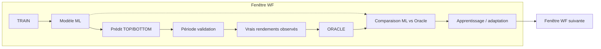
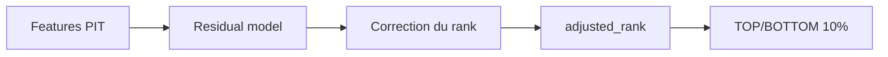
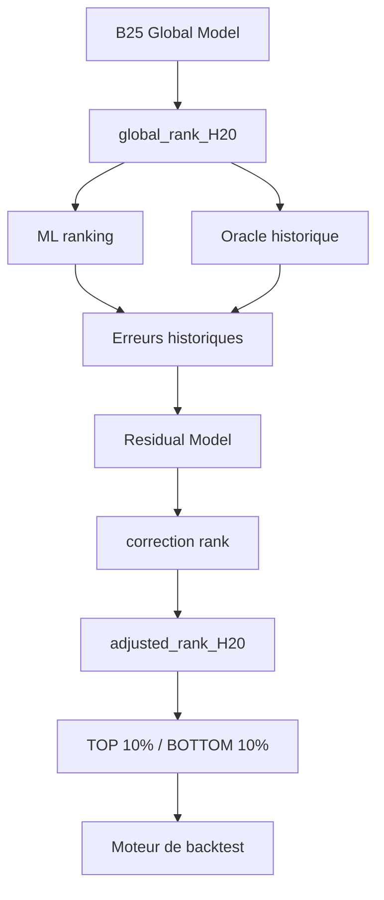
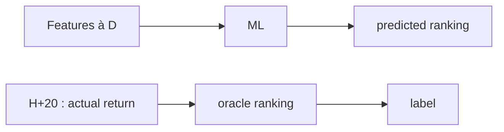
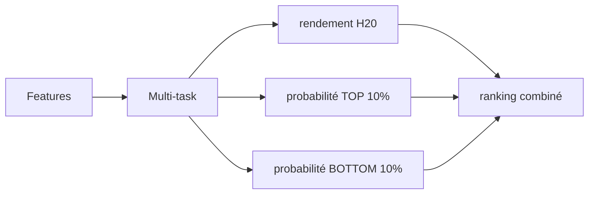
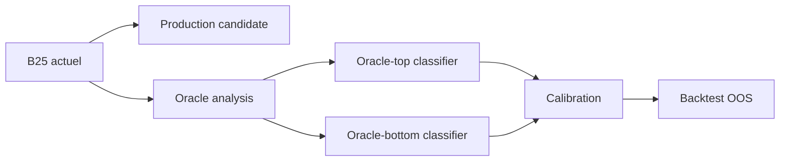

# ML + Oracle : mesurer l'écart et apprendre les patterns du TOP

> **Statut** : 💡 Proposition / expérimentation à étudier (2026-08-17)
> **Contexte** : analyse oracle du run `20260817_205031_2a2836d1`
> (LONG 16,7 % vs 10 % hasard · SHORT 8,2 % vs 10 % · déciles monotones · capture ≈ 12 %)
> **Principe directeur** : l'oracle est un **professeur historique** — jamais une
> information disponible au moment de la prédiction. **Zéro look-ahead.**

---

## 0. Le problème exact (formulation)

Le Global Model apprend à **prédire / ranker le rendement futur**, alors que la
**décision de trading réelle** est différente :

> **On veut surtout que les titres sélectionnés tombent dans le vrai TOP 10 %
> ou BOTTOM 10 %.**

État actuel sur H20 (univers ~399/jour) :

| Sélection | % dans le vrai TOP 10 % |
|---|---|
| Random | 10 % |
| **B25** | **~16,7 %** |
| Oracle | 100 % |

→ Le modèle a déjà un signal, mais il ne capture qu'une petite partie des vrais extrêmes.

> 🛡️ **Principe cardinal** : l'oracle est un **label / une cible d'apprentissage**,
> **jamais une feature**.
> ❌ `features + oracle_rank → modèle` (look-ahead)
> ✅ `features D → modèle → prédiction` puis, *après réalisation*,
> `rendement réalisé → oracle → label pour les périodes futures`

---

## 1. Pourquoi c'est faisable (et le piège à éviter)

L'idée : utiliser l'oracle **pendant le walk-forward** pour mesurer l'écart
ML ↔ oracle et adapter l'apprentissage — mais l'adaptation de la période suivante
n'utilise **que les informations déjà réalisées**.



> ⚠️ **NE PAS FAIRE** (leakage) :
> ```
> 2025 → je regarde l'oracle 2025 → je modifie le modèle → je reparcours 2025
> ```
> L'oracle d'une période ne peut influencer **que les périodes suivantes**.

---

## 2. L'objectif : apprendre le "gap" avec l'oracle

Actuellement le modèle apprend :
> « Quel titre aura le meilleur rendement futur ? »

On veut lui ajouter indirectement :
> « **Quelles caractéristiques permettent d'être dans le vrai TOP 10 %** plutôt que
> simplement d'avoir un bon score ? »

C'est beaucoup plus proche de l'objectif réel.

### Exemple d'analyse post-validation

```
                 ML TOP       ORACLE TOP
AAPL             ✓             ✓
MSFT             ✓             ✓
XYZ              ✓             ✗
ABC              ✓             ✗
```

Puis la question clé :

> **Qu'est-ce qui différencie les vrais gagnants que le modèle rate des gagnants qu'il trouve ?**

---

## 3. Trois niveaux d'implémentation

### 🟢 Niveau 1 — Oracle-aware loss (le plus simple, mais peu nouveau)

> **= Version A de la reformulation GPT.**

```python
loss = erreur_normale + λ × erreur_TOP + λ × erreur_BOTTOM
```

- ✅ Simple, conserve le Global Model actuel et son architecture.
- ❌ **Pas vraiment nouveau** : le target contient déjà le rendement futur → on
  réinvente un ranking pondéré.
- → **Ne pas commencer par là.**

### 🟢 Niveau 2 — Oracle Residual Model (à tester en premier)

```
global_rank_20 ─┐
oracle_rank_20 ─┴─> oracle_gap = oracle_rank − predicted_rank
```

| Titre | ML rank | Oracle rank | Gap |
|---|---|---|---|
| A | 0.92 | 0.97 | +0.05 |
| B | 0.88 | 0.42 | −0.46 |
| C | 0.73 | 0.91 | +0.18 |
| D | 0.65 | 0.08 | −0.57 |

Un **second modèle** apprend :
> « À partir des informations disponibles à D, pourquoi le modèle principal a-t-il
> sous-estimé / surestimé certains titres ? »



**En production** : `global_rank_B25 + correction_model → adjusted_rank → TOP/BOTTOM 10%`

- ✅ Le residual model est entraîné **uniquement sur les erreurs des périodes passées**
  → **pas de fuite**.

> ⭐ **Retour GPT + contre-analyse : c'est LA première expérience à faire.**
> Principe clé confirmé :
> **« L'Oracle ne va pas créer de l'information nouvelle. Il peut seulement aider le
> modèle à mieux exploiter l'information déjà contenue dans ses features. »**
> → On n'« apprend pas l'Oracle », on **apprend systématiquement les erreurs de ranking
> du Global Model par rapport à l'Oracle historique** :
> « Quand B25 donne un rank de 0.82, dans quelles configurations de features ce rank
> est-il historiquement trop bas ou trop haut ? »

**Architecture recommandée (endossée par GPT) :**



**Design d'expérience propre (comparaison strictement OOS, B25 intouchable) :**

| Métrique | B25 (baseline) | B25 + Oracle residual |
|---|---|---|
| Capture TOP 10 % H20 | 16.7 % | ? |
| Capture BOTTOM 10 % H20 | 8.2 % | ? |
| Monotonicité D1→D10 | ? | ? |
| IC Rank | 0.02 | ? |
| PF (OOS 2026) | 1.76 | ? |
| DD (OOS 2026) | 3.04 % | ? |
| Rendement (OOS 2026) | +14.37 % | ? |

**Aucune modification de B25 production tant que l'expérience n'a pas gagné sur un vrai OOS.**

### 🟢 Niveau 3 — Oracle Distillation (le plus puissant)

> **= Version B de la reformulation GPT (objectif secondaire Oracle / multi-task).**

Au lieu d'apprendre le rendement futur exact, on entraîne le modèle à reproduire le
comportement d'un **oracle historique** (utilisé uniquement pour créer les labels
après que la période est terminée).



**Multi-targets** :

```
oracle_top10    =  1
oracle_bottom10 = −1
oracle_middle   =  0
```

Modèles entraînés :
- `P(oracle_top10 | features)`
- `P(oracle_bottom10 | features)`

→ Cela ressemble beaucoup plus directement à **ce que le système veut réellement faire**.

### Combinaison en production (apprentissage multi-task)

Le Global Model apprend **simultanément** :

```
                    ┌── rendement futur
Features ───────────┼── Oracle TOP probability
                    └── Oracle BOTTOM probability
```

Puis produit un score composite :

```
global_score = rendement_score + poids × oracle_top_score − poids × oracle_bottom_score
```

> ⚠️ **Les poids doivent être appris / calibrés UNIQUEMENT dans le walk-forward**
> (sur les périodes passées), **jamais sur l'OOS final** — sinon fuite de sélection.

### 🟢 Évolution (complément GPT) — Trois objectifs en parallèle (A / B / C)

Plutôt que « Oracle vs ML → pénalité arbitraire », tester **trois designs d'objectif
en parallèle** (mêmes features, mêmes données PIT, mêmes fenêtres WF) :

| Design | Target | Nature |
|---|---|---|
| **A — B25 actuel** | `rendement H20` | régression continue (baseline) |
| **B — Oracle TOP/BOTTOM** | `TOP 10 % / MIDDLE / BOTTOM 10 %` | classification cross-sectionnelle directe : le modèle apprend la position future dans le cross-section |
| **C — Multi-task** | `rendement H20` + `P(TOP 10 %)` + `P(BOTTOM 10 %)` | objectifs partagés sur features communes |



- **C (multi-task)** est l'approche présente dans la littérature de stock ranking :
  on optimise conjointement le rendement et la position dans les extrêmes → le
  ranking combiné bénéficie des deux signaux.
- ⚠️ Ne pas confondre avec le **test offline A/B/C du §7** (qui, lui, compare
  B25 vs classification oracle vs calibration sur un même backtest).

---

## 4. Idée clé : séparer LONG et SHORT

L'analyse oracle montre une **asymétrie** :

| | Dans l'oracle | Hasard |
|---|---|---|
| LONG (top 10 %) | **16,7 %** | 10 % |
| SHORT (bottom 10 %) | **8,2 %** | 10 % |

→ Pourquoi entraîner symétriquement LONG et SHORT ? **Créer deux objectifs séparés** :

### Modèle LONG
```
target = 1  si  futur_return ∈ TOP 10%
```

### Modèle SHORT
```
target = 1  si  futur_return ∈ BOTTOM 10%
```

- **Pas forcément les mêmes features ni la même pondération.**
- Le résultat dit clairement : capacité de sélection **long > short**.
- → Ne pas chercher à « réparer » le short en forçant la symétrie.

---

## 5. Apprendre les patterns du TOP (classification oracle)

```
features PIT
├── momentum
├── volatility
├── volume
├── fundamentals
├── market regime
├── sector
├── relative strength
└── etc.
        ↓
  P(TOP 10% H20)
```

Le modèle apprend :
> **quelles configurations observables aujourd'hui ont historiquement conduit à une
> appartenance au TOP 10 %.**

→ Plus directement aligné avec l'objectif que : prédire un rendement continu puis
transformer en décile.

---

## 6. Protocole walk-forward anti-leakage

```
Train 2016–2021 → Validation 2022 → Oracle 2022 → adaptation
Train 2016–2022 → Validation 2023 → Oracle 2023 → adaptation
Train 2016–2023 → Validation 2024 → Oracle 2024 → adaptation
Train 2016–2024 → Validation 2025 → Oracle 2025
…
```

L'oracle d'une période n'influence **que les périodes suivantes**.

---

## 7. Test offline A / B / C avant de toucher B25

### Test A — modèle actuel (baseline)
```
B25 → global_rank_20 → TOP/BOTTOM 10%
```

### Test B — Oracle classification
Mêmes features, mêmes données PIT :
```
target_top10 = 1 si futur H20 ∈ TOP 10%, 0 sinon
```

### Test C — Oracle classification + calibration
```
P(TOP 10%)  /  P(BOTTOM 10%)
LONG  si P(top)    > seuil
SHORT si P(bottom) > seuil
```

Puis **backtest complet** avec : même H20 risk · même P14 · même m8 · mêmes coûts ·
marché · mêmes dates.

---

## 8. Métriques à mesurer (pas seulement le rendement)

### 1. Oracle capture (LONG)
```
Random   10 %
B25     16,7 %   ← aujourd'hui
Oracle  100 %
```
Objectif : faire passer **16,7 → 20 → 25 %**. Même **16,7 → 22 %** serait
extrêmement intéressant.

### 2. Bottom capture (SHORT)
```
Random   10 %
B25       8,2 %   ← aujourd'hui (sous le hasard)
```
Objectif : au minimum revenir à **10 %**, idéalement **15–20 %**.

### 3. Décile monotonicity ⭐ (le test le plus important)
Aujourd'hui (forme en U) :
```
D1 █████   D6 ████
D2 ███     D7 ████
D3 ███     D8 ████
D4 ███     D9 ████
D5 ███     D10 ██████
```
Cible :
```
D1 █       D6 ████
D2 ██      D7 ████
D3 ██      D8 █████
D4 ███     D9 █████
D5 ███     D10 ██████
```
> **Plus le score ML est élevé, plus le rendement futur moyen doit augmenter.**

### 4. ⚠️ Capture ≠ succès — le critère final est le trading réel

> ⚠️ Retour GPT : **ne pas fixer « 16,7 → 25 % » comme contrainte.** C'est un objectif
> de recherche intéressant, pas un critère de validation.

Le véritable critère :
> **« Est-ce que le nouveau ranking améliore significativement la qualité du classement
> ET améliore le trading réel ? »**

| Cas | Capture TOP | PF | Verdict |
|---|---|---|---|
| 1 | **22.0 %** (mieux) | **1.30** (pire) | 🔴 **régression** malgré une meilleure capture |
| 2 | **18.5 %** (mieux) | **2.05** (mieux) | 🟢 très intéressant |

→ La capture seule peut tromper. **Toujours vérifier capture ET PF/DD/rendement OOS.**

---

## 9. Choix recommandé pour AlphaTrade

- **Ne pas modifier B25** (baseline intouchable : +14,37 % OOS 2026 / PF 1,76).
- Créer une expérimentation **B25-Oracle en parallèle** :



- **Commencer par le LONG** : le signal TOP existe déjà (16,7 % vs 10 %) mais il est
  bruité → transformer le « détecteur imparfait de gros mouvements » en « détecteur
  plus précis des vrais TOP 10 % ».

---

## 10. Résumé des décisions

| # | Décision | Priorité |
|---|---|---|
| 1 | Ne pas modifier B25 | 🔒 |
| 2 | Tester le **Residual Model** (niveau 2) en premier | 🥇 |
| 3 | Explorer **Oracle Distillation** (niveau 3) | 🥈 |
| 4 | Séparer les objectifs LONG et SHORT | 🥉 |
| 5 | Commencer par le **LONG** | ✅ |
| 6 | Mesurer : oracle capture / bottom capture / **décile monotonicity** | 📏 |
| 7 | Protocole WF anti-leakage strict | ⚠️ |
| 8 | **Residual Model = 1ʳᵉ expérience** (avant LambdaRank / classification) | 🥇 |
| 9 | Critère final = **qualité du ranking ET trading réel (PF/DD)**, pas la capture brute | 🎯 |
| 10 | Commencer par un **Residual Model LONG-only** (le short n'est pas forcé) | ✅ |
| 11 | Nommer l'approche : **Oracle-Guided Residual Learning for Cross-Sectional Ranking** | 🏷️ |

---

## 11. Verdict final (retour GPT + contre-analyse)

**Oui, l'idée est gardée** — reformulée et resserrée :

> ### **Oracle-Guided Residual Learning for Cross-Sectional Ranking**
>
> **Oracle passé → détecte les erreurs systématiques du ranking → Residual Model apprend
> ces erreurs avec uniquement les features PIT → correction du ranking futur → validation OOS.**

Points de convergence (GPT + contre-analyse) :

1. **L'oracle ne crée pas d'information** : il ne fait qu'aider à mieux exploiter
   l'information déjà dans les features → plafond réel = IC des features, pas 100 %.
2. **Le Residual Model (Niveau 2) est la 1ʳᵉ expérience à faire**, avant de remplacer
   B25 par une LambdaRank ou une classification TOP/BOTTOM.
3. **Critère = qualité du classement ET trading réel (PF/DD/rendement OOS)**, pas la
   capture brute (ex. capture 22 % avec PF 1.30 = régression).
4. **LONG-only d'abord** (signal 16,7 % vs 10 % réel) ; ne pas forcer le short.
5. **B25 reste la baseline intouchable** ; comparaison strictement OOS.
6. Si le LONG fonctionne, se demander *pourquoi le même mécanisme ne marche pas pour
   le short* — plutôt que de supposer la symétrie.
