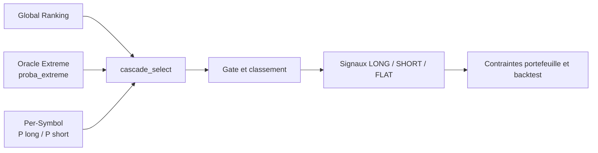
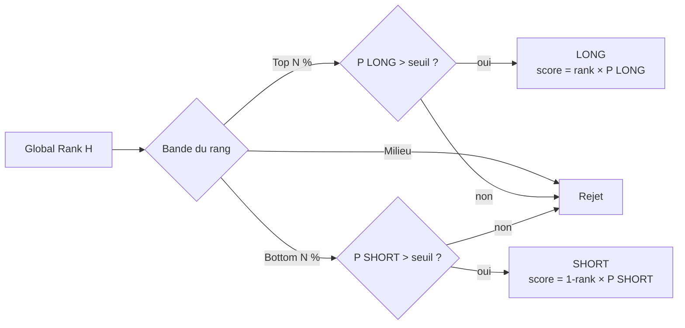
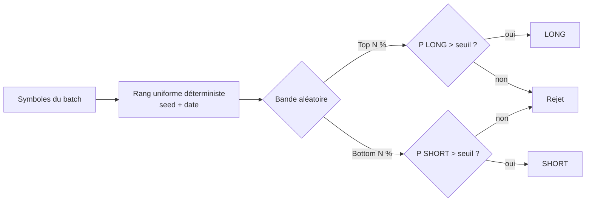
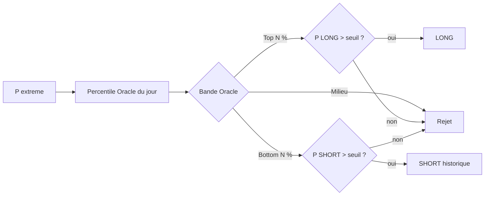
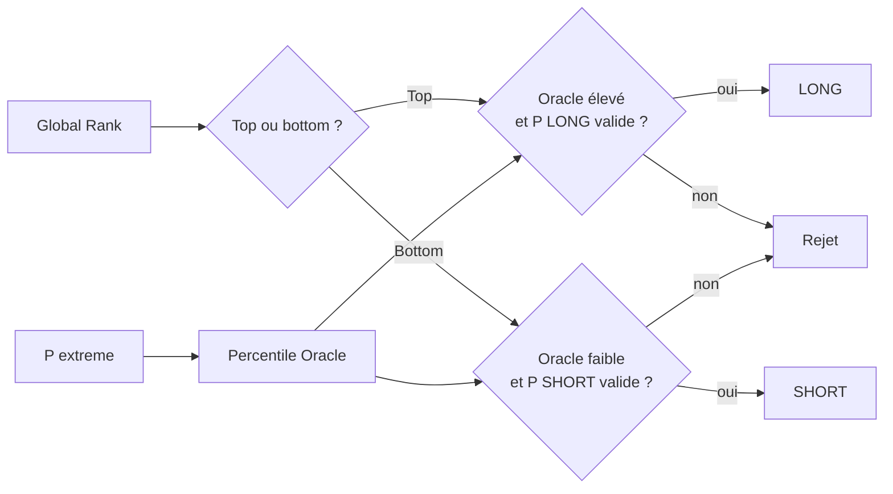
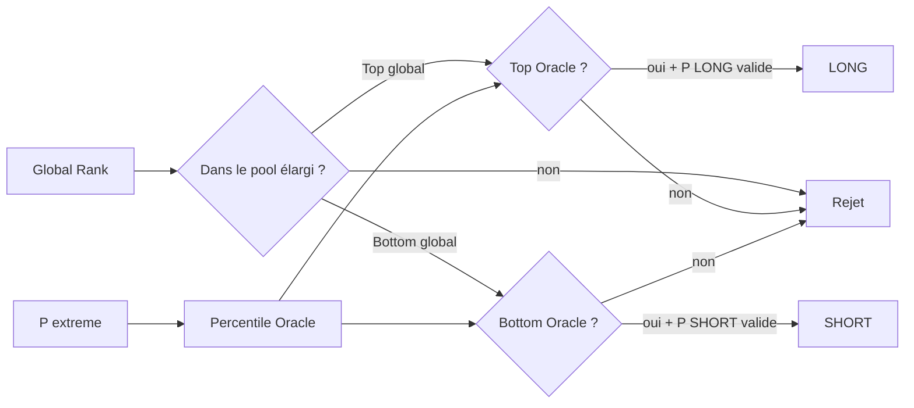
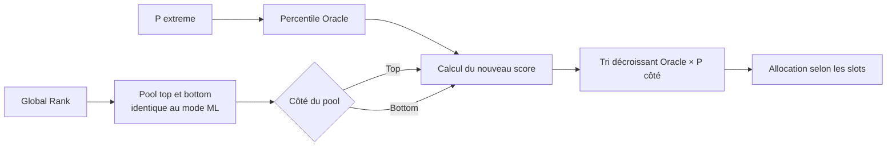
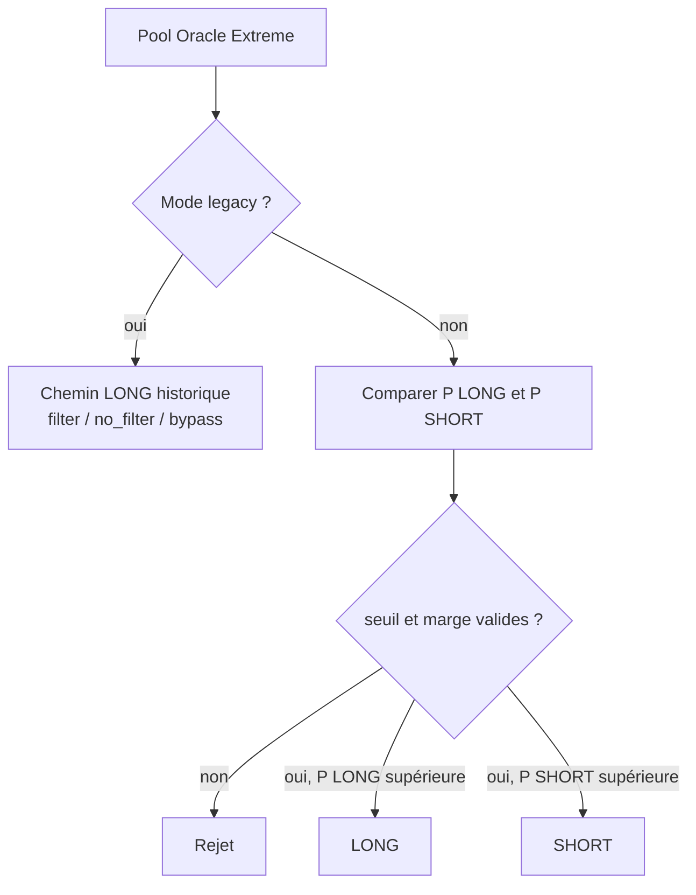
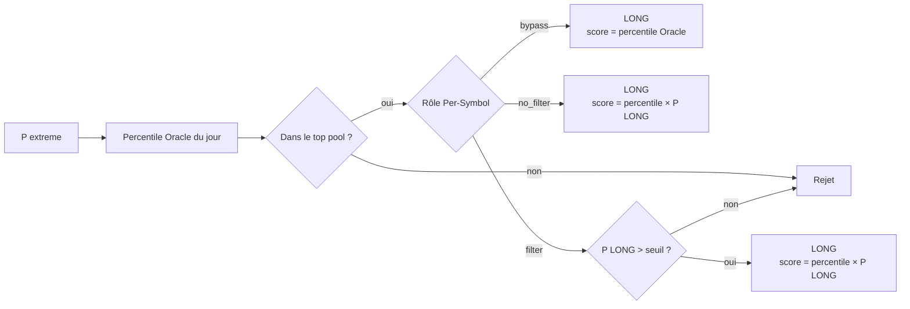
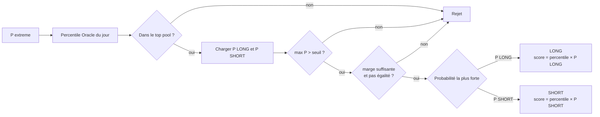

# Cascade de sélection et modes de ranking

Retour : [documentation recherche](research/README.md) · Voir aussi : [Oracle Extreme](ml/oracle/README.md)

> Statut au 31 août 2026 : les modes sont disponibles dans la CLI Backtest et dans la page
> Backtest de l’IHM. Cette documentation décrit le chemin de backtest. Elle ne signifie pas
> que les modes Oracle expérimentaux sont automatiquement promus dans le pipeline live.

## 1. Rôle de la cascade

La cascade transforme les prédictions ML disponibles pour une date en candidats ordonnés
`(side, symbol, score)`. L’implémentation de référence est
`modelFactory.predictor.cascade_select()` ; `apply_cascade_to_predictions()` applique ensuite
la sélection au DataFrame consommé par le backtest.

La cascade ne réalise pas l’entraînement. Elle combine, selon le mode choisi :

- les rangs de `global_rank_history` ;
- `proba_extreme` de `oracle_extreme_predictions` ;
- les probabilités directionnelles Per-Symbol de `model_predictions` ;
- les seuils de sélection, filtres DIP et contraintes de saturation.



## 2. Modes disponibles

| Mode CLI/IHM | Source du pool | Couche directionnelle | Usage principal |
|---|---|---|---|
| `ml` | Global Rank | Per-Symbol | cascade standard top/bottom |
| `random` | rang aléatoire déterministe | Per-Symbol | placebo et ablation |
| `oracle` | rang Oracle direct | Per-Symbol selon le flux courant | remplacement du rang global |
| `oracle_filter` | Global Rank | Per-Symbol | Oracle retire les candidats de qualité insuffisante |
| `oracle_pool` | pool Global Rank élargi | Per-Symbol | Oracle sélectionne dans le pool |
| `oracle_rerank` | pool Global Rank | Per-Symbol | Oracle change l’ordre sans changer le pool initial |
| `extreme_gate` | percentile Oracle quotidien | comportement historique LONG | legacy reproductible |
| `extreme_gate_directional` | percentile Oracle quotidien | comparaison Per-Symbol LONG/SHORT | amplitude Oracle + direction Per-Symbol |

Les noms ne sont pas interchangeables : changer le mode peut changer la population éligible,
le côté, le score et la couverture requise.

## 3. Mode standard `ml`

Le rang global du batch et de l’horizon effectif définit deux zones :

- zone haute : candidat LONG si `long_prob > min_prob` ;
- zone basse : candidat SHORT si `short_prob > min_prob` ;
- milieu : candidat rejeté.

Le score directionnel combine le rang et la probabilité du côté. Le filtre momentum SHORT,
les filtres DIP et les politiques de saturation peuvent encore modifier ou rejeter la liste.

## 4. Modes Oracle combinés

### `oracle`

Les probabilités Oracle remplacent la source de rang. Ce mode ne doit pas être interprété
comme une prédiction de direction : `proba_extreme` mesure l’amplitude extrême, pas la hausse.

### `oracle_filter`

Le Global Rank construit d’abord le pool top/bottom. Oracle agit ensuite comme filtre de
qualité. Le mode exige donc une couverture Global Rank et Oracle compatibles.

### `oracle_pool`

Le Global Rank construit un pool plus large, puis Oracle sélectionne la meilleure fraction
de ce pool. La population finale peut être différente de celle du mode `ml`.

### `oracle_rerank`

Le Global Rank conserve le pool initial et Oracle en modifie l’ordre. Cette variante sert à
isoler l’effet du classement Oracle à exposition initiale comparable.

## 5. `extreme_gate` legacy

Ce mode est conservé pour reproduire les recherches E6–E13 et les anciens backtests.
L’Oracle est la source exclusive du **pool** : le rang global n’est pas chargé. Pour chaque
date, le code convertit `proba_extreme` en percentile cross-sectionnel et conserve :

```text
oracle_percentile >= 1 - extreme_gate_pct
```

Avec `extreme_gate_pct=0.20`, les percentiles supérieurs ou égaux à `0.80` sont retenus.
Le chemin historique émet des LONG. Selon `--extreme-gate-per-symbol`, le Per-Symbol peut
encore jouer un rôle de veto ou de score ; l’expression « Oracle seul » dans l’IHM signifie
donc précisément « Oracle seul pour définir le pool, sans Global Ranking ».

Le flag historique `--extreme-gate-shorts` est conservé mais ne constitue pas une sélection
symétrique : le code teste le LONG avant le SHORT. Il ne faut pas l’utiliser comme équivalent
du nouveau mode directionnel.

## 6. `extreme_gate_directional`

Ce mode sépare explicitement les deux responsabilités :

1. Oracle détecte les titres susceptibles de produire un mouvement important ;
2. le modèle Per-Symbol détermine le côté le plus probable ;
3. la cascade filtre les directions faibles ou ambiguës ;
4. les candidats acceptés sont classés avec Oracle et la probabilité directionnelle.

Pour chaque symbole appartenant au pool Oracle :

```text
direction_probability = max(proba_long, proba_short)
direction_margin      = abs(proba_long - proba_short)

rejet si direction_probability <= cascade.min_prob
rejet si direction_margin < extreme_gate_direction_margin
rejet systématique si proba_long == proba_short

LONG  si proba_long  > proba_short
SHORT si proba_short > proba_long

score = oracle_percentile * direction_probability
```

La marge par défaut est `0.02`. Elle est modifiable dans la page Backtest et transmise par
`--extreme-gate-direction-margin`. Le seuil de probabilité reste celui de la cascade
(`min_prob`) : le nouveau paramètre de marge ne le remplace pas.

Un symbole sans prédiction Per-Symbol est rejeté. Contrairement au mode legacy Oracle-only,
la couverture ML directionnelle est donc obligatoire et le contrôle de couverture n’est pas
neutralisé.

### Exemple

| Symbole | Percentile Oracle | P(LONG) | P(SHORT) | Marge | Décision | Score |
|---|---:|---:|---:|---:|---|---:|
| A | 0,95 | 0,72 | 0,18 | 0,54 | LONG | 0,684 |
| B | 0,90 | 0,61 | 0,78 | 0,17 | SHORT | 0,702 |
| C | 0,88 | 0,61 | 0,60 | 0,01 | rejet si marge 0,02 | — |
| D | 0,40 | 0,90 | 0,05 | 0,85 | hors pool Oracle | — |

## 7. Utilisation dans l’IHM Backtest

La liste **Mode de cascade** expose deux options distinctes :

- `Extreme Gate : Oracle seul, LONG-only` → `extreme_gate` legacy ;
- `Extreme Gate directionnel : Oracle amplitude + Per-Symbol LONG/SHORT` →
  `extreme_gate_directional`.

Pour le mode directionnel, sélectionner :

- comme campagne ML, le batch contenant les prédictions Per-Symbol ;
- comme Batch Oracle Extreme, le batch contenant `proba_extreme` ;
- ou le même batch si celui-ci contient effectivement les deux familles de prédictions.

Les restrictions de côté sont appliquées après la sélection directionnelle :

| Long only | Short only | Résultat |
|---:|---:|---|
| décoché | décoché | LONG + SHORT, comportement par défaut |
| coché | décoché | les SHORT sont supprimés (`--no-shorts`) |
| décoché | coché | les LONG sont supprimés (`--no-longs`) |
| coché | coché | configuration refusée avant lancement |

L’auto-détection d’un batch Oracle-only continue volontairement de sélectionner
`extreme_gate` legacy. Elle ne choisit jamais automatiquement le mode directionnel, car ce
dernier exige une source Per-Symbol explicite.

## 8. Contrats de données et erreurs fréquentes

| Symptôme | Cause probable | Contrôle |
|---|---|---|
| aucun candidat | batch Oracle vide ou mauvaise période | vérifier `oracle_extreme_predictions` |
| pool Oracle présent mais aucun trade directionnel | prédictions Per-Symbol absentes | vérifier `model_predictions` du batch ML |
| uniquement des LONG | mode legacy ou case Long only active | vérifier le mode effectif et `--no-shorts` |
| uniquement des SHORT | case Short only active | vérifier `--no-longs` |
| très peu de candidats | seuil de probabilité ou marge trop élevés | publier le funnel des motifs de rejet |
| résultats différents avec le même modèle | population du percentile différente | figer univers, date et couverture Oracle |
| Oracle interprété comme direction | confusion amplitude/sens | utiliser le Per-Symbol pour le côté |

Le percentile Oracle dépend de la population disponible le jour considéré. Modifier
l’univers avant son calcul peut modifier le rang de tous les symboles.

## 9. Protocole de comparaison

Pour comparer correctement les modes, conserver strictement :

- mêmes dates, univers et données PIT ;
- mêmes batches Oracle et Per-Symbol ;
- mêmes coûts, lifecycle, positions maximales et règles de risque ;
- mêmes paramètres DIP et saturation ;
- mêmes restrictions LONG/SHORT.

Publier séparément couverture, candidats Oracle, rejets pour absence Per-Symbol, rejets par
seuil, rejets par marge, LONG retenus, SHORT retenus, trades exécutés et performance par côté.
Sans ce funnel, une amélioration peut provenir uniquement d’une baisse d’exposition.

## 10. Formules exactes des modes historiques

Cette section détaille les branches réellement exécutées. Les comparaisons de seuil du code
sont strictes (`>` ou `<`) sauf pour l’Extreme Gate, qui accepte la frontière supérieure
avec `>=`.

### 10.1 `ml`

```text
is_top    = global_rank_H > 1 - top_pct
is_bottom = global_rank_H < top_pct

LONG  si is_top    et proba_long  > min_prob
SHORT si is_bottom et proba_short > min_prob

score_LONG  = global_rank_H × proba_long
score_SHORT = (1-global_rank_H) × proba_short
```

Avec `cascade.top_pct=0.10`, le pool directionnel correspond au top 10 % et au bottom 10 %.
Pour le ternaire, `cascade.min_prob_classification=0.55`. Pour une prédiction régression,
le code utilise `cascade.min_prob_regression`, actuellement `0.10`.



### 10.2 `random`

Le DataFrame de rang reste celui du batch, mais la colonne de rang est remplacée par un
uniforme pseudo-aléatoire. La graine journalière est déterministe :

```text
daily_seed = cascade_rank_seed × 1 000 003 + YYYYMMDD
random_rank ~ Uniform(0,1)
```

Les probabilités Per-Symbol, seuils, filtres et règles aval restent identiques au mode `ml`.
Ce mode isole donc la contribution du ranking, pas celle de toute la chaîne ML.



### 10.3 `oracle`

Pour la date D, le code transforme toutes les valeurs `proba_extreme` en percentiles
cross-sectionnels. Ce percentile remplace entièrement `global_rank_H` :

```text
oracle_pct = rank_percentile_intra_date(proba_extreme)
is_top     = oracle_pct > 1-top_pct
is_bottom  = oracle_pct < top_pct
```

Le côté est ensuite confirmé par `proba_long` ou `proba_short`. Attention : traiter le bas
du classement `proba_extreme` comme branche SHORT est une politique historique du mode
`oracle`, pas une conséquence sémantique du label Oracle. Une faible `proba_extreme` signifie
« faible probabilité d’extrême », pas nécessairement « baisse ».



### 10.4 `oracle_filter`

Le Global Rank définit d’abord les bandes top et bottom. Oracle applique ensuite un filtre :

```text
LONG :
  global_rank > 1-top_pct
  oracle_pct >= oracle_filter_pct
  proba_long > min_prob

SHORT :
  global_rank < top_pct
  oracle_pct <= 1-oracle_filter_pct
  proba_short > min_prob
```

Le seuil CLI est `--cascade-oracle-filter-pct`, avec `0.80` par défaut. L’asymétrie apparente
est fidèle au code historique : percentile Oracle élevé pour LONG, faible pour SHORT.



### 10.5 `oracle_pool`

Le Global Rank ouvre un pool plus large, puis Oracle sélectionne à l’intérieur :

```text
LONG :
  global_rank > 1-oracle_pool_pct
  oracle_pct > 1-top_pct

SHORT :
  global_rank < oracle_pool_pct
  oracle_pct < top_pct
```

`--cascade-oracle-pool-pct` vaut `0.20` par défaut. Le score utilise ensuite `oracle_pct`
pour LONG et `1-oracle_pct` pour SHORT, multiplié par la probabilité Per-Symbol du côté.



### 10.6 `oracle_rerank`

Le pool top/bottom du Global Rank reste celui du mode `ml`, mais l’ordre est remplacé :

```text
score_LONG  = oracle_pct × proba_long
score_SHORT = (1-oracle_pct) × proba_short
```

Le mode garde donc le pool initial avant les autres filtres, mais il ne garantit pas un nombre
de trades exécutés identique : l’ordre interagit avec les slots, exclusions et contraintes.



### 10.7 Extreme Gate legacy et directionnel

Les deux modes commencent par le même pool :

```text
oracle_pct = rank_percentile_intra_date(proba_extreme)
in_pool    = oracle_pct >= 1-extreme_gate_pct
```

Ils divergent ensuite :



### Schéma complet `extreme_gate` legacy



### Schéma complet `extreme_gate_directional`



## 11. Rôle Per-Symbol dans `extreme_gate` legacy

Le paramètre `--extreme-gate-per-symbol` possède trois valeurs :

| Valeur | Veto | Score | Modèle Per-Symbol requis |
|---|---|---|---|
| `filter` | `long_prob > min_prob` | `oracle_pct × long_prob` | oui |
| `no_filter` | aucun veto de probabilité | `oracle_pct × long_prob` | oui |
| `bypass` | aucun | `oracle_pct` | non |

La valeur par défaut CLI est `filter`. Le libellé IHM « Oracle seul » signifie que l’Oracle
définit seul le pool ; il ne signifie pas nécessairement que toute information Per-Symbol est
ignorée. Pour un Oracle réellement pur, il faut la variante `bypass`.

Le flag `--extreme-gate-shorts` appartient au chemin expérimental historique E18. Il envoie
en SHORT uniquement les candidats qui n’ont pas déjà franchi le test LONG et dont
`short_prob > min_prob`. Il ne compare pas directement les deux probabilités. Le nouveau mode
`extreme_gate_directional` est la branche correcte pour une décision symétrique.

La section `extreme_gate` de `config.yaml` contient aussi une pénalité anti-D1 facultative :

- `penalty_enabled` active le mécanisme ;
- `penalty_min_directional` fixe le niveau sous lequel le score LONG est dégradé ;
- `penalty_score_floor` borne le multiplicateur minimal ;
- `penalty_reject_below` permet un rejet dur.

Cette pénalité concerne le signal LONG legacy. Le mode directionnel choisit directement le
côté et ne passe pas dans cette pénalité LONG.

## 12. Sources de données et choix des batches

### 12.1 Tables consommées

| Information | Stockage principal actuel | Identifiant de source |
|---|---|---|
| rang global par horizon | `global_rank_history` | batch cascade/ML |
| probabilités directionnelles | `model_predictions` | batch ML |
| probabilité de mouvement extrême | `oracle_extreme_predictions` | batch Oracle |

Le chemin parquet `--oracle-oos-path` existe encore comme compatibilité/recherche, mais la
page Backtest utilise principalement `--oracle-batch-id` et la table spécialisée. Il ne faut
donc plus décrire le parquet comme l’unique source Oracle.

### 12.2 Matrice des prérequis

| Mode | Global Rank | Oracle | Per-Symbol | Batch Oracle-only suffisant ? |
|---|---:|---:|---:|---:|
| `ml` | oui | non | oui | non |
| `random` | structure de rang du batch | non | oui | non |
| `oracle` | non | oui | oui dans le flux normal | généralement non |
| `oracle_filter` | oui | oui | oui | non |
| `oracle_pool` | oui | oui | oui | non |
| `oracle_rerank` | oui | oui | oui | non |
| `extreme_gate` `bypass` | non | oui | non | oui |
| `extreme_gate` `filter/no_filter` | non | oui | oui | seulement si les prédictions directionnelles existent aussi |
| `extreme_gate_directional` | non | oui | **oui, obligatoire** | non |

Pour le nouveau mode directionnel, la campagne ML choisie dans l’IHM doit contenir de vraies
prédictions Per-Symbol. Un batch Oracle-only peut fournir le pool Oracle, mais il ne peut pas
fournir à lui seul `proba_long` et `proba_short`.

### 12.3 Batch unique ou batches séparés

Deux organisations sont valides :

```text
Batch combiné :
  ml_batch_id = batch A
  oracle_batch_id = batch A

Batches séparés :
  ml_batch_id = batch Per-Symbol
  oracle_batch_id = batch Oracle
```

Dans les deux cas, il faut vérifier l’intersection réelle `(date, symbol)`. Une présence des
deux batches dans les listes IHM ne garantit pas leur compatibilité temporelle ou d’univers.

## 13. Couverture temporelle et discipline PIT

L’entraînement ne garantit pas automatiquement des prédictions sur toute la période du
backtest. Les points suivants doivent être contrôlés :

1. `global_rank_history` couvre chaque date nécessaire au mode Global Rank ;
2. `model_predictions` contient les symboles et dates Per-Symbol ;
3. `oracle_extreme_predictions` couvre la même fenêtre et le même univers utile ;
4. les champions sélectionnés pour D ont été entraînés avec des données disponibles avant D ;
5. aucun fallback vers un batch plus récent ne doit être interprété comme PIT-safe.

Les sorties Oracle walk-forward couvrent généralement les folds de test. Pour une autre
période, il faut produire l’inférence historique correspondante avec les champions appropriés.

Le percentile Oracle est recalculé quotidiennement sur la population effectivement chargée.
Ainsi, ces deux opérations ne sont pas équivalentes :

```text
calculer le percentile sur 2 000 symboles puis filtrer
filtrer à 400 symboles puis calculer le percentile
```

Le batch, l’univers, les dates, les NaN et l’ordre des filtres font partie du contrat de
reproductibilité.

## 14. Clarification « B25 » et horizon

Les commentaires historiques emploient « B25 » car ce batch a servi de référence aux
expériences S5/S6. Le code ne charge pas automatiquement un B25 immuable :

```text
load_global_ranks_from_db(trade_date, cascade_batch_id, ...)
```

Le rang provient donc du batch sélectionné ou du fallback configuré. L’horizon effectif est
résolu depuis l’override backtest, le meilleur horizon du batch ou les colonnes disponibles.
Pour comparer deux runs, publier `cascade_batch_id`, `ml_batch_id`, `oracle_batch_id` et
l’horizon effectivement utilisé, pas seulement le nom informel « B25 ».

## 15. Paramètres CLI et correspondance IHM

| Réglage | CLI | Défaut actuel |
|---|---|---:|
| mode | `--cascade-rank-mode` | `ml` |
| seuil top/bottom | `--cascade-top-pct` | IHM/config, généralement `0.10` |
| filtre Oracle | `--cascade-oracle-filter-pct` | `0.80` |
| pool Oracle élargi | `--cascade-oracle-pool-pct` | `0.20` |
| pool Extreme Gate | `--extreme-gate-pct` | `config.extreme_gate.pool_pct`, `0.20` |
| rôle Per-Symbol legacy | `--extreme-gate-per-symbol` | `filter` |
| shorts historiques E18 | `--extreme-gate-shorts` | désactivé |
| marge directionnelle | `--extreme-gate-direction-margin` | `0.02` |
| source Oracle table | `--oracle-batch-id` | batch ML si non précisé selon le flux |
| source Oracle parquet legacy | `--oracle-oos-path` | aucune |
| placebo | `--cascade-rank-seed` | `42` |

La page Backtest construit ces arguments via `BacktestRunOptions` et
`build_backtesting_command()`. L’utilisateur sélectionne les batches et le mode ; il n’a pas
à saisir manuellement les flags.

### Restrictions directionnelles IHM

Les cases ne changent pas la prédiction du modèle. Elles limitent les signaux autorisés en
aval :

```text
Long only  → --no-shorts → capacité SHORT = 0
Short only → --no-longs  → capacité LONG  = 0
```

Les deux cases simultanément sont rejetées avant construction de la commande.

## 16. Saturation, DIP et ordre final

Après création des candidats, la liste est triée par score décroissant. Lorsque
`--extreme-gate-dip-saturated` est activé, le DIP ne réduit pas le pool Extreme Gate : il
réordonne les candidats seulement lorsque leur nombre dépasse les slots disponibles.

La clé est lexicographique : bande de rang Oracle, indicateur N4X2, puis score. La largeur de
bande est pilotée par `--extreme-gate-dip-band`, défaut `0.02`. Ce mécanisme est un réglage de
recherche distinct de la direction Per-Symbol.

Un score supérieur ne garantit pas une exécution : les limites par côté, la capacité totale,
les exclusions de symboles, la liquidité, le risque, le régime et le lifecycle peuvent encore
rejeter le candidat.

## 17. Périmètre backtest et promotion live

La présence d’un mode dans `cascade_select()` et dans la page Backtest ne suffit pas à en
faire une politique live. Avant promotion :

1. valider OOS le mode et ses seuils ;
2. vérifier la disponibilité quotidienne des deux batches ;
3. reproduire la sélection dans le pipeline live avec les mêmes identifiants et fallbacks ;
4. vérifier le contrat LONG/SHORT jusque dans risk management et exécution ;
5. journaliser le mode effectif, la marge, les batches et le funnel de rejet ;
6. conserver un rollback vers le mode validé précédent.

## 18. Références code

- `modelFactory/predictor.py` : `cascade_select()` et `apply_cascade_to_predictions()` ;
- `modelFactory/oracle/extreme_gate.py` : percentile Oracle quotidien ;
- `backtesting/cli/_impl.py` : options CLI et chargement des sources ;
- `ihm/services/backtesting_runner.py` : traduction IHM vers CLI ;
- `ihm/pages/backtesting/__init__.py` : choix des modes et restrictions de côté ;
- `tests/test_cascade_ml.py` : contrats legacy et directionnels ;
- `tests/test_ihm_backtesting_runner.py` : commande IHM et exclusions LONG/SHORT.
