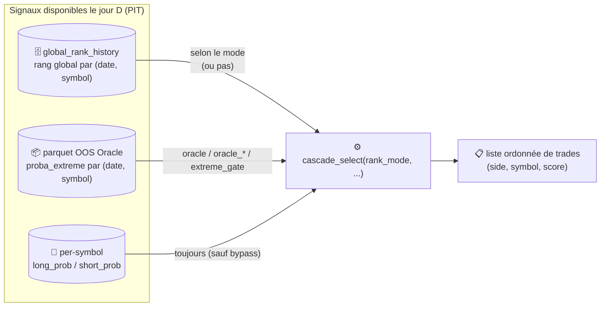
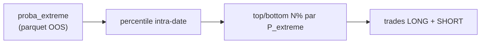
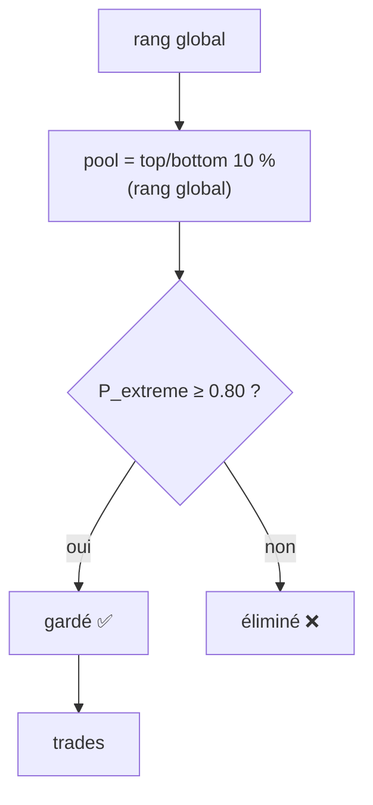
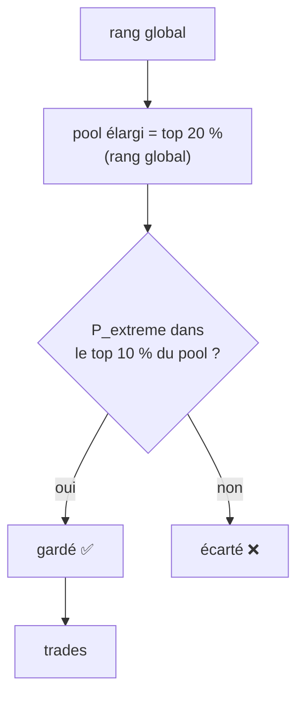
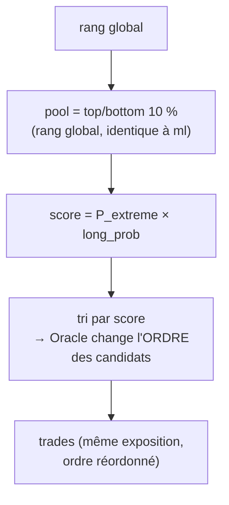
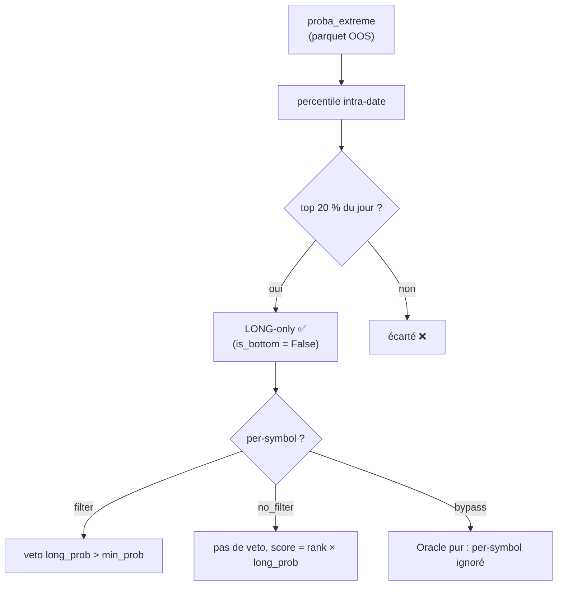
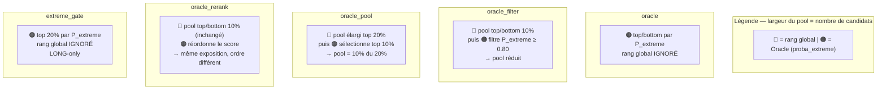
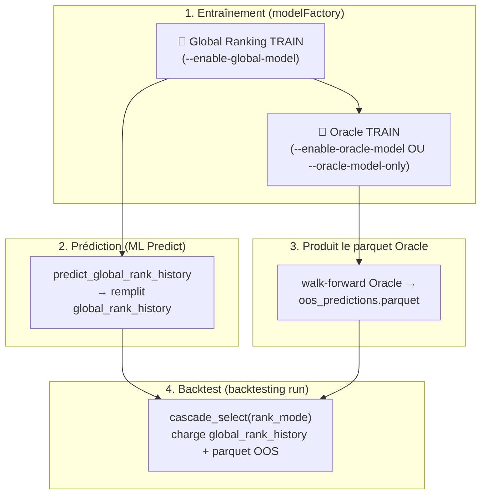
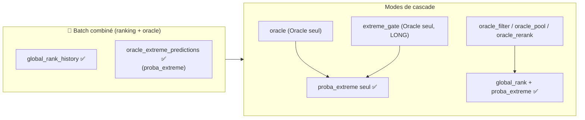

# Modes de cascade — combinaison Global Rank × Oracle Extreme

> Statut : implémenté (CLI `--cascade-rank-mode` + sélecteur dans la page backtesting IHM).
> Date : 2026-08-26.

> ⚠️ **IMPORTANT — PRODUCTION NON PRÊTE** : ces modes (sauf `ml`) ne sont **pas câblés au
> pipeline live**. Ils servent uniquement à la **recherche / au backtest**
> (`python -m backtesting run`). À **brancher dans le flux live**
> (`pipeline_runner.py` / étape risk) si et seulement si un mode est validé OOS
> puis promu en production.

Ce document décrit les **modes de cascade** : comment le **rang global** (Global Ranking,
`global_rank_{H}`) et la **proba_extreme** (Oracle Extreme, O0) sont combinés (ou pas)
pour sélectionner les candidats LONG/SHORT dans le backtest.

---

## 1. Rappel des deux modèles

| Modèle | Sortie | Sémantique |
|---|---|---|
| **Global Ranking** (B25 / batch) | `global_rank_{3,5,10,15,20}` | rang percentile cross-sectionnel **directionnel** (top = LONG, bottom = SHORT) |
| **Oracle Extreme** (O0) | `proba_extreme` | potentiel de **mouvement extrême** — ⚠️ **≠ P(LONG)**, pas directionnel |

⚠️ **Sémantique à ne jamais oublier** : `proba_extreme` n'est **pas** `P(LONG)`. C'est le
potentiel de **mouvement extrême** (top/bottom 10 % du rendement futur). L'edge LONG est
**empirique** (E8-E13) : le top 20 % de `proba_extreme` forme un univers porteur, sans
qu'Oracle prédise la direction.

---

## 1.1 Vue d'ensemble du pipeline de sélection

Chaque jour, le backtest alimente `cascade_select()` avec **deux familles de signaux**
(dont l'utilisation dépend du mode) :



Le **mode de cascade** détermine **qui définit le pool** (l'univers candidat) et **qui
réordonne/filtre** dans ce pool. Voir §3 pour la synthèse tabulaire.

---

## 2. Les 7 modes

### `ml` — rang global seul (défaut)
```python
is_top   = global_rank_{H} > 1 - top_pct      # top 10%
is_bottom = global_rank_{H} < top_pct          # bottom 10%
```
Cascade standard : top/bottom N% du rang global du **batch sélectionné**
(`--cascade-batch-id` → `global_rank_history`). Aucun Oracle.

### `oracle` — Oracle seul (S6)
```python
proba_extreme → percentile intra-date → top/bottom par P_extreme
```
`proba_extreme` **remplace** le rang global. Le rang global n'est **pas** chargé.



**Rôle** : Oracle joue **les deux côtés** (top = potentiel de mouvement haut, bottom =
potentiel de mouvement bas) comme s'il était le rang global.

---

### `oracle_filter` — Global Rank sélectionne, Oracle filtre (S6.1-B)
```python
is_top = global_rank > 1 - top_pct                  # pool : top 10% du rang global
if _oracle_pct < 0.80: continue                      # filtre : Oracle élimine la mauvaise qualité
```
**Sens** : le **rang global définit le pool** (top/bottom 10 %), puis **Oracle filtre la
qualité** (ne garder que `P_extreme` élevé, seuil `--cascade-oracle-filter-pct` défaut 0.80).



**Rôle** : le rang global choisit le pool, Oracle ne fait que **retirer** les titres de
mauvaise qualité extrême.

---

### `oracle_pool` — Pool global élargi, Oracle sélectionne (S6.1-C)
```python
_in_pool  = global_rank > 1 - 0.20                  # pool élargi : top 20% du rang global
is_top    = _in_pool and _oracle_pct > 1 - top_pct  # Oracle sélectionne le top 10% dedans
```
**Sens** : le **rang global élargit le pool** (top 20 %, `--cascade-oracle-pool-pct` défaut
0.20), puis **Oracle sélectionne le top 10 %** dedans.



**Rôle** : le rang global élargit l'univers, Oracle **sélectionne** le sous-ensemble
d'extrêmes porteurs dans ce pool.

---

### `oracle_rerank` — Pool global identique, Oracle réordonne (S6.1-D)
```python
is_top = global_rank > 1 - top_pct                  # pool : top 10% du rang global (inchangé)
score  = _oracle_pct * pred.long_prob               # Oracle réordonne le score
```
**Sens** : même **pool** que `ml` (même exposition), mais le **score final est réordonné** par
Oracle (`P_extreme × proba per-symbol`).



**Rôle** : l'exposition (le pool) reste **identique au mode `ml`** — seul l'**ordre
d'allocation** (qui est prioritaire dans le budget) change grâce à Oracle. Idéal pour isoler
l'effet « réordonnancement » pur.

---

### `extreme_gate` — Oracle seul, LONG-only (E6-E13)
```python
is_top   = percentile_intra_date(proba_extreme) >= 1 - pool_pct   # top 20% du jour
is_bottom = False   # LONG-only
```
**Sens** : **Oracle seul**, **indépendant du rang global** (le rang global n'est pas chargé).
Univers LONG = top 20 % du jour par `proba_extreme` (percentile intra-date, PIT). Pool par
`--extreme-gate-pct` (défaut 0.20). Rôle du per-symbol configurable via
`--extreme-gate-per-symbol` (`filter` | `no_filter` | `bypass`).



**Rôle** : le mode **extreme_gate** est **totalement indépendant du rang global** — il ne le
charge jamais. C'est le composant E6-E13 : un **gate d'univers LONG** sur le potentiel de
mouvement extrême.

### `random` — rangs aléatoires (placebo)
Rangs globaux remplacés par des valeurs aléatoires (seed reproductible par date).
Ablation placebo : isole l'edge du **ranking ML** (tout le reste — per-symbol, min_prob,
score — reste identique).

---

## 3. Tableau récapitulatif

| Mode | Pool (qui définit l'univers) | Rôle du second modèle | Rang global chargé ? | LONG/SHORT |
|---|---|---|---|---|
| `ml` | rang global | — | oui | les deux |
| `oracle` | Oracle (remplace) | — | non | les deux |
| `oracle_filter` | rang global (top/bottom 10%) | Oracle **filtre** la qualité | oui | les deux |
| `oracle_pool` | rang global élargi (top 20%) | Oracle **sélectionne** le top 10% | oui | les deux |
| `oracle_rerank` | rang global (top 10%) | Oracle **réordonne** | oui | les deux |
| `extreme_gate` | Oracle seul (top 20%) | — (per-symbol veto optionnel) | non | **LONG-only** |
| `random` | aléatoire | — | non | les deux |

### 3.1 Comparatif visuel des 5 modes Oracle (fonction du rang global)



| Mode | Qui définit le pool ? | Que fait Oracle dans le pool ? | Exposition vs `ml` |
|---|---|---|---|
| `oracle` | Oracle | remplace le rang | différente |
| `oracle_filter` | rang global | retire la mauvaise qualité | réduite |
| `oracle_pool` | rang global élargi | sélectionne le top | différente (20% → 10%) |
| `oracle_rerank` | rang global | réordonne | **identique** |
| `extreme_gate` | Oracle | — | différente |

---

## 4. Pourquoi « B25 » ? (clarification importante)

Le mot « B25 » apparaît dans `combine.py` et les docs (« combine `global_rank_20` (B25) et
`P(extreme10)` »). **Ce n'est PAS un batch figé en dur** :

- **La cascade utilise le batch sélectionné**, pas B25. Le rang global est chargé depuis
  `global_rank_history` du batch passé à `--cascade-batch-id` :

  ```python
  ranks_df = load_global_ranks_from_db(trade_date, batch_id, engine=engine)  # ← votre batch
  ```

- « B25 » est un **nom de référence historique** : au moment de la recherche S5, B25 était
  le seul ranking global validé en production, donc la recherche S5 a été évaluée contre
  B25. Si vous entraînez un **nouveau batch avec le Global Ranking**, la combinaison
  utilisera **le rang global de CE batch**, pas B25.

---

## 5. Prérequis pour combiner

Pour les modes `oracle_filter` / `oracle_pool` / `oracle_rerank`, il faut **deux sources
de prédictions disponibles aux dates du backtest** :

1. **Rang global** : `global_rank_history` du batch sélectionné (étape « 10. ML Predict →
   Prédire l'univers sélectionné »).
2. **`proba_extreme`** : parquet OOS Oracle (`--oracle-oos-path` →
   `artifacts/models/oracle/oracle-wf-<run>/oos_predictions.parquet`).

Pour la **cohérence**, utiliser un batch ayant entraîné **les deux modèles** (ablation O1 =
`include_global_rank=True`). Un batch O0 (Oracle-only, `oracle_model_only=True`) n'a pas de
`global_rank_history` → les modes de combinaison ne sélectionneront rien.

### 5.1 Flux complet : de l'entraînement au backtest



**Pourquoi la prédiction est indispensable** : l'entraînement du Global Ranking ne **remplit
jamais** `global_rank_history` — seule l'étape « ML Predict » le fait. Sans predict, les
modes de combinaison (`oracle_filter`/`oracle_pool`/`oracle_rerank`) ne trouvent aucun rang.

### 5.2 Choix du mode d'entraînement (lien avec `model_extreme_mode.md`)

Le critère décisif est : **quelles sources de prédiction le batch produit-il** ?

| Mode de cascade | Rang global requis ? | `proba_extreme` requis ? | Batch d'entraînement conseillé |
|---|---|---|---|
| `oracle` | non | oui | **standalone** (`--oracle-model-only`) **OU** combiné |
| `oracle_filter` | oui | oui | **non-standalone** (Global + Oracle) |
| `oracle_pool` | oui | oui | **non-standalone** (Global + Oracle) |
| `oracle_rerank` | oui | oui | **non-standalone** (Global + Oracle) |
| `extreme_gate` | non | oui | **standalone** (`--oracle-model-only`) **OU** combiné |

> ⚠️ Un batch `--oracle-model-only` (O0) ne produit **pas** de `global_rank_history` → il ne
> peut alimenter QUE `oracle` / `extreme_gate`. Pour `oracle_filter`/`oracle_pool`/
> `oracle_rerank`, il faut un batch **non-standalone** + le **predict** du Global Ranking.
> Détail complet : [`doc/model_extreme_mode.md`](model_extreme_mode.md) §9.

#### 5.2.1 Tableau complet : quel batch pour quel mode ?

Un batch **combiné** (Global Ranking + Oracle) est le **plus polyvalent** : il produit les
**deux** sources → il peut alimenter **tous** les modes Oracle.

| Batch disponible | `oracle` | `extreme_gate` | `oracle_filter` / `oracle_pool` / `oracle_rerank` |
|---|---|---|---|
| **Standalone** (`--oracle-model-only`, O0) | ✅ | ✅ | ❌ (pas de `global_rank_history`) |
| **Combiné** (Global + Oracle) | ✅ | ✅ | ✅ |
| **Global seul** (sans Oracle) | ❌ | ❌ | ❌ (pas de `proba_extreme`) |
| **Aucun** | ❌ | ❌ | ❌ |



**Pourquoi le batch combiné marche aussi pour `oracle` / `extreme_gate`** : ces modes ne
consomment que `proba_extreme` — le rang global est **ignoré** (pour `oracle`, `ranks_df`
est remplacé par `proba_extreme` ; pour `extreme_gate`, `load_global_ranks_from_db` n'est
jamais appelé). La présence d'un Global Ranking en plus dans le batch **ne gêne pas**.

#### 5.2.2 Nuance : la couverture des dates de `proba_extreme`

Ce n'est pas « quel batch » mais « **quelles dates** couvre `proba_extreme` » qui décide si
un backtest Oracle fonctionne :

- Les prédictions Oracle issues du **walk-forward** ne couvrent que les **folds de test**
  (fin de période d'entraînement).
- Pour backtester sur une période **différente** (ex. 2023→2024) avec un batch entraîné
  2016→2022, il faut le **predict standard Oracle** (`--predict-range 2023-01-01:2024-12-31`)
  avec les champions persistés — même exigence pour tous les modes Oracle.

---

## 6. Utilisation

### CLI
```bash
python -m backtesting run \
  --cascade-rank-mode oracle_pool \
  --oracle-oos-path artifacts/models/oracle/oracle-wf-<run>/oos_predictions.parquet \
  --cascade-oracle-pool-pct 0.20 \
  ...
```
Autres flags liés : `--cascade-oracle-filter-pct` (défaut 0.80),
`--extreme-gate-pct` (défaut 0.20), `--extreme-gate-per-symbol`
(`filter`|`no_filter`|`bypass`), `--extreme-gate-shorts`.

### IHM (page backtesting)
Sélecteur **« Mode de cascade »** + champ **« Chemin parquet OOS Oracle »** (affiché pour
les modes Oracle), avec un expandeur détaillant chaque mode.

---

## Références

- `modelFactory/predictor.py` — `cascade_select()` (implémentation des modes).
- `modelFactory/oracle/extreme_gate.py` — `extreme_gate`, `build_oracle_rank_map`.
- `modelFactory/oracle/combine.py` — combinaison/calibration S5 (fusion `weighted`/`mult`).
- `doc/synthese_e6_e13_2026-08-20.md` — justification du gate Extreme.
- `doc/oracle_extreme.md` — architecture et sémantique de l'Oracle Extreme.
- `doc/calibration_oracle_exterme.md` — calibration de `proba_extreme`.
- [`doc/model_extreme_mode.md`](model_extreme_mode.md) — les 2 modes d'entraînement de l'Oracle
  (standalone vs after-sequence) et **quel batch entraîner pour quel mode de cascade**.
