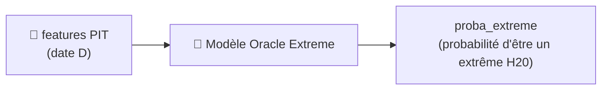
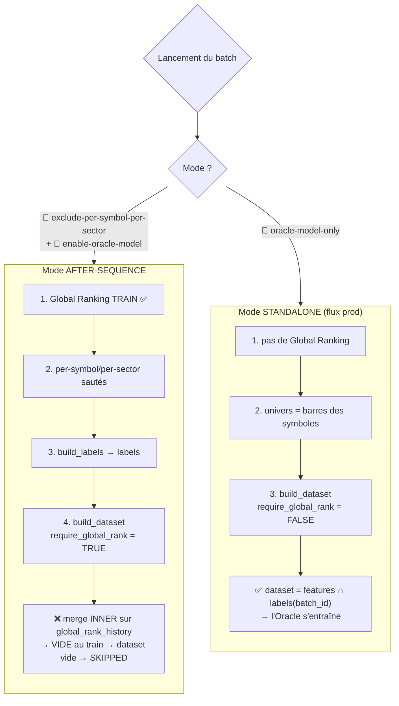
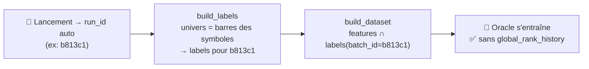
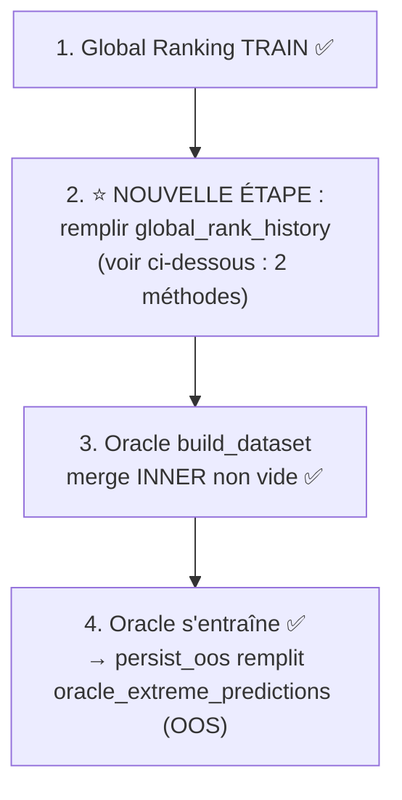
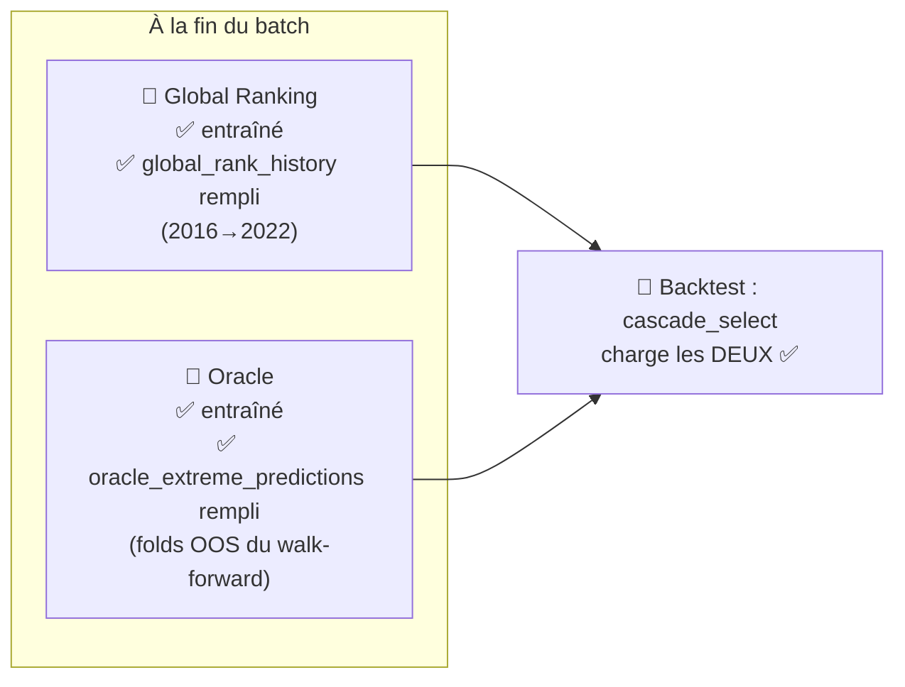
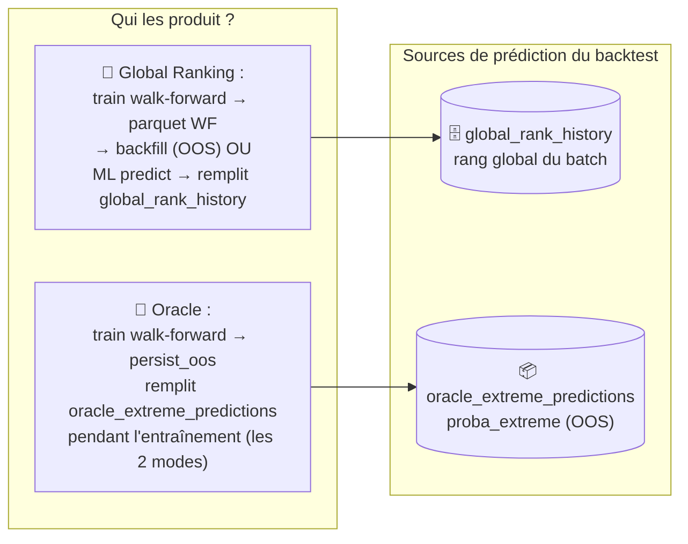
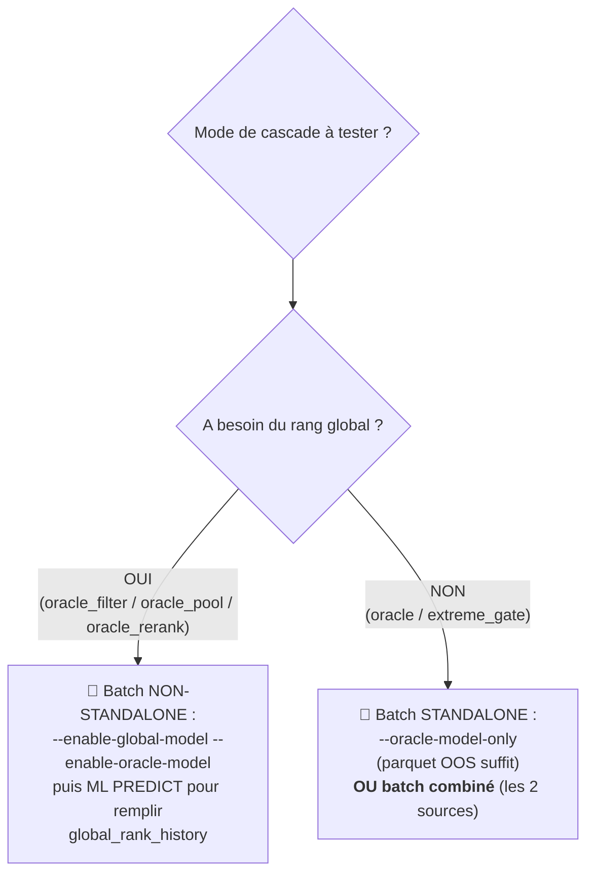
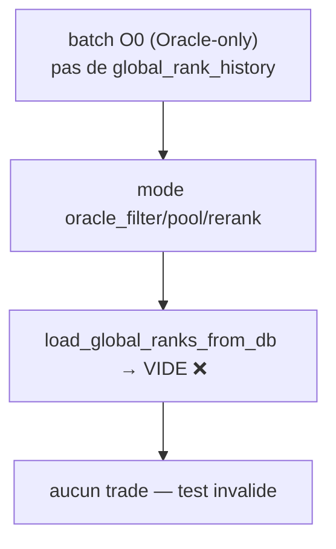

# Modèle Oracle Extreme — Modes d'entraînement & dépendance à `global_rank_history`

**Statut :** synthèse de référence (2026-08-28) — explique **pourquoi** l'Oracle Extreme
échoue (`empty dataset → skipped → compté failed`) en mode **after-sequence**, et comment
l'entraîner correctement en **standalone**.

**Fichiers source clés :**
- `modelFactory/orchestrator.py` — `train_oracle_extreme()` (ligne ~466), dispatch lignes 833 / 1253.
- `modelFactory/oracle/dataset.py` — `build_dataset()` (ligne ~135), `require_global_rank`.
- `modelFactory/oracle/build_labels.py` — univers des labels (rangs vs barres).
- `modelFactory/oracle/train.py` — `get_universe_symbols()`.
- `modelFactory/cli.py` — génération `run_id` (ligne ~858), flags `--enable-oracle-model` / `--oracle-model-only`.
- Spec fonctionnelle : `doc/ml_oracle.md` (§4 Univers Oracle), `doc/ml_oracle_sprint.md`.

---

## 1. Rappel : qu'est-ce que l'Oracle Extreme ?

L'Oracle Extreme est un **classifieur binaire** qui détecte les **mouvements extrêmes H20**
(gros mouvement sur 20 jours), indépendamment de la direction (TOP **ou** BOTTOM 10 %).



### 1.1 Le label : `oracle_extreme10`

Pour chaque **date D** et chaque **symbole** de l'univers du jour, `build_labels` calcule :

$$\text{future\_return} = \frac{\text{adj\_close}[D+20]}{\text{adj\_close}[D]} - 1$$

puis classe ce rendement **cross-sectionnellement** (parmi les titres du jour) :

| Colonne | Signification |
|---|---|
| `prediction_date` | date D |
| `symbol` | le titre |
| `batch_id` | le batch qui a généré le label |
| `horizon` | 20 |
| `future_return` | rendement brut D→D+20 |
| `oracle_pct_rank` | rang percentile intra-jour (0→1) |
| `oracle_decile` | décile (1→10) |
| `oracle_extreme10` | **LE LABEL** : `1` si TOP 10 % **ou** BOTTOM 10 %, sinon `0` |
| `oracle_available_date` | date de disponibilité (anti-leakage) |

**Règle** : jamais de seuil de rendement absolu — uniquement du **cross-sectionnel**
(TOP/BOTTOM 10 % parmi l'univers du jour).

**Exemple réel (batch `model-factory-20260828205258-b813c1`, date 2016-01-04) :**

| Symbole | fut_ret | pct_rank | décile | label |
|---|---|---|---|---|
| AA | −28.2 % | 0.066 | 1 | **1** (extrême bas) |
| ALKS | −55.8 % | 0.003 | 1 | **1** (extrême bas) |
| AAL | −9.5 % | 0.490 | 5 | 0 |
| AAP | −0.25 % | 0.826 | 9 | 0 |

**Distribution réelle du batch** : 46 048 labels `=1` (≈20 %) vs 183 855 labels `=0` (≈80 %)
— cohérent avec « TOP 10 % + BOTTOM 10 % = 20 % d'extrêmes ».

---

## 2. Les deux modes d'entraînement

L'Oracle peut être entraîné de deux façons, qui **changent fondamentalement son univers** :

| | **Mode AFTER-SEQUENCE** | **Mode STANDALONE** |
|---|---|---|
| Flag CLI | `--enable-oracle-model` (sans `--oracle-model-only`) | `--oracle-model-only` (+ `--enable-oracle-model` implicite) |
| `require_global_rank` | **`True`** | **`False`** |
| Rôle de l'Oracle | **2ᵉ couche au-dessus du Global Ranking** | **modèle indépendant, seul** |
| Univers Oracle | **celui du Global Ranking** (via `global_rank_history`) | les barres des symboles fournis (`stock_bars_daily`) |
| Dépend de `global_rank_history` ? | **OUI — impératif** | **NON** |



---

## 3. Pourquoi l'after-sequence a besoin de `global_rank_history`

### 3.1 La règle de la spec (§4 `doc/ml_oracle.md`)

> **Impératif : le même univers que le Global Model.**
> - L'Oracle **ne doit PAS** être calculé sur un univers différent.
> - `Global universe(D) = Oracle universe(D)`.
> - Le TOP 10 % = les 10 % meilleurs rendements futurs **parmi les titres que le Global
>   Model pouvait réellement sélectionner ce jour-là**.
> - ⛔ **Jamais** d'univers survivorship-biased ou d'un autre pool.

### 3.2 L'unique source de l'univers Global

`global_rank_history` est **la table qui enregistre, pour chaque `(date, symbol)`, le rang
global que le Global Ranking a attribué**. C'est donc **la seule trace** de « quel univers
le Global Ranking a évalué le jour D ».

En mode after-sequence, `build_dataset` fait :

```python
# modelFactory/oracle/dataset.py ~175
if require_global_rank:
    ranks = load_global_rank_feature(engine, batch_id)      # SELECT ... FROM global_rank_history
    df = feats.merge(ranks, on=["date", "symbol"], how="inner")  # INNER : restreint à l'univers Global
```

Le `merge INNER` **contraint l'Oracle à l'univers exact du Global Ranking**. C'est la
**garantie anti-biais / anti-survivorship** : l'Oracle ne peut pas « tricher » en évaluant
ses extrêmes sur un pool différent (plus favorable) que celui du Global Ranking.

**Conséquence** : si `global_rank_history` est **vide** pour ce `batch_id`, le `merge INNER`
produit un DataFrame vide → `oracle_extreme empty dataset — nothing to train` → `skipped`.

### 3.3 Le piège du flux de train

Le Global Ranking est **entraîné** pendant le train (il persiste `ic_rank`, `decile_spreads`),
mais `global_rank_history` n'est rempli que par le **predict** :

- `predict_global_rank_history()` (`modelFactory/predictor.py`)
- `synthesize_global_rank_predictions()`

Or, `global_ranking.py` **n'écrit jamais** dans `global_rank_history` pendant le train.
Au moment du train, cette table est donc **vide** pour le batch courant → l'Oracle
after-sequence est **toujours skippé** (et compté `failed`).

---

## 4. Pourquoi le standalone n'en a PAS besoin

En mode standalone, il **n'y a pas de Global Ranking du tout** : l'Oracle est lancé seul,
comme un modèle autonome. Il n'existe donc **aucun « univers Global » auquel s'aligner**
— la règle « Global universe = Oracle universe » n'a pas de sens ici.

Le code fait alors un choix **pragmatique** :

```python
# modelFactory/oracle/build_labels.py ~265 : standalone → l'univers vient des BARRES
if symbols and not rank_keys:
    rank_keys = load_universe_from_bars(engine, symbols, start_date, end_date)
```

```python
# modelFactory/oracle/dataset.py ~179 : standalone → pas de fusion, l'univers = features
else:
    df = feats.copy()
```

L'univers est défini par **les symboles fournis ayant une barre dans la fenêtre**
(`stock_bars_daily` — table non batchée, prix partagés).



---

## 5. Le batch_id : qui est-il, dans chaque mode ?

**Le `batch_id` est TOUJOURS le batch courant** — généré automatiquement au lancement,
jamais à choisir :

```python
# modelFactory/cli.py ~858
run_id = f"model-factory-{started_at.strftime('%Y%m%d%H%M%S')}-{uuid4().hex[:6]}"
```

Il est passé directement à l'Oracle :

```python
# modelFactory/orchestrator.py ligne 833 (oracle-only) / ligne 1253 (after-sequence)
train_oracle_extreme(cfg, engine, batch_id, symbols=_global_symbols)
```

`resolve_oracle_batch_id()` (config.yaml `oracle.batch_id` ou `batch_diagnostics.backtest_batch_id`)
ne sert **que** si `batch_id` est `None` — ce qui n'arrive jamais en mode train.

**Point important sur le standalone** : contrairement à une intuition, il **n'a pas besoin**
d'un `batch_id` ayant déjà entraîné/predict le Global Ranking. Il s'entraîne sur ses **propres**
labels (générés par `build_labels` pour le batch courant). Les barres (`stock_bars_daily`) ne
sont pas batchées, mais les **labels** (`global_oracle_labels`) le sont : le modèle n'apprend
que sur les extrêmes **de son propre batch**.

---

## 6. Diagnostic réel des batchs (2026-08-28)

### 6.1 Batch `model-factory-20260828202951-5d5418` — 1ᵉʳ échec

| Étape | Résultat |
|---|---|
| Walk-forward | ❌ `no_valid_wf_split` (fenêtre 2016→2018 trop courte pour 504/126/126/step252/3 splits) |
| Global Ranking | ❌ skippé → `ic_rank = None` |
| per-symbol/per-sector | ✅ sautés (checkbox `exclude-per-symbol-per-sector`) |
| Oracle | ❌ `empty dataset` (dépend du Global Ranking non prédit) |
| **Résumé** | `Completed: 0, Skipped: 0, Failed: 1` |

### 6.2 Batch `model-factory-20260828205258-b813c1` — 2ᵉ tentative (WF réduit)

| Étape | Résultat |
|---|---|
| Walk-forward | ✅ `--wf-min-train-size 252 --wf-val-size 63 --wf-test-size 63 --wf-step-size 63 --wf-max-splits 3` |
| Global Ranking | ✅ **réussi** — `ic_rank=0.0127`, spreads H3=0.0134 H5=0.0229 H10=0.0118 |
| per-symbol/per-sector | ✅ sautés (checkbox) |
| build_labels Oracle | ✅ 229 903 labels (46 048 extrêmes, 328 symboles, 754 dates, 2016-01-04 → 2018-12-31) |
| Oracle after-sequence | ❌ `empty dataset` — `global_rank_history` toujours vide au train |
| **Résumé** | `Completed: 0, Skipped: 0, Failed: 1` |

### 6.3 Leçon

Réduire le walk-forward a bien corrigé le **Global Ranking** (1ᵉʳ problème), mais **pas
l'Oracle** : celui-ci reste en mode after-sequence, qui exige `global_rank_history` — non
rempli au train. Les **deux problèmes étaient indépendants**.

---

## 7. Comment corriger (2 options)

### Option A — Lancer l'Oracle en standalone (flux production, recommandé, zéro code)

```powershell
python -m modelFactory --mode train --accelerator auto --target-mode regression `
  --feature-set expert --training-start-date 2016-01-01 --training-end-date 2018-12-31 `
  --symbol-source ticket-recherche --ml-mode rebuild-all --oracle-model-only `
  --enable-oracle-model --walkforward `
  --wf-min-train-size 252 --wf-val-size 63 --wf-test-size 63 --wf-step-size 63 --wf-max-splits 3
```

C'est le pattern utilisé par **tous les batchs Oracle de production qui ont réussi**
(`20260828020522-ce6d09`, `20260828130751-284b75`, `20260828092954-3f334d`, `20260826121835-f71859`).

### Option B — Prédire le Global Ranking du batch avant l'Oracle (correction de fond)

Ajouter une étape de prédiction du Global Ranking du batch courant (backtest historique sur
la période d'entraînement) **avant** le `build_dataset` de l'Oracle after-sequence, pour
remplir `global_rank_history`. Le merge INNER trouverait alors des données.



*Non implémenté à ce jour — nécessite une modification de `train_oracle_extreme()`.*

#### B.1 — Deux façons de remplir `global_rank_history`

⚠️ **Important (correction 2026-08-29)** : il y a **deux mécanismes** pour remplir
`global_rank_history`, et ils ne sont pas équivalents en termes d'OOS :

| Mécanisme | Contenu | OOS ? |
|---|---|---|
| **Backfill depuis le parquet WF** (`backfill_global_rank_history`) | prédictions **des folds de VALIDATION** du walk-forward, stockées dans `global_rank_cache.parquet` (produit par `train_global_ranking_wf`) | ✅ **OOS** — chaque rang est prédit par un modèle qui n'a pas vu cette date |
| **Predict re-prédit** (`predict_global_rank_history`, mode predict) | le modèle final appliqué à la période demandée (backfill `training_start→training_end`) | ⚠️ potentiellement **in-sample** si la période = période d'entraînement |

**Conclusion** : le Global Ranking produit **déjà ses prédictions OOS pendant l'entraînement**
(le walk-forward prédit sur les folds de validation). Le parquet `global_rank_cache.parquet`
puis `backfill_global_rank_history` sont le chemin **OOS** — à privilégier pour nourrir
l'Oracle. Le `predict_global_rank_history` re-prédit avec le modèle final sur toute la
période est plus simple mais in-sample si la période n'est pas disjointe du train.

#### B.2 — L'Oracle produit AUSSI ses prédictions pendant l'entraînement

⚠️ Point souvent mal compris : après l'ajout de l'étape de predict, **l'Oracle ne reste PAS
sans prédictions**. Pendant son propre entraînement, `run_walk_forward` puis `persist_oos`
(ligne 248 de `oracle/walk_forward.py`) **écrivent les prédictions OOS dans la table
`oracle_extreme_predictions`** (avec les champions par fold persistés).



**Nuance de couverture** : les prédictions Oracle issues du walk-forward ne couvrent que les
**folds de test** (dernières fenêtres). Pour couvrir **toute** la période (comme
`global_rank_history`), il faut le **predict standard Oracle** sans retrain (champions
persistés) : `python -m modelFactory.oracle.walk_forward --batch-id <id> --predict-range 2016-01-01:2022-12-31`.

---

## 8. Résumé en une phrase

> **Le mode after-sequence aligne l'Oracle sur l'univers du Global Ranking (garantie
> anti-biais) → il faut `global_rank_history` pour savoir quel est cet univers. Le mode
> standalone n'a pas de Global Ranking → pas d'univers à aligner → il s'entraîne sur les
> barres disponibles.**

| Mode | `require_global_rank` | Univers Oracle | Dépend de `global_rank_history` ? |
|---|---|---|---|
| **After-sequence** (`--enable-oracle-model`) | `True` | `global_rank_history` (merge INNER) | **OUI** |
| **Standalone** (`--oracle-model-only`) | `False` | barres `stock_bars_daily` | **NON** |

---

## 9. Lien avec les modes de cascade (`mode_cascade.md`)

Le mode d'entraînement choisi détermine **quelles sources de prédiction** sont disponibles
au moment du **backtest** (page backtesting / `python -m backtesting run`). C'est le critère
qui te dit **quel batch entraîner pour quel mode de cascade**.

### 9.1 Les deux sources de prédiction consommées par le backtest



### 9.2 Quel mode d'entraînement pour quel mode de cascade ?

| Mode de cascade | A besoin du rang global ? | A besoin de `proba_extreme` ? | Batch d'entraînement requis |
|---|---|---|---|
| `ml` | ✅ | ❌ | Global Ranking seul (predict fait) |
| `oracle` | ❌ | ✅ | **Standalone** (`--oracle-model-only`) **OU** combiné |
| `oracle_filter` | ✅ | ✅ | **Non-standalone** (Global Ranking + Oracle) |
| `oracle_pool` | ✅ | ✅ | **Non-standalone** (Global Ranking + Oracle) |
| `oracle_rerank` | ✅ | ✅ | **Non-standalone** (Global Ranking + Oracle) |
| `extreme_gate` | ❌ | ✅ | **Standalone** (`--oracle-model-only`) **OU** combiné |
| `random` | ❌ (aléatoire) | ❌ | aucun |



### 9.2.1 Le batch combiné est le plus polyvalent

Un batch **combiné** (Global Ranking + Oracle) produit les **deux** sources → il alimente
**tous** les modes Oracle :

| Batch disponible | `oracle` | `extreme_gate` | `oracle_filter` / `oracle_pool` / `oracle_rerank` |
|---|---|---|---|
| **Standalone** (`--oracle-model-only`, O0) | ✅ | ✅ | ❌ (pas de `global_rank_history`) |
| **Combiné** (Global + Oracle) | ✅ | ✅ | ✅ |
| **Global seul** (sans Oracle) | ❌ | ❌ | ❌ (pas de `proba_extreme`) |

**Pourquoi** : `oracle` et `extreme_gate` ne consomment que `proba_extreme` — le rang global
est ignoré (`oracle` remplace `ranks_df` par `proba_extreme` ; `extreme_gate` n'appelle
jamais `load_global_ranks_from_db`). La présence du Global Ranking dans le batch ne gêne pas.

### 9.3 Piège à éviter (recoupe §5 de `mode_cascade.md`)

Un batch **O0 Oracle-only** (`--oracle-model-only`) n'a **pas de `global_rank_history`** :
si tu l'utilises pour `oracle_filter` / `oracle_pool` / `oracle_rerank`, la cascade
`load_global_ranks_from_db(...)` retourne **vide** → **aucun candidat sélectionné**.



**Bonne pratique** :
- Pour les 3 modes de combinaison (`oracle_filter`/`oracle_pool`/`oracle_rerank`) → **batch
  non-standalone** ayant entraîné les deux modèles + predict du Global Ranking.
- Pour `oracle` / `extreme_gate` → un batch **standalone** suffit, **mais** un batch
  **combiné** fonctionne aussi (et permet de réutiliser la même source `proba_extreme` pour
  les 5 modes dans une même campagne de tests).
- Nuance couverture : pour backtester sur une période hors de l'entraînement (ex. 2023→2024),
  il faut le **predict standard Oracle** (`--predict-range`) avec les champions persistés.

---

## 📚 Documents liés

- [`doc/ml_oracle.md`](ml_oracle.md) — spec fonctionnelle Oracle (labels, univers, §4).
- [`doc/ml_oracle_sprint.md`](ml_oracle_sprint.md) — sprint de construction Oracle.
- [`doc/oracle_extreme.md`](oracle_extreme.md) — l'Oracle Extreme comme gate d'univers LONG.
- [`doc/mode_cascade.md`](mode_cascade.md) — les 7 modes de cascade (Global Rank × Oracle).
- [`doc/calibration_oracle_exterme.md`](calibration_oracle_exterme.md) — calibration de `proba_extreme`.
