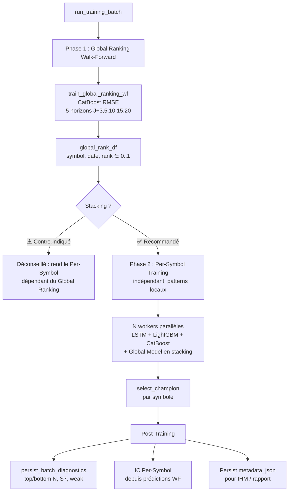

# Module ModelFactory — Documentation Complète

> **Version** : Sprint 2026-08-01 (à jour des tests A/B)  
> **Auteur** : Généré automatiquement depuis le code source

---

## Table des matières

1. [Vue d'ensemble](#1-vue-densemble)
2. [Architecture globale](#2-architecture-globale)
3. [Phase 1 — Global Ranking Model](#3-phase-1--global-ranking-model)
4. [Phase 2 — Per-Symbol Training](#4-phase-2--per-symbol-training)
5. [Sélection du Champion](#5-sélection-du-champion)
6. [Diagnostics Batch & Garde-fous](#6-diagnostics-batch--garde-fous)
7. [Prédiction & Inférence](#7-prédiction--inférence)
8. [IC Per-Symbol](#8-ic-per-symbol)
9. [Configuration](#9-configuration)
10. [Tables DB](#10-tables-db)
11. [Résultats & Benchmark](#11-résultats--benchmark)

---

## 1. Vue d'ensemble

Le module `modelFactory` est le cœur ML du système α-Trade. Il assure :

1. **Classement cross-sectionnel** : un modèle Global Ranking (CatBoost RMSE) qui ordonne tous les symboles de l'univers par rendement futur attendu sur 5 horizons → `global_rank ∈ [0, 1]`
2. **Prédiction directionnelle par symbole** : des modèles per-symbol (LSTM, LightGBM, CatBoost) qui prédisent `proba_long` / `proba_short` pour chaque symbole individuellement
3. **Garde-fous qualité** : filtrage automatique des symboles dont les modèles sont trop faibles (F1 bas, zéro short, etc.)
4. **Sélection automatique du meilleur modèle** par symbole (champion selection)

### Flux simplifié

```
Entraînement :
  Global Ranking (1 modèle, tous symboles) → global_rank_3/5/10/15/20
  Per-Symbol (~500 modèles, 1 par symbole)   → proba_long, proba_short
  Diagnostics batch                           → top/bottom N, weak, S7

Inférence (Live/Backtest) :
  global_rank × proba_long → cascade_select → trades filtrés
```

---

## 2. Architecture globale



### Ordre des sections dans le rapport

| Ordre | Section | Contenu |
|-------|---------|---------|
| 1 | 📋 Détail du batch | Métadonnées, IC Rank Global, Stacking |
| 2 | 🏆 Sélection du champion | auto / fallback par modèle |
| 3 | 🔬 IC Per-Symbol | Tableau H3/H5/H10/H15/H20 |
| 4 | 🌐 Global Ranking — Détails | IC, Decile Spread, FI, splits par horizon |
| 5 | 📊 Métriques F1 par split | F1 macro/short/flat/long par modèle × split |
| 6 | 📊 Distribution true/pred | % short/flat/long prédit vs réel |
| 7 | 📈 Distribution F1 macro WF | Histogramme par bucket |
| 8 | 📅 Diagnostic par régime | F1 × régime de marché (bear/bull/range) |
| 9 | 🏆 Top 10 / Flop 10 | Meilleurs/pires symboles par F1 macro WF |
| 10 | ⚪ f1_short = 0 | Symboles sans signal short |

---

## 3. Phase 1 — Global Ranking Model

### 3.1 Objectif

Produire un **score de ranking cross-sectionnel** par symbole et par date, sur 5 horizons.

**Modèle** : CatBoost `RMSE` (principal, meilleur qu'LightGBM LambdaRank sur cet usage)  
**Objectif** : régression sur le rang continu [0, 1]  
**Métrique** : **IC Rank** (Spearman), pas de F1  
**Sortie** : `global_rank_h ∈ [0, 1]` — percentile dans l'univers  
**IC actuel** : 0.0208 (+84% vs baseline 0.0113), tous les IC IR > 1.0

### 3.2 Construction de la target

Pour chaque horizon $h \in \{3, 5, 10, 15, 20\}$ :

```
1. Rendement forward brut  : future_return_h = close[t+h] / close[t] - 1
2. Vol scaling (h ≥ 5)     : future_return_h /= rolling_volatility_20
   (H3 : pas de scaling, vol 20j décorrélée du rendement 3j)
3. Winsorization            : clip 1%/99% intra-date
4. Percentile rank          : rank(pct=True) → [0, 1]
5. Décile discret           : label_h = floor(rank × 10).clip(0, 9)
6. Target smoothing (h ≥ 10): blend 50% horizon + 50% avg(10,15,20) → re-rank
   (H3/H5 exclus du smoothing : trop bruités, pas de vol scaling pour H3)
7. Sector-neutral (tous)    : soustraire médiane sectorielle → re-rank → re-label
8. Factor-neutral (tous)    : OLS résiduel sur size+value+momentum → re-rank → re-label
```

> **Excès vs SPY** : Structurellement inutile (rank intra-date invariant).  
> **Vol scaling** : Testé OFF → IC -27%, conservé ON pour H5+.  
> **Smoothing** : +44% IC, uniquement sur H10/H15/H20.  
> **Sector-neutral** : +84% IC — le levier le plus puissant.  
> **H3/H5 réactivés** : IC 0.013/0.018, IC IR > 1.0. H5 pour trading 5j.

### 3.3 Walk-Forward

- **Fenêtre glissante** : 756 jours de train (max), 126j val, 126j test
- **Purge** : $\min(\text{horizons}) / 2 = 1$ jour entre train et val
- **Splits** : 13 (optimal ; 8 splits dégrade l'IC)
- **Poids temporels** : `exp(-days_diff / 360)` — demi-vie ~12 mois

> **504j** trop court, **1008j** diminishing returns. **756j** = sweet spot.

### 3.4 Features

| Catégorie | Nb | Description |
|-----------|----|-------------|
| Base (OHLCV) | ~13 | daily_return, log_return, intraday_range, etc. |
| Expert | ~18 | SMA distances, momentum, relative strength, régime |
| Multi-horizons | ~17 | H3-H250 momentum, volatilité, RSI |
| Interactions | ~16 | momentum/vol, RSI/vol, SMA cross |
| Dynamique temporelle | ~6 | accel, decay, RSI slope, vol expansion |
| Z-scores | ~26 | Normalisation temporelle sur 5 ans |
| Régime × technique | ~18 | momentum × bull/bear, vol × bull/bear |
| Cross-sectional | 8 | Rangs percentiles intra-date |
| Sector features | 8 | Agrégats sectoriels |
| Sector-neutral | 13 | Techniques + fondamentales neutralisées |
| Fondamentales | ~23 | PE, ROE, marges, croissance (EODHD) |
| Facteurs CAPM | 4 | Beta, alpha, R² |

**Total** : ~177 features (160 pour H3, sans fondamentaux).

**Features blacklistées** (identiques ∀ symboles → pas de pouvoir discriminant) :
- Macro globales : VIX/VXN/VIX3M/MOVE
- Secteur agrégé : `sector_ret_*`, `sector_vol_*`, `sector_dollar_volume_*`
- Liquidité : `dollar_volume_20_rank`
- CAPM : `beta_252`, `alpha_252`, `r_squared_252`
- Volatilité 120j et `*_sector_neutral` de volatilité
- Fondamentales brutes (versions `_sector_neutral` conservées)
- Estimations analystes indisponibles
- Poids morts Mid Caps : `log_return`, `daily_return` bruts, `close_to_vwap`, `volume_zscore_5d`, `accel_3_5`

> **Note 2026-08-01** : `regime_risk_off` et `regime_bull_market` sont **dé-blacklistés** — les arbres (CatBoost) peuvent apprendre des splits conditionnels au régime.

### 3.5 Modèle

| Paramètre | Valeur | Note |
|-----------|--------|------|
| Algorithme | **CatBoost RMSE** | Meilleur que LightGBM LambdaRank (+60%) |
| `ranking_max_depth` | 7 | Indépendant du per-symbol (5) |
| `ranking_num_leaves` | 31 | Cohérent avec depth=7 |
| `n_estimators` | 500 | |
| `learning_rate` | 0.03 | |
| `loss_function` | RMSE | Régression sur rang continu |

> **LightGBM LambdaRank** testé : IC 0.0130 vs CatBoost 0.0208. LambdaRank ignore `regime_*` (importance 0.0), perd 20% des données (early stopping), et la MSE tolère mieux l'incertitude du classement.

### 3.6 Feature Importance

Calculée via `gain` (LightGBM) ou `feature_importance` (CatBoost). Moyennée sur tous les splits WF. Les fondamentales dominent le top 10 (PE, ROE, debt_to_equity, PS ratio), suivies des features de momentum long-terme (momentum_250, SMA distances).

### 3.7 Limitation du nombre de symboles

Paramètre `--global-ranking-max-symbols` (défaut: 300, IHM: 0 = tous).  
Si > 0 : garde les **top N par volume moyen** ou stratifié par déciles.

---

## 4. Phase 2 — Per-Symbol Training

### 4.1 Objectif

Pour **chaque symbole** de l'univers, entraîner un modèle qui prédit la direction (long/short/flat).

**Modèles** : LSTM Attention, LightGBM, CatBoost (3 challengers par symbole)  
**Target** : `future_return` (binaire ou ternaire selon config)  
**Métrique** : **F1 macro** (moyenne de F1 short, F1 flat, F1 long)

### 4.2 Mode ternaire (3 classes)

```
proba_short + proba_flat + proba_long = 1.0

Décision :
  if proba_long > threshold_long  → LONG
  if proba_short > threshold_short → SHORT
  else → FLAT
```

Seuils : `ternary_threshold_short` (0.35), `ternary_threshold_long` (0.35), `top2_margin` (0.02).

### 4.3 Walk-Forward

Mêmes splits que le Global Ranking. Chaque split produit des métriques sur train/val/test, agrégées en fin de boucle.

### 4.4 Stacking (injection des rangs globaux) ⚠️ Contre-indiqué

Quand `global_model.stacking_enabled = True` :

```
Avant entraînement per-symbol :
  cross_sectional_cache ← merge(global_rank_df[["symbol", "date", "global_rank_10", "_15", "_20"]])
  NaN → 0.5 (rang neutre)

Le modèle per-symbol voit donc les rangs cross-sectionnels comme features supplémentaires.
```

> **⚠️ Le stacking est une mauvaise idée pour le Per-Symbol.**
>
> Si tu donnes le `global_rank` de la Phase 1 comme feature à la Phase 2, tes modèles
> Per-Symbol (LSTM, LightGBM, CatBoost) vont devenir **dépendants du marché global**.
> Ils vont perdre leur capacité à détecter les figures de retournement propres au symbole
> et ne feront que « recopier » la tendance générale identifiée par la Phase 1.
>
> **Conséquence** : le Per-Symbol devient un simple amplificateur du Global Ranking,
> perdant toute sa valeur ajoutée (détection de patterns locaux, divergences,
> retournements idiosyncratiques). Les deux phases doivent rester complémentaires,
> pas redondantes.
>
> **Recommandation** : laisser `stacking_enabled = false`. Le Global Ranking
> et le Per-Symbol jouent des rôles distincts dans la cascade de trading (§7.2).

### 4.5 Limitation per-symbol (test rapide)

Paramètre `--per-symbol-max-symbols` (défaut: 0 = tous).  
Si > 0 : garde les **top N par volume moyen**, avant l'entraînement per-symbol.  
Le Global Ranking n'est PAS affecté.

---

## 5. Sélection du Champion

### 5.1 Principe

Pour chaque symbole, parmi les 3 challengers (LSTM, LightGBM, CatBoost), on sélectionne le **meilleur** selon des critères de qualité.

> **Note** : Le **Global Model ne participe pas** à la sélection du champion. Son rôle est différent :
> - Ses rangs (`global_rank_3/5/10`) sont injectés comme **features** dans les modèles per-symbol (stacking)
> - Il est utilisé dans la **cascade de trading** (`global_rank × proba_long` → score du trade)

### 5.2 Modes de sélection

| Mode | Condition | Modèle choisi |
|------|-----------|---------------|
| `auto_selected_champion` | ≥1 challenger éligible | Max `selection_score` (F1 macro WF) |
| `fallback_default_champion` | Aucun éligible | Modèle par défaut (ex: `lstm_attention`) |
| `default_champion` | Auto-sélection désactivée | Modèle par défaut |

### 5.3 Critères d'éligibilité

Un modèle est éligible si TOUS ces critères sont remplis :

1. **Statut** : `completed`
2. **Backend** : `lstm_attention`, `lightgbm_tabular`, `catboost_tabular`, ou `global_tabular`
3. **Artefacts** : fichiers checkpoint/scaler/config/model existent
4. **Métriques valides** :
   - Pas de `proba_valid = False`
   - AUC ∈ [0, 1] en val et WF
   - Pas de `collapsed = True`
   - `action_rate > 0` en ternaire
   - `n_observations ≥ 50` en val et WF
5. **Quarantaine** (optionnelle) : ≥ `min_runs` runs, premier succès ≥ `min_days` jours

### 5.4 Selection Score

Calculé à partir des partitions **val et walk_forward uniquement** (jamais test) :
- Priorité 1 : `f1_macro` dans `wf.mean`
- Priorité 2 : `f1_macro` dans `wf`
- Priorité 3 : `f1_macro` dans `val`
- Fallback : `auc` dans les mêmes partitions
- Si aucune métrique trouvée → `-∞` (jamais sélectionné)

---

## 6. Diagnostics Batch & Garde-fous

### 6.1 Top / Bottom N

Pour chaque symbole, classé par **F1 macro WF** décroissant :

| Groupe | Règle | Impact Live/Backtest |
|--------|-------|---------------------|
| **Top N** | N meilleurs F1 macro | Favorisés pour le sizing |
| **Bottom N** | N pires F1 macro | **Exclus** long ET short |

$N = \min(50, \text{total\_symbols})$, configurable.

### 6.2 Seuils directionnels

| Type | Condition | Impact |
|------|-----------|--------|
| `zero_short` | `f1_short == 0.0` | **Exclu short** |
| `weak_long` | `0 < f1_long < 0.15` | **Exclu long** |
| `weak_short` | `0 < f1_short < 0.15` | **Exclu short** |

### 6.3 Règles S7 (seuils absolus)

| Classe | Condition | Signification |
|--------|-----------|---------------|
| `s7_exclude_all` | `f1_long < 0.30` ET `f1_short < 0.30` | Aucune direction fiable → **exclu tout** |
| `s7_flat_pathological` | `f1_flat < 0.10` | Ne sait pas identifier les jours flat → **exclu tout** |
| `s7_long_only` | `f1_long > 0.40` ET `f1_short < 0.20` | Long OK, **short interdit** |
| `s7_short_only` | `f1_short > 0.40` ET `f1_long < 0.20` | Short OK, **long interdit** |
| `s7_monitor` | `f1_long > 0.35` ET `0.20 ≤ f1_short ≤ 0.30` | Alerte seulement, pas d'exclusion |

### 6.4 Filtrage final pour le Live/Backtest

```python
exclude_long  = bottom ∪ weak_long ∪ s7_exclude_all ∪ s7_flat_pathological ∪ s7_short_only
exclude_short = bottom ∪ zero_short ∪ weak_short ∪ s7_exclude_all ∪ s7_flat_pathological ∪ s7_long_only
prefer        = top
```

---

## 7. Prédiction & Inférence

### 7.1 Cascade de modèles par symbole

Au moment de prédire pour un symbole, le système utilise le champion sélectionné (LSTM, LightGBM, ou CatBoost). En cas d'échec, fallback vers le LSTM :

```
1. Champion (tel que sélectionné)
   └─ Échec → 2. LSTM Attention (fallback ultime)
```

Le Global Model n'est pas dans cette cascade — il est utilisé séparément via la cascade de trading (§7.2).

### 7.2 Cascade de trading (cascade_ml.md)

Combine **rang global** et **prédiction per-symbol** pour décider quels trades prendre :

```
Pour chaque symbole avec global_rank ET per-symbol prediction :
1. rank_avg = (global_rank_10 + global_rank_15) / 2
2. Si rank_avg > 0.80 (top 20%) ET proba_long > seuil → candidat LONG
3. Si rank_avg < 0.20 (bottom 20%) ET proba_short > seuil → candidat SHORT
4. Score = rank_avg × proba_long (ou (1-rank_avg) × proba_short)
5. Trié par score décroissant
```

### 7.3 Conversion proba → décision

**Mode binaire** :
```
pred_class = 1 si proba_long ≥ decision_threshold (0.55) sinon 0
```

**Mode ternaire** :
```
TernaryDecisionPolicy :
  si proba_long > threshold_long (0.35) ET proba_long - proba_flat > top2_margin → LONG
  si proba_short > threshold_short (0.35) ET proba_short - proba_flat > top2_margin → SHORT
  sinon → FLAT
```

---

## 8. IC Per-Symbol

### 8.1 Définition

L'IC Per-Symbol mesure la capacité de ranking cross-sectionnel **des modèles per-symbol agrégés** (≠ Global Ranking qui a son propre IC).

### 8.2 Calcul

```
1. Walk-Forward : pour chaque symbole, on sauvegarde (date, proba_long, close, future_return)
   → artifacts/<batch>/_per_symbol_wf_preds/<SYMBOLE>.parquet

2. Après le batch : _compute_per_symbol_ic_from_parquet()
   → lit tous les parquets
   → concatène par date tous symboles
   → pour chaque horizon h ∈ {3,5,10,15,20} :
       future_return_h = close[t+h]/close[t] - 1
       compute_cross_sectional_ic(score_col="proba_long", return_col="future_return_h")
   → stocke dans metadata_json.per_symbol_ic = {"3": {ic_mean, ic_std, n_dates}, ...}
```

### 8.3 Interprétation

| IC | Interprétation |
|----|---------------|
| > 0.02 | Bon — le signal per-symbol classe bien les actions |
| 0.01 - 0.02 | Utile — exploitable avec diversification |
| < 0.01 | Faible — signal peu discriminant |
| < 0 | Le classement est inversé |

L'IC IR (IC Mean / IC Std) mesure la **stabilité** :
- > 0.5 : bon
- > 1.0 : excellent

### 8.4 Comparaison stacking

L'IC Per-Symbol permet de comparer deux batchs :
- Batch A : `stacking_enabled = true` → IC avec stacking
- Batch B : `stacking_enabled = false` → IC sans stacking
- Si IC(A) > IC(B) → le stacking ajoute de la valeur

---

## 9. Configuration

### 9.1 Paramètres clés

| Paramètre | Défaut | Description |
|-----------|--------|-------------|
| `forecast_horizon` | 10 | Horizon de prédiction (jours) |
| `feature_set` | `expert` | `v1` ou `expert` (plus de features) |
| `target_mode` | `ternary` | `binary` ou `ternary` (3 classes) |
| `global_ranking_max_symbols` | 300 | Limite symboles Global Ranking (0 = tous) |
| `per_symbol_max_symbols` | 0 | Limite symboles Per-Symbol (0 = tous) |
| `wf_max_splits` | 13 | Nombre max de splits walk-forward (optimal) |
| `wf_min_train_size` | 504 | Taille min fenêtre train (jours) |
| `wf_step_size` | 126 | Pas entre splits (jours) |
| `max_train_size` | **756** | Fenêtre train max (sweet spot) |
| `demi-vie` | **360j** | Poids temporels (12 mois) |

### 9.2 Global Ranking (GlobalModelConfig)

| Paramètre | Défaut | Note |
|-----------|--------|------|
| `model_name` | `catboost` | CatBoost RMSE > LightGBM LambdaRank |
| `ranking_max_depth` | 7 | Indépendant du per-symbol |
| `ranking_num_leaves` | 31 | Cohérent avec depth=7 |
| `enabled` | false | Flag A : active le Global Ranking |
| `stacking_enabled` | false | Flag B : injecte global_rank dans per-symbol |
| `use_cross_sectional_features` | true | |

### 9.3 Per-Symbol (BaselineConfig)

| Paramètre | Défaut | Note |
|-----------|--------|------|
| `max_depth` | 5 | Conservateur (peu de données) |
| `lgbm_num_leaves` | 15 | Cohérent avec depth=5 |
| `n_estimators` | 500 | |
| `learning_rate` | 0.03 | |
| `lgbm_min_child_samples` | 150 | |
| `lgbm_colsample_bytree` | 0.7 | |

> **Séparation des configs** : `GlobalModelConfig` (ranking) et `BaselineConfig` (per-symbol) sont indépendants. Les paramètres `n_estimators`, `learning_rate` et tuning LGBM sont partagés.

### 9.4 Target pipeline

```
future_return brut → vol scaling (H5+) → winsorize 1%/99% → rank intra-date
→ smoothing 50% h + 50% avg(10,15,20) → re-rank [H10+ uniquement]
→ sector-neutral (médiane secteur) → re-rank → label décile 0..9 [tous]
```

| Horizon | Vol scaling | Fondamentales | Smoothing | Sector-neutral |
|---------|-------------|---------------|-----------|----------------|
| H3 | ❌ | ❌ | ❌ | ✅ |
| H5 | ✅ | ✅ | ❌ | ✅ |
| H10/15/20 | ✅ | ✅ | ✅ | ✅ |

### 9.5 Garde-fous (config.yaml)

```yaml
batch_diagnostics:
  top_n: 50
  bottom_n: 50
  weak_long_threshold: 0.15
  weak_short_threshold: 0.15
  section7:
    long_good_threshold: 0.35
    short_good_threshold: 0.30
    flat_min_threshold: 0.10
    exclude_long_max_threshold: 0.30
    exclude_short_max_threshold: 0.30
```

---

## 10. Tables DB

### 10.1 Schéma simplifié

```
model_training_batch
  ├── batch_id (PK)
  ├── status, started_at, finished_at
  ├── ic_rank, ic_rank_std
  ├── decile_spread_h3, h5, h10
  ├── stacking_enabled
  └── metadata_json (JSON : global_ranking, per_symbol_ic, liquidity_filter, ...)

model_training_run
  ├── run_id (PK)
  ├── batch_id (FK → model_training_batch)
  ├── symbol, status, registry_id
  └── train_start_date, train_end_date

model_metrics
  ├── run_id (FK)
  ├── symbol, model_name, split_name
  └── f1_macro, f1_short, f1_flat, f1_long, ...

model_governance
  ├── run_id (FK)
  ├── symbol, model_name
  ├── is_selected_model (boolean)
  └── selection_mode (auto_selected_champion / fallback_default_champion / default_champion)

model_batch_diagnostics
  ├── batch_id (FK)
  ├── symbol, rank_idx
  └── rank_type (top / bottom / zero_short / weak_long / weak_short / s7_*)

global_rank_history
  ├── batch_id, date, symbol
  └── global_rank_3, global_rank_5, global_rank_10

model_predictions
  ├── run_id (FK)
  ├── symbol, prediction_date
  └── predicted_proba, predicted_side, proba_long, proba_flat, proba_short

stock_fundamentals_daily
  ├── id (PK)
  ├── symbol, trade_date (UNIQUE)
  └── pe_ratio, roe, roa, net_margin, eps_growth_yoy, beta, market_cap, ...
```

### 10.2 metadata_json structure

```json
{
  "cli_options": {...},
  "liquidity_filter": {...},
  "global_ranking": {
    "horizon_details": {
      "10": {
        "ic_mean": 0.0083,
        "decile_spread": 0.0034,
        "n_features": 176,
        "splits": [...],
        "feature_importance_top10": [...],
        "feature_importance_bottom10": [...]
      },
      "15": {...}, "20": {...}
    },
    "ic_by_horizon": {"10": 0.0083, "15": 0.0095, "20": 0.0161},
    "decile_spreads": {"10": 0.0034, ...},
    "symbols_count": 928,
    "splits_count": 13,
    "pred_rows": 1338623
  },
  "per_symbol_ic": {
    "3": {"ic_mean": 0.0013, "ic_std": 0.05, "n_dates": 348, "n_symbols": 12},
    "5": {"ic_mean": 0.0041, ...},
    "10": {...}, "15": {...}, "20": {...}
  }
}
```

---

## 11. Résultats & Benchmark

### 11.1 Tests A/B (13 tests, 2026-08-01)

| # | Test | IC Global | Δ vs Baseline | Verdict |
|---|------|-----------|---------------|---------|
| 1 | **Baseline** (504j, CatBoost RMSE) | 0.0113 | — | référence |
| 2 | Vol scaling OFF | 0.0082 | -27% | ❌ |
| 3 | Excès vs SPY | 0.0106 | -6% | ❌ |
| 4 | Déciles vs vingtiles | 0.0113 | 0% | ❌ |
| 5 | Whitelist 53 features | 0.0064 | -43% | ❌ |
| 6 | **756j + régime dé-blacklisté** | **0.0144** | **+27%** | ✅ |
| 7 | 1008j | 0.0135 | +19% | ❌ |
| 8 | colsample_bytree 0.4 | 0.0144 | 0% | ❌ |
| 9 | **+ Target smoothing** | **0.0163** | **+44%** | ✅✅ |
| 10 | max_depth 7, num_leaves 31 | 0.0166 | +47% | ✅ |
| 11 | LightGBM LambdaRank | 0.0130 | +15% | ❌ |
| 12 | **+ Target sector-neutral** | **0.0208** | **+84%** | 🔥🔥 |
| 13 | 8 splits (252j) | 0.0161 | +42% | ❌ |
| 14 | Composite features (×11) | 0.0198 | +75% | ❌ |
| 15 | **+ H3/H5 (5 horizons)** | **0.0208** | **+84%** | 🔥 |
| 16 | **+ Target factor-neutral (OLS)** | **0.0208** | **+84%** | ✅ |
| 17 | Cyclical only (289 syms) | 0.0257 | +127% | IC↑ IR÷2 |
| 18 | Defensive only (79 syms) | 0.0246 | +118% | Pas fiable |

### 11.2 Configuration gagnante

| Paramètre | Valeur |
|-----------|--------|
| Modèle | CatBoost RMSE |
| Horizons | **3, 5, 10, 15, 20** |
| Fenêtre train | 756j |
| Demi-vie | 360j |
| Target smoothing | 50% h + 50% avg(10,15,20) — H3/H5 bruts |
| Target sector-neutral | Oui (tous horizons) |
| ranking_max_depth | 7 |
| Splits | 13 × 126j |
| Features | ~177 (160 pour H3) |

### 11.3 Métriques finales (post data-leakage fix P1 — étanche)

| Métrique | H3 | H5 | H10 | H15 | H20 | Global |
|----------|----|----|-----|-----|-----|--------|
| IC Mean | 0.0090 | **0.0138** | 0.0159 | 0.0168 | 0.0140 | **0.0139** |
| IC IR | 0.79 | **1.20** | 1.02 | 0.93 | 0.79 | — |
| Decile Spread | 0.0087 | 0.0138 | 0.0170 | 0.0170 | 0.0171 | — |

L'IC original (0.0208) contenait ~33% de data leakage. Le signal réel est ~0.014.
Le H5 (horizon de trading) préserve un IC de 0.014 avec l'IR le plus élevé (1.20).

### 11.4 Leçons apprises

1. **Target sector-neutral** est le levier #1 (+84% IC). Sans cela, on fait du sector-riding, pas du stock-picking.
2. **CatBoost RMSE > LightGBM LambdaRank** pour le ranking financier faible signal.
3. **756j** est le sweet spot de fenêtre train (504 trop court, 1008 diminishing).
4. **13 splits > 8 splits** — granularité fine → adaptation au régime.
5. **Le lissage de target** aide les horizons courts (H10 +65%).
6. **Moins de features ≠ meilleur** — les arbres excellent à combiner des signaux faibles.
7. **Le vol scaling est indispensable** (testé OFF : -27%).
8. **Configs séparées** : `GlobalModelConfig` vs `BaselineConfig`.
9. **Composites inutiles** : les arbres apprennent déjà ces interactions.
10. **H3/H5 viables** : IC IR > 1.0, H5 exploitable pour trading 5j.
11. **Target post-split** : l'unique source de leakage était le shift pré-split — corrigé, le pipeline est étanche.
12. **H15/H20 surévalués** : ~27-33% de l'IC était du bruit de leakage. La hiérarchie réelle est H10 > H5 > H3.

### 11.5 Audit Data Leakage (2026-08-01) — ✅ RÉSOLU

**Conclusion** : Plus de data leakage. Le pipeline est étanche par construction.

#### Historique du problème

La target était pré-calculée sur `base_df` (toutes dates) **avant** les splits walk-forward.
Le `shift(-horizon)` trouvait le close futur au-delà des frontières train/val → biais de ~33%
sur l'IC global (0.0208 → 0.0139).

| Étape | Approche | IC Global | Statut |
|-------|----------|-----------|--------|
| Original | purge=1j, target pré-split | 0.0208 | ❌ 33% leakage |
| P0 | purge=20j, target pré-split | 0.0163 | 🟡 résiduel |
| **P1** | **target post-split** (`_compute_ranking_targets` par fold) | **0.0139** | ✅ **étanche** |

**P1** : la fonction `_compute_ranking_targets()` est appelée sur chaque fold isolément
(train puis val) dans la boucle split/horizon. Le `shift(-h)` ne peut pas physiquement
traverser les frontières car le DataFrame du fold ne contient pas les dates voisines.
Purge = 1j (marge de sécurité résiduelle uniquement).

#### 🟢 Composants vérifiés sans leakage (tous OK)

| Composant | Méthode | Statut |
|-----------|---------|--------|
| Features OHLCV | `rolling`, `shift(N)` backward | ✅ |
| Features cross-section | `groupby("date").rank(pct=True)` intra-date | ✅ |
| Features macro | `ffill()` PIT-safe | ✅ |
| Features fondamentales | `ffill()` par symbole, `trade_date ≤ date` | ✅ |
| Features facteurs (CAPM) | Rolling 252j backward-only | ✅ |
| Regime (bull/risk_off) | SMA/Std backward | ✅ |
| Sector-neutral target | `groupby(["date","_sector"]).median()` intra-date | ✅ |
| Factor-neutral target | OLS par date, résidus intra-date | ✅ |
| XS rank features | `groupby("date").rank(pct=True)` intra-date | ✅ |
| Sample weights | `exp(-days_diff/360)` dates train uniquement | ✅ |

---

## Annexe A — Glossaire

| Terme | Définition |
|-------|-----------|
| **IC Rank** | Information Coefficient — corrélation de Spearman entre rang prédit et rendement réalisé |
| **IC IR** | IC Information Ratio = IC Mean / IC Std — mesure la stabilité du signal |
| **Decile Spread** | Rendement moyen du top décile moins bottom décile |
| **F1 macro** | Moyenne non pondérée des F1 de chaque classe (short, flat, long) |
| **WF** | Walk-Forward — validation glissante PIT-safe |
| **PIT** | Point-In-Time — pas de fuite de données futures |
| **Stacking** | Injection du rang global comme feature dans les modèles per-symbol |
| **Champion** | Meilleur modèle sélectionné par symbole (LSTM, LightGBM ou CatBoost) |
| **S7** | Règles absolues d'exclusion basées sur les F1 |
| **Target smoothing** | Moyenne pondérée cross-horizon du forward return (50% h + 50% avg) |
| **Target sector-neutral** | Soustraction de la médiane sectorielle du forward return avant le rank |
| **CatBoost RMSE** | Régression sur rang continu — plus robuste que LambdaRank pour le signal faible |

## Annexe B — Flux de bout en bout

```
┌─────────────────────────────────────────────────────────────────────┐
│                        ENTRAÎNEMENT (batch)                         │
├─────────────────────────────────────────────────────────────────────┤
│  1. Chargement univers (939 Mid Caps)                               │
│  2. Filtrage liquidité (volume, market cap, spread)                 │
│  3. Features (~188) : OHLCV + expert + cross-sectional + composites │
│                                                                     │
│  ┌─ Global Ranking (CatBoost RMSE) ────────────────────────┐      │
│  │  5 horizons (3,5,10,15,20), 756j train, 13 splits      │      │
│  │  Target : vol-scaled → smoothed(10+) → sector-neutral   │      │
│  │  Sortie : global_rank_df[symbol, date, rank_3..20]      │      │
│  │  Métrique : IC Rank ~0.021, tous IC IR > 1.0            │      │
│  └──────────────────────────────────────────────────────────┘      │
│                            ↓                                        │
│  ┌─ Per-Symbol Training ───────────────────────────────────┐      │
│  │  Pour chaque symbole (parallèle) :                      │      │
│  │    - LSTM Attention + LightGBM + CatBoost               │      │
│  │    - Walk-forward avec splits identiques                │      │
│  │    - select_champion() → 1 modèle élu par symbole       │      │
│  └──────────────────────────────────────────────────────────┘      │
│                            ↓                                        │
│  ┌─ Post-Training ─────────────────────────────────────────┐      │
│  │  - persist_batch_diagnostics (top/bottom N, S7, weak)   │      │
│  │  - _compute_per_symbol_ic_from_parquet                  │      │
│  │  - Persist metadata_json → IHM + rapport                │      │
│  └──────────────────────────────────────────────────────────┘      │
├─────────────────────────────────────────────────────────────────────┤
│                      INFÉRENCE (live/backtest)                       │
│  Pour chaque date :                                                 │
│  1. Charger global_rank_history[date]                               │
│  2. Pour chaque symbole : predict_symbol() → proba_long/short/flat  │
│  3. cascade_select(global_rank × proba) → candidats triés           │
│  4. filter_predictions(batch_diagnostics) → exclusion weak/bottom   │
│  5. Sortie : liste de trades (symbol, side, score)                  │
└─────────────────────────────────────────────────────────────────────┘
```
