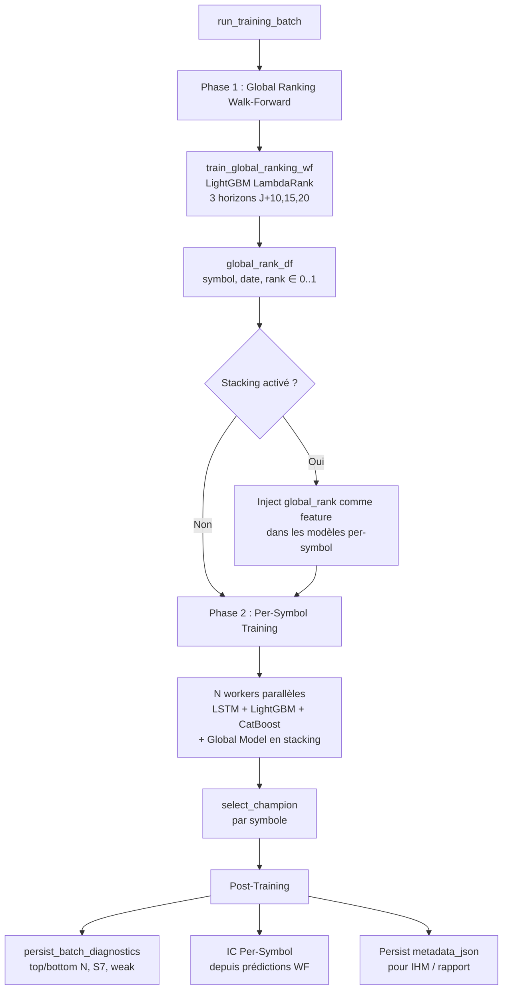

# Module ModelFactory — Documentation Complète

> **Version** : Sprint 2026-08-01 (mis à jour le 2026-07-31)  
> **Auteur** : Généré automatiquement depuis le code source

---

## Table des matières

1. [Vue d'ensemble](#1-vue-densemble)
2. [Architecture globale](#2-architecture-globale)
3. [Phase 1 — Global Ranking Model](#3-phase-1--global-ranking-model)
4. [Phase 2 — Per-Symbol Training](#4-phase-2--per-symbol-training)
5. [Sélection du Champion](#5-sélection-du-champion)
6. [Diagnostics Batch & Garde-fous](#6-diagnostics-batch--garde-fous)
7. [Prédiction & Inférence](#7-prédiction--inférence)
8. [IC Per-Symbol](#8-ic-per-symbol)
9. [Configuration](#9-configuration)
10. [Tables DB](#10-tables-db)
11. [Diagnostic & Pistes d'amélioration](#11-diagnostic--pistes-damélioration)

---

## 1. Vue d'ensemble

Le module `modelFactory` est le cœur ML du système α-Trade. Il assure :

1. **Classement cross-sectionnel** : un modèle Global Ranking (LightGBM LambdaRank) qui ordonne tous les symboles de l'univers par rendement futur attendu → `global_rank ∈ [0, 1]`
2. **Prédiction directionnelle par symbole** : des modèles per-symbol (LSTM, LightGBM, CatBoost) qui prédisent `proba_long` / `proba_short` pour chaque symbole individuellement
3. **Garde-fous qualité** : filtrage automatique des symboles dont les modèles sont trop faibles (F1 bas, zéro short, etc.)
4. **Sélection automatique du meilleur modèle** par symbole (champion selection)

### Flux simplifié

```
Entraînement :
  Global Ranking (1 modèle, tous symboles) → global_rank_10/15/20
  Per-Symbol (~500 modèles, 1 par symbole)   → proba_long, proba_short
  Diagnostics batch                           → top/bottom N, weak, S7

Inférence (Live/Backtest) :
  global_rank × proba_long → cascade_select → trades filtrés
```

---

## 2. Architecture globale



### Ordre des sections dans le rapport

| Ordre | Section | Contenu |
|-------|---------|---------|
| 1 | 📋 Détail du batch | Métadonnées, IC Rank Global, Stacking |
| 2 | 🏆 Sélection du champion | auto / fallback par modèle |
| 3 | 🔬 IC Per-Symbol | Tableau H3/H5/H10/H15/H20 |
| 4 | 🌐 Global Ranking — Détails | IC, Decile Spread, FI, splits par horizon |
| 5 | 📊 Métriques F1 par split | F1 macro/short/flat/long par modèle × split |
| 6 | 📊 Distribution true/pred | % short/flat/long prédit vs réel |
| 7 | 📈 Distribution F1 macro WF | Histogramme par bucket |
| 8 | 📅 Diagnostic par régime | F1 × régime de marché (bear/bull/range) |
| 9 | 🏆 Top 10 / Flop 10 | Meilleurs/pires symboles par F1 macro WF |
| 10 | ⚪ f1_short = 0 | Symboles sans signal short |

---

## 3. Phase 1 — Global Ranking Model

### 3.1 Objectif

Produire un **score de ranking cross-sectionnel** par symbole et par date, sur 5 horizons.

**Modèle** : LightGBM `LGBMRanker` (fallback CatBoost `RMSE`)  
**Objectif** : `lambdarank`  
**Métrique** : **IC Rank** (Spearman), pas de F1  
**Sortie** : `global_rank_h ∈ [0, 1]` — percentile dans l'univers

### 3.2 Construction de la target (label 0..19)

Pour chaque horizon $h \in \{10, 15, 20\}$ :

```
1. Rendement forward : future_return_h = close[t+h] / close[t] - 1
2. Vol scaling (h≥10)   : future_return_h /= rolling_volatility_20
   ⚠️ Diagnostic 2026-07-31 : sur Mid Caps (vol20 > 0.03), le scaling
   absolu écrase le signal → piste : scaling relatif vs médiane univers.
3. Winsorization         : clip 1%/99% intra-date
4. Percentile rank       : rank(pct=True) → [0, 1]
5. Vingtile discret      : label_h = floor(rank × 20).clip(0, 19)
   ⚠️ Note : vingtiles (0..19) depuis Sprint 2026-08-01.
   Antérieurement déciles (0..9). Le gain de résolution est théorique
   tant que l'IC reste < 0.02 (les vingtiles adjacents sont indistinguables).
```

> **H3, H5** : Retirés le 2026-08-01 (IC nul/bruit sur Mid Caps).

### 3.3 Walk-Forward

- **Fenêtre glissante** : 504 jours de train (max), 126j val, 126j test
- **Purge** : $\min(\text{horizons}) / 2 = 5$ jours entre train et val
- **Splits** : jusqu'à 13 (configurable via `max_splits`)
- **Tous les horizons partagent les mêmes splits**
- **Poids temporels** : `exp(-days_diff / 180)` — demi-vie ~6 mois
  ⚠️ Avec 504j de train, les 12+ premiers mois sont quasiment ignorés.

### 3.4 Features

| Horizon | Nb Features | Particularités |
|---------|-------------|----------------|
| H10+ | ~176 | Avec fondamentaux (PE, ROE, etc.), vol scaling, toutes features expert |

> **Note 2026-08-01** : H3 et H5 sont retirés. Le nombre exact de features
> dépend des flags CLI (`--include-fundamentals`, `--include-factors`,
> `--include-macro-regime`, etc.). Les features blacklistées sont
> déduites dynamiquement dans `_get_ranking_feature_columns()`.

**Features blacklistées** du ranking (identiques pour tous les symboles → pas de pouvoir discriminant) :
- SPY/VIX/VXN/VIX3M/MOVE (macro globales)
- `market_return_20`, `market_volatility_20`, `regime_risk_off`
- `dollar_volume_20_rank` (liquidité — trop dominante)
- `rolling_volatility_120` et dérivés (béquille anti-momentum)
- Secteur agrégé (redondant avec sector_neutral)
- `is_filled`, `log_return`, `daily_return` bruts (poids morts Mid Caps)
- `rolling_volatility_*_sector_neutral` (dominent et écrasent momentum)
- CAPM (`beta_252`, `alpha_252`, `r_squared_252`)
- Estimations analystes indisponibles (`fund_forward_pe`, `fund_eps_estimate_*`, etc.)
- Fondamentales brutes (`fund_pe_ratio`, `fund_pb_ratio`, `fund_ev_to_ebitda`, `fund_roa`, `fund_roe`)
  → leurs versions sector-neutral (`_sector_neutral`) sont conservées
- `accel_3_5`, `volume_zscore_5d`, `close_to_vwap` (poids morts Mid Caps, batch 2026-07-31)

**Features conservées** : momentum, RSI, distance SMA, volume_ratio, sector-neutral, etc.

### 3.5 Feature Importance

Calculée via `gain` (LightGBM). Moyennée sur tous les splits WF. Top 10 / Bottom 10 affichés dans l'IHM et le rapport.

### 3.6 Limitation du nombre de symboles

Paramètre `--global-ranking-max-symbols` (défaut: 300, IHM: 0 = tous).  
Si > 0 : garde les **top N par volume moyen** (liquidité).

---

## 4. Phase 2 — Per-Symbol Training

### 4.1 Objectif

Pour **chaque symbole** de l'univers, entraîner un modèle qui prédit la direction (long/short/flat).

**Modèles** : LSTM Attention, LightGBM, CatBoost (3 challengers par symbole)  
**Target** : `future_return` (binaire ou ternaire selon config)  
**Métrique** : **F1 macro** (moyenne de F1 short, F1 flat, F1 long)

### 4.2 Mode ternaire (3 classes)

```
proba_short + proba_flat + proba_long = 1.0

Décision :
  if proba_long > threshold_long  → LONG
  if proba_short > threshold_short → SHORT
  else → FLAT
```

Seuils : `ternary_threshold_short` (0.35), `ternary_threshold_long` (0.35), `top2_margin` (0.02).

### 4.3 Walk-Forward

Mêmes splits que le Global Ranking. Chaque split produit des métriques sur train/val/test, agrégées en fin de boucle.

### 4.4 Stacking (injection des rangs globaux)

Quand `global_model.stacking_enabled = True` :

```
Avant entraînement per-symbol :
  cross_sectional_cache ← merge(global_rank_df[["symbol", "date", "global_rank_3", "_5", "_10", "_15", "_20"]])
  NaN → 0.5 (rang neutre)

Le modèle per-symbol voit donc les rangs cross-sectionnels comme features supplémentaires.
```

Le but : comparer stacking=true vs stacking=false pour mesurer la valeur ajoutée (via l'IC Per-Symbol).

### 4.5 Limitation per-symbol (test rapide)

Paramètre `--per-symbol-max-symbols` (défaut: 0 = tous).  
Si > 0 : garde les **top N par volume moyen**, avant l'entraînement per-symbol.  
Le Global Ranking n'est PAS affecté.

---

## 5. Sélection du Champion

### 5.1 Principe

Pour chaque symbole, parmi les 3 challengers (LSTM, LightGBM, CatBoost), on sélectionne le **meilleur** selon des critères de qualité.

> **Note** : Le **Global Model ne participe pas** à la sélection du champion. Son rôle est différent :
> - Ses rangs (`global_rank_3/5/10`) sont injectés comme **features** dans les modèles per-symbol (stacking)
> - Il est utilisé dans la **cascade de trading** (`global_rank × proba_long` → score du trade)

### 5.2 Modes de sélection

| Mode | Condition | Modèle choisi |
|------|-----------|---------------|
| `auto_selected_champion` | ≥1 challenger éligible | Max `selection_score` (F1 macro WF) |
| `fallback_default_champion` | Aucun éligible | Modèle par défaut (ex: `lstm_attention`) |
| `default_champion` | Auto-sélection désactivée | Modèle par défaut |

### 5.3 Critères d'éligibilité

Un modèle est éligible si TOUS ces critères sont remplis :

1. **Statut** : `completed`
2. **Backend** : `lstm_attention`, `lightgbm_tabular`, `catboost_tabular`, ou `global_tabular`
3. **Artefacts** : fichiers checkpoint/scaler/config/model existent
4. **Métriques valides** :
   - Pas de `proba_valid = False`
   - AUC ∈ [0, 1] en val et WF
   - Pas de `collapsed = True`
   - `action_rate > 0` en ternaire
   - `n_observations ≥ 50` en val et WF
5. **Quarantaine** (optionnelle) : ≥ `min_runs` runs, premier succès ≥ `min_days` jours

### 5.4 Selection Score

Calculé à partir des partitions **val et walk_forward uniquement** (jamais test) :
- Priorité 1 : `f1_macro` dans `wf.mean`
- Priorité 2 : `f1_macro` dans `wf`
- Priorité 3 : `f1_macro` dans `val`
- Fallback : `auc` dans les mêmes partitions
- Si aucune métrique trouvée → `-∞` (jamais sélectionné)

---

## 6. Diagnostics Batch & Garde-fous

### 6.1 Top / Bottom N

Pour chaque symbole, classé par **F1 macro WF** décroissant :

| Groupe | Règle | Impact Live/Backtest |
|--------|-------|---------------------|
| **Top N** | N meilleurs F1 macro | Favorisés pour le sizing |
| **Bottom N** | N pires F1 macro | **Exclus** long ET short |

$N = \min(50, \text{total\_symbols})$, configurable.

### 6.2 Seuils directionnels

| Type | Condition | Impact |
|------|-----------|--------|
| `zero_short` | `f1_short == 0.0` | **Exclu short** |
| `weak_long` | `0 < f1_long < 0.15` | **Exclu long** |
| `weak_short` | `0 < f1_short < 0.15` | **Exclu short** |

### 6.3 Règles S7 (seuils absolus)

| Classe | Condition | Signification |
|--------|-----------|---------------|
| `s7_exclude_all` | `f1_long < 0.30` ET `f1_short < 0.30` | Aucune direction fiable → **exclu tout** |
| `s7_flat_pathological` | `f1_flat < 0.10` | Ne sait pas identifier les jours flat → **exclu tout** |
| `s7_long_only` | `f1_long > 0.40` ET `f1_short < 0.20` | Long OK, **short interdit** |
| `s7_short_only` | `f1_short > 0.40` ET `f1_long < 0.20` | Short OK, **long interdit** |
| `s7_monitor` | `f1_long > 0.35` ET `0.20 ≤ f1_short ≤ 0.30` | Alerte seulement, pas d'exclusion |

### 6.4 Filtrage final pour le Live/Backtest

```python
exclude_long  = bottom ∪ weak_long ∪ s7_exclude_all ∪ s7_flat_pathological ∪ s7_short_only
exclude_short = bottom ∪ zero_short ∪ weak_short ∪ s7_exclude_all ∪ s7_flat_pathological ∪ s7_long_only
prefer        = top
```

---

## 7. Prédiction & Inférence

### 7.1 Cascade de modèles par symbole

Au moment de prédire pour un symbole, le système utilise le champion sélectionné (LSTM, LightGBM, ou CatBoost). En cas d'échec, fallback vers le LSTM :

```
1. Champion (tel que sélectionné)
   └─ Échec → 2. LSTM Attention (fallback ultime)
```

Le Global Model n'est pas dans cette cascade — il est utilisé séparément via la cascade de trading (§7.2).

### 7.2 Cascade de trading (cascade_ml.md)

Combine **rang global** et **prédiction per-symbol** pour décider quels trades prendre :

```
Pour chaque symbole avec global_rank ET per-symbol prediction :
1. rank_avg = (global_rank_10 + global_rank_15) / 2
2. Si rank_avg > 0.80 (top 20%) ET proba_long > seuil → candidat LONG
3. Si rank_avg < 0.20 (bottom 20%) ET proba_short > seuil → candidat SHORT
4. Score = rank_avg × proba_long (ou (1-rank_avg) × proba_short)
5. Trié par score décroissant
```

### 7.3 Conversion proba → décision

**Mode binaire** :
```
pred_class = 1 si proba_long ≥ decision_threshold (0.55) sinon 0
```

**Mode ternaire** :
```
TernaryDecisionPolicy :
  si proba_long > threshold_long (0.35) ET proba_long - proba_flat > top2_margin → LONG
  si proba_short > threshold_short (0.35) ET proba_short - proba_flat > top2_margin → SHORT
  sinon → FLAT
```

---

## 8. IC Per-Symbol

### 8.1 Définition

L'IC Per-Symbol mesure la capacité de ranking cross-sectionnel **des modèles per-symbol agrégés** (≠ Global Ranking qui a son propre IC).

### 8.2 Calcul

```
1. Walk-Forward : pour chaque symbole, on sauvegarde (date, proba_long, close, future_return)
   → artifacts/<batch>/_per_symbol_wf_preds/<SYMBOLE>.parquet

2. Après le batch : _compute_per_symbol_ic_from_parquet()
   → lit tous les parquets
   → concatène par date tous symboles
   → pour chaque horizon h ∈ {3,5,10,15,20} :
       future_return_h = close[t+h]/close[t] - 1
       compute_cross_sectional_ic(score_col="proba_long", return_col="future_return_h")
   → stocke dans metadata_json.per_symbol_ic = {"3": {ic_mean, ic_std, n_dates}, ...}
```

### 8.3 Interprétation

| IC | Interprétation |
|----|---------------|
| > 0.02 | Bon — le signal per-symbol classe bien les actions |
| 0.01 - 0.02 | Utile — exploitable avec diversification |
| < 0.01 | Faible — signal peu discriminant |
| < 0 | Le classement est inversé |

L'IC IR (IC Mean / IC Std) mesure la **stabilité** :
- > 0.5 : bon
- > 1.0 : excellent

### 8.4 Comparaison stacking

L'IC Per-Symbol permet de comparer deux batchs :
- Batch A : `stacking_enabled = true` → IC avec stacking
- Batch B : `stacking_enabled = false` → IC sans stacking
- Si IC(A) > IC(B) → le stacking ajoute de la valeur

---

## 9. Configuration

### 9.1 Paramètres clés

| Paramètre | Défaut | Description |
|-----------|--------|-------------|
| `forecast_horizon` | 5 | Horizon de prédiction (jours) — détermine `future_return` |
| `sequence_length` | 10 | Longueur des séquences LSTM |
| `feature_set` | `expert` | `v1` ou `expert` (plus de features) |
| `target_mode` | `ternary` | `binary` ou `ternary` (3 classes) |
| `decision_threshold` | 0.55 | Seuil de proba pour classe positive |
| `global_ranking_max_symbols` | 300 | Limite symboles Global Ranking (0 = tous) |
| `per_symbol_max_symbols` | 0 | Limite symboles Per-Symbol (0 = tous) |
| `wf_max_splits` | 13 | Nombre max de splits walk-forward |
| `wf_min_train_size` | 504 | Taille min fenêtre train (jours) |
| `enable_global_stacking` | false | Injecter global_rank comme feature |

### 9.2 Garde-fous (config.yaml)

```yaml
batch_diagnostics:
  top_n: 50
  bottom_n: 50
  weak_long_threshold: 0.15
  weak_short_threshold: 0.15
  section7:
    long_good_threshold: 0.35
    short_good_threshold: 0.30
    flat_min_threshold: 0.10
    exclude_long_max_threshold: 0.30
    exclude_short_max_threshold: 0.30
```

---

## 10. Tables DB

### 10.1 Schéma simplifié

```
model_training_batch
  ├── batch_id (PK)
  ├── status, started_at, finished_at
  ├── ic_rank, ic_rank_std
  ├── decile_spread_h3, h5, h10
  ├── stacking_enabled
  └── metadata_json (JSON : global_ranking, per_symbol_ic, liquidity_filter, ...)

model_training_run
  ├── run_id (PK)
  ├── batch_id (FK → model_training_batch)
  ├── symbol, status, registry_id
  └── train_start_date, train_end_date

model_metrics
  ├── run_id (FK)
  ├── symbol, model_name, split_name
  └── f1_macro, f1_short, f1_flat, f1_long, ...

model_governance
  ├── run_id (FK)
  ├── symbol, model_name
  ├── is_selected_model (boolean)
  └── selection_mode (auto_selected_champion / fallback_default_champion / default_champion)

model_batch_diagnostics
  ├── batch_id (FK)
  ├── symbol, rank_idx
  └── rank_type (top / bottom / zero_short / weak_long / weak_short / s7_*)

global_rank_history
  ├── batch_id, date, symbol
  └── global_rank_3, global_rank_5, global_rank_10

model_predictions
  ├── run_id (FK)
  ├── symbol, prediction_date
  └── predicted_proba, predicted_side, proba_long, proba_flat, proba_short

stock_fundamentals_daily
  ├── id (PK)
  ├── symbol, trade_date (UNIQUE)
  └── pe_ratio, roe, roa, net_margin, eps_growth_yoy, beta, market_cap, ...
```

### 10.2 metadata_json structure

```json
{
  "cli_options": {...},
  "liquidity_filter": {...},
  "global_ranking": {
    "horizon_details": {
      "10": {
        "ic_mean": 0.0083,
        "decile_spread": 0.0034,
        "n_features": 176,
        "splits": [...],
        "feature_importance_top10": [...],
        "feature_importance_bottom10": [...]
      },
      "15": {...}, "20": {...}
    },
    "ic_by_horizon": {"10": 0.0083, "15": 0.0095, "20": 0.0161},
    "decile_spreads": {"10": 0.0034, ...},
    "symbols_count": 928,
    "splits_count": 13,
    "pred_rows": 1338623
  },
  "per_symbol_ic": {
    "3": {"ic_mean": 0.0013, "ic_std": 0.05, "n_dates": 348, "n_symbols": 12},
    "5": {"ic_mean": 0.0041, ...},
    "10": {...}, "15": {...}, "20": {...}
  }
}
```

---

## 11. Diagnostic & Pistes d'amélioration

### 11.1 État actuel (batch 2026-07-31, Mid Caps ~930 symboles)

| Métrique | Valeur | Seuil « bon » |
|----------|--------|---------------|
| IC Rank moyen | 0.011 | > 0.05 |
| IC IR | 0.26–0.46 | > 0.50 |
| Decile Spread | 0.003–0.012 | > 0.02 |
| Top/Bottom décile | ~0.50 / ~0.50 | Top > 0.52 |

**Conclusion** : le modèle ne discrimine pas les gagnants des perdants.

### 11.2 Causes racines identifiées

1. **Vol Scaling absolu** : `future_return / vol20` avec Mid Caps (vol20 > 0.03)
   → le signal est mécaniquement écrasé. Piste : scaling relatif vs médiane univers.

2. **Target = rendement brut** (pas d'excès vs SPY) : le premier facteur cross-sectionnel
   appris est le beta au marché, pas l'alpha.

3. **Trop de features (176)** pour un signal quasi nul → noise fitting.
   Piste : `--ranking-top-k-features 40`.

4. **Vingtiles (20 labels)** : résolution trop fine pour un IC de 0.01.
   Piste : revenir aux déciles (0..9).

5. **Fenêtre train courte (504j) + décroissance agressive** (demi-vie 6 mois).
   Piste : 756j, demi-vie 12 mois.

### 11.3 Plan d'action recommandé

| Priorité | Action | Facile ? |
|----------|--------|----------|
| P0 | Test A/B vol scaling ON vs OFF | Oui (flag) |
| P0 | Réintroduire excès vs SPY (beta-adjusted) | Oui (décommenter) |
| P1 | Vingtiles → déciles | Oui (1 ligne) |
| P1 | `ranking_top_k_features=40` | Oui (déjà codé) |
| P2 | Fenêtre 504→756j, demi-vie 180→360j | Oui (config) |

---

## Annexe A — Glossaire

| Terme | Définition |
|-------|-----------|
| **IC Rank** | Information Coefficient — corrélation de Spearman entre rang prédit et rendement réalisé |
| **IC IR** | IC Information Ratio = IC Mean / IC Std — mesure la stabilité du signal |
| **Decile Spread** | Rendement moyen du top décile moins bottom décile |
| **F1 macro** | Moyenne non pondérée des F1 de chaque classe (short, flat, long) |
| **WF** | Walk-Forward — validation glissante PIT-safe |
| **PIT** | Point-In-Time — pas de fuite de données futures |
| **Stacking** | Injection du rang global comme feature dans les modèles per-symbol |
| **Champion** | Meilleur modèle sélectionné par symbole (LSTM, LightGBM ou CatBoost — le Global Model ne participe pas) |
| **S7** | Section 7 du plan ML — règles absolues d'exclusion basées sur les F1 |
| **Cascade** | Chaîne de fallback pour l'inférence (global → tabular → LSTM) |
| **Vingtile** | Subdivision en 20 groupes (0..19). Utilisé depuis 2026-08-01 (anciennement déciles 0..9) |
| **Vol Scaling** | Division du forward return par `rolling_volatility_20`. Problématique sur Mid Caps (vol20 élevée) |

## Annexe B — Flux de bout en bout

```
┌─────────────────────────────────────────────────────────────────────┐
│                        ENTRAÎNEMENT (batch)                         │
├─────────────────────────────────────────────────────────────────────┤
│                                                                     │
│  1. Chargement univers (500-2000 symboles)                          │
│  2. Filtrage liquidité (volume, market cap, spread)                 │
│  3. Limitation per-symbol (top N par volume, optionnel)             │
│                                                                     │
│  ┌─ Global Ranking ─────────────────────────────────────────┐      │
│  │  LightGBM LambdaRank, 3 horizons (10, 15, 20)            │      │
│  │  Walk-forward, 13 splits, ~176 features                  │      │
│  │  Sortie : global_rank_df[symbol, date, rank_10..20]      │      │
│  │  Métrique : IC Rank (Spearman)                           │      │
│  │  ⚠️ IC actuel ~0.01 (cf. section 11)                     │      │
│  └──────────────────────────────────────────────────────────┘      │
│                            ↓                                        │
│  ┌─ Per-Symbol Training ───────────────────────────────────┐      │
│  │  Pour chaque symbole (parallèle) :                      │      │
│  │    - LSTM Attention + LightGBM + CatBoost               │      │
│  │    - Walk-forward avec splits identiques                │      │
│  │    - Sauvegarde prédictions WF → _per_symbol_wf_preds/  │      │
│  │    - select_champion() → 1 modèle élu par symbole       │      │
│  └──────────────────────────────────────────────────────────┘      │
│                            ↓                                        │
│  ┌─ Post-Training ─────────────────────────────────────────┐      │
│  │  - persist_batch_diagnostics (top/bottom N, S7, weak)   │      │
│  │  - _compute_per_symbol_ic_from_parquet                  │      │
│  │  - Persist metadata_json → IHM + rapport                │      │
│  └──────────────────────────────────────────────────────────┘      │
│                                                                     │
├─────────────────────────────────────────────────────────────────────┤
│                      INFÉRENCE (live/backtest)                       │
├─────────────────────────────────────────────────────────────────────┤
│                                                                     │
│  Pour chaque date de trading :                                      │
│  1. Charger global_rank_history[date]                               │
│  2. Pour chaque symbole : predict_symbol() → proba_long/short/flat  │
│  3. cascade_select(global_rank × proba) → candidats triés           │
│  4. filter_predictions(batch_diagnostics) → exclusion weak/bottom   │
│  5. Sortie : liste de trades (symbol, side, score)                  │
│                                                                     │
└─────────────────────────────────────────────────────────────────────┘
```
