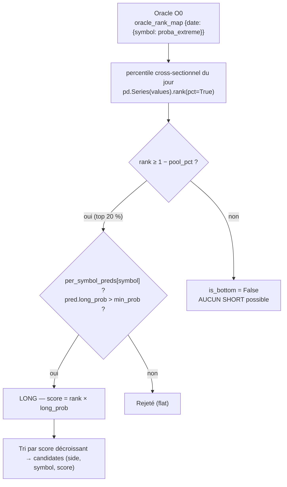
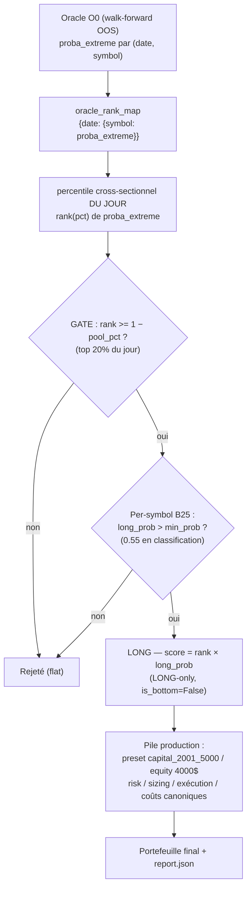

# Oracle Extreme — Gate d'univers LONG (composant officiel E6→E13)

**Statut :** composant intégré au code (config + `cascade_select` + tests ✅ 54/54),
**câblé au backtest CLI** (`--cascade-rank-mode extreme_gate` + variantes E17/E18),
**non câblé au pipeline live** (voir [§8 État du câblage](#8-etat-du-cablage-et-to-do)).

**Référence recherche :** `doc/synthese_e6_e13_2026-08-20.md` (branche E6→E13 **FERMÉE**).
**Baseline research gelée :** Oracle O0 → Extreme TOP20 → LONG-only → PROD lifecycle → **m24** → equal-weight 1/24.
**Résultats production CLI (E16-D/E17/E18) :** voir [§10 Résultats](#10-resultats-de-reference-recherche-50-seeds--e13-b).

---

## 1. Rôle

L'Oracle Extreme transforme la probabilité de **mouvement extrême** (`proba_extreme`,
Oracle O0) en un **gate d'univers LONG**, indépendant du ranking B25 (`global_rank_20`).

- **Ce n'est pas un ranker directionnel.** Il ne prédit pas la hausse/baisse.
- **C'est un filtre d'univers** : garde les top `pool_pct` (défaut 20 %) du jour par
  potentiel de mouvement extrême, puis on ne joue que **LONG** dans cet univers.
- **L'edge est empirique** (E8→E13) : le *top 20 % de `proba_extreme`* forme un univers
  porteur pour le LONG ; le classement interne des titres est secondaire.

> ⚠️ **SÉMANTIQUE (à ne jamais oublier)** : `proba_extreme` **≠ P(LONG)**. C'est le
> potentiel de **MOUVEMENT EXTRÊME** cross-sectionnel. L'orientation LONG est un choix
> empirique validé par la recherche, pas une propriété de la proba.

---

## 2. Architecture

```
modelFactory/oracle/
├── extreme_gate.py          # compute_extreme_gate() + build_oracle_rank_map()  (NOUVEAU)
├── train.py                 # entraînement Oracle Extreme + ablations O0/O1/O2 (S3)
├── walk_forward.py          # WF causal strict (oracle_available_date < test_start) + persist_oos()
├── dataset.py               # build_dataset() — features PIT + targets Oracle
├── build_labels.py          # build_labels() — labels Oracle H20 (global_oracle_labels)
├── config.py                # OracleConfig — horizon H20, top_pct 0.10, raw_target=True
└── combine.py               # second signal B25+Oracle (désactivé par défaut)

modelFactory/
├── predictor.py             # cascade_select(rank_mode="extreme_gate", oracle_rank_map=…)
│                            #   + load_extreme_gate_config() + apply_cascade_to_predictions()
└── orchestrator.py          # train_oracle_extreme() — pipeline O0 (labels→dataset→WF→OOS)

config.yaml                  # section `extreme_gate:` (enabled / pool_pct / long_only / min_prob)
```

### Dépendances data

| Donnée | Source |
|---|---|
| `proba_extreme` | Parquet OOS du walk-forward Oracle : `artifacts/models/oracle/oracle-wf-<run_id>/oos_predictions.parquet` |
| Pool features + `proba_extreme` + `atr_pct_20` | Recherche : `scripts/e6_b2_ev_long_backtest.load_pool()` (merge_pools) |
| OHLCV | `artifacts/backtest_cache/39587735630f_ohlcv_2017-10-26_2026-06-30.parquet` |

---

## 3. Mécanique (PIT, aucun lookahead)

```
Oracle O0 → proba_extreme (calculé à D avec les données ≤ D)
   → percentile cross-sectionnel DU JOUR : rank(pct=True) dans la journée
   → extreme_pct ≥ 1 − pool_pct  ⇔  extreme_gate = True  (défaut : top 20 %)
   → candidates LONG (side="buy") → sizing equal-weight 1/m → lifecycle PROD
```

- Le gate est **cross-sectionnel par jour** : on classe les candidats du jour *entre eux*.
- **Aucune information future** : ni seuil global, ni rang de J+1.
- `pool_pct ≤ 0` garde tout ; `pool_pct ≥ 1` garde le percentile max.

---

## 4. Config `config.yaml`

```yaml
extreme_gate:
  enabled: false          # ⚠️ INFORMATIF — voir §8 (le vrai interrupteur est rank_mode)
  pool_pct: 0.20          # univers : top 20 % du jour par proba_extreme
  long_only: true         # ⚠️ INFORMATIF — la branche est LONG-only en dur dans le code
  min_prob: null          # per-symbol min ; null = défaut cascade min_prob_regression
```

| Paramètre | Défaut | Consommé par | Effet |
|---|---|---|---|
| `enabled` | `false` | **Aucun code** (lu mais non utilisé comme interrupteur) | Voir §8 |
| `pool_pct` | `0.20` | `cascade_select` (L2675-2676) et `compute_extreme_gate` | Taille de l'univers |
| `long_only` | `true` | **Aucun code** (hardcodé `is_bottom = False`) | LONG-only garanti |
| `min_prob` | `null` | `cascade_select` (L2689-2691) | Seuil per-symbol ; `null` → `min_prob_regression` (0.10) |

> **Bloc voisin `cascade:`** (inchangé) : `top_pct: 0.10`, `min_prob_classification: 0.55`,
> `min_prob_regression: 0.10`, `short_momentum_filter: none`, `short_momentum_max_pct: null`.

---

## 5. Flux dans `cascade_select` (`rank_mode="extreme_gate"`)



| Étape | Modèle concerné | Comportement |
|---|---|---|
| **Global B25** (`global_rank_20`) | ❌ **PAS utilisé** | `load_global_ranks_from_db()` n'est **pas** appelé — le rang vient de l'`oracle_rank_map` seul |
| **Per-symbol** | ✅ **Oui** | Exigé pour chaque symbole retenu ; filtre `long_prob > min_prob` |
| **Per-sector** | ❌ **Non** | `cascade_select` n'a pas de dimension sectorielle ; sortie = `(side, symbol, score)` |
| **SHORT** | 🚫 **Jamais** | `is_bottom = False` hardcodé (predictor.py L2800) |

Code clé :

```python
# predictor.py L2799-2801 — la branche extreme_gate
if _mode_extreme_gate:
    is_top = rank is not None and rank >= (1.0 - _extreme_gate_pct)
    is_bottom = False  # LONG-only
```

### 5.1 — Flux PRODUCTION complet (`python -m backtesting run --cascade-rank-mode extreme_gate ...`)

Le run CLI (E16-D, preset `capital_2001_5000`) enchaîne **deux filtres successifs** + la pile production :



- **Le gate** (Étape 1) : filtre Oracle sur `proba_extreme` (mouvement extrême, **pas** P(LONG)), percentile intra-jour, top `pool_pct` — LONG-only.
- **Le modèle per-symbol** (Étape 2) : `long_prob > min_prob` — c'est la confirmation directionnelle.
- **La pile production** : le preset capital (petit compte), le sizing, le risque, l'exécution next-open, les coûts canoniques.

> ⚠️ Interprétation : le résultat CLI (ex. +146 % pour EXT sous preset 2001_5000) = **gate + per-symbol + pile production**, pas le gate seul. Le gate seul (recherche, E16-C) donnait ~23 % en médiane — la différence vient du filtre per-symbol et du pipeline.

### 5.2 — Variantes du rôle per-symbol (E17, flag `--extreme-gate-per-symbol`)

Le modèle per-symbol B25 intervient à **2 endroits** dans le flux :

1. **VETO** (sélection) : `long_prob > min_prob` (0.55) — rejette un candidat du top 20 %.
2. **RANG** (priorité) : `replay_signals` classe par `proba_long` (= long_prob) → c'est **lui** qui décide qui entre dans `max_positions` (pas `cascade_score`, inutilisé en aval).

Trois variantes câblées (`--extreme-gate-per-symbol`) :

| Variante | VETO `long_prob > min_prob` | RANG / priorité |
|---|---|---|
| **A `filter`** (actuel) | ✅ oui (0.55) | `long_prob` per-symbol (via `proba_long`) |
| **B `no_filter`** | ❌ non | `long_prob` per-symbol |
| **C `bypass`** (Oracle pur) | ❌ non | **percentile Oracle O0** — `proba_long` est écrasé par le score `rank` |

**Câblage de C (`bypass`)** — ne pas juste changer le score en amont :

- `cascade_select` : `score = rank` (percentile O0), per-symbol ignoré (ni veto ni score).
- `apply_cascade_to_predictions` : `proba_long = score (percentile O0)`, `proba_short = 0`, `predicted_side = "long"` — indispensable car `replay_signals` classe par `proba_long`. Sans cet écrasement, le per-symbol continuerait de classer via `long_prob`.

```python
# predictor.py — branche extreme_gate (E17)
if _mode_extreme_gate:
    if _eg_ps_mode == "bypass":                       # C : Oracle pur
        candidates.append(("LONG", symbol, rank))
    else:
        _eg_pred = per_symbol_preds.get(symbol)
        if _eg_pred is None:
            continue
        if _eg_ps_mode == "no_filter" or _eg_pred.long_prob > _min_prob:  # B / A
            candidates.append(("LONG", symbol, rank * _eg_pred.long_prob))
    continue
```

```python
# apply_cascade_to_predictions — bypass : proba_long = percentile O0
if _eg_ps_bypass:
    _oscore = _score_map.get(_sym)
    result.loc[_pm, "proba_long"] = float(_oscore) if _oscore is not None else 0.0
    result.loc[_pm, "proba_short"] = 0.0
    result.loc[_pm, "predicted_side"] = "long"
    continue
```

Utilisation CLI :

```bash
--cascade-rank-mode extreme_gate \
--oracle-oos-path artifacts/models/oracle/oracle-wf-20260820025255/oos_predictions.parquet \
--extreme-gate-pct 0.20 \
--extreme-gate-per-symbol filter   # | no_filter | bypass
```

### 5.3 — Branche SHORT optionnelle (E18, flag `--extreme-gate-shorts`)

Le gate Extreme est **LONG-only par défaut**. Le flag `--extreme-gate-shorts` (défaut OFF)
active une branche SHORT symétrique dans le gate top20 :

```
LONG  = gate ∩ long_prob > min_prob            (0.55)
SHORT = gate restants ∩ short_prob > min_prob  (≈ long_prob < 0.45)
REST  = NO TRADE
```

> ⚠️ **NO-GO mesuré (E18-A + E18-B)** : le per-symbol B25 est une classification **binaire
> pure** (`short_prob ≡ 1 − long_prob`, corr = −1.000000, `proba_flat` = 0 constant). La queue
> basse de `long_prob` est **aussi haussière que le reste du pool** (P(ret<0) H20 ≈ 47 % vs
> 47.6 % global ; MAE short −10.4 % > MFE short +8.6 %). En backtest réel : **EXT short-only
> = −54.1 %** (Sharpe −1.25, PF 0.72) et **EXT L+S fait chuter le run de +146 % à +39 %**.
> → **SHORT reste FERMÉ**, le flag est câblé mais **ne doit pas être activé**.

Code :

```python
# predictor.py — branche extreme_gate (E18)
if _eg_ps_mode == "no_filter" or _eg_pred.long_prob > _min_prob:
    candidates.append(("LONG", symbol, rank * _eg_pred.long_prob))
elif _eg_shorts and _eg_pred.short_prob > _min_prob:
    candidates.append(("SHORT", symbol, rank * _eg_pred.short_prob))
```

```python
# apply_cascade_to_predictions — forçage du côté (E17 fix + E18)
_side = _side_map.get(_sym, "LONG")
if _side == "SHORT":
    result.loc[_pm, "proba_short"] = _cp.short_prob
    result.loc[_pm, "proba_long"] = 0.0
    result.loc[_pm, "predicted_side"] = "short"
else:
    result.loc[_pm, "proba_short"] = 0.0
    result.loc[_pm, "predicted_side"] = "long"
```

---

## 6. Fonctions du module `modelFactory/oracle/extreme_gate.py`

### `compute_extreme_gate(df, pool_pct=0.20, proba_col="proba_extreme", date_col="date")`

Ajoute au DataFrame :
- `extreme_pct` : percentile cross-sectionnel de `proba_extreme` **dans le jour**
  (1.0 = plus haut du jour). PIT.
- `extreme_gate` : booléen `extreme_pct >= 1 - pool_pct`.

```python
from modelFactory.oracle.extreme_gate import compute_extreme_gate
df = compute_extreme_gate(df, pool_pct=0.20)   # colonnes date, symbol, proba_extreme
```

### `build_oracle_rank_map(df, proba_col="proba_extreme", date_col="date")`

Construit `{date: {symbol: proba_extreme}}` à passer à
`cascade_select(rank_mode="extreme_gate", oracle_rank_map=...)`.

```python
from modelFactory.oracle.extreme_gate import build_oracle_rank_map
rank_map = build_oracle_rank_map(oos_df)   # oos_df = parquet OOS Oracle
```

---

## 7. Utilisation en PRODUCTION (pipeline)

### Entraînement de l'Oracle O0

- **Flag :** `modelFactory/config.py` → `enable_oracle_model: bool = False` (défaut) ;
  IHM → `ihm/services/pipeline_ml_defaults.py` → `DEFAULT_ML_ENABLE_ORACLE_MODEL = False`.
- **Déclenchement :** `modelFactory/orchestrator.py` → `train_oracle_extreme()` (L467) —
  pipeline : labels H20 → dataset → walk-forward causal O0 → `persist_oos()` sous
  `artifacts/models/oracle/oracle-wf-<run_id>/`.
- **Anti-leakage :** `oracle_available_date < test_start` (T2), folds expansifs
  (`modelFactory/oracle/walk_forward.py`).

### Appel à l'inférence (sélection)

```python
from modelFactory.predictor import apply_cascade_to_predictions, load_extreme_gate_config

preds_df = apply_cascade_to_predictions(
    preds_df, batch_id, engine=engine,
    rank_mode="extreme_gate",
    oracle_rank_map=build_oracle_rank_map(oos_df),  # {date: {symbol: proba_extreme}}
    extreme_gate_pct=None,   # None → pool_pct de la config (0.20)
)
```

- Les symboles retenus gardent `predicted_side` ; les autres passent `flat` (exclus du backtest).
- **Sizing :** m24 = `max_positions=24`, equal-weight `1/24` (budget de risque total constant).

### Checklist production candidate

1. `extreme_gate.enabled: true` (pour la trace — ne pilote pas le code, cf. §8).
2. Câbler `rank_mode="extreme_gate"` + `oracle_rank_map` au call-site live
   `backtesting/cli/_impl.py` (à faire — §8).
3. Activer l'entraînement Oracle O0 (`enable_oracle_model = True`).
4. `max_positions = 24`.
5. Lifecycle PROD figé (stop 2.5×ATR / TP min(3×ATR,7%) / trailing 2.5×ATR / time_stop OFF / gap 3% / 16bps).

---

## 8. État du câblage et TO-DO

### ✅ Câblage BACKTEST CLI — FAIT (E16-D, E17, E18)

Depuis E16-D, le CLI `python -m backtesting run` câble complètement le gate Extreme :

```bash
python -m backtesting run ... \
  --cascade-rank-mode extreme_gate \
  --oracle-oos-path artifacts/models/oracle/oracle-wf-20260820025255/oos_predictions.parquet \
  --extreme-gate-pct 0.20 \
  [--extreme-gate-per-symbol filter|no_filter|bypass] \
  [--extreme-gate-shorts]                    # E18 : branche SHORT optionnelle (NO-GO)
```

- `backtesting/cli/_impl.py` : `oracle_rank_map` chargé pour `"extreme_gate"` (+ oracle_modes),
  `extreme_gate_pct` / `extreme_gate_per_symbol` / `extreme_gate_shorts` transmis à
  `apply_cascade_to_predictions`.
- `modelFactory/predictor.py` : variantes per-symbol (A/B/C, §5.2) + shorts optionnels (§5.3).

### ❌ Câblage LIVE — NON FAIT

Le pipeline de production live (`ihm/services/pipeline_runner.py`, `risk_management/`,
`execution_engine/`) **n'appelle pas** `cascade_select` / `apply_cascade_to_predictions`.
Le gate Extreme (LONG et SHORT) est aujourd'hui un composant **backtest/recherche uniquement**.

### TO-DO pour rendre le composant réellement activable en live

| # | Action | Fichier |
|---|---|---|
| 1 | Brancher `rank_mode="extreme_gate"` + `oracle_rank_map` au call-site live (à partir du parquet OOS Oracle fraîchement généré) | `ihm/services/pipeline_runner.py` |
| 2 | Rendre `enabled`/`long_only` de la config réellement consommés (interrupteur) | `predictor.py` / call-site |

---

## 9. Utilisation en BACKTEST

### Chemin recherche (scripts E6→E13) — le plus simple

Les scripts réutilisent `build_signals()` + `make_engine()` de
`scripts/e11_extreme_long_payoff_diag.py` :

```python
from scripts.e11_extreme_long_payoff_diag import build_signals, load_pool, load_pivots

pool = load_pool()                                  # features + proba_extreme + atr_pct_20
pivots = load_pivots()                              # open/close/high/low/volume
sig = build_signals(pool, 0.80, 1.01, seed=7)       # Extreme TOP20 (percentile ≥ 0.80)
res = make_engine(m=24).run(open_df=pivots["open"], close=pivots["close"],
                            high=pivots["high"], low=pivots["low"],
                            signals_df=sig, volume=pivots["volume"])
```

- `build_signals(pool, lo=0.80, hi=1.01, seed)` : filtre `_pe_pct >= 0.80` (top 20 %) par
  `proba_extreme`, rang aléatoire intra-date (seed) pour isoler l'edge du gate vs le ranking,
  `score = proba_extreme`, `side="buy"` (**LONG-only**).
- `make_engine(m)` (variante PROD, `scripts/e13_capacity_diversification.py`) :
  `atr_risk_stop_multiple=2.5`, `initial_stop_atr_multiple=2.5`, `tp_atr_multiple=3.0`,
  `tp_max_pct=0.07`, `trailing=None`, `time_stop_enabled=False`,
  `microstructure(max_entry_gap_pct=0.03, intrabar_priority="conservative")`, 16bps.
- ⚠️ `make_engine()` d'**E11** est le **E-LIFECYCLE** (stop 3.5×ATR, TP 13%, trailing 7%,
  time_stop ON) — **référence historique uniquement**. Toute expérience part du **PROD lifecycle + m24**.

### Chemin pipeline (backtest CLI)

Même mécanisme qu'en production mais avec `apply_cascade_to_predictions(...)` sur les
prédictions du batch — sujet au même **câblage manquant** (§8) : il faut charger
l'`oracle_rank_map` depuis le parquet OOS avant l'appel.

---

## 10. Résultats de référence (recherche, 50 seeds — E13-B)

| Métrique | m24 (baseline) |
|---|---|
| Return médian | **61.6 %** |
| P10 / P25 / P90 | 41.1 % / 46.8 % / 88.3 % |
| Pire seed | **+23.5 %** (100 % seeds positifs) |
| PF | 1.13 |
| Sharpe | 0.45 |
| DD | −22.6 % |
| Dispersion P90−P10 | 47 (vs 113 en m8, −59 %) |

**Message central :** m24 n'améliore **pas** le signal prédictif — il améliore sa
**monétisation** (réduction du risque d'échantillonnage). L'edge est dans l'appartenance à
l'univers Extreme, pas dans le ranking.

---

## 11. Garde-fous / NO-GO (ne pas réintroduire)

- **Pas de `global_rank_20` comme source de l'edge** (le rang interne ne porte pas la valeur).
- **Pas de Y3 directionnel** en production (filtre destructeur, E7).
- **Pas de Platt / EV_LONG** (pur re-ranking, E6-B4).
- **Pas de filtre NO-TRADE / TRUE_BAD** (non séparable, E12-1A).
- **Pas de modification TP/SL/trailing** (stop initial inerte, trailing négatif, E12-2B/C).
- **Pas de SHORT** (chantier séparé ; E8 : −86.8 %).
- **Risque résiduel 2026H1** : semestre faible (16-28 % seeds positifs) sous toutes les
  configs testées — risque officiel, **non à optimiser maintenant**.

---

## 12. Liens

- Synthèse de clôture : `doc/synthese_e6_e13_2026-08-20.md`
- Spec Oracle : `doc/ml_oracle.md` / `doc/ml_oracle_sprint.md`
- Module gate : `modelFactory/oracle/extreme_gate.py`
- Branch `cascade_select` : `modelFactory/predictor.py` (~L2670-2801, L2880-2995)
- Entraînement O0 : `modelFactory/orchestrator.py` (`train_oracle_extreme`, L467)
- Tests : `tests/test_cascade_ml.py` (54/54 ✅ — dont 3 nouveaux tests extreme_gate)
- Scripts recherche : `scripts/e11_extreme_long_payoff_diag.py`, `scripts/e13_capacity_diversification.py`, `scripts/e13b_baseline_confirmation.py`
