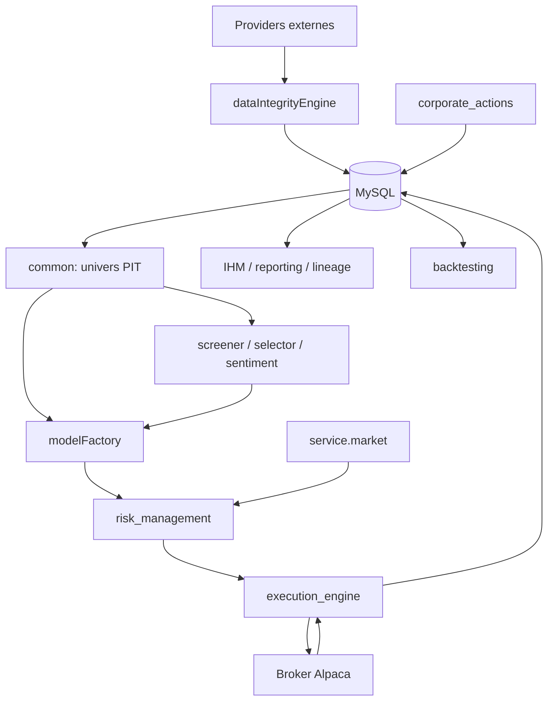

# Architecture globale

## Découpage

| Couche | Packages | Responsabilité |
|---|---|---|
| Contrats partagés | `core/`, `common/` | types, décision ternaire, secrets, calendrier, coûts, univers PIT |
| Persistance | `database/`, `alembic/` | connexion, tables, repositories, migrations |
| Données | `dataIntegrityEngine/`, `service/` | providers, ingestion, nettoyage, fraîcheur |
| Signaux | `screener/`, `selector/`, `event_sentiment/` | scores, facteurs, sentiment, contexte |
| ML | `modelFactory/` | datasets, features, train, champions, predict, ranking, Oracle |
| Décision | `risk_management/`, `service/market/` | régime, vetos, sizing, contraintes, targets |
| Trading | `execution_engine/`, `corporate_actions/` | ordres, fills, protections, positions, cash ledger |
| Recherche | `backtesting/`, `formal/` | replay, coûts, parité, validation statistique et formelle |
| Exploitation | `ihm/`, `reporting/`, `lineage/`, `flows/` | UI, rapports, traçabilité, orchestration optionnelle |

## Flux et frontières d'autorité

Les dépendances institutionnelles importantes sont matérialisées par `.importlinter`. Les packages bas niveau ne doivent pas dépendre de l'IHM. Les clients externes vivent dans `service/`; les règles métier restent autant que possible injectables et testables.

## Points d'entrée

- `run.py` : lance l'IHM si Streamlit est disponible ;
- `ihm/app.py` : application Streamlit ;
- `python -m modelFactory` : train/predict ML ;
- `python -m risk_management.run_risk` : construction du portefeuille cible ;
- `python run_execution.py <mode>` : exécution canonique ;
- `python -m execution_engine` : façade de compatibilité, plus `cancel-all` ;
- `python -m backtesting` : CLI backtest ;
- `python -m corporate_actions` : sync/apply/status/run ;
- `python -m event_sentiment` : pipeline news/sentiment.

## Conventions transverses

- Python 3.12, SQLAlchemy, pandas/polars, PyTorch/Lightning, LightGBM/CatBoost, Streamlit.
- Dates de trading séparées des timestamps UTC ; le calendrier de marché est centralisé.
- Les prix canoniques sont ajustés des splits. Les dividendes passent par `portfolio_cash_ledger`.
- Les run summaries utilisent un schéma versionné et des compteurs de qualité.
- Les secrets sont résolus depuis des placeholders d'environnement ; les valeurs sentinelles sont rejetées.
- Les artefacts de modèle et rapports sont hors base, tandis que registry, prédictions, décisions et exécution sont persistés.

## Deux orchestrateurs à ne pas confondre

`ihm/services/pipeline_runner.py` décrit et pilote le workflow opérateur complet en 14 étapes. `flows/daily_pipeline.py` est un orchestrateur Python/Prefect opt-in plus ancien et minimal, dont les chemins de fonctions sont résolus dynamiquement et peuvent être absents. Pour comprendre la production locale actuelle, le pipeline IHM et les CLI de chaque module font autorité.

