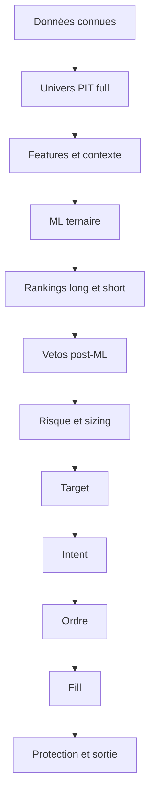
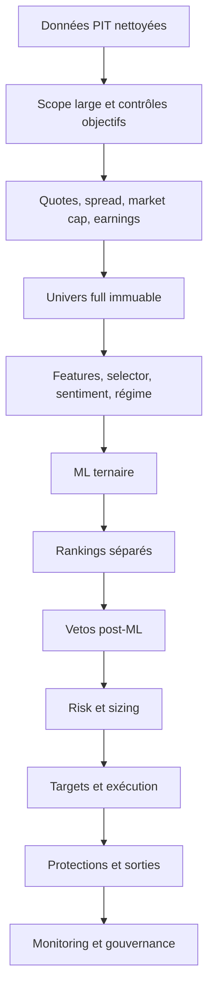
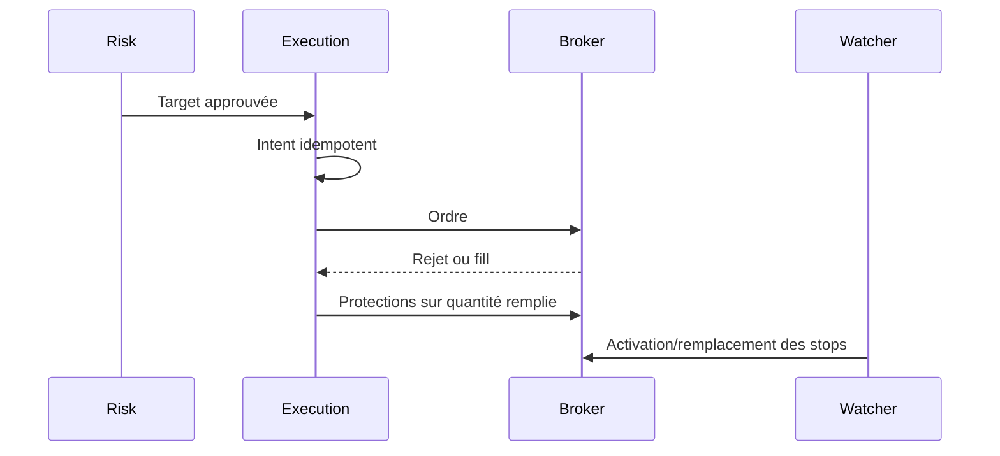
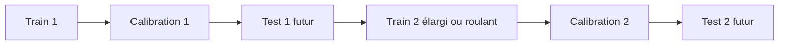

# Comprendre le trading Long/Short ML-first de bout en bout

> Guide fonctionnel et opérationnel du pipeline PIT, du ML ternaire, du risque, de l'exécution et du backtest. Révision du 2026-07-11.

## Partie 1 - Public, mode d'emploi et parcours

### 1.1 Public et objectif

Ce guide s'adresse à une personne qui découvre à la fois le trading algorithmique et cette application. Il ne suppose aucune connaissance des marchés, du machine learning, du broker ou du backtest.

À la fin du parcours, le lecteur doit pouvoir suivre un symbole depuis les données jusqu'à sa sortie, expliquer chaque rejet, distinguer une sélection d'un fill, comparer live et backtest, et reconnaître les invariants ML-first.

### 1.2 Comment lire le guide

Les parties 1 à 3 donnent le vocabulaire et un modèle mental sans équation. Les parties 4 à 9 détaillent la chaîne opérationnelle. Les parties 10 à 12 servent de manuel de calibration et d'audit.

Trois conventions :

1. **Nominal** désigne le chemin autorisé pour ouvrir une nouvelle position.
2. **PIT** signifie que l'information était disponible à la date et au cutoff considérés.
3. **Post-ML** signifie qu'un contrôle intervient après la direction ML : il peut conserver, réduire ou rejeter, jamais inventer ni inverser cette direction.

### 1.3 Table des matières

1. Public, mode d'emploi et parcours
2. Concepts essentiels et glossaire
3. Modèle mental et histoire d'un symbole
4. Pipeline partagé, dans l'ordre causal
5. Mécanique détaillée d'une position long
6. Mécanique détaillée d'une position short
7. Parcours complet live et paper dans l'IHM
8. Parcours complet d'un backtest PIT
9. Comparaison live/backtest et exemple chiffré
10. Calibration, monitoring et gouvernance
11. Rejets, activation des shorts et invariants
12. Fichiers de référence et contrat exécutable

### 1.4 Les quatre réponses à retenir

| Question | Réponse |
|---|---|
| Quel est le scope nominal ? | Le dernier univers tradable PIT canonique, complet et de qualité `full`, pour la date et le preset capital. |
| Qui décide du côté ? | Uniquement le ML ternaire via `predicted_side = long`, `flat` ou `short`. |
| Qui décide du rang ? | `proba_long` pour la jambe long et `proba_short` pour la jambe short, avec deux classements séparés. |
| À quoi servent selector, scanner et scores ? | À produire des features, du contexte explicable ou des vetos post-ML. Après le cutover, ils ne définissent jamais le scope nominal, le côté ou le ranking principal. |

La partie suivante définit précisément ces mots avant de montrer le pipeline.

## Partie 2 - Concepts essentiels et glossaire

### 2.1 De la donnée à la décision

| Terme | Définition simple | Rôle dans l'application |
|---|---|---|
| **Symbole** | Code identifiant un instrument, par exemple une action. | Clé reliant données, prédiction, ordre et position. |
| **Univers** | Ensemble des symboles étudiés. | Le scope nominal est `tradable-universe` PIT `full`, pas un Top-N technique. |
| **PIT** | *Point in time* : connu à cet instant. | Interdit les données futures et l'univers actuel projeté dans le passé. |
| **Feature** | Variable fournie au modèle. | Prix, volume, volatilité, facteurs, sentiment, macro ou régime. |
| **Score** | Résumé numérique d'un contexte. | Feature, diagnostic ou veto ; jamais autorité nominale de scope, côté ou rang. |
| **Selector / scanner** | Module calculant des facteurs sur de nombreux symboles. | Enrichit le contexte ; son Top-N n'est pas la population nominale du ML. |
| **ML ternaire** | Modèle à trois classes. | Produit `short`, `flat`, `long` et trois probabilités. |
| **Probabilité** | Confiance calibrée entre 0 et 1. | `proba_long`, `proba_flat`, `proba_short`. |
| **Long** | Position gagnant si le prix monte. | Ouverture `buy`, clôture `sell`. |
| **Short** | Vente à découvert gagnant si le prix baisse. | Ouverture `sell`, clôture `buy` (buy-to-cover). |
| **Flat** | Aucun pari directionnel. | N'ouvre aucune position, même avec un score élevé. |
| **Ranking** | Classement des opportunités. | Longs par `proba_long`, shorts par `proba_short`. |
| **Veto** | Contrôle qui bloque une opportunité. | Post-ML ; ne change jamais la direction. |

### 2.2 Du risque à la position

| Terme | Définition | Distinction essentielle |
|---|---|---|
| **Sizing** | Calcul de la quantité à engager. | Dimensionne une sélection ; ne choisit pas le symbole. |
| **Target** | Cible approuvée par le risk. | Ce n'est pas encore un ordre. |
| **Intent** | Demande locale idempotente d'ordre. | Décrit côté, quantité, type, prix et rôle. |
| **Order** | Instruction reçue par le broker/simulateur. | Peut être refusée, annulée ou partiellement remplie. |
| **Fill** | Exécution effective. | Seule la quantité remplie devient une position. |
| **Stop** | Sortie défavorable limitant la perte. | Sous le marché pour un long, au-dessus pour un short. |
| **Take-profit** | Sortie favorable matérialisant un gain. | Au-dessus pour un long, en dessous pour un short. |
| **Exposition brute** | Longs plus valeur absolue des shorts. | Mesure le risque total engagé. |
| **Exposition nette** | Longs moins valeur absolue des shorts. | Mesure le biais directionnel. |

### 2.3 Live, paper et backtest

| Mode | Source et exécution | Capital réel | Usage |
|---|---|---:|---|
| **Live** | Données courantes, broker réel | Oui | Production gouvernée. |
| **Paper** | Même chaîne, compte broker simulé | Non | Tester intégration, fills et protections. |
| **Backtest** | Snapshots PIT et simulateur versionné | Non | Rejouer le passé sans fuite. |

Le mode `simulate` vérifie surtout la construction locale sans nécessairement tester l'intégration broker comme le paper.

### 2.4 Rangs et décisions

- `long_rank` et `short_rank` sont propres à chaque jambe.
- `selection_rank` est l'ordre ML avant contraintes de portefeuille.
- `decision_rank` est l'ordre des positions acceptées après risk.
- `ACCEPTED` conserve la target, `REDUCED` diminue sa quantité, `REJECTED` ne produit aucune quantité.

Un rang ML 1 peut être rejeté ; le rang ML 2 peut devenir `decision_rank=1` sans réécriture de son `selection_rank`.

## Partie 3 - Modèle mental et histoire d'un symbole

### 3.1 La chaîne en une phrase

Le système observe les symboles tradables à la date, construit des informations PIT, demande au ML s'il faut envisager long, flat ou short, classe séparément les directions, laisse des gardes-fous rejeter les choix, dimensionne les survivants, puis exécute et protège uniquement les quantités remplies.



Une ligne peut disparaître à chaque frontière. Aucun module aval ne peut inventer un symbole hors univers ou une direction absente du ML.

### 3.2 Histoire courte de AAA

1. Au cutoff, AAA a assez d'historique, de liquidité, un spread acceptable et aucun blackout earnings : il est `is_tradable=true` dans l'univers `full`.
2. Selector, scanner et sentiment calculent facteurs et contexte. Ils ne décident pas d'acheter.
3. Le ML produit `P(long)=0,72`, `P(flat)=0,18`, `P(short)=0,10` et `predicted_side=long`.
4. AAA devient deuxième du classement long par `proba_long`, jamais par score technique.
5. Il dépasse le seuil long et aucun veto ne le bloque.
6. Le risk vérifie corrélation, secteur, liquidité, cash et expositions, puis réduit la taille : target `REDUCED`.
7. L'exécution crée un intent `buy`. Le broker remplit 80 des 100 actions.
8. La position et ses protections portent sur 80 actions, pas 100.
9. Une sortie `sell` clôt ensuite la position ; la TCA conserve prix de décision, fill et coûts.

En live/paper, le broker produit les faits d'exécution. En backtest, le simulateur les estime. Avec `predicted_side=flat`, l'histoire s'arrête après le ML : aucun score ni place libre ne crée de position. Il n'existe aucun fallback score-only.

## Partie 4 - Pipeline partagé, dans l'ordre causal

### 4.1 Vue canonique



### 4.2 Données, puis univers PIT

Barres, quotes, calendrier, nouvelles et macro doivent être nettoyés, datés et frais. En backtest, leur cutoff historique est explicite ; en live, leur fraîcheur est contrôlée.

#### Étape A - Collecter les données

Le système ne commence pas par chercher « la meilleure action ». Il commence par réunir les faits nécessaires pour savoir quels symboles peuvent être étudiés sans danger.

| Type de donnée | Exemple | Pourquoi elle est nécessaire |
|---|---|---|
| Barres OHLCV | open, high, low, close, volume quotidien | calculer rendements, tendance, volatilité et ATR |
| Métadonnées | statut, classe d'actif, secteur, capitalisation | éliminer les instruments hors scope et contrôler les concentrations |
| Quotes | bid, ask, spread | éviter une entrée trop coûteuse ou impossible à exécuter |
| Calendrier earnings | date du prochain résultat | éviter un gap événementiel pendant le blackout |
| News/sentiment | articles datés et associés à un ticker | fournir un contexte connu au cutoff |
| Macro/régime | taux, marché, volatilité, benchmark | adapter les limites et enrichir les features |
| État de compte | equity, cash, buying power, positions | dimensionner et vérifier ce qui est réellement finançable |

**En live/paper**, les données viennent des providers et du broker. Elles doivent être suffisamment fraîches pour la date de décision. Une quote ancienne n'est pas équivalente à une quote absente : les deux doivent produire un état explicite.

**En backtest**, chaque valeur doit être celle connue historiquement. Une annonce corrigée plus tard, une composition d'indice actuelle ou une capitalisation recalculée avec des données futures provoquerait du look-ahead.

**Sortie de l'étape :** des données normalisées, datées et auditables. Elles ne contiennent encore aucune décision long ou short.

#### Étape B - Nettoyer et contrôler

Le sanitizer aligne les calendriers, détecte les trous, doublons et anomalies, puis produit des audits. Cette étape existe parce qu'un indicateur mathématiquement correct calculé sur une série incorrecte reste une mauvaise information.

Exemples de blocage : historique trop court, volume incohérent, prix non positif, barre dupliquée ou date hors calendrier. En live, le run peut échouer avant publication. En backtest, la séance doit être exclue ou marquée dégradée selon une règle versionnée, jamais réparée silencieusement avec une valeur future.

#### Étape C - Construire l'univers tradable

L'univers est résolu par `(snapshot_date, capital_preset_key)`. Le preset dépend de l'equity et influence les seuils. Les contrôles couvrent statut, classe d'actif, profondeur de barres, prix, ADV, spread, market cap, earnings et anomalies.

Chaque membre reçoit `is_tradable` et un motif éventuel : `quote_unavailable`, `spread_above_maximum`, `market_cap_unavailable`, `market_cap_below_minimum` ou `earnings_blackout`.

`full` signifie que tous les contrôles requis ont été évalués, non que tous les symboles passent. Le run est `completed`, canonique, immuable et complet (`rows_written == rows_expected`). Un run partiel ou `degraded` n'ouvre pas de position live. Une date backtest sans run PIT complet échoue ou est explicitement dégradée, sans univers courant de secours.

Le screener produit d'abord un scope large et les données nécessaires aux contrôles. La synchronisation des quotes et des earnings complète les informations objectives. `common.publish_tradable_universe` publie ensuite un **nouveau run immuable** de qualité `full`; elle ne transforme pas en place le run intermédiaire.

| Question | Live/paper | Backtest |
|---|---|---|
| Quelle date ? | date de trading demandée | date rejouée dans la boucle historique |
| Quel preset ? | résolu depuis l'equity effective | preset explicite ou equity simulée, figé pour la séance |
| Quel run ? | dernier run canonique complet correspondant | run PIT canonique correspondant exactement à la date |
| Que faire s'il manque ? | bloquer les nouvelles entrées | échouer ou déclarer la dégradation selon le mode |
| Peut-on utiliser l'univers d'aujourd'hui ? | seulement pour aujourd'hui | non, jamais pour une date passée |

**Sortie de l'étape :** la liste complète des membres évalués, avec `is_tradable`, les raisons de rejet et `universe_run_id`. Seuls les membres tradables passent à la construction des features.

### 4.3 Features, scores et sentiment

#### Étape D - Transformer les données en features

Une feature est une information donnée au modèle, pas un ordre. Par exemple, le rendement sur 20 jours est plus directement exploitable par un modèle qu'une longue série de prix bruts. L'ATR mesure une amplitude habituelle; la force relative compare un symbole à un benchmark; les facteurs de liquidité décrivent la capacité d'exécution.

Une feature doit avoir :

- un nom et une définition stables;
- une date d'observation et un cutoff;
- une politique pour les valeurs manquantes;
- une unité ou une normalisation connue;
- la même méthode de calcul en entraînement, predict live et replay historique.

Si une feature utilise une fenêtre de 20 séances au jour $t$, seules les séances disponibles au cutoff de $t$ peuvent entrer dans son calcul. Le même principe s'applique aux news et aux événements macro.

#### Étape E - Comprendre le rôle du selector et du scanner

Le nom historique « selector » peut prêter à confusion. Dans le chemin ML-first actuel, il ne sélectionne plus la petite liste finale envoyée au modèle. Il calcule et persiste surtout des facteurs techniques, des scores explicables, des informations sectorielles et des diagnostics.

Le scanner peut produire un Top-N pour l'affichage ou des analyses historiques. Ce Top-N n'est pas la source nominale de `ml_predict` ni du risk. La source nominale reste tout l'univers tradable `full`.

Exemples :

$$
total\_score=0.15\,liquidity+0.55\,relative\_strength+0.30\,historical\_range
$$

$$
technical\_score=w_t\frac{trend+vcp}{2}+w_s\,total\_score+w_r\,relative\_strength
$$

$$
short\_score=0.30(1-trend)+0.25(1-RSI/100)+0.25\mathbf{1}_{price<SMA50}+0.20\mathbf{1}_{price<SMA200}
$$

$$
context\_score=w_q\,technical+w_s\,sentiment+w_m\,macro
$$

Ces valeurs peuvent être winsorisées, normalisées et neutralisées par secteur. Leurs seuls usages autorisés sont feature ML, diagnostic/explicabilité et veto post-ML. Elles ne fabriquent plus un Top-N nominal transmis au ML. Les poids peuvent rester `quant=1`, `sentiment=0`, `macro=0` sans valeur IC/OOS stable.

Le sentiment suit la même règle. Un article très positif ne crée pas un long et un article négatif ne crée pas un short. Le signal peut aider le modèle ou opposer un veto calibré après la prédiction.

| Élément | Peut définir le scope ? | Peut définir le côté ? | Peut définir le rang principal ? | Peut être feature/veto ? |
|---|---:|---:|---:|---:|
| Règle objective d'univers | oui | non | non | contexte seulement |
| Score selector/scanner | non | non | non | oui |
| Sentiment/macro | non | non | non | oui |
| `predicted_side` | non | oui | détermine la jambe | oui |
| Probabilité directionnelle | non | avec `predicted_side` | oui | oui |

**Sortie de l'étape :** une ligne de features et de contexte par symbole/date, sans ordre de trading.

### 4.4 ML ternaire et calibration

#### Étape F - Entraîner offline, prédire quotidiennement

Il faut distinguer deux opérations :

- **Train** : apprendre les relations historiques. C'est un workflow offline, long, évalué et gouverné.
- **Predict** : appliquer un champion déjà publié aux features du jour. C'est l'opération quotidienne.

Le pipeline quotidien ne réentraîne pas automatiquement le modèle. Cela évite de modifier sa logique sans validation juste avant de prendre une décision réelle.

| Classe | Target future |
|---|---|
| `short` | baisse au-delà du seuil inférieur |
| `flat` | rendement entre les seuils |
| `long` | hausse au-delà du seuil supérieur |

$$
P(short)+P(flat)+P(long)=1
$$

Le Temperature Scaling applique :

$$
P_k=softmax(z_k/T)
$$

$T$ est ajusté sur validation seulement. Le système persiste côté, trois probabilités, date PIT et version du modèle. Une sortie absente, binaire ou incomplète n'ouvre rien.

`predicted_side` correspond normalement à la classe retenue par le modèle après calibration, mais le contrat exige aussi la probabilité de chaque classe. Une simple étiquette `long` sans `proba_long`, `proba_flat` et `proba_short` n'est pas suffisante pour le pipeline nominal.

Exemple :

| Symbole | `proba_short` | `proba_flat` | `proba_long` | `predicted_side` | Conséquence |
|---|---:|---:|---:|---|---|
| AAA | 0,10 | 0,18 | 0,72 | long | peut entrer dans la jambe long |
| BBB | 0,24 | 0,58 | 0,18 | flat | aucune nouvelle position |
| CCC | 0,67 | 0,20 | 0,13 | short | peut entrer dans la jambe short |
| DDD | absent | absent | absent | absent | aucune nouvelle position |

**Live/paper :** le predict charge le champion publié et calcule les probabilités sur le snapshot `full` courant.

**Backtest :** le mode de parité charge des prédictions PIT persistées. Recalculer aujourd'hui tout le passé avec un modèle entraîné plus tard ne reproduirait pas ce que l'application savait réellement à l'époque.

**Sortie de l'étape :** une prédiction ternaire versionnée par symbole/date.

### 4.5 Rankings et vetos

#### Étape G - Construire deux classements

Après retrait des `flat` : longs par `proba_long` décroissante, shorts par `proba_short` décroissante, capacités de jambe séparées, puis `max_positions`. Le symbole peut servir de tie-break déterministe. Le score ne départage pas le ranking nominal.

$$
conviction_{long}=P(long),\qquad conviction_{short}=P(short)
$$

Pourquoi deux classements ? Une probabilité long de 0,70 et une probabilité short de 0,70 décrivent deux paris opposés mais également forts dans leur propre jambe. Les mélanger avant d'appliquer les capacités pourrait supprimer tous les shorts ou tous les longs selon la distribution des classes.

L'ordre exact est :

1. exclure `flat` et les prédictions incomplètes;
2. classer les longs entre eux;
3. classer les shorts entre eux;
4. conserver au plus `max_long_positions` et `max_short_positions`;
5. réunir les survivants;
6. appliquer `max_positions` sur la probabilité directionnelle;
7. attribuer `selection_rank` avant risk.

Une capacité est un maximum, pas un objectif à remplir. S'il n'existe aucun bon short, l'application ne fabrique pas un short pour atteindre `max_short_positions`.

#### Étape H - Appliquer les vetos post-ML

Les vetos peuvent imposer probabilité, score long minimal, score short maximal, fraîcheur, earnings, régime, confirmation, concentration ou couverture ML. Ils ne peuvent pas inverser le côté.

Le seuil de probabilité répond à la question « la confiance est-elle suffisante ? ». Le veto technique répond à une autre question : « le contexte rend-il ce pari incohérent malgré le ML ? ». La séparation est importante pour attribuer correctement le motif de rejet.

Exemples :

- `predicted_side=long`, mais `proba_long < min_proba_long` : rejet de confiance;
- `predicted_side=short`, mais score technique trop haussier : veto short;
- prédiction valide, mais earnings demain : blackout;
- symbole valide aujourd'hui, mais confirmation requise depuis trois jours non atteinte : attente;
- couverture globale ML insuffisante : blocage de toutes les nouvelles entrées.

**Sortie de l'étape :** des sélections ML survivantes avec rang et, pour chaque exclusion, un motif auditables.

### 4.6 Risk, sizing et exécution

#### Étape I - Construire un portefeuille, pas une collection de paris isolés

L'ordre est : vetos, confirmation/concentration, corrélation, secteur/beta/expositions, sizing ATR ou Kelly, liquidité/capacité, circuit breakers, `decision_rank`, targets.

Même si deux symboles sont individuellement attractifs, les posséder ensemble peut concentrer le même risque. Le risk regarde donc le portefeuille global : corrélation, secteur, beta, facteurs, exposition brute, exposition nette et capital disponible.

Le filtre de corrélation traite d'abord les convictions les plus fortes. Lorsque deux opportunités dépassent le seuil de similarité, il conserve normalement la mieux classée et bloque l'autre. Il ne doit pas retrier les symboles avec un score technique.

$$
p_{eff}=\alpha p_{ML}+(1-\alpha)p_{historique}
$$

$$
f_{Kelly}=p_{eff}-\frac{1-p_{eff}}{payoff\_ratio}
$$

Kelly dimensionne seulement. Régime et circuit breakers peuvent réduire ou bloquer, jamais choisir le côté. L'exécution crée un intent idempotent, observe le fill et protège la quantité remplie. Le monitoring relie toutes les étapes par identifiants de run.

Le sizing répond à trois plafonds conceptuels :

1. **Perte acceptable** : quantité permise par le stop et le budget de risque.
2. **Concentration acceptable** : poids maximal de la ligne et du secteur.
3. **Exécution acceptable** : ADV, notionnel minimal, quantité fractionnaire, cash/marge et buying power.

La quantité approuvée est le minimum imposé par les contraintes actives. Si elle tombe à zéro ou sous le minimum exécutable, la ligne est rejetée. Sinon elle devient target `ACCEPTED` ou `REDUCED`.

#### Étape J - Exécuter, remplir et protéger

Une target n'est pas envoyée telle quelle sans contrôle. Le moteur d'exécution :

1. prend un snapshot des targets liées au `risk_run_id`;
2. vérifie la fenêtre de soumission et l'état du compte;
3. construit un intent idempotent;
4. applique les contrôles de gap, buying power et positions existantes;
5. soumet au broker ou au simulateur;
6. observe rejet, fill partiel ou fill complet;
7. crée les protections sur la quantité réellement remplie;
8. réconcilie requests, ordres, fills, positions et lots;
9. calcule slippage et implementation shortfall.

Le take-profit, le stop initial et le trailing stop sont des ordres enfants de la position. Le watcher maintient leur lifecycle. Une position remplie sans protection attendue est une anomalie opérationnelle, pas un simple détail de reporting.

#### Étape K - Sortir et mesurer

Une sortie peut venir d'un take-profit, stop initial, trailing stop, time stop, circuit breaker, ordre manuel ou réconciliation. Le P&L n'est définitif qu'après prise en compte de la quantité, des prix de fill et des coûts.

**En live/paper**, les fills broker et positions réconciliées constituent les faits observés.

**En backtest**, les mêmes transitions sont simulées avec des hypothèses de timing et de priorité intrabar. Ces hypothèses doivent être conservatrices, versionnées et visibles dans l'artefact.

**Sortie finale :** position fermée ou toujours ouverte, P&L, coûts, motifs et chaîne complète d'identifiants permettant de remonter jusqu'à l'univers et au modèle.

## Partie 5 - Mécanique détaillée d'une position long

### 5.1 Éligibilité et classement

Il faut : univers `full`, `is_tradable=true`, features PIT, prédiction complète, `predicted_side=long`, probabilité finie, capacités respectées, `proba_long >= min_proba_long`, aucun veto, notionnel exécutable, prix/ATR/liquidité frais et aucun kill-switch.

$$
long\_rank_i=rank_{desc}(P_i(long)),\quad i\in L_t
$$

Si activé :

$$
score_i<min\_score\_veto\_long\Rightarrow rejet
$$

Un score élevé sans côté long ne produit jamais d'achat.

### 5.2 Taille et protections

$$
risk\_budget=equity\times risk\_per\_trade\_pct\times risk\_multiplier
$$

$$
stop_{initial}=entry-ATR_{20}\times atr\_stop\_multiple
$$

$$
shares_{risk}=\frac{risk\_budget}{entry-stop_{initial}}
$$

Poids, ADV, notionnel minimal, secteur, exposition, cash et buying power bornent la quantité. L'entrée est `buy`; take-profit, stop, trailing et clôture sont `sell`. Pour $2R$ :

$$
TP_{long}=entry+2\times risk\_per\_share
$$

Le moteur peut retenir la cible la plus exigeante entre pourcentage et multiple de $R$. Fills partiels et gaps doivent modifier la quantité et le prix réellement protégés.

## Partie 6 - Mécanique détaillée d'une position short

### 6.1 Conditions et ranking

Aux conditions communes s'ajoutent `short_selling_enabled=true`, `predicted_side=short`, seuil et capacité short, contexte benchmark/rotation, autorisation broker, marge, buying power, borrow et limites d'exposition.

$$
short\_rank_i=rank_{desc}(P_i(short)),\quad i\in S_t
$$

`long_rank=1` et `short_rank=1` peuvent coexister. Le veto short est souvent un plafond :

$$
score_i>max\_score\_veto\_short\Rightarrow rejet
$$

Un `short_score` reste feature ou veto, jamais source du côté.

### 6.2 Sens, taille et contexte

$$
stop_{initial}=entry+ATR_{20}\times atr\_stop\_multiple
$$

$$
risk\_per\_share=stop_{initial}-entry
$$

| Étape | Long | Short |
|---|---|---|
| Entrée | `buy` | `sell` |
| Take-profit | `sell` au-dessus | `buy` en dessous |
| Stop | `sell` en dessous | `buy` au-dessus |
| Clôture | vente | buy-to-cover |

$$
TP_{long}=entry(1+g),\qquad TP_{short}=entry(1-g)
$$

Benchmark baissier, rotation et régime peuvent conserver, réduire ou bloquer le short. Ils ne le transforment pas en long.

### 6.3 Risques asymétriques

Le short expose à une perte théorique non bornée, gap haussier, rappel d'emprunt, hard-to-borrow, frais de borrow, dividendes dus, marge et liquidation forcée. Ces risques appartiennent au broker/simulateur, pas à `proba_short`. Le backtest documente disponibilité, borrow, dividendes, marge, gaps et fills de stops.

## Partie 7 - Parcours complet live et paper dans l'IHM

### 7.1 Préconditions et Pipeline

Exiger schémas attendus, données fraîches, univers `full`, champion et calibrateur publiés, couverture ML, régime/compte/broker, configurations validées et kill-switch ouvert.

| Étape IHM | Rôle | Contrôle |
|---|---|---|
| Import Alpaca Bar | charge les barres | dates et complétude |
| Data Sanitizer Daily | nettoie | anomalies et fraîcheur |
| Stock Screener | scope large/contexte | aucune sélection directionnelle |
| Sync Latest Quotes | prix/spread | couverture |
| Sync Earnings Calendar | blackouts | dates de résultats |
| Publish Tradable Universe | run `full` | grade, preset, lignes |
| Alpha Scanner | facteurs | Top-N non autoritaire |
| Sentiment / Signal Aggregator | contexte | feature/veto uniquement |
| ML Predict | trois probabilités | champion, couverture, classes |
| Risk Management | targets/tailles | vetos, rangs, expositions |
| Execution | ordres/fills | mode, compte, rejets |
| Protection Watcher | sorties | TP, stops, trailing |

`ML Train` est offline et optionnel. Le quotidien utilise un champion publié. Les anciens champs `score_weight`/`prediction_weight` n'influencent plus le ranking runtime.

### 7.2 Préparer et contrôler le run

Vérifier dans l'ordre : date/preset, equity/compte, mode `simulate`/`paper`/`live`, capacités, seuils/couverture ML, limites ligne/secteur/ADV/expositions, Kelly/facteurs, type d'ordre/buffer/gap, protections, dry-run et approbations.

La page ML contrôle champion, artefacts, couverture, distribution des classes, dérive et cohérence des runs. Une classe absente ou une couverture insuffisante se diagnostique ; elle ne justifie ni baisse précipitée des seuils ni score-first.

$$
coverage=\frac{predictions\ disponibles}{symboles\ attendus}
$$

Sous le seuil, aucune nouvelle entrée.

### 7.3 De la sélection à la target

Le risk applique régime, contrat ternaire, confirmation, seuils/vetos, concentration, conviction ML, corrélation, sizing, limites et décision. Il persiste motifs et rangs, puis peut réduire le côté excédentaire :

$$
gross\_exposure=\frac{N_L+N_S}{equity},\qquad net\_exposure=\frac{N_L-N_S}{equity}
$$

$$
target-tolerance\le net\_exposure\le target+tolerance
$$

Il réduit sans ajouter artificiellement une position ni changer son côté.

### 7.4 Target, intent, ordre, fill, protection



Le `decision_price` sert à la TCA. Buying power, gap, régime, fractionnement et position existante peuvent encore bloquer. Pour un short, entrée `sell` et enfants `buy`; pour un long, l'inverse.

| État | Signification |
|---|---|
| Sélection ML | dans la capacité avant risk |
| Target acceptée/réduite | quantité autorisée, pas encore ordre |
| Intent | demande locale, pas fill |
| Ordre soumis | reçu par le broker |
| Fill partiel | seule la partie remplie est position |
| Position protégée | stop/TP réellement actifs et suivis |

Les pages Parity, Overview, Screening, Market Regime, Ops/Infra et Alpaca Accounts se relient par `universe_run_id`, run ML, `risk_run_id` et `exec_run_id`, pas seulement par l'heure.

### 7.5 Lire les pages IHM dans l'ordre

#### Overview

Overview répond à « où en est le système ? ». Il permet de repérer le dernier workflow, les étapes terminées ou en erreur et les résumés principaux. Une étape verte prouve qu'elle s'est terminée, pas que toutes les données étaient économiquement valides; il faut encore lire ses compteurs et son artefact.

#### Screening

Screening répond à « quel scope et quel contexte technique ont été calculés ? ». On y contrôle notamment les volumes de symboles, scores, anomalies et raisons d'exclusion. Cette page n'est pas une liste d'ordres. Un symbole haut dans un tableau de screening peut être `flat`, hors capacité ML ou rejeté plus tard.

#### ML

ML répond à « quel modèle a prédit quoi ? ». Pour le run courant, vérifier :

- identité et statut du champion;
- date d'entraînement et date de publication;
- feature schema attendu;
- date du predict;
- nombre de symboles attendus et prédits;
- distribution `long/flat/short`;
- probabilités et éventuels diagnostics de dérive;
- état du gate de gouvernance.

Une distribution inhabituelle n'est pas forcément une erreur, mais elle exige une explication. Par exemple, 100 % de longs peut venir d'un régime exceptionnel, d'un modèle mal chargé ou d'un mauvais mapping des classes.

#### Market Regime

Market Regime répond à « quelles limites dynamiques s'appliquent aujourd'hui ? ». Le snapshot peut modifier multiplicateur de risque, slots autorisés, exposition brute, comportement défensif et conditions short. Il faut conserver ses raisons, car deux runs avec les mêmes probabilités peuvent produire des tailles différentes sous deux régimes.

#### Risk

Risk répond à « pourquoi ce symbole a-t-il ou non une target ? ». Pour chaque ligne, lire :

1. symbole et côté;
2. probabilité/conviction;
3. `selection_rank`;
4. score et source de contexte;
5. décision et code de motif;
6. quantité proposée puis approuvée;
7. notionnel et poids;
8. stop initial, risque par action et budget en dollars;
9. `decision_rank`;
10. dates as-of du score, prix, ATR, modèle et métriques.

Un `REJECTED` correctement motivé prouve que le garde-fou a fonctionné. Il ne faut pas supprimer automatiquement un contrôle simplement pour augmenter le nombre de trades.

#### Execution

Execution répond à « qu'est-il réellement arrivé après la target ? ». La vue doit permettre de relier :

```text
risk_run_id
    -> execution target snapshot
    -> execution order request
    -> broker order
    -> broker fill
    -> position/lot
    -> protection
    -> réconciliation et TCA
```

Comparer target et fill : quantité, côté, prix de décision, prix moyen, statut, motif de rejet et slippage. Une target absente du broker peut être bloquée par la fenêtre de soumission, le gap, le buying power ou une request idempotente déjà traitée.

#### Alpaca Accounts et Supervision

Ces pages répondent à « le compte et les services confirment-ils l'état interne ? ». Vérifier equity, cash, buying power, positions, ordres ouverts, mode paper/live et santé des watchers. La base locale ne doit pas être considérée correcte si elle diverge du broker sans résultat de réconciliation explicite.

#### Parity et Backtesting

Parity répond à « le replay reproduit-il la production ? ». Backtesting permet de lancer ou consulter le replay. La comparaison commence par les sélections, puis risk, targets, execution, fills, sorties et P&L; elle ne commence pas par essayer de faire coïncider le rendement final.

### 7.6 Diagnostiquer un symbole précis

Si l'utilisateur demande « pourquoi XYZ n'a pas été tradé ? », suivre cette procédure :

1. **Univers** : XYZ existe-t-il dans le bon `universe_run_id` ? `is_tradable` est-il vrai ? Quel est le motif sinon ?
2. **Features** : les lignes nécessaires existent-elles au cutoff ? Une donnée est-elle périmée ou manquante ?
3. **Prédiction** : existe-t-elle pour la bonne date et le bon modèle ? Est-elle ternaire complète ?
4. **Direction** : est-elle `flat`, long ou short ?
5. **Ranking** : quel est le rang de jambe ? Dépasse-t-il sa capacité ?
6. **Veto** : probabilité, score, earnings, régime ou confirmation ont-ils bloqué ?
7. **Risk** : corrélation, secteur, exposition, ADV, notionnel ou breaker ont-ils réduit à zéro ?
8. **Target** : existe-t-elle, avec quelle quantité et quel `decision_rank` ?
9. **Intent/request** : a-t-elle été créée ou bloquée avant broker ?
10. **Ordre/fill** : refus, annulation, expiration ou fill partiel ?
11. **Protection** : la quantité remplie est-elle couverte ?

Cette méthode distingue quatre réponses très différentes : « non tradable », « non choisi par le ML », « choisi puis rejeté par le risk » et « autorisé mais non exécuté ». Les confondre conduit à modifier le mauvais module.

## Partie 8 - Parcours complet d'un backtest PIT

### 8.1 Règle et réglages

À chaque date $t$, n'utiliser que l'univers, les features, résultats, sentiment, régime, modèle, probabilités, ATR et prix connus au cutoff. Un univers actuel dans le passé crée un biais de survivance.

Un backtest est une **simulation chronologique**, pas une simple formule appliquée à un tableau. Le moteur avance de séance en séance et transporte un état : cash, equity, positions ouvertes, lots, protections, drawdown, exposition et historique des décisions.

Pour une séance donnée, l'ordre temporel doit être défini. Par exemple :

1. les informations sont arrêtées après la clôture de $t$;
2. les signaux et targets sont calculés avec ces informations;
3. l'entrée est autorisée à l'ouverture de $t+1$;
4. les protections utilisent ensuite les barres postérieures au fill.

Utiliser le close de $t$ comme prix de décision et prétendre avoir été rempli à ce même close sans hypothèse explicite créerait un biais. Le timing exact dépend du profil configuré, mais il doit rester identique dans tout le run.

Dans l'IHM, préférer `pipeline_live_like` ou `production_parity`, mode `pipeline`, prédictions `use-persisted`, `phase2_mode=risk_execution`, replays execution/protection/watcher/sortie, coûts, couverture PIT/ML et capacités long/short. Le mode `research` n'est pas une preuve de parité s'il assouplit ces contrôles.

| Mode | But | Tolérance possible | Conclusion autorisée |
|---|---|---|---|
| `research` | explorer rapidement une idée | composants simplifiés ou contrôles moins stricts | hypothèse à approfondir |
| `pipeline` | rejouer le contrat de production | PIT et phases renforcés | validation fonctionnelle si données complètes |
| `pipeline_live_like` | préremplir une chaîne proche du live | hypothèses de fill toujours simulées | estimation de comportement live |
| `production_parity` | comparer un run production/paper | configuration et artefacts rapprochés | diagnostic de fidélité |

Avant le lancement, vérifier :

- présence d'un univers `full` pour les dates attendues;
- présence de prédictions PIT du champion utilisé à chaque période;
- couverture des prix et ATR;
- preset capital et capital initial;
- capacités long/short;
- phases de risk et d'exécution activées;
- coûts, fractionnement et timing;
- politique de données manquantes;
- paramètres de sortie et priorité intrabar.

Si une donnée requise manque, le mode pipeline doit échouer clairement ou marquer la date non comparable. Il ne doit pas remplacer la prédiction par un score ni le snapshot historique par une valeur actuelle.

### 8.2 Ordre obligatoire pour préparer et lancer un backtest

Cette section donne l'ordre **opérationnel**. Elle complète les phases internes décrites ensuite. Il faut distinguer deux situations : les artefacts PIT existent déjà, ou ils doivent être préparés.

#### 8.2.1 Cas A - Les artefacts PIT existent déjà

C'est le cas nominal pour rejouer fidèlement le pipeline. L'ordre est :

1. **Choisir la période**
   - définir `start` et `end`;
   - vérifier que la période ne mélange pas volontairement train/calibration et test final;
   - choisir une période courte pour le premier run de validation.

2. **Choisir le preset capital et l'equity initiale**
   - le preset contrôle les règles d'univers et certaines contraintes;
   - l'equity contrôle les tailles, tickets minimaux et capacités effectives;
   - utiliser des valeurs cohérentes avec le scénario live/paper comparé.

3. **Vérifier les données PIT avant le lancement**
   - barres présentes pour la période et le lookback requis;
   - univers `full` disponible pour chaque séance attendue;
   - features/scores historiques disponibles au cutoff;
   - prédictions ternaires persistées pour chaque symbole/date attendu;
   - macro, sentiment, régime, ATR et prix suffisamment couverts;
   - aucun run d'univers partiel utilisé comme remplacement.

4. **Sélectionner le type de backtest**
   - `standard_research` pour une exploration rapide;
   - `pipeline_live_like` pour rejouer la chaîne proche du live;
   - `production_parity` pour une validation pré-live ou une comparaison avec un run paper/live.

5. **Pour un backtest ML-first fidèle, fixer les options de base**
   - `engine_mode=pipeline`;
   - `ml_pit_strategy=use-persisted`;
   - modèle ML activé avec les prédictions PIT persistées;
   - politique macro stricte ou explicitement documentée;
   - coûts, fractionnement et logique de protection choisis.

6. **Activer les phases dans leur ordre de dépendance**

   ```text
   Phase 1 : signal ML ternaire et ranking
       ↓
   Phase 2 : risk_execution
       ↓
   Phase 3 : execution_replay
       ↓
   Phase 4 : protection_replay
       ↓
   Phase 5 : watcher_replay
       ↓
   Phase 7 : exit_lifecycle_replay
   ```

   Les valeurs IHM/CLI correspondantes sont :

   | Phase | Valeur | Dépendance obligatoire |
   |---|---|---|
   | Phase 2 | `risk_execution` | signaux et données risk PIT |
   | Phase 3 | `execution_replay` | Phase 2 = `risk_execution` |
   | Phase 4 | `protection_replay` | Phase 3 = `execution_replay` |
   | Phase 5 | `watcher_replay` | Phase 4 = `protection_replay` |
   | Phase 7 | `exit_lifecycle_replay` | Phase 5 = `watcher_replay` |

   Une phase aval ne doit pas être activée seule. Par exemple, le replay de protection ne peut pas fonctionner correctement sans targets, intents et fills produits par les phases précédentes.

7. **Configurer le risque et les jambes**
   - capital et `max_positions`;
   - capacités long et short;
   - seuils `min_proba_long` et `min_proba_short`;
   - activation short et contraintes benchmark/rotation;
   - risque par trade, ATR, poids ligne/secteur et ADV;
   - corrélation, factor model, Kelly et neutralité nette si volontairement activés;
   - circuit breakers et vol targeting.

8. **Configurer l'exécution simulée**
   - logique de protection live ou paramètres fixes;
   - take-profit et trailing stop;
   - commissions et slippage en bps;
   - quantité entière ou fractionnaire;
   - timing d'entrée, gap maximal et participation;
   - hypothèses short : borrow, marge, dividendes et rejets éventuels.

9. **Lancer les préflights IHM**
   - contrôle de couverture des univers PIT;
   - contrôle de couverture ML PIT;
   - validation de la chaîne de phases;
   - contrôle des dates, preset et paramètres obligatoires.

   Un préflight rouge doit être corrigé avant de lancer un run de parité. Abaisser un seuil de couverture uniquement pour obtenir un run vert ne constitue pas une correction.

10. **Lancer le backtest**
    - utiliser d'abord une fenêtre courte;
    - conserver les artefacts (`no_save=false`);
    - noter le `run_id`, le preset et la configuration;
    - ne pas modifier les paramètres pendant le run.

11. **Contrôler le run pendant son exécution**
    - lire le statut et les logs dans le Runtime Center;
    - vérifier que les dates avancent chronologiquement;
    - rechercher erreurs PIT, couverture ML, phase ignorée ou fallback;
    - arrêter le run si une hypothèse structurante est invalide.

12. **Valider les artefacts après le run**
    - vérifier le rapport structuré et les métadonnées;
    - comparer nombres d'univers, prédictions, sélections, targets, fills et sorties;
    - lire les rejets et dates non comparables;
    - contrôler les résultats long et short séparément;
    - contrôler coûts, turnover, expositions et drawdown;
    - seulement ensuite interpréter rendement, Sharpe ou P&L.

13. **Comparer à la baseline ou au live/paper**
    - comparer d'abord univers et prédictions;
    - puis ranking/vetos, risk et targets;
    - puis execution, protections et sorties;
    - comparer le P&L en dernier.

#### 8.2.2 Cas B - Les artefacts PIT n'existent pas encore

Il faut alors exécuter la préparation offline **avant** le backtest principal :

1. importer et nettoyer l'historique de barres;
2. backfiller les métadonnées, quotes, earnings et autres données objectives nécessaires;
3. publier ou reconstruire les univers PIT `full` par date et preset;
4. calculer/backfiller les features et scores PIT sur tout l'univers;
5. préparer les targets ternaires sans fuite future;
6. entraîner le modèle sur les fenêtres chronologiques autorisées;
7. calibrer les probabilités uniquement sur validation;
8. publier/versionner le champion et son feature schema;
9. générer les prédictions historiques PIT pour chaque date de replay;
10. vérifier la couverture des univers et prédictions;
11. figer seuils, capacités, vetos, risk et hypothèses d'exécution;
12. lancer ensuite le Cas A avec `use-persisted`.

Pour une validation walk-forward, les étapes 6 à 9 sont répétées à l'intérieur de chaque fold sans laisser le modèle voir la fenêtre de test suivante. Pour une comparaison de production, il faut préférer les prédictions réellement persistées à l'époque plutôt qu'un modèle reconstruit aujourd'hui.

#### 8.2.3 Ordre dans l'IHM Backtesting

Dans la page Backtesting :

1. ouvrir **Lancer un backtest**;
2. choisir `pipeline_live_like` ou `production_parity`;
3. cliquer sur l'action de préremplissage des options;
4. saisir les dates et sélectionner le preset capital;
5. vérifier `engine mode = pipeline`;
6. vérifier `ML PIT strategy = use-persisted`;
7. vérifier les phases 2, 3, 4, 5 et 7 dans l'ordre indiqué;
8. configurer equity, positions, coûts, protections et overlays risk;
9. lire les diagnostics de couverture PIT et ML;
10. lancer le run;
11. suivre les logs et le statut;
12. ouvrir les artefacts et la comparaison de fidélité après succès.

Les presets préremplissent la chaîne, mais ils n'inventent ni les univers ni les prédictions manquantes.

#### 8.2.4 Équivalent CLI minimal de parité

L'équivalent conceptuel du preset complet est :

```powershell
python -m backtesting run `
  --start 2025-01-01 `
  --end 2025-12-31 `
  --equity 100000 `
  --engine-mode pipeline `
  --ml-pit-strategy use-persisted `
  --phase2-mode risk_execution `
  --phase3-mode execution_replay `
  --phase4-mode protection_replay `
  --phase5-mode watcher_replay `
  --phase7-mode exit_lifecycle_replay
```

Cette commande montre l'ordre des moteurs, mais les autres paramètres doivent être explicités ou provenir d'une configuration versionnée : preset capital, ML mode, coûts, protections, capacités, risque, macro et répertoire d'artefacts. Pour un résultat reproductible, conserver la commande complète générée par l'IHM avec le rapport du run.

#### 8.2.5 Règles d'arrêt

Ne pas interpréter le backtest comme valide si l'un des événements suivants apparaît :

- univers `full` manquant sur une partie significative de la période;
- prédictions PIT absentes ou couverture sous le seuil;
- fallback vers données actuelles, score-only ou modèle non versionné;
- phase demandée silencieusement désactivée;
- dates as-of postérieures à la date simulée;
- coûts ou slippage nuls sans justification;
- shorts simulés sans hypothèse de borrow/marge documentée;
- incohérence entre quantités risk, fills et positions;
- sorties short utilisées comme preuve de parité sans tests directionnels dédiés.

### 8.3 Phases 1 à 3 : signal, risk, fill

`replay_signals()` valide les colonnes ternaires, normalise/déduplique, élimine `flat`, convertit long en `buy` et short en `sell`, fixe conviction à la probabilité directionnelle, classe les jambes, applique capacités, joint les scores comme contexte, puis applique vetos avec `veto_reason`.

#### Phase 1 - Rejouer la décision ML

Cette phase répond uniquement à : « Avec les prédictions connues ce jour-là, quels symboles auraient été classés et lesquels auraient passé les premiers vetos ? »

Elle produit notamment :

- `trade_date` et `symbol`;
- probabilités et `predicted_side`;
- côté applicatif `buy` ou `sell`;
- `long_rank`, `short_rank`, `selection_rank`;
- booléen `selected`;
- score/secteur joints comme contexte;
- `veto_reason` éventuel.

Elle ne connaît pas encore toutes les positions existantes, le cash simulé ou le fill futur. Un signal sélectionné n'est donc toujours pas un trade.

Le bridge reconstruit prix, ATR, volumes, secteurs, prédictions et régime puis appelle le builder risk partagé. Cela réduit la divergence de formule sans garantir à lui seul la fidélité des données/exécutions.

#### Phase 2 - Rejouer le risk

Le bridge adapte les DataFrames historiques aux objets attendus par le `PortfolioBuilder`. Il doit conserver les dates as-of pour prouver que prix, ATR, score et prédiction appartiennent au bon cutoff.

Le builder reçoit aussi l'état simulé : equity, positions, expositions, historique de pertes et snapshot de régime. Il applique alors les mêmes familles de contraintes que le live.

Résultats possibles :

- `ACCEPTED` : quantité proposée conservée;
- `REDUCED` : quantité diminuée par une ou plusieurs limites;
- `REJECTED` : quantité approuvée nulle;
- aucune ligne : le signal avait déjà été retiré avant le risk.

Le backtest doit conserver les rejets, pas seulement les trades gagnants et perdants. Sans eux, il est impossible de savoir si la stratégie a évité une perte grâce au ML, à un veto, au manque de capital ou par hasard.

Le replay d'exécution documente timing du fill, ordre, spread, slippage, commission, fractionnement, gaps, participation, fills partiels et contraintes borrow. Prix de décision et prix de fill restent distincts.

#### Phase 3 - Simuler intent, ordre et fill

Le simulateur transforme une target en intent comme en production. Ensuite, il doit décider si et comment l'ordre aurait pu être rempli.

Exemple pour une limite long à 100 :

- si la séance suivante ouvre à 99 et que la liquidité est suffisante, un fill est plausible;
- si elle ouvre à 105 et ne revient jamais à 100, l'ordre limite ne doit pas être rempli;
- un modèle qui remplit toujours à 100 ignorerait le gap et surestimerait la qualité d'exécution.

Pour un short limite, le sens favorable est inversé : vendre plus haut est préférable. Les contrôles doivent donc utiliser le côté de l'intent, pas une formule long appliquée sans signe.

Les coûts principaux sont :

$$
commission=notional\times\frac{commission\_bps}{10\,000}
$$

$$
slippage\_bps=\frac{prix\ de\ fill-prix\ de\ décision}{prix\ de\ décision}\times10\,000
$$

Le signe économique du slippage dépend du côté. Une hausse du prix de fill pénalise un achat mais favorise une vente. La TCA doit donc interpréter le côté et la quantité, pas seulement soustraire deux prix.

Un fill partiel crée une position partielle et rend le reliquat annulé, ouvert ou expiré selon la politique du scénario. Les protections doivent porter uniquement sur le fill.

### 8.4 Phases 4 à 6 : protections, sorties, P&L

Le lifecycle crée take-profit, stop initial et trailing tenu avec liens parent/enfants. Le watcher simule activation et annulation/remplacement.

#### Phase 4 - Créer le lifecycle de protection

Après l'entrée simulée, le replay enregistre les enfants :

- take-profit en état soumis;
- stop initial en état soumis si son prix est valide;
- trailing stop en attente;
- relation avec l'intent d'entrée parent;
- quantité et prix dérivés du fill observé.

Le lifecycle est important même si le backtest connaît déjà les barres futures. Il empêche d'utiliser un stop avant sa création ou un trailing stop avant son activation.

#### Phase 5 - Rejouer le watcher et les sorties

Le watcher observe la progression favorable. Lorsque la condition d'activation est atteinte, il remplace le stop initial par le trailing stop et enregistre l'annulation/remplacement.

Le replay intrabar met à jour l'extrême favorable et résout les collisions high/low selon une priorité conservatrice versionnée. Les sorties incluent `take_profit`, `initial_stop`, `trailing_stop`, time stop ou clôture terminale.

Avec des barres quotidiennes, on connaît seulement open, high, low et close, pas l'ordre exact des ticks. Si le high touche le take-profit et le low touche le stop le même jour, les deux chemins sont possibles. La convention conservatrice choisit normalement l'issue la moins favorable; une convention agressive doit être présentée séparément.

Pour un long, l'extrême favorable est le plus haut depuis l'entrée. Pour un short, c'est le plus bas. Cette différence commande le calcul du trailing stop.

**Réserve obligatoire :** les builders d'intents sont direction-aware, mais cela ne prouve pas la parité intrabar short. Toute comparaison de high, low, stop et take-profit exige des tests short dédiés sur creux favorable, stop au-dessus et buy-to-cover. Sans cette preuve, les métriques de sortie short restent une limite du scénario ; la parité avec le live ne doit pas être déclarée.

$$
PnL_{long}=q(exit-entry)-coûts
$$

$$
PnL_{short}=q(entry-exit)-coûts-borrow-dividendes
$$

#### Phase 6 - Mettre à jour le portefeuille et les métriques

Après chaque fill de sortie, le moteur met à jour quantité ouverte, cash, equity, exposition, lots et drawdown. Une sortie partielle ne ferme pas tout le trade.

Les métriques de résultat comprennent au minimum :

- rendement total et annualisé;
- volatilité, Sharpe et Sortino;
- drawdown maximal et durée de récupération;
- taux de succès et payoff moyen;
- turnover et coûts;
- exposition brute/nette moyenne et maximale;
- performance long et short séparée;
- résultats par régime et secteur;
- nombre de signaux, vetos, targets, fills et sorties;
- couverture PIT/ML et dates non comparables.

Une bonne performance globale peut masquer une jambe short déficiente, un coût irréaliste ou quelques trades concentrés. Les métriques par jambe et les distributions sont donc aussi importantes que le rendement final.

### 8.5 Walk-forward

Chaque fold sépare entraînement, calibration, test suivant, purge et embargo. Aucun paramètre du fold ne voit son test. Agréger par jambe, régime et coût, puis comparer au champion.

Un walk-forward imite une succession de décisions réelles :



La purge retire les observations dont l'horizon de target chevauche la frontière train/test. L'embargo ajoute une zone de sécurité. Sans eux, deux lignes proches dans le temps peuvent partager une partie du même rendement futur.

Le champion n'est promu que si les folds montrent une amélioration stable, après coûts, sans dépendance excessive à une période, une jambe ou un régime. Le test final gardé intact sert de dernière vérification, pas de nouvelle fenêtre d'optimisation.

## Partie 9 - Comparaison live/backtest et exemple chiffré

### 9.1 Fidélité et ordre de diagnostic

| Couche | Live/paper | Backtest |
|---|---|---|
| Univers | run `full` courant | run PIT de chaque séance |
| Features/ML | cutoff et champion courants | snapshots et versions historiques |
| Ranking/vetos | configuration active | configuration versionnée identique |
| Risk | compte/prix/régime | état reconstruit |
| Exécution | broker | simulateur et hypothèses |
| Protection | ordres observés | lifecycle simulé |
| Short intrabar | faits broker | parité non prouvée sans tests dédiés |

Diagnostiquer : 1) univers, 2) features, 3) modèle, 4) prédictions, 5) ranking, 6) vetos, 7) risk, 8) targets, 9) exécution, 10) protections, 11) sorties/P&L. Corriger la première divergence causale.

### 9.2 Séance mixte détaillée

Equity 100 000 ; capacités long 2, short 1, totale 3 ; seuils 0,58/0,62 ; vetos score long 0,30 et short 0,55 ; risque 1 %, stop 2 ATR, poids maximal 10 %.

| Symbole | Côté | Probabilité | Score | Rang | Résultat |
|---|---:|---:|---:|---:|---|
| AAA | long | 0.81 | 0.72 | L1 | sélectionné |
| BBB | long | 0.67 | 0.25 | L2 | veto long |
| CCC | long | 0.61 | 0.60 | L3 | hors capacité |
| DDD | short | 0.76 | 0.41 | S1 | sélectionné |
| EEE | short | 0.71 | 0.70 | S2 | hors capacité et veto |
| FFF | flat | 0.88 flat | 0.90 | aucun | aucune entrée |

Pour AAA à 50, ATR 2 :

$$
stop=46,\qquad shares=\frac{100000\times0.01}{50-46}=250
$$

12 500 sont plafonnés à 10 000, soit 200 actions.

Pour DDD short à 40, ATR 1,5 :

$$
stop=43,\qquad shares=\frac{100000\times0.01}{43-40}\approx333
$$

Le plafond donne 250 actions. Avant fill, brut = 20 % et net = 0 %. Supposons 180 AAA remplies à 50,10 et 200 DDD à 39,90, reliquat short refusé pour borrow. Seules ces quantités sont positions et protégées. Le backtest doit expliciter s'il sait simuler ces fills partiels et ce rejet.

## Partie 10 - Calibration, monitoring et gouvernance

### 10.1 Ordre offline

1. Construire univers/features PIT et vérifier look-ahead/completude.
2. Entraîner le ternaire avec splits chronologiques purgés et test intact.
3. Calibrer les probabilités sur validation (Brier, NLL, reliability par classe).
4. Publier modèle, scaler, calibrateur, feature schema et prédictions PIT.
5. Calibrer seuils et capacités séparément par jambe.
6. Calibrer vetos après ranking et conserver seulement la valeur OOS stable.
7. Calibrer Kelly, risque et ATR après ranking/vetos figés.
8. Valider walk-forward par jambe, régime et coûts avant promotion.

La formule historique

$$
w_{score}\,score+w_{ML}\,probabilite
$$

ne décide plus du ranking. `score_weight` et `prediction_weight` peuvent subsister pour compatibilité. La calibration sentiment concerne feature/veto ; Kelly concerne sizing.

### 10.2 Monitoring et versions

Surveiller univers/fingerprint, couverture et classes ML, Brier/NLL, performance/turnover par jambe, seuils/capacités, vetos, expositions, secteurs/beta/corrélations, slippage/fills/borrow, drawdown/circuit breakers, rangs et fidélité. Le kill-switch bloque ; il n'active aucun score-only.

Versionner univers/preset/règles, modèle/schema/calibrateur/target, seuils/capacités, vetos, corrélation, ATR/Kelly/limites/expositions/régime, mode/type d'ordre, buffer/gap, coûts/participation, protections/priorité intrabar et hypothèses borrow/marge/dividendes.

Une recalibration trimestrielle ou déclenchée par dérive, changement de données/modèle/coûts/risk exige validation OOS et décision de gouvernance. Aucune promotion automatique.

## Partie 11 - Rejets, activation des shorts et invariants

### 11.1 Matrice de décision

| Situation | Résultat attendu |
|---|---|
| Univers absent/non tradable | aucune entrée, motif de scope |
| Prédiction absente/binaire/incomplète/flat | aucune entrée |
| Probabilité sous seuil | `ml_probability_below_threshold` |
| Score long trop bas / short trop haut | veto technique post-ML |
| Hors capacité | non sélectionné, rang conservé |
| Confirmation/concentration/corrélation | rejet motivé |
| Secteur/exposition/ADV | réduction ou rejet |
| Circuit breaker | blocage ou risque réduit |
| Buying power/gap | intent réduit ou bloqué |
| Refus short broker | aucune position |
| Fill partiel | protéger uniquement le fill |

### 11.2 Checklist short

1. Champion validé sur la classe short et par régime/secteur/liquidité.
2. Activation, capacités et seuils explicites.
3. Benchmark/rotation testés OOS.
4. Broker, compte, marge et borrow contrôlés.
5. Stops, TP, trailing et buy-to-cover testés en paper.
6. Fills partiels/rejets sans position non protégée.
7. Réconciliation des quantités short correcte.
8. Borrow/dividendes/marge inclus ou documentés.
9. Replay short couvert par tests directionnels dédiés.
10. Expositions et circuit breakers cohérents sur deux jambes.
11. Fidélité mesurée séparément long/short.

Sinon, garder `short_selling_enabled=false` ou `max_short_positions=0` sans toucher au long.

### 11.3 Invariants à ne pas réintroduire

1. Aucun scope nominal issu d'un flag, rang ou Top-N technique.
2. Aucun modèle binaire directionnel.
3. Aucun côté dérivé d'un score, selector ou sentiment.
4. Aucun fallback score-only.
5. Aucun mélange score/probabilité comme ranking.
6. Rankings long/short séparés par probabilité.
7. `flat` n'ouvre rien.
8. Scores scanner/selector = features, contexte ou vetos post-ML seulement.
9. Aucun veto n'inverse une direction.
10. Kelly/ATR dimensionnent sans sélectionner.
11. Aucun train requis quotidiennement.
12. Aucun snapshot partiel/degraded pour ouvrir en live.
13. Ne pas confondre sélection, target, intent, ordre, fill et protection.
14. Ne pas confondre `selection_rank` et `decision_rank`.
15. Ne pas déclarer la parité intrabar short sans preuve dédiée.

## Partie 12 - Fichiers de référence et contrat exécutable

### 12.1 Références workspace-relative

| Domaine | Fichiers existants |
|---|---|
| Contrat | `core/ml_selection_contract.py`, `core/conviction.py` |
| Univers PIT | `common/tradable_universe.py`, `common/publish_tradable_universe.py`, `alembic/versions/0046_add_tradable_universe_history.py` |
| IHM | `ihm/services/pipeline_runner.py`, `ihm/pages/pipeline.py`, `ihm/pages/parity.py` |
| Features/contexte | `screener/pipeline.py`, `selector/factors.py`, `selector/ranking.py`, `event_sentiment/pipeline.py`, `event_sentiment/signal_aggregator.py` |
| ML | `modelFactory/orchestrator.py`, `modelFactory/trainer.py`, `modelFactory/predictor.py`, `modelFactory/calibration.py` |
| Risk | `risk_management/cli.py`, `risk_management/db_io.py`, `risk_management/portfolio_builder.py` |
| Replay | `backtesting/signal_replay.py`, `backtesting/risk_bridge.py`, `backtesting/execution_lifecycle_replay.py`, `backtesting/protection_watcher_replay.py`, `backtesting/exit_lifecycle_replay.py` |
| Calibration | `backtesting/weights_calibration.py`, `backtesting/sentiment_calibration.py`, `backtesting/walk_forward.py` |
| Schéma | `alembic/versions/0047_add_selection_rank_to_risk_execution.py`, `alembic/versions/0048_drop_candidate_columns_from_score_snapshots.py` |

### 12.2 Contrat exécutable résumé

```text
SI univers full absent OU symbole non tradable
    ALORS aucune nouvelle position
SINON charger les features PIT

SI prédiction ternaire absente, incomplète OU flat
    ALORS aucune nouvelle position
SINON direction = predicted_side
      conviction = probabilité de cette direction
      classer dans la jambe long ou short

SI hors capacité
    ALORS non sélectionné
SINON appliquer seuils et vetos post-ML

SI veto
    ALORS rejet motivé
SINON appliquer confirmation, concentration, corrélation,
      sizing ATR/Kelly, liquidité, secteurs, expositions et régime
      attribuer decision_rank et persister la target

SI quantité approuvée > 0
    ALORS créer un intent idempotent
      buy ouvre un long ; sell ouvre un short

SI fill
    ALORS protéger uniquement la quantité remplie
      suivre la sortie et persister coûts, rangs et identifiants de run
```

Cette causalité est commune au live, au paper et au backtest. La provenance change : broker et données contrôlées en live/paper ; snapshots PIT, simulateur et règles versionnées en backtest. Cette différence reste visible dans les artefacts et ne doit jamais être masquée par un fallback ou une affirmation de parité non testée.
