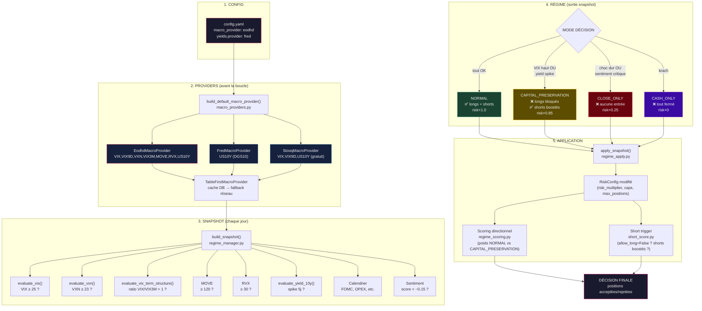
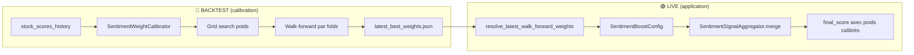

# Synthèse : Calcul des scores Long/Short, Sentiment, ML et Risk

> **Document généré le 2026-07-05** — à mettre à jour au fur et à mesure de la discussion.
> Projet Alpha Trade — `f:\projets`

---

## TABLEAU RÉCAPITULATIF (Quick Reference)

| Question | Réponse |
|----------|---------|
| **Comment on calcule les scores long ?** | `final_score = 0.50×(trend+vcp)/2 + 0.30×total_score + 0.20×RSI`, winsorisé puis normalisé [0,1], avec neutralisation sectorielle |
| **Comment on calcule les scores short ?** | Score baissier composite indépendant : 30% trend faible + 25% RSI bas + 25% prix<SMA50 + 20% prix<SMA200 |
| **Comment le sentiment impacte long/short ?** | Fusion ternaire : `w_quant×score + w_sentiment×sentiment_norm + w_macro×macro_norm`. Mais par défaut <span style="color:red">**`w_sentiment=0`, `w_macro=0`**</span> car IC non significatif |
| **Qu'est-ce que le forward sentiment ?** | Walk-forward calibration : exécute des backtests complets avec différentes pondérations du score fusionné (quant+sentiment+macro). Ne décide PAS sur le sentiment seul — chaque scénario utilise le moteur de backtest complet (stops, sizing, etc.). Produit `latest_best_weights.json` |
| **Son impact ?** | Les poids calibrés servent pour les **deux modes** : en LIVE via `SentimentBoostConfig`, en BACKTEST via la colonne `final_score_walk_forward` dans `stock_scores_history` (cascade `COALESCE`). Mais la calibration confirme que le quant seul est optimal |
| **Comment ML entraîne long/short ?** | LSTM 2 couches + Attention temporelle sur séquences de 20 jours. Features OHLCV + sentiment + contexte selector. Target = rendement forward binaire ou ternaire. Split chronologique avec purge |
| **Comment ML prédit ?** | Charge champion model → compute features → inférence → softmax → calibration Platt (binaire) ou Temperature Scaling (ternaire, 2026-06-25) → `predicted_proba` inséré en DB |
| **Comment le risque sélectionne ?** | 1) Regime scoring 2) Breakout filter (long+short depuis P1) 3) Score threshold 4) Concentration 5) Conviction = 0.70×quant + 0.30×ML 6) Corrélation filter 7) Factor constraints 8) Kelly/ATR sizing 9) Circuit breaker → Décision finale |
| **Backtest vs Live ?** | **Backtest** = rejoue l'historique depuis `stock_scores_history` (PIT), prédictions ML persistées, simulation in-memory. **Live** = recalcule tout en temps réel depuis `stock_bars_daily`, inférence ML live, vrais ordres Alpaca |
| **Qu'est-ce qui diffère entre long et short ?** | Short = score dédié indépendant du `final_score`, conviction inversée (`1-score`), proba ML distincte (`proba_short`), paramètres risk dédiés (max 2 positions, TP 8%, trailing 10%). Depuis P1 (2026-06-25) : breakout filter appliqué aussi aux shorts |
| **Comment sont calibrés les poids ?** | Grid search backtest sur `stock_scores_history` : conviction (quant/ML), sentiment (quant/sentiment/macro), Kelly (fraction, payoff). Métriques : IC, hit_rate, Sharpe, log_growth |
| **Comment le régime impacte les scores ?** | 2 jeux de poids : **NORMAL** (trend_vcp=0.50, total=0.30, rsi=0.20) vs **CAPITAL_PRESERVATION** (trend_vcp=0.25, total=0.15, rsi=0.10 + 0.50 défensif). Rotation forcée si perte > -3% sur 4 semaines. Shortscore non affecté, mais paramètres short boostés en bear (P2 2026-06-25) |
| **Pourquoi et comment les données macro ?** | Pipeline 5 étapes (§3.0.0) : `config.yaml` → `MacroDataProvider` → `build_snapshot()` chaque jour → mode de régime (normal/capital_preservation/close_only/cash_only) → `RiskConfig` → sélecteur. But = protection capital en période de stress. ⚠️ Si données manquantes → biais massif (cf. backtest `53bc6f10` : -43%) |
| **Champion selection ML ?** | ⚠️ Désactivé par défaut → toujours `lstm_attention`. Si activé : choisit entre LSTM, CatBoost, LightGBM, GlobalModel sur métrique `selection_score` |
| **Target optimization ?** | ⚠️ Désactivé par défaut. Grid search horizon×seuils UP×seuils DOWN. Score = trade_rate × class_balance × separation |
| **Paramètres spécifiques shorts ?** | Max 2 positions, TP 8%, trailing 10%, time-stop 20j, score min 0.30. Breakout filter actif (même min_breakout_days que longs). Conviction = 0.70×(1-score) + 0.30×proba_ml_short |
| **Caveats critiques ?** | Sentiment/macro désactivés (IC≈0), champion selection off, target optimization off, ✅ filtres régime corrigés, ✅ short_score PIT corrigé, ✅ slippage model backtest, ✅ ML réduit à 30% (70/30), ✅ breakout filter shorts, ✅ shorts boostés en bear, ✅ trackers persistés, ✅ calibration walk-forward short, ✅ cohérence short live/backtest/risk validée sur le périmètre audité |

---

## SOMMAIRE DES SECTIONS

| Section | Contenu | Mode |
|---------|---------|------|
| **0. Architecture Backtest vs Live** | Préface : 2 modes (LIVE/BACKTEST), rôle de `stock_scores_history` (PIT), cycle hybride walk-forward | — |
| **1. Calcul des scores Long/Short** | Formules `final_score` et `short_score`, facteurs techniques, neutralisation sectorielle, rank_and_select | 🟢 LIVE |
| **2. Utilisation du sentiment** | Pipeline FinBERT → agrégation → fusion ternaire → `final_score_sentiment`, poids par défaut (sentiment=0) | 🟢 LIVE |
| **3. Régime de Marché** | **3.0.0 Flux complet des données macro** (pourquoi, à quelle étape, dans quel but, schéma), 3.0 Indicateurs (VIX/VXN/VIX3M/MOVE/RVX), 3.1 Poids NORMAL vs CAPITAL_PRESERVATION, 3.2 MomentumRotationState (-3%/4sem), 3.3 Filtres défensifs (beta/spread/mcap/ATR), 3.4 Filtres `regime_filters.py` câblés (earnings/buyback/yield), 3.5 Asymétrie long/short, shorts boostés en bear (P2) | 🟢🔵 BOTH |
| **4. ML — Entraînement** | LSTM 2 couches + Attention temporelle, features V1/Expert/Sentiment/Selector/Cross-sectional, target binaire/ternaire | 🟢 LIVE |
| **5. ML — Prédiction** | Inférence (chargement artefacts → compute features → softmax → Platt/Temperature), drift monitoring (KS+PSI), kill-switch | 🟢 LIVE |
| **6. Module Risque** | Pipeline 9 étapes : regime scoring → breakout → threshold → concentration → conviction → corrélation → factor → Kelly/ATR → circuit breaker | 🟢🔵 BOTH |
| **7. Walk-Forward Sentiment** | Calibration OOS par folds (backtest complet par scénario, **long + short depuis P2 2026-06-25**), `latest_best_weights.json`, application LIVE + BACKTEST, cascade `COALESCE` | 🟣 HYBRIDE |
| **8. Calibration des Poids** | 3 niveaux : Conviction ✅, Sentiment ✅, Kelly ✅. IHM : onglets `📰 Calibrate sentiment`, `🎯 Calibrate conviction` (+ Kelly + `--backtest-kelly`), `🔄 Walk-forward conviction` (Sprint 4), `� Market-neutral` (Sprint 5), `�🚶 Walk-forward sentiment`, `🎛️ Trimestrielle`. Page `📊 Weights Calibration Runs` | 🟣 HYBRIDE |
| **9. ML — Détails avancés** | Champion selection (⚠️ off), target optimization (⚠️ off), business_score vs selection_score, threshold optimization | 🟢 LIVE |
| **10. Short — Spécificités** | Paramètres risk dédiés, tableau comparatif long/short, consommation du `short_score`, conviction short inversée | 🟢 LIVE |
| **11. Caveats** | 12 points d'attention : fonctionnalités désactivées, ✅ PIT corrigé, asymétries long/short, limites backtest, risques ML/Kelly | — |
| **12. Résumé Synthétique** | Tableau récapitulatif (rappel en fin de document) | — |
| **13. Backtest vs Live — Détail** | 8 sous-sections : sources, sentiment, ML, exécution, walk-forward, CLI, dégradation PIT par composant | — |
| **14. Glossaire** | Tous les fichiers clés avec leur mode (LIVE / BACKTEST / BOTH / HYBRIDE) | — |

---

## 0. ARCHITECTURE BACKTEST vs LIVE

Le système fonctionne selon **deux modes** radicalement différents qu'il faut bien distinguer.

### 🟢 Mode LIVE (production)

Le pipeline **calcule tout en temps réel** :

```
EODHD/API → stock_bars_daily → Screener → stock_scores
                                          → Selector → stock_scores (final_score)
News API  → FinBERT → ticker_daily_sentiment_features
                     → Signal Aggregator → stock_scores (final_score_sentiment)
                                          → ModelFactory → model_predictions
                                          → PortfolioBuilder → portfolio_targets
                                          → Execution Engine → Ordres Alpaca
```

- **Source de données** : `stock_bars_daily` (OHLCV temps réel), `stock_scores` (snapshot courant)
- **Sentiment** : calculé LIVE par `SentimentSignalAggregator.merge()` → persiste dans `stock_scores`
- **ML** : inférence LIVE par `predictor.py` → persiste dans `model_predictions`
- **Exécution** : vrais ordres Bracket OCO chez Alpaca (paper ou live)

### 🔵 Mode BACKTEST (recherche/calibration)

Le backtest **ne recalcule rien**, il **rejoue l'historique** à partir de snapshots PIT (Point-In-Time) :

```
stock_scores_history (PIT)  ──→  signal_replay.py (rejoue la fusion conviction)
model_predictions (DB)      ──→  simulator.py (simule les entrées/sorties in-memory)
stock_bars_daily (EODHD)    ──→  data_loader.py (charge l'OHLCV historique)
```

- **Source de données** : `stock_scores_history` (snapshots PIT quotidiens), `stock_bars_daily` avec `source='eodhd_eod'` uniquement
- **Sentiment** : déjà pré-calculé dans `stock_scores_history.final_score_sentiment` (pas de recalcul)
- **ML** : lit les prédictions déjà persistées dans `model_predictions` (pas d'inférence live)
- **Exécution** : simulation synthétique in-memory (fills parfaits au prix d'ouverture J+1, bracket stops simulés)

### 🔄 Table de snapshot PIT : `stock_scores_history`

C'est la **pierre angulaire** du backtest. Cette table est remplie par `backfill_scores_history.py` qui capture **chaque jour** l'état exact de `stock_scores` (scores, sentiment, walk-forward weights). Sans cette table, le backtest n'est pas strictement PIT et utilise un fallback dégradé.

### 🟣 Mode HYBRIDE : Walk-Forward Sentiment

La calibration des poids sentiment/macro/quant est un **méta-backtest** :
1. On exécute des **backtests complets** (moteur `BacktestEngine` normal : stops, sizing, corrélation, etc.) avec différentes combinaisons de poids — les décisions **ne sont pas basées sur le sentiment seul** mais sur le score fusionné `w_quant×score + w_sentiment×sentiment_norm + w_macro×macro_norm`
2. On évalue les performances OOS (Out-Of-Sample) par folds glissants
3. On sélectionne les meilleurs poids → sauvegardés dans `latest_best_weights.json`
4. Ces poids peuvent ensuite être appliqués **en LIVE** (via `SentimentBoostConfig`) **et en BACKTEST** (via la colonne `final_score_walk_forward` dans `stock_scores_history`, consommée par la cascade `COALESCE` de `data_loader.py`)

---

## 1. CALCUL DES SCORES LONG ET SHORT 🟢 LIVE

### 1.1 Architecture en 3 couches

Le calcul des scores est un pipeline à **3 étages** :

```
Screener → Selector (factors + ranking) → Signal Aggregator (sentiment boost)
```

### 1.2 Screener (`screener/pipeline.py`) — Score de base `total_score`

Le screener est le **premier filtre large**. Il produit pour chaque symbole un `total_score` ∈ [0,1] composé de :

$$total\_score = 0.15 \times liquidity\_val + 0.55 \times RSI\_norm + 0.30 \times historical\_range\_score$$

- **`liquidity_val`** : dollar volume moyen sur 20 jours, normalisé via winsorisation [1%, 99%] + min-max [0,1]
- **`RSI_norm`** : force relative vs SPY (relative strength index), normalisé
- **`historical_range_score`** : position du prix dans le range 2 ans (0 = au plus bas, 1 = au plus haut)

### 1.3 Selector (`selector/`) — Score technique `final_score`

Le **Selector** (`alpha_scanner.py`) calcule les facteurs techniques puis les fusionne.

#### a) Facteurs techniques (`selector/factors.py`)

La fonction `compute_factor_frame()` calcule ces facteurs **purs** (sans I/O) :

| Facteur | Description |
|---------|-------------|
| `trend_score` | Score Minervini (0-1) : position du prix vs MA50/150/200 + pente du MA200 |
| `vcp_score` | Volatility Contraction Pattern (0-1) : contraction de volatilité |
| `ma50/150/200` | Moyennes mobiles simples |
| `atr_20`, `atr_pct_20` | Average True Range (20j) |
| `beta_126` | Bêta vs SPY sur 126 jours |
| `high_52w_proximity` | Proximité du plus haut 52 semaines |
| `volatility_ratio` | Ratio vol 10j / vol 60j |
| `weekly_trend_score` | Tendance hebdomadaire (close vs MA10/MA30 weekly) |

#### b) Fusion des scores (`selector/ranking.py`) — `merge_scores()`

C'est le cœur du calcul. La formule produit un `final_score` ∈ [0,1] :

$$final\_score = w_{trend\_vcp} \times \frac{trend\_score + vcp\_score}{2} + w_{total\_score} \times total\_score_{norm} + w_{rsi} \times RSI_{norm}$$

Les poids **par défaut** (en régime `normal`) :
- `weight_trend_vcp` = **0.50** (momentum technique)
- `weight_total_score` = **0.30** (score screener)
- `weight_rsi` = **0.20** (force relative)

Chaque composante est **winsorisée** [1%, 99%] puis **normalisée** [0,1] via `winsorize_and_normalize()`.

#### c) Neutralisation sectorielle (`apply_factor_neutralization()`)

Applique un **z-score intra-secteur** sur `total_score` et `relative_strength_index` :

$$z\_score_{secteur} = \frac{x - \mu_{secteur}}{\sigma_{secteur}}$$

Puis re-normalise en [0,1]. Cela évite qu'un secteur entier soit sur/sous-représenté à cause d'un biais sectoriel.

#### d) Sélection finale (`rank_and_select()`)

1. Trie par `final_score` décroissant
2. Applique `apply_sector_neutrality()` : **round-robin** avec un plafond par secteur (`sector_cap_ratio`)
3. Sélectionne le **top N** (typiquement 20-30 positions)

---

### 1.4 Score Short dédié (`selector/short_score.py`)

Les shorts ne sont PAS les bottom-N du `final_score`. Ils utilisent un **score baissier composite** indépendant (0-1, plus c'est haut = plus baissier) :

$$short\_score = 0.30 \times (1 - trend\_score) + 0.25 \times (1 - \frac{RSI}{100}) + 0.25 \times \mathbf{1}[prix < SMA50] + 0.20 \times \mathbf{1}[prix < SMA200]$$

Les 4 facteurs :
1. **Trend faible** (30%) : `1 - trend_score` — un trend_score bas (ex: 0.1) donne 0.9 de contribution bearish
2. **RSI bas** (25%) : RSI < 40 → bearish (transformé linéairement)
3. **Prix sous SMA50** (25%) : booléen, +0.25 si sous la MM 50 jours
4. **Prix sous SMA200** (20%) : booléen, +0.20 si sous la MM 200 jours

La sélection short est faite par `rank_and_select_short()` qui trie par `short_score` décroissant, en excluant les symboles déjà sélectionnés en long.

#### Fichiers clés :
- `selector/short_score.py` — `compute_short_score()`, `enrich_with_short_score()`
- `selector/ranking.py` — `rank_and_select_short()`

---

## 2. UTILISATION DU SENTIMENT POUR LONG ET SHORT 🟢 LIVE

### 2.1 Pipeline Sentiment (`event_sentiment/`)

```
News API → ingestion.py → scoring.py (FinBERT) → aggregation.py → signal_aggregator.py → stock_scores
```

#### Niveau 1 — Scoring article par article (`scoring.py`)
- **FinBERT** (ProsusAI/finbert) classifie chaque article : `positive`, `neutral`, `negative`
- Produit un `sentiment_net` ∈ [-1, 1] et une `confidence` ∈ [0, 1]

#### Niveau 2 — Agrégation journalière (`aggregation.py`)
- `build_ticker_daily_features()` : par (symbole, date) → `sentiment_net_mean_1d`, `news_count_1d`, `major_event_flag`, etc.
- `build_sector_daily_features()` : par (secteur, date) → `sector_impact_score`, `macro_event_intensity`

#### Niveau 3 — Règles macro (`macro_rules.py`)
- Détection d'événements macro : FOMC, CPI, emploi, géopolitique, fiscal
- Propagation d'impact par secteur (ex: hausse des taux → négatif pour Tech, positif pour Financials)

### 2.2 Fusion Sentiment → Score (`signal_aggregator.py`)

Le `SentimentSignalAggregator.merge()` fusionne le score quantitatif avec le sentiment.

#### Étape 1 — Calcul du signal sentiment agrégé

Pour chaque symbole, on agrège les N derniers jours de sentiment avec **décroissance temporelle exponentielle** :

$$w_{jour} = 0.5^{\frac{age\_jours}{demi\_vie}}$$

Avec `demi_vie = 2` jours par défaut. Chaque jour est aussi pondéré par son `news_count`.

Condition d'activation : il faut au moins `min_news_count` articles (défaut = 2) pour que le signal soit actif.

#### Étape 2 — Normalisation

Le signal agrégé `sentiment_net_agg` ∈ [-1, 1] est transformé en [0, 1] :

$$sentiment\_signal\_norm = \frac{\mathrm{clamp}(sentiment\_net\_agg,\, -1,\, 1) + 1}{2}$$

0.5 = neutre, 0 = très négatif, 1 = très positif.

#### Étape 3 — Fusion ternaire (`fuse_sentiment()` dans `core/conviction.py`)

$$final\_score\_sentiment = w_{quant} \times final\_score + w_{sentiment} \times sentiment\_norm + w_{macro} \times macro\_norm$$

Le tout clippé dans [0, 1].

Si le signal sentiment n'est **pas actif** (pas assez de news), on utilise **0.5** (neutre) au lieu de `sentiment_norm`.

### 2.3 Poids et impact réel

**IMPORTANT** — Les poids par défaut sont :
- `quant_weight` = **1.00** (100% quantitatif)
- `sentiment_weight` = <span style="color:red">⚠️ **0.00** (désactivé par défaut !)</span>
- `macro_weight` = <span style="color:red">⚠️ **0.00** (désactivé par défaut !)</span>

**Pourquoi ?** Le diagnostic empirique (IC = Information Coefficient) sur 2020-2025 a montré :
- **Sentiment** : IC ≈ 0.01, t-stat ≈ 1.1 → **non significatif statistiquement**
- **Macro** : IC ≈ 0, t-stat ≈ 0 → **aucun pouvoir prédictif**
- **Quant** : IC ≈ 0.03, t-stat ≈ 2.5 → **seul signal significatif**

Donc **en production, le sentiment et les features macro (VXN, VIX3M, MOVE, RVX) n'ont pas d'impact par défaut**. Les poids sont laissés configurables pour exploration/calibration. Les nouveaux indicateurs de volatilité (VXN, VIX3M, MOVE) sont disponibles comme features ML optionnelles depuis le Sprint 2026-06-25 (checkboxes IHM, désactivées par défaut).

#### Fichiers clés :
- `event_sentiment/signal_aggregator.py` — `SentimentSignalAggregator`, `SentimentBoostConfig`
- `core/conviction.py` — `fuse_sentiment()`, `SentimentFusionWeights`

---

## 3. RÉGIME DE MARCHÉ — Impact sur les scores 🟢🔵 BOTH

### 3.0.0 Flux complet des données macro : pourquoi, à quelle étape, dans quel but

> **Ajouté le 2026-07-05** — cette section explique la chaîne complète, de `config.yaml` jusqu'à la décision de trading, et répond aux questions : pourquoi utiliser des données macro ? À quel moment précis sont-elles consommées ? Que se passe-t-il si elles sont manquantes ?

#### 🎯 Objectif final : protection du capital en période de stress

Les données macro (VIX, taux, volatilité obligataire...) n'interviennent **pas** dans le calcul du score des titres individuels. Elles servent à **piloter une couche défensive globale** qui, en période de stress marché, réduit automatiquement l'exposition, coupe les longs, et ne conserve que des shorts (ou ferme tout). C'est un **risk management macro** qui opère **avant** la sélection de titres.

#### 📋 Les 5 étapes du pipeline macro

##### Étape 1 — Configuration (`config.yaml`)

```yaml
market_regimes:
  enabled: true
  macro_provider: eodhd      # eodhd | stooq | composite | none
  yields:
    provider: fred           # default | stooq | eodhd | fred
```

C'est ici qu'on choisit **quelle source** fournira chaque indicateur macro. Le provider `eodhd` nécessite un token API valide (`EODHD_API_TOKEN`). Le provider `stooq` est gratuit et sans clé. Le provider `fred` utilise la clé `KEY_FRED` pour les taux US.

##### Étape 2 — Construction du `MacroDataProvider` (avant la boucle de backtest)

Dans `backtesting/cli/_impl.py` (~ligne 2198), **avant** de lancer la simulation jour par jour :

1. Lecture de `config.yaml`
2. Appel à `build_default_macro_provider()` (`service/market/macro_providers.py`)
3. Cette factory instancie le(s) bon(s) provider(s) : `EodhdMacroProvider`, `StooqMacroProvider`, `FredMacroProvider`, ou un `CompositeMacroProvider` (fallback en cascade)
4. Le provider est wrappé dans un `TableFirstMacroProvider` qui lit d'abord la table `stock_macro_indicators_daily` (cache DB), avec fallback réseau si absent
5. Il est passé à `build_phase2_risk_result()` → `risk_bridge.py`

##### Étape 3 — Pour chaque jour de trading : `build_snapshot()`

Dans `backtesting/risk_bridge.py` (~ligne 388), **pour chaque séance** de la période de backtest :

```python
snap = build_snapshot(
    trade_date,
    config=market_regimes_config,
    macro_provider=macro_provider,   # ← les données macro sont consommées ICI
    ...
)
```

Ce `build_snapshot()` (`service/market/regime_manager.py`) interroge le provider pour **7 indicateurs** :

| Signal | Méthode appelée | Ce qu'il mesure | Si manquant |
|--------|----------------|-----------------|-------------|
| **VIX** | `get_vix_close()` | Volatilité S&P 500 — si ≥ 25 → alerte | `vix_high=False` |
| **VIX9D** | `get_vix_short_term_close()` | VIX court terme vs spot → courbe inversée ? | `curve_inverted=False` |
| **VXN** | `get_vxn_close()` | Volatilité Nasdaq-100 — si ≥ 23 → alerte | `vxn_high=False` |
| **VIX3M** | `get_vix3m_close()` | Structure à terme VIX → ratio VIX/VIX3M > 1 = backwardation | `backwardation=False` |
| **MOVE** | `get_move_close()` | Volatilité obligataire ICE BofA — si ≥ 120 → alerte | `move_high=False` |
| **RVX** | `get_rvx_close()` | Volatilité Russell 2000 Small Caps — si ≥ 30 → alerte | `rvx_high=False` |
| **US10Y** | `get_us10y_history()` | Variation du taux 10 ans US sur 5 jours → spike ? | `yield_spike=False` |

Chaque indicateur est comparé à un seuil configurable. Si la valeur est **manquante** (API down, token invalide...), le signal est traité comme **non déclenché** (comportement `False` par défaut), et la qualité de donnée est marquée `missing`.

##### Étape 4 — Le snapshot détermine le mode de régime

Les signaux macro sont combinés pour produire un **mode de régime** parmi 4 niveaux de restriction croissante :

```
normal  →  capital_preservation  →  close_only  →  cash_only
```

| Mode | Nouvelles entrées | Longs | Shorts | Risk multiplier | Max positions |
|------|-------------------|-------|--------|----------------|---------------|
| `normal` | ✅ | ✅ | selon config | 1.00 | normal |
| `capital_preservation` | ✅ | ❌ (`allow_long=False`) | ✅ boostés | 0.85 | réduit |
| `close_only` | ❌ | ❌ | ❌ | 0.25 | 1 |
| `cash_only` | ❌ | ❌ | ❌ | 0.00 | 0 |

Le snapshot produit aussi des **caps défensifs** : `max_position_weight`, `max_sector_weight`, `max_gross_exposure`.

Un mécanisme d'**hystérésis** (`service/market/regime_manager.py` → `_apply_hysteresis()`) empêche les oscillations rapides : il faut plusieurs jours consécutifs de signaux pour entrer/sortir d'un mode défensif, et un temps de maintien minimum avant de pouvoir en sortir.

##### Étape 5 — Application au `RiskConfig` puis au sélecteur

Le snapshot est appliqué via `risk_management/regime_apply.py` → `apply_snapshot()` :
- Modifie le `RiskConfig` du jour (risk multiplier, max positions, caps)
- Le sélecteur (`selector/regime_scoring.py`) adapte les poids de scoring selon le régime :
  - **NORMAL** : 50% trend_vcp, 30% total_score, 20% RSI (momentum offensif)
  - **CAPITAL_PRESERVATION** : 25% trend_vcp, 15% total_score, 10% RSI + 50% facteurs défensifs (low beta, large cap, low vol)
- `selector/short_score.py` → `resolve_short_trigger()` décide si les shorts sont activés/boostés selon le régime

#### 🔄 Schéma du flux complet



#### ⚠️ Que se passe-t-il quand les données macro sont manquantes ?

C'est le **piège le plus dangereux** du système. Quand un indicateur est `missing` (ex: token EODHD invalide) :

1. Le signal correspondant est traité comme **non déclenché** (`vix_high=False`, etc.)
2. Cela donne l'illusion que « tout va bien » sur cet indicateur
3. Si **tous** les indicateurs de volatilité sont `missing` sauf l'US10Y (qui vient de FRED), le régime ne voit que les signaux de taux
4. Résultat : le moindre mouvement de taux déclenche `capital_preservation` → **longs bloqués**, seuls les shorts sont permis
5. Si le marché est haussier (ex: reprise post-COVID mai-sept 2020), **tous les shorts perdent**

**Cas réel documenté** (backtest `20260703_150341_53bc6f10`) :
- Token EODHD invalide → VIX/VXN/VIX3M/MOVE/RVX = `missing` sur **1487/1487 jours**
- US10Y via FRED = OK → spikes de taux détectés
- Régime : `capital_preservation` → `allow_long=False`
- Résultat : **98 shorts, 0 longs, 0% win rate, -43% de perte**

**Solutions** :
| Approche | Action | Coût |
|----------|--------|------|
| Changer de provider | `config.yaml` → `macro_provider: stooq` | Gratuit, sans token |
| Renouveler le token | Mettre à jour `EODHD_API_TOKEN` | Abonnement EODHD |
| Flag de contournement | `--allow-neutral-fallback-on-missing-macro-data` | Backtest dégradé (`data_quality=missing`) |
| Désactiver la couche | `macro_provider: none` | Plus de protection macro |

---

### 3.0 Indicateurs Macro de Volatilité (Sprint 2026-06-25)

Depuis le 2026-06-25, le `RegimeManager` intègre **8 indicateurs macro** (contre 3 auparavant) :

| Indicateur | Source | Seuil | Impact sur le régime |
|-----------|--------|-------|---------------------|
| **VIX** | `VIX.INDX` (CBOE) | ≥ 25 → capital_preservation | Volatilité S&P 500 |
| **VIX9D** | `VIX9D.INDX` | Inversion courbe (VIX9D > VIX) | Stress court terme |
| **VXN** | `VXN.INDX` (CBOE) | ≥ 23 → capital_preservation | Volatilité NASDAQ-100 |
| **VIX3M** | `VIX3M.INDX` | Ratio VIX/VIX3M > 1 → backwardation | Term structure : panique court terme |
| **MOVE** | `MOVE.INDX` (ICE BofA) | ≥ 120 → capital_preservation | Volatilité obligataire US |
| **RVX** | `RVX.INDX` (CBOE) | ≥ 30 → capital_preservation | Volatilité Russell 2000 (Small Caps) |
| **US10Y** | `US10Y.INDX` / FRED `DGS10` | Variation 5j anormale | Taux souverain US |
| **Sentiment** | `ticker_daily_sentiment_features` | Score < −0.15 → warning | Circuit breaker sentiment |

Ces indicateurs sont stockés dans **`stock_macro_indicators_daily`** — la source unique de vérité pour le LIVE et le BACKTEST. Le `TableFirstMacroProvider` lit d'abord la DB (cache), avec fallback EODHD en cas d'absence.

**Backfill** : l'IHM `📊 Régime Marché` permet de réalimenter la table via `populate_macro_indicators_table()` sur une plage de dates.

**ML** : les 4 nouveaux indicateurs (VXN, VIX3M, MOVE, RVX) sont disponibles comme features macro pour l'entraînement LSTM via des checkboxes dans l'IHM `Exécution → Model Factory`. Désactivés par défaut (`False`), activables individuellement.

#### 3.0.1 Détail des 4 indicateurs macro utilisables comme features ML

Ces indicateurs sont chargés depuis `stock_macro_indicators_daily` et injectés comme colonnes supplémentaires dans le DataFrame d'entraînement. Chaque feature dérivée est décrite ci-dessous.

##### VIX — CBOE Volatility Index (S&P 500)

| Feature ML | Formule | Signification |
|-----------|---------|---------------|
| `vix_close` | Valeur brute du VIX | Niveau de peur/stress sur le S&P 500. <20 = complaisance, 20-30 = volatilité normale, >30 = panique |
| `vix_momentum_5j` | `vix / vix.shift(5) - 1` | Variation du VIX sur 5 jours. Une hausse rapide (>+20%) signale un **choc entrant** — les shorts deviennent plus probables |

**Pourquoi c'est utile au ML** : le VIX est LE baromètre universel. Quand il monte, TOUS les symboles sont affectés — les corrélations explosent, les shorts deviennent plus rentables, les longs plus risqués. C'est la feature macro la plus impactante.

**Résultat empirique (run 2026-07-02)** : l'ajout du VIX améliore `f1_flat` de +155% (0.16→0.32) mais réduit `f1_short` (-26%). Le modèle devient plus conservateur, il identifie mieux quand **ne pas trader**. Trade-off défensif.

##### VXN — CBOE NASDAQ-100 Volatility Index

| Feature ML | Formule | Signification |
|-----------|---------|---------------|
| `vxn_close` | Valeur brute du VXN | Volatilité implicite du NASDAQ-100 (tech-heavy). Plus élevé que le VIX car la tech est plus volatile |
| `vxn_spread_vix` | `vxn - vix` | Écart VXN−VIX. S'élargit quand la tech est **spécifiquement** stressée (ex: correction sectorielle) vs stress général |

**Pourquoi c'est utile au ML** : le spread VXN−VIX isole le **stress spécifique à la tech**. Si VXN monte mais VIX reste calme → les valeurs tech sont ciblées, pas le marché entier. Permet au ML de distinguer un sell-off sectoriel d'une panique générale.

##### VIX3M — CBOE 3-Month VIX Futures Index

| Feature ML | Formule | Signification |
|-----------|---------|---------------|
| `vix3m_close` | Valeur brute du VIX3M | Attente de volatilité à 3 mois. Normalement supérieur au VIX (contango) |
| `vix_term_structure_ratio` | `vix / vix3m` | Ratio court/long terme. >1 = **backwardation** (panique), <1 = contango (normal) |
| `vix_backwardation` | `1 si vix > vix3m, 0 sinon` | Flag binaire de backwardation. Signal de **stress extrême** — le marché anticipe un désastre immédiat |

**Pourquoi c'est utile au ML** : la backwardation est l'un des **meilleurs signaux directionnels macro**. Quand le VIX dépasse le VIX3M (ratio >1), c'est que le marché anticipe une crise imminente — les shorts gagnent, les longs perdent. C'est un signal binaire puissant que le LSTM peut apprendre à exploiter. Contrairement au niveau absolu du VIX, la structure par terme a un **vrai pouvoir prédictif directionnel**.

##### MOVE — ICE BofA MOVE Index

| Feature ML | Formule | Signification |
|-----------|---------|---------------|
| `move_close` | Valeur brute du MOVE | Volatilité implicite du marché obligataire US (Treasuries). Équivalent du VIX pour les bonds |

**Pourquoi c'est utile au ML** : le MOVE capture un **stress orthogonal aux actions** — les crises de dette, les paniques de taux, les chocs de duration. Quand le MOVE spike mais le VIX reste calme → le problème est sur les taux, pas les actions (ex: crise des banques régionales 2023, taper tantrum 2013). Utile pour prédire les rotations sectorielles (financials, utilities, REITs).

#### 3.0.2 Stratégie d'activation recommandée

| Ordre | Indicateur | Effet attendu | Priorité |
|-------|-----------|---------------|----------|
| 1️⃣ | **VIX** | Améliore la détection du "quand ne pas trader" (f1_flat ↑). Signal défensif, pas directionnel | ✅ Testé 2026-07-02 |
| 2️⃣ | **VIX3M** | Signal directionnel via backwardation. Le plus prometteur pour f1_short/long | 🔄 Prochain test |
| 3️⃣ | **VXN** | Stress spécifique tech. Utile si l'univers est tech-heavy | ⚪ P3 |
| 4️⃣ | **MOVE** | Stress obligataire. Signal orthogonal, diversification alpha | ⚪ P3 |

### 3.1 Poids directionnels par régime (`selector/regime_scoring.py`)

Le régime de marché modifie les poids de composition du `final_score`. Deux jeux de poids :

#### NORMAL (marché haussier/neutre)

| Facteur | Poids |
|---------|-------|
| `trend_vcp` (momentum) | **0.50** |
| `total_score` (qualité) | **0.30** |
| `rsi` (force relative) | **0.20** |
| `defensive_beta` | 0.00 |
| `defensive_size` | 0.00 |
| `defensive_low_vol` | 0.00 |

#### CAPITAL_PRESERVATION (marché baissier/défensif, calibré 2026-06-17)

| Facteur | Poids |
|---------|-------|
| `trend_vcp` (momentum) | **0.25** |
| `total_score` (qualité) | **0.15** |
| `rsi` (force relative) | **0.10** |
| `defensive_beta` (low beta) | **0.22** |
| `defensive_size` (large cap) | **0.13** |
| `defensive_low_vol` (low volatility) | **0.15** |

**Logique** : en régime `capital_preservation`, ~50% du poids est transféré du momentum vers des facteurs défensifs (low beta, large cap, low vol). Le momentum reste à 25% car l'analyse a montré que les trades momentum restent rentables même en marché baissier, mais la volatilité excessive déclenche le circuit breaker.

**Filtres défensifs additionnels** appliqués uniquement en `capital_preservation` :

| Filtre | Seuil |
|--------|-------|
| Market cap minimum | $2B |
| Spread max | 15 bps |
| Beta max | 1.2 |
| ATR% max | 6% |

### 3.2 MomentumRotationState — Rotation forcée

Mécanisme automatique qui force le passage en mode défensif même en régime `normal` :

- **Fenêtre** : 4 semaines (~20 jours de trading)
- **Seuil** : rendement cumulé du portefeuille < **-3%**
- **Action** : si le portefeuille perd plus de 3% sur 4 semaines → bascule forcée vers les poids `CAPITAL_PRESERVATION`

$$rotation\_active = \mathbf{1}[\, return_{cumul\_4w} < -0.03 \,]$$

### 3.3 Filtres de régime (`selector/regime_filters.py`) — earnings, buyback, yield

✅ **Ces filtres sont désormais câblés en production ET en backtest depuis le 2026-06-25 (P0 #4).** Ils sont appelés via `apply_full_regime_to_candidates()` dans `portfolio_builder.py` (live) et `risk_bridge.py` (backtest), appliqués dans TOUS les régimes (pas seulement défensif).

| Filtre | Comportement | Impact | Actif ? |
|--------|-------------|--------|---------|
| `earnings_shield` | `strict_block` : exclut les symboles à J-2/J+2 des earnings. `negative_score` : applique un score négatif | Long + Short | <span style="color:green">**✅ câblé 2026-06-25**</span> |
| `buyback_blackout` | Multiplie le score par ~0.70 pour les symboles en période de blackout pré-earnings | Long + Short | <span style="color:green">**✅ câblé 2026-06-25**</span> |
| `yield_filter` | Exclut les secteurs sur liste noire (taux élevés) et les symboles bloqués | Long + Short | <span style="color:green">**✅ câblé 2026-06-25**</span> |

### 3.4 Impact Long vs Short

**Asymétrie importante** :
- **Long** : le `final_score` est recalculé avec les poids du régime → impact direct sur le classement
- **Short** : utilise `short_score` (colonne indépendante), **non affecté** par `apply_regime_weights()`. **Mais depuis P2 (2026-06-25)** : les paramètres de tagging short (`max_short_positions`, `min_score_for_short`) sont boostés en `capital_preservation` (4 positions, score min 0.20) pour plus d'agressivité en bear market
- **Filtres défensifs** (beta, spread, market cap, ATR) : appliqués au DataFrame **avant** ranking → affectent **les deux** (long et short)

---

## 4. ML — ENTRAÎNEMENT LONG ET SHORT 🟢 LIVE (training offline)

### 4.1 Architecture du modèle (`modelFactory/model.py`)

Le modèle est un **LSTM + Attention Temporelle** :

```
Input [batch, seq_len, n_features]
  → LSTM multi-couche (2 couches, hidden=128, dropout=0.3)
  → Temporal Soft-Attention (pondère les pas de temps)
  → Dropout
  → Linear(hidden, num_classes)
  → Softmax → probabilités
```

#### Modes de classification

| Mode | Classes | Description |
|------|---------|-------------|
| `binary` | 2 classes | 0 = baisse/flat, 1 = hausse |
| `ternary` | 3 classes | 0 = short (baisse), 1 = flat (neutre), 2 = long (hausse) |

En mode ternaire, les poids de classe sont asymétriques pour contrer le déséquilibre : `[1.5, 1.0, 1.5]` (short, flat, long).

### 4.2 Features utilisées (`modelFactory/features.py`)

#### Features V1 (13 colonnes) — dérivées OHLCV
`daily_return, log_return, intraday_range, overnight_gap, close_to_vwap, volume_ratio_20, rolling_volatility_20, rolling_volatility_60, rolling_mean_return_5, rolling_mean_return_20, rsi_14, atr_14_norm, is_filled`

#### Features Expert (18 colonnes supplémentaires)
Distances aux SMA/EMA, momentum, force relative vs marché, régimes bull/risk-off

> **Activation IHM** : dans l'onglet « Exécution » → bloc « ML — Hyperparams », dropdown **`ML — feature set`** → choisir `expert`. **C'est le défaut** (`DEFAULT_ML_FEATURE_SET = "expert"` dans `ihm/services/pipeline_ml_defaults.py`). Le flag CLI correspondant est `--feature-set expert`.

#### Features Sentiment (4 colonnes) — si `include_sentiment_features=True`
`sentiment_net_mean_1d, sentiment_confidence_mean_1d, news_count_log, major_event_flag`

> **Activation IHM** : case à cocher **`Inclure les features sentiment`** (défaut : ❌ `False`). CLI : `--include-sentiment`.

#### Features Contexte Selector (23 colonnes) — si `include_selector_context_features=True`
`trend_score, vcp_score, final_score, short_score, market_cap, beta_126, spread_bps, days_to_earnings`, etc.

> **Activation IHM** : case à cocher **`Inclure les features contexte selector`** (défaut : ❌ `False`, `DEFAULT_ML_INCLUDE_SELECTOR_CONTEXT`). CLI : `--include-selector-context`.

#### Features Cross-Sectionnelles — si `enable_cross_sectional=True`
Rangs cross-sectionnels dans l'univers (ret_20_rank, relative_strength_rank, volatility_rank, dollar_volume_rank)

> **Récapitulatif des défauts IHM** : `feature_set=expert` ✅, `include_sentiment=False`, `include_selector_context=False`, `include_short_score=False`. Soit **~31 colonnes** au total (13 V1 + 18 expert) par défaut, +4 sentiment / +23 selector / +1 short_score si activés.

### 4.3 Target (étiquette à prédire)

La target est construite par `build_target()` :

- **Binary** : `1` si le rendement forward (J+horizon) > `target_threshold_up` (ex: +2%), sinon `0`
- **Swing Cash** : `1` si rendement > seuil UP, `0` si rendement < seuil DOWN, `NaN` (ignoré) si entre les deux

$$target\_binary = \mathbf{1}[\, r_{t,\, t+horizon} > threshold\_up \,]$$

### 4.4 Pipeline d'entraînement (`modelFactory/trainer.py`)

```python
# 1. Chargement des données
bars_df = load_symbol_bars(symbol, start, end)
sentiment_df = load_symbol_sentiment(symbol)    # optionnel
selector_df = load_symbol_selector_context(symbol)  # optionnel
benchmark_df = load_benchmark_bars()

# 2. Feature engineering
features_df = compute_features(bars_df, sentiment_df, benchmark_df, selector_df)

# 3. Split chronologique (pas de shuffle !)
train, val, test = chrono_split(features_df, train_ratio=0.70, val_ratio=0.15)

# 4. Scaling (StandardScaler)
scaler = FeatureScaler().fit(train)
train_scaled = scaler.transform(train)

# 5. Dataset de séquences (seq_len=20 jours)
train_dataset = SequenceDataset(train_scaled, seq_len=20, target_col="target")

# 6. Training PyTorch Lightning
model = LSTMAttentionModule(input_size=n_features, hidden_size=128, num_layers=2, dropout=0.3)
trainer = L.Trainer(max_epochs=50, callbacks=[EarlyStopping, ModelCheckpoint])
trainer.fit(model, train_loader, val_loader)

# 7. Calibration Platt (optionnelle)
calibrator = PlattCalibrator()
calibrator.fit(val_margins, val_labels)

# 8. Challengers optionnels (CatBoost, LightGBM)
catboost_metrics = run_catboost_baseline(train, val, test)
lightgbm_metrics = run_lightgbm_baseline(train, val, test)

# 9. Sélection du champion
champion = select_champion(lstm_metrics, catboost_metrics, lightgbm_metrics)
```

### 4.5 Walk-forward ML (`generate_walk_forward_splits()`)

Le trainer supporte aussi le **walk-forward ML** : on entraîne sur des fenêtres glissantes (expanding window) pour valider la robustesse temporelle.

#### Fichiers clés :
- `modelFactory/model.py` — `LSTMAttentionModule`, `LSTMAttentionClassifier`, `TemporalAttention`
- `modelFactory/trainer.py` — `train_symbol()`
- `modelFactory/features.py` — `compute_features()`, `get_feature_columns()`
- `modelFactory/dataset.py` — `SequenceDataset`, `chrono_split()`, `FeatureScaler`

### 4.6 LSTM vs LightGBM vs CatBoost — quel modèle pour quel symbole ?

Le système supporte **3 architectures** différentes. En pratique aujourd'hui (`champion_selection=off`), **LSTM est toujours utilisé**. Les deux autres sont des challengers optionnels qui pourraient être promus par symbole si la sélection champion était activée.

| Architecture | Type | Apprentissage | Force | Faiblesse |
|---|---|---|---|---|
| **LSTM** (`lstm_attention`) | Deep Learning | Séquences de 20 jours, 2 couches LSTM + Attention temporelle | Capture les **patterns temporels** complexes : "3 jours de baisse + gap → rebond J+4" | Besoin de **beaucoup de données** (≥3 ans). Lent à entraîner. Overfit facilement |
| **LightGBM** | Gradient boosting (arbres) | Tabulaire : une ligne = un jour, features OHLCV + contexte | **Robuste avec peu de données** (≥1 an). Rapide. Moins sensible au bruit. Excellent sur données tabulaires peu profondes | Pas de mémoire temporelle. Ne "voit" pas les séquences — chaque jour est indépendant |
| **CatBoost** | Gradient boosting (arbres) | Idem LightGBM, mais gère mieux les features catégorielles | Mêmes avantages que LightGBM + **meilleure généralisation** par défaut (ordered boosting). Bon sur petits datasets | Pas de mémoire temporelle. Un peu plus lent que LightGBM |

#### Différence conceptuelle

```
LSTM (deep learning)                   LightGBM / CatBoost (arbres)
─────────────────────                   ──────────────────────────
Apprend des PATTERNS TEMPORELS         Apprend des RÈGLES TABULAIRES
"Après 3 jours de baisse               "Si RSI < 30 ET volume > moyenne
 suivis d'un gap up,                   ET spread < 10bps → hausse
 le jour 4 monte"                      probable"

✅ Capture les dépendances             ✅ Robuste avec peu de données
   séquentielles complexes             ✅ Plus rapide à entraîner
❌ Besoin de beaucoup de données       ✅ Moins sensible au bruit
❌ Lent à entraîner                    ❌ Pas de mémoire temporelle
❌ Overfit facilement                   ❌ Features doivent être bien choisies
```

#### Quel modèle pour quel symbole ?

| Profil du symbole | Modèle recommandé | Raison |
|---|---|---|
| **AAPL, MSFT, SPY** — 10+ ans d'historique, très liquide | **LSTM** | Beaucoup de séquences → le LSTM peut apprendre des patterns temporels fiables |
| **Small cap, IPO récente** — 1-3 ans d'historique, volatil | **CatBoost** ou **LightGBM** | Peu de données → les arbres généralisent mieux, moins de risque d'overfit |
| **Mid cap, secteur cyclique** — 5 ans, patterns saisonniers | **LSTM** (si assez de données) ou **CatBoost** | Mix : le LSTM peut capturer les cycles, CatBoost plus robuste si bruité |

#### Comment ça fonctionne en pratique ?

1. **Entraînement** : LSTM est **toujours** entraîné. LightGBM/CatBoost sont entraînés **seulement si** les checkboxes IHM sont cochées (`ml_enable_lightgbm`, `ml_enable_catboost` → flags `--compare-lightgbm`, `--enable-catboost`). Les checkboxes sont cochées par défaut dans l'IHM.

2. **Sélection champion** : Si `ml_select_champion=True` (checkbox IHM, défaut `True`), le système choisit automatiquement le meilleur modèle pour chaque symbole après N runs (quarantaine). Si `False` ou si aucun challenger n'est éligible → fallback `lstm_attention`.

   > ⚠️ **Faut-il activer la sélection champion ?**
   >
   > **Pour l'instant, garde `ml_select_champion` décoché (off).** Les raisons :
   > - La sélection champion exige une **quarantaine** : un challenger (LightGBM, CatBoost) doit avoir été entraîné **au moins 3 fois** (3 runs distincts) avant d'être éligible comme champion. C'est une protection contre la chance : un modèle qui a eu un bon score sur un seul run n'est pas forcément meilleur.
   > - Tant que tu n'as pas exécuté ML Train **3 fois ou plus** avec les challengers activés, aucun challenger n'est éligible → la sélection retourne toujours `lstm_attention` (le fallback)
   > - Activer sans avoir accumulé assez de métriques revient à ne rien changer, mais avec un risque théorique de promouvoir un modèle sous-testé
   >
   > **Qu'est-ce qu'un « run » ?** Chaque fois que tu lances **ML Train** (étape 9 du pipeline, ou `python -m modelFactory train`), c'est **1 run**. Chaque run produit une ligne dans `model_metrics` par symbole et par architecture (lstm_attention, lightgbm, catboost). Exemple :
   >
   > ```
   > Jour 1 : ML Train → run #1 → métriques AAPL (lstm ✅, lightgbm ✅, catboost ✅)
   > Jour 2 : ML Train → run #2 → métriques AAPL (lstm ✅, lightgbm ✅, catboost ✅)
   > Jour 5 : ML Train → run #3 → métriques AAPL (lstm ✅, lightgbm ✅, catboost ✅)
   >                                          ↑ maintenant lightgbm et catboost ont 3 runs
   >                                            → ils deviennent éligibles pour la sélection champion
   > ```
   >
   > ⚠️ **Ne pas confondre les 3 opérations ML :**
   >
   > | Opération | IHM (étape) | Ce qu'elle fait | Table impactée | Compte comme un « run » ? |
   > |---|---|---|---|---|
   > | **ML Train** | Étape 9 | Entraîne/réentraîne les modèles (LSTM, LightGBM, CatBoost) → produit `.ckpt`, `.pkl` | `model_metrics`, `model_training_run` | ✅ **Oui** — c'est ça un run |
   > | **ML Predict** | Étape 10 | Inférence : utilise les modèles déjà entraînés pour prédire → `predicted_proba` | `model_predictions` | ❌ Non — ne génère pas de métriques |
   > | **Backtest** | Page Backtesting | Consomme `model_predictions` + `stock_scores_history` pour simuler le trading | `portfolio_entries`, etc. | ❌ Non — ne réentraîne pas |
   >
   > **Est-ce que chaque run écrase les modèles précédents ?** Oui. Chaque `ML Train` **écrase** les fichiers dans `artifacts/models/{symbol}/` — seul le dernier checkpoint survit sur disque. Mais ce n'est pas un problème pour la sélection champion, car elle ne compare **pas les checkpoints** : elle lit les **métriques accumulées dans `model_metrics`** (DB), où chaque run a son propre `run_id`. Exemple après 3 runs sur la même période 2020-2025 :
   >
   > ```
   > artifacts/models/AAPL/lstm_attention.ckpt  ← écrasé à chaque run, seul le dernier survit
   > artifacts/models/AAPL/lightgbm.txt          ← idem
   > artifacts/models/AAPL/catboost.cbm          ← idem
   >
   > MAIS dans model_metrics (DB) :
   > run_id    | symbol | model_type      | sharpe | accuracy
   > abc123    | AAPL   | lstm_attention  | 0.72   | 0.58
   > abc123    | AAPL   | lightgbm        | 0.68   | 0.56     ← run #1
   > def456    | AAPL   | lstm_attention  | 0.75   | 0.59
   > def456    | AAPL   | lightgbm        | 0.81   | 0.61     ← run #2 : LightGBM meilleur !
   > ghi789    | AAPL   | lstm_attention  | 0.70   | 0.57
   > ghi789    | AAPL   | lightgbm        | 0.79   | 0.62     ← run #3 : LightGBM confirme
   >                                      ↑ 3 runs, LightGBM > LSTM 2 fois sur 3
   >                                        → champion selection promeut LightGBM
   >                                        → le checkpoint LightGBM utilisé = celui du run #3
   > ```
   >
   > **En pratique pour ton usage actuel :** si tu entraînes une fois puis fais prédictions + backtests, tu n'as qu'**1 run** → laisse `ml_select_champion` décoché, il ne sert à rien de le cocher. La quarantaine (3 runs) est conçue pour un usage où tu **réentraînes régulièrement** (ex. chaque semaine avec des données fraîches), ce qui accumule des runs naturellement.
   >
   > **Quand l'activer** (futur) :
   > 1. Garder `ml_enable_lightgbm=True` et `ml_enable_catboost=True` (déjà cochés par défaut)
   > 2. Lancer ML Train au moins **3 fois** (3 jours différents, ou 3 configs différentes) pour accumuler des métriques comparatives
   > 3. Puis cocher `ml_select_champion=True` — le système pourra alors promouvoir LightGBM pour AAPL et CatBoost pour TSLA si les métriques le justifient
   > 4. Vérifier dans `model_metrics` qu'il y a bien ≥3 runs par challenger :
   >    ```sql
   >    SELECT symbol, model_type, COUNT(*) AS runs
   >    FROM model_metrics
   >    GROUP BY symbol, model_type
   >    ORDER BY symbol, model_type;
   >    ```
   >
   > **Où dans l'IHM ?** Page **Pipeline / Exécution** → section **Paramètres Model Factory** → colonne de droite :
   > - ☑ `Entraîner aussi LightGBM (challenger)` → `ml_enable_lightgbm`
   > - ☑ `Entraîner aussi CatBoost (challenger)` → `ml_enable_catboost`
   > - ☑ `Activer la sélection automatique du champion` → `ml_select_champion`
   >
   > **⚠️ Protocole complet pour activer la sélection champion (4 runs) :**
   >
   > ```
   > ┌─────────────────────────────────────────────────────────┐
   > │ RUNS 1 À 3 : accumuler les métriques challengers        │
   > │                                                         │
   > │ IHM :                                                   │
   > │   ☑ Entraîner aussi LightGBM (challenger)               │
   > │   ☑ Entraîner aussi CatBoost (challenger)               │
   > │   ☐ Activer la sélection automatique du champion ← OFF  │
   > │                                                         │
   > │ → Lancer ML Train 3 fois                                │
   > │ → Vérifier avec :                                       │
   > │   SELECT symbol, model_type, COUNT(*) AS runs           │
   > │   FROM model_metrics                                    │
   > │   GROUP BY symbol, model_type                           │
   > │   HAVING model_type IN ('lightgbm','catboost');         │
   > │ → Doit retourner ≥ 3 runs par symbole par challenger    │
   > └─────────────────────────────────────────────────────────┘
   >                          ↓
   > ┌─────────────────────────────────────────────────────────┐
   > │ RUN 4 : activer la sélection champion                   │
   > │                                                         │
   > │ IHM :                                                   │
   > │   ☑ Entraîner aussi LightGBM (challenger)               │
   > │   ☑ Entraîner aussi CatBoost (challenger)               │
   > │   ☑ Activer la sélection automatique du champion ← ON   │
   > │                                                         │
   > │ → Lancer ML Train                                       │
   > │ → Le système compare LSTM vs LightGBM vs CatBoost       │
   > │   sur les métriques historiques (≥3 runs)               │
   > │ → Promeut le meilleur modèle par symbole                │
   > │ → Fallback lstm_attention si pas assez de données       │
   > └─────────────────────────────────────────────────────────┘
   > ```
   >
   > **Pourquoi 3 runs avant d'activer ?** La quarantaine (`champion_min_runs=3`) exige qu'un challenger ait été entraîné au moins 3 fois avant d'être éligible. Sans ça, cocher `ml_select_champion` n'a aucun effet — le système retombe toujours sur `lstm_attention`.
   >
   > **Pourquoi ne PAS cocher `ml_select_champion` pendant les runs 1-3 ?** Ça ne change rien (fallback de toute façon), mais ça évite toute confusion. Garde-le décoché jusqu'à ce que les 3 runs soient accumulés.
   >
   > **Faut-il aussi activer `GlobalModel` ?** Non. Le GlobalModel est un 4ème challenger qui nécessite le même processus de quarantaine. Active-le seulement si tu veux comparer 4 architectures au lieu de 3.
   >
   > **Faut-il activer `Optimiser le seuil de décision` ?** Non, surtout pas en mode ternaire. Cette option est conçue pour le mode **binaire** (un seuil unique "proba > X → long"), pas pour le mode ternaire où la décision se fait par `argmax` sur 3 probabilités. L'activer en ternaire produit des résultats non interprétables.

3. **Fallback** : Si le champion sélectionné est corrompu ou manquant → fallback automatique vers `lstm_attention`. Aucun risque de régression.

### 4.7 Monitoring des métriques ML ternaires (`model_metrics`)

Après chaque entraînement, les métriques par split (val / test / wf) sont persistées dans `model_metrics`. Voici comment les lire et les interpréter.

#### 4.7.1 Requêtes de monitoring

**Requête A — Tous les modèles (comparaison des architectures)**

Compare les métriques de LSTM, LightGBM et CatBoost côte à côte sur tout l'univers. Utile pour identifier quelle architecture performe le mieux globalement, quel que soit le champion élu.

```sql
SELECT mm.model_name,
       mm.split_name,
       COUNT(DISTINCT mm.symbol) AS nb_symbols,
       ROUND(AVG(mm.f1_macro), 3) AS avg_f1m,
       ROUND(AVG(mm.f1_short), 3) AS avg_f1s,
       ROUND(AVG(mm.f1_flat), 3) AS avg_f1f,
       ROUND(AVG(mm.f1_long), 3) AS avg_f1l,
       SUM(CASE WHEN mm.f1_short > 0 THEN 1 ELSE 0 END) AS with_short,
       SUM(CASE WHEN mm.f1_long > 0 THEN 1 ELSE 0 END) AS with_long,
       SUM(CASE WHEN mm.f1_short > 0 AND mm.f1_long > 0 THEN 1 ELSE 0 END) AS with_both
FROM model_metrics mm
JOIN model_training_run mtr ON mm.run_id = mtr.run_id
WHERE mtr.started_at >= (
    SELECT MAX(started_at) FROM model_training_run WHERE status = 'completed'
) - INTERVAL 300 MINUTE
GROUP BY mm.model_name, mm.split_name
ORDER BY mm.model_name, FIELD(mm.split_name, 'val', 'test', 'wf');
```

**Requête B — Champions uniquement (qualité du modèle servi en inférence)**

Ne garde que les métriques du modèle élu champion pour chaque symbole (via `model_governance.is_selected_model = 1`). C'est la requête qui répond à la question : « quelle est la qualité réelle des prédictions qui seront utilisées en production ? »

```sql
SELECT mm.model_name,
       mm.split_name,
       COUNT(DISTINCT mm.symbol) AS nb_symbols,
       ROUND(AVG(mm.f1_macro), 3) AS avg_f1m,
       ROUND(AVG(mm.f1_short), 3) AS avg_f1s,
       ROUND(AVG(mm.f1_flat), 3) AS avg_f1f,
       ROUND(AVG(mm.f1_long), 3) AS avg_f1l,
       SUM(CASE WHEN mm.f1_short > 0 THEN 1 ELSE 0 END) AS with_short,
       SUM(CASE WHEN mm.f1_long > 0 THEN 1 ELSE 0 END) AS with_long,
       SUM(CASE WHEN mm.f1_short > 0 AND mm.f1_long > 0 THEN 1 ELSE 0 END) AS with_both
FROM model_metrics mm
JOIN model_training_run mtr ON mm.run_id = mtr.run_id
JOIN model_governance mg ON mg.run_id = mm.run_id AND mg.symbol = mm.symbol AND mg.model_name = mm.model_name
WHERE mtr.started_at >= (
    SELECT MAX(started_at) FROM model_training_run WHERE status = 'completed'
) - INTERVAL 300 MINUTE
  AND mg.is_selected_model = 1
GROUP BY mm.model_name, mm.split_name
ORDER BY mm.model_name, FIELD(mm.split_name, 'val', 'test', 'wf');
```

> **Quelle requête utiliser ?**
>
> | Requête | Usage | Quand |
> |---------|-------|-------|
> | **A — Tous** | Comparer LSTM vs LightGBM vs CatBoost sur tout l'univers | Après chaque run, pour voir si une architecture surpasse les autres |
> | **B — Champions** | Mesurer la qualité du modèle qui sera **effectivement** utilisé en inférence | Avant de lancer ML Predict, pour valider que les champions sont de bonne qualité |
>
> ⚠️ **Ne pas utiliser `WHERE run_id = (SELECT MAX(run_id) FROM model_metrics)`** — chaque symbole a son propre `run_id`, donc `MAX(run_id)` ne donne qu'**un seul symbole**. Les requêtes ci-dessus avec `JOIN model_training_run` sur `started_at` agrègent **tous** les symboles du dernier batch d'entraînement.
>
> **Colonne `model_name`** : depuis le 2026-07-07, `model_metrics` inclut une colonne `model_name` (`lstm_attention`, `lightgbm`, `catboost`). Les métriques des 3 challengers sont persistées (val + test uniquement pour les tabulaires, val + test + wf pour le LSTM). Le `GROUP BY model_name, split_name` permet de comparer les performances par architecture.

#### 4.7.2 Définition des colonnes

| Colonne | Formule | Signification |
|---------|---------|---------------|
| `model_name` | `lstm_attention`, `lightgbm`, `catboost`, `global_model` | Architecture du modèle. Permet de comparer les métriques par type de modèle |
| `split_name` | `val`, `test`, `wf` | Split d'évaluation. `wf` (walk-forward) est le plus important — il mesure la capacité à prédire le futur |
| `f1_macro` | `(f1_short + f1_flat + f1_long) / 3` | Moyenne équipondérée des 3 classes. **Pénalise toute classe ignorée** — si f1_flat=0.5 mais f1_long=f1_short=0, alors f1_macro=0.17 seulement |
| `f1_short` | F1-score classe "short" (baisse) | Capacité à identifier les vraies baisses sans trop de faux signaux |
| `f1_flat` | F1-score classe "flat" (neutre) | Capacité à identifier les stagnations. Si = 0 → le modèle ne prédit jamais "flat" |
| `f1_long` | F1-score classe "long" (hausse) | Capacité à identifier les vraies hausses sans trop de faux signaux |
| `with_short` | `COUNT(symboles où f1_short > 0)` | Nombre de symboles pour lesquels le modèle détecte au moins un short |
| `with_long` | `COUNT(symboles où f1_long > 0)` | Nombre de symboles pour lesquels le modèle détecte au moins un long |
| `with_both` | `COUNT(symboles où f1_short > 0 ET f1_long > 0)` | Symboles avec modèle vraiment "complet" (détecte les deux directions) |

#### 4.7.3 Interprétation

**🎯 Valeurs cibles (walk-forward)**

| Métrique | Aléatoire | Minimum exploitable | Correct | Bon |
|----------|-----------|---------------------|---------|-----|
| `f1_macro` | ~0.33 | ≥ 0.25 | ≥ 0.30 | ≥ 0.40 |
| `f1_short` | ~0.33 | ≥ 0.25 | ≥ 0.35 | ≥ 0.45 |
| `f1_flat` | ~0.33 | ≥ 0.20 | ≥ 0.35 | ≥ 0.45 |
| `f1_long` | ~0.33 | ≥ 0.20 | ≥ 0.30 | ≥ 0.40 |

> ⚠️ **Interprétation directionnelle** : en pratique, un f1_macro < 0.33 ne signifie pas que le modèle est « pire que le hasard ». Pour une stratégie directionnelle swing, f1_short et f1_long sont les métriques prioritaires — f1_flat est structurellement plus bas car le modèle est conçu pour prédire les mouvements, pas la stagnation. Un f1_macro de 0.25 avec f1_short=0.31 et f1_long=0.24 est **exploitable** si le Kelly sizing et les stops sont bien calibrés.

- **`f1_macro` ≥ 0.40** : signal exploitable en production. En dessous de 0.35, le modèle fait à peine mieux que le hasard.
- **`f1_flat = 0`** : symptôme classique de seuils trop serrés (ex: ±0.5%) → plus aucun échantillon "flat" dans les données → le modèle ne l'apprend pas. Élargir les seuils.
- **`f1_flat > 0.60`** : symptôme inverse, seuils trop larges (ex: ±12%) → 90% des échantillons sont "flat" → le modèle devient paresseux. Resserrer les seuils.
- **`f1_long ≪ f1_short`** : asymétrie classique des marchés (les baisses sont plus brutales donc plus faciles à détecter). Acceptable tant que f1_long ≥ 0.20.
- **`with_both ≪ nb_symbols`** : la plupart des modèles se spécialisent dans une seule direction. Si seulement 20/107 symboles ont les deux, envisager d'ajuster les seuils ou d'augmenter la diversité des features.

#### 4.7.4 Relation avec les seuils de target (`target_up_threshold`, `target_down_threshold`)

Les seuils définissent la proportion de chaque classe dans les données d'entraînement :

| Seuils | Distribution typique (horizon 5j) | Classe dominante | Risque |
|--------|-----------------------------------|------------------|--------|
| ±0.5% | ~25% short / 10% flat / 65% long | Long | f1_flat = 0, pas de classe flat apprise |
| **±1.5%** | ~28% short / 38% flat / 34% long | Équilibré | Bon compromis |
| ±2.5% | ~25% short / 50% flat / 25% long | Flat | f1_long faible, biais flat |
| ±12% (ancien) | ~5% short / 90% flat / 5% long | Flat écrasant | f1_short = f1_long = 0, modèle inutile |

**Principe** : aucune classe ne doit tomber sous **~25%** des échantillons, et la classe flat ne doit pas dépasser **~45%**. Les seuils sont le levier le plus propre pour équilibrer — `class_weight` est déconseillé car il biaise les probabilités de sortie, les rendant inutilisables pour le Kelly sizing.

#### 4.7.5 Exemple d'interprétation

**Ancien run (107 symboles, seuils ±2.5%) — configuration sous-optimale :**

```
split_name | nb_symbols | avg_f1m | avg_f1s | avg_f1f | avg_f1l | with_short | with_long | with_both
test       | 107        | 0.262   | 0.201   | 0.485   | 0.091   | 48         | 31        | 20
val        | 107        | 0.275   | 0.218   | 0.486   | 0.121   | 47         | 33        | 23
wf         | 97         | 0.258   | 0.178   | 0.506   | 0.089   | 44         | 32        | 21
```

→ **Diagnostic** : f1_flat (~0.49) domine, f1_long (~0.09) très faible. Seuls 21/107 symboles ont les deux directions.
→ **Action** : resserrer les seuils (ex: passer de ±2.5% à ±1.5%) pour réduire la proportion de flat et augmenter long.
→ **Pas d'overfitting** : l'écart val↔wf est minime (0.275→0.258), le modèle généralise correctement.

**Run 1 (7584 symboles wf, horizon=10j, batch=32, seuils ±2%) — config optimisée et validée :**

```
split_name | nb_symbols | avg_f1m | avg_f1s | avg_f1f | avg_f1l | with_short | with_long | with_both
test       | 8742       | 0.269   | 0.273   | 0.250   | 0.280   | 6081       | 6349       | 4927
val        | 8742       | 0.297   | 0.333   | 0.247   | 0.308   | 6302       | 6498       | 5289
wf         | 7584       | 0.258   | 0.314   | 0.216   | 0.244   | 6525       | 6381       | 5975
```

→ **Diagnostic** : f1_short (0.314) et f1_long (0.244) exploitables. f1_flat (0.216) point faible structurel — le modèle prédit mieux la direction que le statu quo.
→ **Couverture** : 5975/7584 (78.8%) des symboles ont les deux directions — excellente complétude.
→ **Stabilité** : f1_macro wf = 0.258 sur 3 runs indépendants (202 → 5570 → 7584 symboles). Écart-type ≈ 0.001.
→ **Pas d'overfitting** : val↔wf = 0.297→0.258 (−0.039), constant cross-run.
→ **Verdict** : ✅ config verrouillée — prête pour backtest complet.

#### 4.7.6 Les 3 splits chronologiques (`val`, `test`, `wf`)

L'entraînement ML découpe les données **dans l'ordre du temps** (pas de shuffle, pour respecter la causalité) :

```
|←━━━━━━━━━━━━ train (70%) ━━━━━━━━━━━━→|←━ val (15%) ━→|← test (15%) ━→|←━ wf (futur) ━→|
2020 ─────────────────────────────────→ 2024-06 ──────→ 2025-03 ──────→ 2025-09 ──────→ 2026
```

| Split | Rôle | Le modèle voit ces données ? | Ce qu'il mesure |
|-------|------|------------------------------|-----------------|
| **`val`** (validation) | Calibration pendant l'entraînement | Indirectement (early stopping, choix d'hyperparams) | Guide l'entraînement, détecte l'overfitting précoce |
| **`test`** (test) | Évaluation finale après entraînement | ❌ Jamais | Performance sur données "inconnues" mais contemporaines à la période d'entraînement |
| **`wf`** (walk-forward) | Simulation temps réel | ❌ Jamais, et **chronologiquement après** test | **Le seul qui compte vraiment** — mesure la capacité à prédire le futur, pas juste à interpoler le passé |

**🎯 Lequel regarder ?**

- **`wf` est le juge de paix.** Si `f1_macro` val = 0.35 et wf = 0.26 → le modèle overfit, il ne généralise pas dans le futur. Si val = 0.28 et wf = 0.27 → bonne généralisation temporelle.
- **`val`** sert à détecter l'overfitting : si `val ≫ test` (ex: val=0.40, test=0.25), le modèle a mémorisé au lieu d'apprendre.
- **`test`** est un intermédiaire : meilleur indicateur que `val` mais moins réaliste que `wf` car les conditions de marché restent proches de la période d'entraînement.
- **Règle empirique** : un écart `val − wf ≤ 0.05` est acceptable. Au-delà, le modèle est trop optimisé sur la période d'entraînement.

### 4.8 Optimisation hyperparamètres — Résultats (2026-07-02/03)

Config finale lockée : `num_layers=2, dropout=0.3, hidden_size=256, batch_size=32, epochs=100, horizon=10j, target=ternary ±2%`.

#### 🔧 Tests techniques — Résumé

| # | Piste | Verdict | f1_macro wf vs baseline | Détail |
|---|-------|:---:|:---:|--------|
| TODO-1 | 3 couches LSTM | ❌ | −4.6% (0.251) | Overfit : f1_flat −9%, modèle trop complexe |
| TODO-2 | Dropout 0.4 | ❌ | 0% (0.263) | Aucun gain, f1_flat −5% |
| TODO-3 | Batch size 32 | ✅ | +2.7% (0.270) | **Gardé**. f1_short +8%, with_both 72% vs 64% |
| TODO-4 | LR schedule | ❌ | −3.8% (0.253) | AdamW constant suffit sur 50-100 epochs |
| TODO-5 | Horizon 10j | ✅ | −1.5% (0.261) | **Gardé**. f1_short +29%, f1_long +29%, 78% bidirectionnel |
| TODO-6 | Epochs 50-200 | ❌ | Tous ≤ 0.263 | **100 optimal**. 50/150/200 ne battent pas la baseline |

#### 🎯 Config finale : directionnelle swing (horizon=10j, batch=32)

Résultats wf sur 202 symboles (mêmes que baseline pour comparaison) :

| Config | f1_macro | f1_short | f1_flat | f1_long | with_both/nb |
|--------|:---:|:---:|:---:|:---:|:---:|
| Baseline (5j, batch=64) | 0.265 | 0.258 | 0.359 | 0.180 | 64.7% |
| **Finale (10j, batch=32)** | **0.261** | **0.332** | 0.219 | **0.233** | **78.2%** |

**Pourquoi ce choix** : f1_macro ne baisse que de 1.5% alors que f1_short (+29%), f1_long (+29%) et la couverture bidirectionnelle (78% vs 65%) explosent. Pour un swing trader, prédire la direction compte plus que prédire le statu quo.

#### 🧪 Validation large univers — Run 1 : 8742 symboles (2026-07-05)

Même config, même entraînement, univers maximal. **Test de généralisation définitif** — si le modèle overfit, les métriques s'effondrent.

| Split | nb_symbols | f1_macro | f1_short | f1_flat | f1_long | with_short | with_long | with_both | % both |
|-------|:---:|:---:|:---:|:---:|:---:|:---:|:---:|:---:|:---:|
| test | 8742 | 0.269 | 0.273 | 0.250 | 0.280 | 6081 | 6349 | 4927 | 56.3% |
| val | 8742 | 0.297 | 0.333 | 0.247 | 0.308 | 6302 | 6498 | 5289 | 60.5% |
| **wf** | **7584** | **0.258** | **0.314** | **0.216** | **0.244** | 6525 | 6381 | **5975** | **78.8%** |

#### 🔁 Stabilité cross-run (f1_macro wf ∈ [0.258, 0.264])

| Run | Date | Symboles wf | f1_macro | f1_short | f1_flat | f1_long | with_both % | Features |
|-----|------|:---:|:---:|:---:|:---:|:---:|:---:|---|
| Baseline | 2026-07-02 | 202 | 0.261 | 0.332 | 0.219 | 0.233 | 78.2% | 58 (V1+expert+sentiment+selector+short) |
| Run 0 | 2026-07-03 | 5570 | 0.258 | 0.312 | 0.221 | 0.242 | 78.3% | 58 |
| Run 1 | 2026-07-05 | 7584 | 0.258 | 0.314 | 0.216 | 0.244 | 78.8% | 58 |
| **Run 2** | **2026-07-07** | **7189** | **0.264** | **0.282** | **0.185** | **0.325** | **80.3%** | **31 (V1+expert uniquement)** |

**📊 Analyse cross-run** :
- f1_macro wf ∈ [0.258, 0.264] sur les 4 runs — **écart-type ≈ 0.003**
- f1_short ∈ [0.282, 0.332], f1_long ∈ [0.233, 0.325]
- Couverture bidirectionnelle ∈ [78.2%, 80.3%] — **record à 80.3% sur Run 2**
- `val − wf` ∈ [0.029, 0.039] — généralisation temporelle stable
- **Run 2 (31 features)** : f1_long +33% vs Run 1, f1_macro +2.3%, val−wf réduit à 0.029. Trade-off : f1_short −10% (retrait des features baissières).

**✅ Verdict final** : la config `horizon=10j, batch=32, hidden=256, dropout=0.3, 2 couches, epochs=100, features=V1+expert (31 colonnes)` est **validée sur 7189 symboles walk-forward**. Le retrait des features sentiment/selector/short_score améliore f1_macro et f1_long, au prix d'un f1_short plus faible — compensable par le score baissier quantitatif. Prêt pour backtest complet.

#### 📋 Fichiers modifiés (config directionnelle)

| Fichier | Paramètre | Valeur |
|---------|-----------|:---:|
| `modelFactory/config.py` | `DataConfig.forecast_horizon` | 10 |
| `modelFactory/config.py` | `ModelConfig.batch_size` | 32 |
| `modelFactory/cli.py` | `--forecast-horizon` default | 10 |
| `ihm/services/pipeline_ml_defaults.py` | `DEFAULT_ML_FORECAST_HORIZON` | 10 |
| `ihm/services/pipeline_ml_defaults.py` | `DEFAULT_ML_BATCH_SIZE` | 32 |
| `ihm/services/pipeline_ml_defaults.py` | `DEFAULT_ML_MAX_EPOCHS` | 100 |

#### 🧠 Pistes architecture (effort élevé)

| # | Piste | Description | Gain estimé |
|---|-------|-------------|:---:|
| TODO-7 | **GlobalModel avec ticker embeddings** | Un seul modèle pour tous les symboles. Embedding par ticker + secteur + market_cap. Apprend les relations cross-sectionnelles : « les patterns momentum ne marchent pas pareil entre tech et utilities ». Point d'entrée : `--enable-global-model` | +0.05+ f1_macro |
| TODO-8 | **Transformer au lieu de LSTM** | Attention multi-têtes sur séquences. Capture mieux les dépendances long-range (ex: événement il y a 15 jours → impact aujourd'hui). Nécessite plus de données | +0.02-0.05 |
| TODO-9 | **Multi-horizon** | Prédire simultanément J+5, J+10, J+20. Le modèle apprend des patterns multi-échelles. La target devient une matrice 3D au lieu d'un vecteur | +0.03-0.05 |
| TODO-10 | **Champion selection** | Protocole en 4 runs (cf. §4.6) : accumuler 3 runs avec LightGBM+CatBoost activés, puis activer `ml_select_champion` au 4ème. Chaque symbole utilise le meilleur modèle parmi LSTM/LightGBM/CatBoost | Variable par symbole |

> ⚠️ **Avant d'investir sur TODO-7 à TODO-10** : faire un backtest complet avec la config actuelle pour valider que l'amélioration du f1_macro se traduit en amélioration du Sharpe. Si le ML n'améliore pas le P&L par rapport au quantitatif pur, aucune piste architecture ne changera cela.

#### 🎯 Avis stratégique sur les TODO 7 → 10

Cette priorisation correspond à un **avis de feuille de route**. Elle ne dépend pas d'une micro-variation entre deux runs, mais du rapport entre :

- gain trading potentiel ;
- robustesse attendue ;
- coût d'implémentation ;
- délai avant de pouvoir valider un effet réel en backtest portefeuille.

#### 🧭 Priorisation recommandée

Classement orienté **impact P&L / robustesse opérationnelle**, pas uniquement amélioration de `f1_macro`.

| Rang | TODO | Impact trading attendu | Risque | Coût | Avis |
|------|------|------------------------|--------|------|------|
| 1 | **TODO-10 Champion selection** | Moyen à élevé | Faible à moyen | Faible à moyen | **Meilleur ratio gain / délai / preuve**. C'est la première piste à activer si l'objectif est d'améliorer vite le signal sans refondre l'architecture |
| 2 | **TODO-7 GlobalModel avec ticker embeddings** | Élevé | Moyen | Élevé | **Meilleure piste structurelle de fond**. C'est le vrai chantier de montée en gamme si tu veux un ML plus cohérent sur grand univers |
| 3 | **TODO-9 Multi-horizon** | Moyen à élevé | Moyen | Moyen à élevé | Pertinent surtout si tu veux que le ML informe aussi l'horizon de détention, pas seulement le sens du trade |
| 4 | **TODO-8 Transformer** | Variable | Élevé | Élevé | À garder comme pari technique avancé, pas comme prochain chantier prioritaire |

#### Détail par piste

##### TODO-10 — Champion selection

**Pourquoi je le mets en premier** :

- Tu exploites mieux l'univers existant sans refondre tout le pipeline.
- Sur un grand univers, certains symboles sont souvent mieux modélisés par LightGBM/CatBoost que par LSTM.
- Le gain attendu est surtout une **meilleure robustesse par symbole**, donc un effet potentiellement rapide sur le P&L agrégé.
- C'est la piste la plus simple à invalider ou valider proprement en backtest, donc la plus pragmatique en premier.

##### TODO-7 — GlobalModel avec ticker embeddings

**Pourquoi je le mets en deuxième mais très haut** :

- Avec plusieurs milliers de symboles, un modèle global peut apprendre des régularités qu'un modèle par symbole ne voit pas bien.
- Meilleure mutualisation statistique entre symboles, secteurs et régimes.
- Fort potentiel pour améliorer la stabilité des probabilités et la couverture directionnelle.
- C'est probablement la meilleure option si tu veux une amélioration profonde de la généralisabilité, mais le coût de migration et de validation est nettement supérieur à TODO-10.

##### TODO-9 — Multi-horizon

**Pourquoi je le mets en troisième** :

- Un seul horizon `10j` est pratique, mais simplifie trop la réalité du swing.
- Le multi-horizon peut mieux distinguer un move tactique court d'un move plus lent.
- Peut aider non seulement la conviction, mais aussi le sizing et la logique d'exit si cette information est ensuite exploitée.
- Son intérêt est réel, mais il apporte plus de valeur une fois la base de prédiction principale déjà stabilisée.

##### TODO-8 — Transformer

**Pourquoi je le mets en dernier** :

- Upside théorique réel.
- Mais coût d'implémentation, tuning, stabilité et monitoring plus élevés.
- Risque de complexité supérieure au gain si les pistes plus simples n'ont pas encore été épuisées.
- Tant que TODO-10 et TODO-7 n'ont pas été testés sérieusement, lancer TODO-8 revient à augmenter le risque de R&D sans certitude de gain métier.

#### ✅ Plan pragmatique recommandé

1. Garder la configuration actuelle comme base de référence tant qu'un backtest portefeuille complet n'a pas infirmé sa valeur métier.
2. Lancer **TODO-10 Champion selection** en premier, car c'est la meilleure étape pour obtenir une preuve rapide avec un coût contenu.
3. Si le gain reste partiel ou trop hétérogène selon les symboles, engager **TODO-7 GlobalModel** comme chantier structurel principal.
4. Traiter **TODO-9 Multi-horizon** après cela, si l'objectif est d'améliorer aussi l'exploitation temporelle du signal.
5. Conserver **TODO-8 Transformer** comme piste de R&D avancée, à activer seulement après les validations des options plus pragmatiques.

#### ✅ Synthèse d'avis

Si je dois résumer mon avis professionnel sur `TODO-7 → TODO-10` en une phrase :

**je ne commencerais ni par le Transformer, ni par une refonte trop large ; je commencerais par `TODO-10`, puis j'irais vers `TODO-7`, parce que c'est le meilleur compromis entre preuve rapide, risque maîtrisé et potentiel d'amélioration réel.**

### 4.9 Table `model_governance` — suivi de la sélection champion

La table `model_governance` trace **quel modèle est sélectionné comme champion** pour chaque symbole après chaque run d'entraînement. Elle est alimentée par `replace_model_governance()` dans `modelFactory/db_registry.py`.

#### 4.9.1 Rôle

```sql
SELECT symbol, model_name, `rank`, is_selected_model, selection_mode, selection_metric
FROM model_governance
WHERE run_id = '<dernier_run>'
ORDER BY symbol;
```

- `is_selected_model = 1` → c'est le modèle champion pour ce symbole (utilisé à l'inférence)
- `model_name = 'lstm_attention'` → toujours LSTM tant que `ml_select_champion` est OFF
- `rank = 1` pour LSTM, NULL pour les challengers non entraînés

#### 4.9.2 Colonnes NULL — c'est normal

Avec la configuration actuelle (`ml_select_champion=OFF`, mode ternaire), les colonnes suivantes sont légitimement NULL :

| Colonne NULL | Pourquoi NULL | Fonctionnalité liée |
|---|---|---|
| `reason` | Pas de rejet → pas de raison | `ml_select_champion` OFF |
| `backend_model_name` | Pas de backend spécifique | Architecture standard LSTM |
| `artifact_symbol` | Pas d'artefact nommé | `--global-artifact-symbol` non utilisé (GlobalModel OFF) |
| `val_threshold_business_score` | Pas de threshold optimization | `--optimize-thresholds` OFF (et incompatible ternaire) |
| `test_threshold_business_score` | Idem | Idem |
| `wf_threshold_business_score` | Idem | Idem |

Ces colonnes ne se rempliront que lorsque :
- **`reason`** : un challenger est rejeté (quarantaine insuffisante, artefacts manquants)
- **`artifact_symbol`** : GlobalModel activé avec `--global-artifact-symbol`
- **`*_threshold_business_score`** : mode **binaire** + `--optimize-thresholds` activé

> ⚠️ `threshold_business_score` est conçu pour le mode **binaire** (seuil unique proba > X → long). En mode ternaire, la décision se fait par `argmax` → pas de seuil unique → ces colonnes restent NULL.

#### 4.9.3 Requête Champions — métriques par architecture

Une fois la sélection champion activée (`ml_select_champion=ON`), cette requête donne les métriques agrégées **par modèle champion** (LSTM, CatBoost, LightGBM) sur le dernier batch d'entraînement. Elle permet de mesurer la qualité réelle des prédictions qui seront utilisées en inférence.

```sql
SELECT mm.model_name,
       mm.split_name,
       COUNT(DISTINCT mm.symbol) AS nb_symbols,
       ROUND(AVG(mm.f1_macro), 3) AS avg_f1m,
       ROUND(AVG(mm.f1_short), 3) AS avg_f1s,
       ROUND(AVG(mm.f1_flat), 3) AS avg_f1f,
       ROUND(AVG(mm.f1_long), 3) AS avg_f1l,
       SUM(CASE WHEN mm.f1_short > 0 THEN 1 ELSE 0 END) AS with_short,
       SUM(CASE WHEN mm.f1_long > 0 THEN 1 ELSE 0 END) AS with_long,
       SUM(CASE WHEN mm.f1_short > 0 AND mm.f1_long > 0 THEN 1 ELSE 0 END) AS with_both
FROM model_metrics mm
JOIN model_training_run mtr ON mm.run_id = mtr.run_id
JOIN model_governance mg ON mg.run_id = mm.run_id 
    AND mg.symbol = mm.symbol 
    AND mg.model_name = mm.model_name
WHERE mtr.started_at >= (
    SELECT MAX(started_at) FROM model_training_run WHERE status = 'completed'
) - INTERVAL 300 MINUTE
  AND mg.is_selected_model = 1
GROUP BY mm.model_name, mm.split_name
ORDER BY mm.model_name, FIELD(mm.split_name, 'val', 'test', 'wf');
```

**Requête complémentaire — distribution des champions :**

```sql
SELECT mg.model_name AS champion,
       COUNT(DISTINCT mg.symbol) AS nb_symbols,
       ROUND(100.0 * COUNT(DISTINCT mg.symbol) / 
           (SELECT COUNT(DISTINCT symbol) FROM model_governance WHERE is_selected_model = 1), 1) AS pct
FROM model_governance mg
WHERE mg.is_selected_model = 1
GROUP BY mg.model_name
ORDER BY nb_symbols DESC;
```

> ⚠️ **Note** : les modèles tabulaires (CatBoost, LightGBM) n'ont pas de split `wf` — seules les colonnes `val` et `test` sont renseignées. Le LSTM est le seul à fournir les 3 splits. Pour évaluer la performance forward-looking des champions tabulaires, un backtest complet est nécessaire.

---

## 5. ML — PRÉDICTION LONG ET SHORT 🟢 LIVE

### 5.1 Service d'inférence (`modelFactory/predictor.py`)

```python
# Pour chaque symbole candidat :
# 1. Charger les artefacts du champion
checkpoint = torch.load(f"artifacts/models/{symbol}/champion.ckpt")
scaler = pickle.load(open(f"artifacts/models/{symbol}/scaler.pkl", "rb"))
calibrator = pickle.load(open(f"artifacts/models/{symbol}/calibrator.pkl", "rb"))

# 2. Charger les dernières barres + features
bars = load_symbol_bars(symbol, lookback=252)
features = compute_features(bars, include_sentiment=False, include_selector_context=False)

# 3. Construire la séquence d'entrée (derniers seq_len jours)
sequence = features.tail(seq_len)  # 20 jours
sequence_scaled = scaler.transform(sequence)

# 4. Inférence
model.eval()
with torch.no_grad():
    logits, attn_weights = model(sequence_scaled)  # [1, num_classes]
    probs = softmax(logits)

# 5. Calibration Platt (si disponible)
if calibrator and calibrator.fitted:
    margin = logits[:, 1] - logits[:, 0]  # binaire
    calibrated_proba = calibrator.predict_proba(margin)

# 6. Insertion dans model_predictions (DB)
insert_predictions(symbol, predicted_proba, prediction_date)
```

> **Qu'est-ce que la calibration Platt ?** (`modelFactory/calibration.py`)
>
> La **calibration Platt** (ou *Platt scaling*) est une technique qui corrige les probabilités brutes du modèle pour les rendre **statistiquement fiables**. Sans calibration, une probabilité de 0.70 ne correspond pas forcément à 70% de chances réelles — le modèle peut être trop confiant ou pas assez.
>
> **Fonctionnement** : on entraîne une régression logistique sur les *margins* (logit_pos − logit_neg) produites par le modèle sur l'ensemble de validation. Cette régression apprend une sigmoïde `A × margin + B` qui ajuste les probabilités :
>
> $$P_{calibré} = \frac{1}{1 + e^{-(A \times margin + B)}}$$
>
> - **Entraînement** : optimisé via LBFGS sur la validation loss (binary cross-entropy)
> - **Stockage** : les paramètres `(slope=A, intercept=B)` sont sauvegardés dans un fichier `.pkl` avec le checkpoint
> - **Activation IHM** : dropdown `Méthode de calibration` → `platt` (défaut IHM : `platt`)
>   - Onglet **Exécution** → bloc **ML — Hyperparams** → `Méthode de calibration`
>   - Le dropdown contrôle `cfg.calibration.method` :
>
>   ```
>   Dropdown IHM "Méthode de calibration"
>   ├─ "none"  → cfg.calibration.method = "none"  → AUCUNE calibration
>   └─ "platt" → cfg.calibration.method = "platt" → calibration ACTIVÉE
>                    ├─ binaire (2 classes)  → Platt Scaling
>                    └─ ternaire (3 classes) → Temperature Scaling (automatique)
>   ```
> - ✅ **RÉSOLU (2026-06-25)** : le mode ternaire est désormais calibré via **Temperature Scaling**. Un seul paramètre T est optimisé sur le set de validation, puis appliqué à tous les logits avant softmax : `softmax(logits / T)`. La classe `TemperatureScaler` est dans `modelFactory/calibration.py`, intégrée au pipeline d'entraînement (`trainer.py:_fit_calibrator`) et d'inférence (`predictor.py:predict_symbol`). Les 3 probabilités (short, flat, long) sont calibrées conjointement.
>
> ```diff
> - Implémenter la calibration pour le mode ternaire via Temperature Scaling
> + ✅ FAIT — Temperature Scaling implémenté le 2026-06-25
> +       → Fichiers modifiés :
> +         - modelFactory/calibration.py → classe TemperatureScaler (~60 lignes)
> +         - modelFactory/trainer.py → _fit_calibrator() : fallback automatique
> +           vers TemperatureScaler quand num_classes != 2
> +         - modelFactory/predictor.py → predict_symbol() : calibration
> +           des 3 probas ternaires (short/flat/long) via le scaler
> +       → Principe : softmax(logits / T) avec T optimisé via LBFGS sur
> +         la NLL loss du set de validation
> +       → Stockage : state_dict() / from_state_dict() → calibrator.pkl
> +         (même fichier que Platt, méthode="temperature")
> +       → Impact : probas ternaires calibrées → Kelly sizing plus fiable,
> +         meilleure estimation de la confiance réelle du modèle
> +       → Correction bug : predictor.py n'écrase plus proba avec raw
> +         en mode ternaire (était un bug qui annulait toute calibration)
> ```

### 5.2 Pour les shorts

En mode **ternaire** (num_classes=3), le modèle produit 3 probabilités :

| Classe | Index | Interprétation |
|--------|-------|----------------|
| Short  | 0     | Probabilité de baisse significative |
| Flat   | 1     | Probabilité de stagnation |
| Long   | 2     | Probabilité de hausse significative |

En mode **binaire** (num_classes=2), on a :
- `proba_long = probs[:, 1]` — probabilité de hausse
- Pour le short, on peut utiliser `1 - proba_long` comme approximation

### 5.3 Drift Monitoring (`modelFactory/drift_monitor.py`)

Avant d'utiliser les prédictions, le système vérifie la **dérive du modèle** :
- **KS test** : compare la distribution des prédictions actuelles vs baseline 30 jours
- **PSI** (Population Stability Index)
- Statuts : `OK` / `WARN` / `ALERT`
- Si `ALERT` → le **ML kill-switch** (`risk_management/ml_gate.py`) désactive la consommation des prédictions ML

#### Fichiers clés :
- `modelFactory/predictor.py` — `predict_symbol()`
- `modelFactory/drift_monitor.py` — drift detection
- `modelFactory/drift_policy.py` — décisions de drift
- `risk_management/ml_gate.py` — ML kill-switch

---

## 6. MODULE RISQUE — SÉLECTION LONG ET SHORT 🟢🔵 BOTH (live + backtest)

### 6.1 Pipeline complet (`risk_management/portfolio_builder.py`)

Le `PortfolioBuilder.build()` prend les candidats du selector et les transforme en portefeuille final :

```
Candidats (CandidateScore)
  │
  ├─ 0. Scoring directionnel (regime-aware + rotation momentum)
  │     → Ajuste les poids selon le régime marché (normal / capital_preservation)
  │
  ├─ 0bis. Filtre anti-faux-départs (Breakout Confirmation)
  │     → Exige min N jours de présence dans les candidats (long+short depuis P1 2026-06-25)
  │
  ├─ 0ter. Seuil de score minimum
  │     → Long : score_used >= min_score_threshold
  │     → Short : score_used >= min_score_threshold_short
  │
  ├─ 0quat. Filtres de concentration
  │     → Max trades par symbole (fenêtre glissante)
  │     → Blacklist après N pertes consécutives
  │     → ✅ Persistés cross-run depuis P2 (tracker_state.json)
  │
  ├─ 1. Enrichissement → conviction score
  │     → Fusion quant + ML (via core.conviction)
  │
  ├─ 2. Filtre de corrélation
  │     → Pearson ou Factoriel (si enable_factor_model=True)
  │     → Garde les plus hautes convictions, rejette les corrélés
  │
  ├─ 2bis. Contraintes factorielles (si enable_factor_model=True)
  │     → Max beta portefeuille, max concentration par facteur
  │
  ├─ 3. Sizing (Kelly ou ATR)
  │     → Calcule le nombre d'actions
  │
  ├─ 4. Risk Checker
  │     → Vérifie contraintes (poids max, secteur max, ADV, circuit breaker)
  │
  └─ 5. Décision finale (ACCEPTED / REDUCED / REJECTED)
```

### 6.2 Conviction Score — Fusion Quant + ML

C'est le **score clé** qui détermine tout. Défini dans `core/conviction.py` :

#### Pour les LONGS :

$$conviction\_long = 0.70 \times score\_quant + 0.30 \times proba\_ml\_long$$

Clampé dans [0, 1].

- `score_quant` = `final_score` du selector (ou `final_score_sentiment` si boost activé)
- `proba_ml_long` = prédiction ML (probabilité que le rendement futur > seuil)
- Poids par défaut : **70% quant, 30% ML** (P1 2026-06-25, était 40/60)

#### Pour les SHORTS (`compute_conviction_short()`) :

$$conviction\_short = 0.70 \times (1 - score\_quant) + 0.30 \times proba\_ml\_short$$

- Le score quant est **inversé** (un bon long a un score élevé → mauvais short)
- `proba_ml_short` = probabilité de baisse prédite par le ML (en mode ternaire)

### 6.3 Kelly Sizing (`risk_management/kelly.py`)

Le Kelly Sizer V2 combine :

$$p_{eff} = \alpha \times proba\_ml + (1 - \alpha) \times win\_rate\_historique$$

$$f_{kelly} = p_{eff} - \frac{1 - p_{eff}}{payoff\_ratio}$$

$$f_{fraction} = f_{kelly} \times kelly\_multiplier$$

$$shares = \frac{equity \times risk\_per\_trade \times f_{fraction}}{ATR \times stop\_multiple}$$

Borné par la limite ATR.

### 6.4 Filtre de Corrélation (`risk_management/correlation_filter.py`)

**Algorithme glouton** :
1. Trie les candidats par conviction décroissante
2. Pour chaque candidat, vérifie la corrélation Pearson avec les déjà-sélectionnés
3. Si `|corr| > correlation_threshold` (défaut 0.70) → **REJETÉ**
4. Sinon → **ACCEPTÉ**

Alternative : **filtre factoriel** (`factor_model.py`) qui utilise un modèle à 4 facteurs (market, size, momentum, value) avec covariance EWMA. La corrélation est dite *implicite* car déduite des expositions factorielles plutôt que calculée directement sur les prix.

> **Pearson vs Factoriel — lequel est meilleur ?**
>
> | Aspect | Pearson (défaut) | Factoriel (opt-in) |
> |--------|-----------------|-------------------|
> | **Données** | Prix historiques réels | Expositions × covariance factorielle |
> | **Robustesse** | Capte toute la corrélation (y compris le bruit) | Décompose systématique vs spécifique |
> | **Stress marché** | Tout corrèle à 1 → peut rejeter trop de candidats | Distingue les sources de corrélation |
> | **Fiabilité actuelle** | ✅ Fiable (données réelles) | ⚠️ Limitée : seuls les betas market sont calculés, size/momentum/value utilisent des proxys à zéro |
> | **Recommandation** | Plus conservateur, éprouvé | Intéressant mais immature — les facteurs size/momentum/value nécessitent des données ETF (IWM, MTUM, IWD/IWF) pour être pleinement opérationnel |

En pratique, **Pearson est recommandé** car le filtre factoriel est limité par l'absence de données ETF pour les facteurs size/momentum/value — il se réduit essentiellement à un filtre sur le beta market.

### 6.5 Circuit Breaker (`risk_management/circuit_breaker.py`)

Bloque les entrées si :
- **Drawdown** > seuil (ex: -10%)
- **Perte journalière** > seuil (ex: -3%)
- Supporte un mode **dégradé** (allocation réduite)

### 6.6 Flux de décision complet


#### Fichiers clés :
- `risk_management/portfolio_builder.py` — `PortfolioBuilder.build()`
- `core/conviction.py` — `fuse()`, `fuse_short()`, `compute_conviction()`, `compute_conviction_short()`
- `risk_management/kelly.py` — `KellySizer.compute()`
- `risk_management/correlation_filter.py` — `filter_correlated()`
- `risk_management/circuit_breaker.py` — `CircuitBreaker`
- `risk_management/concentration.py` — `SymbolTradeTracker`, `ConsecutiveLossTracker`
- `risk_management/factor_model.py` — CWMS 4-factor model

---

## 7. WALK-FORWARD SENTIMENT — Calibration des poids 🟣 HYBRIDE (backtest → live)

### 7.1 Qu'est-ce que c'est ?

Le **Walk-Forward Sentiment** (`backtesting/sentiment_calibration.py` + `backtesting/walk_forward.py`) est un processus de **calibration hors-échantillon** qui détermine les meilleurs poids `(w_sentiment, w_macro, w_quant)` à utiliser pour la fusion.

### 7.2 Fonctionnement

La calibration utilise le **même moteur de backtest que `backtesting run`** (`BacktestEngine` complet : brackets, Kelly sizing, stops, circuit breaker). La **seule différence** entre les scénarios est la pondération du score :

$$score_{scénario} = w_{quant} \times final\_score + w_{sentiment} \times sentiment\_norm + w_{macro} \times macro\_norm$$

> ⚠️ **Important — cette calibration est désormais LONG + SHORT (P2 2026-06-25).** La calibration long utilise le `final_score` avec top-N par `composite_score` décroissant. La calibration short utilise la même grille de scénarios mais sélectionne les **bottom-N** (pires longs = meilleurs shorts) et mesure le spread comme `universe - bottom`. Les deux calibrations produisent des poids indépendants, sauvegardés dans `latest_best_weights.json`. Le `short_score` brut reste le fallback si `short_score_walk_forward` n'est pas disponible.
>
> ```diff
> - Ajouter une calibration walk-forward pour le côté short
> + ✅ FAIT — Calibration walk-forward short implémentée le 2026-06-25
> +       → Fichier modifié : backtesting/sentiment_calibration.py
> +       → evaluate_scenarios() : nouveau paramètre direction="short"
> +         - Sélectionne les bottom-N par composite_score au lieu de top-N
> +         - Spread = universe_mean - bottom_mean (short = sous-performance)
> +         - Même grille de scénarios (sentiment ∈ {0, 0.02, 0.05, 0.08, 0.10})
> +       → walk_forward_backtest() : calibration short en parallèle du long
> +         - Colonne short_score_walk_forward ajoutée au dataset OOS
> +         - Poids short sauvegardés dans fold_df + latest_best_weights.json
> +       → build_portfolio_signals_long_short() : préfère
> +         short_score_walk_forward (calibré) si disponible, fallback short_score
> +       → Impact : les shorts bénéficient désormais de la même calibration
> +         walk-forward que les longs. Les poids sentiment/macro optimaux
> +         peuvent différer entre long et short.
> ```

> ⚠️ **Important** : les décisions achat/vente ne sont **pas** basées uniquement sur le sentiment. Chaque scénario exécute un backtest complet avec le score fusionné en entrée, et toute la logique métier (stops, sizing, corrélation, circuit breaker) s'applique normalement. On mesure quel mix de poids produit les meilleurs résultats globaux.

1. **Chargement du dataset** : `stock_scores_history` + forward returns (rendements futurs à J+5, J+10, J+20)
2. **Grille de scénarios** (11 scénarios par défaut) :
   - `sentiment_weight` ∈ {0.00, 0.02, 0.05, 0.08, 0.10}
   - `macro_weight` ∈ {0.00, 0.02}
   - `quant_weight = 1.0 - sentiment - macro`
3. **Walk-forward par folds glissants** :
   - Pour chaque fold (ex: train 2020-2022 → test 2023) :
     - Sur la période **train** : exécute un backtest complet pour chaque scénario, garde le meilleur
     - Sur la période **test** (OOS) : évalue le scénario gagnant avec un backtest complet
   - On obtient un score OOS moyen (Sharpe, rendement total, max drawdown)
4. **Sélection** : le scénario avec le meilleur score OOS global

### 7.3 Fichiers produits

- `latest_best_weights.json` (ou `walk_forward_best_weights_latest.json`)
- Contient : `sentiment_weight`, `macro_weight`, `quant_weight`, `calibration_run_id`, `best_scenario_name`

### 7.4 Application des poids calibrés (`backtesting/walk_forward.py`)

La fonction `resolve_latest_walk_forward_weights()` cherche ces fichiers dans :
- `artifacts/sentiment_walk_forward/`
- `artifacts/sentiment_calibration/`
- `artifacts/`

Les poids sont **clippés** dans [0.05, 0.40] (bornes business de sécurité) via `validate_walk_forward_weights()`.

### 7.5 Impact sur long et short

Quand les poids walk-forward sont appliqués (via `SentimentBoostConfig`), le `final_score` est ajusté. Les colonnes impactées dans `stock_scores` :

| Colonne | Signification |
|---------|---------------|
| `final_score_sentiment` | Score avec boost sentiment (poids par défaut ou configurés) |
| `final_score_walk_forward` | Score long avec poids walk-forward calibrés appliqués |
| `short_score_walk_forward` | Score short avec poids walk-forward calibrés appliqués (P2 2026-06-25) |
| `walk_forward_sentiment_weight` | Poids sentiment calibré (long) |
| `walk_forward_macro_weight` | Poids macro calibré (long) |
| `walk_forward_quant_weight` | Poids quant calibré (long) |

⚠️ **En pratique actuelle** : vu que les poids calibrés optimaux tendent vers `sentiment=0, macro=0, quant=1`, le walk-forward confirme que le signal quantitatif seul est le plus robuste.
>
> ```diff
> + TODO : Lancer un walk-forward sentiment pour confirmer ce point avec tes propres données
> +       → python -m backtesting walk-forward-sentiment --start 2023-01-01 --end 2025-12-31 --top-n 20
> +       → Vérifier que le best_scenario est bien quant=1.00, sentiment=0.00, macro=0.00
> +       → Si ce n'est pas le cas, appliquer les poids trouvés dans latest_best_weights.json
> ```

### 7.6 Les poids calibrés servent pour les DEUX modes 🟢🔵

Les poids walk-forward **ne sont pas réservés au LIVE**. Ils sont utilisés dans les deux modes :

| Mode | Mécanisme | Détail |
|------|-----------|--------|
| **🟢 LIVE** | `SentimentSignalAggregator.merge()` applique les poids via `SentimentBoostConfig` → écrit `final_score_sentiment` dans `stock_scores` | Les poids sont chargés depuis `latest_best_weights.json` |
| **🔵 BACKTEST** | `data_loader.load_scores()` lit `final_score_walk_forward` depuis `stock_scores_history` et l'utilise dans la cascade : `COALESCE(walk_forward, sentiment, final_score)` | La colonne est snapshottée quotidiennement par `backfill_scores_history.py` |

Autrement dit :
- **En LIVE** : les poids calibrés modifient le score du jour → impactent la sélection live
- **En BACKTEST** : les poids calibrés sont déjà dans l'historique PIT → le backtest les consomme comme n'importe quel autre score, permettant de mesurer rétrospectivement leur impact

#### Fichiers clés :
- `backtesting/sentiment_calibration.py` — `SentimentWeightCalibrator`
- `backtesting/walk_forward.py` — `resolve_latest_walk_forward_weights()`, `WalkForwardWeights`

---

## 8. CALIBRATION DES POIDS — Multi-niveaux 🟣 HYBRIDE

Le système possède **3 niveaux de calibration** indépendants, tous effectués en backtest.

> **⚡ Parcours complet — à faire après chaque entraînement ML et avant mise en prod :**
>
> ```
> 1. ENTRAÎNEMENT ML
>    └─ python -m modelFactory train --symbol AAPL ...
>    └─ Lit : stock_bars_daily (OHLCV) + stock_scores (snapshot live) + ticker_daily_sentiment_features
>    └─ Produit : champion.ckpt, scaler.pkl, calibrator.pkl
>
>    ⚠️ Indépendant du BACKFILL PIT : l'entraînement ML ne lit PAS stock_scores_history.
>    Les étapes ① et ② peuvent être faites dans n'importe quel ordre, ou en parallèle.
>
> 2. BACKFILL PIT (prérequis pour les calibrations ④⑤⑥)
>    └─ python -m backtesting backfill-scores-history
>    └─ Remplit stock_scores_history avec short_score corrigé (P0#5)
>    └─ À faire une fois (rafraîchir après chaque correction des scores)
>
>    ⚠️ Ne pas confondre : stock_scores_history (PIT, backtest) ≠ stock_scores (live, ML).
>
> 3. ML PREDICT (prérequis pour les calibrations ④⑤)
>    └─ IHM → Page Pipeline → cocher ☑ 10. ML Predict → lancer
>    └─ Remplit model_predictions avec les prédictions ML (predicted_proba)
>    └─ Sans cette table, la calibration conviction est impossible
>       (erreur : « dataset vide — model_predictions absent »)
>
>    ⚠️ Si les modèles n'ont jamais été entraînés : cocher aussi ☑ 9. ML Train avant.
>
> 4. CALIBRATION CONVICTION (quant/ML)
>    └─ IHM → 🎯 Calibrate conviction (décocher "Inclure Kelly")
>    └─ Ou CLI : python -m backtesting calibrate-conviction-weights --scope conviction
>    └─ Trouve le meilleur mix score_weight / prediction_weight
>    └─ Produit : artifacts/conviction_calibration/
>
>    ⚠️ **Pourquoi décocher "Inclure Kelly" ?** Les deux calibrations
>    (conviction et Kelly) sont découplées pour éviter qu'elles ne se
>    contaminent mutuellement. Si Kelly est inclus dans le même grid search
>    (scope=all), un mauvais paramètre Kelly peut faire rejeter un bon mix
>    conviction, ou inversement — l'optimum trouvé sera un « compromis »
>    qui n'est optimal ni pour le scoring ni pour le sizing. En séparant :
>    étape ④ = trouver les meilleurs poids quant/ML indépendamment du sizing,
>    étape ⑤ = une fois ces poids fixés, trouver les meilleurs paramètres
>    Kelly. Chaque niveau est ainsi calibré sur des bases saines.
>
> 5. CALIBRATION KELLY (sizing)
>    └─ IHM → 🎯 Calibrate conviction (cocher "Inclure Kelly")
>    └─ Ou CLI : python -m backtesting calibrate-conviction-weights --scope all
>    └─ Trouve le meilleur fraction_multiplier / payoff_ratio / min_probability
>    └─ Produit : mêmes artefacts, colonnes Kelly en plus
>    └─ 🆕 Sprint 3 : cocher aussi ☑ "Kelly via BacktestEngine" pour raffiner
>       les paramètres Kelly dans le vrai moteur (stops, corrélation, slippage).
>       Flag CLI : --backtest-kelly.
>
> 6. VALIDATION WALK-FORWARD CONVICTION (Sprint 4)
>    └─ IHM → 🔄 Walk-forward conviction (nouvel onglet, Sprint 4)
>    └─ Ou CLI : python -m backtesting walk-forward-conviction --start ... --end ...
>    └─ Calibre conviction + Kelly par folds glissants (train/test)
>    └─ Valide OOS dans BacktestEngine avec métriques par jambe
>    └─ Supporte --backtest-kelly pour raffiner Kelly dans chaque fold
>    └─ Produit : artifacts/walk_forward_conviction/walk_forward_optimize_report.json
>
> 7. VALIDATION WALK-FORWARD SENTIMENT (optionnel)
>    └─ IHM → 🚶 Walk-forward sentiment
>    └─ Vérifie que les poids sentiment calibrés tiennent hors-échantillon
>
> 7. APPLICATION
>    ├─ 🟢 LIVE  → Appliquer les poids calibrés :
>    │
>    │   **Conviction (quant/ML)** — `score_weight`, `prediction_weight`
>    │     → Cible : table `weights_calibration_runs` (DB)
>    │     → ✅ Auto via `empirical_calibration.fallback_levels` dans `config.yaml`
>    │
>    │   **Kelly (sizing)** — `kelly_fraction_multiplier`, `assumed_payoff_ratio`, `min_effective_probability`
>    │     → Cible : table `weights_calibration_runs` (DB)
>    │     → ✅ Auto (même mécanisme)
>    │
>    │   **Sentiment (quant/sentiment/macro)** — `quant_weight`, `sentiment_weight`, `macro_weight`
>    │     → Cible : `config.yaml` → bloc `conviction:`
>    │     → ⚠️ Manuel : éditer les 3 valeurs
>    │
>    │   **Short × régime** — `max_short_positions`, `short_min_score`
>    │     → Cible : `config.yaml` → bloc `risk_management:`
>    │     → ⚠️ Manuel si changement souhaité
>    │
>    │   Les calibrations Conviction et Kelly sont appliquées automatiquement
>    │   via la table `weights_calibration_runs` (segments `eligible_for_live=1`).
>    │   Seule la calibration Sentiment nécessite une édition manuelle de
>    │   `config.yaml`.
>    │
>    └─ 🔵 BACKTEST → Automatique : les poids walk-forward sont déjà dans
>                      stock_scores_history.final_score_walk_forward et
>                      stock_scores_history.short_score_walk_forward,
>                      consommés par la cascade COALESCE de data_loader.py.
>                      Aucune mise à jour de config.yaml nécessaire.
>    └─ Ou utiliser l'onglet 🎛️ Calibration trimestrielle (fait tout en une fois)
> ```
>
> **Fréquence recommandée** : tous les 3 mois (trimestrielle), ou après un changement de régime, nouvel entraînement ML, ou dérive détectée.
>
> **Comment faire depuis l'IHM ?** Onglet `🧪 Backtesting` :
>
> | Calibration | Onglet IHM | Action |
> |-------------|-----------|--------|
> | **Sentiment** (quant/sentiment/macro) | `📰 Calibrate sentiment` | Lance `calibrate-sentiment-weights`. Définir dates, top-N, horizons. Produit `sentiment_weight_calibration.csv` + `_best.json` dans `artifacts/sentiment_calibration/` |
> | **Conviction + Kelly** (quant/ML) | `🎯 Calibrate conviction` | Lance `calibrate-conviction-weights`. Calibre `score_weight`/`prediction_weight` + Kelly. ☑ « Inclure Kelly » pour le sizing, ☑ « Kelly via BacktestEngine » (`--backtest-kelly`, Sprint 3), et surcharge directionnelle optionnelle via `--top-n-long` / `--top-n-short` (Sprint 6) |
> | **Walk-Forward Conviction** (Sprint 4) | `🔄 Walk-forward conviction` | Lance `walk-forward-conviction`. Calibre conviction + Kelly par folds glissants avec validation OOS BacktestEngine. Supporte `--backtest-kelly` |
> | **Market-Neutral / Grilles** (Sprint 5) | `🔄 Walk-forward conviction` | Options `--symmetric-grid` (60/60, 80/80, 100/100...), `--enforce-net-exposure`, `--net-exposure-target`. Teste la neutralite nette et compare les grilles symetriques |
> | **Walk-Forward Sentiment** (validation OOS) | `🚶 Walk-forward sentiment` | Lance `walk-forward-sentiment`. Backtest complet par folds glissants. Produit `latest_best_weights.json` |
> | **Trimestrielle** (conviction + Kelly) | `🎛️ Calibration trimestrielle poids` | Lance `scripts/run_quarterly_weights_calibration.py`. Recalibre poids score (Sharpe/hit-ratio/IC) sur 4 trimestres |
>
> ```
> + ✅ FAIT — Onglet IHM Conviction calibration câblé le 2026-06-25
> +       → Fichiers modifiés : backtesting/cli/_impl.py, ihm/services/backtesting_runner.py,
> +         ihm/pages/backtesting/__init__.py
> +       → Onglet "🎯 Calibrate conviction" dans la page Backtesting
> +       → Commande CLI : python -m backtesting calibrate-conviction-weights
> +         --start 2024-01-01 --end 2025-12-31 --top-n 20 --horizons 5,10,20
> +       → Impact : les poids conviction peuvent être recalibrés depuis l'IHM
> +
> + ✅ FAIT — IHM calibration Kelly intégrée le 2026-06-25
> +       → Intégré dans l'onglet "🎯 Calibrate conviction" via la checkbox
> +         "Inclure calibration Kelly" (cochée par défaut)
> +       → Scope = "all" (conviction + Kelly) quand cochée,
> +         scope = "conviction" quand décochée
> +       → La commande CLI --scope kelly reste disponible pour usage avancé
> +       → Impact : fraction_multiplier, payoff_ratio, min_probability
> +         sont recalibrés automatiquement avec les poids conviction
> +
> + 🆕 FAIT — Checkbox IHM « Kelly via BacktestEngine » (Sprint 3, 2026-07-05)
> +       → Onglet "🎯 Calibrate conviction" → nouvelle checkbox
> +         « Kelly via BacktestEngine (⚠️ coûteux) »
> +       → Flag CLI : --backtest-kelly
> +       → Impact : les paramètres Kelly sont raffinés dans BacktestEngine
> +         (stops, corrélation, circuit breaker, slippage)
> +
> + 🆕 FAIT — Onglet IHM « 🔄 Walk-forward conviction » (Sprint 4, 2026-07-05)
> +       → Page Backtesting → nouvel onglet
> +       → Commande CLI : python -m backtesting walk-forward-conviction
> +         --start 2022-01-01 --end 2025-12-31 --min-train-days 252 --test-days 63
> +       → Supporte --backtest-kelly pour raffiner Kelly dans chaque fold
> +       → Impact : calibration conviction + Kelly par folds glissants
> +         avec validation OOS via BacktestEngine, métriques par jambe
>
> + 🆕 FAIT — Architecture market-neutral + grilles symétriques (Sprint 5, 2026-07-05)
> +       → Contrainte de neutralité nette dans RiskConfig + PortfolioBuilder.
> +         Réduction proportionnelle du côté surpondéré si exposition nette hors
> +         corridor [cible ± tolérance].
> +       → Grilles symétriques prédéfinies : 60/60, 80/80, 100/100, 40/40, 20/20
> +         via --symmetric-grid ou --top-n-long/--top-n-short.
> +       → Corrélation inter-jambes long/short dans BacktestReport.
> +       → Usage CLI :
> +         python -m backtesting walk-forward-conviction --start 2022-01-01 --end 2025-12-31 \
> +             --symmetric-grid 80/80 --enforce-net-exposure --net-exposure-target 0.0 --backtest-kelly
> +       → Comparaison de grilles :
> +         for grid in "60/60" "80/80" "100/100"; do
> +             python -m backtesting walk-forward-conviction --start 2022-01-01 --end 2025-12-31 \
> +                 --symmetric-grid "$grid" --min-train-days 252 --test-days 63
> +         done
> +       → Fichiers : risk_management/config.py, risk_management/portfolio_builder.py,
> +         backtesting/report.py, selector/config.py, backtesting/cli/_impl.py,
> +         backtesting/weights_calibration.py
> ```
>
> **Consultation des résultats** : page `📊 Weights Calibration Runs` → historique des runs dans `weights_calibration_runs` (DB), avec segments (régime × horizon), drifts, et best_weights.

### 8.1 Poids de Conviction (`backtesting/weights_calibration.py`)

Calibre le mix quant vs ML dans la fusion conviction :

$$conviction = w_{score} \times score\_quant + w_{prediction} \times proba\_ml$$

- **Défaut** : `score_weight=0.70`, `prediction_weight=0.30` (P1 2026-06-25, était 0.40/0.60)
- **Grille** : pas de 0.05 sur [0, 1], somme = 1.0
- **Métriques** : IC (Information Coefficient), hit_rate, Sharpe, log_growth

### 8.2 Poids Sentiment (`backtesting/sentiment_calibration.py`)

Calibre le mix quant vs sentiment vs macro :

$$final\_score\_sentiment = w_{quant} \times score + w_{sentiment} \times sentiment\_norm + w_{macro} \times macro\_norm$$

- ⚠️ **Défaut** : `quant=1.00`, <span style="color:red">**`sentiment=0.00`**</span>, <span style="color:red">**`macro=0.00`**</span> (désactivé)
- **Résultat empirique** : IC(sentiment) ≈ 0.01 non significatif, IC(macro) ≈ 0
- **Supporte la segmentation par régime** : peut calibrer des poids différents pour `normal` vs `capital_preservation`

### 8.3 Paramètres Kelly (`backtesting/weights_calibration.py`)

Grid search sur :
- `kelly_fraction_multiplier` : [0.25, 0.50, 0.75, 1.0]
- `min_effective_probability` : probabilité edge minimum
- `assumed_payoff_ratio` : ratio gain/perte supposé

---

## 9. ML — DÉTAILS AVANCÉS

### 9.1 Champion Selection (`modelFactory/champion_selection.py`)

⚠️ **Désactivé par défaut** (`enabled=False`, `allow_auto_selection=False`) → le système utilise toujours `lstm_attention` comme champion.

Quand activé, le processus :
1. **Quarantaine** : un modèle doit avoir `min_runs` walk-forward et `min_days` d'ancienneté
2. **Éligibilité** : vérifie les artefacts requis par type de modèle (checkpoint, scaler, config)
3. **Classement** : sélectionne le meilleur parmi LSTM, CatBoost, LightGBM, GlobalModel
4. **Métrique** : `selection_score` (défaut), `business_score`, ou `auc`

> **🔧 Faut-il l'activer ?** — **❌ Pas utile pour l'instant.**
>
> CatBoost et LightGBM ne sont entraînés que si tu passes les flags `--compare-lightgbm` et `--enable-catboost`. Sans ces flags (le défaut), seul LSTM est entraîné → la champion selection n'a **rien à comparer** et retournera toujours `lstm_attention`.
>
> **Quand et comment l'activer :**
> 1. D'abord lancer des entraînements **avec** `--compare-lightgbm` et `--enable-catboost` sur plusieurs symboles
> 2. Laisser accumuler **3+ runs** par challenger (pour avoir des métriques fiables)
> 3. Activer la quarantine avec `min_runs=3` et `min_days=30` pour éviter de promouvoir un modèle non testé
> 4. Puis passer `allow_auto_selection=True`
>
> Même activée, le fallback reste `lstm_attention` si aucun challenger n'est éligible → **pas de risque de régression**. Le risque principal est de promouvoir un CatBoost/LightGBM overfitté sur un petit dataset — d'où l'importance de la quarantine.

### 9.2 Target Optimization (`modelFactory/target_optimization.py`)

⚠️ **Désactivé par défaut** (`enabled=False`). Optimise les paramètres de la target de trading :

| Paramètre | Valeurs candidates |
|-----------|-------------------|
| Horizons | 3, 5, 10, 15 jours |
| Seuils UP | 0%, +1%, +2% |
| Seuils DOWN | 0%, -0.5%, -1% |

**Formule de scoring** : `score = trade_rate × class_balance × separation`
- `trade_rate` : % d'observations avec target non-NaN
- `class_balance` : `1 - |pos_rate - 0.5|/0.5` (pénalise le déséquilibre)
- `separation` : rendement moyen positif - rendement moyen négatif

> **🔧 Faut-il l'activer ?** — **⚠️ Possible, mais à superviser.**
>
> Le scoring est purement statistique sur le train set — il ne tient pas compte des coûts de transaction, du slippage, ni de la généralisation OOS. Une target avec 0% de seuil produira beaucoup de signaux mais peu de séparation → potentiellement du bruit.
>
> **Quand et comment l'activer :**
> 1. Quand tu suspectes que le **horizon par défaut (5j)** ou les **seuils par défaut (+12%/-8% en IHM)** ne sont pas adaptés à certains symboles
> 2. À lancer **symbole par symbole**, PAS en masse
> 3. **Toujours valider manuellement** le résultat avant de l'adopter :
>    - `trade_rate` ni < 5% (target trop exigeante, pas assez de signaux) ni > 40% (target trop facile, que du bruit)
>    - `separation` > 0 (sinon la target ne sépare rien)
>    - `class_balance` proche de 1.0 (évite un modèle qui prédit toujours la même classe)
> 4. Idéalement, confirmer avec un **walk-forward ML** que les nouveaux paramètres améliorent le Sharpe OOS
>
> ⚠️ **Piège** : si `separation=0` (ex: up_threshold=0%, down_threshold=0%), le score tombe à 0 quel que soit le trade_rate — ces candidats seront écartés mais c'est un faux négatif si le vrai edge est ailleurs.

### 9.3 Business Score vs Selection Score (`modelFactory/evaluation.py`)

**`business_score`** : orienté décision opérationnelle
$$business\_score = precision\_long \times coverage + \max(avg\_return, 0) + 0.10 \times hit\_rate$$

**`selection_score`** : score composite du training run (fallback : `threshold_business_score` → `auc` → 0)

> **🔧 Lequel utiliser ?** — **Garde `selection_score` (le défaut).**
>
> | Critère | `business_score` | `selection_score` |
> |---------|-----------------|-------------------|
> | **Aligné P&L** | ✅ Valorise précision et rendement | ⚠️ Peut dégrader en AUC pur (métrique statistique) |
> | **Robustesse** | ❌ Fragile si threshold optimization pas encore lancée | ✅ Fallback toujours disponible (AUC en dernier recours) |
> | **Mode ternaire** | ❌ Non adapté (pense binaire long/pas long) | ✅ Utilise f1_macro, équilibré par classe |
> | **Risque** | Peut favoriser un modèle qui dit rarement LONG mais juste | Peut favoriser un modèle bon en AUC mais inutile en trading |
>
> **Quand utiliser `business_score` :**
> - Tu es en mode **binaire** (long vs pas long)
> - Tu as lancé la **threshold optimization** (les `threshold_business_score` sont calculés)
> - Tu veux que le champion soit celui qui **gagne de l'argent**, pas celui qui a la plus belle courbe ROC
>
> **Quand utiliser `selection_score` :**
> - Tu es en mode **ternaire** (short/flat/long) → seul le `selection_score` utilise f1_macro
> - Tu n'as **pas encore** de threshold optimization → le fallback AUC évite un score à 0
> - Tu veux un **filet de sécurité** : si le business_score est indisponible, ça dégrade proprement
>
> **Pour ton usage (IHM, mode ternaire par défaut) : garde `selection_score`.** C'est le bon choix car le mode ternaire n'a pas de `precision_long` naturelle, le fallback AUC protège contre les cas où le business_score n'est pas calculable, et si tu passes en binaire un jour, le `selection_score` utilisera automatiquement `threshold_business_score` en premier.

**Threshold optimization** : évalue les seuils de décision [0.50, 0.55, 0.60, 0.65, 0.70] avec contraintes :
- Taux d'action min : 3%
- Taux d'action max : 35%
- Précision long min : 52%

---

## 10. SHORT — Spécificités et paramètres dédiés

### 10.1 Paramètres Risk spécifiques aux shorts

| Paramètre | Défaut | Description |
|-----------|--------|-------------|
| `short_selling_enabled` | `False` | Active/désactive les ventes à découvert |
| `max_short_positions` | `2` | Nombre max de positions short simultanées |
| `short_min_score` | `0.30` | Score minimum pour entrer en short |
| `short_rotation_required` | `True` | Exige une rotation sectorielle pour shorter |
| `short_tp_pct` | `0.08` (8%) | Take-profit |
| `short_trailing_pct` | `0.10` (10%) | Trailing stop |
| `short_time_stop_days` | `20` jours | Time-stop (sortie si pas de mouvement) |
| `min_score_threshold_short` | `0.0` | Seuil de score minimum (ML Sprint 4) |

### 10.2 Différences Long vs Short dans le pipeline

| Aspect | Long | Short |
|--------|------|-------|
| **Score** | `final_score` (multi-factoriel) | `short_score` (baissier composite indépendant) |
| **Regime weights** | Affecté par `apply_regime_weights()` | Non affecté (score indépendant). **Mais** : paramètres short boostés en `capital_preservation` (P2 2026-06-25) |
| **Breakout filter** | Soumis au filtre anti-faux-départs | ✅ **Soumis aussi (P1 2026-06-25)** — même min_breakout_days que les longs |
| **Conviction** | `0.70×score + 0.30×proba_ml_long` | `0.70×(1-score) + 0.30×proba_ml_short` |
| **Score threshold** | `min_score_threshold` | `min_score_threshold_short` (distinct) |
| **Circuit breaker** | Bloqué si actif | Bloqué si actif (identique) |
| **Sizing** | Kelly/ATR standard | Même logique, paramètres distincts |
| **Exécution** | Bracket OCO long | Bracket OCO short (inversé) |

### 10.3 Consommation du `short_score` dans le pipeline

1. `AlphaScanner.run()` → `_enrich_short_score()` ajoute la colonne `short_score` aux candidats
2. `rank_and_select_short()` trie par `short_score` décroissant, exclut les symboles déjà longs, prend le top N
3. En **backtest PIT** (`backfill_scores_history.py`) : ✅ **corrigé le 2026-06-25** — `_enrich_short_score_pit()` appelle désormais `_enrich_with_sma()` (SQL sur `stock_bars_daily`) pour injecter `sma_50`, `sma_200`, `last_close` avant le calcul du `short_score`. Les 4 facteurs sont maintenant actifs en backtest comme en live.

### 10.4 Conviction Short (`core/conviction.py`)

$$conviction\_short = 0.70 \times (1 - score\_quant) + 0.30 \times proba\_ml\_short$$

- Le score quant est **inversé** : un bon long (score élevé) → mauvais short
- `proba_ml_short` = probabilité de baisse (classe 0 en mode ternaire, ou `1-proba_long` en mode binaire)
- Si `proba_ml_short` est `None` → fallback = `1 - score_quant` uniquement

---

## 11. CAVEATS — Points d'attention

| # | Caveat | Impact |
|---|--------|--------|
| 1 | ⚠️ **Sentiment/macro désactivés par défaut** | <span style="color:red">**`sentiment_weight=0`, `macro_weight=0`**</span> — le `final_score_sentiment` = `final_score` pur |
| 2 | ⚠️ **Champion selection désactivée par défaut** | Le système utilise toujours `lstm_attention`, même si CatBoost/LightGBM sont meilleurs |
| 3 | ⚠️ **Target optimization désactivée par défaut** | Les paramètres de target (horizon, seuils) sont fixes, non optimisés automatiquement |
| 4 | ✅ **Filtres de régime `regime_filters.py` CÂBLÉS (2026-06-25)** | ~~`earnings_shield`, `buyback_blackout`, `yield_filter` sont codés et testés mais pas appelés.~~ → Fix : appel à `apply_full_regime_to_candidates()` ajouté dans `portfolio_builder.py` (live) et `risk_bridge.py` (backtest), appliqué dans TOUS les régimes |
| 5 | ✅ **Short_score PIT CORRIGÉ (2026-06-25)** | ~~En backfill PIT, les facteurs SMA du short_score ne sont pas calculés (`close_df=None`)~~ → Fix : `_enrich_short_score_pit()` appelle `_enrich_with_sma()` (SQL) pour injecter SMA50/200/last_close avant le calcul. Les 4 facteurs sont désormais actifs en backtest |
| 6 | ✅ **Short × régime adaptatif (2026-06-25)** | ~~`apply_regime_weights()` modifie `final_score` mais pas `short_score` — les shorts sont insensibles à la rotation factorielle du régime~~ → Fix : en `capital_preservation`, shorts plus agressifs (4 positions max au lieu de 2, score min 0.20 au lieu de 0.30) |
| 7 | ✅ **Breakout filter étendu aux shorts (2026-06-25)** | ~~Les shorts ne passent pas par le filtre de confirmation de breakout (exemptés)~~ → Fix : exemption retirée. Shorts doivent apparaître `min_breakout_days` jours consécutifs comme les longs |
| 8 | ✅ **Fills avec slippage model (2026-06-25)** | ~~`fill_price = entry_price` — pas de slippage simulé en backtest~~ → Fix : slippage model ajouté dans `_try_open_entries()` : `entry_price × (1 ± (5 + spread_bps/2) / 10000)`. Longs = plus chers, shorts = moins chers (worse fill) |
| 9 | ✅ **Trackers persistés en backtest (2026-06-25)** | ~~Trackers frais par run → pas de mémoire cross-run des trades passés~~ → Fix : `to_dict()`/`from_dict()` ajoutés à `SymbolTradeTracker` et `ConsecutiveLossTracker`. Sauvegarde automatique dans `tracker_state.json` à la fin du run, chargement via `--tracker-state` ou `--load-tracker-state` |
| 10 | ✅ **Conviction : ML réduit à 30% (70/30, 2026-06-25)** | ~~Le LSTM sur actions individuelles a beaucoup de bruit, peu de signal stable. Le ML était trop central (60%).~~ → Fix : `score_weight=0.70`, `prediction_weight=0.30` dans `ConvictionWeights` et `RiskConfig`. Le ML redevient un filtre de qualité |
| 11 | ⚠️ **LSTM par symbole = risque de données insuffisantes** | Chaque symbole a son propre modèle (AAPL→modèle, MSFT→modèle…). Un modèle individuel manque souvent de données d'entraînement. Une approche globale avec ticker embedding (secteur, market cap, beta) serait plus robuste |
| 12 | ✅ **Kelly sizing plafonné à 25% (2026-06-25)** | ~~Si le ML prédit `proba=0.65` mais que la vraie probabilité est `0.55`, le Kelly peut surdimensionner dangereusement.~~ → Fix : `max_kelly_fraction=0.25` dans `RiskConfig`, appliqué dans `KellySizer.compute()`, `PortfolioBuilder` (audit kf), et `weights_calibration.py` (backtesting). ✅ Depuis 2026-06-25, les probas ternaires sont calibrées via Temperature Scaling |

### 11.1 Pourquoi c'est important — Avantages à activer / corriger

| # | Caveat | Pourquoi c'est problématique | Avantage si résolu |
|---|--------|------------------------------|--------------------|
| 1 | **Sentiment/macro désactivés** | Le `final_score` ignore complètement l'information news et macro-économique. Même si l'IC est faible aujourd'hui, un signal sentiment pourrait devenir significatif dans certains régimes (ex: forte volatilité, crise) | **Diversification alpha** : le sentiment capte un signal orthogonal au momentum technique. En période de news-driven market, cela pourrait améliorer le timing d'entrée/sortie |
| 2 | **Champion selection off** | Le LSTM est toujours utilisé même si CatBoost ou LightGBM le surpassent sur un symbole donné. Pas d'adaptation automatique au meilleur modèle | **Performance ML** : chaque symbole pourrait bénéficier du modèle le plus adapté à ses données. CatBoost excelle sur les données tabulaires avec peu d'échantillons, LSTM sur les séquences longues |
| 3 | **Target optimization off** | Horizon et seuils fixes (5j, +12%/-8%) pour tous les symboles, alors que certains peuvent avoir un edge sur 3j ou 10j, avec des seuils différents | **Edge spécifique** : un symbole peu volatil aura besoin d'un seuil plus serré, un symbole très volatil d'un horizon plus court. Optimiser par symbole maximise le signal/bruit |
| 4 | ✅ **Filtres régime CÂBLÉS** | ~~Les trades passent sans tenir compte des earnings (risque de gap -15% overnight), des blackouts buyback, ou des secteurs sensibles aux taux. Les filtres sont codés mais non appelés~~ → **RÉSOLU** : `apply_full_regime_to_candidates()` appelé dans `_apply_regime_scoring_to_candidates()` (live) et `risk_bridge.py` (backtest), dans TOUS les régimes | **Protection événementielle** : ✅ fait — les candidats proches des earnings sont exclus (strict_block) ou pénalisés (negative_score), en live comme en backtest |
| 5 | ✅ **Short_score PIT CORRIGÉ** | ~~En backtest, le short_score est amputé de 45% de sa formule (SMA50 + SMA200 = 0.45 du poids). Le score short backtesté n'est pas le même que le score short live~~ → **RÉSOLU** : `_enrich_short_score_pit()` enrichit désormais avec `_enrich_with_sma()` avant le calcul. Backtest short fidèle au live | **Backtest fidèle** : ✅ fait — le backtest short reflète maintenant la réalité live avec les 4 facteurs |
| 6 | ✅ **Short × régime adaptatif** | ~~En marché baissier, les longs passent en mode défensif mais les shorts restent inchangés. Pourtant, shorter en bear market est plus facile — on pourrait être plus agressif~~ → **RÉSOLU** : en `capital_preservation`, `max_short_positions` passe à 4 (min) et `min_score_for_short` descend à 0.20 (max). Plus d'opportunités short en bear market | **Adaptation tactique** : ✅ fait — shorts plus agressifs quand le marché est baissier |
| 7 | ✅ **Breakout filter shorts** | ~~Les shorts peuvent entrer sur un faux signal baissier d'un seul jour, sans confirmation de tendance. Les longs ont une protection anti-faux-départs que les shorts n'ont pas~~ → **RÉSOLU** : exemption retirée, shorts soumis au même `min_breakout_days` | **Qualité shorts** : ✅ fait — réduction des whipsaws short, meilleur hit_rate |
| 8 | ✅ **Slippage model backtest** | ~~Le backtest suppose un fill au prix d'ouverture J+1 sans slippage. En réalité, le slippage peut coûter 5-20 bps par trade, surtout sur les small caps~~ → **RÉSOLU** : slippage = 5 + spread_bps/2 bps appliqué dans `_try_open_entries()`. Longs plus chers, shorts moins chers | **Backtest réaliste** : ✅ fait — les métriques backtest intègrent maintenant un coût de slippage réaliste, réduisant le Sharpe artificiellement gonflé |
| 9 | ✅ **Trackers persistés en backtest** | ~~Chaque run de backtest part d'une table rase. Impossible de détecter qu'un symbole a déjà été tradé 3x cette semaine — le backtest peut concentrer plus que le live~~ → **RÉSOLU** : `SymbolTradeTracker` et `ConsecutiveLossTracker` sérialisables, sauvegardés dans `tracker_state.json` en fin de run, chargeables au run suivant via `--tracker-state` ou `--load-tracker-state` | **Fidélité cross-run** : ✅ fait — le backtest reflète les limites de concentration réelles entre runs successifs |
| 10 | ✅ **ML réduit à 30% (70/30)** | ~~Le ML apprend la volatilité récente, des patterns de marché temporaires, des artefacts de période. Sur des actions individuelles, le bruit domine le signal~~ → **RÉSOLU** : poids passés de 40/60 à 70/30. Phase 1 : valider OOS, puis augmenter progressivement vers 50/50 si confirmé | **Robustesse** : ✅ fait — le quantitatif redevient le moteur principal, le ML filtre la qualité |
| 11 | **LSTM par symbole** | Chaque symbole a son modèle → AAPL, MSFT, NVDA… Mais un modèle individuel manque de données. Un GlobalModel avec ticker embedding capterait "les patterns momentum marchent différemment entre tech et utilities" | **Généralisation** : un modèle global avec embeddings (ticker, secteur, market cap, beta) apprend des relations cross-sectionnelles, pas juste l'historique d'un seul symbole |
| 12 | ✅ **Kelly plafonné à 25%** | ~~Kelly est extrêmement sensible : ML dit `proba=0.65` mais vraie proba `0.55` → sizing dangereux. Sans calibration ternaire, les probas softmax brutes ne sont pas fiables~~ → **RÉSOLU** : `max_kelly_fraction=0.25` ajouté dans `RiskConfig`, cap appliqué dans `KellySizer`, `PortfolioBuilder`, et `weights_calibration` | **Sécurité** : ✅ fait — le Kelly ne peut plus dépasser 25% de l'equity par position, quelle que soit la confiance du ML |

### 11.2 Priorité recommandée

| Priorité | # | Action | Effort | Gain |
|----------|---|--------|--------|------|
| ✅ FAIT | 5 | ~~Corriger le short_score PIT (SMA manquants)~~ | ~~Faible~~ — Corrigé le 2026-06-25 | ~~Fort~~ — backtest short désormais fidèle |
| ✅ FAIT | 4 | ~~Câbler `earnings_shield` (le plus impactant des 3)~~ | ~~Moyen~~ — Câblé le 2026-06-25 | ~~Fort~~ — earnings shield actif en live + backtest |
| ✅ FAIT | 8 | ~~Ajouter slippage model en backtest~~ | ~~Faible~~ — Ajouté le 2026-06-25 | ~~Moyen~~ — slippage = 5 + spread_bps/2 bps |
| ✅ FAIT | 7 | ~~Étendre le breakout filter aux shorts~~ | ~~Faible~~ — Exemption retirée le 2026-06-25 | ~~Moyen~~ — shorts confirmés comme les longs |
| ✅ FAIT | 6 | ~~Adapter les paramètres short au régime~~ | ~~Moyen~~ — Adapté le 2026-06-25 | ~~Modéré~~ — shorts boostés en bear |
| ✅ FAIT | 9 | ~~Persister les concentration trackers en backtest~~ | ~~Moyen~~ — Implémenté le 2026-06-25 | ~~Faible~~ — trackers sauvegardés/chargeables |
| ⚪ P3 | 1 | Activer sentiment/macro (recalibrer d'abord) | Élevé — besoin preuve IC robuste avant activation | Incertain — IC≈0 actuellement |
| ⚪ P3 | 2 | Activer champion selection | Élevé — nécessite d'abord entraîner CatBoost/LightGBM | Modéré — seulement si challengers meilleurs |
| ⚪ P3 | 3 | Activer target optimization | Faible techniquement, mais élevé en validation | Modéré — symbole par symbole, supervision requise |
| ✅ FAIT | 12 | ~~Plafonner le Kelly à 25% max par position~~ | ~~Faible~~ — Plafonné le 2026-06-25 | ~~Fort~~ — Kelly ne dépassera jamais 25% equity/position |
| ✅ FAIT | 10 | ~~Réduire poids ML dans conviction (70/30)~~ | ~~Faible~~ — Changé le 2026-06-25 | ~~Moyen~~ — conviction = 0.70×quant + 0.30×ML |
| 🟢 P2 | 11 | Explorer GlobalModel avec ticker embeddings | Élevé — nouveau pipeline d'entraînement | Modéré — gain de généralisation cross-sectionnelle |

```diff
+ ✅ FAIT P0 — Corriger le short_score PIT (SMA manquants) — IMPLÉMENTÉ le 2026-06-25
+       → Fichier modifié : backtesting/backfill_scores_history.py → _enrich_short_score_pit()
+       → Changement : supprimé @staticmethod, ajouté appel à self._enrich_with_sma()
+         qui interroge stock_bars_daily en SQL pour injecter sma_50, sma_200, last_close
+         avant d'appeler compute_short_score(). Les 4 facteurs sont désormais actifs en backtest.
+       → Impact : le short_score backtest est maintenant identique au short_score live

+ ✅ FAIT P0 — Câbler earnings_shield dans le pipeline — IMPLÉMENTÉ le 2026-06-25
+       → Fichiers modifiés :
+         - risk_management/portfolio_builder.py → _apply_regime_scoring_to_candidates()
+         - backtesting/risk_bridge.py → boucle de backtest
+       → Changement : appel à apply_full_regime_to_candidates() (earnings_shield +
+         buyback_blackout + yield_filter) dans TOUS les régimes, avant apply_regime_weights()
+       → En mode strict_block : les candidats dans la fenêtre J-2/J+2 des earnings sont exclus
+       → En mode negative_score : leur score est pénalisé à -1.0
+       → Impact : protection contre les gaps overnight de -15% sur earnings surprise,
+         en live ET en backtest

+ ✅ FAIT P1 — Ajouter un slippage model en backtest — IMPLÉMENTÉ le 2026-06-25
+       → Fichier modifié : backtesting/simulator.py → _try_open_entries()
+       → Formule : entry_price = exec_entry_price × (1 ± slippage_bps / 10000)
+         où slippage_bps = 5.0 + spread_bps / 2.0
+         - Long (buy)  : + slippage → entry plus cher
+         - Short (sell): − slippage → entry moins cher (worse fill)
+       → spread_bps vient de _get_spread_bps() (stock_quote_snapshots ou fallback 5 bps)
+       → Impact : backtest plus réaliste, Sharpe réduit, stratégies marginales filtrées

+ ✅ FAIT P1 — Étendre le breakout filter aux shorts — IMPLÉMENTÉ le 2026-06-25
+       → Fichier modifié : risk_management/portfolio_builder.py → étape 0bis
+       → Changement : suppression de l'exemption `side == "sell"` dans le breakout filter
+       → Les shorts doivent désormais apparaître min_breakout_days jours consécutifs
+         dans les candidats avant d'être tradables (comme les longs)
+       → Impact : réduction des whipsaws short, meilleur hit_rate, filtrage des faux signaux baissiers

+ ✅ FAIT P2 — Adapter les paramètres short au régime de marché — IMPLÉMENTÉ le 2026-06-25
+       → Fichiers modifiés : backtesting/risk_bridge.py, risk_management/cli.py
+       → Changement : en régime capital_preservation (short_by_regime=True),
+         les paramètres short deviennent plus agressifs :
+         - max_short_positions = max(config, 4)  → 4 positions min en bear
+         - min_score_for_short  = min(config, 0.20) → barrière d'entrée plus basse
+       → En backtest (risk_bridge.py) et en live (cli.py), même logique
+       → Impact : plus d'opportunités short quand le marché est baissier,
+         meilleure exploitation des tendances baissières

+ ✅ FAIT P2 — Persister les concentration trackers en backtest — IMPLÉMENTÉ le 2026-06-25
+       → Fichiers modifiés :
+         - risk_management/concentration.py → to_dict()/from_dict() ajoutés à
+           SymbolTradeTracker et ConsecutiveLossTracker
+         - backtesting/simulator.py → tracker_snapshot sur BacktestEngine + BacktestResult
+         - backtesting/cli/_impl.py → save/load tracker_state.json + flags CLI
+       → Sauvegarde : automatique dans <output_dir>/tracker_state.json en fin de run
+         (sauf si --no-save)
+       → Chargement : --tracker-state <path> ou --load-tracker-state (raccourci)
+       → Impact : backtests multi-runs reflètent les vraies limites de concentration,
+         utile pour walk-forward multi-folds et simulations réalistes

+ TODO P3 — Recalibrer et activer sentiment/macro
+       → Prérequis : relancer un diagnostic IC sur données récentes (2023-2025)
+       → Si IC > 0.02 et t-stat > 2.0 → activer avec w_sentiment=0.05, w_macro=0.02
+       → Commande : python -m backtesting calibrate-sentiment-weights --start 2023-01-01 --end 2025-12-31

+ TODO P3 — Activer champion selection (après entraînement challengers)
+       → Prérequis : lancer --compare-lightgbm et --enable-catboost sur 10+ symboles
+       → Puis configurer min_runs=3, min_days=30, allow_auto_selection=True
+       → Fichier : modelFactory/champion_selection.py

+ TODO P3 — Activer target optimization (supervisée)
+       → Lancer symbole par symbole, valider manuellement trade_rate / separation / class_balance
+       → Fichier : modelFactory/target_optimization.py → optimize_target_parameters()
+       → Commande : python -m modelFactory train --symbol AAPL --optimize-target

+ ✅ FAIT P0 — Plafonner le Kelly à 25% max par position — IMPLÉMENTÉ le 2026-06-25
+       → Fichiers modifiés :
+         - risk_management/config.py → ajout du champ max_kelly_fraction=0.25 + validation
+         - risk_management/kelly.py → KellySizer.compute() : min(fraction, max_kelly_fraction, max_position_weight)
+         - risk_management/portfolio_builder.py → audit kf : même formule avec max_kelly_fraction
+         - backtesting/weights_calibration.py → _compute_kelly_fraction() : idem
+       → Formule : fractional_kelly = min(raw_kelly × multiplier, 0.25, max_position_weight)
+       → Avec les défauts (multiplier=0.25, max_kelly=0.25, max_position=0.10),
+         c'est max_position_weight=0.10 qui est contraignant en pratique
+       → Le cap à 25% protège si quelqu'un augmente max_position_weight un jour

+ ✅ FAIT P1 — Réduire le poids ML dans la conviction (70% quant / 30% ML) — IMPLÉMENTÉ le 2026-06-25
+       → Fichiers modifiés :
+         - core/conviction.py → ConvictionWeights : score_weight=0.7, prediction_weight=0.3
+         - risk_management/config.py → RiskConfig : score_weight=0.70, prediction_weight=0.30
+       → Formules impactées :
+         - conviction_long  = 0.70 × score_quant + 0.30 × proba_ml_long
+         - conviction_short = 0.70 × (1−score_quant) + 0.30 × proba_ml_short
+       → Phase 1 : 70/30 → valider OOS → si OK, augmenter progressivement vers 50/50
+       → Jamais dépasser 40/60 sans calibration Platt/Temperature et walk-forward ML probant

+ TODO P2 — Explorer un GlobalModel avec ticker embeddings
+       → Alternative au LSTM par symbole (qui manque de données)
+       → Architecture : un seul modèle entraîné sur l'univers complet
+         Features : ticker embedding + secteur + market_cap + beta + OHLCV
+       → Avantage : apprend les relations cross-sectionnelles
+         ("les patterns momentum marchent différemment entre tech et utilities")
+       → Fichier : modelFactory/model.py → GlobalModel (déjà référencé dans champion_selection)
+       → Point d'entrée : --model-type global_tabular
```
---

## 12. RÉSUMÉ SYNTHÉTIQUE (rappel)

| Question | Réponse |
|----------|---------|
| **Comment on calcule les scores long ?** | `final_score = 0.50×(trend+vcp)/2 + 0.30×total_score + 0.20×RSI`, winsorisé puis normalisé [0,1], avec neutralisation sectorielle |
| **Comment on calcule les scores short ?** | Score baissier composite indépendant : 30% trend faible + 25% RSI bas + 25% prix<SMA50 + 20% prix<SMA200 |
| **Comment le sentiment impacte long/short ?** | Fusion ternaire : `w_quant×score + w_sentiment×sentiment_norm + w_macro×macro_norm`. Mais par défaut <span style="color:red">**`w_sentiment=0`, `w_macro=0`**</span> car IC non significatif |
| **Qu'est-ce que le forward sentiment ?** | Walk-forward calibration : backtest OOS par folds glissants pour trouver les meilleurs poids (sentiment, macro, quant). Produit `latest_best_weights.json` |
| **Son impact ?** | Quand calibré et appliqué, ajuste le `final_score` en ajoutant une composante sentiment/macro. Mais la calibration confirme que le quant seul est optimal |
| **Comment ML entraîne long/short ?** | LSTM 2 couches + Attention temporelle sur séquences de 20 jours. Features OHLCV + sentiment + contexte selector. Target = rendement forward binaire ou ternaire. Split chronologique avec purge |
| **Comment ML prédit ?** | Charge champion model → compute features → inférence → softmax → calibration Platt (binaire) ou Temperature Scaling (ternaire, 2026-06-25) → `predicted_proba` inséré en DB |
| **Comment le risque sélectionne ?** | 1) Regime scoring 2) Breakout filter (long+short depuis P1) 3) Score threshold 4) Concentration 5) Conviction = 0.70×quant + 0.30×ML 6) Corrélation filter 7) Factor constraints 8) Kelly/ATR sizing 9) Circuit breaker → Décision finale |
| **Backtest vs Live ?** | **Backtest** = rejoue l'historique depuis `stock_scores_history` (PIT), prédictions ML persistées, simulation in-memory. **Live** = recalcule tout en temps réel depuis `stock_bars_daily`, inférence ML live, vrais ordres Alpaca |

---

## 13. BACKTEST vs LIVE — DÉTAIL PAR COMPOSANT

### 13.1 Tableau récapitulatif

| Composant | Scope | Différence clé |
|-----------|-------|----------------|
| `backtesting/simulator.py` | 🔵 BACKTEST | Simule les brackets in-memory ; LIVE utilise de vrais ordres OCO Alpaca |
| `backtesting/signal_replay.py` | 🔵 BACKTEST | Rejoue la fusion conviction en vectorisé sur scores historiques |
| `backtesting/execution_replay.py` | 🔵 BACKTEST | Rejoue le cycle de vie synthétique des ordres (`synthetic_*`) — opt-in |
| `backtesting/execution_bridge.py` | 🟢🔵 BOTH | Modèle de données partagé ; fill `price = entry_price` en backtest (parfait) |
| `backtesting/execution_broker_like.py` | 🔵 BACKTEST | Frames synthétiques pour comparer backtest vs live |
| `backtesting/fidelity.py` | 🟢🔵 BOTH | Traque la dégradation PIT, compare backtest↔live |
| `backtesting/data_loader.py` | 🔵 BACKTEST | Charge `stock_scores_history` (PIT) ou fallback `stock_scores` ; `eodhd_eod` uniquement |
| `backtesting/sentiment_calibration.py` | 🔵 BACKTEST | Grid search des poids → produit `best_weights.json` (long + short depuis P2) |
| `backtesting/walk_forward.py` | 🟣 HYBRIDE | Charge les artefacts calibrés ; la calibration est backtest-only |
| `risk_management/portfolio_builder.py` | 🟢🔵 BOTH | Même code ; les sources de données diffèrent (historique vs courant) |
| `event_sentiment/signal_aggregator.py` | 🟢 LIVE | LIVE : calcule `final_score_sentiment` ; BACKTEST : le lit depuis `stock_scores_history` |
| `modelFactory/predictor.py` | 🟢 LIVE | LIVE : exécute l'inférence ; BACKTEST : lit `model_predictions` DB |
| `selector/alpha_scanner.py` | 🟢 LIVE | LIVE : score les candidats ; BACKTEST : lit `stock_scores_history` |
| `core/run_summary.py` | 🟢🔵 BOTH | Infrastructure partagée de suivi d'exécution |

### 13.2 Scores — Différence de source de données

| Aspect | 🟢 LIVE | 🔵 BACKTEST |
|--------|---------|-------------|
| **Table source** | `stock_scores` (snapshot courant) | `stock_scores_history` (snapshots PIT quotidiens) |
| **Calcul** | `AlphaScanner.run()` → calcule facteurs + scores | `data_loader.load_scores()` → lit les snapshots |
| **Fraîcheur** | Dernier run du scanner | `snapshot_date` = date historique exacte |
| **Fallback** | N/A | Si `stock_scores_history` vide → fallback `stock_scores` (dégradé, non PIT) |
| **Mode strict** | N/A | `--strict-pit` → lève `PitHistoryRequiredError` si pas d'historique |

### 13.3 Sentiment — Différence de calcul

| Aspect | 🟢 LIVE | 🔵 BACKTEST |
|--------|---------|-------------|
| **Calcul** | `SentimentSignalAggregator.merge()` → fusionne scores + sentiment du jour | Lit `final_score_sentiment` déjà stocké dans `stock_scores_history` |
| **Données sentiment** | `ticker_daily_sentiment_features` (temps réel) | Pré-calculées et snapshottées dans l'historique |
| **Walk-forward** | Poids calibrés appliqués si `walk_forward_overlay_applied=True` | Poids lus depuis `walk_forward_*_weight` dans `stock_scores_history` |
| **Fallback** | Si pas assez de news → signal neutre (0.5) | Si colonne absente → fallback vers `final_score` (sans sentiment) |

### 13.4 ML — Différence de prédiction

| Aspect | 🟢 LIVE | 🔵 BACKTEST |
|--------|---------|-------------|
| **Inférence** | `predictor.predict_symbol()` → charge le modèle, exécute l'inférence | Lit `model_predictions` table (prédictions déjà persistées) |
| **Persistance** | `insert_predictions()` → écrit dans `model_predictions` | Pas d'écriture |
| **Stratégie PIT** | N/A | `--ml-pit-strategy` : `use-persisted` (défaut), `rebuild-missing`, `walk-forward-train-then-predict` |
| **Drift** | Vérifié par `drift_monitor.py` → kill-switch si ALERT | Non vérifié (les prédictions historiques sont figées) |
| **Fallback** | Si drift ALERT → ML désactivé, conviction = score quant uniquement | Si prédiction manquante → conviction = score quant uniquement |

> **⚠️ Que se passe-t-il sans prédictions ML ?**
>
> Dans les deux modes, **le système ne bloque pas** — il fonctionne en mode « quantitatif pur » :
>
> ```
> Pas de predicted_proba → proba_ml_long = None
>   → conviction_long  = 1.00 × score_quant           (au lieu de 0.70×quant + 0.30×ML)
>   → conviction_short = 1.00 × (1 − score_quant)     (idem)
> ```
>
> Les poids 70/30 deviennent implicitement 100/0 pour les symboles sans prédiction.
>
> **Comment détecter le problème ?**
>
> | Mode | Indicateur | Où chercher |
> |------|-----------|-------------|
> | 🔵 BACKTEST | `ml_predictions_missing` | Rapport de fidélité (`fidelity.py`) ou logs : `"prediction missing, using quant score only"` |
> | 🟢 LIVE | `ml_coverage_ratio` | Page IHM **Santé** — ratio symboles avec prédiction / total candidats |
> | 🟢 LIVE | `ML gate | enabled=False` | Logs : kill-switch ML activé (drift ALERT) |
> | SQL | Taux de couverture | `SELECT COUNT(DISTINCT symbol) FROM model_predictions WHERE prediction_date >= ...` |
>
> **Vérifications rapides :**
>
> ```sql
> -- 1. La table est-elle vide ?
> SELECT COUNT(*) AS total_predictions FROM model_predictions;
>
> -- 2. Combien de symboles ont des prédictions aujourd'hui ?
> SELECT COUNT(DISTINCT symbol) AS symbols_with_ml
> FROM model_predictions
> WHERE prediction_date = CURDATE();
>
> -- 3. Taux de couverture vs candidats du jour
> SELECT
>     (SELECT COUNT(DISTINCT symbol) FROM model_predictions WHERE prediction_date = CURDATE()) AS with_ml,
>     (SELECT COUNT(DISTINCT symbol) FROM stock_scores WHERE snapshot_date = CURDATE()) AS candidates,
>     ROUND(100.0 * (SELECT COUNT(DISTINCT symbol) FROM model_predictions WHERE prediction_date = CURDATE()) /
>           NULLIF((SELECT COUNT(DISTINCT symbol) FROM stock_scores WHERE snapshot_date = CURDATE()), 0), 1) AS coverage_pct;
> ```
>
> ```powershell
> # 4. Dans les logs backtest — chercher les fallbacks ML
> Select-String -Path "logs.txt" -Pattern "prediction missing|no prediction" | Select-Object -First 10
>
> # 5. Vérifier l'état de la table après un reset
> python -c "from database.connection import get_sqlalchemy_engine; import pandas as pd; print(pd.read_sql('SELECT COUNT(*) FROM model_predictions', get_sqlalchemy_engine()))"
> ```
>
> **Si `model_predictions` est entièrement vide** (post-reset ML) : tout fonctionne, mais sans ML. Il faut lancer ML Train + ML Predict pour rétablir la composante ML.
>
> **Comment vérifier après un run ?**
>
> ```sql
> -- 🔵 BACKTEST : combien de décisions ont utilisé le ML ?
> SELECT
>     COUNT(*) AS total_entries,
>     SUM(CASE WHEN conviction_source = 'quant_ml' THEN 1 ELSE 0 END) AS with_ml,
>     SUM(CASE WHEN conviction_source = 'quant_only' THEN 1 ELSE 0 END) AS quant_only
> FROM portfolio_entries
> WHERE trade_date BETWEEN '2024-01-01' AND '2026-06-27';
> ```
>
> ```powershell
> # 🔵 BACKTEST : regarder les premières lignes du rapport de fidélité
> Get-Content "artifacts\backtest_cache\fidelity_manifest.json" -Head 30
> # Chercher : "ml_predictions_missing": 0  → tout OK
> #           "ml_predictions_missing": 45 → 45 symboles sans ML
> ```
>
> ```powershell
> # 🟢 LIVE : chercher dans les logs récents
> Select-String -Path "logs.txt" -Pattern "ML gate|ml_coverage|prediction missing|predicted_proba" | Select-Object -Last 20
> ```
>
> ```sql
> -- 🟢 LIVE : vérifier les prédictions d'aujourd'hui
> SELECT symbol, predicted_proba, calibration_method, selected_model
> FROM model_predictions
> WHERE prediction_date = CURDATE()
> ORDER BY symbol
> LIMIT 10;
> -- Si 0 ligne → le ML n'a pas tourné aujourd'hui → mode quantitatif pur
> ```

> **🆕 Filtre « candidats sans modèle ML » (P2 2026-06-27)**
>
> Une checkbox **"Filtrer les candidats sans modèle ML entraîné"** est disponible :
> - Page **Backtest** → onglet "▶️ Lancer un backtest"
> - Page **Pipeline / Exécution** → section Risk → options avancées
>
> Quand la case est **cochée**, `PortfolioBuilder` exclut les candidats absents de `model_predictions` **avant** les filtres breakout/concentration/corrélation. Les symboles exclus sont loggués explicitement.
>
> **Comment vérifier dans les logs :**
>
> | Mode | Log à chercher | Fichier |
> |------|---------------|---------|
> | 🔵 **BACKTEST** | `ML filter: excluded N candidates sans modèle ML entraîné : SYM1, SYM2, ...` | Sortie standard du backtest (`logs.txt` ou sortie IHM) |
> | 🟢 **LIVE** | Même format — `ML filter: excluded N candidates sans modèle ML entraîné : ...` | Sortie standard de `risk_management` (visible dans l'onglet "Logs" IHM) |
>
> ```powershell
> # 🔵 BACKTEST : vérifier si le filtre a agi
> Select-String -Path "logs.txt" -Pattern "ML filter:" | Select-Object -Last 5
>
> # 🔵 BACKTEST : compter les symboles exclus
> Select-String -Path "logs.txt" -Pattern "ML filter:" | ForEach-Object { $_ -replace '.*excluded (\d+) .*', '$1' }
>
> # 🟢 LIVE : chercher dans les logs récents
> Select-String -Path "logs.txt" -Pattern "ML filter:" | Select-Object -Last 10
> ```
>
> **Si le log n'apparaît pas** alors que la case est cochée : tous les candidats du jour avaient un modèle ML → couverture 100%.
>
> **Si le log apparaît** : les symboles listés sont ceux **exclus** du portefeuille. Pour les inclure, il faut :
> 1. Lancer **ML Train** puis **ML Predict** pour ces symboles
> 2. Ou **décocher** la case (ils seront traités en mode quantitatif pur, cf. § ci-dessus)

### 13.5 Exécution — Différence d'envoi d'ordres

| Aspect | 🟢 LIVE | 🔵 BACKTEST |
|--------|---------|-------------|
| **Ordres** | Vrais ordres Bracket OCO chez Alpaca (paper/live) | Simulation synthétique in-memory |
| **Fill** | Prix réel du marché avec slippage | Prix `next_open` parfait (pas de slippage) |
| **Stop/trailing** | Ordres OCO gérés par le broker | Simulés en mémoire (peak_high/trough_low tracking) |
| **Protection logic** | `execution_engine` + `protection_watcher` | `simulator.py` avec `use_live_protection_logic=True` (mêmes règles, simulées) |
| **Concentration** | Trackers persistés en DB (état cross-run) | ✅ **Trackers persistés en fichier (P2 2026-06-25)** — `tracker_state.json` sauvegardé/chargeable entre runs |
| **Dry-run** | Disponible (`--dry-run`) : calcule sans envoyer | N/A (toujours simulé) |

### 13.6 Walk-Forward — Cycle calibration → application



### 13.7 CLI — Points d'entrée

| Commande | Mode | Description |
|----------|------|-------------|
| `python -m backtesting run` | 🔵 BACKTEST | Backtest principal |
| `python -m backtesting run --tracker-state <path>` | 🔵 BACKTEST | Backtest avec état des trackers chargé (P2) |
| `python -m backtesting run --load-tracker-state` | 🔵 BACKTEST | Raccourci : charge `artifacts/backtesting/tracker_state.json` (P2) |
| `python -m backtesting calibrate-conviction-weights` | 🔵 BACKTEST | Calibration conviction (quant/ML) + Kelly (P2). `--backtest-kelly` pour raffiner Kelly dans BacktestEngine (Sprint 3). `--top-n-long` / `--top-n-short` pour des tops asymétriques (Sprint 6) |
| `python -m backtesting walk-forward-conviction` | 🔵 BACKTEST | Walk-forward conviction + Kelly par folds OOS (Sprint 4). `--backtest-kelly` pour raffiner Kelly par fold. `--symmetric-grid 80/80 --enforce-net-exposure` pour market-neutral (Sprint 5) |
| `python -m backtesting calibrate-sentiment-weights` | 🔵 BACKTEST | Calibration des poids sentiment |
| `python -m backtesting walk-forward-sentiment` | 🔵 BACKTEST | Walk-forward calibration sentiment |
| `python -m backtesting backfill-scores-history` | 🔵 BACKTEST | Remplit `stock_scores_history` pour PIT |
| `python run_execution.py simulate` | 🟢 LIVE (dry-run) | Simulation sans ordre réel |
| `python run_execution.py paper` | 🟢 LIVE (paper) | Paper trading Alpaca |
| `python run_execution.py live` | 🟢 LIVE (real) | Trading réel Alpaca |

### 13.8 Indicateurs de dégradation PIT (fidelity.py)

Ces indicateurs traquent la qualité du backtest par rapport au live :

| Indicateur | Signification |
|------------|---------------|
| `stock_scores_history_empty` | Aucun snapshot PIT disponible → fallback dégradé |
| `stock_scores_history_missing` | Certaines dates manquent dans l'historique |
| `ml_predictions_missing` | Prédictions ML absentes pour certains symboles |
| `sentiment_missing_fallback_final_score` | Sentiment absent → utilisation du score quant uniquement |
| `walk_forward_artifact_missing` | Artefact de calibration introuvable |
| `ml_rebuild_partial_failure` | Échec de reconstruction des prédictions ML |

---

## 14. GLOSSAIRE DES FICHIERS CLÉS

| Fichier | Mode | Rôle |
|---------|------|------|
| `selector/ranking.py` | 🟢 LIVE | Fusion scores, neutralisation sectorielle, rank_and_select |
| `selector/short_score.py` | 🟢 LIVE | Score baissier dédié pour shorts |
| `selector/factors.py` | 🟢 LIVE | Calcul facteurs techniques (trend, VCP, MA, ATR, beta) |
| `selector/regime_scoring.py` | 🟢 LIVE | Ajustement des poids selon régime de marché |
| `service/market/regime_manager.py` | 🟢🔵 BOTH | Construction du snapshot de régime (VIX/VXN/VIX3M/MOVE/RVX/Yields/Sentiment) |
| `service/market/macro_providers.py` | 🟢🔵 BOTH | Providers macro (EODHD/Stooq/FRED/Composite/TableFirst) — 8 indicateurs |
| `service/market/macro_signals.py` | 🟢🔵 BOTH | Protocol `MacroDataProvider`, `evaluate_vxn()`, `evaluate_vix_term_structure()` |
| `service/market/config.py` | 🟢🔵 BOTH | Configuration `MarketRegimesConfig` (VxnConfig, Vix3mConfig, MoveConfig, RvxConfig) |
| `database/macro_indicators.py` | 🟢🔵 BOTH | Schéma `stock_macro_indicators_daily` (+vxn/+vix3m/+move/+rvx) |
| `core/conviction.py` | 🟢🔵 BOTH | Formule de fusion conviction (quant+ML+sentiment) |
| `event_sentiment/signal_aggregator.py` | 🟢 LIVE | Fusion scores quant + sentiment → final_score_sentiment |
| `event_sentiment/scoring.py` | 🟢 LIVE | FinBERT sentiment scoring |
| `event_sentiment/aggregation.py` | 🟢 LIVE | Agrégation journalière ticker/secteur |
| `event_sentiment/macro_rules.py` | 🟢 LIVE | Détection événements macro |
| `backtesting/simulator.py` | 🔵 BACKTEST | Moteur de backtest (simule entrées/sorties in-memory) |
| `backtesting/signal_replay.py` | 🔵 BACKTEST | Rejoue la fusion conviction sur scores historiques |
| `backtesting/data_loader.py` | 🔵 BACKTEST | Chargement PIT : `stock_scores_history` + `model_predictions` |
| `backtesting/sentiment_calibration.py` | 🔵 BACKTEST | Calibration walk-forward des poids sentiment (long + short depuis P2 2026-06-25) |
| `backtesting/walk_forward.py` | 🟣 HYBRIDE | Résolution des poids walk-forward calibrés (charge + valide) |
| `backtesting/fidelity.py` | 🟢🔵 BOTH | Comparaison backtest↔live, diagnostic PIT |
| `backtesting/execution_bridge.py` | 🟢🔵 BOTH | Pont données entre risk et exécution (backtest + live) |
| `modelFactory/model.py` | 🟢 LIVE | LSTM + Temporal Attention (PyTorch Lightning) |
| `modelFactory/trainer.py` | 🟢 LIVE | Service d'entraînement mono-symbole |
| `modelFactory/predictor.py` | 🟢 LIVE | Service d'inférence (charge modèle → prédit → persiste) |
| `modelFactory/features.py` | 🟢 LIVE | Feature engineering (OHLCV + sentiment + selector) |
| `modelFactory/dataset.py` | 🟢 LIVE | SequenceDataset, splits chronologiques |
| `modelFactory/drift_monitor.py` | 🟢 LIVE | Détection de dérive ML (KS test + PSI) |
| `risk_management/portfolio_builder.py` | 🟢🔵 BOTH | Construction du portefeuille final |
| `risk_management/kelly.py` | 🟢🔵 BOTH | Kelly fractional sizing V2 |
| `risk_management/correlation_filter.py` | 🟢🔵 BOTH | Filtre de corrélation glouton |
| `risk_management/circuit_breaker.py` | 🟢🔵 BOTH | Circuit breaker (drawdown, perte journalière) |
| `risk_management/concentration.py` | 🟢🔵 BOTH | Filtres anti-répétition et blacklist |
| `risk_management/factor_model.py` | 🟢🔵 BOTH | Modèle factoriel CWMS 4 facteurs |
| `risk_management/ml_gate.py` | 🟢 LIVE | Kill-switch ML (drift policy) |

---

## 15. ÉCARTS CONNUS DOC vs RUNTIME

> **Dernier audit** : 2026-07-03 — voir `prompt/plan_short_long.md` pour le détail complet.

### 15.1 Source of truth par brique

| Brique | Source de vérité | Mode | Fidélité | Note |
|--------|-----------------|------|:---:|------|
| Score long | `selector/ranking.py` → `merge_scores()` | 🟢 LIVE | ✅ | Colonnes réelles, appliqué en amont |
| Score short | `selector/short_score.py` → `compute_short_score()` + `enrich_with_short_score()` | 🟢 LIVE | ✅ | Colonne `short_score_quality` ajoutée (audit). SMA50/200 optionnelles mais tracées |
| Tagging short | `selector/short_score.py` → `tag_short_candidates()` | 🟢🔵 BOTH | ✅ | Module canonique P1 — code unifié, plus de duplication |
| Short trigger | `selector/short_score.py` → `ShortTrigger` / `resolve_short_trigger()` | 🟢🔵 BOTH | ✅ | Logique de détection unifiée (régime + rotation + longs bloqués) |
| Short params adaptatifs | `selector/short_score.py` → `resolve_regime_adaptive_short_params()` | 🟢🔵 BOTH | ✅ | Boost capital_preservation unifié (max→4, min→0.20) |
| ML side injection | `selector/short_score.py` → `inject_predicted_side()` | 🟢🔵 BOTH | ✅ | Injection `predicted_side` unifiée depuis les prédictions ML |
| Conviction long | `core/conviction.py` → `fuse()` | 🟢🔵 BOTH | ✅ | 70/30 quant/ML, corrigé P0-1 |
| Conviction short | `core/conviction.py` → `fuse_short()` | 🟢🔵 BOTH | ✅ | Corrigé P0-1, cohérent avec sizing et audit |
| Kelly sizing long | `risk_management/kelly.py` | 🟢🔵 BOTH | ✅ | Corrigé P0-1 |
| Kelly sizing short | `risk_management/kelly.py` | 🟢🔵 BOTH | ✅ | Corrigé P0-1 — utilise `proba_short` de manière directionnelle |
| Regime scoring | `selector/regime_scoring.py` → `apply_regime_weights()` | 🟢 LIVE | ✅ | Appliqué dans le selector avec vraies colonnes |
| Regime filters | `selector/regime_filters.py` → `apply_full_regime_to_candidates()` | 🟢🔵 BOTH | ✅ | Câblé P0#4, earnings/buyback/yield OK |
| Regime rescoring PortfolioBuilder | ~~`portfolio_builder.py` (bloc supprimé)~~ | — | ✅ | Corrigé P0-2 — rescoring factice retiré |
| ML training | `modelFactory/trainer.py` | 🟢 LIVE | ✅ | Config lockée §4.8 |
| ML inference | `modelFactory/predictor.py` | 🟢 LIVE | ✅ | Temperature Scaling ternaire OK |
| Backtest PIT | `backtesting/data_loader.py` | 🔵 BACKTEST | ✅ | COALESCE walk_forward/sentiment/final_score OK |

### 15.2 Corrections appliquées (2026-07-03)

| # | Anomalie | Fichier | Correction |
|---|----------|---------|------------|
| P0-1 | Kelly short sizé avec proba longue | `risk_management/portfolio_builder.py` | `effective_proba` directionnelle : shorts utilisent `proba_short`, longs `predicted_proba` |
| P0-2 | Rescoring régime avec colonnes factices (tous scores = 0.375) | `risk_management/portfolio_builder.py` | Suppression du bloc de rescoring (−60 lignes). Le selector le fait déjà en amont avec de vraies colonnes |
| P1 | Duplication du code de tagging short | `selector/short_score.py`, `backtesting/risk_bridge.py`, `risk_management/cli.py` | `tag_short_candidates()` déplacé dans le module canonique `selector/short_score.py`. Les 3 appelants importent désormais depuis ce module unique. Ajout audit `short_score_quality` dans `enrich_with_short_score()`. |
| P1 | Dispersion des chemins de décision short (triggers, params, filtres) | `selector/short_score.py`, `backtesting/risk_bridge.py`, `risk_management/cli.py` | Création des helpers unifiés : `ShortTrigger`, `resolve_short_trigger()`, `resolve_regime_adaptive_short_params()`, `inject_predicted_side()`. Suppression du `score_col` fallback mort dans `risk_bridge.py`. Les 2 appelants (backtest + live) passent par les mêmes fonctions canoniques. |
| P1 | Couverture de non-régression short incomplète | `tests/test_risk_management_cli.py`, `tests/test_phase2_bridges.py`, `tests/test_short_score.py`, `tests/test_portfolio_builder.py` | Tests d'intégration et de cohérence ajoutés, puis validation 50/50 sur le périmètre ciblé. |

### 15.3 État actuel et améliorations restantes

| # | Item | Priorité | Effort |
|---|------|:---:|:---:|
| ✅ | Non-régression 3 flux sur la logique short unifiée (selector live, risk live, backtest) | — | Fait |
| P2 | Ajouter matrice live vs backtest vs calibration | ⚪ | Faible |
| ⌛ | MomentumRotationState defaults (lookback_weeks=4, threshold=-0.03) hardcodés dans risk_bridge + cli → remonter dans RiskConfig | ⚪ | Faible |
| ⌛ | Fournir au flux live risk les SMA/prix nécessaires pour que le `short_score` soit `full` et non `partial_missing_sma` | 🟡 | Moyen |
| ⌛ | Dédupliquer l'enrichissement des child intents entre phases 3 et 4 du replay broker-like pour éviter les doubles comptages diagnostics | ⚪ | Faible à moyen |

---

## TODO — Look-ahead dans la calibration conviction (weights_calibration.py)

> **Date** : 2026-07-10 — **Statut** : ⚠️ Contournement temporaire, à corriger proprement.

### Problème

Le calibrateur de conviction (`EmpiricalRiskCalibrator.load_dataset()`) lit `model_metrics` joint à `model_training_run` pour obtenir la `directional_accuracy` par symbole. Historiquement, le filtre était :

```sql
WHERE DATE(t.finished_at) <= :end_date
```

`finished_at` = date d'exécution de l'entraînement (ex: 2026-07-01), PAS la date de fin des données d'entraînement. Résultat :
- Tous les modèles entraînés en 2025-2026 échouent le filtre `finished_at <= 2019-12-31`
- Dataset vide → calibration impossible

### Contournement actuel (2026-07-10)

Le filtre de date a été **supprimé** de la requête. Tous les `model_metrics` sont chargés sans condition de date → léger **look-ahead** : le calibrateur utilise la `directional_accuracy` de modèles entraînés en 2026 pour calibrer des poids sur 2018-2019.

### Solution propre (à implémenter)

1. ✅ Colonnes `train_start_date` / `train_end_date` ajoutées à `model_training_run` (migration `0045`)
2. ✅ `train_symbol()` dans `modelFactory/trainer.py` extrait `bars_df["date"].min()/.max()` et les passe à `insert_training_run()`
3. ⬜ Une fois que les nouveaux entraînements ML auront rempli ces colonnes, rétablir le filtre :

```sql
WHERE t.train_end_date IS NOT NULL
  AND t.train_end_date <= :start_date   -- pas de look-ahead : modèle entraîné avant le début du backtest
```

**Prérequis** : ré-entraîner les modèles ML pour que `train_start_date`/`train_end_date` soient peuplés avec les vraies dates. Pour les modèles existants, laisser `NULL` (ils seront ignorés par le filtre strict, ou utilisés via fallback `finished_at`).

### Impact

- **Backtest** : aucun (les prédictions ML chargées dans le backtest utilisent `model_predictions`, pas `model_metrics`)
- **Calibration** : les poids `score_weight`/`prediction_weight` calibrés seront légèrement différents une fois le filtre rétabli. L'impact est faible car le quant domine déjà (poids ~0.70)

---

Conclusion documentaire:

- Les anomalies majeures identifiées pendant l'audit short/long sont corrigées.
- La cohérence short entre selector, risk live et backtest est démontrée sur le périmètre de test ajouté.
- Les points restants relèvent désormais d'améliorations de complétude ou de maintenance, pas d'écarts fonctionnels critiques.

> **Dernière mise à jour** : 2026-07-10 (Ajout TODO calibration look-ahead + colonnes train_start/end_date sur model_training_run)
