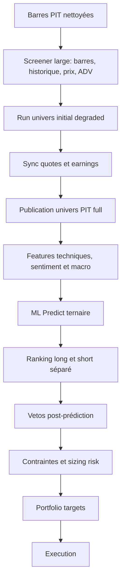
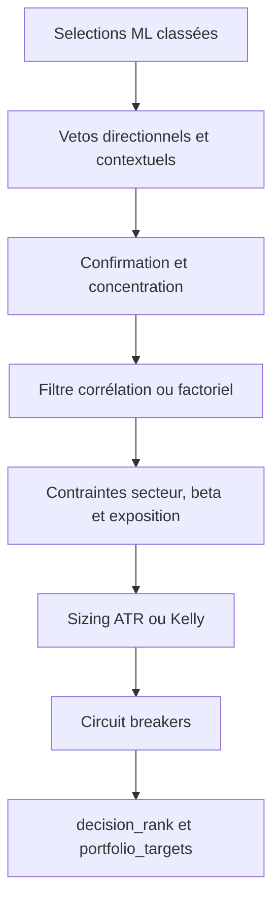
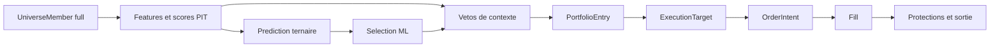
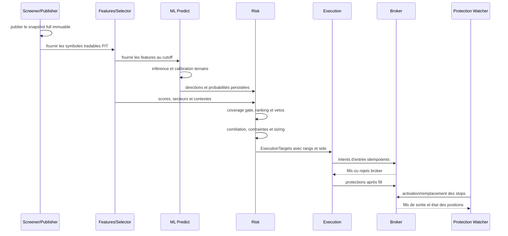

# Synthèse Long/Short : univers PIT, ML ternaire, risque et calibration

> Référence fonctionnelle mise à jour le 2026-07-11 après le cutover ML-first.

## Quick Reference

| Question | Réponse |
|---|---|
| Quel est le scope nominal ? | Le dernier univers tradable PIT canonique, complet et de qualité `full`, pour la date et le preset capital demandés. |
| Qui décide du côté ? | Uniquement `predicted_side` produit par le ML ternaire : `long`, `flat` ou `short`. |
| Qui décide de l'ordre ? | `proba_long` pour la jambe long et `proba_short` pour la jambe short, avec des rangs et capacités séparés. |
| Que devient `flat` ? | Une prédiction `flat`, absente, binaire ou incomplète ne peut pas ouvrir une position. |
| À quoi servent les scores techniques ? | Features, contexte explicable et vetos post-prédiction. Ils ne définissent ni le scope, ni le côté, ni le ranking principal. |
| À quoi sert le sentiment ? | Feature ML et/ou veto/overlay calibré. Il ne remplace jamais une prédiction directionnelle. |
| Quel est le rôle du régime ? | Bloquer ou réduire les entrées, ajuster les contraintes et le sizing. Il ne transforme pas un long ML en short, ni l'inverse. |
| Quel rang est persisté ? | `selection_rank` avant contraintes de risque; `decision_rank` après risque. |
| Le train est-il quotidien ? | Non. `ml_train` est un workflow offline optionnel. Le pipeline quotidien utilise un champion déjà publié. |
| Existe-t-il un fallback score-only ? | Non. Sans probabilité directionnelle ML complète, il n'y a pas de nouvelle position. |

## 0. Architecture canonique

### 0.1 Pipeline quotidien live



Ordre opérationnel :

1. Importer et assainir les barres.
2. Évaluer le scope large sur les règles disponibles au screener.
3. Synchroniser quotes et calendrier de résultats.
4. Publier atomiquement l'univers `full`.
5. Calculer les features PIT pour les symboles de cet univers.
6. Exécuter l'inférence ternaire avec un champion déjà publié.
7. Classer séparément les longs et les shorts par probabilité directionnelle.
8. Appliquer les seuils, blackout, score, régime et autres vetos.
9. Appliquer corrélation, concentration, sizing, exposition et circuit breakers.
10. Persister les décisions puis exécuter les ordres autorisés.

L'étape `common.publish_tradable_universe` crée un nouveau run immuable. Elle ne modifie pas le run `degraded` du screener. Un run n'est résolu que s'il est `completed`, canonique et complet (`rows_written == rows_expected`).

### 0.2 Workflow offline

Le workflow offline couvre :

1. backfill des univers et features PIT;
2. entraînement ternaire;
3. calibration des probabilités;
4. sélection et publication du champion;
5. génération des prédictions historiques PIT;
6. calibration des seuils, capacités, vetos et paramètres de risque;
7. validation walk-forward et contrôle de fidélité live/backtest.

L'entraînement n'est pas une dépendance quotidienne de `ml_predict`. La production consomme uniquement un champion validé et déjà publié.

### 0.3 Backtest

Le backtest rejoue, pour chaque séance :

- l'univers tradable PIT de la date;
- les features et scores historiques disponibles à cette date;
- les prédictions ternaires persistées;
- le même ranking directionnel et les mêmes vetos que le live;
- les contraintes de risque et le modèle d'exécution simulé.

Une date sans univers canonique complet ou sans couverture ML suffisante est bloquée ou explicitement dégradée selon le mode de validation. Elle ne doit jamais basculer silencieusement sur un classement technique.

## 1. Univers tradable PIT

### 1.1 Contrôles objectifs

Le grade `full` signifie que toutes les règles objectives requises ont été évaluées. Il ne signifie pas que tous les symboles ont passé les règles.

Les contrôles couvrent notamment :

- statut et classe d'actif compatibles avec le marché visé;
- disponibilité et profondeur des barres;
- prix minimum;
- ADV/liquidité;
- spread maximum;
- market cap minimum;
- blackout earnings;
- anomalies et qualité des données.

Chaque symbole du scope évalué reçoit `is_tradable` et, en cas de rejet, un motif explicite comme `quote_unavailable`, `spread_above_maximum`, `market_cap_unavailable`, `market_cap_below_minimum` ou `earnings_blackout`.

### 1.2 Preset capital

L'univers est résolu par `(snapshot_date, capital_preset_key)`. Le preset influence les seuils objectifs. Le live risk et la publication doivent donc résoudre la même clé à partir de l'equity effective.

## 2. Scores techniques, sentiment et macro

### 2.1 Scores techniques

Le screener et l'alpha scanner peuvent calculer des métriques telles que liquidité, force relative, tendance, VCP, ATR, beta et proximité du plus haut 52 semaines.

Exemple de score large :

$$
total\_score = 0.15\,liquidity + 0.55\,relative\_strength + 0.30\,historical\_range
$$

Exemple de score technique contextualisé :

$$
technical\_score = w_t\frac{trend+vcp}{2} + w_s\,total\_score + w_r\,relative\_strength
$$

Ces scores peuvent être winsorisés, normalisés et neutralisés par secteur. Après le cutover, ils ont trois usages autorisés :

1. features du modèle;
2. diagnostics et explicabilité;
3. vetos post-prédiction, par exemple un minimum technique pour un long ou un maximum pour un short.

Ils ne servent plus à fabriquer une liste Top-N transmise au ML.

### 2.2 Score baissier

Un score baissier technique peut rester disponible comme feature ou veto :

$$
short\_score = 0.30(1-trend) + 0.25(1-RSI/100)
 + 0.25\mathbf{1}_{price<SMA50} + 0.20\mathbf{1}_{price<SMA200}
$$

Il ne décide pas du côté. Un symbole n'est short que si `predicted_side == "short"` et si `proba_short` satisfait les contrôles directionnels.

### 2.3 Sentiment et macro

Le pipeline sentiment calcule les signaux article, ticker, secteur et macro. La fusion de contexte peut s'écrire :

$$
context\_score = w_q\,technical + w_s\,sentiment + w_m\,macro
$$

Ce résultat reste une feature ou un veto. Même avec des poids calibrés, il ne devient pas l'autorité de ranking.

Les poids par défaut peuvent rester conservateurs (`quant=1`, `sentiment=0`, `macro=0`) lorsque les tests IC/OOS ne montrent pas de valeur incrémentale stable.

## 3. ML ternaire

### 3.1 Scope d'entraînement et d'inférence

La seule source nominale est `tradable-universe`. Le train historique résout le scope PIT de chaque période; le predict quotidien résout le snapshot `full` courant.

Les features peuvent inclure :

- OHLCV et indicateurs techniques;
- volatilité, liquidité et facteurs cross-sectionnels;
- sentiment ticker/secteur;
- contexte macro et régime;
- scores techniques, sans filtre préalable basé sur ces scores.

### 3.2 Target

Le contrat de production est ternaire :

| Classe | Sens |
|---|---|
| `short` | baisse au-delà du seuil inférieur sur l'horizon |
| `flat` | rendement entre les deux seuils |
| `long` | hausse au-delà du seuil supérieur sur l'horizon |

Les seuils et l'horizon sont optimisés offline, avec splits chronologiques purgés et validation walk-forward. Un modèle binaire ne satisfait pas le contrat live ML-first.

### 3.3 Probabilités et calibration

Le modèle produit :

$$
P(short) + P(flat) + P(long) = 1
$$

Pour un modèle ternaire, le Temperature Scaling applique :

$$
P_k = softmax(z_k/T)
$$

Le paramètre $T$ est ajusté sur validation seulement. La calibration doit améliorer la fiabilité probabiliste sans changer arbitrairement la logique de classe.

Les sorties persistées minimales sont `predicted_side`, `proba_long`, `proba_flat`, `proba_short`, la date PIT et l'identité/version du modèle.

## 4. Ranking directionnel

### 4.1 Jambes séparées

Après exclusion de `flat` et des prédictions incomplètes :

- la jambe long est triée par `proba_long` décroissante;
- la jambe short est triée par `proba_short` décroissante;
- les capacités long et short sont appliquées séparément;
- `max_positions` borne ensuite la capacité totale.

Le score technique ne départage pas le ranking nominal. Un éventuel tie-break doit être déterministe et auditable, par exemple le symbole, sans réintroduire une autorité score-first.

### 4.2 Rangs

- `selection_rank` représente l'ordre ML avant contraintes de portefeuille;
- `decision_rank` représente l'ordre des positions acceptées après risque;
- un rejet conserve son contexte et son motif, mais ne reçoit pas artificiellement un meilleur rang.

## 5. Vetos post-prédiction

Les vetos s'appliquent après que le ML a fixé le côté. Ils peuvent :

- exiger `proba_long >= min_proba_long` ou `proba_short >= min_proba_short`;
- exiger un score technique minimal pour un long;
- imposer un score technique maximal ou un signal baissier minimal pour un short;
- bloquer un earnings blackout ou une donnée périmée;
- bloquer les nouvelles entrées selon le régime;
- appliquer confirmation, concentration ou blacklist;
- refuser une couverture ML globale insuffisante.

Un veto peut conserver ou rejeter une direction. Il ne peut pas inverser cette direction.

## 6. Risk et sizing

### 6.1 Ordre des contraintes



La conviction utilisée pour ordonner les sélections est désormais la probabilité directionnelle :

$$
conviction_{long}=P(long), \qquad conviction_{short}=P(short)
$$

Les anciennes signatures `score_weight`/`prediction_weight` peuvent subsister pour lire des artefacts historiques, mais elles n'influencent plus le ranking runtime.

### 6.2 Kelly

Le sizing Kelly peut combiner probabilité ML calibrée et taux de succès historique :

$$
p_{eff}=\alpha p_{ML}+(1-\alpha)p_{historique}
$$

$$
f_{Kelly}=p_{eff}-\frac{1-p_{eff}}{payoff\_ratio}
$$

La fraction réellement engagée est réduite par un multiplicateur prudent et bornée par les limites ATR, poids par ligne, poids secteur, liquidité et exposition.

Le Kelly ne choisit pas les symboles. Il dimensionne uniquement une sélection déjà validée.

### 6.3 Régime et circuit breakers

Le régime peut réduire les capacités, l'exposition ou le risque par trade, interdire de nouvelles entrées, ou forcer un mode de préservation. Les circuit breakers protègent contre le drawdown, la perte journalière et les états de données/modèle non fiables.

## 7. Fidélité live/backtest

| Élément | Live | Backtest |
|---|---|---|
| Univers | run canonique `full` courant | run canonique PIT de chaque séance |
| Features | calcul courant avec cutoff | snapshots/features au cutoff historique |
| Prédictions | inférence du champion publié | prédictions PIT persistées |
| Ranking | probabilités directionnelles | mêmes probabilités et mêmes capacités |
| Vetos/risk | configuration active | configuration versionnée du replay |
| Exécution | broker paper/live | simulateur avec coûts et règles de fill |

Les contrôles de fidélité doivent comparer le scope, les prédictions, les rangs, les motifs de rejet, les tailles et les expositions. Toute dégradation PIT doit être visible dans les artefacts, jamais remplacée silencieusement par des données courantes.

## 8. Calibration multi-niveaux

### 8.1 Principe

La calibration suit l'ordre des dépendances du système. Elle ne doit pas optimiser un score amont pour reproduire indirectement une sélection que le ML est désormais seul à ordonner.

Il faut distinguer :

- la calibration du modèle et de ses probabilités;
- la calibration des décisions directionnelles;
- la calibration des vetos/contextes;
- la calibration du risque et du sizing;
- la validation OOS de l'ensemble.

### 8.2 Ordre offline obligatoire

1. **Construire les données PIT**
   - publier/backfiller les univers par date et preset;
   - calculer les features avec leur cutoff;
   - vérifier l'absence de look-ahead et la complétude.

2. **Entraîner le modèle ternaire**
   - optimiser horizon, seuils `short/flat/long` et hyperparamètres sur train/validation chronologiques;
   - mesurer la performance par classe et par régime;
   - conserver un test final non utilisé pour le réglage.

3. **Calibrer les probabilités**
   - ajuster Temperature Scaling sur validation;
   - contrôler Brier/NLL, reliability curves et calibration par classe;
   - rejeter une calibration qui améliore une métrique globale en dégradant fortement une jambe.

4. **Publier le champion et générer les prédictions PIT**
   - versionner modèle, scaler, calibrateur et feature schema;
   - produire les quatre champs ternaires pour tout l'univers éligible;
   - vérifier la couverture par date avant toute calibration aval.

5. **Calibrer les décisions directionnelles**
   - optimiser `min_proba_long` et `min_proba_short` séparément;
   - calibrer capacités long, short et totale;
   - évaluer turnover, précision, rendement, drawdown et exposition par jambe;
   - ne jamais remplacer une probabilité absente par un score.

6. **Calibrer les vetos de contexte**
   - tester les seuils techniques, sentiment, macro, earnings et régime après le ranking ML;
   - conserver un veto uniquement s'il apporte une valeur OOS stable;
   - les poids quant/sentiment/macro calibrent une feature ou un veto, pas la conviction directionnelle.

7. **Calibrer le sizing**
   - ajuster `kelly_fraction_multiplier`, `assumed_payoff_ratio`, `min_effective_probability`, risque par trade et bornes ATR;
   - figer d'abord ranking et vetos pour éviter qu'un mauvais sizing masque une bonne sélection;
   - utiliser le moteur complet avec coûts, corrélation et circuit breakers pour la validation finale.

8. **Valider en walk-forward**
   - recalibrer uniquement sur la fenêtre train de chaque fold;
   - tester sur la fenêtre suivante sans fuite;
   - agréger les métriques long, short, portefeuille, régimes et coûts;
   - comparer au champion/baseline en place et appliquer les règles de gouvernance avant promotion.

### 8.3 Ce qui n'est plus une calibration de production

La grille historique :

$$
w_{score}\,score + w_{ML}\,probabilité
$$

ne calibre plus l'autorité de sélection. Dans le runtime ML-first, `core.conviction.compute_conviction()` et `compute_conviction_short()` retournent la probabilité directionnelle obligatoire. Les champs et artefacts `score_weight`/`prediction_weight` peuvent rester lisibles pour compatibilité et comparaison historique, mais ils ne doivent pas être promus comme nouveaux paramètres de ranking live.

La calibration sentiment reste pertinente uniquement pour une feature ou un veto. La calibration Kelly reste pertinente pour le sizing.

### 8.4 Ordre quotidien après calibration

L'exécution quotidienne ne relance aucune grille :

1. charger le champion et son calibrateur publiés;
2. produire les probabilités ternaires sur l'univers `full`;
3. classer long et short séparément;
4. appliquer les seuils directionnels et les vetos de contexte;
5. appliquer les contraintes de portefeuille;
6. dimensionner les positions;
7. persister `selection_rank`, `decision_rank`, motifs et versions;
8. exécuter.

### 8.5 Fréquence et déclencheurs

Une recalibration peut être planifiée trimestriellement et déclenchée après :

- nouvel entraînement ou changement de feature schema;
- dérive de distribution ou de calibration;
- changement durable de régime;
- modification des règles d'univers, des coûts ou des contraintes risk;
- écart significatif de fidélité live/backtest.

Une dérive n'autorise pas une promotion automatique. Elle déclenche une analyse, une validation OOS et une décision de gouvernance.

## 9. Monitoring et gouvernance

Le monitoring minimal couvre :

- complétude et fingerprint de l'univers;
- couverture ML et répartition `long/flat/short`;
- Brier/NLL et calibration par classe;
- performance et turnover par jambe;
- stabilité des seuils et capacités;
- taux et motifs de veto;
- expositions nettes/brutes, secteurs, beta et corrélations;
- slippage, fills, drawdown et circuit breakers;
- cohérence entre `selection_rank` et `decision_rank`.

Le kill-switch ML bloque les nouvelles positions lorsque la gouvernance ou la dérive invalide le modèle. Il n'active pas un chemin score-only.

## 10. Fichiers de référence

| Domaine | Fichiers principaux |
|---|---|
| Univers PIT | `common/tradable_universe.py`, `common/publish_tradable_universe.py`, `alembic/versions/0046_add_tradable_universe_history.py` |
| Orchestration | `ihm/services/pipeline_runner.py` |
| Features/scores | `screener/pipeline.py`, `selector/factors.py`, `selector/ranking.py`, `event_sentiment/signal_aggregator.py` |
| Train/predict | `modelFactory/orchestrator.py`, `modelFactory/trainer.py`, `modelFactory/predictor.py`, `modelFactory/calibration.py` |
| Ranking replay | `backtesting/signal_replay.py`, `backtesting/risk_bridge.py` |
| Risk live | `risk_management/cli.py`, `risk_management/portfolio_builder.py`, `core/conviction.py` |
| Calibration | `backtesting/weights_calibration.py`, `backtesting/sentiment_calibration.py`, `backtesting/walk_forward.py` |
| Schéma final | `alembic/versions/0047_add_selection_rank_to_risk_execution.py`, `alembic/versions/0048_drop_candidate_columns_from_score_snapshots.py` |

## 11. Invariants à ne pas réintroduire

1. Aucun scope nominal construit depuis un flag ou rang de présélection technique.
2. Aucun modèle binaire accepté par le live directionnel.
3. Aucun côté dérivé d'un score ou d'un tagging technique.
4. Aucun fallback score-only en l'absence de ML.
5. Aucun mélange score/probabilité utilisé comme autorité de ranking.
6. Aucun train automatique requis dans le workflow quotidien.
7. Aucun snapshot PIT partiel ou `degraded` utilisé pour ouvrir une position live.
8. Aucune confusion entre `selection_rank` et `decision_rank`.

## 12. Vocabulaire et objets qui circulent entre les modules

Le mot « sélection » désigne ici un symbole auquel le ML a attribué une direction exploitable et qui se trouve encore dans la capacité de sa jambe. Il ne désigne pas une présélection technique antérieure au ML.

| Objet | Produit par | Contenu utile | Autorité |
|---|---|---|---|
| Membre d'univers | screener puis publication `full` | symbole, prix, ADV, spread, market cap, blackout, `is_tradable`, motif | définit le scope objectif |
| Features/scores | screener, selector, sentiment, régime | facteurs techniques et contextuels datés | explique et alimente le ML; peut opposer un veto |
| Prédiction | Model Factory | `predicted_side`, trois probabilités, date et version du modèle | définit la direction et la conviction |
| Signal rejoué | `backtesting.signal_replay` | côté `buy`/`sell`, probabilité directionnelle, rangs, veto | matérialise le ranking ML en backtest |
| `SelectionScore` | repository/bridge risk | score de contexte, secteur, dates PIT, explication, `selection_rank` | entrée contextuelle du risk, jamais source du côté |
| `PredictionInfo` | repository de prédictions | direction et probabilités ternaires | preuve ML obligatoire pour le risk |
| `PortfolioEntry` | `PortfolioBuilder` | quantité proposée/approuvée, notionnel, poids, décision, rangs, stop, conviction | décision de portefeuille |
| `ExecutionTarget` | persistance risk/execution | cible figée associée au `risk_run_id` | contrat entre risk et exécution |
| `OrderIntent` | moteur d'exécution | côté broker, quantité, type, prix, rôle, idempotence | demande d'ordre auditable |
| Fill | broker ou simulateur | quantité réellement remplie, prix moyen, slippage, shortfall | vérité d'exécution |
| Protection | exécuteur/watcher | take-profit, stop initial, trailing stop, time stop | contrôle de la position ouverte |

La chaîne de causalité est donc :



Une ligne peut disparaître à chaque frontière, mais aucune frontière aval ne peut inventer une direction absente en amont.

## 13. Comment une position long est construite

### 13.1 Conditions nécessaires

Un symbole ne devient éligible à un achat que si toutes les conditions suivantes sont vraies :

1. il appartient au snapshot `tradable-universe` `full` résolu pour la date et le preset capital;
2. sa ligne d'univers porte `is_tradable=true`;
3. ses features respectent le cutoff PIT;
4. une prédiction ternaire complète existe pour le symbole et la date;
5. `predicted_side == "long"` et `proba_long` est finie;
6. son rang long ne dépasse pas `max_long_positions`;
7. son rang total ne dépasse pas `max_positions`;
8. `proba_long >= min_proba_long`;
9. les vetos de contexte, de régime et de concentration ne le bloquent pas;
10. les contraintes de portefeuille autorisent un notionnel supérieur au minimum exécutable;
11. les données de prix, ATR et liquidité nécessaires au sizing sont disponibles et fraîches;
12. les circuit breakers et le kill-switch ML autorisent de nouvelles entrées.

La conviction est :

$$
conviction = P(long)
$$

Le côté applicatif devient `buy`. La quantité reste positive; c'est le champ `side` qui donne son sens à l'ordre.

### 13.2 Classement

Pour une date $t$, soit $L_t$ l'ensemble des symboles prédits long. Le classement de jambe est :

$$
long\_rank_i = rank_{desc}\left(P_i(long)\right), \quad i \in L_t
$$

Seuls les premiers `max_long_positions` survivent au plafond de jambe. Les survivants long et short sont ensuite réunis et triés par leur probabilité directionnelle pour appliquer `max_positions`. Le symbole sert de tie-break déterministe après la probabilité.

### 13.3 Veto technique long

Si le veto est activé :

$$
score_i < min\_score\_veto\_long \Rightarrow rejet
$$

Ce contrôle ne promeut jamais un symbole. Un score très élevé sans `predicted_side=long` ne produit aucun achat. Un score faible peut en revanche annuler un long ML si la gouvernance a démontré que ce veto améliore les résultats OOS.

### 13.4 Sizing et risque initial

Avec un sizing ATR, le budget de risque nominal vaut :

$$
risk\_budget = equity \times risk\_per\_trade\_pct \times risk\_multiplier
$$

Pour un long :

$$
stop_{initial}=entry-ATR_{20}\times atr\_stop\_multiple
$$

$$
risk\_per\_share=entry-stop_{initial}
$$

$$
shares_{risk}=\frac{risk\_budget}{risk\_per\_share}
$$

La quantité finale est bornée par le poids maximal par ligne, l'ADV, le notionnel minimal, l'exposition brute, le secteur, le cash/buying power et les autres contraintes actives. Une réduction crée une décision `REDUCED`; une quantité nulle ou non exécutable crée un rejet.

### 13.5 Ordres et protections long

Après fill de l'entrée `buy`, l'exécution construit normalement :

- un take-profit `sell` au-dessus du fill;
- un stop initial `sell` sous le fill;
- un trailing stop `sell`, initialement tenu puis activé par le watcher;
- éventuellement un time stop et des ordres de réconciliation.

Le take-profit combine la cible en pourcentage et, lorsque le risque par action est disponible, une cible en multiple de $R$. Pour un objectif $2R$ :

$$
TP_{long}=entry+2\times risk\_per\_share
$$

Le moteur utilise la cible la plus exigeante entre la règle en pourcentage et la règle en $R$.

## 14. Comment une position short est construite

### 14.1 Conditions supplémentaires

Un short satisfait le même contrat PIT et ML qu'un long, avec :

1. `short_selling_enabled=true` dans le chemin risk concerné;
2. `predicted_side == "short"`;
3. une `proba_short` finie et supérieure à `min_proba_short`;
4. `short_rank <= max_short_positions`;
5. les éventuels contrôles de rotation et de benchmark baissier;
6. l'autorisation broker, la marge, le buying power et la disponibilité à l'emprunt au moment de l'exécution;
7. une exposition short compatible avec l'exposition brute, nette, sectorielle et factorielle.

La conviction est :

$$
conviction = P(short)
$$

Le côté applicatif devient `sell`. La quantité demeure positive. Une clôture short est un ordre `buy`, c'est-à-dire un buy-to-cover.

### 14.2 Classement

Pour l'ensemble $S_t$ des symboles prédits short :

$$
short\_rank_i = rank_{desc}\left(P_i(short)\right), \quad i \in S_t
$$

Le rang short n'est pas comparé au rang long avant l'application des capacités propres aux jambes. Ainsi, `long_rank=1` et `short_rank=1` peuvent coexister. Le plafond total décide ensuite lesquels entrent dans la capacité globale en comparant leurs probabilités directionnelles.

### 14.3 Veto technique short

Le score technique historique étant orienté vers la qualité haussière, le veto short est un plafond :

$$
score_i > max\_score\_veto\_short \Rightarrow rejet
$$

Il ne faut pas confondre ce veto avec `short_score`. Un signal baissier peut enrichir les features ou justifier un veto, mais il ne remplace jamais `predicted_side=short`.

### 14.4 Contexte de marché

Selon la configuration active, le système peut exiger une rotation compatible et un benchmark baissier, par exemple SPY sous sa SMA50. Ces contrôles réduisent les faux shorts pendant un rebond violent. Ils ont trois résultats possibles : conserver, réduire ou bloquer le short. Ils ne transforment jamais le symbole en long.

Le régime peut aussi réduire `max_short_positions`, resserrer les seuils, limiter l'exposition brute ou désactiver complètement les nouvelles ventes à découvert.

### 14.5 Sizing, stop et protections short

Pour un short, le risque adverse se trouve au-dessus du prix d'entrée :

$$
stop_{initial}=entry+ATR_{20}\times atr\_stop\_multiple
$$

$$
risk\_per\_share=stop_{initial}-entry
$$

La logique de budget de risque et les plafonds de notionnel restent identiques au long. Les intents sont direction-aware :

| Étape | Long | Short |
|---|---|---|
| Entrée | `buy` | `sell` |
| Take-profit | `sell` au-dessus | `buy` en dessous |
| Stop initial | `sell` en dessous | `buy` au-dessus |
| Trailing stop | `sell` | `buy` |
| Clôture/réconciliation | vente | buy-to-cover |

Pour un objectif de gain $g$ :

$$
TP_{long}=entry(1+g), \qquad TP_{short}=entry(1-g)
$$

Le moteur d'intents inverse aussi le buffer de limite : une limite d'achat long cherche un prix inférieur au signal, tandis qu'une limite d'entrée short cherche un prix supérieur au signal.

### 14.6 Risques propres au short

Le risque short n'est pas parfaitement symétrique au long : perte théorique non bornée, rappel d'emprunt, hard-to-borrow, frais d'emprunt, gap haussier et contrainte de marge. Le backtest ne doit pas considérer ces coûts comme nuls par défaut si l'objectif est une estimation réaliste. Une comparaison sérieuse doit documenter :

- le modèle de borrow et son coût;
- l'hypothèse de disponibilité des titres;
- le traitement des dividendes dus;
- les exigences de marge;
- les gaps et limites de fill des stops;
- la liquidation forcée éventuelle.

Ces éléments relèvent de l'exécution et du simulateur; ils ne doivent pas être artificiellement absorbés par `proba_short`.

## 15. Déroulement complet d'un run live

### 15.1 Préconditions

Avant toute décision, le run live doit disposer de :

- tables et schémas à la version attendue;
- barres, quotes et calendrier de résultats suffisamment frais;
- run univers `full`, `completed`, canonique et complet;
- champion ML publié avec son feature schema et son calibrateur;
- prédictions couvrant suffisamment l'univers;
- snapshot de régime et état de compte/broker;
- configuration risk et execution validée;
- aucun kill-switch bloquant les entrées.

### 15.2 Chronologie détaillée



### 15.3 Chargement et contrôle de couverture ML

Le CLI risk charge les symboles du run `full`, les scores/contextes, les prix, les prédictions et les métriques historiques. Le coverage gate calcule :

$$
coverage=\frac{nombre\ de\ prédictions\ disponibles}{nombre\ de\ sélections\ attendues}
$$

Si la couverture est inférieure au seuil, les nouvelles entrées sont bloquées. Si le régime interdit déjà les nouvelles entrées, le gate peut être marqué comme ignoré par régime; cela ne crée aucune position.

### 15.4 Construction du portefeuille

`PortfolioBuilder` suit l'ordre observable suivant :

1. appliquer le contexte de régime aux données de sélection;
2. retirer toute ligne sans prédiction ternaire directionnelle exploitable;
3. appliquer la confirmation de présence `min_breakout_days` aux deux jambes;
4. appliquer les seuils de probabilité et vetos techniques post-prédiction;
5. appliquer les filtres de concentration et blacklist;
6. enrichir avec probabilité et taux de succès historique;
7. trier par conviction ML décroissante;
8. appliquer le filtre de corrélation Pearson ou factoriel;
9. calculer la taille proposée;
10. appliquer poids par ligne, secteur, exposition brute, liquidité et capacité;
11. attribuer `ACCEPTED`, `REDUCED` ou `REJECTED` et un motif codifié;
12. attribuer `decision_rank` aux lignes acceptées;
13. rééquilibrer éventuellement l'exposition nette long/short;
14. persister le run, ses décisions et les targets.

Le `selection_rank` provient de l'ordre ML avant risk. Le `decision_rank` incrémente seulement pour les positions effectivement retenues. Un symbole de rang ML 2 peut donc devenir `decision_rank=1` si le rang ML 1 est rejeté pour corrélation, liquidité ou contrainte sectorielle.

### 15.5 Exposition long/short

Avec $N_L$ la somme des notionnels longs et $N_S$ la valeur absolue des notionnels shorts :

$$
gross\_exposure=\frac{N_L+N_S}{equity}
$$

$$
net\_exposure=\frac{N_L-N_S}{equity}
$$

Si `enforce_net_exposure=true`, le corridor admissible est :

$$
target-tolerance \le net\_exposure \le target+tolerance
$$

Le système réduit proportionnellement le côté excédentaire. Il n'ajoute pas artificiellement des positions du côté déficitaire et ne change pas leur direction.

### 15.6 Passage au broker

Le moteur transforme chaque target de quantité strictement positive en intent :

- `side=buy` pour ouvrir un long;
- `side=sell` pour ouvrir un short;
- `market` ou `limit` selon la configuration;
- clé d'idempotence fondée sur run, symbole, rôle, côté, quantité et mode broker;
- `decision_price` conservé pour la TCA.

Avant soumission, l'exécution peut encore bloquer ou réduire selon le buying power, le gap d'entrée, l'exposition imposée par le régime, la quantité fractionnaire autorisée et l'état déjà présent chez le broker.

Après le fill, les protections sont créées sur la quantité réellement remplie, pas simplement sur la quantité demandée. La TCA mesure notamment slippage et implementation shortfall par rapport au prix de décision.

### 15.7 États qui ne doivent pas être confondus

| État | Signification |
|---|---|
| Sélection ML | dans la capacité de ranking, avant contraintes risk |
| `ACCEPTED` | target risk conservée sans réduction bloquante |
| `REDUCED` | target conservée mais notionnel diminué |
| `REJECTED` | aucune quantité à exécuter |
| Intent créé | demande locale idempotente, pas encore un ordre broker rempli |
| Ordre soumis | broker a reçu la demande |
| Partiellement rempli | seule la quantité remplie constitue une position |
| Rempli | entrée ou sortie effectivement exécutée |
| Protection active | stop/TP réellement présent et suivi |

## 16. Déroulement complet d'un backtest

### 16.1 Règle fondamentale PIT

Pour chaque date $t$, le backtest ne peut utiliser que ce qui était connu au cutoff de $t$. Cela vaut pour l'univers, les features, les résultats publiés, le sentiment, le régime, le modèle, les probabilités, l'ATR et les prix d'exécution.

Un backtest correct ne prend pas l'univers actuel pour le projeter dans le passé. Il résout un `universe_run_id` propre à chaque séance et conserve les symboles rejetés avec leur motif lorsque l'analyse d'audit l'exige.

### 16.2 Phase 1 : replay des signaux

`replay_signals()` reçoit les prédictions ternaires comme source de scope et de classement. Il :

1. valide les colonnes `symbol`, `trade_date`, `predicted_side`, `proba_long`, `proba_short`;
2. normalise symboles, dates, directions et probabilités;
3. déduplique par symbole/date;
4. élimine `flat` et les directions sans probabilité correspondante;
5. convertit long en `buy` et short en `sell`;
6. définit `selection_score`, `predicted_proba` et `conviction` avec la probabilité directionnelle;
7. calcule `long_rank` et `short_rank` séparément;
8. applique les capacités par jambe puis la capacité totale;
9. joint les scores uniquement comme contexte;
10. applique les seuils de probabilité et vetos techniques;
11. conserve un `veto_reason` explicite.

Cette phase est le miroir déterministe du contrat de sélection live. Elle ne simule pas encore le capital ni les fills.

### 16.3 Phase 2 : bridge risk

Le bridge transforme les signaux sélectionnés en entrées compatibles avec le `PortfolioBuilder` live. Il reconstruit les prix, ATR, volumes, secteurs, prédictions et snapshots de régime à la date simulée, puis appelle le moteur de risque partagé.

Le résultat contient les `PortfolioEntry`, décisions, quantités, notionnels, stops, rangs et motifs. Utiliser le même builder évite qu'une formule de sizing ou un filtre de corrélation diverge silencieusement entre recherche et production.

### 16.4 Phase 3 : replay d'exécution

Le replay convertit les targets acceptées en intents, simule la soumission puis les fills selon le profil d'exécution. Il doit préciser dans l'artefact :

- timing du fill, par exemple prochaine ouverture ou barre autorisée;
- type d'ordre;
- slippage et spread;
- commission;
- quantité fractionnaire ou entière;
- traitement d'un gap au-delà de la limite;
- liquidité/participation maximale;
- comportement des fills partiels;
- contraintes short et borrow, si modélisées.

Le prix de décision et le prix de fill doivent rester distincts. Leur écart sert à mesurer le coût d'exécution plutôt qu'à réécrire rétroactivement la décision.

### 16.5 Phase 4 : protections

Après le fill simulé, `execution_lifecycle_replay` crée les états de protection :

- take-profit soumis;
- stop initial soumis lorsqu'un niveau valide existe;
- trailing stop tenu en attente d'activation;
- lien parent/enfants entre l'entrée et ses protections.

`protection_watcher_replay` simule ensuite la transition du stop initial vers le trailing stop, avec annulation/remplacement explicite dans le lifecycle.

### 16.6 Phase 5 : sorties intrabar

Le replay de sortie parcourt les barres postérieures à l'entrée, met à jour l'extrême favorable et résout les collisions intrabar selon une priorité configurée. Si le high et le low touchent plusieurs niveaux le même jour, l'ordre réel des ticks est inconnu; une convention conservatrice doit donc être utilisée et documentée.

Les motifs standards sont :

- `take_profit`;
- `initial_stop`;
- `trailing_stop`;
- time stop ou clôture terminale lorsqu'ils sont pris en charge par le scénario.

**Point de validation important :** les builders d'intents sont explicitement direction-aware pour long et short. En revanche, toute fonction de replay intrabar qui compare directement `high`, `low`, stop et take-profit doit posséder des tests short dédiés avant d'être déclarée parfaitement symétrique. La fidélité short exige notamment de vérifier le suivi du creux favorable, le stop au-dessus du marché et le buy-to-cover. En l'absence de cette preuve, les métriques short de sortie doivent être marquées comme une limite du scénario, pas présentées comme équivalentes au live.

### 16.7 Phase 6 : P&L

Pour un long :

$$
PnL_{long}=q(exit-entry)-coûts
$$

Pour un short :

$$
PnL_{short}=q(entry-exit)-coûts-borrow-dividendes
$$

Les coûts incluent au minimum commissions et slippage. Pour un backtest short réaliste, ils incluent aussi frais d'emprunt et dividendes dus lorsque les données sont disponibles.

### 16.8 Walk-forward

Chaque fold doit séparer :

1. fenêtre d'entraînement;
2. fenêtre de calibration;
3. fenêtre de test suivante;
4. purge/embargo adaptés à l'horizon de target.

Les seuils, capacités, vetos et paramètres Kelly choisis dans un fold ne doivent jamais voir les résultats de sa fenêtre de test. Les métriques finales sont agrégées par jambe, régime et coût, puis comparées au champion en place.

## 17. Matrice de décision par symbole

| Situation | Résultat | Motif attendu |
|---|---|---|
| Pas dans l'univers `full` | aucune inférence/entrée nominale | scope non tradable ou run absent |
| `is_tradable=false` | aucune entrée | `tradability_reason_code` |
| Prédiction absente | aucune entrée | couverture ML incomplète |
| Prédiction binaire/incomplète | aucune entrée | contrat ternaire invalide |
| `predicted_side=flat` | aucune entrée | classe non directionnelle |
| Long sous `min_proba_long` | veto | `ml_probability_below_threshold` |
| Short sous `min_proba_short` | veto | `ml_probability_below_threshold` |
| Long sous le score minimal | veto | `technical_score_long_veto` |
| Short au-dessus du score maximal | veto | `technical_score_short_veto` |
| Hors capacité de jambe | non sélectionné | rang directionnel trop élevé |
| Hors capacité totale | non sélectionné | `selection_rank > max_positions` |
| Confirmation insuffisante | rejet | filtre `min_breakout_days` |
| Trop de pertes/trades récents | rejet | concentration/blacklist |
| Trop corrélé à une meilleure conviction | rejet | filtre de corrélation |
| Secteur saturé | rejet ou réduction | contrainte sectorielle |
| Exposition brute saturée | rejet ou réduction | `constraint_max_gross_exposure` |
| Notionnel sous minimum | rejet | ordre non exécutable |
| ADV insuffisant | réduction ou rejet | contrainte de liquidité |
| Circuit breaker actif | blocage ou sizing dégradé | état de protection capital |
| Buying power insuffisant | réduction/rejet execution | contrôle compte/broker |
| Gap d'entrée excessif | intent bloqué | contrôle de gap |
| Broker refuse le short | aucune position | rejet broker/borrow/marge |

## 18. Exemple chiffré d'une séance mixte

Supposons :

- `max_long_positions=2`;
- `max_short_positions=1`;
- `max_positions=3`;
- `min_proba_long=0.58`;
- `min_proba_short=0.62`;
- `min_score_veto_long=0.30`;
- `max_score_veto_short=0.55`.

| Symbole | Side ML | Probabilité directionnelle | Score contexte | Rang jambe | Résultat initial |
|---|---:|---:|---:|---:|---|
| AAA | long | 0.81 | 0.72 | long 1 | sélectionné |
| BBB | long | 0.67 | 0.25 | long 2 | veto technique long |
| CCC | long | 0.61 | 0.60 | long 3 | hors capacité long |
| DDD | short | 0.76 | 0.41 | short 1 | sélectionné |
| EEE | short | 0.71 | 0.70 | short 2 | hors capacité short et veto technique |
| FFF | flat | 0.88 pour flat | 0.90 | aucun | aucune entrée |

Après vetos, AAA et DDD arrivent au risk. Si AAA et DDD sont très corrélés en valeur absolue et qu'AAA a la conviction la plus forte, DDD peut être rejeté par le filtre de corrélation. Si les deux survivent :

- AAA produit une target `buy`;
- DDD produit une target `sell`;
- leur `selection_rank` reflète 0.81 puis 0.76;
- leur `decision_rank` reflète l'ordre des targets réellement acceptées;
- la neutralité nette peut réduire AAA ou DDD sans changer leur côté.

Pour une equity de 100 000, un risque par trade de 1 %, AAA à 50 avec ATR 2 et multiple 2 :

$$
stop=50-2\times2=46
$$

$$
shares_{risk}=\frac{100000\times0.01}{50-46}=250
$$

Le notionnel brut serait 12 500. Avec `max_position_weight=10%`, il est plafonné à 10 000, soit 200 actions avant les autres contraintes.

Pour DDD short à 40 avec ATR 1,5 et multiple 2 :

$$
stop=40+1.5\times2=43
$$

$$
shares_{risk}=\frac{100000\times0.01}{43-40}\approx333
$$

Le plafond de poids à 10 % limite le short à 10 000, soit 250 actions avant marge, ADV et neutralité nette.

## 19. Paramètres à versionner avec chaque run

### 19.1 Univers et ML

- `snapshot_date`, `capital_preset_key`, `universe_run_id`, fingerprint et grade;
- version des règles de tradabilité;
- modèle, feature schema, calibrateur et date de promotion;
- horizon et seuils de target ternaire;
- `min_proba_long`, `min_proba_short`;
- `max_long_positions`, `max_short_positions`, `max_positions`.

### 19.2 Vetos et risque

- `min_score_veto_long`, `max_score_veto_short`;
- `min_breakout_days` et configuration concentration;
- seuil/type/lookback de corrélation;
- limites secteur, beta et facteurs;
- `risk_per_trade_pct`, ATR, multiple de stop;
- poids/notionnel/ADV/exposition brute maximum;
- paramètres Kelly et poids ML/historique utilisés uniquement pour le sizing;
- objectif/tolérance d'exposition nette;
- configuration de régime et circuit breakers.

### 19.3 Exécution

- mode broker et type d'ordre;
- fractionnement autorisé;
- buffer des limites et filtre de gap;
- slippage, commissions et participation;
- take-profit, activation trailing et time stop;
- politique de priorité intrabar du backtest;
- hypothèses de borrow, marge et dividendes short.

Sans ces versions, deux runs portant les mêmes symboles ne sont pas reproductibles.

## 20. Diagnostic d'un écart live/backtest

L'analyse doit suivre la chaîne dans l'ordre, sans commencer par le P&L :

1. **Univers** : même date, preset, run `full`, fingerprint et liste tradable ?
2. **Features** : mêmes valeurs et cutoffs, aucune révision future ?
3. **Modèle** : même champion, calibrateur et feature schema ?
4. **Prédictions** : mêmes directions et probabilités ?
5. **Ranking** : mêmes capacités et mêmes `selection_rank` ?
6. **Vetos** : mêmes seuils et mêmes motifs ?
7. **Risk** : même equity, ATR, prix, corrélations, régime et tailles ?
8. **Targets** : mêmes sides, quantités et `decision_rank` ?
9. **Execution** : même timing, limites, fills, coûts et rejets ?
10. **Protection** : mêmes niveaux, activation trailing et priorité intrabar ?
11. **Sorties/P&L** : mêmes quantités, prix, coûts et corporate actions ?

Le rapport de fidélité compare d'abord les `selections`, puis `risk_decisions`, `portfolio_targets`, `execution_targets`, fills, sorties et P&L. Une divergence amont explique souvent toutes les divergences aval; il faut donc corriger la première différence causale, pas ajuster le résultat final.

## 21. Checklist avant activation live des shorts

1. Le champion ternaire est calibré et validé séparément sur la classe short.
2. Les probabilités short sont fiables par régime, secteur et niveau de liquidité.
3. `short_selling_enabled`, capacités et seuils sont explicites dans le preset.
4. Les règles benchmark/rotation sont testées OOS.
5. Le broker et le compte autorisent la vente à découvert.
6. Le contrôle hard-to-borrow/borrow est disponible ou la limite est documentée.
7. Stops, take-profits, trailing stops et buy-to-cover sont testés en paper.
8. Les fills partiels et rejets broker ne laissent aucune position sans protection.
9. La réconciliation reconnaît correctement les quantités short existantes.
10. Les frais d'emprunt, dividendes et exigences de marge sont inclus dans les attentes.
11. Le replay de sortie short possède des tests directionnels dédiés.
12. L'exposition nette et brute est monitorée avec des signes cohérents.
13. Le circuit breaker sait réduire ou fermer les deux jambes.
14. La fidélité live/backtest est mesurée séparément pour longs et shorts.

Tant qu'un de ces points critiques n'est pas prouvé, le réglage prudent est `short_selling_enabled=false` ou `max_short_positions=0`, sans modifier le chemin long.

## 22. Utilisation dans l'IHM de l'application

### 22.1 Page Pipeline / Execution Center

La page Pipeline est le point d'entrée du workflow quotidien. L'ordre affiché doit être interprété ainsi :

| Étape IHM | Rôle long/short | Contrôle opérateur |
|---|---|---|
| Import Alpaca Bar | alimente les barres | dates, provider, complétude |
| Data Sanitizer Daily | nettoie les barres | anomalies, calendrier, fraîcheur |
| Stock Screener | prépare scope large et scores de contexte | volumétrie, erreurs, pas de sélection directionnelle |
| Sync Latest Quotes | apporte prix/spread | fraîcheur et couverture |
| Sync Earnings Calendar | apporte les blackouts | couverture des dates de résultats |
| Publish Tradable Universe | crée le run `full` | grade, preset, lignes attendues/écrites |
| Alpha Scanner | calcule/enrichit les facteurs techniques | diagnostics; son éventuel Top-N n'est pas l'autorité ML-first |
| Sentiment Pipeline | calcule le contexte texte/macro | couverture, cutoff, qualité |
| Signal Aggregator | persiste le contexte composite | feature/veto, jamais côté ou rang principal |
| ML Predict | produit les trois probabilités | champion, version, couverture, distribution des classes |
| Risk Management | décide targets et tailles | vetos, rangs, exposition, motifs, dry-run |
| Execution | soumet/simule et réconcilie | mode simulate/paper/live, compte, fenêtre, fills |
| Protection Watcher | maintient les protections | TP, stop initial, trailing, time stop |

`ML Train` est une étape auxiliaire offline. Elle ne doit pas être cochée comme dépendance systématique du run quotidien. Une nouvelle exécution live doit consommer le champion déjà publié, pas entraîner un modèle avec les données du jour puis l'utiliser immédiatement sans gouvernance.

Les champs IHM historiques `selection_size`, `short_selection_size`, `score_weight` ou `prediction_weight` peuvent encore apparaître dans certaines surfaces de configuration ou artefacts. Ils ne changent pas les invariants : la source nominale reste l'univers `full`, le côté vient du ML ternaire et la conviction runtime est la probabilité directionnelle.

### 22.2 Préparation d'un run live ou paper

L'opérateur doit vérifier, dans cet ordre :

1. la `trade_date` et le preset capital;
2. l'equity et le type de compte utilisés par le risk;
3. le mode d'exécution `simulate`, `paper` ou `live`;
4. les capacités totale, long et short;
5. les seuils ML et le minimum de couverture;
6. les limites par position, secteur, ADV, exposition brute et nette;
7. Kelly, vol targeting et factor model s'ils sont volontairement activés;
8. le type d'ordre, le buffer limite et le gap maximal;
9. take-profit, trailing trigger et paramètres de protection;
10. le dry-run risk et les mécanismes d'approbation live.

Le mode `simulate` valide la construction sans soumission réelle. Le mode `paper` valide l'intégration broker et les protections sans capital réel. Le mode `live` ne doit être utilisé qu'après comparaison paper/backtest et contrôle des tokens/approbations requis par l'application.

### 22.3 Page ML

La page ML sert à contrôler :

- le champion publié et son statut de gouvernance;
- la date/version des artefacts;
- la couverture des prédictions;
- les distributions long/flat/short;
- le gate de dérive et l'action associée;
- la cohérence entre le dernier run ML et le run risk.

Une proportion anormale de `flat`, une disparition de la classe short ou une couverture inférieure au seuil doit être diagnostiquée avant le risk. Il ne faut pas compenser le problème en abaissant immédiatement les seuils ou en réactivant un classement par score.

### 22.4 Page Risk

La page Risk doit être lue ligne par ligne :

- côté demandé `buy` ou `sell`;
- `selection_rank` et `decision_rank`;
- probabilité et conviction;
- score/source de contexte;
- décision `ACCEPTED`, `REDUCED` ou `REJECTED`;
- motif humain et code stable;
- quantité proposée et approuvée;
- poids, notionnel, stop initial et risque en dollars;
- dates as-of des scores, prix, ATR, prédictions et métriques ML.

Pour expliquer pourquoi un symbole n'a pas été tradé, il faut chercher d'abord sa présence dans l'univers et les prédictions, ensuite son rang/veto, puis sa décision risk. L'absence dans les targets n'est pas à elle seule un diagnostic.

### 22.5 Page Execution

La page Execution permet de distinguer :

- target risk;
- request locale;
- ordre broker;
- fill observé;
- position et lot reconstruits;
- résultat de réconciliation;
- événement de protection;
- slippage et implementation shortfall.

Pour un short, vérifier explicitement que l'entrée broker est `sell` et que les enfants de protection sont `buy`. Pour un long, l'entrée est `buy` et les protections sont `sell`. Une divergence de signe est une anomalie bloquante.

### 22.6 Page Backtesting

Deux presets sont particulièrement adaptés :

- `pipeline_live_like` : replay proche du pipeline live courant;
- `production_parity` : chaîne complète orientée comparaison production.

Pour une validation long/short fidèle, sélectionner le mode `pipeline`, utiliser les prédictions PIT persistées et activer la chaîne risk/execution/protection/watcher/exit lifecycle. Le mode `research` peut rester utile pour explorer rapidement une hypothèse, mais il ne constitue pas une preuve de parité production lorsqu'il assouplit les contrôles PIT ou les phases d'exécution.

Les options importantes sont :

- dates de début et de fin;
- preset capital;
- `engine_mode=pipeline`;
- stratégie ML PIT `use-persisted`;
- `phase2_mode=risk_execution`;
- replay d'exécution et de protections;
- commissions/slippage;
- quantités fractionnaires;
- contrôle de couverture PIT/ML;
- capacités long/short et neutralité nette;
- overlays de drawdown, volatilité, secteur et gap.

Avant de lancer, les diagnostics de couverture PIT doivent confirmer qu'un univers et des prédictions existent pour toutes les dates attendues. Un run pipeline qui échoue pour données manquantes est préférable à un run apparemment rentable utilisant un fallback non PIT.

### 22.7 Pages Parity, Overview et Ops

- **Parity** compare les décisions risk live/paper aux décisions rejouées.
- **Overview** donne la séquence et l'état global des derniers runs.
- **Screening** expose les résultats de scope et de scoring sans leur donner une autorité directionnelle.
- **Market Regime** explique les multiplicateurs, slots et limites dynamiques.
- **Ops/Infra** expose les métriques Prometheus, notamment le nombre de sélections.
- **Alpaca Accounts** et la supervision complètent l'état broker, positions et services.

Une investigation opérationnelle doit relier les pages par les identifiants de run (`universe_run_id`, run ML, `risk_run_id`, `exec_run_id`) plutôt que comparer seulement les heures ou les symboles affichés.

## 23. Résumé exécutable du contrat

Pour chaque symbole et chaque date :

```text
SI univers full absent ou symbole non tradable
   ALORS aucune nouvelle position
SINON calculer/charger les features PIT
SI prédiction ternaire absente, incomplète ou flat
   ALORS aucune nouvelle position
SINON direction = predicted_side
     conviction = proba_long si long, proba_short si short
     calculer le rang dans la jambe
SI hors capacité de jambe ou capacité totale
   ALORS non sélectionné
SINON appliquer seuil de probabilité et vetos post-ML
SI veto
   ALORS rejet avec motif
SINON appliquer confirmation, concentration et corrélation
     calculer sizing ATR/Kelly
     appliquer limites ligne/secteur/ADV/expositions/régime
     attribuer decision_rank
SI quantité approuvée <= 0
   ALORS aucune exécution
SINON créer une target puis un intent idempotent
     buy ouvre un long; sell ouvre un short
SI fill
   ALORS protéger la quantité remplie et suivre la sortie
     persister fill, position, coûts, rangs et identifiants de run
```

Cette séquence est commune au live et au backtest. Ce qui change est la provenance de l'état observable : broker et données courantes contrôlées en live; snapshots PIT, simulateur et règles de fill versionnées en backtest.