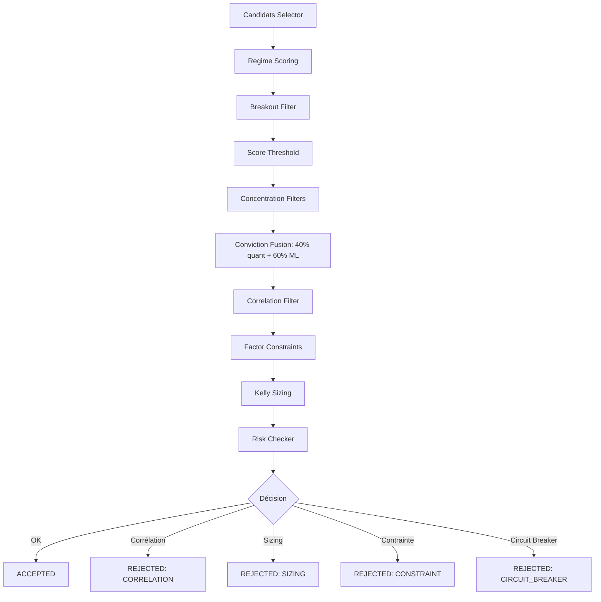
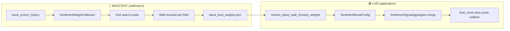

# Synthèse : Calcul des scores Long/Short, Sentiment, ML et Risk

> **Document généré le 2026-06-24** — à mettre à jour au fur et à mesure de la discussion.
> Projet Alpha Trade — `f:\projets`

---

## TABLEAU RÉCAPITULATIF (Quick Reference)

| Question | Réponse |
|----------|---------|
| **Comment on calcule les scores long ?** | `final_score = 0.50×(trend+vcp)/2 + 0.30×total_score + 0.20×RSI`, winsorisé puis normalisé [0,1], avec neutralisation sectorielle |
| **Comment on calcule les scores short ?** | Score baissier composite indépendant : 30% trend faible + 25% RSI bas + 25% prix<SMA50 + 20% prix<SMA200 |
| **Comment le sentiment impacte long/short ?** | Fusion ternaire : `w_quant×score + w_sentiment×sentiment_norm + w_macro×macro_norm`. Mais par défaut `w_sentiment=0`, `w_macro=0` car IC non significatif |
| **Qu'est-ce que le forward sentiment ?** | Walk-forward calibration : backtest OOS par folds glissants pour trouver les meilleurs poids (sentiment, macro, quant). Produit `latest_best_weights.json` |
| **Son impact ?** | Quand calibré et appliqué, ajuste le `final_score` en ajoutant une composante sentiment/macro. Mais la calibration confirme que le quant seul est optimal |
| **Comment ML entraîne long/short ?** | LSTM 2 couches + Attention temporelle sur séquences de 20 jours. Features OHLCV + sentiment + contexte selector. Target = rendement forward binaire ou ternaire. Split chronologique avec purge |
| **Comment ML prédit ?** | Charge champion model → compute features → inférence → softmax → calibration Platt → `predicted_proba` inséré en DB |
| **Comment le risque sélectionne ?** | 1) Regime scoring 2) Breakout filter 3) Score threshold 4) Concentration 5) Conviction = 40%×quant + 60%×ML 6) Corrélation filter 7) Factor constraints 8) Kelly/ATR sizing 9) Circuit breaker → Décision finale |
| **Backtest vs Live ?** | **Backtest** = rejoue l'historique depuis `stock_scores_history` (PIT), prédictions ML persistées, simulation in-memory. **Live** = recalcule tout en temps réel depuis `stock_bars_daily`, inférence ML live, vrais ordres Alpaca |
| **Qu'est-ce qui diffère entre long et short ?** | Short = score dédié indépendant du `final_score`, conviction inversée (`1-score`), exempté du breakout filter, proba ML distincte (`proba_short`), paramètres risk dédiés (max 2 positions, TP 8%, trailing 10%) |
| **Comment sont calibrés les poids ?** | Grid search backtest sur `stock_scores_history` : conviction (quant/ML), sentiment (quant/sentiment/macro), Kelly (fraction, payoff). Métriques : IC, hit_rate, Sharpe, log_growth |
| **Comment le régime impacte les scores ?** | 2 jeux de poids : **NORMAL** (trend_vcp=0.50, total=0.30, rsi=0.20) vs **CAPITAL_PRESERVATION** (trend_vcp=0.25, total=0.15, rsi=0.10 + 0.50 défensif). Rotation forcée si perte > -3% sur 4 semaines. Shortscore non affecté |
| **Champion selection ML ?** | ⚠️ Désactivé par défaut → toujours `lstm_attention`. Si activé : choisit entre LSTM, CatBoost, LightGBM, GlobalModel sur métrique `selection_score` |
| **Target optimization ?** | ⚠️ Désactivé par défaut. Grid search horizon×seuils UP×seuils DOWN. Score = trade_rate × class_balance × separation |
| **Paramètres spécifiques shorts ?** | Max 2 positions, TP 8%, trailing 10%, time-stop 20j, score min 0.30. Breakout filter exempté. Conviction = 0.40×(1-score) + 0.60×proba_ml_short |
| **Caveats critiques ?** | Sentiment/macro désactivés (IC≈0), champion selection off, target optimization off, filtres régime non câblés, short_score PIT dégradé (SMA absents), fills parfaits en backtest |

---

## SOMMAIRE DES SECTIONS

| Section | Contenu | Mode |
|---------|---------|------|
| **0. Architecture Backtest vs Live** | Préface : 2 modes (LIVE/BACKTEST), rôle de `stock_scores_history` (PIT), cycle hybride walk-forward | — |
| **1. Calcul des scores Long/Short** | Formules `final_score` et `short_score`, facteurs techniques, neutralisation sectorielle, rank_and_select | 🟢 LIVE |
| **2. Utilisation du sentiment** | Pipeline FinBERT → agrégation → fusion ternaire → `final_score_sentiment`, poids par défaut (sentiment=0) | 🟢 LIVE |
| **3. Walk-Forward Sentiment** | Calibration OOS par folds glissants, `latest_best_weights.json`, application live, bornes [0.05, 0.40] | 🟣 HYBRIDE |
| **4. ML — Entraînement** | LSTM 2 couches + Attention temporelle, features V1/Expert/Sentiment/Selector/Cross-sectional, target binaire/ternaire | 🟢 LIVE |
| **5. ML — Prédiction** | Inférence (chargement artefacts → compute features → softmax → Platt), drift monitoring (KS+PSI), kill-switch | 🟢 LIVE |
| **6. Module Risque** | Pipeline 9 étapes : regime scoring → breakout → threshold → concentration → conviction → corrélation → factor → Kelly/ATR → circuit breaker | 🟢🔵 BOTH |
| **7. Régime de Marché** | Poids NORMAL vs CAPITAL_PRESERVATION, MomentumRotationState (-3%/4sem), filtres défensifs, asymétrie long/short | 🟢🔵 BOTH |
| **8. Calibration des Poids** | 3 niveaux : Conviction (quant/ML), Sentiment (quant/sentiment/macro), Kelly (fraction, payoff, edge) | 🟣 HYBRIDE |
| **9. ML — Détails avancés** | Champion selection (⚠️ off), target optimization (⚠️ off), business_score vs selection_score, threshold optimization | 🟢 LIVE |
| **10. Short — Spécificités** | Paramètres risk dédiés, tableau comparatif long/short, consommation du `short_score`, conviction short inversée | 🟢 LIVE |
| **11. Caveats** | 9 points d'attention : fonctionnalités désactivées, PIT dégradé, asymétries long/short, limites backtest | — |
| **12. Résumé Synthétique** | Tableau récapitulatif (rappel en fin de document) | — |
| **13. Backtest vs Live — Détail** | 8 sous-sections : sources, sentiment, ML, exécution, walk-forward, CLI, dégradation PIT par composant | — |
| **14. Glossaire** | Tous les fichiers clés avec leur mode (LIVE / BACKTEST / BOTH / HYBRIDE) | — |

---

## 0. ARCHITECTURE BACKTEST vs LIVE

Le système fonctionne selon **deux modes** radicalement différents qu'il faut bien distinguer.

### 🟢 Mode LIVE (production)

Le pipeline **calcule tout en temps réel** :

```
EODHD/API → stock_bars_daily → Screener → stock_scores
                                          → Selector → stock_scores (final_score)
News API  → FinBERT → ticker_daily_sentiment_features
                     → Signal Aggregator → stock_scores (final_score_sentiment)
                                          → ModelFactory → model_predictions
                                          → PortfolioBuilder → portfolio_targets
                                          → Execution Engine → Ordres Alpaca
```

- **Source de données** : `stock_bars_daily` (OHLCV temps réel), `stock_scores` (snapshot courant)
- **Sentiment** : calculé LIVE par `SentimentSignalAggregator.merge()` → persiste dans `stock_scores`
- **ML** : inférence LIVE par `predictor.py` → persiste dans `model_predictions`
- **Exécution** : vrais ordres Bracket OCO chez Alpaca (paper ou live)

### 🔵 Mode BACKTEST (recherche/calibration)

Le backtest **ne recalcule rien**, il **rejoue l'historique** à partir de snapshots PIT (Point-In-Time) :

```
stock_scores_history (PIT)  ──→  signal_replay.py (rejoue la fusion conviction)
model_predictions (DB)      ──→  simulator.py (simule les entrées/sorties in-memory)
stock_bars_daily (EODHD)    ──→  data_loader.py (charge l'OHLCV historique)
```

- **Source de données** : `stock_scores_history` (snapshots PIT quotidiens), `stock_bars_daily` avec `source='eodhd_eod'` uniquement
- **Sentiment** : déjà pré-calculé dans `stock_scores_history.final_score_sentiment` (pas de recalcul)
- **ML** : lit les prédictions déjà persistées dans `model_predictions` (pas d'inférence live)
- **Exécution** : simulation synthétique in-memory (fills parfaits au prix d'ouverture J+1, bracket stops simulés)

### 🔄 Table de snapshot PIT : `stock_scores_history`

C'est la **pierre angulaire** du backtest. Cette table est remplie par `backfill_scores_history.py` qui capture **chaque jour** l'état exact de `stock_scores` (scores, sentiment, walk-forward weights). Sans cette table, le backtest n'est pas strictement PIT et utilise un fallback dégradé.

### 🟣 Mode HYBRIDE : Walk-Forward Sentiment

La calibration des poids sentiment/macro/quant est un **méta-backtest** :
1. On exécute plusieurs backtests avec différentes combinaisons de poids
2. On évalue les performances OOS (Out-Of-Sample) par folds glissants
3. On sélectionne les meilleurs poids → sauvegardés dans `latest_best_weights.json`
4. Ces poids peuvent ensuite être appliqués en LIVE

---

## 1. CALCUL DES SCORES LONG ET SHORT 🟢 LIVE

### 1.1 Architecture en 3 couches

Le calcul des scores est un pipeline à **3 étages** :

```
Screener → Selector (factors + ranking) → Signal Aggregator (sentiment boost)
```

### 1.2 Screener (`screener/pipeline.py`) — Score de base `total_score`

Le screener est le **premier filtre large**. Il produit pour chaque symbole un `total_score` ∈ [0,1] composé de :

$$total\_score = 0.15 \times liquidity\_val + 0.55 \times RSI\_norm + 0.30 \times historical\_range\_score$$

- **`liquidity_val`** : dollar volume moyen sur 20 jours, normalisé via winsorisation [1%, 99%] + min-max [0,1]
- **`RSI_norm`** : force relative vs SPY (relative strength index), normalisé
- **`historical_range_score`** : position du prix dans le range 2 ans (0 = au plus bas, 1 = au plus haut)

### 1.3 Selector (`selector/`) — Score technique `final_score`

Le **Selector** (`alpha_scanner.py`) calcule les facteurs techniques puis les fusionne.

#### a) Facteurs techniques (`selector/factors.py`)

La fonction `compute_factor_frame()` calcule ces facteurs **purs** (sans I/O) :

| Facteur | Description |
|---------|-------------|
| `trend_score` | Score Minervini (0-1) : position du prix vs MA50/150/200 + pente du MA200 |
| `vcp_score` | Volatility Contraction Pattern (0-1) : contraction de volatilité |
| `ma50/150/200` | Moyennes mobiles simples |
| `atr_20`, `atr_pct_20` | Average True Range (20j) |
| `beta_126` | Bêta vs SPY sur 126 jours |
| `high_52w_proximity` | Proximité du plus haut 52 semaines |
| `volatility_ratio` | Ratio vol 10j / vol 60j |
| `weekly_trend_score` | Tendance hebdomadaire (close vs MA10/MA30 weekly) |

#### b) Fusion des scores (`selector/ranking.py`) — `merge_scores()`

C'est le cœur du calcul. La formule produit un `final_score` ∈ [0,1] :

$$final\_score = w_{trend\_vcp} \times \frac{trend\_score + vcp\_score}{2} + w_{total\_score} \times total\_score_{norm} + w_{rsi} \times RSI_{norm}$$

Les poids **par défaut** (en régime `normal`) :
- `weight_trend_vcp` = **0.50** (momentum technique)
- `weight_total_score` = **0.30** (score screener)
- `weight_rsi` = **0.20** (force relative)

Chaque composante est **winsorisée** [1%, 99%] puis **normalisée** [0,1] via `winsorize_and_normalize()`.

#### c) Neutralisation sectorielle (`apply_factor_neutralization()`)

Applique un **z-score intra-secteur** sur `total_score` et `relative_strength_index` :

$$z\_score_{secteur} = \frac{x - \mu_{secteur}}{\sigma_{secteur}}$$

Puis re-normalise en [0,1]. Cela évite qu'un secteur entier soit sur/sous-représenté à cause d'un biais sectoriel.

#### d) Sélection finale (`rank_and_select()`)

1. Trie par `final_score` décroissant
2. Applique `apply_sector_neutrality()` : **round-robin** avec un plafond par secteur (`sector_cap_ratio`)
3. Sélectionne le **top N** (typiquement 20-30 positions)

---

### 1.4 Score Short dédié (`selector/short_score.py`)

Les shorts ne sont PAS les bottom-N du `final_score`. Ils utilisent un **score baissier composite** indépendant (0-1, plus c'est haut = plus baissier) :

$$short\_score = 0.30 \times (1 - trend\_score) + 0.25 \times (1 - \frac{RSI}{100}) + 0.25 \times \mathbf{1}[prix < SMA50] + 0.20 \times \mathbf{1}[prix < SMA200]$$

Les 4 facteurs :
1. **Trend faible** (30%) : `1 - trend_score` — un trend_score bas (ex: 0.1) donne 0.9 de contribution bearish
2. **RSI bas** (25%) : RSI < 40 → bearish (transformé linéairement)
3. **Prix sous SMA50** (25%) : booléen, +0.25 si sous la MM 50 jours
4. **Prix sous SMA200** (20%) : booléen, +0.20 si sous la MM 200 jours

La sélection short est faite par `rank_and_select_short()` qui trie par `short_score` décroissant, en excluant les symboles déjà sélectionnés en long.

#### Fichiers clés :
- `selector/short_score.py` — `compute_short_score()`, `enrich_with_short_score()`
- `selector/ranking.py` — `rank_and_select_short()`

---

## 2. UTILISATION DU SENTIMENT POUR LONG ET SHORT 🟢 LIVE

### 2.1 Pipeline Sentiment (`event_sentiment/`)

```
News API → ingestion.py → scoring.py (FinBERT) → aggregation.py → signal_aggregator.py → stock_scores
```

#### Niveau 1 — Scoring article par article (`scoring.py`)
- **FinBERT** (ProsusAI/finbert) classifie chaque article : `positive`, `neutral`, `negative`
- Produit un `sentiment_net` ∈ [-1, 1] et une `confidence` ∈ [0, 1]

#### Niveau 2 — Agrégation journalière (`aggregation.py`)
- `build_ticker_daily_features()` : par (symbole, date) → `sentiment_net_mean_1d`, `news_count_1d`, `major_event_flag`, etc.
- `build_sector_daily_features()` : par (secteur, date) → `sector_impact_score`, `macro_event_intensity`

#### Niveau 3 — Règles macro (`macro_rules.py`)
- Détection d'événements macro : FOMC, CPI, emploi, géopolitique, fiscal
- Propagation d'impact par secteur (ex: hausse des taux → négatif pour Tech, positif pour Financials)

### 2.2 Fusion Sentiment → Score (`signal_aggregator.py`)

Le `SentimentSignalAggregator.merge()` fusionne le score quantitatif avec le sentiment.

#### Étape 1 — Calcul du signal sentiment agrégé

Pour chaque symbole, on agrège les N derniers jours de sentiment avec **décroissance temporelle exponentielle** :

$$w_{jour} = 0.5^{\frac{age\_jours}{demi\_vie}}$$

Avec `demi_vie = 2` jours par défaut. Chaque jour est aussi pondéré par son `news_count`.

Condition d'activation : il faut au moins `min_news_count` articles (défaut = 2) pour que le signal soit actif.

#### Étape 2 — Normalisation

Le signal agrégé `sentiment_net_agg` ∈ [-1, 1] est transformé en [0, 1] :

$$sentiment\_signal\_norm = \frac{\mathrm{clamp}(sentiment\_net\_agg,\, -1,\, 1) + 1}{2}$$

0.5 = neutre, 0 = très négatif, 1 = très positif.

#### Étape 3 — Fusion ternaire (`fuse_sentiment()` dans `core/conviction.py`)

$$final\_score\_sentiment = w_{quant} \times final\_score + w_{sentiment} \times sentiment\_norm + w_{macro} \times macro\_norm$$

Le tout clippé dans [0, 1].

Si le signal sentiment n'est **pas actif** (pas assez de news), on utilise **0.5** (neutre) au lieu de `sentiment_norm`.

### 2.3 Poids et impact réel

**IMPORTANT** — Les poids par défaut sont :
- `quant_weight` = **1.00** (100% quantitatif)
- `sentiment_weight` = **0.00** (désactivé par défaut !)
- `macro_weight` = **0.00** (désactivé par défaut !)

**Pourquoi ?** Le diagnostic empirique (IC = Information Coefficient) sur 2020-2025 a montré :
- **Sentiment** : IC ≈ 0.01, t-stat ≈ 1.1 → **non significatif statistiquement**
- **Macro** : IC ≈ 0, t-stat ≈ 0 → **aucun pouvoir prédictif**
- **Quant** : IC ≈ 0.03, t-stat ≈ 2.5 → **seul signal significatif**

Donc **en production, le sentiment n'a pas d'impact par défaut**. Les poids sont laissés configurables pour exploration/calibration.

#### Fichiers clés :
- `event_sentiment/signal_aggregator.py` — `SentimentSignalAggregator`, `SentimentBoostConfig`
- `core/conviction.py` — `fuse_sentiment()`, `SentimentFusionWeights`

---

## 3. WALK-FORWARD SENTIMENT — Calibration des poids 🟣 HYBRIDE (backtest → live)

### 3.1 Qu'est-ce que c'est ?

Le **Walk-Forward Sentiment** (`backtesting/sentiment_calibration.py` + `backtesting/walk_forward.py`) est un processus de **calibration hors-échantillon** qui détermine les meilleurs poids `(w_sentiment, w_macro, w_quant)` à utiliser pour la fusion.

### 3.2 Fonctionnement

1. **Chargement du dataset** : `stock_scores_history` + forward returns (rendements futurs à J+5, J+10, J+20)
2. **Grille de scénarios** (11 scénarios par défaut) :
   - `sentiment_weight` ∈ {0.00, 0.02, 0.05, 0.08, 0.10}
   - `macro_weight` ∈ {0.00, 0.02}
   - `quant_weight = 1.0 - sentiment - macro`
3. **Walk-forward par folds glissants** :
   - Pour chaque fold (ex: train 2020-2022 → test 2023) :
     - Sur la période **train** : teste tous les scénarios, garde le meilleur
     - Sur la période **test** (OOS) : évalue le scénario gagnant
   - On obtient un score OOS moyen pour chaque scénario
4. **Sélection** : le scénario avec le meilleur score OOS global (Sharpe, rendement total, max drawdown)

### 3.3 Fichiers produits

- `latest_best_weights.json` (ou `walk_forward_best_weights_latest.json`)
- Contient : `sentiment_weight`, `macro_weight`, `quant_weight`, `calibration_run_id`, `best_scenario_name`

### 3.4 Application des poids calibrés (`backtesting/walk_forward.py`)

La fonction `resolve_latest_walk_forward_weights()` cherche ces fichiers dans :
- `artifacts/sentiment_walk_forward/`
- `artifacts/sentiment_calibration/`
- `artifacts/`

Les poids sont **clippés** dans [0.05, 0.40] (bornes business de sécurité) via `validate_walk_forward_weights()`.

### 3.5 Impact sur long et short

Quand les poids walk-forward sont appliqués (via `SentimentBoostConfig`), le `final_score_sentiment` remplace ou complète le `final_score` quantitatif pur. Les colonnes impactées dans `stock_scores` :

| Colonne | Signification |
|---------|---------------|
| `final_score_sentiment` | Score final avec boost sentiment (utilisé si calibré) |
| `final_score_walk_forward` | Score final avec poids walk-forward appliqués |
| `walk_forward_sentiment_weight` | Poids sentiment calibré |
| `walk_forward_macro_weight` | Poids macro calibré |
| `walk_forward_quant_weight` | Poids quant calibré |

⚠️ **En pratique actuelle** : vu que les poids calibrés optimaux tendent vers `sentiment=0, macro=0, quant=1`, le walk-forward confirme que le signal quantitatif seul est le plus robuste.

#### Fichiers clés :
- `backtesting/sentiment_calibration.py` — `SentimentWeightCalibrator`
- `backtesting/walk_forward.py` — `resolve_latest_walk_forward_weights()`, `WalkForwardWeights`

---

## 4. ML — ENTRAÎNEMENT LONG ET SHORT 🟢 LIVE (training offline)

### 4.1 Architecture du modèle (`modelFactory/model.py`)

Le modèle est un **LSTM + Attention Temporelle** :

```
Input [batch, seq_len, n_features]
  → LSTM multi-couche (2 couches, hidden=128, dropout=0.3)
  → Temporal Soft-Attention (pondère les pas de temps)
  → Dropout
  → Linear(hidden, num_classes)
  → Softmax → probabilités
```

#### Modes de classification

| Mode | Classes | Description |
|------|---------|-------------|
| `binary` | 2 classes | 0 = baisse/flat, 1 = hausse |
| `ternary` | 3 classes | 0 = short (baisse), 1 = flat (neutre), 2 = long (hausse) |

En mode ternaire, les poids de classe sont asymétriques pour contrer le déséquilibre : `[1.5, 1.0, 1.5]` (short, flat, long).

### 4.2 Features utilisées (`modelFactory/features.py`)

#### Features V1 (13 colonnes) — dérivées OHLCV
`daily_return, log_return, intraday_range, overnight_gap, close_to_vwap, volume_ratio_20, rolling_volatility_20, rolling_volatility_60, rolling_mean_return_5, rolling_mean_return_20, rsi_14, atr_14_norm, is_filled`

#### Features Expert (18 colonnes supplémentaires)
Distances aux SMA/EMA, momentum, force relative vs marché, régimes bull/risk-off

#### Features Sentiment (4 colonnes) — si `include_sentiment=True`
`sentiment_net_mean_1d, sentiment_confidence_mean_1d, news_count_log, major_event_flag`

#### Features Contexte Selector (23 colonnes) — si `include_selector_context=True`
`trend_score, vcp_score, final_score, short_score, market_cap, beta_126, spread_bps, days_to_earnings`, etc.

#### Features Cross-Sectionnelles — si `enable_cross_sectional=True`
Rangs cross-sectionnels dans l'univers (ret_20_rank, relative_strength_rank, volatility_rank, dollar_volume_rank)

### 4.3 Target (étiquette à prédire)

La target est construite par `build_target()` :

- **Binary** : `1` si le rendement forward (J+horizon) > `target_threshold_up` (ex: +2%), sinon `0`
- **Swing Cash** : `1` si rendement > seuil UP, `0` si rendement < seuil DOWN, `NaN` (ignoré) si entre les deux

$$target\_binary = \mathbf{1}[\, r_{t,\, t+horizon} > threshold\_up \,]$$

### 4.4 Pipeline d'entraînement (`modelFactory/trainer.py`)

```python
# 1. Chargement des données
bars_df = load_symbol_bars(symbol, start, end)
sentiment_df = load_symbol_sentiment(symbol)    # optionnel
selector_df = load_symbol_selector_context(symbol)  # optionnel
benchmark_df = load_benchmark_bars()

# 2. Feature engineering
features_df = compute_features(bars_df, sentiment_df, benchmark_df, selector_df)

# 3. Split chronologique (pas de shuffle !)
train, val, test = chrono_split(features_df, train_ratio=0.70, val_ratio=0.15)

# 4. Scaling (StandardScaler)
scaler = FeatureScaler().fit(train)
train_scaled = scaler.transform(train)

# 5. Dataset de séquences (seq_len=20 jours)
train_dataset = SequenceDataset(train_scaled, seq_len=20, target_col="target")

# 6. Training PyTorch Lightning
model = LSTMAttentionModule(input_size=n_features, hidden_size=128, num_layers=2, dropout=0.3)
trainer = L.Trainer(max_epochs=50, callbacks=[EarlyStopping, ModelCheckpoint])
trainer.fit(model, train_loader, val_loader)

# 7. Calibration Platt (optionnelle)
calibrator = PlattCalibrator()
calibrator.fit(val_margins, val_labels)

# 8. Challengers optionnels (CatBoost, LightGBM)
catboost_metrics = run_catboost_baseline(train, val, test)
lightgbm_metrics = run_lightgbm_baseline(train, val, test)

# 9. Sélection du champion
champion = select_champion(lstm_metrics, catboost_metrics, lightgbm_metrics)
```

### 4.5 Walk-forward ML (`generate_walk_forward_splits()`)

Le trainer supporte aussi le **walk-forward ML** : on entraîne sur des fenêtres glissantes (expanding window) pour valider la robustesse temporelle.

#### Fichiers clés :
- `modelFactory/model.py` — `LSTMAttentionModule`, `LSTMAttentionClassifier`, `TemporalAttention`
- `modelFactory/trainer.py` — `train_symbol()`
- `modelFactory/features.py` — `compute_features()`, `get_feature_columns()`
- `modelFactory/dataset.py` — `SequenceDataset`, `chrono_split()`, `FeatureScaler`

---

## 5. ML — PRÉDICTION LONG ET SHORT 🟢 LIVE

### 5.1 Service d'inférence (`modelFactory/predictor.py`)

```python
# Pour chaque symbole candidat :
# 1. Charger les artefacts du champion
checkpoint = torch.load(f"artifacts/models/{symbol}/champion.ckpt")
scaler = pickle.load(open(f"artifacts/models/{symbol}/scaler.pkl", "rb"))
calibrator = pickle.load(open(f"artifacts/models/{symbol}/calibrator.pkl", "rb"))

# 2. Charger les dernières barres + features
bars = load_symbol_bars(symbol, lookback=252)
features = compute_features(bars, include_sentiment=True, include_selector_context=True)

# 3. Construire la séquence d'entrée (derniers seq_len jours)
sequence = features.tail(seq_len)  # 20 jours
sequence_scaled = scaler.transform(sequence)

# 4. Inférence
model.eval()
with torch.no_grad():
    logits, attn_weights = model(sequence_scaled)  # [1, num_classes]
    probs = softmax(logits)

# 5. Calibration Platt (si disponible)
if calibrator and calibrator.fitted:
    margin = logits[:, 1] - logits[:, 0]  # binaire
    calibrated_proba = calibrator.predict_proba(margin)

# 6. Insertion dans model_predictions (DB)
insert_predictions(symbol, predicted_proba, prediction_date)
```

### 5.2 Pour les shorts

En mode **ternaire** (num_classes=3), le modèle produit 3 probabilités :

| Classe | Index | Interprétation |
|--------|-------|----------------|
| Short  | 0     | Probabilité de baisse significative |
| Flat   | 1     | Probabilité de stagnation |
| Long   | 2     | Probabilité de hausse significative |

En mode **binaire** (num_classes=2), on a :
- `proba_long = probs[:, 1]` — probabilité de hausse
- Pour le short, on peut utiliser `1 - proba_long` comme approximation

### 5.3 Drift Monitoring (`modelFactory/drift_monitor.py`)

Avant d'utiliser les prédictions, le système vérifie la **dérive du modèle** :
- **KS test** : compare la distribution des prédictions actuelles vs baseline 30 jours
- **PSI** (Population Stability Index)
- Statuts : `OK` / `WARN` / `ALERT`
- Si `ALERT` → le **ML kill-switch** (`risk_management/ml_gate.py`) désactive la consommation des prédictions ML

#### Fichiers clés :
- `modelFactory/predictor.py` — `predict_symbol()`
- `modelFactory/drift_monitor.py` — drift detection
- `modelFactory/drift_policy.py` — décisions de drift
- `risk_management/ml_gate.py` — ML kill-switch

---

## 6. MODULE RISQUE — SÉLECTION LONG ET SHORT 🟢🔵 BOTH (live + backtest)

### 6.1 Pipeline complet (`risk_management/portfolio_builder.py`)

Le `PortfolioBuilder.build()` prend les candidats du selector et les transforme en portefeuille final :

```
Candidats (CandidateScore)
  │
  ├─ 0. Scoring directionnel (regime-aware + rotation momentum)
  │     → Ajuste les poids selon le régime marché (normal / capital_preservation)
  │
  ├─ 0bis. Filtre anti-faux-départs (Breakout Confirmation)
  │     → Exige min N jours de présence dans les candidats (shorts exemptés)
  │
  ├─ 0ter. Seuil de score minimum
  │     → Long : score_used >= min_score_threshold
  │     → Short : score_used >= min_score_threshold_short
  │
  ├─ 0quat. Filtres de concentration
  │     → Max trades par symbole (fenêtre glissante)
  │     → Blacklist après N pertes consécutives
  │
  ├─ 1. Enrichissement → conviction score
  │     → Fusion quant + ML (via core.conviction)
  │
  ├─ 2. Filtre de corrélation
  │     → Pearson ou Factoriel (si enable_factor_model=True)
  │     → Garde les plus hautes convictions, rejette les corrélés
  │
  ├─ 2bis. Contraintes factorielles (si enable_factor_model=True)
  │     → Max beta portefeuille, max concentration par facteur
  │
  ├─ 3. Sizing (Kelly ou ATR)
  │     → Calcule le nombre d'actions
  │
  ├─ 4. Risk Checker
  │     → Vérifie contraintes (poids max, secteur max, ADV, circuit breaker)
  │
  └─ 5. Décision finale (ACCEPTED / REDUCED / REJECTED)
```

### 6.2 Conviction Score — Fusion Quant + ML

C'est le **score clé** qui détermine tout. Défini dans `core/conviction.py` :

#### Pour les LONGS :

$$conviction\_long = 0.40 \times score\_quant + 0.60 \times proba\_ml\_long$$

Clampé dans [0, 1].

- `score_quant` = `final_score` du selector (ou `final_score_sentiment` si boost activé)
- `proba_ml_long` = prédiction ML (probabilité que le rendement futur > seuil)
- Poids par défaut : **40% quant, 60% ML**

#### Pour les SHORTS (`compute_conviction_short()`) :

$$conviction\_short = 0.40 \times (1 - score\_quant) + 0.60 \times proba\_ml\_short$$

- Le score quant est **inversé** (un bon long a un score élevé → mauvais short)
- `proba_ml_short` = probabilité de baisse prédite par le ML (en mode ternaire)

### 6.3 Kelly Sizing (`risk_management/kelly.py`)

Le Kelly Sizer V2 combine :

$$p_{eff} = \alpha \times proba\_ml + (1 - \alpha) \times win\_rate\_historique$$

$$f_{kelly} = p_{eff} - \frac{1 - p_{eff}}{payoff\_ratio}$$

$$f_{fraction} = f_{kelly} \times kelly\_multiplier$$

$$shares = \frac{equity \times risk\_per\_trade \times f_{fraction}}{ATR \times stop\_multiple}$$

Borné par la limite ATR.

### 6.4 Filtre de Corrélation (`risk_management/correlation_filter.py`)

**Algorithme glouton** :
1. Trie les candidats par conviction décroissante
2. Pour chaque candidat, vérifie la corrélation Pearson avec les déjà-sélectionnés
3. Si `|corr| > correlation_threshold` (défaut 0.70) → **REJETÉ**
4. Sinon → **ACCEPTÉ**

Alternative : **filtre factoriel** (`factor_model.py`) qui utilise un modèle à 4 facteurs (market, size, momentum, value) avec covariance EWMA.

### 6.5 Circuit Breaker (`risk_management/circuit_breaker.py`)

Bloque les entrées si :
- **Drawdown** > seuil (ex: -10%)
- **Perte journalière** > seuil (ex: -3%)
- Supporte un mode **dégradé** (allocation réduite)

### 6.6 Flux de décision complet



#### Fichiers clés :
- `risk_management/portfolio_builder.py` — `PortfolioBuilder.build()`
- `core/conviction.py` — `fuse()`, `fuse_short()`, `compute_conviction()`, `compute_conviction_short()`
- `risk_management/kelly.py` — `KellySizer.compute()`
- `risk_management/correlation_filter.py` — `filter_correlated()`
- `risk_management/circuit_breaker.py` — `CircuitBreaker`
- `risk_management/concentration.py` — `SymbolTradeTracker`, `ConsecutiveLossTracker`
- `risk_management/factor_model.py` — CWMS 4-factor model

---

## 7. RÉGIME DE MARCHÉ — Impact sur les scores 🟢🔵 BOTH

### 7.1 Poids directionnels par régime (`selector/regime_scoring.py`)

Le régime de marché modifie les poids de composition du `final_score`. Deux jeux de poids :

#### NORMAL (marché haussier/neutre)

| Facteur | Poids |
|---------|-------|
| `trend_vcp` (momentum) | **0.50** |
| `total_score` (qualité) | **0.30** |
| `rsi` (force relative) | **0.20** |
| `defensive_beta` | 0.00 |
| `defensive_size` | 0.00 |
| `defensive_low_vol` | 0.00 |

#### CAPITAL_PRESERVATION (marché baissier/défensif, calibré 2026-06-17)

| Facteur | Poids |
|---------|-------|
| `trend_vcp` (momentum) | **0.25** |
| `total_score` (qualité) | **0.15** |
| `rsi` (force relative) | **0.10** |
| `defensive_beta` (low beta) | **0.22** |
| `defensive_size` (large cap) | **0.13** |
| `defensive_low_vol` (low volatility) | **0.15** |

**Logique** : en régime `capital_preservation`, ~50% du poids est transféré du momentum vers des facteurs défensifs (low beta, large cap, low vol). Le momentum reste à 25% car l'analyse a montré que les trades momentum restent rentables même en marché baissier, mais la volatilité excessive déclenche le circuit breaker.

**Filtres défensifs additionnels** appliqués uniquement en `capital_preservation` :

| Filtre | Seuil |
|--------|-------|
| Market cap minimum | $2B |
| Spread max | 15 bps |
| Beta max | 1.2 |
| ATR% max | 6% |

### 7.2 MomentumRotationState — Rotation forcée

Mécanisme automatique qui force le passage en mode défensif même en régime `normal` :

- **Fenêtre** : 4 semaines (~20 jours de trading)
- **Seuil** : rendement cumulé du portefeuille < **-3%**
- **Action** : si le portefeuille perd plus de 3% sur 4 semaines → bascule forcée vers les poids `CAPITAL_PRESERVATION`

$$rotation\_active = \mathbf{1}[\, return_{cumul\_4w} < -0.03 \,]$$

### 7.3 Filtres de régime (`selector/regime_filters.py`)

⚠️ **Ces filtres sont définis et testés mais PAS encore câblés dans le pipeline de production.** Ils sont disponibles pour intégration future.

| Filtre | Comportement | Impact |
|--------|-------------|--------|
| `earnings_shield` | `strict_block` : exclut les symboles à J-2/J+2 des earnings. `negative_score` : applique un score négatif | Long + Short |
| `buyback_blackout` | Multiplie le score par ~0.70 pour les symboles en période de blackout pré-earnings | Long + Short |
| `yield_filter` | Exclut les secteurs sur liste noire (taux élevés) et les symboles bloqués | Long + Short |

### 7.4 Impact Long vs Short

**Asymétrie importante** :
- **Long** : le `final_score` est recalculé avec les poids du régime → impact direct sur le classement
- **Short** : utilise `short_score` (colonne indépendante), **non affecté** par `apply_regime_weights()`. Les shorts sont immunisés contre la rotation factorielle du régime
- **Filtres défensifs** (beta, spread, market cap, ATR) : appliqués au DataFrame **avant** ranking → affectent **les deux** (long et short)

---

## 8. CALIBRATION DES POIDS — Multi-niveaux 🟣 HYBRIDE

Le système possède **3 niveaux de calibration** indépendants, tous effectués en backtest :

### 8.1 Poids de Conviction (`backtesting/weights_calibration.py`)

Calibre le mix quant vs ML dans la fusion conviction :

$$conviction = w_{score} \times score\_quant + w_{prediction} \times proba\_ml$$

- **Défaut** : `score_weight=0.40`, `prediction_weight=0.60`
- **Grille** : pas de 0.05 sur [0, 1], somme = 1.0
- **Métriques** : IC (Information Coefficient), hit_rate, Sharpe, log_growth

### 8.2 Poids Sentiment (`backtesting/sentiment_calibration.py`)

Calibre le mix quant vs sentiment vs macro :

$$final\_score\_sentiment = w_{quant} \times score + w_{sentiment} \times sentiment\_norm + w_{macro} \times macro\_norm$$

- **Défaut** : `quant=1.00`, `sentiment=0.00`, `macro=0.00` (désactivé)
- **Résultat empirique** : IC(sentiment) ≈ 0.01 non significatif, IC(macro) ≈ 0
- **Supporte la segmentation par régime** : peut calibrer des poids différents pour `normal` vs `capital_preservation`

### 8.3 Paramètres Kelly (`backtesting/weights_calibration.py`)

Grid search sur :
- `kelly_fraction_multiplier` : [0.25, 0.50, 0.75, 1.0]
- `min_effective_probability` : probabilité edge minimum
- `assumed_payoff_ratio` : ratio gain/perte supposé

---

## 9. ML — DÉTAILS AVANCÉS

### 9.1 Champion Selection (`modelFactory/champion_selection.py`)

⚠️ **Désactivé par défaut** (`enabled=False`, `allow_auto_selection=False`) → le système utilise toujours `lstm_attention` comme champion.

Quand activé, le processus :
1. **Quarantaine** : un modèle doit avoir `min_runs` walk-forward et `min_days` d'ancienneté
2. **Éligibilité** : vérifie les artefacts requis par type de modèle (checkpoint, scaler, config)
3. **Classement** : sélectionne le meilleur parmi LSTM, CatBoost, LightGBM, GlobalModel
4. **Métrique** : `selection_score` (défaut), `business_score`, ou `auc`

### 9.2 Target Optimization (`modelFactory/target_optimization.py`)

⚠️ **Désactivé par défaut** (`enabled=False`). Optimise les paramètres de la target de trading :

| Paramètre | Valeurs candidates |
|-----------|-------------------|
| Horizons | 3, 5, 10, 15 jours |
| Seuils UP | 0%, +1%, +2% |
| Seuils DOWN | 0%, -0.5%, -1% |

**Formule de scoring** : `score = trade_rate × class_balance × separation`
- `trade_rate` : % d'observations avec target non-NaN
- `class_balance` : `1 - |pos_rate - 0.5|/0.5` (pénalise le déséquilibre)
- `separation` : rendement moyen positif - rendement moyen négatif

### 9.3 Business Score vs Selection Score (`modelFactory/evaluation.py`)

**`business_score`** : orienté décision opérationnelle
$$business\_score = precision\_long \times coverage + \max(avg\_return, 0) + 0.10 \times hit\_rate$$

**`selection_score`** : score composite du training run (fallback : `threshold_business_score` → `auc` → 0)

**Threshold optimization** : évalue les seuils de décision [0.50, 0.55, 0.60, 0.65, 0.70] avec contraintes :
- Taux d'action min : 3%
- Taux d'action max : 35%
- Précision long min : 52%

---

## 10. SHORT — Spécificités et paramètres dédiés

### 10.1 Paramètres Risk spécifiques aux shorts

| Paramètre | Défaut | Description |
|-----------|--------|-------------|
| `short_selling_enabled` | `False` | Active/désactive les ventes à découvert |
| `short_max_positions` | `2` | Nombre max de positions short simultanées |
| `short_min_score` | `0.30` | Score minimum pour entrer en short |
| `short_rotation_required` | `True` | Exige une rotation sectorielle pour shorter |
| `short_tp_pct` | `0.08` (8%) | Take-profit |
| `short_trailing_pct` | `0.10` (10%) | Trailing stop |
| `short_time_stop_days` | `20` jours | Time-stop (sortie si pas de mouvement) |
| `min_score_threshold_short` | `0.0` | Seuil de score minimum (ML Sprint 4) |

### 10.2 Différences Long vs Short dans le pipeline

| Aspect | Long | Short |
|--------|------|-------|
| **Score** | `final_score` (multi-factoriel) | `short_score` (baissier composite indépendant) |
| **Regime weights** | Affecté par `apply_regime_weights()` | Non affecté (score indépendant) |
| **Breakout filter** | Soumis au filtre anti-faux-départs | **Exempté** (shorts n'ont pas besoin de confirmation de breakout) |
| **Conviction** | `0.40×score + 0.60×proba_ml_long` | `0.40×(1-score) + 0.60×proba_ml_short` |
| **Score threshold** | `min_score_threshold` | `min_score_threshold_short` (distinct) |
| **Circuit breaker** | Bloqué si actif | Bloqué si actif (identique) |
| **Sizing** | Kelly/ATR standard | Même logique, paramètres distincts |
| **Exécution** | Bracket OCO long | Bracket OCO short (inversé) |

### 10.3 Consommation du `short_score` dans le pipeline

1. `AlphaScanner.run()` → `_enrich_short_score()` ajoute la colonne `short_score` aux candidats
2. `rank_and_select_short()` trie par `short_score` décroissant, exclut les symboles déjà longs, prend le top N
3. En **backtest PIT** (`backfill_scores_history.py`) : `close_df=None` → les facteurs SMA (prix<SMA50, prix<SMA200) du `short_score` ne sont **pas calculés** (seuls trend_score et RSI contribuent)

### 10.4 Conviction Short (`core/conviction.py`)

$$conviction\_short = 0.40 \times (1 - score\_quant) + 0.60 \times proba\_ml\_short$$

- Le score quant est **inversé** : un bon long (score élevé) → mauvais short
- `proba_ml_short` = probabilité de baisse (classe 0 en mode ternaire, ou `1-proba_long` en mode binaire)
- Si `proba_ml_short` est `None` → fallback = `1 - score_quant` uniquement

---

## 11. CAVEATS — Points d'attention

| # | Caveat | Impact |
|---|--------|--------|
| 1 | **Sentiment/macro désactivés par défaut** | `sentiment_weight=0`, `macro_weight=0` — le `final_score_sentiment` = `final_score` pur |
| 2 | **Champion selection désactivée par défaut** | Le système utilise toujours `lstm_attention`, même si CatBoost/LightGBM sont meilleurs |
| 3 | **Target optimization désactivée par défaut** | Les paramètres de target (horizon, seuils) sont fixes, non optimisés automatiquement |
| 4 | **Filtres de régime non câblés** | `earnings_shield`, `buyback_blackout`, `yield_filter` sont codés et testés mais pas appelés dans le pipeline de production |
| 5 | **Short_score PIT dégradé** | En backfill PIT, les facteurs SMA du short_score ne sont pas calculés (`close_df=None`) |
| 6 | **Short non affecté par le régime** | `apply_regime_weights()` modifie `final_score` mais pas `short_score` — les shorts sont insensibles à la rotation factorielle du régime |
| 7 | **Breakout filter long-only** | Les shorts ne passent pas par le filtre de confirmation de breakout |
| 8 | **Fills parfaits en backtest** | `fill_price = entry_price` — pas de slippage simulé en backtest |
| 9 | **Concentration trackers non persistés en backtest** | Trackers frais par run → pas de mémoire cross-run des trades passés |

---

## 12. RÉSUMÉ SYNTHÉTIQUE (rappel)

| Question | Réponse |
|----------|---------|
| **Comment on calcule les scores long ?** | `final_score = 0.50×(trend+vcp)/2 + 0.30×total_score + 0.20×RSI`, winsorisé puis normalisé [0,1], avec neutralisation sectorielle |
| **Comment on calcule les scores short ?** | Score baissier composite indépendant : 30% trend faible + 25% RSI bas + 25% prix<SMA50 + 20% prix<SMA200 |
| **Comment le sentiment impacte long/short ?** | Fusion ternaire : `w_quant×score + w_sentiment×sentiment_norm + w_macro×macro_norm`. Mais par défaut `w_sentiment=0`, `w_macro=0` car IC non significatif |
| **Qu'est-ce que le forward sentiment ?** | Walk-forward calibration : backtest OOS par folds glissants pour trouver les meilleurs poids (sentiment, macro, quant). Produit `latest_best_weights.json` |
| **Son impact ?** | Quand calibré et appliqué, ajuste le `final_score` en ajoutant une composante sentiment/macro. Mais la calibration confirme que le quant seul est optimal |
| **Comment ML entraîne long/short ?** | LSTM 2 couches + Attention temporelle sur séquences de 20 jours. Features OHLCV + sentiment + contexte selector. Target = rendement forward binaire ou ternaire. Split chronologique avec purge |
| **Comment ML prédit ?** | Charge champion model → compute features → inférence → softmax → calibration Platt → `predicted_proba` inséré en DB |
| **Comment le risque sélectionne ?** | 1) Regime scoring 2) Breakout filter 3) Score threshold 4) Concentration 5) Conviction = 40%×quant + 60%×ML 6) Corrélation filter 7) Factor constraints 8) Kelly/ATR sizing 9) Circuit breaker → Décision finale |
| **Backtest vs Live ?** | **Backtest** = rejoue l'historique depuis `stock_scores_history` (PIT), prédictions ML persistées, simulation in-memory. **Live** = recalcule tout en temps réel depuis `stock_bars_daily`, inférence ML live, vrais ordres Alpaca |

---

## 13. BACKTEST vs LIVE — DÉTAIL PAR COMPOSANT

### 13.1 Tableau récapitulatif

| Composant | Scope | Différence clé |
|-----------|-------|----------------|
| `backtesting/simulator.py` | 🔵 BACKTEST | Simule les brackets in-memory ; LIVE utilise de vrais ordres OCO Alpaca |
| `backtesting/signal_replay.py` | 🔵 BACKTEST | Rejoue la fusion conviction en vectorisé sur scores historiques |
| `backtesting/execution_replay.py` | 🔵 BACKTEST | Rejoue le cycle de vie synthétique des ordres (`synthetic_*`) — opt-in |
| `backtesting/execution_bridge.py` | 🟢🔵 BOTH | Modèle de données partagé ; fill `price = entry_price` en backtest (parfait) |
| `backtesting/execution_broker_like.py` | 🔵 BACKTEST | Frames synthétiques pour comparer backtest vs live |
| `backtesting/fidelity.py` | 🟢🔵 BOTH | Traque la dégradation PIT, compare backtest↔live |
| `backtesting/data_loader.py` | 🔵 BACKTEST | Charge `stock_scores_history` (PIT) ou fallback `stock_scores` ; `eodhd_eod` uniquement |
| `backtesting/sentiment_calibration.py` | 🔵 BACKTEST | Grid search des poids → produit `best_weights.json` |
| `backtesting/walk_forward.py` | 🟣 HYBRIDE | Charge les artefacts calibrés ; la calibration est backtest-only |
| `risk_management/portfolio_builder.py` | 🟢🔵 BOTH | Même code ; les sources de données diffèrent (historique vs courant) |
| `event_sentiment/signal_aggregator.py` | 🟢 LIVE | LIVE : calcule `final_score_sentiment` ; BACKTEST : le lit depuis `stock_scores_history` |
| `modelFactory/predictor.py` | 🟢 LIVE | LIVE : exécute l'inférence ; BACKTEST : lit `model_predictions` DB |
| `selector/alpha_scanner.py` | 🟢 LIVE | LIVE : score les candidats ; BACKTEST : lit `stock_scores_history` |
| `core/run_summary.py` | 🟢🔵 BOTH | Infrastructure partagée de suivi d'exécution |

### 13.2 Scores — Différence de source de données

| Aspect | 🟢 LIVE | 🔵 BACKTEST |
|--------|---------|-------------|
| **Table source** | `stock_scores` (snapshot courant) | `stock_scores_history` (snapshots PIT quotidiens) |
| **Calcul** | `AlphaScanner.run()` → calcule facteurs + scores | `data_loader.load_scores()` → lit les snapshots |
| **Fraîcheur** | Dernier run du scanner | `snapshot_date` = date historique exacte |
| **Fallback** | N/A | Si `stock_scores_history` vide → fallback `stock_scores` (dégradé, non PIT) |
| **Mode strict** | N/A | `--strict-pit` → lève `PitHistoryRequiredError` si pas d'historique |

### 13.3 Sentiment — Différence de calcul

| Aspect | 🟢 LIVE | 🔵 BACKTEST |
|--------|---------|-------------|
| **Calcul** | `SentimentSignalAggregator.merge()` → fusionne scores + sentiment du jour | Lit `final_score_sentiment` déjà stocké dans `stock_scores_history` |
| **Données sentiment** | `ticker_daily_sentiment_features` (temps réel) | Pré-calculées et snapshottées dans l'historique |
| **Walk-forward** | Poids calibrés appliqués si `walk_forward_overlay_applied=True` | Poids lus depuis `walk_forward_*_weight` dans `stock_scores_history` |
| **Fallback** | Si pas assez de news → signal neutre (0.5) | Si colonne absente → fallback vers `final_score` (sans sentiment) |

### 13.4 ML — Différence de prédiction

| Aspect | 🟢 LIVE | 🔵 BACKTEST |
|--------|---------|-------------|
| **Inférence** | `predictor.predict_symbol()` → charge le modèle, exécute l'inférence | Lit `model_predictions` table (prédictions déjà persistées) |
| **Persistance** | `insert_predictions()` → écrit dans `model_predictions` | Pas d'écriture |
| **Stratégie PIT** | N/A | `--ml-pit-strategy` : `use-persisted` (défaut), `rebuild-missing`, `walk-forward-train-then-predict` |
| **Drift** | Vérifié par `drift_monitor.py` → kill-switch si ALERT | Non vérifié (les prédictions historiques sont figées) |
| **Fallback** | Si drift ALERT → ML désactivé, conviction = score quant uniquement | Si prédiction manquante → conviction = score quant uniquement |

### 13.5 Exécution — Différence d'envoi d'ordres

| Aspect | 🟢 LIVE | 🔵 BACKTEST |
|--------|---------|-------------|
| **Ordres** | Vrais ordres Bracket OCO chez Alpaca (paper/live) | Simulation synthétique in-memory |
| **Fill** | Prix réel du marché avec slippage | Prix `next_open` parfait (pas de slippage) |
| **Stop/trailing** | Ordres OCO gérés par le broker | Simulés en mémoire (peak_high/trough_low tracking) |
| **Protection logic** | `execution_engine` + `protection_watcher` | `simulator.py` avec `use_live_protection_logic=True` (mêmes règles, simulées) |
| **Concentration** | Trackers persistés en DB (état cross-run) | Trackers frais par run (pas de persistance) |
| **Dry-run** | Disponible (`--dry-run`) : calcule sans envoyer | N/A (toujours simulé) |

### 13.6 Walk-Forward — Cycle calibration → application



### 13.7 CLI — Points d'entrée

| Commande | Mode | Description |
|----------|------|-------------|
| `python -m backtesting run` | 🔵 BACKTEST | Backtest principal |
| `python -m backtesting calibrate-sentiment-weights` | 🔵 BACKTEST | Calibration des poids sentiment |
| `python -m backtesting walk-forward-sentiment` | 🔵 BACKTEST | Walk-forward calibration |
| `python -m backtesting backfill-scores-history` | 🔵 BACKTEST | Remplit `stock_scores_history` pour PIT |
| `python run_execution.py simulate` | 🟢 LIVE (dry-run) | Simulation sans ordre réel |
| `python run_execution.py paper` | 🟢 LIVE (paper) | Paper trading Alpaca |
| `python run_execution.py live` | 🟢 LIVE (real) | Trading réel Alpaca |

### 13.8 Indicateurs de dégradation PIT (fidelity.py)

Ces indicateurs traquent la qualité du backtest par rapport au live :

| Indicateur | Signification |
|------------|---------------|
| `stock_scores_history_empty` | Aucun snapshot PIT disponible → fallback dégradé |
| `stock_scores_history_missing` | Certaines dates manquent dans l'historique |
| `ml_predictions_missing` | Prédictions ML absentes pour certains symboles |
| `sentiment_missing_fallback_final_score` | Sentiment absent → utilisation du score quant uniquement |
| `walk_forward_artifact_missing` | Artefact de calibration introuvable |
| `ml_rebuild_partial_failure` | Échec de reconstruction des prédictions ML |

---

## 14. GLOSSAIRE DES FICHIERS CLÉS

| Fichier | Mode | Rôle |
|---------|------|------|
| `selector/ranking.py` | 🟢 LIVE | Fusion scores, neutralisation sectorielle, rank_and_select |
| `selector/short_score.py` | 🟢 LIVE | Score baissier dédié pour shorts |
| `selector/factors.py` | 🟢 LIVE | Calcul facteurs techniques (trend, VCP, MA, ATR, beta) |
| `selector/regime_scoring.py` | 🟢 LIVE | Ajustement des poids selon régime de marché |
| `core/conviction.py` | 🟢🔵 BOTH | Formule de fusion conviction (quant+ML+sentiment) |
| `event_sentiment/signal_aggregator.py` | 🟢 LIVE | Fusion scores quant + sentiment → final_score_sentiment |
| `event_sentiment/scoring.py` | 🟢 LIVE | FinBERT sentiment scoring |
| `event_sentiment/aggregation.py` | 🟢 LIVE | Agrégation journalière ticker/secteur |
| `event_sentiment/macro_rules.py` | 🟢 LIVE | Détection événements macro |
| `backtesting/simulator.py` | 🔵 BACKTEST | Moteur de backtest (simule entrées/sorties in-memory) |
| `backtesting/signal_replay.py` | 🔵 BACKTEST | Rejoue la fusion conviction sur scores historiques |
| `backtesting/data_loader.py` | 🔵 BACKTEST | Chargement PIT : `stock_scores_history` + `model_predictions` |
| `backtesting/sentiment_calibration.py` | 🔵 BACKTEST | Calibration walk-forward des poids sentiment |
| `backtesting/walk_forward.py` | 🟣 HYBRIDE | Résolution des poids walk-forward calibrés (charge + valide) |
| `backtesting/fidelity.py` | 🟢🔵 BOTH | Comparaison backtest↔live, diagnostic PIT |
| `backtesting/execution_bridge.py` | 🟢🔵 BOTH | Pont données entre risk et exécution (backtest + live) |
| `modelFactory/model.py` | 🟢 LIVE | LSTM + Temporal Attention (PyTorch Lightning) |
| `modelFactory/trainer.py` | 🟢 LIVE | Service d'entraînement mono-symbole |
| `modelFactory/predictor.py` | 🟢 LIVE | Service d'inférence (charge modèle → prédit → persiste) |
| `modelFactory/features.py` | 🟢 LIVE | Feature engineering (OHLCV + sentiment + selector) |
| `modelFactory/dataset.py` | 🟢 LIVE | SequenceDataset, splits chronologiques |
| `modelFactory/drift_monitor.py` | 🟢 LIVE | Détection de dérive ML (KS test + PSI) |
| `risk_management/portfolio_builder.py` | 🟢🔵 BOTH | Construction du portefeuille final |
| `risk_management/kelly.py` | 🟢🔵 BOTH | Kelly fractional sizing V2 |
| `risk_management/correlation_filter.py` | 🟢🔵 BOTH | Filtre de corrélation glouton |
| `risk_management/circuit_breaker.py` | 🟢🔵 BOTH | Circuit breaker (drawdown, perte journalière) |
| `risk_management/concentration.py` | 🟢🔵 BOTH | Filtres anti-répétition et blacklist |
| `risk_management/factor_model.py` | 🟢🔵 BOTH | Modèle factoriel CWMS 4 facteurs |
| `risk_management/ml_gate.py` | 🟢 LIVE | Kill-switch ML (drift policy) |

---

> **Dernière mise à jour** : 2026-06-24
> **Prochaine mise à jour** : après discussion continue

---

> **Dernière mise à jour** : 2026-06-24
> **Prochaine mise à jour** : après discussion continue
