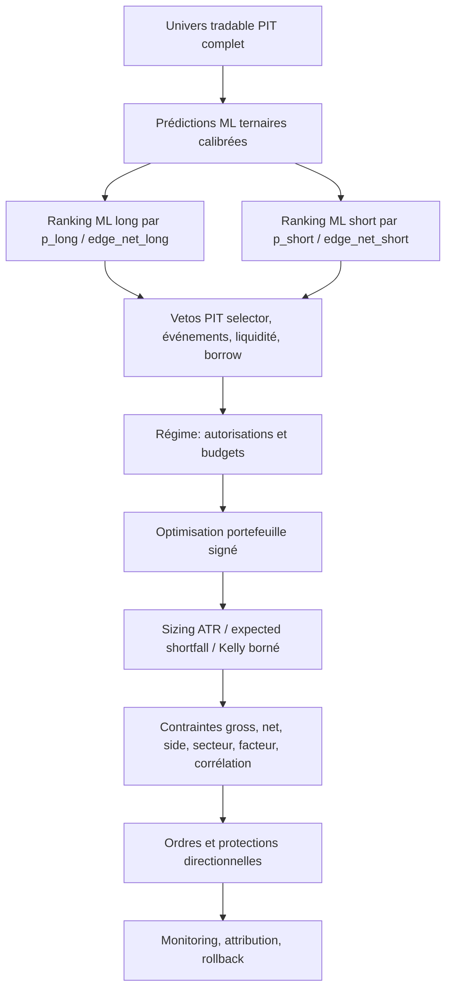

# Audit et plan d'action du module risque ML-first

**Date de référence :** 2026-07-11  
**Hypothèse de travail :** tous les sprints de `prompt/ml.md` sont réalisés et validés  
**Statut :** audit du code actuel et plan prospectif ; aucun sprint ci-dessous n'est considéré terminé  
**Périmètre :** sélection des trades, selector, régime marché, conviction, sizing, contraintes portefeuille, protections, backtest, paper et live  
**Cible :** gestion du risque professionnelle pour swing trading US long/short piloté par un ML ternaire

---

## 1. Verdict exécutif

L'intention architecturale est correcte :

1. l'univers tradable PIT définit le scope ;
2. le ML ternaire décide du côté long/flat/short ;
3. la probabilité directionnelle sert de conviction et de ranking ;
4. le selector, le sentiment et les événements ne doivent intervenir que comme contexte ou veto après prédiction ;
5. le régime marché doit moduler l'autorisation, le nombre de positions et le budget de risque ;
6. le moteur de risque doit transformer les signaux retenus en portefeuille exécutable ;
7. l'exécution doit poser et maintenir les protections adaptées au côté.

Le code actuel respecte déjà plusieurs de ces principes, mais **le système n'est pas encore cohérent de bout en bout pour un swing trading long/short professionnel**.

Les principales raisons sont :

- le live part bien de l'univers PIT complet et exige une prédiction ML, mais le `PortfolioBuilder` reconstruit une liste unique au lieu de consommer deux rankings ML séparés ;
- les plafonds long/short existent dans le contrat et la configuration, mais ne sont pas appliqués dans `ConstraintChecker` ;
- des paramètres short importants sont déclarés mais non consommés par le runtime risque ;
- le filtre de corrélation ignore le signe des positions ;
- le stop initial calculé par le risque est orienté long même pour un short ;
- le CLI live ne charge presque pas la section `risk_management` de `config.yaml`, alors que le backtest applique davantage d'options ;
- les filtres de répétition/pertes sont reconstruits vides à chaque run live et ne sont jamais alimentés ;
- plusieurs défaillances de régime et de modèle factoriel sont fail-open ;
- le Kelly utilise un payoff commun et une accuracy non directionnelle, avec fallback ATR lorsqu'il juge la probabilité trop faible ;
- la suite ciblée passe 45 tests mais échoue sur 6 tests de bridge backtest/risque, ce qui interdit de déclarer la parité stabilisée.

**Verdict :** fondation sérieuse, contrat ML-first logique, mais implémentation actuelle estimée à **6/10** pour le risque swing et **non prête pour du capital réel** tant que les sprints 0 à 6 ne sont pas terminés. Le paper trading professionnel commence après le Sprint 7 ; le réel progressif n'est envisageable qu'après le Sprint 8.

---

## 2. Architecture cible

### Autorité de chaque composant

| Composant | Rôle autorisé | Rôle interdit |
|---|---|---|
| ML | côté, probabilité, expected edge, ranking long/short | contourner les gates de données et de risque |
| Selector | features PIT, explication, veto technique calibré | choisir le côté ou reranker le portefeuille nominal |
| Sentiment/macro | features du ML ou veto/risk overlay validé | ajouter un score opaque après validation ML |
| Régime | autoriser/bloquer côtés, réduire budget, gross/net, slots | modifier silencieusement la probabilité ML |
| Risk management | sizing et optimisation sous contraintes | recréer un signal alpha concurrent |
| Execution | prix, ordres, protections, réconciliation | inventer un nouveau sizing non audité |

Le modèle professionnel doit maintenir cette séparation. Une même information peut être feature du ML et veto de sécurité, mais son rôle, son cutoff PIT et son effet doivent être explicitement versionnés.

---

## 3. Flux réel observé

### 3.1 Chargement live

Le runtime `risk_management.cli` :

1. résout le compte et l'equity ;
2. charge les paramètres de preset et une petite partie du YAML ;
3. construit le snapshot de régime et applique ses caps ;
4. charge l'univers tradable PIT de qualité `full` ;
5. charge le contexte score selector pour les symboles de cet univers ;
6. charge les prédictions ML ternaires ;
7. charge prix, ATR, ADV, métriques ML et matrice de rendements ;
8. appelle `PortfolioBuilder` ;
9. persiste `risk_decisions` et `portfolio_targets`.

Ce point est positif : le scope live ne dépend plus d'un top candidat selector. Un symbole sans score reçoit un contexte `unavailable`, mais reste dans le scope ML.

### 3.2 Construction du portefeuille

`PortfolioBuilder.build()` applique actuellement :

1. filtres événementiels/régime sur le contexte score ;
2. exclusion des symboles sans prédiction long/short complète ;
3. confirmation de présence multi-jours ;
4. vetos score/probabilité ;
5. filtres de répétition et pertes consécutives ;
6. conviction égale à la probabilité ML directionnelle ;
7. tri global de tous les longs et shorts par conviction ;
8. filtre de corrélation Pearson ou factoriel ;
9. sizing ATR ou Kelly plafonné par ATR ;
10. contraintes total, gross, position, secteur, ADV et minimum notionnel ;
11. réduction optionnelle pour neutralité nette ;
12. persistance de la cible et du stop initial.

### 3.3 Ce qui est réellement ML-first

La fonction `core.conviction.compute_conviction()` ignore désormais le score selector et retourne la probabilité ML. Le ranking interne est donc ML-only malgré les anciens champs `score_weight` et `prediction_weight`.

Le selector :

- ne choisit plus le côté ;
- peut encore bloquer via `min_score_veto_long` / `max_score_veto_short` ;
- fournit secteurs, contexte, événements et facteurs ;
- est encore utilisé par une logique legacy plus riche dans le bridge backtest.

Le système est donc **partiellement ML-first**, mais pas encore conforme au contrat de rankings séparés et de parité live/backtest.

---

## 4. Points solides

| Domaine | Constat positif |
|---|---|
| Univers | snapshot tradable PIT canonique exigé en qualité `full` |
| Autorité ML | une prédiction ternaire complète est obligatoire pour sélectionner |
| Direction | `predicted_side` détermine `buy` ou `sell`, pas le score selector |
| Conviction | `p_long` pour long et `p_short` pour short |
| Score selector | vetos désactivables et post-prédiction |
| Régime | point central `apply_snapshot()` partagé live/backtest pour plusieurs caps |
| Volatilité | sizing ATR strict, rejet si ATR absent dans le chemin standard |
| Circuit breaker | blocage sur drawdown/perte et force-close configurable |
| Contraintes | poids position, secteur, gross exposure, minimum notionnel |
| Liquidité | ADV disponible et contrainte par position prévue |
| Corrélation | filtre déterministe et traçabilité du symbole bloqueur |
| Facteurs | infrastructure de covariance et contraintes factorielles présente |
| Audit | run summaries, raisons codifiées, timestamps PIT, stops et budgets de risque persistés |
| Exécution | infrastructure stop initial, trailing dynamique et watcher post-fill |
| Shadow | comparaison de runs déjà disponible |

Ces fondations doivent être conservées. Le plan vise principalement à les rendre directionnelles, obligatoires et cohérentes entre environnements.

---

## 5. Registre des anomalies

## RSK-P0-01 — Les rankings long et short ne sont pas séparés

**Preuve :** `PortfolioBuilder._build_enriched_candidates()` trie tous les côtés dans une seule liste par `conviction_score`.  
**Impact :** les longs les plus confiants peuvent consommer tous les slots, ou inversement ; le mix dépend de l'échelle relative des probabilités entre classes.  
**Pourquoi c'est incorrect :** le contrat ML-first exige des rankings séparés et des capacités par côté. Une probabilité long de 0,70 et une probabilité short de 0,70 ne sont pas nécessairement calibrées de manière comparable.  
**Correction :** produire deux listes ordonnées par edge net directionnel, appliquer quotas/caps par côté, puis optimiser le portefeuille combiné.

## RSK-P0-02 — Les caps `max_long_positions` et `max_short_positions` ne sont pas appliqués

**Preuve :** `SelectionCapacity` et `RiskConfig.selection_capacity` existent, mais `PortfolioState` ne compte que `position_count`; `ConstraintChecker` ne reçoit pas le side.  
**Impact :** le défaut `max_short_positions=2` ne limite pas réellement les shorts dans le live builder.  
**Correction :** ajouter compteurs long/short au state, transmettre le side au checker et bloquer chaque côté indépendamment.

## RSK-P0-03 — Stop initial incorrect pour un short

**Preuve :** `stop_price_initial = last_close - risk_per_share` est utilisé pour toutes les positions.  
**Impact :** pour un short, ce stop est sous le prix et ne protège pas la hausse adverse ; l'exécution peut l'ignorer puis utiliser un fallback différent.  
**Correction :** long `entry - risk`, short `entry + risk`, puis recalcul après fill réel.

## RSK-P0-04 — Divergence de configuration live/backtest

**Preuve :** le YAML active shorts et modèle factoriel, mais le CLI risque ne lit explicitement que `force_close_on_breaker` et `force_close_pct`. Le backtest construit ses options short et factor model séparément.  
**Impact :** une stratégie validée avec contraintes factorielles/short peut tourner live sans elles.  
**Correction :** loader typé unique `RiskConfig` utilisé par CLI, IHM, backtest et tests, avec dump de config effective.

## RSK-P0-05 — Parité bridge backtest/risque non verte

**Preuve :** validation ciblée du 2026-07-11 : 45 tests réussis, 6 échecs dans `tests/test_phase2_bridges.py`. Les fixtures anciennes ne fournissent pas le contrat ternaire obligatoire et le bridge retourne zéro entrée.  
**Impact :** impossible de prouver que le risque backtesté correspond au risque live.  
**Correction :** supprimer la cascade legacy, migrer fixtures et tests vers prédictions ternaires complètes et golden parity.

## RSK-P0-06 — Le bridge backtest applique encore une sélection short selector

**Preuve :** `backtesting/risk_bridge.py` injecte `predicted_side`, enrichit un `short_score`, puis appelle `tag_short_candidates()` avant le `PortfolioBuilder`.  
**Impact :** le backtest peut filtrer/réassigner le scope short avant le moteur ML-first, contrairement au live.  
**Correction :** le bridge doit consommer les rankings ML et laisser selector en contexte/veto uniquement.

## RSK-P1-01 — Corrélation non signée pour portefeuille long/short

**Preuve :** le filtre compare les rendements actifs et rejette seulement `corr > threshold`, sans multiplier par les signes des positions.  
**Impact :** il rejette des hedges long/short positivement corrélés et conserve des expositions PnL redondantes sur actifs négativement corrélés.  
**Correction :** corrélation de PnL signée : `corr_pnl = side_i * side_j * corr_assets`, avec long `+1`, short `-1`.

## RSK-P1-02 — Paramètres short déclarés mais non exécutés par le risque

**Preuve :** `short_selling_enabled`, `short_rotation_required`, `short_require_bearish_benchmark`, `short_tp_pct`, `short_trailing_pct`, `short_time_stop_days` n'ont pas de consommateurs dans `risk_management` hors config.  
**Impact :** l'opérateur croit activer une politique short qui n'est pas réellement appliquée au portefeuille live.  
**Correction :** remplacer ces champs par une `ShortRiskPolicy` typée, consommée ou supprimée avec erreur de configuration.

## RSK-P1-03 — Kelly utilise une métrique non directionnelle et un payoff commun

**Preuve :** `load_win_rates_asof()` privilégie `split_name=test`, charge `directional_accuracy`, sans distinction long/short ; `KellySizer` utilise un unique `assumed_payoff_ratio`.  
**Impact :** sizing short fondé sur une accuracy dominée par les longs/flat et payoff irréaliste. Le test final ML devient indirectement un paramètre de risque.  
**Correction :** statistiques OOS walk-forward par côté et régime, posterior shrinké, payoff net par côté, sans lecture du holdout final pour calibrer le live.

## RSK-P1-04 — Fallback Kelly vers ATR quand l'edge est faible

**Preuve :** si `p_eff < min_effective_probability` ou Kelly <= 0, le sizer revient au sizing ATR au lieu de rejeter.  
**Impact :** un trade jugé sans edge par Kelly peut recevoir une taille nominale complète.  
**Correction :** policy explicite `reject`, `minimal_probe` ou `atr_fallback`; défaut professionnel `reject`.

## RSK-P1-05 — Filtres de répétition et pertes inopérants en live

**Preuve :** `PortfolioBuilder` crée des trackers vides à chaque instance ; aucun appel `record()` n'existe dans le chemin live. Seul le simulateur backtest les charge et les alimente.  
**Impact :** les limites « 5 trades/180 jours » et blacklist après pertes donnent une fausse impression de protection.  
**Correction :** état persistant transactionnel issu des fills/trades clôturés, partagé paper/live/backtest.

## RSK-P1-06 — Filtres régime/événements fail-open

**Preuve :** toute exception dans `_apply_regime_scoring_to_candidates()` journalise puis retourne les candidats inchangés. Le factor model échoue également en warning puis continue.  
**Impact :** une panne du veto earnings, yield ou facteur augmente silencieusement le risque.  
**Correction :** classification des contrôles : sécurité fail-closed, overlay facultatif fail-degraded, avec gate et statut persistés.

## RSK-P1-07 — Neutralité nette appliquée après acceptation sans revalidation complète

**Preuve :** `_enforce_net_exposure_neutrality()` réduit les shares après les checks initiaux et reconstruit la liste sans recalcul des minimums notionnels, rangs, budgets ou raisons codifiées complètes.  
**Impact :** positions sous minimum, risque non réconcilié, différence entre totals d'audit et ordres.  
**Correction :** intégrer gross/net/side dans un solveur ou relancer toutes les contraintes après réduction.

## RSK-P1-08 — La contrainte `max_long_short_correlation` n'est pas appliquée

**Preuve :** champ validé dans `RiskConfig`, aucune utilisation runtime.  
**Impact :** contrôle déclaré mais fictif.  
**Correction :** définir précisément la corrélation des PnL des deux jambes et l'intégrer au solveur portefeuille.

## RSK-P1-09 — Liquidité fail-open si ADV absent

**Preuve :** `PriceInfo.adv_usd=None` désactive silencieusement la contrainte ; le contrôle agrégé ne fait qu'un warning.  
**Impact :** les titres les moins documentés peuvent recevoir une position pleine.  
**Correction :** ADV obligatoire pour une nouvelle entrée, seuil de participation et liquidation stressée.

## RSK-P1-10 — Absence de borrow/shortability/recall dans le risk gate

**Preuve :** aucune consommation de shortable, easy-to-borrow, locate, borrow fee ou recall dans risque/exécution.  
**Impact :** signal short théorique non exécutable, coût net faux, buy-in forcé non simulé.  
**Correction :** `BorrowSnapshot` PIT obligatoire avant sélection short et coûts intégrés à l'edge.

## RSK-P2-01 — Breakout tracker utilise potentiellement `date.today()`

**Preuve :** le CLI appelle `builder.build(...)` sans `trade_date`; le builder utilise alors la date système.  
**Impact :** replay ou run as-of daté modifie un état avec la mauvaise date.  
**Correction :** `trade_date` obligatoire, jamais de fallback implicite dans le chemin métier.

## RSK-P2-02 — Score selector manquant représenté par `NaN`

**Preuve :** le live crée `SelectionScore(... score_used=NaN)` si le contexte est absent.  
**Impact :** les vetos et filtres qui font des comparaisons/transformations peuvent se comporter différemment ou propager NaN.  
**Correction :** type explicite `score_available`, aucune sentinelle numérique ambiguë.

## RSK-P2-03 — Risque factoriel pré-sizing et non signé

**Preuve :** les contraintes sont évaluées sur des candidats avant allocation finale et sans exposition signée claire.  
**Impact :** le contrôle ne mesure pas nécessairement le beta et les contributions du portefeuille réellement envoyé.  
**Correction :** calcul post-sizing sur poids signés, réduction itérative puis revalidation.

## RSK-P2-04 — Equity fallback trop permissif

**Preuve :** sans snapshot broker, le CLI utilise `--account-equity` et continue.  
**Impact :** capital, buying power et PnL intraday peuvent être obsolètes.  
**Correction :** paper/live fail-closed sur snapshot frais ; fallback réservé au simulateur/dry-run.

## RSK-P2-05 — Stops calculés au close, pas au fill

**Preuve :** budget et stop initial sont dérivés du dernier close avant ordre.  
**Impact :** gap d'entrée modifie le risque réel par action.  
**Correction :** budget pré-trade conservateur, puis stop/qty atomiquement réconciliés après fill.

---

## 6. Adéquation au swing trading

### 6.1 Ce qui est adapté

- horizon EOD compatible avec données daily ;
- sizing par volatilité ATR ;
- time stop et trailing présents dans la couche d'exécution ;
- gestion du drawdown portefeuille ;
- caps de position, secteur et gross exposure ;
- régimes avec hystérésis et réduction du risque ;
- filtres earnings/yield/buyback disponibles ;
- possibilité de neutralité et de short ;
- audit des décisions et protections.

### 6.2 Ce qui manque pour un niveau professionnel

1. risque overnight et gap explicite dans le budget ;
2. stop short correct et réconciliation post-fill ;
3. disponibilité/fee/recall du borrow ;
4. contraintes signées long/short ;
5. expected shortfall et stress de liquidation ;
6. corrélations et facteurs conditionnels au régime ;
7. concentration par thème/industrie/pays/currency, pas seulement secteur ;
8. portefeuille existant inclus dans l'optimisation, pas uniquement les nouvelles cibles ;
9. turnover, taxes, wash sale et capacité dans la décision ;
10. transitions de régime traitant positions existantes et ordres en vol ;
11. événements corporate et earnings avec cutoff/qualité explicites ;
12. preuve paper/live des coûts et protections.

### 6.3 Répartition logique des responsabilités

Le selector n'est pas inutile dans un système ML-first. Son rôle professionnel est :

- fournir au ML des facteurs techniques PIT ;
- fournir des explications et diagnostics ;
- appliquer seulement des vetos indépendamment justifiés : données invalides, événement interdit, liquidité, tradabilité ;
- ne jamais déterminer le side ;
- ne jamais remplacer l'ordre du ranking ML par son propre classement.

Le régime marché ne doit pas « prédire » à la place du ML. Il doit :

- autoriser ou interdire long/short ;
- multiplier le budget de risque ;
- modifier gross/net exposure, slots et concentration ;
- déclencher réduction, hedge ou liquidation selon une state machine hystérétique ;
- être identique en backtest, paper et live.

---

## 7. Plan d'action par sprints

## Sprint 0 — Figer le contrat sélection → risque

**Priorité :** P0  
**Objectif :** supprimer toute ambiguïté sur qui choisit les trades et dans quel ordre.

### Tâches

1. Définir `MLRankedCandidate` avec : symbole, side, `p_side`, edge net, rank par côté, model/data/universe IDs.
2. Remplacer l'entrée nominale `SelectionScore` du builder par deux listes ML classées.
3. Définir `SelectorVetoContext` séparé du ranking.
4. Rendre explicite la séquence : ML ranking → vetos → régime → portfolio risk.
5. Interdire tout changement de side hors policy ML.
6. Rendre `trade_date`, `account_id`, `universe_run_id` et `model_run_id` obligatoires.
7. Marquer les APIs legacy score-first comme non nominales puis les retirer.

### Fichiers probables

- `core/ml_selection_contract.py`
- nouveau `risk_management/selection_contract.py`
- `risk_management/models.py`
- `risk_management/portfolio_builder.py`
- `risk_management/db_io.py`
- `backtesting/risk_bridge.py`
- `ihm/services/pipeline_runner.py`

### Tests

- `tests/test_risk_ml_first_contract.py::test_ml_rank_is_the_only_nominal_ordering_authority`.
- `tests/test_risk_ml_first_contract.py::test_selector_cannot_change_side_or_rank`.
- `tests/test_risk_ml_first_contract.py::test_trade_date_and_lineage_are_mandatory`.
- `tests/test_risk_ml_first_contract.py::test_flat_predictions_never_reach_risk_sizing`.

### Critères de sortie

- aucun chargement nominal de candidats depuis un top selector ;
- ranking ML long et short conservé jusqu'au portfolio optimizer ;
- 100 % des décisions reliées aux IDs PIT ;
- aucune date système implicite dans le chemin métier ;
- documentation de l'autorité de chaque composant approuvée.

---

## Sprint 1 — Appliquer les contraintes directionnelles

**Priorité :** P0  
**Dépendance :** Sprint 0  
**Objectif :** rendre toutes les contraintes conscientes du côté long/short.

### Tâches

1. Ajouter `long_count`, `short_count`, `long_notional`, `short_notional` à `PortfolioState`.
2. Faire appliquer `max_long_positions` et `max_short_positions` par `ConstraintChecker`.
3. Respecter les rankings séparés avec quotas minimaux/maximaux configurables.
4. Calculer gross et net exposure sur poids signés.
5. Corriger stop initial : long sous l'entrée, short au-dessus.
6. Calculer corrélation PnL signée et corrélation factorielle signée.
7. Appliquer beta et contributions factorielles sur poids finaux signés.
8. Revalider toutes les contraintes après réduction/neutralisation.

### Tests

- `tests/test_constraints.py::test_long_and_short_position_caps_are_enforced`.
- `tests/test_portfolio_builder.py::test_rankings_are_separate_by_side`.
- `tests/test_portfolio_builder.py::test_short_initial_stop_is_above_entry`.
- `tests/test_correlation_filter.py::test_long_short_positive_asset_correlation_is_a_hedge`.
- `tests/test_correlation_filter.py::test_long_short_negative_asset_correlation_is_concentrated_pnl`.
- `tests/test_factor_model.py::test_signed_final_weights_drive_factor_exposure`.
- Property tests : gross >= abs(net), side counts sous caps, stop toujours du côté adverse.

### Critères de sortie

- zéro dépassement total/long/short sur property tests ;
- stop directionnel correct dans 100 % des scénarios ;
- corrélation calculée sur PnL signé ;
- contraintes post-sizing satisfaites après arrondis et minimums ;
- audit expose gross/net et contributions par jambe.

---

## Sprint 2 — Unifier et verrouiller la configuration risque

**Priorité :** P0  
**Dépendance :** Sprint 1  
**Objectif :** exécuter exactement la même configuration en recherche, backtest, IHM, paper et live.

### Tâches

1. Créer un loader typé unique pour `risk_management`, `market_regimes`, protections et preset capital.
2. Définir la priorité : defaults versionnés < YAML < preset < override CLI autorisé.
3. Refuser toute clé YAML inconnue et tout champ déclaré mais non consommé.
4. Charger réellement factor model, ADV, short policy, neutralité, Kelly et caps par côté.
5. Persister config effective et fingerprint dans chaque run.
6. Supprimer les defaults CLI divergents (`score_weight` notamment) devenus obsolètes.
7. Ajouter migration/version de schéma de configuration.

### Tests

- `tests/test_risk_config_parity.py::test_yaml_cli_backtest_and_live_resolve_same_config`.
- `tests/test_risk_config_parity.py::test_every_declared_risk_key_is_consumed_or_rejected`.
- `tests/test_config_yaml_schema.py::test_risk_management_has_only_known_keys`.
- `tests/test_risk_config_parity.py::test_effective_config_fingerprint_is_stable`.

### Critères de sortie

- dump effectif identique backtest/live pour mêmes inputs ;
- aucun paramètre « décoratif » ;
- différence de config impossible sans fingerprint différent ;
- tests de matrice presets petit/moyen/grand compte verts.

---

## Sprint 3 — Professionnaliser sizing et edge net

**Priorité :** P1  
**Dépendance :** Sprint 2  
**Objectif :** dimensionner selon un edge et un risque directionnels démontrés, pas une accuracy générique.

### Tâches

1. Remplacer `WinRateInfo` par statistiques OOS par côté/régime : hit rate, payoff, tail loss, calibration, sample size.
2. Interdire l'utilisation du holdout final pour le sizing live.
3. Estimer `edge_net` après spread, slippage, commission, impact, borrow et taxes pertinentes.
4. Rejeter par défaut si edge net <= marge de sécurité.
5. Remplacer le fallback Kelly automatique par policy explicite ; défaut `reject`.
6. Utiliser posterior bayésien/shrinkage vers prior lorsque l'échantillon est faible.
7. Calibrer payoff long et short séparément.
8. Ajouter budget gap overnight et Expected Shortfall au cap ATR.
9. Recalculer quantité et stop après fill réel sans dépasser le budget initial.

### Tests

- `tests/test_kelly.py::test_low_or_negative_edge_is_rejected_not_atr_sized`.
- `tests/test_kelly.py::test_long_and_short_use_directional_oos_statistics`.
- `tests/test_kelly.py::test_small_sample_is_shrunk_toward_prior`.
- `tests/test_position_sizer.py::test_gap_and_expected_shortfall_reduce_size`.
- `tests/test_position_sizer.py::test_higher_cost_never_increases_size`.
- `tests/test_execution_risk_reconciliation.py::test_post_fill_risk_never_exceeds_budget`.

### Critères de sortie

- aucune lecture de métrique test finale dans la policy live ;
- edge net positif obligatoire ;
- payoff et calibration séparés long/short ;
- stress gap inclus ;
- somme du risque initial <= budget portefeuille ;
- monotonicité taille vs volatilité/coût démontrée.

---

## Sprint 4 — Régime et événements comme state machine de risque

**Priorité :** P1  
**Dépendance :** Sprint 3  
**Objectif :** rendre les transitions de régime déterministes, PIT, directionnelles et fail-safe.

### Tâches

1. Définir une state machine : normal, warning, capital preservation, recovery.
2. Pour chaque état, versionner : côtés autorisés, risk multiplier, gross/net, slots, secteurs et actions sur positions existantes.
3. Distinguer blocage nouvelles entrées, réduction, hedge et liquidation.
4. Garantir hystérésis et durée minimale sans mutation ad hoc d'un snapshot frozen.
5. Classifier les erreurs : macro manquante, earnings inconnu, sentiment absent, factor model indisponible.
6. Fail-closed sur earnings/borrow/tradabilité ; fail-degraded conservateur sur overlay macro facultatif.
7. Supprimer le rescoring selector duplicate dans le risque.
8. Tester transitions avec ordres en vol, partial fills et positions existantes.

### Tests

- `tests/test_risk_regime_state_machine.py::test_transition_changes_budget_not_ml_rank`.
- `tests/test_risk_regime_state_machine.py::test_hysteresis_prevents_daily_flip_flop`.
- `tests/test_risk_regime_state_machine.py::test_missing_critical_event_data_blocks_entry`.
- `tests/test_risk_regime_state_machine.py::test_recovery_handles_existing_positions_and_open_orders`.
- `tests/test_risk_regime_sizing_constraints.py` à étendre pour les deux côtés.

### Critères de sortie

- parité exacte state machine backtest/live ;
- aucune exception sécurité fail-open ;
- aucun changement de rank ML par régime ;
- transitions et actions auditables ;
- stress V-shaped recovery, vol spike et yield shock validés.

---

## Sprint 5 — Liquidité, borrow et capacité

**Priorité :** P1  
**Dépendance :** Sprint 4  
**Objectif :** garantir que chaque cible est réellement exécutable et liquidable sur plusieurs jours.

### Tâches

1. Rendre ADV, spread et quote freshness obligatoires pour toute nouvelle entrée.
2. Définir participation max à l'entrée et en liquidation stressée.
3. Ajouter `BorrowSnapshot` PIT : shortable, easy-to-borrow, quantité, fee, locate, timestamp.
4. Déduire borrow fee et probabilité de recall de l'edge short.
5. Bloquer hard-to-borrow sans locate confirmé.
6. Modéliser slippage selon ADV, spread, volatilité et taille.
7. Simuler partial fills, limit non exécutée et liquidation multi-jours.
8. Ajouter capacité globale par stratégie, secteur et symbole.

### Tests

- `tests/test_risk_liquidity_gate.py::test_missing_or_stale_adv_blocks_entry`.
- `tests/test_risk_liquidity_gate.py::test_participation_cap_applies_to_entry_and_liquidation`.
- `tests/test_short_borrow_gate.py::test_unshortable_symbol_is_blocked`.
- `tests/test_short_borrow_gate.py::test_borrow_fee_reduces_edge_and_size`.
- `tests/test_execution_capacity.py::test_partial_fill_does_not_break_risk_budget`.

### Critères de sortie

- 100 % des entrées avec données liquidité fraîches ;
- 100 % des shorts avec borrow snapshot ;
- coûts stressés persistés ;
- capacité maximale chiffrée ;
- aucune position dépassant le plan de liquidation accepté.

---

## Sprint 6 — Optimisation portefeuille complet

**Priorité :** P1  
**Dépendance :** Sprint 5  
**Objectif :** optimiser nouvelles entrées et positions existantes comme un portefeuille signé unique.

### Tâches

1. Inclure holdings, cash, buying power, ordres ouverts et protections existantes.
2. Optimiser sous contraintes : edge, risque, gross/net, side, secteur, facteur, corrélation, ADV et turnover.
3. Ajouter concentration industrie, thème, pays, devise et single-name gap risk.
4. Mesurer marginal contribution to risk et expected shortfall.
5. Réduire/rejeter le candidat qui dégrade le plus le portefeuille, pas seulement le dernier de la liste greedy.
6. Intégrer coût de turnover et no-trade bands.
7. Garantir déterminisme, explication de chaque contrainte et fallback conservateur.
8. Réconcilier après arrondis/fractional shares.

### Tests

- `tests/test_portfolio_optimizer.py::test_existing_holdings_are_included`.
- `tests/test_portfolio_optimizer.py::test_solution_respects_all_signed_constraints`.
- `tests/test_portfolio_optimizer.py::test_no_trade_band_reduces_turnover`.
- `tests/test_portfolio_optimizer.py::test_optimizer_is_deterministic`.
- `tests/test_portfolio_optimizer.py::test_rounding_is_revalidated`.
- Scenario stress : 20 titres tech corrélés, hedge index, short illiquide, gap sectoriel.

### Critères de sortie

- zéro violation après arrondi ;
- expected shortfall et factor contribution sous budgets ;
- turnover net inférieur au greedy à edge comparable ;
- solveur déterministe et temps compatible EOD ;
- fallback produit moins de risque, jamais plus.

---

## Sprint 7 — Protections et lifecycle swing directionnels

**Priorité :** P0 avant paper  
**Dépendance :** Sprint 6  
**Objectif :** garantir que chaque position possède une protection correcte pendant toute sa durée de vie.

### Tâches

1. Corriger stop initial directionnel et le recalculer après fill.
2. Définir TP, trailing, break-even et time stop par côté/régime/volatilité.
3. Garantir OCO logique entre TP, stop et trailing séparé.
4. Gérer gaps à travers stop, partial fills, split, halt, ordre rejeté et broker reconnect.
5. Définir protection SLA : aucune position nue au-delà d'un délai maximal.
6. Réconcilier broker/DB et réparer automatiquement une protection manquante.
7. Tester force-close drawdown avec ordres enfants ouverts.
8. Persister R attendu/réalisé, MAE, MFE et raison de sortie.

### Tests

- `tests/test_execution_directional_protection.py::test_long_and_short_stops_are_on_adverse_side`.
- `tests/test_execution_directional_protection.py::test_partial_fill_has_matching_protected_quantity`.
- `tests/test_execution_directional_protection.py::test_gap_through_stop_uses_executable_price`.
- `tests/test_execution_directional_protection.py::test_reconciliation_repairs_unprotected_position`.
- `tests/test_execution_directional_protection.py::test_force_close_cancels_conflicting_children`.

### Critères de sortie

- 100 % des positions protégées dans le SLA ;
- aucune protection de mauvais côté ;
- quantité protégée = quantité broker ;
- scénarios d'incident verts ;
- risque réel post-fill réconcilié au budget.

---

## Sprint 8 — Parité, shadow, paper et go-live progressif

**Priorité :** P0 production  
**Dépendance :** Sprints 0 à 7  
**Objectif :** prouver la fidélité et la robustesse opérationnelle avant capital réel.

### Phase A — Golden parity

1. Une fixture PIT unique alimente backtest, risk replay, paper et live dry-run.
2. Comparer candidats ML, vetos, régime, tailles, contraintes, stops et raisons.
3. Tolérance zéro sur side/rejet ; tolérance numérique documentée sur tailles.
4. Migrer les 6 tests bridge actuellement en échec.

### Phase B — Shadow, minimum 4 semaines

1. Produire cibles sans ordres.
2. Comparer quotidiennement replay et décision live.
3. Mesurer disponibilité data, drift de config, latence et causes de rejet.
4. Simuler incidents et rollback.

### Phase C — Paper, minimum 8 à 12 semaines

1. Exécuter longs et shorts avec borrow paper lorsque disponible.
2. Mesurer fills, protections, slippage, turnover et PnL par cohorte.
3. Recalibrer uniquement les hypothèses de coûts sur données paper ; ne pas retuner sur les résultats finaux sans nouveau protocole.
4. Revue hebdomadaire des pertes extrêmes, abstentions et incidents.

### Tests

- `tests/test_risk_backtest_live_parity.py::test_identical_snapshot_produces_identical_portfolio`.
- `tests/test_phase2_bridges.py` entièrement vert avec contrat ML ternaire.
- E2E IHM → risk → execution → protections → reconciliation.
- Chaos tests DB, quotes, macro, model registry, broker et watcher.

### Gates GO capital réel

| Contrôle | Seuil GO |
|---|---:|
| Divergence side backtest/paper/live | 0 |
| Violation de cap total/long/short | 0 |
| Position sans protection au-delà du SLA | 0 |
| Short sans borrow validé | 0 |
| Donnée critique stale/future | 0 |
| Écart config fingerprint | 0 |
| Slippage médian réel / hypothèse | <= 1,25x |
| Drawdown paper | sous budget |
| Incidents critiques ouverts | 0 |
| Rollback et kill switch | testés avec succès |

### Go-live

Montée manuelle `5 % -> 10 % -> 25 % -> 50 % -> 100 %` du budget de risque, avec fenêtre minimale, revue humaine et possibilité de retour immédiat au palier précédent.

### Critères de sortie

- golden parity 100 % sur décisions discrètes ;
- shadow et paper sans divergence inexpliquée ;
- coûts et capacité réalistes ;
- comité GO/NO-GO documenté ;
- aucun capital réel avant satisfaction de tous les gates.

---

## 8. Matrice anomalies → sprints → tests

| Anomalie | Sprint | Test principal |
|---|---:|---|
| RSK-P0-01 | 0/1 | rankings séparés par side |
| RSK-P0-02 | 1 | caps long/short appliqués |
| RSK-P0-03 | 1/7 | stop short au-dessus de l'entrée |
| RSK-P0-04 | 2 | parité config effective |
| RSK-P0-05 | 8 | bridge/golden parity |
| RSK-P0-06 | 0/8 | selector ne tague plus le side |
| RSK-P1-01 | 1 | corrélation PnL signée |
| RSK-P1-02 | 2/7 | chaque champ short consommé |
| RSK-P1-03 | 3 | statistiques OOS directionnelles |
| RSK-P1-04 | 3 | edge faible rejeté |
| RSK-P1-05 | 4 | trackers persistants alimentés par fills |
| RSK-P1-06 | 4 | erreurs critiques fail-closed |
| RSK-P1-07 | 1/6 | revalidation après réduction |
| RSK-P1-08 | 1/6 | corrélation inter-jambes appliquée |
| RSK-P1-09 | 5 | ADV stale/absent bloque |
| RSK-P1-10 | 5 | borrow obligatoire short |
| RSK-P2-01 | 0 | trade_date obligatoire |
| RSK-P2-02 | 0/4 | absence score typée |
| RSK-P2-03 | 1/6 | facteurs sur poids signés finaux |
| RSK-P2-04 | 2 | equity live fraîche obligatoire |
| RSK-P2-05 | 3/7 | réconciliation post-fill |

---

## 9. Seuils de validation quantitatifs

Ces seuils sont des defaults de gouvernance à adapter au mandat, mais pas à supprimer sans justification.

| Domaine | Seuil initial |
|---|---:|
| Risque nominal par trade | <= 0,50 % à 1,00 % equity selon régime |
| Risque total initial ouvert | <= budget stratégie documenté |
| Max position | <= 10 % equity et cap liquidité |
| Max secteur gross | <= 25 % à 30 % |
| Gross exposure | <= 100 % nominal, réduit en régime défensif |
| Net exposure | corridor versionné par régime |
| Participation ADV entrée | <= 1 % par défaut, plus stricte si illiquide |
| Liquidation stressée | réalisable dans le nombre de sessions autorisé |
| Couverture ATR/prix/ADV | 100 % des nouvelles entrées |
| Couverture borrow | 100 % des shorts |
| Protection broker | 100 % dans le SLA |
| Parité décision discrète | 100 % |
| Config fingerprint parity | 100 % |
| Stress gap | perte sous budget stressé défini |
| Drawdown | circuit breaker et force-close testés |

---

## 10. Ordre recommandé et niveau de préparation

- **Après Sprint 0 :** architecture compréhensible, encore non tradable.
- **Après Sprint 2 :** sélection et configuration cohérentes, recherche/backtest uniquement.
- **Après Sprint 4 :** régime et sizing raisonnablement sûrs, toujours sans capital réel.
- **Après Sprint 6 :** portefeuille professionnel candidat au shadow.
- **Après Sprint 7 :** protections suffisantes pour paper trading.
- **Après Sprint 8 :** réel progressif envisageable sous GO formel.

Le système ne doit pas engager de capital réel avant le Sprint 8 terminé.

---

## 11. Ce qui restera pour un vrai niveau institutionnel

Même après ce plan, la qualité professionnelle reste un processus continu :

1. modèle de risque multi-facteurs indépendant du selector alpha ;
2. covariance robuste avec shrinkage et scénarios non gaussiens ;
3. stress historiques et hypothétiques multi-jours ;
4. borrow et capacité issus du broker réel ;
5. validation indépendante du moteur de risque ;
6. limites approuvées et séparation des rôles recherche/risk/ops ;
7. journal immuable des overrides et kill switches ;
8. revue mensuelle des limites et trimestrielle des modèles ;
9. plan broker/data/DB/operator disaster recovery ;
10. capacité à réduire ou arrêter la stratégie lorsque l'alpha disparaît.

La cohérence ML-first ne signifie pas que le risque obéit aveuglément au modèle. Elle signifie que le ML est l'unique source d'alpha et de ranking, tandis que le risque reste l'autorité finale sur **si**, **combien** et **comment** le trade peut être exécuté.

---

## 12. Checklist de clôture de chaque sprint

- [ ] owner et reviewer risque nommés ;
- [ ] anomalies reliées aux tâches et tests ;
- [ ] tests ciblés passés avec `--no-cov` ;
- [ ] suite globale et couverture passées ;
- [ ] parité backtest/live vérifiée ;
- [ ] config effective persistée ;
- [ ] comportement fail-open/fail-closed documenté ;
- [ ] audit lineage complet ;
- [ ] stress tests exécutés ;
- [ ] rollback défini ;
- [ ] décision GO/NO-GO enregistrée.
