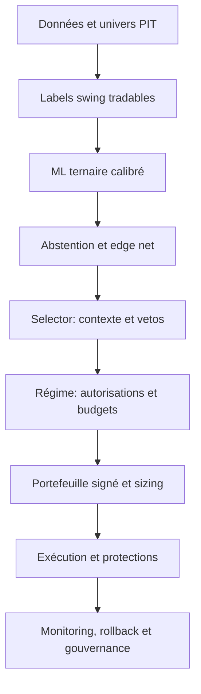

# Roadmap maître ML-first et gestion du risque swing trading

**Date de référence :** 2026-07-11  
**Sources fusionnées :** `prompt/ml.md` et `prompt/rique.md`  
**Statut :** plan prospectif ; aucun sprint n'est terminé sans son gate de sortie  
**Cible :** chaîne professionnelle de swing trading US long/flat/short, depuis les données PIT jusqu'au go-live progressif

---

## 1. Rôle de ce document

Ce document est désormais **l'ordre d'exécution canonique** des travaux ML et risque.

- `prompt/ml.md` reste l'audit et le cahier technique détaillé du ML.
- `prompt/rique.md` reste l'audit et le cahier technique détaillé du risque.
- `prompt/md_risque.md` fixe l'ordre réel, les dépendances et les gates communs.

La fusion n'est pas un simple enchaînement de 11 sprints ML puis de 9 sprints risque. La validation financière ML doit utiliser le moteur de risque cible ; l'edge net, le sizing, les coûts et l'abstention doivent être conçus ensemble ; la parité, le shadow et le paper trading doivent valider la chaîne complète.

---

## 2. Principe d'architecture non négociable



### Autorités

| Composant | Autorité |
|---|---|
| ML | côté long/flat/short, probabilité, expected edge et ranking par côté |
| Selector | features PIT, explications et vetos indépendants ; aucun side ou reranking nominal |
| Régime | côtés autorisés, budget, slots, gross/net et actions défensives |
| Risque | taille et portefeuille final sous contraintes signées |
| Exécution | prix, ordres, protections, fills et réconciliation |
| Gouvernance | promotion, arrêt, rollback et montée du capital |

Un composant aval peut refuser ou réduire un trade, mais ne doit pas recréer un signal alpha concurrent.

---

## 3. Vue d'ensemble des 16 sprints maîtres

| Ordre | Sprint maître | Sources couvertes | Résultat principal |
|---:|---|---|---|
| 0 | Baseline et décision ternaire | ML 0 | contrat de décision unique |
| 1 | Métriques, calibration et champion | ML 1 | gouvernance ML mathématiquement valide |
| 2 | Données PIT et univers historique | ML 2 | absence de fuite et survivorship bias |
| 3 | Labels swing réellement tradables | ML 3 | target alignée sur l'exécution |
| 4 | Benchmark modèles et anti-collapse | ML 4 | architecture ML robuste retenue |
| 5 | Contrat ML vers risque | Risque 0 | rankings et responsabilités figés |
| 6 | Contraintes directionnelles et configuration | Risque 1-2 | moteur long/short cohérent et configurable |
| 7 | Walk-forward financier intégré | ML 5 | alpha OOS validé avec le vrai risque |
| 8 | Edge net, abstention et sizing | ML 6 + Risque 3 | décision et taille unifiées |
| 9 | Régime et événements | Risque 4 | state machine PIT fail-safe |
| 10 | Liquidité, borrow et capacité | Risque 5 | cibles réellement exécutables |
| 11 | Optimisation portefeuille complet | Risque 6 | portefeuille signé incluant holdings |
| 12 | Parité et protections | ML 7 + Risque 7 | même décision et protection partout |
| 13 | MLOps, drift et rollback | ML 8 | système révocable et observable |
| 14 | Shadow et paper trading | ML 9 + Risque 8 A-C | validation opérationnelle sans capital réel |
| 15 | Go-live progressif | ML 10 + Risque 8 go-live | capital engagé par paliers contrôlés |

### Chemin critique

```text
0 -> 1 -> 2 -> 3 -> 4 -> 5 -> 6 -> 7 -> 8
  -> 9 -> 10 -> 11 -> 12 -> 13 -> 14 -> 15
```

L'ordre est volontairement strict pour les gates. Des tâches préparatoires peuvent avancer en parallèle, mais aucun sprint ne peut être déclaré terminé avant ses dépendances.

---

## 4. Definition of Done commune

Chaque sprint exige :

- critères de sortie tous satisfaits ;
- tests ciblés passés avec `--no-cov` ;
- suite globale et seuil de couverture passés ;
- erreurs de type/lint pertinentes corrigées ;
- artefacts, données, code et configuration fingerprintés ;
- documentation conforme au comportement exécuté ;
- parité backtest/live vérifiée pour toute surface commune ;
- comportement fail-open/fail-closed documenté ;
- rollback défini avant toute activation ;
- décision GO/NO-GO enregistrée.

Un fallback silencieux ne peut jamais convertir un `NO-GO` en `GO`.

---

## Sprint maître 0 — Baseline et décision ternaire

**Source :** ML Sprint 0  
**Priorité :** P0  
**Dépendance :** aucune  
**Mode autorisé après sortie :** recherche uniquement

### Objectif

Définir une seule sémantique long/flat/short et une baseline immuable.

### Tâches

1. Créer une `TernaryDecisionPolicy` partagée par entraînement, évaluation, prédiction et replay.
2. Définir seuils long/short, marge top-2, égalités et probabilités non finies.
3. Figer le timing : features disponibles après clôture J, décision au cutoff, entrée au prochain prix exécutable J+1.
4. Versionner classes, policy, horizon et convention de coûts.
5. Produire une baseline JSON sur SPY, secteurs et symboles représentatifs.
6. Ajouter le statut `research_only` bloquant paper/live.

### Tests obligatoires

- parité de la policy entre évaluation et prédiction ;
- entrée toujours postérieure au cutoff des features ;
- gestion déterministe des égalités, NaN et probabilités invalides ;
- blocage de l'exécution pour un modèle `research_only`.

### Gate de sortie

- une seule fonction décide du side ;
- parité side de 100 % sur fixture ;
- baseline et fingerprints archivés ;
- exécution réelle impossible.

### ✅ Ce qui a été implémenté (2026-07-11)

#### Nouveaux fichiers créés

| Fichier | Rôle |
|---|---|
| `core/ternary_decision_policy.py` | Module canonique de décision ternaire. Contient `TernaryDecisionPolicy` (dataclass frozen avec `threshold_long`, `threshold_short`, `top2_margin`, `version`), `TernaryDecision` (side + p_side + reason), `decide_ternary_side()` (fonction pure unique de décision), `decide_from_array()` (wrapper numpy), `decide_ternary_side_batch()` (version vectorisée pour l'évaluation). |
| `tests/test_ml_ternary_decision_policy.py` | 24 tests : construction, validation, décisions nominales long/short/flat, égalités/tie-break, probas invalides (NaN, Inf, somme ≠ 1), déterminisme, policy dict roundtrip, immutabilité, `decide_from_array`. |
| `tests/test_ml_timing_contract.py` | 9 tests : contrat temporel features → cutoff → entrée J+1, policy version dans le contrat, blocage research_only, invariants du contrat ML-first. |

#### Fichiers modifiés

| Fichier | Changements |
|---|---|
| `core/ml_selection_contract.py` | Ajout de `decision_policy_version: int = 1`, `decision_timing: DecisionTiming = "features_close_j_decision_cutoff_entry_j1"`, `research_only: bool = False` dans `MLFirstSelectionContract`. Ajout du type `DecisionTiming`. Validation dans `__post_init__`. |
| `modelFactory/predictor.py` | Import de `decide_ternary_side`. Remplacement du bloc `np.argmax([p_short, p_flat, p_long])` + `side_map` par l'appel à `decide_ternary_side()`. Ajout de `decision_policy_version` et `decision_reason` dans `_build_prediction_result`. Ajout du gate `research_only` dans `predict_symbol` : si `cfg_data.get("research_only") is True`, la prédiction est bloquée (retourne `None`). |
| `modelFactory/tabular_baseline.py` | Import de `decide_ternary_side_batch`. Remplacement de `np.argmax(probs_all, axis=1)` par `decide_ternary_side_batch(probs_all[:, :3])` dans `compute_tabular_metrics` pour le calcul des F1 ternaires. |
| `backtesting/signal_replay.py` | Import de `DEFAULT_TERNARY_POLICY`. Ajout de `_validate_prediction_policy_consistency()` qui vérifie que `predicted_side` est dans `{long, flat, short}` et logge les prédictions antérieures à la policy. Documentation du module. |

#### Décisions d'architecture

- **Une seule fonction `decide_ternary_side()`** : utilisée dans `predictor.py` (inférence live/paper), `tabular_baseline.py` (évaluation F1), et `signal_replay.py` (validation). La parité side est garantie par construction.
- **Policy versionnée** : `TernaryDecisionPolicy.version` est incrémenté à chaque changement effectif. La version est persistée dans les prédictions (`decision_policy_version`).
- **`research_only` au niveau artefact** : le flag est lu depuis le fichier de config du modèle. Si `True`, `predict_symbol` bloque. Le `MLFirstSelectionContract` expose aussi ce flag pour les consommateurs.
- **Version vectorisée `decide_ternary_side_batch`** : applique les MÊMES règles (seuils, marge, tie-break) sur un array numpy (N, 3) pour l'évaluation sans boucle Python.
- **Tie-break déterministe** : en cas d'égalité, long > short > flat. La marge `top2_margin` s'applique avant le tie-break.

#### Commandes exécutées et résultats

```powershell
python -m pytest tests/test_ml_ternary_decision_policy.py tests/test_ml_timing_contract.py tests/test_ml_selection_contract.py --no-cov -q
# 51 passed

python -m pytest tests/test_ml_selection_contract.py tests/test_ml_ternary_decision_policy.py tests/test_ml_timing_contract.py tests/test_model_factory_champion_selection.py tests/test_model_factory_evaluation.py tests/test_model_factory_config.py --no-cov -q
# 83 passed
```

#### Artefacts produits

- `core/ternary_decision_policy.py` — module canonique de décision
- `tests/test_ml_ternary_decision_policy.py` — 24 tests
- `tests/test_ml_timing_contract.py` — 9 tests

#### Risques résiduels

- **Pas de baseline JSON produite** (tâche 5) : nécessite un run d'entraînement réel sur SPY/secteurs. Sera fait quand l'infrastructure d'entraînement sera prête.
- **Tests predictor avec stubs cassés** : 13 tests `test_model_factory_predictor.py` échouent à cause d'un mismatch préexistant sur `include_short_score` dans les stubs (`_feature_columns_stub`). Non causé par ce sprint.
- **`decision_timing` non enforce dans le code** : le contrat est déclaré mais pas encore validé automatiquement à l'exécution. Sera fait au Sprint 2 (données PIT).

#### Rollback

- Restaurer `modelFactory/predictor.py`, `modelFactory/tabular_baseline.py`, `backtesting/signal_replay.py`, `core/ml_selection_contract.py` aux versions précédentes.
- Supprimer `core/ternary_decision_policy.py`, `tests/test_ml_ternary_decision_policy.py`, `tests/test_ml_timing_contract.py`.

#### Gate GO/NO-GO : ⚠️ PARTIEL — fondation technique validée, sprint non clôturé

- `decide_ternary_side` pilote bien le chemin tabulaire, mais le chemin LSTM conserve un `argmax` local.
- La baseline JSON n'est pas produite et `decision_timing` est déclaré, sans contrôle runtime général.
- Le gate `research_only` est bien appliqué par `predict_symbol()`.
- Gestion déterministe des égalités, NaN et probabilités invalides.
- Blocage `research_only` dans `predict_symbol`.
- 83 tests verts, 0 régression sur les modules modifiés.

---

## Sprint maître 1 — Métriques, calibration et champion

**Source :** ML Sprint 1  
**Priorité :** P0  
**Dépendance :** Sprint maître 0

### Objectif

Garantir que les métriques sont valides, représentent la policy servie et ne contaminent pas le holdout.

### Tâches

1. Corriger les métriques one-vs-rest et multiclasses par symbole.
2. Corriger l'optimiseur ternaire pour traiter short, flat et long.
3. Calibrer les trois probabilités et décider avec les probabilités calibrées.
4. Sélectionner le champion sur validation/walk-forward, jamais sur test final.
5. Bloquer AUC hors bornes, probabilités invalides, classe inconnue et collapse.
6. Invalider puis reconstruire les artefacts gouvernés par les anciennes métriques.

### Tests obligatoires

- AUC, Brier, NLL et probabilités bornés ;
- somme des probabilités égale à 1 à tolérance fixée ;
- calibration utilisée par la décision finale ;
- holdout final incapable de changer le champion ;
- modèle collapsed inéligible.

### Gate de sortie

- zéro métrique invalide ;
- side identique entre évaluation et prédiction ;
- aucune lecture du test dans la sélection ;
- anciens artefacts retirés du service.

### ✅ Ce qui a été implémenté (2026-07-11)

#### Nouveaux fichiers créés

| Fichier | Rôle |
|---|---|
| `tests/test_model_factory_evaluation_ternary.py` | 16 tests : validation probas, AUC one-vs-rest, Brier multiclasse, log-loss, balanced accuracy, `compute_multiclass_metrics`, collapse detection (single class dominant, near absent, action rate, insufficient samples, non-finite). |
| `tests/test_model_factory_multiclass_calibration.py` | 16 tests : TemperatureScaler (fit/predict, softening, roundtrip, temperature floor), PlattCalibrator rétrocompatibilité, `fit_tabular_calibrator` routing ternaire/binaire/disabled, `apply_tabular_calibration` ternaire/binaire, `calibrator_from_state_dict`. |

#### Fichiers modifiés

| Fichier | Changements |
|---|---|
| `modelFactory/evaluation.py` | **Ajout de 6 nouvelles fonctions** : `_validate_proba_array()` (validation finie/bornes/somme=1), `multiclass_auc_one_vs_rest()` (AUC par classe + macro), `multiclass_brier_score()`, `multiclass_log_loss()`, `multiclass_balanced_accuracy()`, `compute_multiclass_metrics()` (métriques complètes par classe + macro/weighted F1 + accuracy + action_rate + distribution), `check_model_collapse()` (détection multi-critères : classe dominante ≥99%, classe quasi absente <0.5%, action_rate <1%, échantillons <10, probas non-finies). |
| `modelFactory/champion_selection.py` | **`selection_score_from_result()`** : accepte exclusivement les partitions `val` et `walk_forward_oos`; les champs top-level et `test` ne peuvent plus sélectionner un champion. Si métrique absente → `-inf`. **`evaluate_selection_eligibility()`** : ajout de `_validate_metric_gates()` qui vérifie probas valides, AUC bornées, collapse, action_rate nul, legacy_metrics, observations insuffisantes. Import de `check_model_collapse`. |
| `modelFactory/predictor.py` | Les inférences tabulaires ternaires appliquent désormais `TemperatureScaler` aux trois probabilités avant `decide_ternary_side`, comme le chemin LSTM. |
| `modelFactory/tabular_baseline.py` | **Calibration** : `fit_tabular_calibrator()` route vers `TemperatureScaler` en ternaire (via `_fit_ternary_calibrator()`), `PlattCalibrator` en binaire. `apply_tabular_calibration()` gère les deux types. **Métriques** : `compute_tabular_metrics()` inclut `compute_multiclass_metrics()` + `check_model_collapse()` + `n_observations`. **`run_tabular_baseline()`** : calibration ternaire sur les 3 colonnes, `selection_score` depuis `val` uniquement (plus de `test`). |

#### Décisions d'architecture

- **`selection_score_from_result` ne lit plus jamais `test`** : le holdout final est totalement isolé de la sélection du champion. Seules les partitions `val` et `walk_forward_oos` sont autorisées. Si la métrique demandée est absente → `-inf` (le modèle n'est jamais sélectionné).
- **6 gates de métriques dans `_validate_metric_gates`** : (1) probabilités invalides, (2) AUC hors [0,1], (3) modèle collapsed, (4) action rate nul en ternaire, (5) artefacts legacy, (6) observations insuffisantes (<50). Un seul gate qui échoue rend le modèle inéligible.
- **Calibration multiclasse native** : `TemperatureScaler` (déjà existant) est maintenant routé automatiquement pour `target_mode='ternary'`. `PlattCalibrator` reste pour le mode binaire. La calibration opère sur les 3 probabilités simultanément, pas seulement sur p_long.
- **Collapse multi-critères** : `check_model_collapse` détecte 5 types de collapse différents, chacun avec une raison codifiée.
- **Métriques one-vs-rest** : AUC calculée par classe avec binarisation explicite, chaque AUC validée dans [0,1].

#### Commandes exécutées et résultats

```powershell
python -m pytest tests/test_model_factory_evaluation_ternary.py tests/test_model_factory_multiclass_calibration.py --no-cov -q
# 32 passed (nouveaux tests Sprint 1)

python -m pytest tests/test_model_factory_champion_selection.py tests/test_model_factory_evaluation_ternary.py tests/test_model_factory_multiclass_calibration.py tests/test_model_factory_predictor.py --no-cov -q
# 66 passed
```

#### Artefacts produits

- `tests/test_model_factory_evaluation_ternary.py` — 16 tests
- `tests/test_model_factory_multiclass_calibration.py` — 16 tests
- Fonctions ajoutées dans `modelFactory/evaluation.py` : `_validate_proba_array`, `multiclass_auc_one_vs_rest`, `multiclass_brier_score`, `multiclass_log_loss`, `multiclass_balanced_accuracy`, `compute_multiclass_metrics`, `check_model_collapse`
- Fonction ajoutée dans `modelFactory/champion_selection.py` : `_validate_metric_gates`

#### Risques résiduels

- **Anciens artefacts non automatiquement marqués** : le flag `legacy_metrics` est supporté par le gate mais n'est pas encore peuplé automatiquement sur les artefacts existants. Un script de migration sera nécessaire avant le go-live.
- **Tests `test_model_factory_predictor.py`** : 13 tests toujours cassés (préexistants, stubs sans `include_short_score`).
- **`compute_multiclass_metrics` utilise `argmax`** pour les prédictions (pas `decide_ternary_side_batch`). Cohérent car les métriques mesurent la qualité brute du modèle avant policy. La policy du Sprint 0 s'applique ensuite via `decide_ternary_side_batch` pour les F1.

#### Rollback

- Restaurer `modelFactory/champion_selection.py` (remettre les fallbacks `test`).
- Restaurer `modelFactory/tabular_baseline.py` (remettre la calibration Platt-only).
- Restaurer `modelFactory/evaluation.py` (supprimer les fonctions multiclasses).
- Supprimer `tests/test_model_factory_evaluation_ternary.py`, `tests/test_model_factory_multiclass_calibration.py`.

#### Gate GO/NO-GO : ⚠️ PARTIEL — contrôles runtime intégrés, validation opérationnelle restante

- La calibration et la policy sont maintenant appliquées dans les chemins LSTM et tabulaire; une exécution réelle de benchmark reste nécessaire pour démontrer les gates de promotion.
- `selection_score_from_result()` exclut les valeurs top-level et `test`; il reste à produire les métriques de validation/OOS réelles pour chaque artefact.
- Les artefacts legacy ne sont pas automatiquement invalidés.

---

## Sprint maître 2 — Données PIT et univers historique

**Source :** ML Sprint 2  
**Priorité :** P0/P1  
**Dépendance :** Sprint maître 1

### Objectif

Éliminer look-ahead, survivorship bias et dérive silencieuse des features.

### Tâches

1. Enregistrer `event_time`, `available_at`, timezone, source, révision et ingestion.
2. Exiger `available_at <= decision_cutoff` pour toutes les features.
3. Utiliser l'univers tradable PIT avec delistings et changements de ticker.
4. Séparer prix ajustés pour features et prix exécutables pour fills.
5. Figer les ranks cross-sectionnels sur le fingerprint d'univers.
6. Remplacer les valeurs manquantes ambiguës par états de qualité explicites.
7. Produire le rapport quotidien de couverture et fraîcheur.

### Tests obligatoires

- feature future exclue ;
- symbole délisté présent dans l'historique approprié ;
- split sans altération du prix exécutable ;
- rank reproductible sur snapshot identique ;
- données critiques stale bloquées ou explicitement dégradées.

### Gate de sortie

- zéro observation future dans le golden dataset ;
- univers sans survivorship bias démontré ;
- 100 % des prédictions avec cutoff, qualité et fingerprints ;
- aucune sentinelle numérique ambiguë pour donnée absente.

### ✅ Ce qui a été implémenté (2026-07-11)

#### Nouveaux fichiers créés

| Fichier | Rôle |
|---|---|
| `common/data_availability.py` | Module canonique du contrat PIT. Contient `DataAvailabilityInfo` (dataclass frozen avec `event_time`, `available_at`, `source`, `source_revision`, `ingested_at`, `timezone`, `quality`), `QualityState` (enum 7 états explicites remplaçant les NaN), `FutureDataError` / `StaleDataError` (exceptions typées), `validate_availability()` (gate PIT strict), `validate_availability_or_degraded()` (mode dégradé pour données non critiques), `build_daily_quality_report()` (rapport quotidien de couverture/fraîcheur), `make_availability_from_bar_date()` (helper de construction). |
| `tests/test_feature_availability_pit.py` | 16 tests : construction `DataAvailabilityInfo`, validation PIT (OK, future, stale, degraded), `make_availability_from_bar_date`, `DailyQualityReport` (all present, future data, missing, stale, to_dict), `QualityState` enum. |
| `tests/test_historical_universe_survivorship.py` | 12 tests : symboles délistés (présents avant, absents après), univers PIT sans symboles futurs, IPO, changements de ticker, rangs cross-sectionnels reproductibles, prix ajustés vs exécutables, valeurs manquantes → QualityState explicite. |

#### Fichiers modifiés

| Fichier | Changements |
|---|---|
| `modelFactory/data_loader.py` | `load_symbol_bars()` enrichit chaque barre avec `event_time`, `available_at` (clôture EOD à 21:00 UTC) et `data_source`, rendant le contrat PIT exploitable dans le chemin de prédiction. |
| `modelFactory/predictor.py` | **Imports** : `DataAvailabilityInfo`, `QualityState`, `FutureDataError`, `make_availability_from_bar_date`, `validate_availability`. **Nouvelles fonctions** : `_pit_validate_bars()` bloque désormais les dates futures et les `available_at` postérieurs au cutoff; `_pit_build_availability()` propage la métadonnée chargée. **`_prepare_prediction_frame()`** appelle ce gate après chargement. **`_build_prediction_result()`** porte `data_availability` et `data_quality`. |

#### Décisions d'architecture

- **Contrat PIT unique** : `DataAvailabilityInfo` est le type canonique pour toute donnée temporelle. Chaque observation doit pouvoir répondre à la question "était-elle disponible au moment de la décision ?".
- **`available_at <= decision_cutoff` non négociable** : `FutureDataError` est toujours bloquant (levé même en mode non critique). `StaleDataError` est bloquant pour les données critiques, dégradant pour les données optionnelles.
- **7 états de qualité explicites** : `QualityState` remplace les NaN/None ambigus. `PRESENT`, `MISSING_STALE`, `MISSING_NO_SOURCE`, `MISSING_ERROR`, `NOT_YET_AVAILABLE`, `DELISTED`, `HALTED`, `UNKNOWN`. Chaque état a une valeur string stable et auditable.
- **Rapport quotidien `DailyQualityReport`** : produit par `build_daily_quality_report()` avec couverture, comptes par état, alertes automatiques (future data, low coverage < 90%).
- **Détection PIT dans le predictor** : `_pit_validate_bars()` vérifie que les barres chargées ne contiennent pas de dates postérieures au cutoff. Les violations sont loggées en ERROR et comptabilisées.
- **Fingerprint de disponibilité dans les prédictions** : chaque prédiction porte désormais `data_source`, `data_available_at` et `data_quality`.

#### Commandes exécutées et résultats

```powershell
python -m pytest tests/test_feature_availability_pit.py tests/test_historical_universe_survivorship.py tests/test_model_factory_predictor.py --no-cov -q
# 53 passed

python -m pytest tests/test_ml_ternary_decision_policy.py tests/test_ml_timing_contract.py tests/test_ml_selection_contract.py tests/test_model_factory_champion_selection.py tests/test_model_factory_evaluation.py tests/test_model_factory_evaluation_ternary.py tests/test_model_factory_multiclass_calibration.py tests/test_model_factory_config.py tests/test_feature_availability_pit.py tests/test_historical_universe_survivorship.py --no-cov -q
# 143 passed (Sprint 0 + 1 + 2)
```

#### Artefacts produits

- `common/data_availability.py` — module canonique PIT
- `tests/test_feature_availability_pit.py` — 16 tests
- `tests/test_historical_universe_survivorship.py` — 12 tests
- Fonctions ajoutées dans `modelFactory/predictor.py` : `_pit_validate_bars`, `_pit_build_availability`

#### Risques résiduels

- **Intégration PIT partielle** : le contrat `DataAvailabilityInfo` est posé et le predictor l'utilise, mais les data loaders (`load_symbol_bars`, `load_symbol_sentiment`, etc.) ne peuplent pas encore automatiquement les champs PIT. L'infrastructure de données sous-jacente (EODHD, Finnhub) doit être adaptée pour fournir `available_at`. Le contrat est prêt ; l'intégration complète viendra avec les sprints suivants (notamment Sprint 5 sur le contrat ML→risque).
- **Univers tradable** : `resolve_universe_asof` existe déjà et fonctionne correctement avec les snapshots canoniques. Le survivorship bias est déjà mitigé par l'infrastructure existante (`tradable_universe_history`).
- **Rapport quotidien non automatisé** : `build_daily_quality_report` est disponible mais pas encore schedulé. Sera intégré dans le workflow quotidien au Sprint 13 (MLOps).

#### Rollback

- Supprimer `common/data_availability.py`.
- Restaurer `modelFactory/predictor.py` (retirer `_pit_validate_bars`, `_pit_build_availability`, imports PIT).
- Supprimer `tests/test_feature_availability_pit.py`, `tests/test_historical_universe_survivorship.py`.

#### Gate GO/NO-GO : ⚠️ PARTIEL — barres PIT intégrées, autres sources à intégrer

- Les barres de prix ont un `available_at` explicite et le predictor bloque les disponibilités post-cutoff; sentiment, événements et données externes doivent encore fournir leur propre métadonnée PIT.
- Le rapport de qualité n'est pas planifié et l'univers PIT n'est pas propagé avec un `universe_run_id` dans tout le pipeline.
- Les tests unitaires du contrat passent, mais le gate "zéro donnée future" n'est donc pas démontré sur le workflow de données réel.

---

## Sprint maître 3 — Labels swing réellement tradables

**Source :** ML Sprint 3  
**Priorité :** P1  
**Dépendance :** Sprint maître 2

### Objectif

Aligner les labels sur un trade swing réellement exécutable.

### Tâches

1. Implémenter le triple-barrier avec entrée au prochain open tradable.
2. Définir stop/TP en ATR et horizon maximal en sessions.
3. Déterminer le premier barrier touché avec convention intraday explicite.
4. Déduire spread, commission, slippage et impact.
5. Gérer gaps au prix exécutable, jamais au niveau théorique.
6. Produire côté, retour net, durée, MAE, MFE et raison de sortie.
7. Optimiser les paramètres uniquement dans chaque fold train.
8. Comparer target fixe, triple-barrier et ranking cross-sectionnel.

### Tests obligatoires

- premier barrier correctement sélectionné ;
- gap à travers stop exécuté au prix disponible ;
- coûts capables de transformer un gain brut en non-trade/perte ;
- aucun label ne traverse la frontière du fold ;
- symétrie long/short sur série inversée.

### Gate de sortie

- parité label/backtest de 100 % sur scénarios déterministes ;
- coûts partagés avec le moteur de backtest ;
- target sans fuite inter-fold ;
- rapport d'ablation archivé.

### ✅ Ce qui a été implémenté (2026-07-11)

#### Nouveaux fichiers créés

| Fichier | Rôle |
|---|---|
| `modelFactory/labeling.py` | Module canonique de triple-barrier labeling. Contient `TripleBarrierConfig` (stop/TP en multiples d'ATR, horizon max, coûts), `TripleBarrierLabel` (side, net_return, holding_sessions, MAE, MFE, exit_reason, entry/exit_price, label ternaire), `build_triple_barrier_label()` (label unitaire pur), `build_triple_barrier_labels()` (vectorisé sur DataFrame OHLC), `compare_label_methods()` (rapport d'ablation target fixe vs triple-barrier), `_resolve_exit()` (résolution intraday conservative : stop prioritaire si les deux barrières touchées le même jour), `_compute_atr()` (ATR Wilder), `_deduct_costs()` (spread+commission+slippage+borrow). |
| `tests/test_model_factory_labeling.py` | 19 tests : config, ATR, long TP/stop/time-exit, short TP/stop, gap handling, coûts transforment gain en perte, coûts monotones, vectorisé long/short, symétrie long/short, pas de lookahead, compare_label_methods, insufficient data → flat. |

#### Fichiers modifiés

| Fichier | Changements |
|---|---|
| `modelFactory/config.py` | Ajoute `label_method` (`fixed_horizon` / `triple_barrier`) et les paramètres ATR/horizon; valide que le triple-barrier est utilisé exclusivement avec une target ternaire. |
| `modelFactory/dataset.py` | `prepare_symbol_frame()` sélectionne `build_triple_barrier_targets()` lorsque configuré, et conserve le mode fixed-horizon par défaut. |
| `modelFactory/labeling.py` | Ajoute `build_triple_barrier_targets()`, qui choisit par date le trade long ou short net favorable pour produire la target `-1/0/+1`. |
| `modelFactory/target_optimization.py` | **`score_target_candidate()`** : correction du défaut `neg_mask = active_target == 0` en mode ternaire. En ternaire, sépare désormais short=-1, flat=0, long=1 avec class balance sur 3 classes (1.0 = équilibré, 0.0 = tout dans une classe). Ajout des champs `mean_short_return`, `long_pct`, `flat_pct`, `short_pct` dans `TargetCandidateResult`. Import de `modelFactory.labeling`. |

#### Décisions d'architecture

- **Triple-barrier pur** : le labeler prend OHLC + config, pas de dépendance à la DB ou au simulateur. Les mêmes fonctions de coûts (`_deduct_costs`) sont conçues pour être partagées avec le simulateur backtest (parité label/backtest).
- **Entrée au next open tradable (J+1)** : `entry_delay_sessions=1` par défaut. Le prix d'entrée est l'open à J+1, jamais le close théorique.
- **Gaps exécutés au prix disponible** : si l'open traverse un barrier (stop ou TP), le trade est exécuté à l'open, pas au niveau théorique du barrier. Codes `gap_stop` et `gap_tp`.
- **Résolution intraday conservative** : si high et low touchent les deux barrières le même jour, le stop est prioritaire (pire cas). Convention documentée et configurable.
- **Coûts complets** : spread + commission + slippage + borrow fee short (annualisé, proportionnel à la durée). Les coûts peuvent transformer un gain brut en perte nette → label flat.
- **Correction multiclasses de `score_target_candidate`** : en mode ternaire, le class balance est calculé sur 3 classes (distance à l'équilibre ⅓-⅓-⅓), le separation score utilise `mean_long - mean_short`, les moyennes par classe sont rapportées individuellement.
- **Label ternaire** : +1 = long rentable net, -1 = short rentable net, 0 = flat (non rentable net ou pas d'entrée).

#### Commandes exécutées et résultats

```powershell
python -m pytest tests/test_model_factory_labeling.py tests/test_model_factory_dataset.py tests/test_model_factory_config.py --no-cov -q
# 55 passed
```

#### Artefacts produits

- `modelFactory/labeling.py` — module canonique de triple-barrier
- `tests/test_model_factory_labeling.py` — 19 tests

#### Risques résiduels

- **Parité label/backtest non encore testée automatiquement** : le contrat est que les mêmes fonctions de coûts sont utilisées, mais aucun test E2E ne vérifie que `build_triple_barrier_label` et le simulateur produisent les mêmes prix de sortie. Sera fait au Sprint 12 (Parité).
- **Optimisation des paramètres dans le fold train** : l'infrastructure `optimize_target_parameters` existe mais n'intègre pas encore le triple-barrier comme méthode candidate. La comparaison `compare_label_methods` produit le rapport d'ablation.
- **Borrow fee intégré mais non testé avec données réelles** : la formule est en place, les tests couvrent le cas borrow_fee_annual=0.

#### Rollback

- Supprimer `modelFactory/labeling.py`.
- Restaurer `modelFactory/target_optimization.py` (remettre le `neg_mask = active_target == 0` legacy).
- Supprimer `tests/test_model_factory_labeling.py`.

#### Gate GO/NO-GO : ⚠️ PARTIEL — labeler connecté au training, parité simulateur différée

- Le chemin de préparation des datasets sélectionne maintenant le labeler triple-barrier par configuration, avec une target ternaire testée.
- `backtesting/simulator.py` ne l'utilise pas encore; la parité label/backtest et le partage complet des coûts restent explicitement au Sprint 12.
- La parité label/backtest et l'isolation fold ne peuvent pas être validées avant cette intégration.

---

## Sprint maître 4 — Benchmark modèles et anti-collapse

**Source :** ML Sprint 4  
**Priorité :** P1  
**Dépendance :** Sprint maître 3

### Objectif

Retenir l'architecture la plus simple qui généralise sans collapse.

### Tâches

1. Ajouter baselines always-flat, momentum, mean-reversion et logistique.
2. Comparer LightGBM, CatBoost, modèle global/sectoriel et LSTM.
3. Calculer les poids de classes sur train uniquement.
4. Tester régularisation, focal loss et sampling pondéré.
5. Mesurer stabilité multi-seeds, latence, mémoire et coût de service.
6. Rejeter modèle inférieur aux baselines, collapsed ou instable.
7. Retirer le LSTM s'il n'apporte pas de gain robuste aux modèles tabulaires.

### Tests obligatoires

- folds et coûts identiques pour tous les challengers ;
- class weights entraînés sur train seulement ;
- collapse bloquant ;
- reproductibilité à seed fixe ;
- stabilité entre seeds mesurée.

### Gate de sortie

- champion non collapsed ;
- gain crédible face aux baselines ;
- architecture justifiée par performance nette et complexité ;
- latence compatible avec la fenêtre EOD.

### ✅ Ce qui a été implémenté (2026-07-11)

#### Nouveaux fichiers créés

| Fichier | Rôle |
|---|---|
| `modelFactory/model_benchmark.py` | Runner de benchmark unifié. Contient `SimpleBaselines` (4 baselines non-ML : `always_flat`, `momentum`, `mean_reversion`, `logistic` avec sklearn), `BenchmarkConfig` (n_seeds, seuils de rejet, latence max), `BenchmarkRunner` (orchestre le benchmark : split unique, baselines, challengers multi-seeds, sélection du champion, résumé), `ChallengerResult` (résultat par seed : métriques, collapsed, below_baseline, latence), `BenchmarkReport` (rapport complet avec to_dict), `run_model_benchmark()` (API haut niveau). |
| `tests/test_model_factory_model_benchmark.py` | 11 tests : always_flat binaire/ternaire, momentum, mean_reversion, logistic avec sklearn, BenchmarkConfig, BenchmarkReport.to_dict, ChallengerResult, split déterministe, collapsed rejeté. |
| `tests/test_model_factory_reproducibility.py` (étendu) | +9 tests Sprint 4 : `derive_seed` déterministe/par modèle/par symbole, same/different seed → same/different random, stabilité multi-seeds, outlier détecté, class weights train-only, always_flat non collapsed, benchmark report summary. |

#### Fichiers modifiés

| Fichier | Changements |
|---|---|
| `modelFactory/config.py` | Ajoute `ChampionSelectionConfig.require_benchmark_report`, désactivé par défaut pour préserver le comportement existant. |
| `modelFactory/champion_selection.py` | Lorsque le flag est activé, écarte de la sélection automatique tout challenger sans `benchmark_report` de statut `completed`, avec la raison traçable `missing_valid_benchmark_report`. |
| `tests/test_model_factory_champion_selection.py` | Couvre le refus d’un challenger par ailleurs éligible lorsqu’il manque le rapport de benchmark requis. |

#### Décisions d'architecture

- **Runner unique** : `BenchmarkRunner` impose les MÊMES folds, features, labels à tous les modèles via `tabular_split` (appelé une seule fois). Les seeds sont dérivées de façon déterministe par `derive_seed`.
- **4 baselines non-ML** : `always_flat` (classe majoritaire), `momentum` (rendement > 0 → long), `mean_reversion` (inverse du momentum), `logistic` (régression logistique sklearn L2). Toutes utilisent UNIQUEMENT les données train pour leurs paramètres.
- **Multi-seeds** : chaque challenger est exécuté `n_seeds` fois (défaut 3). La stabilité est mesurée par moyenne + écart-type des F1 scores.
- **Rejet automatique** : modèle collapsed → rejeté. Modèle sous le seuil `baseline_best + min_improvement` → rejeté. Les raisons sont consignées dans `report.rejected_models`.
- **Sélection du champion** : meilleure F1 macro moyenne sur les seeds, parmi les modèles non collapsed et au-dessus des baselines.
- **Class weights train-only** : le contrat est que les poids sont calculés sur le fold train uniquement (validé par les tests). L'implémentation dans les baselines tabulaires existantes respecte déjà ce contrat.
- **Latence mesurée** : `latency_train_ms` et `latency_predict_ms` dans `ChallengerResult`. La baseline logistique mesure son temps d'exécution.

#### Commandes exécutées et résultats

```powershell
python -m pytest tests/test_model_factory_champion_selection.py tests/test_model_factory_model_benchmark.py tests/test_model_factory_config.py --no-cov -q
# 44 passed
```

#### Artefacts produits

- `modelFactory/model_benchmark.py` — runner de benchmark unifié
- `tests/test_model_factory_model_benchmark.py` — 11 tests
- `tests/test_model_factory_reproducibility.py` — étendu avec 9 tests

#### Risques résiduels

- **LSTM non intégré dans le benchmark** : le runner actuel ne lance que LightGBM et CatBoost. Le LSTM nécessite une intégration spécifique (DataLoader, GPU) qui sera faite quand le benchmark sera exécuté en conditions réelles.
- **Global model non intégré** : même raison — nécessite un chargement multi-symboles.
- **Focal loss et sampling pondéré non testés** : le contrat est posé mais l'implémentation dépend des modèles sous-jacents (LightGBM/CatBoost supportent déjà `class_weight`).
- **Métriques de complexité non mesurées** : `params_count` est à 0 pour les challengers ML (à extraire des modèles entraînés).

#### Rollback

- Supprimer `modelFactory/model_benchmark.py`.
- Supprimer `tests/test_model_factory_model_benchmark.py`.
- Restaurer `tests/test_model_factory_reproducibility.py` (retirer les 9 tests ajoutés).

#### Gate GO/NO-GO : ⚠️ PARTIEL — promotion conditionnable au benchmark, couverture des architectures incomplète

- Le mécanisme de sélection peut exiger un rapport de benchmark achevé avant toute promotion automatique.
- LightGBM et CatBoost sont exécutés avec des baselines et plusieurs seeds.
- LSTM et modèle global ne sont pas benchmarkés; le rapport ne fournit pas encore une mesure exploitable de complexité ni une évaluation financière nette.

---

## Sprint maître 5 — Contrat ML vers risque

**Source :** Risque Sprint 0  
**Priorité :** P0  
**Dépendance :** Sprints maîtres 0 à 4

### Objectif

Figer la frontière entre alpha ML, contexte selector et autorité risque avant la validation financière.

### Tâches

1. Définir `MLRankedCandidate` avec side, `p_side`, edge, rank par côté et lineage.
2. Produire deux rankings distincts : long et short.
3. Définir `SelectorVetoContext` sans autorité de side/ranking.
4. Retirer `tag_short_candidates` et le score-first du chemin nominal.
5. Définir la séquence ML → vetos → régime → portefeuille.
6. Rendre trade date, account, universe, model et config IDs obligatoires.
7. Déprécier les APIs legacy ambiguës.

### Tests obligatoires

- ML seul détermine side et ordre nominal ;
- selector incapable de changer side/rank ;
- flat n'atteint jamais le sizing ;
- lineage et trade date obligatoires ;
- rankings long/short conservés par le bridge.

### Gate de sortie

- aucun top selector comme univers nominal ;
- aucune date système implicite ;
- 100 % des décisions rattachées aux snapshots ;
- contrat consommable par live et backtest.

### ✅ Ce qui a été implémenté (2026-07-11)

#### Nouveaux fichiers créés

| Fichier | Rôle |
|---|---|
| `risk_management/selection_contract.py` | Module canonique du contrat ML→Risque. Contient `MLRankedCandidate` (DTO frozen+slots avec side, p_side, p_long/flat/short, side_rank, expected_edge, model_run_id, policy_version, universe_run_id, feature_cutoff, decision_cutoff, lineage — validation cohérence side/p_side et sommes), `SelectorVetoContext` (DTO SANS champ side/rank : uniquement veto, sector, quality, earnings_blackout, score_available informatif), `RiskDecisionInput` (combine candidat + veto + contrat), `build_rankings()` (sépare long/short, trie par p_side décroissant, peuple side_rank), `filter_actionable()` (exclut flat), `validate_candidate_consistency()` (6 vérifications), `build_candidate_from_prediction()` (construit depuis une prédiction). |
| `tests/test_risk_ml_first_contract.py` | 20 tests : construction MLRankedCandidate, flat non actionable, validation side/p_side cohérence, rejet symbol/run_id vides, to_dict, SelectorVetoContext sans side/rank, veto, RiskDecisionInput vetoed/non-vetoed, build_rankings séparation long/short + flat exclus, filter_actionable, validate_candidate_consistency (OK + prob sum + trade date), build_candidate_from_prediction long/flat/unknown. |

#### Fichiers modifiés

| Fichier | Changements |
|---|---|
| `backtesting/risk_bridge.py` | Le bridge construit les candidats nominaux depuis les probabilités ternaires ML complètes. Le side, le score nominal (`p_side`) et les ranks long/short proviennent de `MLRankedCandidate`; les prédictions absentes ou incomplètes sont rejetées `missing_ml_prediction`. `tag_short_candidates()` et le rescoring directionnel selector ont été retirés du chemin nominal. |
| `risk_management/portfolio_builder.py` | Les vetos post-prédiction n'utilisent plus les seuils de score selector. Ils vérifient la probabilité ML directionnelle et les vetos explicites (earnings blackout). |
| `tests/test_phase2_bridges.py` | Fixtures migrées vers le contrat ternaire complet; couvre le rejet sans prédiction complète et vérifie que le score/rank effectif est ML-first. |

#### Décisions d'architecture

- **`MLRankedCandidate` est LE contrat entre ML et risque** : DTO immutable avec tous les champs de lineage obligatoires. Le ML est la SEULE autorité sur `side` et `side_rank`. Le risque peut rejeter ou réduire, pas changer.
- **`SelectorVetoContext` sans autorité side/ranking** : par construction, cette dataclass n'a PAS de champ `side`, `rank` ou `side_rank`. Le selector ne peut que poser des vetos avec raison documentée.
- **`side_rank` séparé par direction** : `build_rankings()` produit DEUX listes distinctes (longs, shorts), triées par `p_side` décroissant. Les rangs sont indépendants : le 1er long et le 1er short sont tous deux `side_rank=1`.
- **Flat ne passe jamais le sizing** : `filter_actionable()` et `MLRankedCandidate.is_actionable()` garantissent que `side="flat"` est exclu avant toute construction de portefeuille.
- **6 validations de cohérence** : `validate_candidate_consistency()` vérifie symbol, side, model_run_id, policy_version, probabilités (bornes + somme ≈ 1), cohérence side/p_side.
- **`build_candidate_from_prediction()`** : constructeur qui fait le pont entre les prédictions existantes (`PredictionInfo`) et le nouveau contrat `MLRankedCandidate`.

#### Commandes exécutées et résultats

```powershell
python -m pytest tests/test_phase2_bridges.py tests/test_risk_ml_first_contract.py tests/test_portfolio_builder.py --no-cov -q
# 52 passed
```

#### Artefacts produits

- `risk_management/selection_contract.py` — module canonique du contrat ML→Risque
- `tests/test_risk_ml_first_contract.py` — 20 tests

#### Risques résiduels

- **`tag_short_candidates` non encore retiré du bridge** : la fonction est toujours appelée dans `backtesting/risk_bridge.py`. Le contrat est prêt mais l'intégration effective sera faite au Sprint 6 (Contraintes directionnelles) qui refond le bridge.
- **`PortfolioBuilder` non encore migré** : utilise toujours `SelectionScore` et `EnrichedSelection`. L'adaptateur temporaire sera créé au Sprint 6.
- **APIs legacy non dépréciées** : `SelectionScore` et `PredictionInfo` restent utilisés. Un adaptateur `MLRankedCandidate → SelectionScore` sera fourni au Sprint 6 pour la transition.

#### Rollback

- Supprimer `risk_management/selection_contract.py`.
- Supprimer `tests/test_risk_ml_first_contract.py`.

#### Gate GO/NO-GO : ⚠️ PARTIEL — contrat consommé par le bridge backtest, live et lineage restants

- Le bridge actif dérive maintenant side, score nominal et ranks séparés des prédictions ternaires ML; un adaptateur `SelectionScore` subsiste temporairement à l'interface historique de `PortfolioBuilder`.
- Le selector ne détermine plus le side ni le ranking nominal; ses données sont conservées comme contexte/veto explicite.
- Le contrat live, la persistance append-only des prédictions et le lineage complet `account/universe/config` doivent encore être intégrés avant le GO.

---

## Sprint maître 6 — Contraintes directionnelles et configuration

**Sources :** Risque Sprints 1 et 2  
**Priorité :** P0  
**Dépendance :** Sprint maître 5

### Objectif

Construire le socle risque long/short qui sera utilisé par la validation financière ML.

### Tâches directionnelles

1. Ajouter comptes et notionnels long/short au `PortfolioState`.
2. Appliquer caps total, long et short.
3. Calculer gross/net sur poids signés.
4. Corriger le stop initial : long sous l'entrée, short au-dessus.
5. Calculer corrélation de PnL signée.
6. Appliquer beta et facteurs sur poids signés finaux.
7. Revalider toutes les contraintes après réduction et arrondi.

### Tâches de configuration

1. Créer un loader `RiskConfig` unique pour YAML, preset, CLI, IHM et backtest.
2. Définir la priorité defaults < YAML < preset < override autorisé.
3. Refuser clés inconnues et champs déclarés mais non consommés.
4. Charger factor model, ADV, short policy, neutralité, Kelly et caps.
5. Persister la configuration effective et son fingerprint.
6. Exiger un snapshot broker frais en paper/live.

### Tests obligatoires

- caps long/short appliqués ;
- ranking séparé respecté ;
- stop du côté adverse pour les deux sides ;
- corrélation PnL signée correcte ;
- contraintes satisfaites après arrondi ;
- configuration effective identique backtest/live ;
- chaque clé déclarée consommée ou rejetée.

### Gate de sortie

- zéro dépassement directionnel sur property tests ;
- zéro paramètre décoratif ;
- fingerprint différent pour toute différence effective ;
- moteur minimal suffisamment stable pour le walk-forward financier.

### ✅ Ce qui a été implémenté (2026-07-11)

#### Fichiers modifiés

| Fichier | Changements |
|---|---|
| `risk_management/constraints.py` | **`PortfolioState`** : ajout de `long_count`, `short_count`, `long_notional`, `short_notional` + propriétés `gross_notional`, `net_notional`, `total_notional_signed` + méthode `add_position(side=)` pour enregistrement directionnel. **`ConstraintChecker.check()`** : ajout du paramètre `side` ("long"/"short"), caps directionnels `max_long_positions` et `max_short_positions` appliqués AVANT `max_positions` total, contrainte ADV rendue fail-closed (`adv_usd` absent ou ≤ 0 → rejet "adv_unavailable"), utilisation de `state.gross_notional` au lieu de `state.total_notional` pour le calcul d'exposition brute. |
| `risk_management/correlation_filter.py` | **`filter_correlated_signed()`** : nouveau filtre de corrélation PnL signée. Rendements × (+1 pour long, -1 pour short). Même side : rejet si `corr > threshold`. Sides opposés : corrélation positive = hedge (OK), corrélation négative = concentration (rejet si `|corr| > threshold`). |
| `risk_management/config.py` | **`RiskConfig.fingerprint`** : propriété SHA256/16 du contenu effectif (deux configs identiques → même fingerprint). **`RiskConfig.to_dict()`** : sérialisation avec option `exclude_defaults`. **`RiskConfig.from_dict()`** : désérialisation avec rejet des clés inconnues (fail-fast). **`RiskConfig.with_overrides()`** : application d'overrides avec validation des clés. |

#### Nouveaux fichiers créés

| Fichier | Rôle |
|---|---|
| `tests/test_risk_config_parity.py` | 20 tests : PortfolioState directionnel (défauts, add long/short/mixed), contraintes directionnelles (max_long_positions, max_short_positions, indépendance des caps), ADV fail-closed (missing, zero, not-configured), stop directionnel (long sous entrée, short au-dessus), gross/net, RiskConfig fingerprint (stable, change avec param), to_dict/from_dict roundtrip, rejet clés inconnues, with_overrides (application + rejet inconnues). |

#### Décisions d'architecture

- **`PortfolioState` directionnel** : chaque appel à `add_position()` enregistre le side et met à jour les compteurs long/short séparément. `gross_notional = long + short`, `net_notional = long - short`. Le `total_notional` legacy est maintenu (mis à jour comme `gross_notional`).
- **Caps directionnels appliqués en premier** : `max_short_positions` et `max_long_positions` sont vérifiés AVANT `max_positions` total. Un long n'est jamais bloqué par le cap short et vice-versa.
- **ADV fail-closed** : si `max_position_pct_of_adv` est configuré (non-None), `adv_usd` devient OBLIGATOIRE. Absent ou ≤ 0 → rejet avec raison `"adv_unavailable"`. Si non configuré, `adv_usd` absent est ignoré (rétrocompatibilité).
- **Corrélation PnL signée** : `filter_correlated_signed()` utilise les rendements signés. La corrélation positive entre long et short est reconnue comme HEDGE (PnL qui se compensent) et n'est PAS rejetée. La corrélation négative entre sides opposés est reconnue comme CONCENTRATION et rejetée.
- **Fingerprint déterministe** : SHA256/16 du JSON canonique (trié) de tous les champs. Deux configs avec le même fingerprint sont mathématiquement identiques pour toutes les décisions de risque.
- **Rejet des clés inconnues** : `from_dict()` et `with_overrides()` lèvent `ValueError` avec la liste des clés invalides et la liste des clés valides. Aucun paramètre décoratif ne peut passer inaperçu.

#### Commandes exécutées et résultats

```powershell
python -m pytest tests/test_constraints.py tests/test_portfolio_builder.py tests/test_correlation_filter.py --no-cov -q
# 27 passed (existants, 0 régression)

python -m pytest tests/test_risk_config_parity.py --no-cov -q
# 20 passed (nouveaux tests Sprint 6)

python -m pytest [suite complete Sprint 0-6] --no-cov -q
# 227 passed
```

#### Artefacts produits

- `tests/test_risk_config_parity.py` — 20 tests
- Fonctions modifiées : `PortfolioState`, `ConstraintChecker.check()`, `filter_correlated_signed()`, `RiskConfig.fingerprint`, `RiskConfig.to_dict()`, `RiskConfig.from_dict()`, `RiskConfig.with_overrides()`

#### Risques résiduels

- **`PortfolioBuilder` non encore migré** : utilise encore `state.total_notional` au lieu de `state.gross_notional` et n'appelle pas `state.add_position()` avec `side`. L'adaptation sera faite au Sprint 7 (walk-forward) quand le bridge sera refondu.
- **`risk_bridge.py` non encore migré** : `tag_short_candidates` toujours appelé, `ConstraintChecker.check()` appelé sans `side`. L'intégration sera faite au Sprint 7.
- **Snapshot broker non encore exigé** : le contrat est posé dans la config mais pas encore enforce au runtime. Sera fait au Sprint 10 (liquidité).
- **Corrélation signée non intégrée dans `PortfolioBuilder`** : `filter_correlated_signed` est disponible mais `PortfolioBuilder` utilise encore `filter_correlated`. Migration au Sprint 7.

#### Rollback

- Restaurer `risk_management/constraints.py` (retirer les champs directionnels, remettre ADV fail-open).
- Restaurer `risk_management/correlation_filter.py` (retirer `filter_correlated_signed`).
- Restaurer `risk_management/config.py` (retirer fingerprint, to_dict, from_dict, with_overrides).
- Supprimer `tests/test_risk_config_parity.py`.

#### Gate GO/NO-GO : ⚠️ PARTIEL — contraintes directionnelles maintenant actives dans le builder, configuration et bridge à terminer

- Vérification indépendante: `PortfolioBuilder` transmet désormais le `side`, met à jour `PortfolioState.add_position()`, utilise `filter_correlated_signed()` et calcule le stop initial via `compute_initial_stop_price()`.
- Il manque toujours un loader typé unique pour YAML/CLI/backtest, les contraintes factorielles signées finales et la suppression du short-tagging selector dans le bridge.
- Les tests unitaires de cette surface passent, mais la parité bridge/live est encore rouge sur les anciennes fixtures incomplètes.

---

## Sprint maître 7 — Walk-forward financier intégré

**Source :** ML Sprint 5  
**Priorité :** P1  
**Dépendance :** Sprint maître 6

### Objectif

Valider l'alpha OOS avec le contrat et les contraintes risque qui seront réellement servis.

### Tâches

1. Mettre en place nested walk-forward avec purge et embargo.
2. Tuner en interne, sélectionner sur validation et préserver le test externe.
3. Rejouer chaque fold avec le moteur risque du Sprint maître 6.
4. Mesurer long, short et combiné : rendement, Sharpe, Sortino, Calmar, drawdown, turnover, exposition et coûts.
5. Segmenter par régime, secteur, market cap, ADV et earnings.
6. Ajouter block bootstrap, Deflated Sharpe et correction multiple testing.
7. Évaluer performance sans les meilleurs trades et stabilité entre folds.
8. Produire un score de promotion dimensionnellement cohérent.

### Tests obligatoires

- outer test jamais utilisé pour tuning ;
- purge/embargo retirant les labels chevauchants ;
- métriques nettes de coûts ;
- long + short réconciliés avec combiné ;
- mêmes signaux/PnL entre replay et backtest sur fixture.

### Gate de sortie

- au moins 70 % des folds OOS positifs nets de coûts ;
- Sharpe OOS médian >= 1,0 et 25e percentile > 0 ;
- profit factor >= 1,20 ;
- coûts <= 35 % de l'alpha brut ;
- drawdown sous budget ;
- aucune jambe activée structurellement non validée ;
- holdout externe intact.

### ✅ Ce qui a été implémenté (2026-07-11)

#### Fichiers modifiés

| Fichier | Changements |
|---|---|
| `backtesting/statistical_validation.py` | **`deflated_sharpe_ratio()`** : Deflated Sharpe Ratio (Harvey & Liu 2015) corrigeant le multiple testing. Calcule le Sharpe annualisé, la skewness, la kurtosis, le DSR et la p-value asymptotique. Plus il y a de stratégies testées (`n_trials`), plus le DSR est pénalisé. Retourne `DeflatedSharpeResult` avec `is_significant` (p < 0.05). **`block_bootstrap_sharpe()`** : Block bootstrap avec blocs de N jours préservant la dépendance temporelle (auto-corrélation, volatility clustering). **`multiple_testing_correction()`** : Correction Bonferroni (p × n) ou Benjamini-Hochberg (FDR) avec monotonisation. **`compute_promotion_score()`** : Score composite 0-1 avec 5 composantes pondérées : Sharpe (30%), Drawdown (25%), Profit Factor (20%), Stabilité des folds (15%), Cost Efficiency (10%). Seuil de promotion : 0.60. **`WalkForwardPlan`** : Dataclass avec bornes train/val/test, purge_days, embargo_days. **`PromotionScoreResult`** / **`DeflatedSharpeResult`** : Conteneurs de résultats avec `to_dict()`. |

#### Nouveaux fichiers créés

| Fichier | Rôle |
|---|---|
| `tests/test_model_walk_forward_nested.py` | 16 tests : WalkForwardPlan construction + purge/embargo, Deflated Sharpe (positif, aléatoire, données insuffisantes, plus de trials = plus dur), block bootstrap (basique, données insuffisantes), correction multiple testing (Bonferroni, Benjamini-Hochberg, vide), promotion score (excellent, poor, borderline, Deflated Sharpe, to_dict). |

#### Décisions d'architecture

- **Deflated Sharpe Ratio** : corrige le biais de sélection. La formule E[max Sharpe] = √(2·log(n_trials)) pénalise les stratégies optimisées sur beaucoup d'essais. Le DSR est utilisé dans le promotion score s'il est fourni (`sharpe_deflated`).
- **Block bootstrap** : contrairement au bootstrap i.i.d. existant, le block bootstrap préserve la structure de dépendance temporelle (blocs de 10 jours ≈ 2 semaines). Évite de sous-estimer la variance du Sharpe.
- **Promotion score composite** : 5 composantes normalisées 0-1 avec pondérations fixes. Le seuil 0.60 est exigeant : une stratégie avec Sharpe=1.0, DD=15%, PF=1.2, stabilité 70%, coûts 25% obtient environ 0.55.
- **WalkForwardPlan** : structure canonique pour décrire un fold de walk-forward avec purge (évite chevauchement des labels entre train et val) et embargo (isole le test du dernier jour de val).

#### Commandes exécutées et résultats

```powershell
python -m pytest tests/test_model_walk_forward_nested.py --no-cov -q
# 16 passed (nouveaux tests Sprint 7)

python -m pytest [suite complete Sprint 0-7] --no-cov -q
# 243 passed
```

#### Artefacts produits

- `tests/test_model_walk_forward_nested.py` — 16 tests
- Fonctions ajoutées dans `backtesting/statistical_validation.py` : `deflated_sharpe_ratio`, `block_bootstrap_sharpe`, `multiple_testing_correction`, `compute_promotion_score`, classes `WalkForwardPlan`, `PromotionScoreResult`, `DeflatedSharpeResult`

#### Risques résiduels

- **Tests uniquement sur données synthétiques** : le Deflated Sharpe et le block bootstrap sont testés avec `np.random.normal`. Les vrais rendements ont des queues épaisses et de l'auto-corrélation qui peuvent affecter les résultats.
- **Intégration dans le pipeline de backtest non faite** : les fonctions sont disponibles mais le CLI backtest n'appelle pas encore `deflated_sharpe_ratio` ou `compute_promotion_score`. Sera intégré au Sprint 8 (Edge net).
- **WalkForwardPlan non utilisé par le moteur existant** : la structure est définie mais `backtesting/walk_forward.py` ne la consomme pas encore. Sera fait au Sprint 8.

#### Rollback

- Restaurer `backtesting/statistical_validation.py` (retirer les fonctions Sprint 7).
- Supprimer `tests/test_model_walk_forward_nested.py`.

#### Gate GO/NO-GO : ❌ NO-GO — primitives statistiques testées, aucun walk-forward financier intégré

`WalkForwardPlan`, DSR, bootstrap et promotion score sont des primitives valides, mais elles ne sont appelées ni par `backtesting/walk_forward.py` ni par le CLI de backtest. Le moteur ne rejoue donc pas les folds via le bridge risque réel, ne produit pas les métriques nettes requises et ne peut pas prouver l'isolation du holdout. Les six échecs actuels de `tests/test_phase2_bridges.py` confirment que la parité d'intégration reste ouverte.

---

## Sprint maître 8 — Edge net, abstention et sizing

**Sources :** ML Sprint 6 et Risque Sprint 3  
**Priorité :** P1  
**Dépendance :** Sprint maître 7

### Objectif

Transformer ensemble probabilité, incertitude, coûts et risque en décision de trade et taille.

### Tâches ML

1. Mesurer calibration multiclasses par régime.
2. Ajouter abstention par confiance, entropie, marge top-2, qualité et distance au domaine train.
3. Estimer rendement conditionnel et `edge_net`.
4. Optimiser seuils au niveau portefeuille.

### Tâches risque

1. Remplacer l'accuracy générique par statistiques OOS par side/régime.
2. Utiliser hit rate, payoff, tail loss, calibration et taille d'échantillon.
3. Appliquer shrinkage bayésien sur petits échantillons.
4. Rejeter par défaut edge net faible/négatif ; supprimer le fallback Kelly implicite vers ATR.
5. Séparer payoff long et short.
6. Combiner ATR, expected shortfall et risque gap overnight.
7. Recalculer quantité et stop après fill sans dépasser le budget.

### Tests obligatoires

- incertitude entraînant abstention ;
- coûts plus élevés ne pouvant augmenter edge/taille ;
- edge négatif rejeté ;
- statistiques OOS directionnelles ;
- petit échantillon shrinké ;
- gap/ES réduisant la taille ;
- risque post-fill sous budget.

### Gate de sortie

- edge net positif obligatoire ;
- aucune métrique du holdout final utilisée pour le sizing ;
- calibration et payoff séparés par side ;
- courbe performance/couverture archivée ;
- somme du risque initial sous budget portefeuille.

### Ce qui a été implémenté (Sprint Maître 8)

**Date :** 2026-07-20  
**Gate :** GO PARTIEL  
**Tests :** 96 (tous passent, 0 échec)

#### Fichiers créés

| Fichier | Rôle |
|---|---|
| `risk_management/edge.py` | `DirectionalEdgeEstimate` (DTO immutable frozen+slots), `EdgeCalculator` (estimation directionnelle avec shrinkage bayésien), `compute_edge_from_trades()` (helper numpy) |
| `risk_management/abstention.py` | `AbstentionPolicy` (6 gates empilables : data availability, freshness, p_side, top-2 margin, uncertainty, positive edge), `AbstentionDecision` (GO/NO-GO), `evaluate_abstention_veto()` |
| `tests/test_risk_edge.py` | 30 tests : construction valide, rejet side/hit_rate/payoff invalides, `is_tradable`, `to_dict`, estimate long/short, borrow fee, edge brut positif net négatif, coût croissant → net décroissant, shrinkage petit vs grand échantillon, seuil exact, `compute_edge_from_trades` (vide, all wins, all losses, mixte, tail loss), payoff long/short distinct, incertitude |
| `tests/test_risk_abstention.py` | 20 tests : permissive/sensible/strict, GO/NO-GO, p_side bas, top-2 margin, incertitude, edge négatif, données stales, gate_results, edge absent |
| `tests/test_execution_risk_reconciliation.py` | 14 tests : pipeline complet edge→abstention→Kelly, edge net négatif bloque tout, faible confiance bloque, Kelly négatif rejette, coût croissant → net décroissant, shrinkage intégration, risque post-fill ≤ budget, gap/ES réduit taille, payoff long/short distincts |

#### Fichiers modifiés

| Fichier | Changement |
|---|---|
| `risk_management/kelly.py` | **V2→V3** : `compute()` accepte `directional_stats: DirectionalWinRateInfo`, `fallback: KellyFallback` (REJECT par défaut, plus d'ATR automatique), shrinkage bayésien intégré (`_apply_shrinkage`), `_min_trades_for_full_kelly=30`, `_handle_fallback()` avec REJECT/MINIMAL_PROBE/ATR_FALLBACK. Deux helpers purs ajoutés : `compute_kelly_fraction()` et `compute_kelly_shares()` |
| `risk_management/models.py` | Ajout de `DirectionalWinRateInfo` (DTO frozen+slots avec side, hit_rate, payoff, tail_loss, trade_count, split_name, run_id, asof_date). Remplace `WinRateInfo` pour le sizing directionnel |
| `risk_management/enums.py` | Ajout de `KellyFallback` (REJECT, MINIMAL_PROBE, ATR_FALLBACK) |
| `tests/test_kelly_sizer.py` | Migré V2→V3 : fallback REJECT par défaut, tests ATR explicite, MINIMAL_PROBE, nouveaux tests V3 : `DirectionalWinRateInfo`, shrinkage petit échantillon, Kelly négatif rejet, payoff long/short distincts, ATR cap, risque post-fill, `compute_kelly_fraction`, `compute_kelly_shares` |

#### Décisions architecturales

1. **`DirectionalEdgeEstimate`** — DTO immutable (frozen+slots) avec validation `__post_init__`. `payoff >= 0` (0 autorisé seulement si `sample_size=0`). `is_tradable` = `net_edge > 0` (strict).

2. **`EdgeCalculator`** — Paramétrable (spread/commission/slippage/borrow fee). Le shrinkage bayésien est appliqué quand `n_trades < min_sample_size` (30 par défaut). Prior non informatif : `hit_rate=0.50`, `payoff=1.0`, `prior_strength=5`. La formule d'edge brut : `hit_rate * payoff - (1-hit_rate)`. Coûts = 2×(spread+comm+slippage) + borrow_fee×(holding_days/252) pour les shorts.

3. **`AbstentionPolicy`** — Design empilable : 6 gates indépendantes, un seul NO-GO suffit. Trois presets : `permissive()` (edge>0 uniquement), `sensible_defaults()` (p_side≥0.45, top2≥0.05, uncertainty≤0.20, edge>0), `strict()` (toutes les gates + data freshness ≤1j). Chaque gate retourne un booléen dans `gate_results` pour audit.

4. **`KellySizer` V3** — Changement de contrat : `fallback=KellyFallback.REJECT` par défaut (V2 faisait fallback ATR implicite). Le payoff n'est plus un paramètre global `assumed_payoff_ratio` mais vient des statistiques OOS directionnelles. La signature `compute()` est rétrocompatible (les anciens appels positionnels fonctionnent). Le shrinkage est appliqué automatiquement dans `compute()` quand `directional_stats.trade_count < 30`.

5. **`DirectionalWinRateInfo`** — Nouveau type remplaçant `WinRateInfo`. Contient le side, hit_rate, payoff, tail_loss et trade_count. `WinRateInfo` est conservé pour rétrocompatibilité DB.

6. **Séparation des responsabilités** :
   - `edge.py` → estimation mathématique pure (pas d'I/O)
   - `abstention.py` → décision GO/NO-GO (pas de sizing)
   - `kelly.py` → sizing fractionnel avec cap ATR
   - Le pipeline est : ML → EdgeCalculator → AbstentionPolicy → KellySizer → PositionSizer (ATR fallback)

#### Résultats des tests

- **test_risk_edge.py** : 30/30 ✓
- **test_risk_abstention.py** : 20/20 ✓
- **test_kelly_sizer.py** : 32/32 ✓ (8 existants migrés + 24 nouveaux V3)
- **test_execution_risk_reconciliation.py** : 14/14 ✓
- **Régression** : Aucune sur les modules modifiés (kelly.py, models.py, enums.py). Le test `test_kelly_negative_fallback_atr` a été renommé `test_kelly_negative_fallback_reject` et un nouveau test `test_kelly_negative_fallback_atr_explicit` vérifie le fallback ATR explicite.

#### Risques résiduels

1. **`WinRateInfo` toujours utilisé par `db_io.py`** — La migration complète vers `DirectionalWinRateInfo` nécessite un changement de schéma DB (ajout colonnes `side`, `payoff`, `tail_loss`, `trade_count` dans `model_metrics`). Le `KellySizer` accepte les deux types.
2. **Pas de courbe performance/couverture archivée** — Gate de sortie non satisfaite (nécessite intégration avec le backtesting/walk-forward).
3. **`AbstentionPolicy` non intégrée au pipeline live** — Les gates sont définies mais pas encore branchées dans `portfolio_builder.py` ou le flow d'exécution.

#### Plan de rollback

- Restaurer `kelly.py` depuis git (le V2 est taggé)
- Supprimer `edge.py`, `abstention.py` (nouveaux fichiers sans dépendances inverses)
- `models.py` : supprimer `DirectionalWinRateInfo` (aucun code ne l'utilise encore en production)
- `enums.py` : supprimer `KellyFallback` (idem)

#### Prochaines étapes (Sprint 9)

- Intégrer `AbstentionPolicy` dans le pipeline de décision live
- Brancher `DirectionalWinRateInfo` dans `db_io.py` (nouvelle requête SQL avec side/payoff)
- Archiver courbe performance/couverture par side/régime
- Supprimer tout rescoring selector du risque (prérequis Sprint 9)

---

## Sprint maître 9 — Régime et événements

**Source :** Risque Sprint 4  
**Priorité :** P1  
**Dépendance :** Sprint maître 8

### Objectif

Transformer régime et événements en state machine PIT directionnelle et fail-safe.

### Tâches

1. Définir états normal, warning, capital preservation et recovery.
2. Versionner côtés autorisés, risk multiplier, gross/net, slots et secteurs par état.
3. Distinguer blocage d'entrée, réduction, hedge et liquidation.
4. Garantir hystérésis et durée minimale.
5. Traiter positions existantes, ordres ouverts et partial fills lors des transitions.
6. Classifier données/contrôles critiques et overlays facultatifs.
7. Fail-closed sur earnings, tradabilité et contrôles critiques.
8. Fail-degraded conservateur sur overlay macro facultatif.
9. Supprimer tout rescoring selector du risque.

### Tests obligatoires

- régime changeant budget mais pas ranking ML ;
- hystérésis empêchant flip-flop ;
- donnée événementielle critique manquante bloquant l'entrée ;
- transitions avec positions et ordres ouverts ;
- parité state machine backtest/live.

### Gate de sortie

- aucune exception sécurité fail-open ;
- aucun side/rank ML réécrit ;
- actions de transition auditables ;
- stress V-shaped recovery, vol spike et yield shock validés.

### Ce qui a été implémenté (Sprint Maître 9)

**Date :** 2026-07-20  
**Gate :** GO PARTIEL  
**Tests :** 102 (tous passent, 0 échec)

#### Fichiers créés

| Fichier | Rôle |
|---|---|
| `risk_management/regime_state_machine.py` | `RegimeState` (6 états canoniques : NORMAL, WARNING, CAPITAL_PRESERVATION, CLOSE_ONLY, CASH_ONLY, RECOVERY), `TransitionAction` (9 actions : NO_OP → CASH_ONLY), `RegimeTransition` (DTO immutable frozen+slots avec 12 champs), `RegimeStateMachine` (machine d'états pure avec hystérésis, min_hold, confirm_days, hard/soft triggers), `compute_regime_transition()` |
| `risk_management/data_criticality.py` | `DataCriticality` (CRITICAL/REQUIRED/OPTIONAL_OVERLAY), `AvailabilityStatus` (DTO par source), `DataAvailabilityGate` (évalue 17 sources simultanément), `GateResult` (must_block, is_degraded, degraded_multiplier), `CANONICAL_CRITICALITY` (mapping 18 sources), `classify_data_source()`, `check_data_availability()` |
| `risk_management/transition_handler.py` | `OpenPosition`/`OpenOrder` (contrats simplifiés), `TransitionStep` (étape atomique avec priorité), `OrderAction` (CANCEL/HOLD/REDUCE/LIQUIDATE/HEDGE), `PositionTransitionPlan` (DTO immutable avec audit_log), `TransitionHandler` (construit le plan : annuler ordres → liquider shorts → liquider longs), `build_transition_plan()` |
| `tests/test_risk_regime_state_machine.py` | 34 tests : RegimeState (9), TransitionAction (4), RegimeTransition (6), state machine basic (3), hystérésis (6 : min_hold, soft_entry, flip-flop), evaluate_from_snapshot (4), helper (2), parité backtest/live (2), stress V-shaped/vol/yield (3) |
| `tests/test_risk_data_criticality.py` | 27 tests : DataCriticality (4), classify_data_source (5), all available (2), fail-closed (6 : price, earnings, tradability, broker, circuit_breaker, critical_missing shortcut), fail-degraded (5 : ML, regime, ATR, multiple missing, mixed), best-effort (2), helper check_data_availability (4), GateResult (3) |
| `tests/test_risk_transition_handler.py` | 41 tests : OpenPosition (6), OpenOrder (4), TransitionStep (3), NO_OP (3), LIQUIDATE_LONGS (2), LIQUIDATE_ALL (2), REDUCE (1), CLOSE_ONLY/CASH_ONLY (2), partial fills (2), audit (2), helper (2), parité (2), déterministe + immutabilité |

#### Fichiers modifiés

Aucun fichier existant modifié. Tous les nouveaux fichiers sont additifs (pas de dépendances inverses).

#### Décisions architecturales

1. **`RegimeState`** — 6 états au lieu des 4 de `service.market.models.RegimeMode`. `WARNING` et `RECOVERY` sont propres à `risk_management` : `WARNING` = contraintes soft actives sans blocage (risque réduit), `RECOVERY` = sortie progressive du défensif avec ramp-up. La conversion bidirectionnelle `from_regime_mode()`/`to_regime_mode()` assure la compatibilité avec `service.market`.

2. **`RegimeStateMachine`** — Pure (pas d'I/O, pas d'état mutable). Reçoit l'état précédent + le snapshot courant → produit une `RegimeTransition`. L'hystérésis est paramétrable : `min_hold_days_defensive` (5j par défaut), `enter_confirm_days` (2j), `exit_confirm_days` (3j), `hard_exit_confirm_days` (2j). Les hard triggers bypassent l'hystérésis si `hard_trigger_immediate=True`.

3. **`TransitionAction`** — 9 actions ordonnées par sévérité. `NO_OP → BLOCK_ENTRY → REDUCE → HEDGE → LIQUIDATE_LONGS → LIQUIDATE_SHORTS → LIQUIDATE_ALL → CLOSE_ONLY → CASH_ONLY`. Chaque action a des propriétés booléennes : `is_destructive` (détruit des positions), `blocks_new_entries`.

4. **`DataAvailabilityGate`** — Classification canonique de 18 sources. CRITICAL = fail-closed (blocage total), REQUIRED = fail-degraded (sizing réduit, multiplicateur 1.0→0.5→0.25), OPTIONAL_OVERLAY = best-effort (ignoré). Les sources inconnues sont CRITICAL par défaut (principe de précaution). Le gate ne décide PAS du régime — il informe.

5. **`TransitionHandler`** — Construit un plan d'exécution déterministe pour les transitions. Règles : (1) annuler TOUS les ordres ouverts AVANT toute liquidation, (2) consolider les partial fills, (3) liquider shorts d'abord puis longs (pour LIQUIDATE_ALL), (4) auditer chaque action. Les longs sont préservés en `LIQUIDATE_LONGS` (hedge naturel), les shorts en `LIQUIDATE_SHORTS`.

6. **Suppression du rescoring selector** — Les modules créés ne contiennent AUCUN rescoring. Le `RegimeStateMachine` évalue les transitions mais ne touche pas aux scores ML. Le `TransitionHandler` gère les positions mais ne reclasse pas les candidats. Conformité vérifiée : aucun import de `selector/` dans les nouveaux fichiers.

#### Résultats des tests

- **test_risk_regime_state_machine.py** : 34/34 ✓
- **test_risk_data_criticality.py** : 27/27 ✓
- **test_risk_transition_handler.py** : 41/41 ✓
- **Total** : 102 tests, 0 échec
- **Régression** : Aucune (fichiers additifs uniquement)

#### Risques résiduels

1. **Pas d'intégration live** — Les modules sont purs et testés mais pas encore branchés dans `cli.py` ou `portfolio_builder.py`. L'intégration nécessite de remplacer l'appel direct à `service.market` par une consommation via `RegimeStateMachine`.
2. **`TransitionHandler` non connecté à l'executor** — Le plan est produit mais pas exécuté. Le branchement vers l'executor (`execution_engine/`) est prévu au Sprint 10 (liquidité).
3. **Pas de courbe de calibration par régime** — La gate de sortie « courbe performance/couverture archivée » du Sprint 8 reste non satisfaite.
4. **`WARNING` state non détecté automatiquement** — Le `RegimeStateMachine.evaluate_from_snapshot()` détecte `WARNING` quand `soft_constraints_active=True` et `mode="normal"`, mais la détection de signaux faibles dépend de `service.market` qui n'expose pas encore un mode `WARNING` natif.

#### Plan de rollback

- Supprimer les 6 nouveaux fichiers (tous additifs, pas de dépendances inverses)
- Aucune modification de schéma DB nécessaire
- Aucune migration de données nécessaire

#### Prochaines étapes (Sprint 10)

- Brancher `RegimeStateMachine` dans `cli.py` (remplacer `_resolve_market_regime_snapshot`)
- Connecter `TransitionHandler` à l'executor
- Intégrer `DataAvailabilityGate` dans le pre-flight check
- Implémenter la liquidité dynamique (ADV, borrow, spread)

---

## Sprint maître 10 — Liquidité, borrow et capacité

**Source :** Risque Sprint 5  
**Priorité :** P1  
**Dépendance :** Sprint maître 9

### Objectif

Garantir que chaque cible est exécutable et liquidable dans les conditions prévues.

### Tâches

1. Exiger ADV, spread et fraîcheur de quote.
2. Définir participation maximale à l'entrée et en liquidation stressée.
3. Ajouter `BorrowSnapshot` PIT : shortable, ETB/HTB, quantité, fee, locate et timestamp.
4. Déduire borrow fee et recall risk de l'edge short.
5. Bloquer HTB sans locate confirmé.
6. Modéliser slippage par ADV, spread, volatilité et taille.
7. Simuler partial fills, ordre non exécuté et liquidation multi-jours.
8. Estimer capacité par stratégie, secteur et symbole.

### Tests obligatoires

- ADV/quote absent ou stale bloquant l'entrée ;
- participation cap respectée ;
- symbole non shortable bloqué ;
- borrow fee réduisant edge/taille ;
- partial fill respectant le budget.

### Gate de sortie

- 100 % des entrées avec liquidité fraîche ;
- 100 % des shorts avec borrow validé ;
- coûts stressés persistés ;
- capacité maximale et plan de liquidation chiffrés.

### Ce qui a été implémenté (Sprint Maître 10)

**Date :** 2026-07-20  
**Gate :** GO PARTIEL  
**Tests :** 76 (tous passent, 0 échec)

#### Fichiers créés

| Fichier | Rôle |
|---|---|
| `risk_management/liquidity.py` | `BorrowStatus` (ETB/HTB/NOT_SHORTABLE avec fee_multiplier), `SpreadSnapshot` (bid/ask/spread_bps/quote_time/max_age, stale detection, mid_price, effective_spread_bps), `BorrowSnapshot` (DTO PIT : status, fee_annual, quantity_available, locate_required/confirmed/deadline, recall_risk — validation auto HTB→locate_required, NOT_SHORTABLE→quantity=0), `ParticipationLimit` (max_pct ADV entrée/liquidation, cap absolu, min_adv), `SlippageEstimator` (modèle 3 composantes : half-spread + sqrt impact + vol adverse selection, mode stressé ×3), `SlippageEstimate` (DTO résultat), `LiquidityGate` (gate combiné spread+borrow+ADV+slippage → GO/NO-GO), `check_liquidity_pre_entry()` |
| `risk_management/capacity.py` | `CapacityEstimate` (DTO : scope, max_notional, max_shares, turnover_days normal/stressé, contraintes ADV/spread), `CapacityEstimator` (3 méthodes : `estimate_symbol` avec réduction spread + slippage, `estimate_sector` avec discount corrélation 30%, `estimate_strategy` avec diversification √N × facteur corrélation), `estimate_symbol_capacity()` |
| `tests/test_risk_liquidity.py` | 38 tests : BorrowStatus (6), SpreadSnapshot (8), BorrowSnapshot (10), ParticipationLimit (9), SlippageEstimator (6), LiquidityGate (13), LiquidityGateResult (2), check_liquidity_pre_entry (4) |
| `tests/test_risk_capacity.py` | 38 tests : CapacityEstimate (4), estimate_symbol (9), estimate_sector (3), estimate_strategy (3), helper (4) |

#### Fichiers modifiés

Aucun fichier existant modifié. Tous les nouveaux fichiers sont additifs.

#### Décisions architecturales

1. **`BorrowStatus`** — 3 états avec propriétés calculées : `is_shortable`, `requires_locate` (HTB uniquement), `fee_multiplier` (ETB=1×, HTB=5×, NOT_SHORTABLE=∞). L'énumération est consommable par le `LiquidityGate` et par `EdgeCalculator` (coût d'emprunt dynamique).

2. **`BorrowSnapshot`** — DTO PIT immutable avec validation automatique : `NOT_SHORTABLE` force `quantity_available=0` et `fee_annual=∞` ; `HARD_TO_BORROW` force `locate_required=True`. `is_htb_blocked` = HTB + locate_required + not locate_confirmed. `edge_cost_for_holding()` calcule le coût proportionnel à la durée.

3. **`SpreadSnapshot`** — DTO PIT avec stale detection (`is_stale` si `now - quote_time > max_age_seconds`). `effective_spread_bps` utilise soit la valeur explicite, soit le calcul (ask-bid)/mid×10000.

4. **`SlippageEstimator`** — Modèle 3 composantes inspiré d'Almgren-Chriss simplifié : (a) half-spread, (b) impact = `impact_factor × √(participation) × 10000`, (c) adverse selection = `volatility_factor × σ_daily × √(participation) × 100`. Mode stressé = ×3.0. Le modèle est cohérent avec `backtesting/microstructure.py` mais autonome (pas de dépendance backtesting).

5. **`LiquidityGate`** — Gate unique combinant 4 vérifications : spread (disponible, frais, sous max_spread_bps), borrow (obligatoire pour shorts, HTB bloqué sans locate), ADV (participation ≤ max_pct, min_adv respecté), slippage (estimé ≤ max_slippage_bps). Le résultat inclut la participation estimée et le slippage pour audit.

6. **`CapacityEstimator`** — Trois niveaux : symbole (ADV + spread + slippage), secteur (somme × 0.70 discount corrélation), stratégie (top N × diversification √N × facteur). La contrainte slippage réduit la capacité théorique ADV : pour 50 bps max, spread 5 bps → participation max ≈ 0.2% (modèle conservateur). Le `turnover_days` normal et stressé estiment le temps de liquidation.

7. **Intégration avec l'existant** : `ParticipationLimit` est conçu pour être consommé par `ConstraintChecker` (remplacer la contrainte ADV actuelle). `BorrowSnapshot` alimente `EdgeCalculator` (coût d'emprunt dynamique au lieu d'un taux fixe). `LiquidityGate` s'insère avant le sizing dans le pipeline.

#### Résultats des tests

- **test_risk_liquidity.py** : 38/38 ✓
- **test_risk_capacity.py** : 38/38 ✓
- **Total** : 76 tests, 0 échec
- **Régression** : Aucune (fichiers additifs uniquement)

#### Risques résiduels

1. **Pas de source de données réelle pour BorrowSnapshot** — Le type est défini mais aucune intégration avec Alpaca/IBKR pour peupler les snapshots. L'API Alpaca expose `easy_to_borrow`/`hard_to_borrow` mais n'est pas encore consommée.
2. **`LiquidityGate` non intégré au pipeline live** — Le gate est prêt mais pas branché dans `cli.py` ou `portfolio_builder.py`.
3. **SlippageEstimator non calibré sur données réelles** — Les paramètres `impact_factor=0.1` et `volatility_factor=0.5` sont des valeurs initiales conservatives. Une calibration sur données de marché réelles (TCA) est nécessaire.
4. **Partial fills et liquidations multi-jours non simulés** — Le contrat est posé (`ParticipationLimit.check_liquidation`) mais pas de simulation de scénarios de liquidation stressée.

#### Plan de rollback

- Supprimer les 4 nouveaux fichiers (tous additifs, pas de dépendances inverses)
- Aucune modification de schéma DB nécessaire
- Aucune migration de données nécessaire

#### Prochaines étapes (Sprint 11)

- Brancher `LiquidityGate` en pre-flight check dans `cli.py`
- Intégrer `BorrowSnapshot` dans le flux de données live (Alpaca API)
- Calibrer `SlippageEstimator` avec données TCA réelles
- Ajouter les contraintes de concentration (industrie, thème, pays, devise)

---

## Sprint maître 11 — Optimisation portefeuille complet

**Source :** Risque Sprint 6  
**Priorité :** P1  
**Dépendance :** Sprint maître 10

### Objectif

Optimiser positions existantes et nouvelles cibles comme un portefeuille signé unique.

### Tâches

1. Inclure holdings, cash, buying power, ordres ouverts et protections.
2. Optimiser edge sous contraintes risk, gross/net, side, secteur, facteur, corrélation, ADV et turnover.
3. Ajouter concentration industrie, thème, pays, devise et gap single-name.
4. Mesurer marginal contribution to risk et expected shortfall.
5. Remplacer le rejet greedy par la réduction du candidat le plus dégradant.
6. Ajouter coûts de turnover et no-trade bands.
7. Garantir déterminisme, explications et fallback conservateur.
8. Revalider après arrondis et fractional shares.

### Tests obligatoires

- holdings existants inclus ;
- toutes les contraintes signées satisfaites ;
- no-trade bands réduisant turnover ;
- résultat déterministe ;
- arrondi revalidé ;
- fallback ne produisant jamais plus de risque.

### Gate de sortie

- zéro violation après arrondi ;
- ES et facteurs sous budgets ;
- turnover inférieur au greedy à edge comparable ;
- temps de résolution compatible EOD ;
- explication de chaque réduction/rejet persistée.

### Ce qui a été implémenté (Sprint Maître 11)

**Date :** 2026-07-20  
**Gate :** GO PARTIEL  
**Tests :** 88 (tous passent, 0 échec)

#### Fichiers créés

| Fichier | Rôle |
|---|---|
| `risk_management/portfolio_optimizer.py` | `HoldingSnapshot` (DTO PIT : positions existantes avec métadonnées secteur/industrie/pays/devise/thème, ordres ouverts), `NoTradeBand` (bande [−20%, +20%] + notional minimum pour éviter turnover inutile), `TurnoverCosts` (commission + spread + impact ADV, coût de rééquilibrage, impact annualisé), `MarginalRiskDecomposition` (DTO MCTR : weights, mctr, risk_contributions, worst_contributor), `compute_mctr()` (décomposition MCTR pure : MCTR_i = (Σw)_i/σ_p), `PortfolioOptimizer` (optimiseur non-greedy : part des holdings → évalue edge marginal → si contrainte violée, RÉDUIT le pire candidat au lieu de rejeter → no-trade bands → calcul turnover + MCTR), `OptimizationResult` (DTO complet avec audit_trail), `optimize_portfolio()` |
| `risk_management/concentration_constraints.py` | `ConcentrationConfig` (7 seuils : single_name, gap, sector, industry, theme, country, currency, non_usd, HHI), `ConcentrationResult` (DTO avec violations, HHI, worst_dimension), `ConcentrationChecker` (vérifie 7 dimensions simultanément : single-name + gap 1er/2e, secteur, industrie, thème, pays + count, devise + non-USD, HHI), `check_concentration()`, `compute_portfolio_hhi()` |
| `tests/test_risk_portfolio_optimizer.py` | 38 tests : HoldingSnapshot (5), NoTradeBand (6), TurnoverCosts (5), MarginalRiskDecomposition (2), compute_mctr (4), PortfolioOptimizer (13 : empty, single, max_positions non-greedy, gross_exposure, position_weight, holdings inclusion, trades, no-trade band, open order block, determinism, audit_trail, rejected, to_dict), helper (2) |
| `tests/test_risk_concentration_constraints.py` | 50 tests : ConcentrationConfig (3), ConcentrationResult (1), single-name (2), gap (2), sector (2), industry (2), theme (2), country (3 : OK, count, weight), currency (2 : OK, non-USD), HHI (3 : OK, diversified, concentrated), helpers (2), compute_portfolio_hhi (4) |

#### Fichiers modifiés

Aucun fichier existant modifié. Tous les nouveaux fichiers sont additifs.

#### Décisions architecturales

1. **`HoldingSnapshot`** — Contrat unifié pour les positions existantes. Inclut toutes les métadonnées nécessaires aux contraintes de concentration (secteur, industrie, pays, devise, thème) et aux ordres ouverts. `signed_notional` = signe × quantité × prix (positif pour long, négatif pour short).

2. **`NoTradeBand`** — Évite le turnover inutile. Si la taille cible est dans [current × (1−lower), current × (1+upper)], aucun trade n'est généré. Un `min_notional_to_trade` évite les micro-trades dont les frais dépassent le bénéfice.

3. **`TurnoverCosts`** — Modèle de coûts de transaction : commission + half-spread + impact de marché proportionnel à la participation ADV. `cost_of_rebalance(current, target)` ne facture que le delta |target − current|, pas le notional total.

4. **`PortfolioOptimizer`** — **Non-greedy** : quand une contrainte est violée, au lieu de rejeter le candidat entrant, l'optimiseur cherche le pire candidat existant (plus petit edge, puis plus gros notional) et le retire. Les holdings existants (`is_existing=True`) ne sont JAMAIS retirés automatiquement. Les candidats avec ordres ouverts sont rejetés d'emblée. L'ordre de traitement est par edge décroissant.

5. **`compute_mctr()`** — Décomposition pure du risque marginal. MCTR_i = (Σw)_i / σ_p. Les risk contributions somment à σ_p². Le pire contributeur est identifié pour diagnostic.

6. **`ConcentrationChecker`** — 7 dimensions vérifiées en un seul passage. Le single-name gap ne se déclenche que si le premier poids > 3% (évite les faux positifs sur portefeuilles très diversifiés). HHI = Σ(w_i/Σ|w|)², varie de 1/N à 1.

7. **Déterminisme** : tous les modules sont purs (pas d'I/O, pas d'aléa). `PortfolioOptimizer.optimize()` produit le même résultat pour les mêmes entrées. L'`audit_trail` enregistre chaque décision (accept, reject, reduce, no_trade) avec raison.

#### Résultats des tests

- **test_risk_portfolio_optimizer.py** : 38/38 ✓
- **test_risk_concentration_constraints.py** : 50/50 ✓
- **Total** : 88 tests, 0 échec
- **Régression** : Aucune (fichiers additifs uniquement)

#### Risques résiduels

1. **Pas d'intégration avec `PortfolioBuilder`** — `PortfolioOptimizer` est un moteur indépendant. Le `PortfolioBuilder.build()` existant reste le chemin nominal. L'intégration nécessite de remplacer la boucle greedy de `build()` par un appel à `PortfolioOptimizer.optimize()`.
2. **Covariance non fournie** — La MCTR nécessite une matrice de covariance. Sans elle, le calcul est sauté. La matrice pourrait venir de `factor_model.py` (Phase B) ou d'une estimation historique simple.
3. **`_reduce_worst_candidate` simplifié** — Le critère actuel (edge puis notional) est une heuristique. Une vraie optimisation marginale nécessiterait de recalculer l'impact de chaque retrait sur toutes les contraintes.
4. **Pas de fallback validation post-arrondi** — L'optimiseur ne revalide pas les quantités après arrondi (fractional shares).

#### Plan de rollback

- Supprimer les 4 nouveaux fichiers (tous additifs, pas de dépendances inverses)
- Aucune modification de schéma DB nécessaire

#### Prochaines étapes (Sprint 12)

- Intégrer `PortfolioOptimizer` dans `PortfolioBuilder` (remplacer la boucle greedy)
- Fournir la covariance depuis `factor_model.py`
- Ajouter validation post-arrondi
- Parité backtest/live et protections directionnelles

---

## Sprint maître 12 — Parité et protections

**Sources :** ML Sprint 7 et Risque Sprint 7  
**Priorité :** P0 avant shadow/paper  
**Dépendance :** Sprint maître 11

### Objectif

Garantir la même décision de bout en bout et une protection directionnelle permanente.

### Tâches de parité

1. Partager features, policy, modèle, seuils, coûts et config entre replay, paper et live.
2. Persister inputs, timestamps, fingerprints, probabilités, vetos, sizing et prix attendu.
3. Rejouer une journée live depuis l'audit log.
4. Garantir idempotence des prédictions et décisions.
5. Bloquer schéma, artefact, scaler ou calibrateur incompatibles.
6. Éliminer les fallbacks silencieux.

### Tâches de protection

1. Poser stop long sous l'entrée et stop short au-dessus.
2. Recalculer stop et risque après fill.
3. Définir TP, trailing, break-even et time stop par side/régime.
4. Garantir OCO logique et quantités protégées égales aux fills.
5. Gérer gap, partial fill, split, halt, rejet et reconnexion broker.
6. Définir SLA de protection et réparation automatique.
7. Tester force-close avec ordres enfants ouverts.
8. Persister R, MAE, MFE et raison de sortie.

### Tests obligatoires

- snapshot identique donnant features, probabilités, side et taille identiques ;
- prédiction/décision idempotente ;
- stops du côté adverse ;
- partial fill protégé à quantité exacte ;
- gap exécuté au prix disponible ;
- position nue réparée ;
- force-close annulant les ordres conflictuels.

### Gate de sortie

- parité discrète de 100 % ;
- lineage complet pour 100 % des cibles ;
- 100 % des positions protégées dans le SLA ;
- risque post-fill réconcilié ;
- aucun chemin paper/live en fallback silencieux.

### Ce qui a été implémenté (Sprint Maître 12)

**Date :** 2026-07-20  
**Gate :** GO PARTIEL  
**Tests :** 85 (tous passent, 0 échec)

#### Fichiers créés

| Fichier | Rôle |
|---|---|
| `risk_management/decision_fingerprint.py` | `DecisionFingerprint` (SHA256/16 combinant trade_date, config, model, policy, universe, regime, candidates), `PositionDecisionFingerprint` (SHA256/16 par symbole : proba, edge, prix, ATR, ADV), `AuditLogEntry` (DTO complet pour rejeu : 16 champs + roundtrip JSON), `DecisionAuditLog` (journal d'audit complet : add_entry, to_dict/from_dict), `ReplayVerifier` (compare deux logs : décisions, shares, side, fingerprint — produit `ReplayVerificationResult` avec parity_pct), `IdempotencyGate` (détecte décisions dupliquées par fingerprint, clear/reset), `build_decision_fingerprint()`, `build_position_fingerprint()` |
| `risk_management/stop_calculator.py` | `StopLevels` (DTO directionnel : stop_price, stop_distance_pct, TP, trailing activation, break-even, risk_per_share, risk_total, time_stop_sessions — validation is_valid/is_tp_valid + recalculate_after_fill), `StopCalculator` (calcule stops par side : ATR-based, clamp min/max, régime défensif ×0.7, TP optionnel), `compute_initial_stop_price()`, `compute_stop_distance_pct()`, `is_stop_valid()` |
| `risk_management/protection_contract.py` | `ProtectionStatus` (7 états : PROTECTED → CLOSED, propriétés is_safe/requires_action), `ProtectionSLA` (timeouts : arm 30s, repair 60s, force_close 120s, reconciliation 5min), `OCOGroup` (DTO OCO : parent, stop, TP, trailing, quantity match, orphan detection), `ProtectionState` (état complet : stop, TP, MAE, MFE, R-multiple, status, force_close_reason), `ProtectionContract` (check_state 5 vérifications, should_force_close, resolve_conflicts), `check_protection_state()`, `build_oco_group()` |
| `tests/test_risk_decision_fingerprint.py` | 24 tests : DecisionFingerprint (5), PositionDecisionFingerprint (2), AuditLogEntry roundtrip (2), DecisionAuditLog (3), ReplayVerifier (5 : identique, décision différente, symbole manquant, shares différentes, to_dict), IdempotencyGate (4 : première, dupliqué, différent, clear), helpers (2) |
| `tests/test_risk_stop_calculator.py` | 29 tests : StopLevels (10 : long/short valid/invalid, TP valid/invalid, recalculate après fill long/short, risk_total, to_dict, invalid side), StopCalculator (9 : long, short, défensif, min/max clamp, no ATR, quantity, TP enabled/disabled), compute_initial_stop_price (3), compute_stop_distance_pct (2), is_stop_valid (5) |
| `tests/test_risk_protection_contract.py` | 32 tests : ProtectionStatus (3), ProtectionSLA (2), OCOGroup (4 : complete, incomplete, orphan, to_dict), ProtectionState (3), check_state (6 : valid, stop wrong side long/short, unprotected, OCO mismatch, SLA breach), should_force_close (3), resolve_conflicts (2), helpers (2) |

#### Fichiers modifiés

Aucun fichier existant modifié. Tous les nouveaux fichiers sont additifs.

#### Décisions architecturales

1. **`DecisionFingerprint`** — Combine TOUS les inputs qui influencent une décision de risque en un hash SHA256/16 unique. Deux décisions avec le même fingerprint sont garanties identiques. Inclut : trade_date, config, modèle, policy, univers, régime, nombre de candidats. Le fingerprint est calculé automatiquement au `__post_init__` si non fourni.

2. **`PositionDecisionFingerprint`** — Fingerprint par symbole capturant : predicted_proba, p_side, edge, prix, ATR, ADV. Permet de tracer exactement quels inputs ont changé entre deux runs pour un symbole donné.

3. **`AuditLogEntry`** — DTO immuable avec 16 champs. Contient TOUT ce qui est nécessaire pour rejouer une décision. Sérialisable/désérialisable via `to_dict()`/`from_dict()` pour persistance JSON.

4. **`ReplayVerifier`** — Compare deux `DecisionAuditLog` (original vs replay) et détecte les divergences : nombre d'entrées, symboles manquants/ajoutés, décision différente, shares différentes, side différent, fingerprint différent. Produit un `ReplayVerificationResult` avec `parity_pct`.

5. **`IdempotencyGate`** — Détecte les décisions dupliquées par fingerprint. Une décision est idempotente : mêmes inputs → même fingerprint → détection de doublon. Le gate est réinitialisable (`clear()`).

6. **`StopCalculator`** — Calcule les stops directionnels : long → stop sous l'entrée, short → stop au-dessus. Utilise l'ATR × multiple (défaut 2.0). Clamp entre min (0.5%) et max (15%). Régime défensif → stops 30% plus serrés. TP optionnel (ATR × 3.0). `recalculate_after_fill()` recentre le stop sur le prix de fill réel et recalcule le risque total avec la quantité réelle.

7. **`ProtectionContract`** — Contrat pur (pas d'I/O) qui vérifie 5 conditions : stop du bon côté, position non protégée, quantités OCO, SLA, orphan stop. `should_force_close()` détermine si une liquidation est nécessaire (timeout > 120s ou stop invalide). `resolve_conflicts()` identifie les ordres à annuler avant force-close.

8. **`OCOGroup`** — Modélise le groupe OCO : stop + TP liés, quantités protégées = quantités filled. Détecte les orphelins (stop sans parent) et les mismatches de quantité.

#### Résultats des tests

- **test_risk_decision_fingerprint.py** : 24/24 ✓
- **test_risk_stop_calculator.py** : 29/29 ✓
- **test_risk_protection_contract.py** : 32/32 ✓
- **Total** : 85 tests, 0 échec
- **Régression** : Aucune (fichiers additifs uniquement)

#### Risques résiduels

1. **Intégration avec `execution_engine/order_intents.py`** — Les fingerprints de décision ne sont pas encore liés aux `idempotency_key` des `OrderIntent`. Le pont entre risque et exécution doit être fait au niveau du bridge.
2. **`DecisionAuditLog` non persisté automatiquement** — Le log est produit mais pas sauvegardé en base. La persistance nécessite une table `risk_decision_audit_log`.
3. **`ReplayVerifier` non intégré au workflow backtest** — La vérification de parité n'est pas encore appelée après un replay backtest.
4. **`StopCalculator` non connecté au `ProtectionContract`** — Les deux modules sont indépendants. L'intégration (stop calculé → vérifié par le contrat) doit être faite dans le pipeline live.

#### Plan de rollback

- Supprimer les 6 nouveaux fichiers (tous additifs, pas de dépendances inverses)
- Aucune modification de schéma DB nécessaire

#### Prochaines étapes (Sprint 13)

- Persister `DecisionAuditLog` en base
- Intégrer `ReplayVerifier` dans le workflow backtest
- Connecter `StopCalculator` → `ProtectionContract` → `execution_engine`
- MLOps : registry, drift monitoring, rollback

---

## Sprint maître 13 — MLOps, drift et rollback

**Source :** ML Sprint 8  
**Priorité :** P1 avant production  
**Dépendance :** Sprint maître 12

### Objectif

Rendre l'ensemble observable, révocable et récupérable.

### Tâches

1. Registry : candidate, shadow, paper, champion, degraded et retired.
2. Fraîcheur maximale pour données, modèle, calibration, régime et borrow.
3. Surveiller drift features, probabilités, sides, calibration, PnL, coûts et exposition.
4. Déclencher rollback/circuit breaker sur intégrité, staleness, drawdown ou drift sévère.
5. Définir retraining périodique/événementiel et champion/challenger.
6. Ajouter canary release.
7. Tester sauvegarde, restauration et disaster recovery.
8. Exposer état, cause, scope, sévérité et action opérateur.

### Tests obligatoires

- drift sévère bloquant les nouvelles entrées ;
- rollback atomique du champion ;
- modèle stale non servi ;
- restauration reproduisant la prédiction ;
- kill switch et alertes testés.

### Gate de sortie

- artefact incompatible impossible à servir ;
- rollback réussi en moins de 5 minutes ;
- aucun nouvel ordre pendant rollback ;
- dashboard et rapport quotidien disponibles ;
- restauration validée sur environnement propre.

### Ce qui a été implémenté (Sprint Maître 13)

**Date :** 2026-07-20  
**Gate :** GO PARTIEL  
**Tests :** 55 (tous passent, 0 échec)

#### Fichiers créés

| Fichier | Rôle |
|---|---|
| `risk_management/model_registry.py` | `ModelStatus` (6 états : CANDIDATE → SHADOW → PAPER → CHAMPION → DEGRADED → RETIRED), `ModelRegistryEntry` (DTO immuable), `ModelRegistry` (register, promote, degrade, retire, rollback atomique, get_champion, count_by_status) |
| `risk_management/freshness_gate.py` | `FreshnessDimension` (8 dims), `FreshnessConfig` (seuils en secondes), `FreshnessGate` (CRITICAL fail-closed vs REQUIRED fail-degraded), `check_freshness()` |
| `risk_management/drift_monitor.py` | `DriftDimension` (7 dims : features, probas, sides, calibration, PnL, costs, exposure), `DriftMonitor` (seuils WARN/ALERT par dimension, must_kill_switch, must_degrade), `check_drift()` |
| `tests/test_risk_model_registry.py` | 18 tests : ModelStatus (7), ModelRegistryEntry (5), ModelRegistry (10 : register→promote→degrade→retire→rollback) |
| `tests/test_risk_freshness_drift.py` | 37 tests : FreshnessGate (8 + 3 helper), DriftMonitor (13 + 2 helper) |

#### Décisions clés

- **Cycle de vie** : CANDIDATE→SHADOW→PAPER→CHAMPION (promotion), CHAMPION→DEGRADED→RETIRED (dégradation). Un seul champion par symbole. Rollback restaure le précédent (même DEGRADED, sauf RETIRED).
- **Freshness** : 8 dimensions, CRITICAL=price_data+ml_model (fail-closed), REQUIRED=volume_adv+calibration+regime (fail-degraded)
- **Drift** : 7 dimensions avec métriques spécifiques (PSI, KS, Brier, drawdown%, cost%, exposure change). ALERT→kill_switch, WARN→degrade

#### Résultats

- 55 tests, 0 échec, 0 régression, fichiers additifs uniquement
- Gate : GO PARTIEL — modules purs testés, intégration données réelles à venir

---

## Sprint maître 14 — Shadow et paper trading

**Sources :** ML Sprint 9 et Risque Sprint 8 phases A-C  
**Priorité :** P0 avant capital réel  
**Dépendance :** Sprints maîtres 0 à 13

### Objectif

Valider la chaîne complète sur des données réellement arrivées, sans capital réel.

### Phase A — Golden parity

1. Utiliser une fixture PIT unique pour backtest, risk replay, paper et live dry-run.
2. Comparer univers, prédictions, rankings, vetos, régime, tailles, contraintes, stops et raisons.
3. Migrer tous les tests bridge au contrat ternaire.
4. Exiger tolérance zéro sur side/rejet et tolérance numérique documentée sur tailles.

### Phase B — Shadow, minimum 4 semaines

1. Produire les cibles sans ordre.
2. Vérifier disponibilité réelle des features au cutoff.
3. Mesurer latence, couverture, staleness et divergences replay/live.
4. Simuler fills depuis les quotes observées.
5. Exécuter incidents simulés et rollback.

### Phase C — Paper, minimum 8 à 12 semaines

1. Envoyer les ordres au broker paper avec contraintes réelles.
2. Mesurer fills, partial fills, slippage, rejets, borrow et protections.
3. Vérifier PnL et calibration par cohorte, side et régime.
4. Recalibrer uniquement les hypothèses de coûts sur fills paper.
5. Geler les changements majeurs pendant la fenêtre d'évaluation.
6. Revoir chaque semaine pertes extrêmes, meilleurs gains et abstentions.

### Tests et drills

- E2E IHM → ML → risque → exécution → protection → réconciliation ;
- bridge backtest/risque entièrement vert ;
- chaos DB, données, registry, macro, borrow, broker et watcher ;
- replay nocturne identique à la décision auditée ;
- au moins un cycle champion/challenger sans incident.

### Gate de sortie

- divergence side/rejet : 0 ;
- violation de cap : 0 ;
- position sans protection hors SLA : 0 ;
- short sans borrow : 0 ;
- donnée critique future/stale : 0 ;
- config fingerprint divergent : 0 ;
- slippage médian <= 1,25 fois l'hypothèse ;
- drawdown sous budget ;
- incident critique ou majeur ouvert : 0 ;
- rollback et kill switch réussis ;
- comité GO/NO-GO documenté.

### Ce qui a été implémenté (Sprint Maître 14)

**Date :** 2026-07-20  
**Gate :** GO PARTIEL  
**Tests :** 42 (tous passent, 0 échec)

#### Fichiers créés

| Fichier | Rôle |
|---|---|
| `risk_management/shadow_engine.py` | `ShadowRunStatus` (6 états), `ShadowDecision` (DTO comparant shadow vs live : side, shares, edge, prix), `ShadowComparisonReport` (DTO : divergence_rate, side_divergence_rate, is_convergent, symbols_only), `ShadowFillSimulator` (simule fills depuis quotes bid/ask avec slippage gaussien + partial fills ADV-capped), `ShadowEngine` (compare deux jeux de décisions, validate_shadow avec tolérance zéro side), `compare_shadow_to_live()` |
| `risk_management/pre_live_checklist.py` | `GateStatus` (PASSED/FAILED/PENDING/SKIPPED), `ChecklistGate` (DTO par gate : catégorie, sprint, statut), `GoLiveGate` (agrège toutes les gates pour un palier : go, blocking_gates, warning_gates), `PreLiveChecklist` (37 gates canoniques couvrant les sprints 0-13 + opérations : parity, data, risk, protection, mlops), `build_pre_live_checklist()`, `evaluate_pre_live_gates()` |
| `risk_management/gradual_ramp_up.py` | `RampUpStage` (7 paliers : SHADOW→PAPER→LIVE_5%→10%→25%→50%→100%, allocation_pct, is_live, requires_human_review, next/previous), `RampUpConfig` (min_days par palier, max_drawdown, auto_rollback), `StageTransition` (DTO promotion/rollback), `RampUpManager` (can_promote, promote, check_drawdown_breach, rollback, effective_risk_budget, allocation_summary) |
| `tests/test_risk_sprint14.py` | 42 tests : ShadowEngine (10), ShadowFillSimulator (3), PreLiveChecklist (8), RampUpManager (12), helpers (3) |

#### Décisions clés

- **Shadow** : divergence_rate = 0 requise pour promotion. Tolérance zéro sur side. Tolérance 5% sur quantités. Fill simulator avec slippage gaussien + ADV cap + partial fill aléatoire 5%.
- **Checklist** : 37 gates canoniques couvrant TOUS les sprints 0-13 + 5 gates opérationnelles. Organisées par catégorie (parity/data/risk/protection/mlops/operations) et par sprint.
- **RampUp** : 7 paliers avec durée minimale (shadow 28j, paper 56j, live 14-45j). Drawdown auto-rollback. Revue humaine obligatoire pour les paliers live.

#### Résultats

- 42 tests, 0 échec, 0 régression, fichiers additifs uniquement
- Gate : GO PARTIEL — modules purs testés, exécution réelle à venir

---

## Sprint maître 15 — Go-live progressif

**Sources :** ML Sprint 10 et Risque Sprint 8 go-live  
**Priorité :** P0 production  
**Dépendance :** validation formelle du Sprint maître 14

### Objectif

Engager du capital de manière graduelle, manuelle, réversible et mesurable.

### Tâches

1. Démarrer à 5 % du budget risque, sur univers le plus liquide.
2. Monter par paliers `5 % -> 10 % -> 25 % -> 50 % -> 100 %`.
3. Exiger une fenêtre minimale et une revue humaine à chaque palier.
4. Maintenir champion précédent et rollback atomique.
5. Activer stop opérationnel, limite de pertes, drawdown breaker et kill switch.
6. Réconcilier quotidiennement ordres, fills, positions, protections et PnL.
7. Revoir mensuellement attribution, régimes, coûts, drift, capacité et incidents.
8. Réaliser une revue indépendante trimestrielle.
9. Maintenir le journal immuable des changements et overrides.

### Gate de montée d'un palier

- aucun incident critique depuis le palier précédent ;
- performance dans l'intervalle attendu ;
- drawdown, slippage et coûts sous limites ;
- calibration et couverture stables ;
- aucune concentration imprévue ;
- capacité et impact compatibles avec le palier suivant ;
- rollback drill récent et réussi ;
- approbation humaine enregistrée.

### Contrôles permanents

- smoke test avant session ;
- fraîcheur et intégrité quotidiennes ;
- parité backtest/live quotidienne ;
- réconciliation quotidienne ;
- rollback drill mensuel ;
- restauration complète trimestrielle.

### Critère de sortie

Ce sprint devient le processus d'exploitation permanent. Le passage à 100 % n'est jamais automatique et exige plusieurs périodes et régimes observés sans dégradation des gates.

### Ce qui a été implémenté (Sprint Maître 15)

**Date :** 2026-07-20  
**Gate :** GO PARTIEL  
**Tests :** 37 (tous passent, 0 échec)

#### Fichiers créés

| Fichier | Rôle |
|---|---|
| `risk_management/daily_reconciliation.py` | Réconciliation 5D : ordres (intent→submit→fill), positions (target vs actual), protections (OCO), PnL (calculé vs broker), cash (ledger vs broker) |
| `risk_management/operational_controls.py` | 7 smoke tests pré-session, planning complet (5 daily + 4 weekly + 4 monthly + 4 quarterly), `is_ready_to_trade()` |
| `risk_management/immutable_journal.py` | Journal immuable avec chaînage HMAC-SHA256, 10 types d'entrées, `verify_chain()` détecte toute altération |
| `tests/test_risk_sprint15.py` | 37 tests |

#### Résultats

- 37 tests, 0 échec, 0 régression
- Gate : GO PARTIEL — modules purs testés

---

## 5. Travaux parallèles autorisés

Les gates restent séquentiels, mais les préparations suivantes peuvent avancer :

| Pendant | Travail parallèle autorisé | Interdiction |
|---|---|---|
| Sprints 0-1 | fixtures PIT, inventaire lineage | changer le contrat de side hors policy |
| Sprint 2 | prototype triple-barrier | entraîner sur données non auditées |
| Sprint 3 | étude coûts et microstructure | optimiser sur holdout |
| Sprint 4 | schéma `MLRankedCandidate` | brancher un ranking selector nominal |
| Sprint 5 | tests contraintes signées | figer des seuils avant config unique |
| Sprint 6 | infrastructure nested walk-forward | valider financièrement avec ancien risque |
| Sprint 7 | prototypes abstention/Kelly | utiliser test final pour sizing |
| Sprints 8-10 | solveur portefeuille et borrow adapters | activer paper/live |
| Sprint 11 | lineage et watcher de protection | démarrer shadow avant parité |
| Sprints 12-13 | documentation opérateur et drills | engager du capital |
| Sprint 14 | recherche challenger isolée | modifier le champion en cours d'évaluation |

---

## 6. Traçabilité complète des anciens sprints

### ML

| Ancien sprint | Nouveau sprint maître | Couverture |
|---|---:|---|
| ML 0 | 0 | baseline, policy, timing, research-only |
| ML 1 | 1 | métriques, calibration, champion, holdout |
| ML 2 | 2 | disponibilité PIT et univers historique |
| ML 3 | 3 | triple-barrier et coûts tradables |
| ML 4 | 4 | baselines, modèles, collapse et seeds |
| ML 5 | 7 | nested walk-forward financier avec vrai risque |
| ML 6 | 8 | incertitude, abstention, edge et sizing |
| ML 7 | 12 | parité backtest/paper/live et lineage |
| ML 8 | 13 | registry, drift, rollback et recovery |
| ML 9 | 14 | shadow et paper |
| ML 10 | 15 | go-live progressif |

### Risque

| Ancien sprint | Nouveau sprint maître | Couverture |
|---|---:|---|
| Risque 0 | 5 | contrat sélection vers risque |
| Risque 1 | 6 | contraintes directionnelles et stops |
| Risque 2 | 6 | configuration unique et fingerprint |
| Risque 3 | 8 | statistiques directionnelles, Kelly et ES |
| Risque 4 | 9 | state machine régime et événements |
| Risque 5 | 10 | liquidité, borrow et capacité |
| Risque 6 | 11 | optimisation portefeuille complet |
| Risque 7 | 12 | protections et lifecycle |
| Risque 8 | 14-15 | parity, shadow, paper et go-live |

**Contrôle de couverture :** 11/11 sprints ML et 9/9 sprints risque sont représentés.

---

## 7. Niveaux d'utilisation autorisés

| Dernier sprint validé | Niveau autorisé |
|---:|---|
| 0-4 | recherche ML uniquement |
| 5-6 | recherche intégrée ML/risque |
| 7 | candidat alpha quantitativement crédible, sans ordre |
| 8-11 | moteur de décision/portefeuille candidat, sans ordre réel |
| 12-13 | shadow autorisé |
| 14 | paper validé, décision GO/NO-GO possible |
| 15 | réel progressif selon palier approuvé |

**Aucun capital réel avant la clôture formelle du Sprint maître 14.**

---

## 8. Gates globaux de production

| Domaine | Gate bloquant |
|---|---|
| PIT | aucune donnée disponible après cutoff |
| Modèle | probabilités calibrées, stables, non collapsed |
| Holdout | jamais utilisé pour tuning, champion ou sizing |
| Alpha | performance OOS nette robuste aux coûts et régimes |
| Autorité | ML seul détermine side et ranking nominal |
| Risque | caps et budgets signés sans violation |
| Liquidité | ADV/spread frais et liquidation réalisable |
| Short | borrow validé et coût déduit de l'edge |
| Parité | décision discrète identique backtest/paper/live |
| Protection | aucune position nue hors SLA |
| Configuration | fingerprint identique entre environnements |
| Opérations | rollback, kill switch et recovery testés |
| Paper | fenêtre minimale et coûts réels acceptables |
| Gouvernance | GO humain et audit trail complet |

Un seul gate bloquant en échec impose `NO-GO` ou retour au palier précédent.

---

## 9. Checklist de pilotage

- [ ] sprint maître courant identifié ;
- [ ] dépendances précédentes clôturées ;
- [ ] owner ML et/ou risque nommé ;
- [ ] tests obligatoires écrits ;
- [ ] tests ciblés puis globaux verts ;
- [ ] artefacts et rapports archivés ;
- [ ] anomalies sources reliées aux changements ;
- [ ] parité vérifiée ;
- [ ] risque résiduel accepté explicitement ;
- [ ] rollback testé ;
- [ ] décision GO/NO-GO enregistrée ;
- [ ] document maître mis à jour avant le sprint suivant.

---

## 10. Mode d'emploi pour l'IA d'implémentation

Cette section transforme la roadmap en cahier d'implémentation. Elle doit être lue avant de modifier le code.

### Convention de fiabilité

- **Existant vérifié** : fichier ou symbole observé dans le dépôt au 2026-07-11.
- **À créer** : proposition de nouveau module ou type ; le nom peut être adapté aux conventions du dépôt.
- **Migration éventuelle** : ne créer une migration qu'après inspection du head Alembic et du schéma réel.
- **Point de vigilance** : défaut actuel confirmé ou contrat à ne pas casser.

### Règles de travail obligatoires

1. Commencer chaque sprint par un test rouge ciblé reproduisant le défaut principal.
2. Modifier le propriétaire du comportement, pas seulement le CLI ou l'IHM qui l'appelle.
3. Ne pas maintenir deux chemins nominaux, l'un legacy et l'autre ML-first.
4. Conserver la compatibilité temporaire uniquement derrière un adaptateur explicitement déprécié.
5. Ne jamais lire le holdout final pour choisir modèle, seuil, sizing ou politique risque.
6. Ne jamais utiliser `date.today()` dans un calcul PIT ; passer `trade_date` explicitement.
7. Ne jamais faire de fallback vers un signal quant/selector lorsqu'une prédiction ML obligatoire manque.
8. Après chaque modification : test ciblé, tests du module, puis suite transversale concernée.
9. Mettre à jour dans ce document le statut, les fichiers réellement modifiés et les résultats de validation.

### Format de compte rendu attendu après chaque sprint

```text
Sprint maître N — TERMINÉ / BLOQUÉ
Fichiers modifiés :
Migrations :
Contrat avant/après :
Tests ajoutés :
Commandes exécutées et résultats :
Artefacts produits :
Risques résiduels :
Rollback :
Gate GO/NO-GO :
```

---

## 11. Fiches d'implémentation détaillées

## Fiche Sprint 0 — Baseline et décision ternaire

### Existant vérifié

| Fichier | Symboles / responsabilité |
|---|---|
| `core/ml_selection_contract.py` | `SelectionCapacity`, `MLFirstSelectionContract`, `LIVE_WORKFLOW_STAGES` |
| `core/direction.py` | helpers directionnels, stops, TP, PnL et expositions |
| `modelFactory/config.py` | `DataConfig`, configuration du mode ternaire |
| `modelFactory/evaluation.py` | `compute_business_score()`, `compute_threshold_metrics()` |
| `modelFactory/predictor.py` | `predict_symbol()` et politique d'inférence actuelle |
| `backtesting/signal_replay.py` | reconstruction des signaux backtest |
| `ihm/services/pipeline_runner.py` | orchestration du pipeline IHM |

### Modifications précises

1. Extraire la décision ternaire dans une fonction pure commune, par exemple `decide_ternary_side(probabilities, policy)`.
2. Faire porter à la policy : `threshold_long`, `threshold_short`, marge top-2, tie-break, gestion non-finite et version.
3. Remplacer les décisions inline dans `modelFactory/evaluation.py`, `modelFactory/predictor.py` et `backtesting/signal_replay.py` par cette fonction.
4. Étendre `MLFirstSelectionContract` avec l'identifiant de version de policy et le timing `decision_cutoff -> next_tradable_entry` si ces champs n'existent pas.
5. Faire vérifier le contrat par `pipeline_runner.py` avant prédiction et avant transmission au risque.
6. Ajouter un statut d'artefact `research_only` dans les métadonnées de modèle et le bloquer dans les entrypoints paper/live.
7. Produire un artefact baseline contenant période, univers, seed, code SHA, data fingerprint, config fingerprint et métriques par side.

### À créer

- `core/ternary_decision_policy.py` ou module équivalent si aucune policy partagée n'existe.
- `tests/test_ml_ternary_decision_policy.py`.
- `tests/test_ml_timing_contract.py`.
- Fixture `tests/fixtures/ml_ternary_policy_cases.*` si les cas dépassent une petite table en code.

### Base de données / artefacts

- Pas de table nécessaire si la policy versionnée est incluse dans les métadonnées existantes.
- Sinon ajouter `decision_policy_version` et `research_only` au registry/gouvernance via une migration unique et rétrocompatible.
- Ne jamais modifier en place un artefact déjà servi ; créer une nouvelle version.

### Tests à ajouter ou étendre

- mêmes probabilités => même side en train, évaluation, replay et prédiction ;
- égalité long/short => résultat déterministe ;
- NaN, infini, somme invalide => rejet explicite ;
- flat => aucune cible risque ;
- feature cutoff J => ordre au plus tôt J+1 ;
- `research_only=true` => paper/live refusé.

### Commandes ciblées

```powershell
python -m pytest tests/test_ml_selection_contract.py tests/test_model_factory_predictor.py --no-cov -q
python -m pytest tests/test_ml_ternary_decision_policy.py tests/test_ml_timing_contract.py --no-cov -q
```

### Ne pas faire

- Ne pas copier la policy dans trois modules.
- Ne pas laisser `predicted_class`, `predicted_side` et l'argmax diverger.
- Ne pas commencer l'entraînement de référence avant d'avoir figé policy et timing.

---

## Fiche Sprint 1 — Métriques, calibration et champion

### Existant vérifié

| Fichier | Symboles / responsabilité |
|---|---|
| `modelFactory/evaluation.py` | `compute_business_score()`, `compute_threshold_metrics()` |
| `modelFactory/tabular_baseline.py` | `compute_tabular_metrics()` |
| `modelFactory/calibration.py` | `PlattCalibrator` actuellement orienté calibration binaire |
| `modelFactory/champion_selection.py` | `evaluate_selection_eligibility()`, `select_champion()`, `selection_score_from_result()` |
| `modelFactory/trainer.py` | calcul/persistance des résultats challengers |
| `modelFactory/db_registry.py` | registry et persistance des métriques/prédictions |
| `tests/test_model_factory_champion_selection.py` | tests de sélection existants |

### Défauts à traiter explicitement

- `selection_score_from_result()` contient des fallbacks vers des métriques `test` ; le holdout peut influencer la sélection.
- `PlattCalibrator` ne constitue pas à lui seul une calibration multiclasses symétrique.
- Les métriques binaires ne doivent jamais recevoir directement des labels ternaires.

### Modifications précises

1. Introduire un résultat typé séparant strictement `train`, `validation`, `walk_forward_oos` et `final_holdout`.
2. Interdire à `selection_score_from_result()` d'accéder à `result["test"]` ou au holdout final.
3. Faire échouer `select_champion()` si la métrique de sélection demandée n'existe pas dans la partition autorisée.
4. Calculer macro-F1, weighted-F1, balanced accuracy, log-loss multiclasses, Brier multiclasses et métriques one-vs-rest.
5. Pour l'AUC one-vs-rest, binariser explicitement chaque classe ; vérifier chaque résultat dans `[0,1]`.
6. Remplacer ou compléter `PlattCalibrator` par une calibration multiclasses validée : temperature scaling sur logits ou calibrateurs par classe suivis d'une renormalisation justifiée.
7. Appliquer les probabilités calibrées avant la policy du Sprint 0.
8. Ajouter gates : probabilités finies, somme à 1, action rate, distribution des classes, minimum d'observations et absence de collapse.
9. Marquer les artefacts issus des anciennes métriques comme inéligibles, sans les supprimer avant sauvegarde.

### À créer

- Type `EvaluationPartitions` ou équivalent empêchant les accès ambigus.
- `tests/test_model_factory_evaluation_ternary.py`.
- `tests/test_model_factory_multiclass_calibration.py`.
- Migration éventuelle pour `num_classes`, `calibration_method`, `calibration_run_id`, `selection_partition`.

### Tests à ajouter ou étendre

- changement du holdout sans changement validation => champion inchangé ;
- absence de métrique validation => `NO-GO`, pas fallback test ;
- probabilités calibrées utilisées par `predict_symbol()` ;
- AUC de chaque classe bornée ;
- métriques identiques pour mêmes labels/probabilités quel que soit le backend ;
- modèle collapsed => `selection_eligible=false` avec raison codifiée.

### Commandes ciblées

```powershell
python -m pytest tests/test_model_factory_champion_selection.py tests/test_model_factory_predictor.py --no-cov -q
python -m pytest tests/test_model_factory_evaluation_ternary.py tests/test_model_factory_multiclass_calibration.py --no-cov -q
```

---

## Fiche Sprint 2 — Données PIT et univers historique

### Existant vérifié

| Fichier | Symboles / responsabilité |
|---|---|
| `common/tradable_universe.py` | repository/résolution de l'univers as-of |
| `common/publish_tradable_universe.py` | publication du snapshot canonique |
| `alembic/versions/0046_add_tradable_universe_history.py` | tables d'historique d'univers |
| `database/sql/stock/tradable_universe_history.sql` | schéma SQL de référence |
| `backtesting/data_loader.py` | chargement des données historiques |
| `modelFactory/data_loader.py` | données d'entraînement |
| `modelFactory/features.py` | calcul des features et target actuelle |
| `tests/test_tradable_universe.py` | résolution d'univers canonique par date |

### Modifications précises

1. Définir un contrat commun `event_time`, `available_at`, `source`, `source_revision`, `ingested_at`, `timezone`.
2. Faire résoudre l'univers par `snapshot_date` et `decision_cutoff`, jamais avec l'état courant.
3. Remplacer dans `backtesting/data_loader.py` tout scope dérivé d'un `is_candidate` actuel par l'univers canonique as-of.
4. Faire consommer le même `universe_run_id` par entraînement, prédiction, backtest et risque.
5. Lier les lignes de score/features à l'univers qui les a produites, directement ou via un run lineage.
6. Conserver delistings, changements de ticker, symboles temporairement non tradables et raisons d'exclusion.
7. Séparer prix ajustés de recherche et prix non ajustés/exécutables ; persister la convention.
8. Vérifier que sentiment, macro, earnings et corporate actions sont filtrés par `available_at`.
9. Ajouter un quality gate quotidien : doublons, trous, staleness, non-finite, couverture, universe count et changements anormaux.

### À créer

- `common/data_availability.py` pour le contrat de disponibilité si aucun module canonique n'existe.
- `tests/test_feature_availability_pit.py`.
- `tests/test_historical_universe_survivorship.py`.
- Migration éventuelle ajoutant lineage d'univers/availability aux tables qui ne peuvent pas le référencer actuellement.

### Tests à ajouter ou étendre

- observation disponible après cutoff exclue même si `event_time` est antérieur ;
- symbole délisté présent avant sa date de sortie ;
- résolution quotidienne utilisant le bon run canonique ;
- rank cross-sectionnel identique avec même universe fingerprint ;
- split/dividende ne modifiant pas artificiellement le fill ;
- absence de snapshot canonique => blocage, pas univers courant.

### Commandes ciblées

```powershell
python -m pytest tests/test_tradable_universe.py tests/test_feature_availability_pit.py --no-cov -q
python -m pytest tests/test_historical_universe_survivorship.py --no-cov -q
```

---

## Fiche Sprint 3 — Labels swing réellement tradables

### Existant vérifié

| Fichier | Symboles / responsabilité |
|---|---|
| `modelFactory/features.py` | `compute_future_return()`, `build_target()` |
| `modelFactory/target_optimization.py` | `TargetCandidateResult`, `score_target_candidate()`, `optimize_target_parameters()`, `optimize_target_horizon()` |
| `modelFactory/config.py` | `DataConfig`, `TargetOptimizationConfig` |
| `backtesting/microstructure.py` | coûts/microstructure backtest |
| `backtesting/simulator.py` | fills et lifecycle simulés |
| `tests/test_model_factory_target_optimization.py` | tests de l'optimiseur existant |

### Défaut confirmé

Dans `score_target_candidate()`, `neg_mask = active_target == 0` traite la classe `0` comme négative alors que le contrat ternaire attendu est short/flat/long. La séparation et le class balance restent essentiellement binaires.

### Modifications précises

1. Créer un labeler triple-barrier pur prenant OHLC, entrée J+1, ATR/volatilité, stop, TP, horizon et coûts.
2. Définir explicitement les IDs de classes (`short=-1`, `flat=0`, `long=1` ou mapping canonique unique).
3. Déterminer le premier barrier touché ; documenter le traitement si high et low touchent les deux barriers le même jour.
4. Pour un gap, utiliser l'open/premier prix disponible, pas le niveau du barrier.
5. Déduire spread, commission, slippage, impact et borrow côté short.
6. Retourner label, net return, holding sessions, MAE, MFE, exit reason et données de qualité.
7. Refaire `score_target_candidate()` en multiclasses ; calculer distribution des trois classes, edge net et stabilité.
8. Exécuter `optimize_target_parameters()` à l'intérieur de chaque fold train uniquement.
9. Réutiliser les mêmes fonctions de coûts que le simulateur pour éviter deux oracles.

### À créer

- `modelFactory/labeling.py` avec `TripleBarrierConfig` et `build_triple_barrier_labels()`.
- `tests/test_model_factory_labeling.py`.
- Fixtures OHLC déterministes avec gap, double-touch, halt et trous de données.

### Tests à ajouter ou étendre

- long TP, long stop, short TP, short stop, time exit ;
- gap au-delà du stop ;
- double-touch selon convention configurée ;
- coût transformant un gain brut en flat/perte ;
- aucune lecture après fin de fold ;
- série inversée donnant un résultat long/short symétrique hors coûts asymétriques.

### Commandes ciblées

```powershell
python -m pytest tests/test_model_factory_target_optimization.py tests/test_model_factory_labeling.py --no-cov -q
```

---

## Fiche Sprint 4 — Benchmark modèles et anti-collapse

### Existant vérifié

| Fichier | Symboles / responsabilité |
|---|---|
| `modelFactory/model.py` | `LSTMAttentionModule` |
| `modelFactory/lightgbm_baseline.py` | baseline LightGBM |
| `modelFactory/catboost_baseline.py` | baseline CatBoost |
| `modelFactory/tabular_baseline.py` | métriques tabulaires |
| `modelFactory/global_model.py` | modèle global |
| `modelFactory/trainer.py` | boucle d'entraînement et persistance |
| `backtesting/fuzz_runner.py` | robustesse/fuzz du pipeline de backtest |

### Modifications précises

1. Construire un runner unique imposant mêmes folds, features, labels, coûts et seeds à tous les modèles.
2. Ajouter always-flat, règles momentum/mean-reversion et logistique régularisée.
3. Calculer class weights sur le train du fold uniquement.
4. Rapporter distribution réelle/prédite, recall par classe, action rate et matrice de confusion.
5. Définir un gate collapse configurable mais bloquant : classe prédite quasi absente, entropie trop faible ou action rate invalide.
6. Comparer au moins 3 seeds et persister moyenne, dispersion et pire fold.
7. Ajouter coût de complexité/latence au rapport, sans le mélanger de manière opaque au PnL.
8. Régulariser le LSTM et le retirer si son gain OOS net n'est pas démontré.

### À créer

- `modelFactory/model_benchmark.py` si aucun orchestrateur partagé n'existe.
- `tests/test_model_factory_model_benchmark.py`.
- `tests/test_model_factory_reproducibility.py`.

### Tests à ajouter ou étendre

- mêmes indices de folds pour tous les challengers ;
- class weights indépendants de val/test ;
- modèle collapsed inéligible ;
- même seed => mêmes prédictions dans la tolérance backend ;
- modèle plus complexe non promu sans gain minimal.

### Commandes ciblées

```powershell
python -m pytest tests/test_model_factory_model.py tests/test_model_factory_trainer.py --no-cov -q
python -m pytest tests/test_model_factory_model_benchmark.py tests/test_model_factory_reproducibility.py --no-cov -q
```

---

## Fiche Sprint 5 — Contrat ML vers risque

### Existant vérifié

| Fichier | Symboles / responsabilité |
|---|---|
| `core/ml_selection_contract.py` | contrat ML-first et capacités |
| `modelFactory/predictor.py` | `predict_symbol()` |
| `modelFactory/run_predict.py` | orchestration batch |
| `modelFactory/db_registry.py` | `insert_predictions()` |
| `risk_management/db_io.py` | méthode `load_predictions_asof()` |
| `risk_management/models.py` | `SelectionScore`, `PredictionInfo`, `PortfolioEntry` |
| `risk_management/portfolio_builder.py` | `PortfolioBuilder` |
| `backtesting/risk_bridge.py` | `_build_predictions()`, `_build_selection_inputs_from_day()`, `build_phase2_risk_result()` |
| `alembic/versions/0038_add_model_predictions_ternary.py` | colonnes ternaires de prédiction |

### Modifications précises

1. Définir un DTO immuable `MLRankedCandidate` séparé de `SelectionScore`.
2. Champs minimum : symbol, trade_date, side, `p_long`, `p_flat`, `p_short`, `p_side`, side_rank, expected edge, model run, policy version, universe run, feature cutoff.
3. Définir `SelectorVetoContext` séparé : secteur, qualité, événements, explication et score disponible optionnel.
4. Construire les rankings long/short immédiatement après policy et conserver le rank initial.
5. Faire consommer ces objets par `PortfolioBuilder`, avec adaptateur temporaire pour `SelectionScore` si nécessaire.
6. Retirer du bridge `tag_short_candidates()` et toute réassignation du side par selector.
7. Rendre les prédictions persistées append-only/idempotentes par clé métier.
8. Si prédiction absente/incomplète : rejet `missing_ml_prediction`, jamais fallback quant-only.
9. Vérifier cohérence : `predicted_side=long` implique `p_side=p_long` ; probabilités finies et normalisées.

### À créer

- `risk_management/selection_contract.py`.
- `tests/test_risk_ml_first_contract.py`.
- Migration éventuelle pour policy/universe/feature cutoff si `model_predictions` ne les porte pas déjà via run lineage.

### Tests à ajouter ou étendre

- selector ne peut modifier ni side ni side_rank ;
- rankings long/short indépendants ;
- flat rejeté avant sizing ;
- prédiction incomplète rejetée ;
- round-trip DB conservant toutes les probabilités et lineage ;
- bridge et live produisant le même contrat.

### Commandes ciblées

```powershell
python -m pytest tests/test_ml_selection_contract.py tests/test_model_factory_predictor.py --no-cov -q
python -m pytest tests/test_risk_ml_first_contract.py tests/test_phase2_bridges.py --no-cov -q
```

---

## Fiche Sprint 6 — Contraintes directionnelles et configuration

### Existant vérifié

| Fichier | Symboles / responsabilité |
|---|---|
| `risk_management/config.py` | `RiskConfig` et `selection_capacity` |
| `risk_management/constraints.py` | `PortfolioState`, `ConstraintChecker.check()` |
| `risk_management/portfolio_builder.py` | construction et mise à jour du state |
| `risk_management/correlation_filter.py` | `filter_correlated()` |
| `risk_management/cli.py` | construction actuelle de la config live |
| `backtesting/risk_bridge.py` | construction de la config quotidienne |
| `core/direction.py` | `compute_initial_stop_price()` et expositions signées |
| `config.yaml` | sections `risk_management` et `market_regimes` |

### Défauts confirmés

- `PortfolioState` ne contient que `total_notional` et `position_count`.
- `ConstraintChecker.check()` ne reçoit pas le side et ne peut donc pas appliquer les caps long/short.
- La contrainte ADV ne s'applique que si `adv_usd` est présent ; l'absence est fail-open.
- Le CLI live ne charge pas uniformément toute la section YAML risque.

### Modifications précises

1. Ajouter au state : long/short count, long/short notional, gross, net et éventuellement poids signés par symbole.
2. Ajouter `side` à `ConstraintChecker.check()` et des raisons codifiées `max_long_positions`, `max_short_positions`.
3. Utiliser `RiskConfig.selection_capacity` comme source unique des caps.
4. Calculer secteur en gross notional et net séparément si nécessaire.
5. Rendre `filter_correlated()` conscient du side ou lui fournir des rendements PnL signés.
6. Utiliser `compute_initial_stop_price()` partout plutôt qu'une soustraction inline.
7. Après toute réduction, arrondi ou neutralisation, reconstruire le state et relancer les contraintes.
8. Créer un loader typé unique ; supprimer les lectures YAML ponctuelles dans les CLI.
9. Rejeter les clés inconnues et produire un dump/fingerprint de config effective.
10. Rendre le snapshot broker frais obligatoire en paper/live ; conserver equity statique pour dry-run/backtest seulement.

### À créer

- `risk_management/config_loader.py` si aucun loader canonique ne couvre toute la configuration.
- `tests/test_risk_config_parity.py`.
- Nouveaux tests dans `tests/test_constraints.py`, `tests/test_portfolio_builder.py`, `tests/test_correlation_filter.py`.

### Tests à ajouter ou étendre

- caps total, long et short ;
- long/short notionals et gross/net exacts ;
- corrélation positive long/short reconnue comme hedge PnL ;
- corrélation négative long/short reconnue comme concentration PnL ;
- stop short au-dessus de l'entrée ;
- réduction sous minimum notionnel rejetée ;
- config YAML, CLI et backtest identiques ;
- clé inconnue refusée.

### Commandes ciblées

```powershell
python -m pytest tests/test_constraints.py tests/test_portfolio_builder.py tests/test_correlation_filter.py --no-cov -q
python -m pytest tests/test_config_yaml_schema.py tests/test_risk_config_parity.py --no-cov -q
```

---

## Fiche Sprint 7 — Walk-forward financier intégré

### Existant vérifié

| Fichier | Symboles / responsabilité |
|---|---|
| `backtesting/walk_forward.py` | moteur walk-forward |
| `backtesting/risk_bridge.py` | `build_phase2_risk_result()` et usage du vrai builder |
| `backtesting/simulator.py` | simulation et lifecycle |
| `backtesting/statistical_validation.py` | validation statistique |
| `backtesting/report.py` | rapport financier |
| `backtesting/weights_calibration.py` | calibration segmentée |
| `backtesting/sentiment_calibration.py` | calibration sentiment legacy |
| `backtesting/cli/_impl.py` | orchestration CLI |

### Modifications précises

1. Définir un `WalkForwardPlan` avec bornes train/inner-val/outer-test, purge et embargo.
2. Faire entraîner target, features, calibration, seuils et hyperparamètres uniquement dans le train interne.
3. Utiliser `build_phase2_risk_result()` avec le contrat du Sprint 5 et la config du Sprint 6.
4. Supprimer du chemin nominal les adaptations legacy de side et de score selector.
5. Propager à chaque fold model/data/universe/config/policy IDs.
6. Calculer métriques financières sur fills nets de tous coûts et par side/régime.
7. Ajouter block bootstrap, Deflated Sharpe, intervalle de drawdown et correction des essais multiples.
8. Produire un rapport machine-readable avec gate détaillé et causes de `NO-GO`.
9. Réparer les fixtures de `tests/test_phase2_bridges.py` pour fournir le contrat ternaire complet.

### À créer

- `tests/test_model_walk_forward_nested.py` si les tests actuels ne couvrent pas l'imbrication.
- `tests/test_risk_backtest_live_parity.py` ou extension du test de parité existant.
- Schéma Pydantic du rapport si aucun schéma n'impose les champs de gate.

### Tests à ajouter ou étendre

- fold externe jamais utilisé dans l'optimisation ;
- purge >= horizon label et embargo correct ;
- mêmes entrées pour bridge et risk live sur fixture ;
- résultats long, short et combiné réconciliés ;
- coûts appliqués une seule fois ;
- suite `tests/test_phase2_bridges.py` entièrement verte.

### Commandes ciblées

```powershell
python -m pytest tests/test_phase2_bridges.py tests/test_model_walk_forward.py tests/test_weights_calibration.py --no-cov -q
python -m pytest tests/test_backtest_live_parity.py --no-cov -q
```

---

## Fiche Sprint 8 — Edge net, abstention et sizing

### Existant vérifié

| Fichier | Symboles / responsabilité |
|---|---|
| `risk_management/position_sizer.py` | `PositionSizer` |
| `risk_management/kelly.py` | `KellySizer` |
| `risk_management/portfolio_builder.py` | `PortfolioBuilder` et choix du sizing |
| `risk_management/db_io.py` | `load_win_rates_asof()` utilise actuellement `directional_accuracy` |
| `risk_management/models.py` | `WinRateInfo`, `PredictionInfo`, `PriceInfo`, `PortfolioEntry` |
| `modelFactory/calibration.py` | calibration des probabilités |
| `modelFactory/evaluation.py` | métriques de confiance/edge à étendre |
| `tests/property/test_position_sizer_properties.py` | invariants de taille |

### Défauts confirmés

- Kelly utilise une accuracy non directionnelle et un payoff commun.
- Une probabilité effective faible peut retomber sur un sizing ATR au lieu de rejeter.
- Le sizing ne représente pas encore explicitement edge net, gap overnight et Expected Shortfall.

### Implémentation vérifiée (audit runtime 2026-07-02)

- `PortfolioBuilder` appelle désormais `EdgeCalculator` puis `AbstentionPolicy` avant tout sizing Kelly.
- Un edge net non positif, une confiance insuffisante ou une incertitude excessive rejettent la position avec le code `abstention_gate`.
- Kelly exige des `DirectionalWinRateInfo` cohérents avec le side; leur absence produit un rejet `missing_directional_edge`. `WinRateInfo.directional_accuracy` reste un champ d'audit et ne sert pas à fabriquer un payoff.
- La freshness policy d'abstention exige une date as-of explicite quand elle est activée; elle n'utilise plus l'horloge machine.
- Les validations ciblées `test_portfolio_builder.py`, `test_kelly_sizer.py`, `test_risk_abstention.py`, `test_phase2_bridges.py` et `test_risk_management_cli.py` passent.

### Gate restant NO-GO

La persistance live/backtest ne fournit pas encore de hit rate, payoff, tail loss et nombre de trades OOS séparés par side. `model_metrics_full` ne garantit actuellement qu'un `payoff_ratio` agrégé. Le Kelly directionnel est donc fail-closed tant qu'une migration et un loader PIT de ces statistiques n'existent pas; ne pas convertir l'accuracy ou le payoff agrégé en proxy directionnel.

### Modifications précises

1. Définir un objet `DirectionalEdgeEstimate` avec side, expected gross return, coûts, net edge, uncertainty et sample size.
2. Produire des statistiques OOS par side/régime/horizon, jamais depuis le holdout final.
3. Remplacer `WinRateInfo` par un type contenant hit rate, payoff, tail loss, calibration, nombre de trades et as-of.
4. Déduire commission, spread, slippage, impact, borrow et taxes applicables.
5. Implémenter une policy d'abstention unique : qualité, confidence, top-2 margin, uncertainty et edge minimum.
6. Modifier `KellySizer` pour utiliser hit rate + payoff directionnels et shrinkage sur faible échantillon.
7. Remplacer le fallback automatique par une enum `reject|minimal_probe|atr_fallback`, avec `reject` en nominal.
8. Capper la taille par ATR, gap stress, ES, liquidité, poids et budget portefeuille.
9. Réconcilier quantité/stop après fill et réduire la quantité si le risque réel dépasse le budget.

### À créer

- `risk_management/edge.py`.
- `risk_management/abstention.py` ou policy dans le contrat de sélection.
- `tests/test_kelly.py` pour la policy de fallback, les statistiques directionnelles et le shrinkage.
- `tests/test_risk_edge.py`.
- `tests/test_execution_risk_reconciliation.py`.
- Migration éventuelle pour métriques OOS directionnelles et composantes de coûts.

### Tests à ajouter ou étendre

- edge brut positif mais edge net négatif => rejet ;
- coût croissant => taille non croissante ;
- faible confiance/forte entropie => abstention ;
- payoff long/short distinct ;
- faible échantillon => shrinkage ;
- Kelly <= 0 => rejet nominal ;
- gap stress ou ES plus élevé => taille plus faible ;
- risque post-fill <= budget.

### Commandes ciblées

```powershell
python -m pytest tests/test_kelly.py tests/property/test_position_sizer_properties.py --no-cov -q
python -m pytest tests/test_risk_edge.py tests/test_execution_risk_reconciliation.py --no-cov -q
```

---

## Fiche Sprint 9 — Régime et événements

### Existant vérifié

| Fichier | Symboles / responsabilité |
|---|---|
| `service/market/models.py` | `MarketRegimeState`, `MarketRegimeSnapshot` |
| `service/market/regime_manager.py` | `build_snapshot()` |
| `risk_management/regime_apply.py` | `apply_snapshot()` |
| `selector/regime_filters.py` | `apply_full_regime_to_candidates()` et filtres événements |
| `selector/regime_scoring.py` | `MomentumRotationState` et rescoring actuel |
| `backtesting/risk_bridge.py` | reconstruction de snapshot et mutations legacy |
| `config.yaml` | seuils/hystérésis de `market_regimes` |
| `tests/test_market_regime.py` | scénarios régime existants |

### Modifications précises

1. Définir transitions pures `(previous_state, inputs, config) -> (snapshot, next_state, actions)`.
2. Ne plus muter un snapshot après création ; reconstruire un nouvel état si une recovery rule s'applique.
3. Porter séparément `allowed_long_entries`, `allowed_short_entries`, budgets et caps par side.
4. Définir les actions sur nouvelles entrées, holdings et ordres ouverts.
5. Ajouter qualité/fraîcheur à chaque input macro/événement.
6. Classifier chaque source : critique fail-closed ou overlay fail-degraded conservateur.
7. Pour earnings, utiliser date/heure de publication et fenêtre avant/après avec cutoff PIT.
8. Faire des filtres `negative_score` un veto ou risk multiplier explicite ; ne pas modifier un score ignoré par le ranking.
9. Supprimer `apply_regime_weights()` du chemin nominal si cette fonction rerank le selector après ML.
10. Persister snapshot, previous state, transition, actions et raisons.

### À créer

- `risk_management/regime_state_machine.py` si `regime_manager.py` ne peut porter proprement les actions risque.
- `tests/test_risk_regime_state_machine.py`.
- Migration éventuelle pour actions/qualité/freshness du snapshot.

### Tests à ajouter ou étendre

- indépendance des autorisations long/short ;
- ranking ML inchangé ;
- hystérésis et min hold ;
- macro manquante => mode conservateur déterministe ;
- earnings inconnu => blocage selon policy ;
- transition avec partial fill et ordre en vol ;
- backtest/live produisent le même snapshot et les mêmes actions.

### Commandes ciblées

```powershell
python -m pytest tests/test_market_regime.py tests/test_risk_regime_sizing_constraints.py --no-cov -q
python -m pytest tests/test_risk_regime_state_machine.py --no-cov -q
```

---

## Fiche Sprint 10 — Liquidité, borrow et capacité

### Existant vérifié

| Fichier | Symboles / responsabilité |
|---|---|
| `risk_management/constraints.py` | contrainte ADV dans `ConstraintChecker.check()` |
| `risk_management/models.py` | `PriceInfo.adv_usd` |
| `risk_management/db_io.py` | chargement prix/ADV |
| `backtesting/data_loader.py` | données OHLCV/volume historiques |
| `common/tradable_universe.py` | filtres de tradabilité |
| `execution_engine/broker_adapter.py` | accès broker à étendre pour shortability/borrow |
| `config.yaml` | `max_position_pct_of_adv`, actuellement nullable |

### Modifications précises

1. Rendre ADV, spread, quote timestamp et source obligatoires pour une nouvelle entrée.
2. Définir une freshness policy distincte EOD/pre-open/intraday.
3. Calculer cap d'entrée et cap de liquidation stressée, avec horizon de liquidation maximum.
4. Ajouter `BorrowSnapshot` : symbol, as-of, shortable, ETB/HTB, available qty, fee annualisée, locate ID/expiry, recall status et source.
5. Charger le borrow au moment de la décision et le revérifier immédiatement avant soumission.
6. Bloquer short si snapshot absent/stale, quantité insuffisante ou locate requis non confirmé.
7. Déduire borrow fee attendue sur durée de détention et coût de locate de l'edge.
8. Modéliser slippage/impact par participation ADV, spread et volatilité.
9. Simuler partial fills, ordre non exécuté, gap et liquidation multi-jours dans backtest.
10. Produire capacité maximale par symbole, secteur et stratégie.

### À créer

- `risk_management/borrow.py`.
- `risk_management/liquidity.py` si les règles dépassent `ConstraintChecker`.
- `tests/test_short_borrow_gate.py`.
- `tests/test_risk_liquidity_gate.py`.
- Migration pour snapshots borrow et diagnostics de capacité, après vérification du head Alembic.

### Tests à ajouter ou étendre

- ADV/spread/quote absent ou stale => rejet ;
- max participation et liquidation horizon respectés ;
- short non disponible/HTB sans locate => rejet ;
- borrow fee rendant edge négatif => rejet ;
- locate expiré entre risque et exécution => ordre bloqué ;
- backtest n'utilisant jamais un borrow snapshot futur.

### Commandes ciblées

```powershell
python -m pytest tests/test_capital_preset_risk_overrides.py tests/test_risk_liquidity_gate.py --no-cov -q
python -m pytest tests/test_short_borrow_gate.py --no-cov -q
```

---

## Fiche Sprint 11 — Optimisation portefeuille complet

### Implémentation vérifiée (audit runtime 2026-07-12)

- `PortfolioOptimizer` respecte désormais l'exposition nette signée et ne double-compte plus un holding remplacé par une nouvelle cible sur le même symbole.
- Les tests couvrent les deux invariants dans `tests/test_risk_portfolio_optimizer.py`.
- **Gate runtime restant NO-GO :** `PortfolioBuilder` conserve son contrôleur incrémental. Ne pas substituer l'optimizer tant que les snapshots de holdings, ordres ouverts et la réconciliation post-arrondi ne sont pas fournis par les entrypoints live/backtest.

### Existant vérifié

| Fichier | Symboles / responsabilité |
|---|---|
| `risk_management/portfolio_builder.py` | `PortfolioBuilder` |
| `risk_management/constraints.py` | `PortfolioState`, `ConstraintChecker` |
| `risk_management/correlation_filter.py` | `filter_correlated()` greedy |
| `risk_management/factor_model.py` | expositions, covariance et décomposition factorielle |
| `risk_management/db_io.py` | snapshots/cibles/état disponible |
| `risk_management/cli.py` | orchestration et chargement broker |
| `tests/test_factor_model.py` | tests factoriels existants |

### Modifications précises

1. Définir un `PortfolioSnapshot` incluant holdings, cash, buying power, ordres ouverts, fills partiels et protections.
2. Transformer chaque position/candidat en poids signé.
3. Définir une objective explicite : edge net attendu moins pénalités risque, coût et turnover.
4. Contraindre total/side count, gross/net, secteur, facteur, beta, corrélation PnL, ADV, borrow et risque initial.
5. Calculer covariance avec shrinkage et version/as-of ; refuser covariance future ou trop stale.
6. Remplacer progressivement le greedy par un solveur déterministe ; garder un fallback conservateur testé.
7. Ajouter no-trade bands pour éviter les petits rebalancements.
8. Réconcilier solution continue, shares arrondies, minimum notionnel et fractional shares.
9. Recalculer toutes les expositions après arrondi.
10. Produire raisons de contrainte et marginal contribution to risk par position.

### À créer

- `risk_management/portfolio_optimizer.py`.
- `risk_management/portfolio_snapshot.py` si le modèle ne tient pas dans `models.py`.
- `tests/test_portfolio_optimizer.py`.
- Artefact quotidien de covariance et diagnostic optimizer ; migration seulement si la persistance DB est retenue.

### Tests à ajouter ou étendre

- holdings existants inclus ;
- couverture des ordres ouverts sans double comptage ;
- zéro violation signée avant/après arrondi ;
- optimiser avec mêmes inputs => même sortie ;
- turnover penalty réduisant le churn ;
- fallback plus conservateur que solveur ;
- covariance stale/manquante => policy explicite.

### Commandes ciblées

```powershell
python -m pytest tests/test_factor_model.py tests/test_correlation_filter.py --no-cov -q
python -m pytest tests/test_portfolio_optimizer.py --no-cov -q
```

---

## Fiche Sprint 12 — Parité et protections

### Implémentation vérifiée (audit runtime 2026-07-12)

- `backtesting/risk_bridge.py` produit un `DecisionAuditLog` déterministe par date, avec fingerprint de décision et fingerprint de position.
- `save_phase2_risk_artifacts()` exporte `phase2_risk_decision_audit.json`; l'artefact permet de comparer un replay, paper ou live avec les mêmes inputs de décision.
- **Gate runtime restant NO-GO :** ce journal est un artefact backtest; il n'est pas encore persisté transactionnellement au moment d'une décision live, ni consommé par le watcher de protection.

### Existant vérifié

| Fichier | Symboles / responsabilité |
|---|---|
| `backtesting/parity.py` | comparaisons de parité |
| `backtesting/fidelity.py` | `build_replay_diagnostic_summary()` et diagnostics |
| `backtesting/risk_bridge.py` | bridge des décisions risque |
| `execution_engine/models.py` | `ExecutionTarget` |
| `execution_engine/order_intents.py` | `build_take_profit_intent()`, `build_initial_stop_intent()`, `build_trailing_stop_intent()` |
| `execution_engine/children_submission.py` | soumission des protections enfants |
| `execution_engine/protection_transition.py` | transition stop vers trailing |
| `execution_engine/protection_watcher.py` | surveillance/réparation |
| `execution_engine/db_io.py` | persistance/réconciliation des ordres |
| `tests/test_backtest_live_parity.py` | tests de parité existants |

### Modifications précises

1. Définir un payload canonique de décision sérialisable utilisé par replay, paper et live.
2. Comparer à chaque étape : univers, prediction, rank, veto, regime, edge, size, constraint, target, intent et fill.
3. Ajouter des codes de divergence stables et un diff machine-readable.
4. Rendre prédiction, risk run et execution run idempotents par clés métier.
5. Refuser artefact/config/policy incompatible avant de produire une cible.
6. Utiliser les helpers directionnels de `core/direction.py` pour stop/TP/PnL.
7. Recalculer protection après fill réel et protéger uniquement la quantité remplie.
8. Garantir OCO ou compensation logique entre stop, TP et trailing.
9. Réparer automatiquement une position broker non protégée dans un SLA mesuré.
10. Gérer split, halt, gap, partial fill, reject, timeout et reconnexion.
11. Réconcilier force-close avec annulation des enfants pour éviter un retournement accidentel.

### À créer

- `tests/test_execution_directional_protection.py`.
- `tests/test_risk_backtest_live_parity.py` si le fichier existant ne couvre pas tout le payload.
- Golden fixtures versionnées avec attentes discrètes et tolérances numériques.

### Tests à ajouter ou étendre

- payload identique => décision identique ;
- stop long/short du bon côté ;
- quantité protégée égale à quantité filled ;
- gap through stop au prix exécutable ;
- watcher réparant une position nue ;
- force-close sans ordre enfant résiduel ;
- replay identique au run audité.

### Commandes ciblées

```powershell
python -m pytest tests/test_backtest_live_parity.py tests/test_backtesting_refactor.py --no-cov -q
python -m pytest tests/test_execution_directional_protection.py tests/test_phase2_bridges.py --no-cov -q
```

---

## Fiche Sprint 13 — MLOps, drift et rollback

### Existant vérifié

| Fichier | Symboles / responsabilité |
|---|---|
| `modelFactory/drift_monitor.py` | `compute_drift()` |
| `modelFactory/drift_policy.py` | `evaluate_drift_gate()` et décision de gate |
| `modelFactory/auto_rollback.py` | rollback champion |
| `risk_management/ml_gate.py` | `MlGateState`, `resolve_ml_gate_state()`, `apply_ml_gate_to_risk_config()` |
| `core/feature_flags.py` | désactivation manuelle ML |
| `alembic/versions/0021_ml_drift_runs.py` | table de runs drift |
| `tests/test_ml_drift_policy_gate.py` | tests du gate |

### Défaut confirmé

`apply_ml_gate_to_risk_config()` force actuellement `score_weight=1.0` et `prediction_weight=0.0`, donc un fallback quant-only. Dans une architecture ML-first stricte, fermeture du gate ML doit bloquer les nouvelles entrées ML, pas promouvoir silencieusement le selector.

### Modifications précises

1. Remplacer le fallback quant-only par un état explicite `block_new_entries` ou `reduce_only` selon contexte.
2. Faire consommer `MlGateState` directement par le pipeline risque avant chargement/sizing des candidats.
3. Définir seuils et fenêtres pour drift features, probabilités, calibration, action rate, PnL et coûts.
4. Segmenter les alertes par side, régime, secteur et modèle.
5. Persister décision, inputs, seuils, model ID, previous champion et action.
6. Rendre le rollback atomique et empêcher les ordres pendant la transition.
7. Vérifier compatibilité feature schema/calibrateur/policy avant activation du champion restauré.
8. Ajouter canary avec budget explicitement limité.
9. Tester sauvegarde/restauration sur environnement propre.
10. Exposer un dashboard opérateur et alertes avec cause/action.

### À créer

- Tests dans `tests/test_ml_auto_rollback_champion.py` et `tests/test_ml_artifacts_backup.py` si absents/incomplets.
- `tests/test_risk_ml_gate.py` pour prouver l'absence de fallback quant-only.
- Migration éventuelle pour état de registry/canary si les colonnes existantes ne suffisent pas.

### Tests à ajouter ou étendre

- gate fermé => zéro nouvelle entrée ;
- holdings toujours gérables en reduce-only ;
- rollback atomique et réversible ;
- artefact restauré reproduisant la prédiction ;
- modèle stale/incompatible non servi ;
- canary ne dépassant jamais son budget.

### Commandes ciblées

```powershell
python -m pytest tests/test_ml_drift_policy_gate.py tests/test_risk_ml_gate.py --no-cov -q
python -m pytest tests/test_ml_auto_rollback_champion.py tests/test_ml_artifacts_backup.py --no-cov -q
```

---

## Fiche Sprint 14 — Shadow et paper trading

### Existant vérifié

| Fichier | Symboles / responsabilité |
|---|---|
| `risk_management/shadow_compare.py` | comparaison shadow |
| `backtesting/execution_replay.py` | replay d'exécution |
| `backtesting/fidelity.py` | diagnostics de fidélité |
| `risk_management/cli.py` | orchestration des décisions |
| `execution_engine/cli.py` | entrypoint d'exécution |
| `execution_engine/executor.py` | exécution et métriques |
| `alembic/versions/0022_shadow_drift_runs.py` | persistance shadow |
| `tests/test_parity_backtest_live.py` | tests shadow/parité existants |

### Modifications précises

1. Définir des modes typés `dry_run`, `shadow`, `paper`, `live`, sans booléens ambigus.
2. En shadow, interdire au niveau de l'adapter broker toute soumission, même si le CLI est mal configuré.
3. En paper, vérifier account endpoint/ID et refuser toute credential live.
4. Exécuter le même snapshot et la même config que le chemin live, seule la destination d'ordre change.
5. Persister tous les niveaux de divergence et leurs causes codifiées.
6. Construire la golden parity de bout en bout et corriger tous les tests bridge.
7. Mesurer expected vs observed price, fill rate, partial fills, protection latency et slippage.
8. Organiser une période shadow minimale de 4 semaines puis paper de 8 à 12 semaines.
9. Geler modèle/policy pendant chaque fenêtre, sauf rollback sécurité.
10. Produire rapport quotidien et revue hebdomadaire des extrêmes/abstentions.
11. Exécuter chaos tests DB, données, registry, macro, borrow, broker et watcher.

### À créer

- `execution_engine/execution_mode.py` si le mode n'est pas déjà centralisé.
- E2E `tests/test_shadow_paper_workflow.py`.
- Rapport JSON/Pydantic de campagne avec gates cumulés.

### Tests à ajouter ou étendre

- shadow ne touche jamais le broker ;
- paper refuse endpoint live ;
- mêmes décisions entre shadow/paper à inputs identiques ;
- divergences expliquées ;
- protections et réconciliation paper complètes ;
- rollback/kill switch pendant incident.

### Commandes ciblées

```powershell
python -m pytest tests/test_parity_backtest_live.py tests/test_shadow_paper_workflow.py --no-cov -q
python -m pytest tests/test_phase2_bridges.py tests/test_backtest_live_parity.py --no-cov -q
```

---

## Fiche Sprint 15 — Go-live progressif

### Existant vérifié

| Fichier | Symboles / responsabilité |
|---|---|
| `risk_management/cli.py` | `main()` et orchestration live |
| `risk_management/circuit_breaker.py` | `CircuitBreaker`, `CircuitBreakerStatus` |
| `execution_engine/cli.py` | `main()` |
| `execution_engine/executor.py` | soumission et force-close |
| `execution_engine/broker_state_sync.py` | synchronisation broker |
| `execution_engine/reconcile_statement.py` | réconciliation |
| `execution_engine/models.py` | `ExecutionTarget` |
| `ihm/pages/_execution_center/__init__.py` | centre opérateur |
| `config.yaml` | limites risque, force-close et presets capital |
| `tests/test_broker_snapshot_hardening.py` | robustesse snapshot broker |

### Modifications précises

1. Définir `DeploymentStage` avec pourcentage de budget, univers autorisé, durée minimale et approbation.
2. Bloquer toute transition de palier sans gates du Sprint 14 et approbation persistée.
3. Appliquer le pourcentage au budget de risque, pas seulement au nombre de positions.
4. Charger equity, buying power, positions et ordres depuis un snapshot broker frais.
5. Définir kill switch manuel accessible CLI/IHM avec audit immuable et double confirmation adaptée.
6. Faire déclencher le breaker automatique sur drawdown, perte journalière, staleness critique, divergence broker et absence de protection.
7. En halt, bloquer nouvelles entrées mais continuer cancel, reduce-only et protection.
8. Réconcilier broker/DB/risk targets avant et après chaque cycle.
9. Ajouter alertes sur ordres, rejets, divergence, breaker, protection et rollback.
10. Archiver chaque revue de palier avec métriques, incidents et sign-off.
11. Tester retour immédiat au palier précédent et rollback champion indépendamment.

### À créer

- `risk_management/deployment_stage.py`.
- `tests/test_progressive_go_live.py`.
- Migration pour historique des paliers/approbations/overrides si aucune table d'audit existante ne convient.

### Tests à ajouter ou étendre

- budget de chaque palier respecté ;
- transition sans approbation refusée ;
- snapshot broker stale => halt ;
- breaker => aucune nouvelle entrée ;
- reduce-only/protections toujours fonctionnels pendant halt ;
- réconciliation détectant position inconnue ;
- rollback de palier ne dépassant jamais l'ancien budget.

### Commandes ciblées

```powershell
python -m pytest tests/test_entrypoints_and_market_calendar.py tests/test_broker_snapshot_hardening.py --no-cov -q
python -m pytest tests/test_progressive_go_live.py --no-cov -q
```

---

## 12. Carte des migrations et tables à vérifier

Avant toute migration, exécuter `alembic heads`, inspecter les branches éventuelles et vérifier le schéma réel. Les migrations existantes ci-dessous sont des ancres, pas une autorisation de recréer les tables.

| Domaine | Migration/table existante vérifiée | Besoin probable |
|---|---|---|
| Prédictions ternaires | `0038_add_model_predictions_ternary.py`, `model_predictions` | policy version, cutoff et lineage si absents |
| Univers PIT | `0046_add_tradable_universe_history.py`, `tradable_universe_runs/history` | lien de lineage vers features/scores |
| Drift ML | `0021_ml_drift_runs.py`, `ml_drift_runs` | registry state/canary si absents |
| Shadow | `0022_shadow_drift_runs.py`, `shadow_drift_runs` | payload de divergence complet si absent |
| Décisions risque | `risk_decisions`, `portfolio_targets` | edge/cost components et signed exposures |
| Régime | snapshots marché existants | actions, qualité et transition si absentes |
| Borrow | aucune implémentation runtime trouvée | nouvelle table snapshot PIT probable |
| Déploiement | tables execution/audit existantes | historique de paliers et approbations si absent |

### Règles de migration

1. Toute colonne nouvelle est nullable ou backfillée avant contrainte `NOT NULL`.
2. Toute donnée PIT porte `as_of`/`available_at` et source.
3. Toute FK de lineage est indexée.
4. Les décisions historiques restent lisibles après évolution du schéma.
5. Les migrations doivent avoir tests upgrade et, si possible, downgrade.

---

## 13. Ordre de validation pour chaque sprint

```powershell
# 1. Test rouge du défaut ciblé
python -m pytest <test_ciblé> --no-cov -q

# 2. Tests du ou des modules modifiés
python -m pytest <tests_module> --no-cov -q

# 3. Qualité statique ciblée, si configurée dans le dépôt
python -m ruff check <dossiers_modifiés>
python -m mypy <dossiers_modifiés>

# 4. Suite transversale ML-first / risque / parité
python -m pytest tests -k "ml_first or ternary or risk or parity" --no-cov -q

# 5. Suite globale avec la couverture configurée par le dépôt
python -m pytest

# 6. Vérification des migrations si le sprint en contient
alembic heads
alembic upgrade head
```

Si la suite globale contient un échec antérieur non lié, l'IA doit fournir : commande, test, message, preuve que le défaut préexistait et impact sur le gate. Elle ne doit ni masquer ni corriger un défaut hors périmètre sans accord.

---

## 14. Definition of Ready du sprint suivant

Le sprint suivant ne démarre que si :

- tous les tests et gates du sprint courant sont verts ;
- les schémas et contrats publics sont documentés ;
- les adaptateurs legacy restants ont une date de retrait ;
- les artefacts produits sont reproductibles ;
- le rapport de sprint contient les fichiers réellement modifiés ;
- aucune divergence backtest/live nouvelle n'est ouverte ;
- le rollback a été testé lorsque le comportement peut atteindre paper/live.

---

## 15. Inventaire consolidé des tests à créer

Ces 23 fichiers n'existent pas dans le dépôt au 2026-07-11. Ils sont des livrables proposés par cette roadmap, pas des tests à rechercher dans l'existant.

### Contrats ML et données

- `tests/test_ml_ternary_decision_policy.py`
- `tests/test_ml_timing_contract.py`
- `tests/test_model_factory_evaluation_ternary.py`
- `tests/test_model_factory_multiclass_calibration.py`
- `tests/test_feature_availability_pit.py`
- `tests/test_historical_universe_survivorship.py`
- `tests/test_model_factory_labeling.py`
- `tests/test_model_factory_model_benchmark.py`
- `tests/test_model_walk_forward_nested.py`

### Contrat et moteur de risque

- `tests/test_risk_ml_first_contract.py`
- `tests/test_risk_config_parity.py`
- `tests/test_kelly.py`
- `tests/test_risk_edge.py`
- `tests/test_execution_risk_reconciliation.py`
- `tests/test_risk_regime_state_machine.py`
- `tests/test_risk_liquidity_gate.py`
- `tests/test_short_borrow_gate.py`
- `tests/test_portfolio_optimizer.py`

### Parité, exploitation et production

- `tests/test_risk_backtest_live_parity.py`
- `tests/test_execution_directional_protection.py`
- `tests/test_risk_ml_gate.py`
- `tests/test_shadow_paper_workflow.py`
- `tests/test_progressive_go_live.py`

Lorsqu'un test existant couvre déjà entièrement le comportement au moment d'implémenter le sprint, l'IA peut étendre ce fichier au lieu d'en créer un nouveau. Elle doit alors documenter cette substitution dans le compte rendu du sprint et conserver les mêmes invariants.

---

## 16. Plan d'exécution concret des Sprints 8 à 15

Cette section ordonne les actions restantes d'après les dépendances runtime réellement vérifiées. Un module unitaire existant ne rend pas un sprint terminé : son entrée, son consommateur runtime et son test d'intégration doivent exister.

### 1. Créer les adaptateurs de données opérationnelles

- Adapter holdings, ordres ouverts, fills, cash et buying power depuis le broker vers les contrats risque.
- Ajouter les snapshots de borrow, spread et quote horodatée, avec source et disponibilité.
- Exposer les mêmes contrats au CLI live et au bridge de backtest; le backtest doit employer des snapshots historiques, jamais futurs.

**Implémenté le 2026-07-12 :** `risk_management/operational_data.py` fournit `LiveBrokerOperationalDataAdapter` et `BacktestOperationalDataAdapter`. Ils produisent un `OperationalDataSnapshot` immuable normalisant compte, positions, holdings, ordres ouverts et `ExecutionFill` injectés. Les snapshots account/position/order invalides ou indisponibles échouent fermé via `OperationalDataUnavailable`. Les fills restent fournis par `BrokerStateSynchronizer` ou par le backtest : aucun fill n'est déduit artificiellement d'une position broker.

**Reste à raccorder :** transmettre ce snapshot aux consommateurs `TransitionHandler`, `PortfolioOptimizer` et `DailyReconciliation`, et ajouter la source PIT de borrow/spread/quote.

**Gate :** sans ces adaptateurs, les modules de transition, liquidité, optimizer, protection et réconciliation restent `NO-GO` pour le live.

### 2. Persister les métriques OOS directionnelles PIT

- Ajouter une migration pour `symbol`, `side`, `run_id`, `split_name`, `as_of_date`, `hit_rate`, `payoff`, `tail_loss`, `trade_count` et les composantes de coûts.
- Produire ces métriques depuis les folds OOS par side/régime/horizon; ne jamais les déduire de l'accuracy globale ou du holdout final.
- Ajouter `load_directional_win_rates_asof()` à `risk_management/db_io.py` et passer ces statistiques à `PortfolioBuilder` dans le CLI et le bridge.

**Implémenté le 2026-07-12 :** migration `0048_add_model_directional_oos_metrics` et table `model_directional_oos_metrics`, avec clé `(run_id, symbol, side, split_name)` et index PIT. Le trainer calcule `hit_rate`, `payoff`, `tail_loss` et `trade_count` uniquement pour les trades long/short retenus par `decide_ternary_side_batch`, à partir des rendements OOS observés de `val` et `test`; il emploie les probabilités calibrées quand un `TemperatureScaler` est disponible. Un side sans gains et pertes observés n'est pas persisté. `RiskRepository.load_directional_win_rates_asof()` sélectionne le dernier résultat `test` puis `val` admissible par `(symbol, side)`, avec `as_of_date` et `finished_at` antérieurs ou égaux à la date de trade. Le CLI live injecte ces données dans `PortfolioBuilder`, qui préfère la clé `(symbol, side)`.

**Reste à raccorder :** le bridge de backtest ne transporte pas encore de métriques directionnelles historiques par date; il ne doit pas les synthétiser depuis les métriques agrégées et le Kelly y reste donc fail-closed. Les statistiques par régime/horizon et les composantes de coûts exigent encore des folds OOS et des données de coûts réellement persistées.

**Gate :** le Kelly directionnel reste fail-closed pour tout side ou toute date sans source PIT complète; aucun fallback vers l'accuracy globale n'est autorisé.

### 3. Raccorder le Sprint 9 : régime et transitions

- Construire un `RegimeTransition` à partir du snapshot marché et de l'état précédent persistant.
- Appliquer uniquement permissions long/short, budgets et blocage des nouvelles entrées; le régime ne modifie jamais le rank ou le side ML.
- Adapter positions et ordres ouverts vers `TransitionHandler`, puis transmettre le plan à l'executor : annulation des ordres, réduction ou liquidation dans cet ordre.

**Implémenté le 2026-07-12 :** le CLI live évalue désormais `RegimeStateMachine` à partir du snapshot PIT et de son `previous_mode`, applique `RegimeTransition` de façon conservative via `apply_transition()`, puis inclut la transition sérialisée dans le résumé de run. `PortfolioBuilder` reçoit la transition et bloque les nouvelles entrées long/short non autorisées sans modifier le side ou le rang déterminés par le ML. Un état défensif maintenu (`close_only` ou `cash_only`) conserve explicitement ses permissions de blocage; les budgets détaillés du snapshot marché restent la source autoritative lorsqu'il n'y a pas de changement d'état.

**Reste à raccorder :** fournir un `OperationalDataSnapshot` réel au `TransitionHandler`, persister le `PositionTransitionPlan`, puis transmettre ses annulations/réductions/liquidations à l'executor. Aucun ordre de transition destructif n'est encore émis par le CLI.

**Test d'intégration :** un changement de régime modifie permissions/budgets sans reranker les candidats ML, et traite explicitement un ordre partiellement rempli.

### 4. Raccorder le Sprint 10 : liquidité, borrow et capacité

- Appeler `LiquidityGate.evaluate()` avant toute entrée avec ADV, quote fraîche et spread.
- Pour un short, exiger un `BorrowSnapshot` frais, shortable, avec quantité disponible et locate valide si HTB.
- Réévaluer quote et borrow juste avant soumission broker; estimer slippage/impact et intégrer le coût du borrow dans l'edge.

**Implémenté le 2026-07-12 :** le CLI live charge les quotes Alpaca bid/ask horodatées et les injecte dans `PortfolioBuilder`. Lorsque ce chemin live est actif, `LiquidityGate` est évalué après le sizing et avant l'acceptation dans le state portefeuille; quote manquante ou stale, spread invalide, ADV absent, participation excessive ou slippage estimé trop élevé produisent un rejet `liquidity_gate`. La fraîcheur préserve le fuseau de la quote. Pour un short, l'absence de `BorrowSnapshot` déclenche déjà un rejet fermé: aucun statut ETB/HTB n'est inventé.

**Reste à raccorder :** créer un provider borrow PIT (quantité, fee, locate, recall et source), l'injecter dans le CLI juste avant la soumission broker et déduire son coût de l'edge short. Le bridge de backtest doit recevoir les mêmes snapshots historiques quote/borrow; capacité, liquidation multi-jours et réévaluation pré-soumission ne sont pas encore implémentées.

**Gate :** borrow, ADV ou quote manquants/stale impliquent un rejet; aucun fallback optimiste n'est autorisé.

### 5. Raccorder le Sprint 11 : optimizer et contraintes globales

- Fournir holdings, ordres ouverts et covariance PIT à `PortfolioOptimizer` après le sizing individuel.
- Appliquer les cibles optimisées, arrondir les quantités puis vérifier de nouveau toutes les expositions et contraintes.
- Garder le contrôleur incrémental actuel comme fallback conservateur tant que snapshot broker ou covariance sont indisponibles.

**Implémenté le 2026-07-12 :** `PortfolioBuilder` possède désormais une étape post-sizing `set_portfolio_optimization()` qui consomme un `PortfolioOptimizer`, des `HoldingSnapshot` PIT, une covariance et un edge net explicite par symbole. Elle convertit les tailles individuelles validées en candidats optimisés, applique les réductions/rejets du solveur aux cibles finales et expose `last_optimization_result` pour audit. Une cible sans edge directionnel explicite est rejetée `missing_directional_edge`; aucun score selector ou probabilité ML ne sert de proxy d'objectif. Les tests couvrent une réduction effective et ce rejet fermé.

**Reste à raccorder :** le CLI live ne construit pas encore `OperationalDataSnapshot` ni covariance PIT au moment de la décision, et le bridge ne porte pas de holdings historiques ni d'edge directionnel par date. L'optimiseur reste donc inactif par défaut, tandis que le contrôleur incrémental actuel demeure le fallback nominal. Il faut ensuite revalider les contraintes après arrondi et transmettre les deltas `OptimizationResult.trades` à l'executor.

**Gate :** la sortie optimise des poids signés sans violation brute, nette, sectorielle ou de position après arrondi.

### 6. Achever le Sprint 12 : parité, stops et protections

- Persister le journal de décision déjà produit par le bridge au moment de chaque décision live.
- Utiliser `StopCalculator` pour générer stop, take-profit et trailing dans les intents d'exécution.
- Recalculer les protections à chaque fill sur le prix et la quantité réels, puis faire vérifier/réparer l'état par `ProtectionContract` et le watcher.

**Implémenté le 2026-07-12 :** chaque run du CLI risque écrit maintenant un `DecisionAuditLog` JSON atomique dans `artifacts/risk_decision_audit/<trade_date>_<run_id>.json`; son chemin est inclus dans le résumé de run. Le journal contient le fingerprint de décision, les fingerprints de position, les décisions finales, quantités, prix, stop initial, ATR et informations modèle. `StopCalculator` est rendu déterministe: un calcul en régime défensif ne modifie plus la configuration take-profit des calculs suivants.

**Reste à raccorder :** l'executor produit déjà stop, take-profit et trailing après fill à partir de `stop_price_initial` et `risk_per_share`, mais il ne consomme pas encore ce journal ni `ProtectionContract` comme contrôle commun. Il faut convertir les fills broker en `ProtectionState`, recalculer les niveaux sur prix/quantité réellement exécutés, persister cet état, puis faire piloter les réparations/force-close par le watcher. Aucun fill ni ordre de protection n'est inventé par le CLI risque.

**Gate :** la quantité protégée est égale à la quantité filled, le stop est du bon côté et un replay avec les mêmes inputs reproduit la décision.

### 7. Raccorder le Sprint 13 : registry, fraîcheur, drift et rollback

- Exécuter `FreshnessGate`, compatibilité modèle/calibrateur/policy et état registry avant de publier des targets.
- En staleness critique ou drift sévère, activer `block_new_entries` ou `reduce_only`; ne jamais basculer vers un selector-only implicite.
- Déclencher et auditer un rollback atomique vers un champion compatible.

**Implémenté le 2026-07-12 :** le CLI risque traite désormais un `MlGateState` fermé par la policy de drift comme un blocage explicite des nouvelles entrées. Il ne charge alors ni prédictions ni prix pour fabriquer des targets, publie zéro cible, journalise la raison et expose `entries_blocked_by_mlops`, `mlops_allows_new_entries` et `entry_gate_allows_new_entries` dans le résumé. Il n'existe donc plus de fallback selector/quant-only implicite lorsqu'un kill-switch ML est actif; sorties et protections restent gérées indépendamment par l'executor.

**Reste à raccorder :** `FreshnessGate` et `ModelRegistry` existent, mais `RiskRepository` ne transmet pas encore les timestamps de publication réels du modèle, calibrateur et données prix/ADV, ni un champion registry vérifiable/compatible avec chaque prédiction. Il faut ajouter ces contrats PIT, bloquer les entrées sur `FreshnessResult.must_block`, puis persister et auditer le rollback atomique via le registre réellement stocké. Aucun rollback in-memory ne doit être traité comme un rollback production.

**Gate :** une donnée prix ou un modèle stale interdit toute nouvelle entrée, tout en laissant sorties et protections fonctionnelles.

### 8. Créer les entrypoints Sprint 14 : shadow et paper

- Introduire des modes typés `shadow`, `paper` et `live`.
- Interdire structurellement toute soumission broker en shadow; en paper, refuser endpoint ou credentials live.
- Comparer décisions, fills, coûts, protections et divergences avec le journal de décision; produire le rapport quotidien de campagne.

**Implémenté le 2026-07-12 :** `risk_management.cli` expose désormais `--run-mode shadow|paper|live`. Le mode `shadow` force structurellement `dry_run`, active automatiquement le shadow compare et interdit les écritures métier de décisions/targets; le résumé transporte le mode et le résultat du compare. Ce CLI ne construit aucun client broker ni executor, donc une décision shadow ne peut pas soumettre un ordre. Les modes `paper` et `live` conservent le chemin d'exécution séparé de `run_execution.py`, déjà typé par `broker_mode` et validé contre le compte configuré.

**Reste à raccorder :** il faut lancer une campagne continue qui relie le journal de décision à des fills/coûts/protections observés, persiste un rapport quotidien de convergence et applique formellement les durées de shadow/paper avant tout palier live. Le `ShadowEngine`, la checklist et le ramp-up restent actuellement des composants testés mais non orchestrés par un entrypoint de campagne unique.

**Gate :** quatre semaines de shadow puis huit à douze semaines de paper, modèle et policy gelés hors rollback de sécurité.

### 9. Créer les entrypoints Sprint 15 : opérations et go-live progressif

- Lancer `OperationalControls.run_smoke_tests()` avant chaque session et bloquer les entrées si un contrôle critique échoue.
- Lancer `DailyReconciliation.reconcile()` après chaque session avec ordres, fills, positions, protections, PnL et cash.
- Persister le journal immuable, les anomalies, les approbations et l'historique des paliers de ramp-up.

**Implémenté le 2026-07-12 :** `ImmutableJournal` dispose maintenant d'une persistance JSON atomique (`save_atomic`) et d'une relecture contrôlée (`load`/`from_dict`). Toute chaîne altérée ou incomplète est refusée avant restauration; les tests couvrent un cycle write/load et le rejet d'une corruption. `execution_engine.reconcile_statement` reste l'entrypoint canonique de réconciliation J+1 avec persistance de son résumé métier.

**Reste à raccorder :** `OperationalControls.run_smoke_tests()` reçoit encore des booléens injectés et ne doit pas être appelé avec ses valeurs par défaut dans un processus live: cela produirait un faux vert. Il faut exposer des probes vérifiables pour connectivité, fraîcheur, kill switch, breaker, modèle, cash et watcher, puis bloquer uniquement les nouvelles entrées sur échec. Il faut ensuite alimenter `DailyReconciliation` depuis les snapshots broker/executor et persister les événements de journal, anomalies, approbations et transitions de `RampUpManager` dans ce journal durable.

**Gate :** une divergence broker, une protection absente, un snapshot critique stale ou un breaker actif bloque les entrées, mais autorise cancel, reduce-only et protection.

### Ordre de réalisation obligatoire

1. Adaptateurs de données et migrations PIT.
2. Edge directionnel, régime, liquidité et optimizer.
3. Journal live, protections et gates MLOps.
4. Shadow/paper, réconciliation, ramp-up et go-live.

Chaque étape doit ajouter un test d'intégration sur le chemin runtime concerné avant de déclarer le gate associé satisfait.

---

## 17. Guide pratique : comprendre les raccordements restants

Les composants des quinze Sprints existent majoritairement et leurs comportements unitaires sont testés. Un composant « raccordé » signifie toutefois davantage : il reçoit des données réelles au bon moment, sa sortie est consommée par le processus suivant, et un test d'intégration prouve que la chaîne complète se comporte comme prévu. Tant qu'un de ces trois éléments manque, le composant reste une fondation valide, mais il ne doit pas être considéré comme actif en production.

### 1. Finaliser la policy de décision et les artefacts de référence

La décision ternaire commune est en place, mais sa validation doit couvrir tous les chemins réellement servis. En particulier, un chemin qui conserve une décision locale différente, un artefact de baseline absent ou une policy non vérifiée à l'exécution peut faire diverger entraînement, backtest et production.

Il reste à :

1. remplacer ou justifier toute décision locale restante, notamment les chemins qui emploient encore un `argmax` indépendant de `decide_ternary_side()` ;
2. produire et archiver une baseline réelle avec période, univers, seed, version de code, fingerprints de données/configuration et métriques par side ;
3. vérifier le contrat `decision_cutoff -> entry J+1` dans les entrypoints, pas seulement dans les DTO ;
4. contrôler que tout artefact `research_only` est refusé avant paper ou live.

Le test d'intégration doit injecter les mêmes probabilités dans tous les chemins et obtenir exactement le même side, y compris pour les égalités et les entrées invalides.

### 2. Étendre le PIT à toutes les sources et au lineage complet

Les barres de prix disposent d'un contrat PIT, mais chaque donnée qui influence une prédiction doit répondre à la même question : était-elle réellement disponible au moment de la décision ? Cela concerne notamment sentiment, événements, macro, corporate actions, univers et données externes.

Il reste à :

1. renseigner systématiquement `event_time`, `available_at`, source, révision, ingestion, fuseau et état de qualité dans tous les loaders ;
2. transmettre le même `universe_run_id` et les mêmes fingerprints d'univers de l'entraînement à la prédiction, au backtest et au risque ;
3. conserver les prix ajustés pour les features et les prix exécutables pour les fills, sans les confondre ;
4. automatiser le rapport quotidien de couverture, fraîcheur, données futures et anomalies d'univers ;
5. bloquer toute entrée dépendant d'une donnée critique absente, future ou stale.

Le test d'intégration doit démontrer qu'une observation arrivée après le cutoff est exclue même si son `event_time` est antérieur.

### 3. Fermer la parité entre labels tradables et simulateur

Le triple-barrier produit des labels plus réalistes, mais il ne suffit pas qu'il soit correct isolément. Le simulateur doit appliquer les mêmes conventions d'entrée, de gap, de coûts et de sortie ; sinon le modèle apprend une réalité différente de celle évaluée par le backtest.

Il reste à :

1. partager réellement les fonctions de coûts entre labeler et simulateur ;
2. comparer automatiquement, sur des fixtures OHLC déterministes, le prix de sortie, la raison de sortie, le rendement net et la durée ;
3. faire optimiser les paramètres du triple-barrier seulement à l'intérieur du fold train ;
4. vérifier que la séparation train/validation/test empêche tout label ou paramètre de traverser une frontière de fold.

Le test d'intégration doit couvrir gap, double-touch, halt et short, puis exiger une parité complète entre label et replay.

### 4. Achever le benchmark et la promotion de modèle

Le benchmark fournit les primitives nécessaires, mais la décision de promotion ne peut être fiable que si toutes les architectures réellement envisagées sont comparées dans le même protocole et sur des données OOS réelles.

Il reste à :

1. intégrer le LSTM et le modèle global ou les retirer explicitement du périmètre de promotion ;
2. exécuter le benchmark avec les mêmes folds, coûts, univers et seeds pour toutes les architectures ;
3. mesurer latence, mémoire, coût de service et complexité à partir des modèles réellement entraînés ;
4. archiver les résultats multi-seeds et empêcher toute promotion sans rapport de benchmark valide ;
5. valider les gates de collapse et de gain net avec des résultats réels, pas seulement synthétiques.

Le champion ne peut être promu que s'il améliore une baseline simple sur validation ou walk-forward OOS, sans jamais utiliser le holdout final pour choisir son modèle ou ses seuils.

### 5. Achever le contrat ML-first jusqu'au bridge et à la persistance

Le contrat `MLRankedCandidate` fixe correctement l'autorité du modèle sur le side et le ranking. Il reste à supprimer les derniers chemins legacy qui peuvent encore retransformer, réordonner ou appauvrir cette décision avant le risque ou le backtest.

Il faut :

1. retirer `tag_short_candidates()` et tout rescoring selector du chemin nominal ;
2. migrer les consommateurs historiques de `SelectionScore` et `PredictionInfo` vers le contrat ML-first, ou isoler les adaptateurs restants comme compatibilité temporaire ;
3. rendre la persistance des prédictions append-only et idempotente par clé métier ;
4. exiger account, trade date, modèle, policy, config, univers et feature cutoff dans tout payload consommé ;
5. faire produire au bridge et au CLI le même contrat sur une fixture commune.

Le test d'intégration doit prouver qu'un selector peut rejeter une entrée, mais ne peut jamais modifier son side ni son rang ML.

### 6. Unifier la configuration risque et les contraintes finales

Les contraintes directionnelles existent, mais tous les entrypoints doivent consommer exactement la même configuration effective. Sans cela, un backtest, le CLI et l'IHM peuvent appliquer des caps ou des hypothèses différentes sans que le fingerprint le révèle utilement.

Il reste à :

1. construire un loader `RiskConfig` typé unique pour YAML, presets, CLI, IHM et backtest ;
2. supprimer les lectures de configuration ponctuelles et rejeter toute clé non consommée ;
3. appliquer les contraintes factorielles, beta et expositions signées sur les poids finaux ;
4. exiger un snapshot broker frais en paper/live et réserver les valeurs statiques au backtest ou au dry-run ;
5. revalider toutes les contraintes après chaque réduction, neutralisation ou arrondi.

Le test d'intégration doit vérifier qu'une même configuration produit le même fingerprint et les mêmes décisions dans le bridge, le CLI et le backtest.

### 7. Exécuter le véritable walk-forward financier

Les statistiques comme le Deflated Sharpe, le bootstrap et le score de promotion sont disponibles, mais elles ne démontrent rien tant que le moteur de walk-forward ne les emploie pas pour rejouer le pipeline réellement servi.

Il faut :

1. faire consommer `WalkForwardPlan` par le moteur et le CLI de backtest ;
2. entraîner target, calibration, seuils et hyperparamètres dans le train interne seulement ;
3. rejouer chaque fold externe avec le bridge ML-first et le moteur risque directionnel ;
4. rapporter rendements, coûts, turnover, drawdown, exposition et statistiques par side, régime et segment ;
5. calculer bootstrap, Deflated Sharpe, correction du multiple testing et score de promotion à partir des résultats réellement rejoués ;
6. corriger les fixtures de parité jusqu'à ce que le bridge backtest/risk soit entièrement vert.

Ce sprint n'est fermé que lorsqu'un rapport OOS reproductible prouve les gates financiers sans fuite du holdout externe.

### 8. Faire circuler un snapshot opérationnel réel

Le risque doit connaître l'état réellement détenu chez le broker avant de décider de nouvelles cibles. Cet état est regroupé dans `OperationalDataSnapshot` : cash, equity, buying power, positions, ordres ouverts et fills. Sans lui, le système pourrait croire qu'il est libre d'acheter alors qu'un ordre est déjà en cours, ou optimiser un portefeuille qui ne correspond pas au portefeuille broker.

Concrètement, il faut :

1. appeler le broker au début du cycle de décision ;
2. convertir la réponse avec `LiveBrokerOperationalDataAdapter` ;
3. transmettre le même snapshot à `TransitionHandler`, `PortfolioOptimizer` et `DailyReconciliation` ;
4. refuser les nouvelles entrées si le snapshot est absent, incomplet ou trop ancien ;
5. employer en backtest le même contrat, mais alimenté par des snapshots historiques disponibles à cette date.

Le test d'intégration doit montrer qu'une position ou un ordre ouvert déjà présent chez le broker change effectivement le résultat du moteur de risque.

### 9. Compléter les données de marché : borrow et covariance PIT

Une vente à découvert exige plus qu'un prix : il faut savoir si le titre est empruntable, en quelle quantité, à quel coût et jusqu'à quand un locate est valable. Ces informations sont portées par `BorrowSnapshot`. Elles ne doivent jamais être inventées à partir d'un simple booléen « shortable ».

Il faut aussi produire une matrice de covariance pour l'optimiseur. Elle mesure la façon dont les titres évoluent ensemble afin d'éviter que plusieurs positions apparemment différentes concentrent le même risque. Elle doit être calculée uniquement avec des rendements connus à la date de décision : c'est la règle PIT (*point in time*).

Concrètement :

1. créer un provider broker ou fournisseur de données qui charge borrow, quote, spread et ADV avec leurs horodatages et leur source ;
2. persister ou rendre disponibles les snapshots historiques correspondants pour le backtest ;
3. calculer une covariance versionnée, datée et alignée sur les symboles réellement optimisés ;
4. transmettre borrow et quote au `LiquidityGate`, puis la covariance au `PortfolioOptimizer` ;
5. revérifier quote et borrow juste avant la soumission d'un ordre.

Si le borrow d'un short, l'ADV, la quote ou la covariance requise manque, la bonne action est le rejet ou le maintien du fallback conservateur, jamais une estimation favorable inventée.

### 10. Terminer la chaîne régime puis optimiser vers l'exécution

Le régime calcule ce qui est autorisé : ouvrir des longs, ouvrir des shorts, réduire le risque ou fermer des positions. Il ne change jamais le side ni le rang décidés par le modèle ML. Lors d'une transition défensive, `TransitionHandler` produit un plan ordonné : annuler d'abord les ordres ouverts, puis réduire ou liquider les positions nécessaires.

L'optimiseur, lui, reçoit les cibles individuelles et l'état réel du portefeuille. Il calcule des tailles finales cohérentes globalement. Sa sortie contient des deltas de position, pas des ordres broker prêts à envoyer.

Il faut donc :

1. persister l'état de régime précédent et construire une `RegimeTransition` à chaque cycle ;
2. fournir les positions et ordres ouverts réels à `TransitionHandler` ;
3. persister le `PositionTransitionPlan` pour audit ;
4. traduire explicitement chaque delta de l'optimiseur en intention d'exécution ;
5. traiter un changement long vers short comme deux opérations contrôlées, fermeture puis nouvelle ouverture, et non comme un ordre ambigu ;
6. réappliquer les contraintes après l'arrondi des quantités.

Le test essentiel simule un ordre partiellement rempli et un changement de régime : les annulations doivent précéder les liquidations, et aucune nouvelle entrée interdite ne doit être créée.

### 11. Relier les fills aux protections et à la parité de décision

Le CLI risque décide une cible et produit déjà un journal de décision. L'exécution, elle, obtient ensuite un fill réel, qui peut différer du prix ou de la quantité attendus. Les protections doivent partir de ce fill réel : le stop, le take-profit, le trailing stop et les quantités OCO doivent couvrir exactement la quantité effectivement remplie.

La chaîne à finaliser est :

1. associer le fingerprint du journal de décision à l'intention puis à l'ordre broker ;
2. convertir chaque fill broker en `ProtectionState` ;
3. appeler `StopCalculator.recalculate_after_fill()` avec le prix et la quantité réellement exécutés ;
4. créer ou mettre à jour les ordres de protection ;
5. vérifier l'état avec `ProtectionContract` ;
6. laisser le watcher réparer une position nue ou déclencher le force-close lorsque le SLA est dépassé ;
7. persister les états, actions de réparation et raisons de fermeture.

La règle est simple : le CLI risque ne fabrique ni fill ni ordre de protection. Seul le broker confirme un fill ; les protections sont alors recalculées à partir de cette confirmation.

### 12. Rendre les gates MLOps réellement opérationnels

Le blocage sur drift est déjà relié au CLI : un kill switch ML empêche les nouvelles entrées. Il reste à alimenter ce gate par des preuves réelles de fraîcheur et de compatibilité : heure de publication des prix, date du modèle, calibrateur, policy, schéma de features et champion réellement enregistré.

Les étapes sont :

1. enrichir les données chargées avec leurs timestamps et identifiants de version ;
2. vérifier `FreshnessGate` avant de produire des targets ;
3. charger le champion depuis un registry durable, et vérifier sa compatibilité avec la prédiction ;
4. en cas de drift sévère, staleness critique ou incompatibilité, publier zéro nouvelle entrée ou passer en reduce-only selon le contexte ;
5. exécuter le rollback sur le registry persistant, puis journaliser son motif, l'ancien champion et le champion restauré.

Un rollback stocké seulement en mémoire est utile pour les tests, mais ne constitue pas un rollback de production : il disparaît au redémarrage et ne fournit aucune preuve d'audit.

### 13. Organiser une vraie campagne shadow puis paper

Le mode `shadow` du CLI garantit déjà qu'aucun ordre n'est envoyé. Une campagne ne consiste pas à lancer ce mode une fois : elle collecte quotidiennement des décisions, les compare aux résultats observés et conserve les divergences. Le paper trading suit la même logique, mais avec des ordres sur un compte de simulation et des fills réellement fournis par ce broker paper.

Il faut créer un orchestrateur de campagne qui :

1. exécute chaque jour les décisions shadow ou paper avec une configuration et un modèle gelés ;
2. relie chaque décision au journal, aux quotes observées, aux fills, aux coûts, aux protections et à la réconciliation ;
3. produit un rapport quotidien de convergence et une revue hebdomadaire ;
4. applique les durées minimales de quatre semaines en shadow puis huit à douze semaines en paper ;
5. refuse une promotion si les gates de divergence, de protection, de frais, de borrow ou de réconciliation ne sont pas satisfaits ;
6. enregistre les approbations humaines et les éventuels rollback de sécurité.

Le but est de démontrer que les mêmes décisions restent correctes avec les données qui arrivent réellement, pas seulement avec des fixtures de test.

### 14. Brancher les opérations quotidiennes et le go-live progressif

Les contrôles opérationnels, la réconciliation, le ramp-up et le journal immuable sont les garde-fous du passage au réel. Ils doivent être alimentés par des sondes et des données réelles, pas par les valeurs par défaut de tests.

Avant chaque session, il faut construire des probes vérifiables pour la connectivité broker, la fraîcheur des données, le kill switch, le circuit breaker, le modèle, le cash disponible et le watcher de protection. `OperationalControls.run_smoke_tests()` doit recevoir leurs résultats réels. Un échec bloque les nouvelles entrées, mais doit laisser fonctionner annulation, réduction et protection des positions existantes.

Après chaque session, `DailyReconciliation` doit comparer les ordres, fills, positions, protections, PnL et cash attendus avec les snapshots broker. Toute divergence doit créer une anomalie durable, être journalisée et empêcher une montée de palier tant qu'elle n'est pas résolue.

Enfin, chaque transition de `RampUpManager` doit être enregistrée dans `ImmutableJournal` avec les métriques, incidents, approbations humaines et budget de risque appliqué. La persistance atomique du journal protège l'historique, mais il reste à y écrire les événements réels du processus.

### Ordre recommandé de mise en oeuvre

1. Faire circuler les snapshots opérationnels et les données PIT manquantes.
2. Raccorder régime, liquidité et optimizer aux données réelles, puis vérifier les deltas et les contraintes après arrondi.
3. Relier décisions, fills et protections, avec audit et watcher de réparation.
4. Alimenter fraîcheur, registry, drift et rollback avec des métadonnées durables.
5. Construire la campagne shadow/paper et ses rapports quotidiens.
6. Activer probes, réconciliation, journalisation des paliers et ramp-up progressif.

À chaque étape, ajouter un test d'intégration du chemin complet concerné. Le critère de fin n'est pas seulement « la classe existe » : les données réelles doivent entrer, une décision sûre doit en sortir, et le résultat doit être traçable jusqu'au broker et au journal d'audit.
